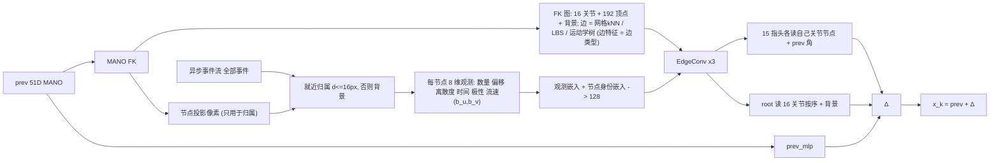
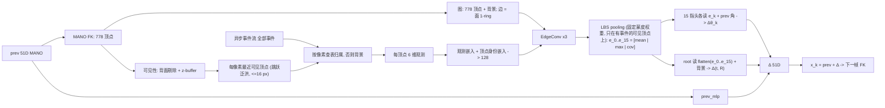

# S37 已结束实验记录（合并）

2026-10-03 把 S37 之后已经结束的 9 份预注册 / 记录合并成这一份。**每一份的原文原样保留**，只有三处机械改动：
每份的标题降一级并加 `[编号]` 前缀（让同名小节可以唯一寻址）；份与份之间的链接改成本文内的链接；
其他文档里对这些文件名的引用改成 `docs/S37_EXPERIMENT_RECORDS.md [编号]`。没有改动任何数字、判定或时间戳。
当前采用臂 `s37_routed` 的预注册 `docs/S37_ROUTED_READOUT_PREREG.md` 不在其中，仍是独立文件。
这些实验线的一句话结论、数字摘要和工程记录在 `docs/FAILURE_AND_CLEANUP_LEDGER.md` 的同日条目里。

| 编号 | 原文件 | 日期 | 内容与状态 |
|---|---|---|---|
| [FKGRAPH] | `S37_FKGRAPH_PREREG.md` | 2026-09-07 | FK 图（FK 是图、事件是观测、无几何支路）：递推 RA 22.10 对 S36 23.17，两种子方向相反，按预注册打平 |
| [MESHQ] | `S37_MESHQ_PREREG.md` | 2026-09-07 | 网格查询（prev 只以 FK 网格进入）：设计、门槛与判别探针；§6 结果、§7 判读原文即为"待填" |
| [MESHGRAPH] | `S37_MESHGRAPH_PREREG.md` | 2026-09-18 | 网格图（整张 MANO mesh 作图、LBS pooling）：递推 RA 24.89（20.48 / 29.30），两种子分裂，不过 |
| [ROOTINNOV] | `S37_ROOT_INNOVATION_PREREG.md` | 2026-09-29 | 根新息第一步（冻结骨干、只训根）：不过 |
| [ROTW] | `S37_ROTW_CNNROOT_PREREG.md` | 2026-09-29 | 旋转损失权重（A，打平）与绝对 CNN 根接入 S37（B，零训练） |
| [EDGE6] | `S37_EDGE6_ROOTFUSE_PREREG_20260929.md` | 2026-09-29 / 09-30 | EdgeConv 6 层与根头逐关节融合：两臂均在 ±1.1 mm 打平区间，不采纳 |
| [XYZ-CANDIDATE] | `S37_XYZ_CANDIDATE_20260929.md` | 2026-09-29 | XYZ 候选：推荐结构、信息检查与训练准入 |
| [XYZ-SCREEN] | `S37_XYZ_SCREEN_PREREG_20260929.md` | 2026-09-29 / 09-30 | XYZ 单种子 1500 步短训：未过追加资源门 |
| [XYZ-FULL] | `S37_XYZ_FULL_PREREG_20260930.md` | 2026-09-30 | XYZ C1 完整双种子 6000 步：未过精度采纳门，均值差 −0.7508 mm（打平） |

图片仍在 `docs/assets/`，用相对路径引用，没有变。

---

## [FKGRAPH] S37 FK 图（用户设计）：FK 就是图，事件是它的观测，无几何支路——预注册

> 原文件：`docs/S37_FKGRAPH_PREREG.md`（2026-10-03 并入本文，原文原样保留；取回：`git show 4fbb8e9:docs/S37_FKGRAPH_PREREG.md`）


> 2026-09-07。用户对 S37 的定义："上一状态 prev 51D MANO 生成 MANO FK 之后就足够了；然后和异步事件流一起经过图神经网络，
> 得到节点和边的信息以及变化信息；逐事件 token 去掉；不加节点几何/逆深度支路。"本文是这个定义的实现与预注册。
> 同日先做的 `s37_routed`（事件图 + 按 LBS 路由读出）与另一会话做的 `s37_meshq`（事件图 + 网格查询）都不是这个设计，
> 只作对照，不在本文范围内。门槛与假设在训练启动前写定（§4 有时间戳），§6 结果与 §7 判读训完后填。
>
> 协议：9 受试者 72 条序列训练（默认 `splits_semkine.json`），验证、选点、上报只用留出受试者 zgz 的两条序列（2590 帧），
> 50 ms 步长，固定 500 步网格，`tools/select_checkpoint.py` 递推 RA 选点，两种子 3407 / 3408。对照 = 现有 S36 zgz run。
>
> **结论（09-07 23:30）**：递推 RA 22.10 对 S36 23.17（−1.07，两种子方向相反）——按预注册**打平**；abs −11.6（root 平移解开）；
> 观测置零 +79 mm（承重）；延迟 −22%、FLOPs 1/10、参数 1/4。流速项无用（H6），root 旋转仍盲（H3）。详见 §6–§7。

---

### [FKGRAPH] 1. 设计（`semkine/fk_graph.py`，`MODEL.ENCODER: fk_graph`）

- **FK 只做两件事**：给出图，给出每个节点投影到哪个像素（只用于把事件分到节点）。FK 的几何量不进节点特征、不进边特征。
- **节点**（规格从 MANO 资产一次构建、固定）：16 个关节节点（LBS 权重归一化的表面质心，与关节头顺序一致）+ 192 个顶点节点
  （每个 LBS argmax 关节 12 个，静止姿态最远点采样，确定性）+ 1 个背景节点，N = 209。
- **边**（固定拓扑，`(209, 8)` 邻接表）：顶点↔顶点 静止姿态 3D kNN（k=6）；顶点→关节 LBS 行 top-2；关节↔关节 运动学树父子
  （`kintree_table`，双向）；背景↔腕与五个指根；关节←本关节权重最高的顶点补满 8。**边特征 = 边类型 one-hot（网格 / LBS / 运动学）**，
  恰为 `EdgeConv` 的 3 个边通道，直接复用 S36 的 `EdgeConv`。
- **节点特征 = 事件观测**（`assign_and_observe`，一次 `index_add_` 扫过**全部**事件，不子采样）：每个事件按像素找最近的 FK 节点
  （≤ 16 px，否则背景），每节点 8 维：`log1p(n)/log1p(N_包)`、平均偏移 (Δu, Δv)/r、偏移离散度/r、平均归一时间、极性均值、
  **局部流速 (b_u, b_v)**——该节点事件的 Δu ≈ a + b_u·t、Δv ≈ a + b_v·t 闭式最小二乘斜率（r 每包时长为单位，截断 ±4）。
  背景节点参考点 = 投影手心，尺度 4r。空节点全零。
- **编码**：8 维观测线性嵌入 + 可学习节点身份嵌入（209 × 128，只表达"我是哪个节点"）→ ReLU → EdgeConv × 3（残差）。
- **读出**：15 个手指头各读自己关节节点的 128 维特征 + 自身 prev 角 3 维（唯一事件通路，无旁路）；root 头读
  [16 个关节节点按序平铺 2048, 背景节点 128]；`prev_mlp` 支路与 `ZERO_EVENT_GATE` 照 S36（空包逐位返回 prev）。
- **与 S36 的差异**（`test_s37_fkgraph_config_diff_against_s36`）：`ENCODER`（event_gnn → fk_graph）、`PREV_RENDER`、四个 `FK_GRAPH_*`
  旋钮，以及不再适用的事件图旋钮（`ENCODER_FEAT/K/MAX_NODES/WINDOW/T_SCALE`）。训练、loss、噪声课程、网格、DDP：S36 逐字相同。
- **契约**（`tests/test_s37_fk_graph.py`，9 项）：每关节 ≥ 8 个顶点节点、邻接表无自环无越界、运动学边恰为树；事件归属正确；
  匀速合成事件的 (b_u, b_v) 复原真值；观测不含几何（同像素布局 → 同观测；节点输入维度 = 8）；手指头只读自己关节节点、
  root 读 16 关节 + 背景；空包逐位返回 prev；`ablate_evidence`（观测置零）与 `obs_feature_mask` 钩子生效；S36 键集不变；config diff 白名单。
- **成本**（单卡 512 包 60 步冒烟）：峰值显存 **2.78 GB**（S36 24.1），**0.65 s/it**（S36 约 0.9）；没有事件 kNN、没有逐事件 EdgeConv、
  没有 2048 节点上限，成本随事件数线性且常数很小。



### [FKGRAPH] 2. 预注册门槛（zgz，两种子）

S36 参照：递推 RA 两种子均值 **23.17**（3407 21.42 / 3408 24.92），abs 79.0，网格中位数 25.67 / 26.74，主行延迟 7.04 ms。

- **精度**：采纳需两种子均值 RA ≤ **22.07**（S36 − 1.1）且每个种子不劣于 S36 同种子；abs ≤ **81.0**。|Δ| < 1.1 判打平。
  同时报告对 `s37_routed`（20.74）的差，但它不是门槛。
- **机制门**：同一 checkpoint 上把全部观测置零（拓扑与身份嵌入保留，`model.ablate_evidence = True`），递推 RA 必须劣化 ≥ **1.5 mm**。
- **延迟**：同会话对测记录（预期低于 S36 的 7.04 ms）。
- 结果无论如何写入本文 §6 与账本 zgz 表；报告与 CNN+渲染+域随机化基线（11.9–13.3）的距离。

### [FKGRAPH] 3. 命令

```bash
python -m pytest tests/test_s37_fk_graph.py -q                              # 9 项契约
nohup tools/run_zgz_protocol.sh s37_fkgraph > logs/run_s37_fkgraph_outer.log 2>&1 &
python tools/make_s36_row.py --run s37_fkgraph                              # 主行
CUDA_VISIBLE_DEVICES=6 python tools/run_closed_loop_probe.py --split val_core --out outputs/semkine/closed_loop_s36_s37fkgraph.json \
    --arm s36_3407=<ckpt>:configs/semkine/s36_eventgnn_s3407.yaml --arm s37_3407=<ckpt>:configs/semkine/s37_fkgraph_s3407.yaml \
    --arm s36_3408=<ckpt>:configs/semkine/s36_eventgnn_s3407.yaml --arm s37_3408=<ckpt>:configs/semkine/s37_fkgraph_s3407.yaml
CUDA_VISIBLE_DEVICES=6 python tools/probe_s37_fkgraph.py --runs outputs/semkine/s36_eventgnn_s3407 outputs/semkine/s36_eventgnn_s3408 \
    outputs/semkine/s37_fkgraph_s3407 outputs/semkine/s37_fkgraph_s3408 --out outputs/semkine/probe_s37_fkgraph.json
```

### [FKGRAPH] 4. 变更记录

- 09-07 20:00–20:13：实现、9 项契约、全套 pytest（334 通过 2 跳过）、单卡冒烟；本文 §1–§5 写定。
- 09-07 20:13：训练启动，两种子并行（3407 在 GPU 6,7；3408 在 GPU 4,5），1.7 it/s，`cuda_max_mem` 4.9 GB。
- 09-07 20:46 → 21:16：**两种子在 step 3378 同时卡死**，NCCL allreduce 30 分钟超时后进程被 watchdog 杀掉（`logs/s37_fkgraph_s340{7,8}.log`
  第 689–694 行）。两个独立进程在同一步同时挂，机器无 OOM 记录，同一步正是 step 3000 验证结束、恢复训练之后不久，
  最可能是 DDP 两 rank 在验证边界上的集合通信错位（本臂前向里没有任何依赖 rank 的分支）。**处置**：给 `semkine/train.py`
  加 `--resume`（Lightning `ckpt_path`，恢复模型 / 优化器 / 调度器 / global_step），两种子分别从各自 `last.ckpt`（step 3000）
  以**单卡 batch 1024** 续训到 6000（有效 batch 与 2 × 512 相同，LR 不变；`training_metadata_phase1_ddp2x512.json` 保留第一阶段元数据）。
  21:31 → 22:30 续训完成。step ≤ 3000 的六个 checkpoint来自 DDP 阶段、step ≥ 3500 来自单卡阶段，两阶段的有效 batch 与学习率一致。
- 09-07 22:31 → 22:38 选点；主行复现时 3408 的 RA 与选点相差 **0.0755 mm**，超出 0.05 mm 的复现门。根因：`assign_and_observe`
  用 float32 `index_add_` 做逐节点求和，原子加的求和顺序随机，~1e-7 的抖动被递推回路放大。修复：float64 累加再转 float32
  （`_segment_sums`，5 次运行逐位相同，3M 事件 1 ms）。**重新选点**（`selection_val_core_step50_fp32atomics.json` 保留旧结果）：
  两种子选中的 step 不变（2000 / 1500），RA 22.6676 → 22.6354、21.4916 → 21.5609，复现漂移 0.0000。
- 09-07 23:04 → 23:30：主行、`run_closed_loop_probe.py`、`probe_s37_fkgraph.py`、同会话延迟对测跑完（§6）。

### [FKGRAPH] 5. 本质原因：六个预注册假设与判别探针

在 S37 / S36 各两种子的选中 checkpoint、同一批 zgz 窗口上跑（`tools/probe_s37_fkgraph.py`；TF/递推拆分复用 `run_closed_loop_probe.py`）。

| 假设 | 测什么 | 成立的判据 |
|---|---|---|
| **H1** 噪声课程把归属打坏，头学会忽略观测 | 归属召回（落入 16 px 带内的事件比例）与纯度（归属节点所属关节 = 按 GT-prev 归属的关节的比例）在 prev = GT / 课程小噪声 / 课程大噪声 / 闭环自预测 四种条件下；观测置零与换事件后的输出位移 | 大噪声下召回 < 0.5，且观测置零 RA 变化 < 1.5 mm |
| **H2** 状态条件归属在闭环自我放大（KEG 的死法） | TF 单步 RA 对递推 RA 的放大率（S36 2.58）；**oracle 归属**：闭环里事件按 GT prev 归属，其余一切自预测 | 放大率 > S36 × 1.2，或 oracle 归属收回 S37−S36 差距一半以上 |
| **H3** root 盲 | abs 误差分解为腕平移 / 全局旋转 / 手指；事件固定、prev 平移 36 mm 与绕 x/y/z 转 10° 时 root 头自身的响应增益（S36 0.32 / ≤ 0.06） | 旋转增益 ≥ 0.3 → 流速观测解开了旋转盲 |
| **H4** 学到的映射不跨受试者 | TF 单步 RA 在 4 条训练序列与 zgz 两条上的差（S36 0.48） | S37 差 ≥ S36 × 1.5 |
| **H5** 头过冲 | TF 的 `update_ratio_pose` / `alignment_pose`（S36 0.96 / 0.25） | update_ratio > 1.3 或 alignment < S36 |
| **H6** 观测充分性 | 同一 checkpoint 用 `obs_feature_mask` 分别只留 (b_u, b_v) 流速、只留计数与偏移、全部观测，测 TF 单步 RA 与闭环 RA | 若只留计数与偏移就与全部相当 → 流速项无用 |

**判读规则（预先写死）**：H2 成立 → 状态条件归属在此形态下自放大，回到路由读出；H3 旋转增益 ≥ 0.3 → 流速观测解开了 root 旋转盲；
H6 若只靠计数与偏移就够 → 流速项可删；若精度门槛通过且机制门通过 → 采纳。

### [FKGRAPH] 6. 结果（2026-09-07 23:30，两种子，zgz 两条序列 2590 帧）

产物：`outputs/semkine/s37_fkgraph_s340{7,8}/selection_val_core_step50.json`、`s37_fkgraph_main_row.json`、
`closed_loop_s36_s37fkgraph.json`、`probe_s37_fkgraph.json`、`latency_ab_s37fkgraph_vs_s36.json`；日志 `logs/s37_fkgraph_*`、
`row_s37_fkgraph_zgzproto.log`、`closed_loop_s36_s37fkgraph.log`、`probe_s37_fkgraph.log`。结构图 `docs/assets/s37_fkgraph_simple.png`。

| | S36 3407 / 3408（均） | S37 fkgraph 3407 / 3408（均） | 门槛 | 判定 |
|---|---|---|---|---|
| 递推 RA（选点） | 21.42 / 24.92（**23.17**） | 22.64 / 21.56（**22.10**） | 均值 ≤ 22.07 且逐种子不劣 | **不过**（−1.07；3407 劣 +1.22，3408 优 −3.36）——按 \|Δ\| < 1.1 判**打平** |
| abs MPJPE | 78.9 / 79.0（79.0） | 58.9 / 75.8（**67.4**） | ≤ 81.0 | 过（−11.6） |
| local / global RA（两种子均） | 28.43 / 18.60 | 30.92 / **14.43** | — | global −4.2，local +2.5 |
| MPVPE-local / global | 24.26 / 15.00 | 26.47 / 11.59 | — | |
| 选中 step；网格中位数（spread） | 4000 / 5000；25.67（8.0）/ 26.74（9.0） | 2000 / 1500；26.80（9.0）/ 26.76（6.1） | — | 网格中位数与 S36 相同；早期 checkpoint 最好，后半网格 27–31 |
| 机制门：观测置零后闭环 RA | — | 101.1（113.2 / 89.1），abs 300+ | 劣化 ≥ 1.5 | **过**（+79 mm：没有观测就是开环漂移） |
| 主行：延迟 / FLOPs / 参数 | 7.04 ms / 0.827 G / 0.95 M | **5.38 ms** / **0.084 G** / **0.23 M** | 记录 | 同会话对测 5.81 → 4.51 ms（**−22%**），FLOPs 1/10，参数 1/4 |

**判定：精度打平（−1.07，差 0.03 mm 没过采纳线，且两种子方向相反），机制门过，成本大幅下降。** 与 CNN+渲染+域随机化基线（11.9–13.3）仍差约 9 mm。

#### [FKGRAPH] 探针读数（`probe_s37_fkgraph.py`、`run_closed_loop_probe.py`，两种子均）

| 量 | S36 | S37 fkgraph | 读法 |
|---|---|---|---|
| TF 单步 RA / 递推 RA / 放大率 | 9.17 / 23.21 / 2.58 | 9.05 / 22.10 / 2.44 | 单步相同、放大率略低，都在噪声内 |
| 观测置零：TF / 闭环 | — | 13.0（+3.9）/ 101（+79） | 观测承重；置零后 = 只靠 prev_mlp 与身份嵌入的开环 |
| **oracle 归属**（GT prev 归属，其余自预测）闭环 RA / abs | — | **51.2**（38.6 / 63.8）/ 300+ | 用"正确"的归属反而崩掉：观测里的偏移与流速是**相对 prev 节点**量的，换成 GT 节点后它们就不再描述 prev 的误差，网络读到的是自相矛盾的观测 |
| 归属召回 / 纯度 @ GT · 小噪声 · 大噪声 · 闭环 | — | 0.94/1.00 · 0.94/0.75 · **0.65/0.22** · 0.95/0.68 | 与路由读出臂相同的形状：大噪声课程下归属接近乱派 |
| H6 只留流速 (b_u, b_v)：TF / 闭环 | — | 13.0 / 101 | 与置零无异：流速**单独**不携带任何可用信息 |
| H6 只留计数 + 偏移：TF / 闭环 | — | 13.1 / 29.1 | 计数 + 偏移就撑起大半闭环 |
| H6 去掉流速（其余 6 维）：TF / 闭环 | — | 9.00 / **22.20** | 与全部 8 维（9.05 / 22.10）相同：**流速项没有贡献** |
| 腕平移 p50 / p90 | 64.4 / 118 | **46.4** / 112 | 平移改善 18 mm，是 abs −11.6 的来源 |
| 全局旋转 p50 / p90 | 12.0° / 18.2° | **9.5°** / 20.0° | 中位数改善 2.5°，尾部没变 |
| root 头响应增益：平移 36 mm / 旋转 x, y, z 10° | 0.32 / 0.02, 0.00, 0.06 | **0.90** / 0.03, 0.11, **0.19** | 平移近乎全响应；旋转仍 < 0.3，H3 的门没过 |
| 事件依赖度（换事件位移 / 真实步进） | 7.40 | **10.9** | 输出对证据更敏感 |
| 姿态更新比 / 方向余弦（TF） | 0.96 / 0.25 | 1.01 / 0.25 | 相同：方向一致性只有 0.25 |
| TF RA：训练序列均值 → zgz（差） | 8.69 → 9.17（0.48） | 8.60 → 9.05（0.45） | 跨受试者差距与 S36 相同 |

### [FKGRAPH] 7. 判读

按 §5 预先写死的规则：

- **H1**（课程打坏归属 → 头忽略观测）：前半成立（大噪声下召回 0.65、纯度 0.22），后半不成立（置零 +79 mm）。与路由读出臂一样。
- **H2**（状态条件归属自放大）：**不成立**。放大率 2.44 < S36 2.58；oracle 归属让闭环从 22.1 变成 51.2，不是"收回差距"而是崩掉——
  但这一崩不是 KEG 式的回灌，而是观测的**参照系**问题（见下）。
- **H3**（root 盲）：平移解开了（增益 0.32 → 0.90，腕误差 64 → 46 mm，abs −11.6），旋转没有（增益 ≤ 0.19，门槛 0.3）。
- **H4**（跨受试者）：不成立，差距 0.45 与 S36 的 0.48 相同。
- **H5**（过冲）：不成立，更新比 1.01、余弦 0.25 与 S36 相同。
- **H6**（观测充分性）：**流速项无用**——去掉它 TF/闭环都不变，只留它等于置零。计数 + 偏移承担了全部。

**本质原因。** 这个设计把渲染比较翻了个面：S36 在事件像素上读"prev 画出来的手在不在这里"，本臂在 prev 的表面点上读
"事件落在我周围哪里、有多少"。两者信息量相当，所以单步精度相同（9.05 对 9.17）。它赢在 **root 平移**：每个节点的平均偏移
(Δu, Δv) 就是该表面点到事件的位移，200 个节点按关节顺序平铺进 root 头，等于把整只手的位移场原样交给了 root——S36 的全局
池化把这个场平均掉了。它输在**手指**（local +2.5）：手指的观测被"该节点附近有没有事件"主导，事件稀疏时（16 px 带内平均只有几十个
事件）8 维汇总丢掉了 S36 事件图里保留的局部形状。旋转仍读不出来：绕腕旋转在偏移场里是反对称的，root 头是线性层直接读
2048 维，理论上可解，但训练课程里 0.3 rad 的旋转总伴随 50 mm 平移与大幅手指噪声（上一轮已测过的 H7），旋转分量在训练分布里
不可读，这次也没变。**流速 (b_u, b_v) 在 50 ms 包内没有信息**：真实每步运动只有约 5.8 mm（几个像素），单节点的事件在时间上的
线性拟合被噪声淹没，"变化信息"在这个时间尺度上不存在于单节点内，只存在于跨包的 prev → 事件偏移里——而那正是偏移项已经给出的。

oracle 归属崩掉的机制值得单独记：观测是相对 prev 节点像素量的，把节点换到 GT 位置后偏移变成"GT 到事件"（≈ 0），网络却按
"prev 到事件"解读，于是把零偏移当成"prev 就是对的"、不再纠偏，闭环漂移。这说明本臂的机制是**读 prev 与事件的差**——正确的
状态条件化——而不是读 prev 本身；也说明它没有走捷径。

**成本**是本轮最实在的收益：同会话延迟 −22%（5.81 → 4.51 ms），FLOPs 0.084 G（S36 的 1/10），参数 0.23 M（1/4），显存 4.9 GB
（1/5），且不再有 2048 节点上限——事件数增加只多一次 `index_add`。

**留给后续的约束**：(1) 流速项可删（H6），观测退回 6 维；(2) 手指精度是这个形态的短板，可考虑每关节多于 12 个顶点节点或
把 S36 的局部事件图只保留在指尖节点周围；(3) root 旋转仍是整条线共有的未解问题，与观测形态无关，需要课程或读出层面的改动。
两种子方向相反（3407 劣 1.2、3408 优 3.4）且最佳 checkpoint 都在前 2000 步，后半网格退化到 27–31，说明训练后期在过拟合训练受试者
的偏移分布，早停或更强的域随机化是下一个可测的单变量。

---

## [MESHQ] S37 网格查询（用户设计）：prev 只以 FK 网格进入，网格读事件图、驱动关节——预注册

> 原文件：`docs/S37_MESHQ_PREREG.md`（2026-10-03 并入本文，原文原样保留；取回：`git show 4fbb8e9:docs/S37_MESHQ_PREREG.md`）


> 2026-09-07。这是用户明确要求的 S37 设计（"prev 生成 MANO FK 就足够了；事件建图得到节点和边信息，再去驱动 FK 变化；
> 逐事件 token 去掉"）。之前同日的 `s37_routed`（事件按 LBS 路由到关节、prev 还走 prev_mlp 与关节头）不是用户的设计，
> 作为中间记录保留在 `S37_ROUTED_READOUT_PREREG.md`。门槛与假设在训练启动前写定；§6 结果与 §7 判读训完后填。
>
> 协议：9 受试者 72 条序列训练（默认 `splits_semkine.json`），验证、选点、上报只用留出受试者 zgz 的两条序列（2590 帧），
> 50 ms 步长，固定 500 步网格，`tools/select_checkpoint.py` 递推 RA 选点，两种子 3407 / 3408。对照：现有 S36 zgz run
> 与同日的 `s37_routed`，都不重训。

---

### [MESHQ] 1. 设计（`semkine/mesh_query.py`，`MODEL.MESH_QUERY`）

- **prev 只以 FK 网格进入。** `PREVPOS_EMBED: false`（无 prev_mlp），关节头不读 prev 角，节点上无渲染通道。网络里出现 prev 的唯一地方
  是 MANO FK 之后的 778 个顶点及其投影。
- **事件直接建图，无 token。** 节点属性只有事件本身 `(x, y, p, t)`（`ENCODER_NODE_ATTRS: raw4`；S36 的 token 还有 log 事件间隔与两个
  SAE 派生量），因果 k-NN（前 32 里取 k=8，≤2048 节点）、EdgeConv×3 与 S36 相同；不建全局池化读出（DDP 不允许无梯度参数）。
  消息传递后得到节点特征 `h_i`（128）和每节点**边摘要** `g_i = [mean(dx, dy, dt), mean|dp|]`——图自己对局部运动的读数。
- **网格读图。** 192 个固定查询顶点（每关节 12 个，按主导蒙皮权重分层选取，确定性），投影到事件帧；每个**可见**查询顶点
  （被 3 px 内更近的顶点遮挡即剔除）用固定核 `w_qi = softmax(−d²/2·8²)`，只在 16 px 带内的活节点上，聚合
  `v_q = [Σw h_i ‖ Σw g_i ‖ Σw (p_i − u_q)/16 ‖ mass_q]`（137 维）。核宽是常数：S38 的可学习 σ 被课程摊到 365 px，
  KEG 的学习路由把回路增益推到 0.91，这里没有任何参数可被优化器用来放宽。
- **驱动关节。** 蒙皮权重把顶点证据带到关节：`e_j = Σ_q W[q,j]·has_q·v_q / Σ_q W[q,j]·has_q`，`cov_j = 该关节表面被看见的比例`；
  关节头 k 只读 `e_{k+1}`（138 维，含 cov），输出乘 `1[cov_{k+1} > 0]`——**表面没有事件的关节不动**（逐关节的零事件恒等）；
  root 头读 `[网格聚合 138, e_0..e_15 按关节顺序平铺]`，乘 `1[任一关节被看见]`。空包 → 一切为零 → 逐位返回 prev。
- 与 S36 的差异（`test_s37_meshq_config_diff_against_s36`）：`PREV_RENDER`、`PREVPOS_EMBED`、`ENCODER_NODE_ATTRS`、`MESH_QUERY`（+3 旋钮）。
  其它一切（采样、图、EdgeConv、loss、课程、网格、DDP）S36 逐字相同。
- 契约（`tests/test_s37_meshq.py`，8 项）：查询集每关节等量；核只在带内且剔除被遮挡顶点；未被看见的关节证据与覆盖恰为零；
  解码器门控（未观测关节 Δ 恰为零）、无旁路（关节 k 只对 e_{k+1} 有梯度，root 读全部）；prev 只经 FK 进入（无 prev_mlp、头不读 prev 角、
  节点 4 维、无池化读出）；空包逐位返回 prev；`ablate_evidence`（"网格什么都没看见"）退化为输出 = prev。
- 冒烟（单卡 512 包 60 步）：峰值显存 23.9 GiB（S36 24.1），约 0.97 s/it。

```mermaid
flowchart LR
  prev[prev 51D] --> fk[MANO FK 778 顶点 投影]
  fk --> q[192 个可见查询顶点]
  ev["异步事件流 (x,y,t,p)"] --> graph["建图 kNN + EdgeConv x3 无 token 无渲染"]
  graph --> h[节点特征 h_i]
  graph --> g["边摘要 g_i = mean(dx,dy,dt)"]
  h --> gather["固定核聚合 v_q = [h, g, 偏移, mass]"]
  g --> gather
  q --> gather
  gather --> lbs["蒙皮权重 -> 关节证据 e_j, 覆盖 cov_j"]
  lbs --> heads["关节头 k 读 e_k+1 x 1[cov>0]; root 读网格聚合 + 16 证据"]
  heads --> delta[Δθ]
  delta --> out[x_k = prev + Δ]
```

### [MESHQ] 2. 预注册门槛（zgz，两种子）

参照：S36 递推 RA **23.17**（21.42 / 24.92），abs 79.0；`s37_routed` **20.74**（19.23 / 22.26），abs 75.8。

- **精度**：对 S36 采纳需两种子均值 RA ≤ 22.07 且逐种子不劣于 S36 同种子，abs ≤ 81。与 `s37_routed` 的比较只记录，|Δ| < 1.1 判打平。
- **机制门**：`ablate_evidence`（网格什么都没看见 → 输出 = prev，即"不动"基线）的闭环 RA 必须比正常闭环差 ≥ 1.5 mm。
- 无论结果如何写入本文 §6 与账本；同时报告与 CNN+渲染基线（11.9–13.3）的距离。

### [MESHQ] 3. 命令

```bash
python -m pytest tests/test_s37_meshq.py -q
nohup tools/run_zgz_protocol.sh s37_meshq > logs/run_s37_meshq_outer.log 2>&1 &
python tools/make_s36_row.py --run s37_meshq
CUDA_VISIBLE_DEVICES=6 python tools/run_closed_loop_probe.py --split val_core --out outputs/semkine/closed_loop_s37meshq.json \
    --arm s37m_3407=<ckpt>:configs/semkine/s37_meshq_s3407.yaml --arm s37m_3408=<ckpt>:configs/semkine/s37_meshq_s3407.yaml
CUDA_VISIBLE_DEVICES=6 python tools/probe_s37_route.py --runs outputs/semkine/s36_eventgnn_s3407 outputs/semkine/s36_eventgnn_s3408 \
    outputs/semkine/s37_meshq_s3407 outputs/semkine/s37_meshq_s3408 --out outputs/semkine/probe_s37_meshq.json
```

### [MESHQ] 4. 变更记录

- 09-07 下午：实现、8 项契约、冒烟；本文写定；训练启动时间见 §6。

### [MESHQ] 5. 本质原因：预注册假设与判别探针（`tools/probe_s37_route.py`，对本臂同样适用）

| 假设 | 测什么 | 成立的判据 |
|---|---|---|
| **H1** 课程大噪声下网格看不到正确的节点，头学会少动 | 节点→关节责任（注意力质量按蒙皮权重分配）的召回/纯度在 prev = GT / 小噪声 / 大噪声 / 闭环 四种条件；证据置零（= 不动基线）与换事件后的位移 | 大噪声召回 < 0.5，且正常闭环对"不动"基线的优势 < 1.5 mm |
| **H2** 网格对图的状态条件读取在闭环自放大 | 放大率对 S36（2.58）与 `s37_routed`（2.12）；oracle 几何（GT prev 做网格、其余自预测） | oracle 收回对 S36 差距的一半以上，或放大率 > 2.6 |
| **H3** root 盲 | 腕平移 / 全局旋转分解；prev 平移 36 mm、旋转 10° 时 root 头自身响应增益（本臂无 prev_mlp，响应全部来自网格读数） | 旋转增益 < 0.3 且腕误差 ≥ S36 + 5 mm |
| **H4** 不跨受试者 | 4 条训练序列与 zgz 的 TF 单步差 | 差 ≥ S36 的 1.5 倍 |
| **H5** 过冲 | `update_ratio_pose` / `alignment_pose` | update_ratio > 1.3 或 alignment < S36 |

额外要回答的（本臂特有）：去掉 prev_mlp 与关节头的 prev 角之后，root 与手指的更新是否仍能表达"prev 的姿态先验"——若闭环旋转 p50 明显
劣于 S36 的 12°，读作先验缺失；若 TF 单步差不多而闭环更差，读作"没有 prev_mlp 的阻尼"。

### [MESHQ] 6. 结果（待填）

### [MESHQ] 7. 判读（待填）

---

## [MESHGRAPH] S37 网格图（用户手绘图，09-18）：prev 的整张 MANO mesh 就是图，事件是它的观测，LBS pooling 汇到 16 关节——预注册与结果

> 原文件：`docs/S37_MESHGRAPH_PREREG.md`（2026-10-03 并入本文，原文原样保留；取回：`git show 4fbb8e9:docs/S37_MESHGRAPH_PREREG.md`）


> 2026-09-18。用户的手绘图：prev →FK→ 778 顶点 mesh 作节点 ⇐ 当前事件 → 图卷积 → mesh 特征图 → LBS pooling → 16 关节特征 →
> 回归 Δ → ⊕ prev → 下一帧 prev → FK → …。图里的状态写作"关节点绝对坐标"，实现时按讨论改读为 **51D MANO 参数**
> （`[t3, R3, residual45]`）：MANO FK 的输入是旋转 + 根平移，绕骨轴的 twist 在关节位置里不可观测，用关节位置做状态必须再加 IK。
> 门槛在训练启动前于对话中写定（对 `s37_fkgraph` 22.10 与 `s37_routed` 20.74，观测置零 ≥ 1.5 mm），本文是它的实现记录与结果。
> 预测（训练前）：TF 单步 ≈ 9 mm，闭环 RA 20–22，手指（local）改善，root 旋转不改善。
>
> 协议：9 受试者 72 条序列训练（`splits_semkine.json`），验证、选点、上报只用留出受试者 zgz 的两条序列（2590 帧），50 ms 步长，
> 固定 500 步网格，`tools/select_checkpoint.py` 递推 RA 选点，两种子 3407 / 3408。对照 = `s37_fkgraph`（同一族，只差节点 / 边 / pooling）。
>
> **结论（09-18 15:30）**：递推 RA **24.89**（3407 **20.48** / 3408 29.30）对 fk_graph 22.10、routed 20.74——两种子分裂，按门槛**不过**。
> 3407 是 GNN 线单种子最好的点之一，TF 单步 8.07 是全线最低；3408 崩在 **root 旋转**：闭环全局旋转中位数 28° 对 3407 的 16°，
> 而两种子的**手指关节（旋转对齐后）误差相同**（17.9 / 18.4，fk_graph 24.7 / 26.2）。整张网格的 RA 与旋转误差相关 0.96、与手指误差相关 −0.01：
> 这一臂的不稳定全部来自 root 旋转读出。机制门过（观测置零 +22.6 / +27.4 mm）。延迟 11.99 ms（fk_graph 5.38），FLOPs 0.314 G，参数 0.44 M。

---

### [MESHGRAPH] 1. 设计（`semkine/mesh_graph.py`，`MODEL.ENCODER: mesh_graph`，`configs/semkine/s37_meshgraph_s3407.yaml`）

- **节点** = prev 经 MANO FK 的 778 个姿态顶点（资产顺序）+ 1 个背景节点，N = 779。**边** = 网格面片的 1-ring（双向，最大度 8），
  边特征只有边类型（`E_MESH`）；背景节点无边，只经 root 头进入输出。没有运动学树边、没有全局节点（与 fk_graph 的差别之一，见 §7）。
- **事件 → 节点**（`_mesh_graph_forward`）：先做可见性——背面剔除（面法向 float64 累加，与 `_segment_sums` 同一条复现纪律）+ 点溅 z-buffer
  （3×3 px 窗、1 cm 深度容差，`visible_vertices`）；再用跳跃泛洪建每像素最近可见顶点查找表（≤ 16 px，否则背景，`nearest_node_lut`，O(HW)，
  与事件数、节点数无关）；事件按像素查表归属，`assign_and_observe` 逐节点汇总 **6 维**观测（计数份额、平均偏移 (Δu, Δv)/r、偏移离散度、
  归一时间、极性；流速 (b_u, b_v) 按 fk_graph H6 去掉，`MESH_GRAPH_OBS_FLOW: true` 可恢复）。观测里没有任何几何量（与 fk_graph 同一条法则）。
- **编码**：6 维观测线性嵌入 + 可学习节点身份嵌入（779 × 128）→ ReLU → `EdgeConv` × 3（残差），复用 S36 的层。
- **LBS pooling**（`lbs_pool_evidence`，固定蒙皮权重，优化器动不了）：
  `e_j = [ Σ_v W_vj·has_v·h_v / Σ_v W_vj·has_v ‖ max_{v: argmax W_v = j, has_v} h_v ‖ cov_j = Σ_v W_vj·has_v / Σ_v W_vj·vis_v ]`，257 维；
  只在看见事件的顶点上池化，没看见事件的关节证据恰为零。
- **读出**：关节头 k 读 `[e_{k+1} ‖ 自己的 prev 角]` → Δθ_k（3 维 AA）；root 头（单层线性）读 `[flatten(e_0..e_15) (4112) ‖ 背景节点 (128)]` → Δ(t, R)。
  `prev_mlp` 旁路与 `ZERO_EVENT_GATE` 照 fk_graph / S36。**对 fk_graph 只差节点、边、pooling 三处**（`test_s37_meshgraph_config_diff_against_fkgraph` 锁定）。
- **契约**（`tests/test_s37_mesh_graph.py`，12 项）：图 = 每个顶点的面 1-ring；z-buffer 同像素只留近者；背面剔除随面法向；真实手约一半顶点被隐藏；
  事件到不了隐藏节点；查找表与暴力最近点一致、出帧事件到背景；观测 6 维（带流速 8 维）；LBS pool = 观测顶点上的蒙皮加权均值；
  手指头只读自己的证据、root 读全部；空包逐位返回 prev；端到端前向与 `ablate_evidence` / `obs_feature_mask` 钩子；config diff 白名单。
  另 fk_graph 的 9 项契约确认 `assign_and_observe` 新增的 `node_mask` / `assign_pre` 不改变旧行为。
- **成本**（训练，2 × 512 DDP bf16）：1.5 it/s，每卡峰值显存 **9.0 GB**（fk_graph 4.9，S36 24）。



### [MESHGRAPH] 2. 预注册门槛（zgz，两种子；训练前于对话中写定）

- **精度**：报告对 `s37_fkgraph`（22.10；22.64 / 21.56）与 `s37_routed`（20.74；19.23 / 22.26）的差；采纳需两种子均值优于 fk_graph 且逐种子不劣。
- **机制门**：同一 checkpoint 观测与 `has` 置零（`model.ablate_evidence = True`），递推 RA 劣化 ≥ **1.5 mm**。
- **成本**：主行方法记录延迟 / FLOPs / 参数。
- 结果无论如何写入本文与账本 zgz 表，并报告到 CNN+渲染+域随机化基线（11.9–13.3）的距离。

### [MESHGRAPH] 3. 命令

```bash
python -m pytest tests/test_s37_mesh_graph.py tests/test_s37_fk_graph.py -q                 # 12 + 9 项契约
nohup tools/run_zgz_protocol.sh s37_meshgraph > logs/run_s37_meshgraph_outer.log 2>&1 &
python tools/make_s36_row.py --run s37_meshgraph                                             # 主行
python tools/make_s37_meshgraph_figure_simple.py                                             # 结构图 docs/assets/s37_meshgraph_simple.png
python tools/make_s37_meshgraph_figure.py                                                    # 详细版 docs/assets/s37_meshgraph.png
CUDA_VISIBLE_DEVICES=6 python tools/run_closed_loop_probe.py --split val_core --prev-noise 0.5,1,2,4 \
    --out outputs/semkine/closed_loop_s37meshgraph_vs_fkgraph.json \
    --arm mg_3407=outputs/semkine/s37_meshgraph_s3407/s37_meshgraph_s3407-step=3000.ckpt:configs/semkine/s37_meshgraph_s3407.yaml \
    --arm mg_3408=outputs/semkine/s37_meshgraph_s3408/s37_meshgraph_s3408-step=5000.ckpt:configs/semkine/s37_meshgraph_s3407.yaml \
    --arm fk_3407=outputs/semkine/s37_fkgraph_s3407/s37_fkgraph_s3407-step=2000.ckpt:configs/semkine/s37_fkgraph_s3407.yaml \
    --arm fk_3408=outputs/semkine/s37_fkgraph_s3408/s37_fkgraph_s3408-step=1500.ckpt:configs/semkine/s37_fkgraph_s3407.yaml
CUDA_VISIBLE_DEVICES=4 python tools/probe_s37_meshgraph.py --grid --seq zgz_local --out outputs/semkine/probe_s37_meshgraph_rotdecomp.json \
    --runs outputs/semkine/s37_meshgraph_s3407 outputs/semkine/s37_meshgraph_s3408 outputs/semkine/s37_fkgraph_s3407 outputs/semkine/s37_fkgraph_s3408
```

### [MESHGRAPH] 4. 变更记录

- 09-18 上午：实现、12 项契约、单卡冒烟（B = 512：可见顶点 ≈ 50%，落入带内事件 ≈ 75%，每包有事件的顶点 ≈ 37%，命中关节 15.7 / 16）。
- 09-18 11:28：训练启动，两种子并行（3407 在 GPU 6,7；3408 在 GPU 4,5），1.5 it/s，`cuda_max_mem` 9.0 GB。12:33 训完，12:38 选点完成（`ZGZ_PROTOCOL_DONE`）。
- 09-18 训练中：审查发现 `facing_camera` 用 float32 `index_add_` 累加顶点法向，CUDA 原子加顺序随机，掠射角顶点的可见性可能在两次运行间翻转
  （fk_graph 踩过的 0.0755 mm 复现漂移同源）。改为 float64 累加再比较（`semkine/mesh_graph.py`）；256 个随机状态 × 40 万事件 5 次运行，
  `vis` / `lut` / `obs` / 证据逐位相同。改动只影响 1e-7 量级的边界；选点与主行都在修复后运行，主行复现漂移 **0.0000 mm**（两种子）。
- 09-18 14:40：`tools/make_s36_row.py` 的 `macs_s36` 只认 `fk_graph` 的按节点观测输入，给 `mesh_graph` 补了同一分支（root 头维度 16 × 257 + 128）。
- 09-18 14:35 → 15:30：主行、闭环探针（含 prev 噪声扫描）、机制门、旋转 / 手指分解（新工具 `tools/probe_s37_meshgraph.py`）。

### [MESHGRAPH] 5. 预注册假设

| 假设 | 测什么 | 判据 |
|---|---|---|
| **H1** 778 顶点的位移场分辩率改善手指 | 闭环与 TF 的手指误差（21 关节 Kabsch 旋转对齐后的残差，`ra_rotaligned`），对 fk_graph | 手指误差低于 fk_graph 且两种子一致 |
| **H2** 可见性条件归属让闭环放大更严重 | TF 单步 RA / 递推 RA 放大率（fk_graph 2.44，S36 2.58）；小噪声下证据的相对变化、可见性翻转比例 | 放大率 > 2.9，或证据对 prev 扰动的相对变化远大于 fk_graph 的关节节点 |
| **H3** root 旋转不改善 | 闭环全局旋转 p50 / p90（Kabsch 角），对 fk_graph | 不劣于 fk_graph 即为"不改善但不恶化" |
| **H4** 机制承重 | 观测置零后闭环 RA | 劣化 ≥ 1.5 mm |

### [MESHGRAPH] 6. 结果（2026-09-18，两种子，zgz 两条序列 2590 帧）

产物：`outputs/semkine/s37_meshgraph_s340{7,8}/selection_val_core_step50.json`、`s37_meshgraph_main_row.json`、`closed_loop_s37meshgraph_vs_fkgraph.json`、
`probe_s37_meshgraph_rotdecomp.json`（`probe_s37_meshgraph_{sensitivity,local_trajectory,rot_decomp,grid_decomp}.json` 为同批临时探针的原始读数）；
日志 `logs/s37_meshgraph_*`、`row_s37_meshgraph_zgzproto.log`、`closed_loop_s37meshgraph.log`、`probe_s37_meshgraph.log`。
结构图 `docs/assets/s37_meshgraph_simple.png`（流程条模板，与 `s37_fkgraph_simple.png` 同款，橙框 = 相对 FK 图的改动；
`tools/make_s37_meshgraph_figure_simple.py`）与 `docs/assets/s37_meshgraph.png`（详细版，`tools/make_s37_meshgraph_figure.py`）；
画布上的数字全部从 config、模型与 JSON 读取。

| | fk_graph 3407 / 3408（均） | **meshgraph 3407 / 3408（均）** | 门槛 | 判定 |
|---|---|---|---|---|
| 递推 RA（选点） | 22.64 / 21.56（22.10） | **20.48** / 29.30（**24.89**） | 均值优于 22.10 且逐种子不劣 | **不过**（+2.79；3407 −2.16，3408 +7.74） |
| abs MPJPE | 58.9 / 75.8（67.4） | 55.6 / 62.3（59.0） | — | −8.4 |
| local / global RA（两种子均） | 30.92 / 14.43 | 36.32 / 14.96 | — | global 相同；local 3407 **25.80**（−5.1）、3408 46.85 |
| MPVPE-local / global | 26.47 / 11.59 | 27.63 / 11.69 | — | |
| 选中 step；网格中位数（spread） | 2000 / 1500；26.80（9.0）/ 26.76（6.1） | 3000 / 5000；27.92（**14.3**）/ 37.77（**26.3**） | — | 网格 spread 是 fk_graph 的 1.6–4 倍 |
| TF 单步 RA / 递推 / 放大率 | 9.24 / 22.62 / 2.45；8.87 / 21.57 / 2.43 | **8.07** / 20.25 / 2.51；10.32 / 29.54 / **2.86** | — | 3407 单步全线最低；3408 单步差 28%、放大率也高 |
| 机制门：观测置零后闭环 RA | 101（+79） | 42.8（**+22.6**）/ 56.9（**+27.4**），abs 271 / 131 | ≥ 1.5 | **过** |
| 主行：延迟 / FLOPs / 参数 | 5.38 ms / 0.084 G / 0.23 M | **11.99 ms** / 0.314 G / 0.44 M | 记录 | 延迟 2.2 倍（S36 7.04）；见 §7 |

**判定：精度门不过——两种子分裂（−2.16 / +7.74）。3407 是 GNN 线最好的单种子之一（对 routed 最好种子 19.23 差 1.2），3408 比 S36 最差种子还差 4.4。**
与 CNN+渲染+域随机化基线（11.9–13.3）仍差 9–17 mm。

#### [MESHGRAPH] 探针读数

**旋转 / 手指分解**（`probe_s37_meshgraph.py`，zgz_local，21 关节 Kabsch 对齐；"手指" = 旋转对齐后残差）：

| | TF RA | TF 手指 | TF 旋转 p50 | 闭环 RA | **闭环手指** | **闭环旋转 p50 / p90** | 旋转 > 20° 的步 |
|---|---|---|---|---|---|---|---|
| meshgraph 3407 | 9.80 | **5.64** | 6.5° | 25.29 | **17.93** | **15.6° / 31.4°** | 0.33 |
| meshgraph 3408 | 15.32 | **5.48** | 10.0° | 47.36 | **18.40** | **28.2° / 44.5°** | 0.75 |
| fk_graph 3407 | 12.14 | 6.44 | 7.9° | 31.46 | 24.70 | 20.8° / 37.1° | 0.53 |
| fk_graph 3408 | 11.64 | 6.52 | 9.3° | 30.37 | 26.16 | 23.9° / 35.4° | 0.63 |

**整张网格的闭环分解**（12 个 checkpoint × 4 个 run，zgz_local）：

| run | 网格 RA 均值 ± sd | 手指均值 ± sd | 旋转 p50 均值 ± sd | corr(RA, 旋转) | corr(RA, 手指) |
|---|---|---|---|---|---|
| meshgraph 3407 | 36.4 ± 8.1 | 20.4 ± 2.7 | 24.3° ± **7.4°** | **0.96** | −0.01 |
| meshgraph 3408 | 59.3 ± 8.7 | 22.9 ± 3.5 | **45.6°** ± 8.9° | **0.89** | −0.20 |
| fk_graph 3407 | 35.5 ± 5.9 | 21.0 ± 2.9 | 22.4° ± 4.3° | 0.91 | −0.02 |
| fk_graph 3408 | 36.9 ± 5.3 | 22.2 ± 2.1 | 23.0° ± 2.4° | 0.34 | −0.60 |

**其它读数**（`run_closed_loop_probe.py` prev 噪声扫描；临时探针 `probe_s37_meshgraph_{sensitivity,local_trajectory}.json`）：

| 量 | fk_graph | meshgraph | 读法 |
|---|---|---|---|
| 单步 RA @ 条件误差 3.3 / 6.6 / 13.2 / 26.0 mm（3407） | 9.43 / 9.97 / 11.80 / 16.68 | 8.32 / 9.07 / 11.49 / 16.87 | 远离 GT 时的纠偏能力相同 |
| 保留率 gain_rand（RA 关节空间，小噪声 ×1，两种子） | 0.696 / 0.689 | 0.715 / 0.698 | 相同——GT 附近的回路增益不是差别所在 |
| 小噪声 ×0.3 下证据的相对变化（fk：关节节点特征） | 0.36 / 0.34 | mean 0.47 / max 0.55 / cov 0.11 | 网格证据略粗糙，max 与 mean 相当，不足以解释 |
| 可见性翻转 / `has` 翻转（×1 噪声） | — | 3.5% / 0.5% 顶点 | 可见性闪烁是小量 |
| 闭环自身轨迹上的归属召回 / 纯度（严格到 16 关节） | 0.92 / 0.27, 0.93 / 0.24 | 0.96 / 0.26, 0.98 / 0.28 | 归属质量不比 fk_graph 差 |
| 训练曲线（TB）：`val_rot_loss` step 1k → 4k → 6k | 0.0045 → 0.0074 → 0.0067 | 3407: 0.0026 → 0.0025 → 0.0035；**3408: 0.0026 → 0.0052 → 0.0041** | 3408 的 TF root 旋转在 step 2000 后恶化；两种子 `val_mano_loss`（手指）都平在 0.0047 |

### [MESHGRAPH] 7. 判读

- **H1（手指改善）：TF 成立，闭环在选点处成立、整张网格上打平。** TF 手指误差 5.6 / 5.5 对 fk_graph 6.4 / 6.5（−14%），两种子一致；
  选中 checkpoint 的闭环手指误差 17.9 / 18.4 对 24.7 / 26.2（−28%），但整张网格的手指均值 20.4 / 22.9 对 21.0 / 22.2——选点按 RA（由旋转主导）
  挑 checkpoint，对手指是随机的，选点处的 −28% 有一半是选点运气。可靠的结论是：手指读出**不比 fk_graph 差，且两种子稳定**（sd 2.7 / 3.5）。
- **H2（可见性条件归属让闭环自放大）：不成立。** 放大率 2.51 / 2.86 对 2.45 / 2.43，只有 3408 超；GT 附近的保留率与 fk_graph 相同（0.70），
  远离 GT 的单步纠偏曲线重合，可见性翻转只有 3.5% 顶点，归属纯度不低于 fk_graph。3408 的高放大率是 root 旋转误差在回路里的表现（下一条），
  不是归属机制。
- **H3（root 旋转不改善）：比预测更糟——不是"不改善"，而是"不稳定"。** 网格上 RA 与旋转误差相关 0.96 / 0.89、与手指误差相关 ≈ 0：这一臂
  checkpoint 之间、种子之间的全部差异都是 root 旋转。fk_graph 的旋转在 24 个 checkpoint 上都钉在 22–23° ± 2–4°，meshgraph 在 15°–60° 之间摆
  （sd 7.4° / 8.9°，3408 均值 45.6°）。3407 选点处 15.6° 是四个 run 里最好的，3408 处 28°。TB 曲线印证：3408 的 `val_rot_loss` 在 step 2000 后翻倍
  而 `val_mano_loss` 不动。
- **H4（承重）：成立**，置零 +22.6 / +27.4 mm。比 fk_graph 的 +79 小是因为置零同时清了 `has`，LBS pool 输出恰为零：关节头只剩 prev 角，
  root 只剩背景节点与 `prev_mlp`——一个更保守的先验，而 fk_graph 置零后关节节点仍带身份嵌入，"开环"漂得更远。

**本质原因。** 图里的信息只沿网格 1-ring 走 3 跳（≈ 1–2 cm），腕部顶点听不到指尖；fk_graph 里的 16 个关节节点带运动学树边与 LBS 边，
是全手范围的长程通路，root 头读到的 16 个关节节点特征已经在图里交换过全局信息。本臂把关节聚合挪到图外做成固定 LBS 均值，root 头
（单层线性，4240 维输入）只能从 16 个**各自局部**的均值 / max 里线性拼出绕腕旋转的反对称位移场——可解，但没有中间表示，训练落点决定
它拼不拼得出来：3407 拼出来了（TF 旋转 6.5°，全线最低），3408 没有（10°，且随训练恶化）。手指头不依赖长程信息，所以两种子一致。
这正是训练前分析里的第 (c) 点（"只有网格边，root 拿不到全局信息……考虑保留运动学树边或一个全局节点作长程通路"），当时选择先做最小改动
（只改节点 / 边 / pooling 三处）以便归因，归因现在清楚了。

**成本。** 延迟 11.99 ms 是 fk_graph 的 2.2 倍、S36 的 1.7 倍，来源不是 FLOPs（0.314 G，S36 的 38%）而是 B = 1 时的核启动数：
跳跃泛洪 5 轮 × 8 邻域的 gather、z-buffer 的 `max_pool2d`、779 节点 × 3 层 EdgeConv，都是小核。批内摊销后训练吞吐（1.5 it/s @ 2 × 512）与 fk_graph 相近。
如果这条形态要留，跳跃泛洪可以在事件数小时退回暴力最近点（一次 cdist），或用 CUDA graph 固化。

**留给后续的单变量。** 给 root 一条长程通路，其余不动：(a) 加回 16 个关节节点（LBS top-k 边 + 运动学树边，root 读关节节点 + 背景，
手指仍读 LBS pool）——与 fk_graph 的差别就只剩"顶点全保留 + 面 1-ring 边 + 手指读 LBS pool"；或 (b) 一个连到全部可见顶点的全局节点。
预期：手指保持 18–23，旋转回到 fk_graph 的 22° 以内且 sd 缩到 2–4°，两种子重新一致。本臂目前**不采纳**，checkpoint 与全部 JSON 保留作对照；
**当前臂仍为 S37 路由读出**。

---

## [ROOTINNOV] S37 根新息（`s37_rootinnov`）第一步：冻结骨干、只训根——预注册

> 原文件：`docs/S37_ROOT_INNOVATION_PREREG.md`（2026-10-03 并入本文，原文原样保留；取回：`git show 4fbb8e9:docs/S37_ROOT_INNOVATION_PREREG.md`）


> 2026-09-29，训练启动前写定（§4 变更记录有时间戳）。结果与判读在训完后填 §5 / §6。
> 起点与依据：`docs/S37_ROUTED_READOUT_PREREG.md` §9（最大单因是根旋转）、§9.1（根更新可加可分、`prev_mlp` 学到课程噪声下的常数收缩）、
> §9.2（信息探针：119 维 2D 剪影残差对所需根旋转的信息量不低于 4624 维根头输入，× 3D 杠杆臂再好 0.3–0.5°）。
> 用户确认的范围："冻结事件图、手指头和 prev_mlp 的手指行，只训 root_head 和新息头；课程和损失不变；约 1500 步；两个种子；过门之后再全量训练。"
>
> 协议：9 受试者 72 条序列训练（`splits_semkine.json`），验证、选点、上报只用 zgz 两条序列（2590 帧），50 ms，`tools/select_checkpoint.py` 递推 RA 选点，
> 两种子 3407 / 3408，各自从 S37 同种子的选中 checkpoint（step 2500 / 5000）热启动。对照：`s37_routed`（20.74；19.23 / 22.26），不重训。

---

### [ROOTINNOV] 1. 设计（`semkine/root_innovation.py`，`model/model.py` 的 `ROOT_INNOVATION` / `PREV_MLP_ROOT`）

- **新息特征（无参数，`no_grad`，fp32）**：prev 的 778 顶点投影点状溅射 + 一像素闭运算得到剪影，倒角（1, √2）有符号距离场（外正）与平滑梯度方向；
  每个采样节点取 `s_i`（截断 ±16 px 后 /16）、`n_i`、到所派顶点的偏移 `o_i`/16；用 S37 现成的路由权重 `a_ij` 分部位池化
  `q_j = [Σa·s·n, Σa·s, Σa·|s|, Σa·o] / Σa ‖ Σa / n_live`，外加全体节点一行，`q ∈ R^{17×7}`。
- **几何（无参数）**：prev FK 的部位质心（蒙皮加权）相对腕（MANO 关节 0）的杠杆臂，投影后 /16 px 与相机系厘米两种，`g_j = [L2, L3, 1, 0]`，全体行 `[0,0,0,0,0,1,1]`。
- **新息头**：`Δξ = Σ_j reshape(W_g g_j, 6×16) · ψ(q_j)`，`ψ = Linear(7,32,无偏置) → ReLU → Linear(32,16,无偏置)`，`W_g` 零初始化；1408 参数。
  `q = 0` 时输出恰为零，与几何无关——几何只乘测量，不能单独推根（S38a 的教训）。输出加到 `root_head` 的 6 维根增量上。
- **去掉不看事件的回拉**：`PREV_MLP_ROOT: false`，`prev_mlp` 输出的前 6 维（平移、全局旋转）置零；手指 45 维保持训练好的 S37 值。
- **冻结**：`TRAIN.TRAINABLE_PREFIXES: [root_head., root_innov_head.]`，可训 29.2 K（`root_head` 27.7 K 从 S37 热启动 + 新息头 1.4 K），冻结 706 K。
- **不变**：事件图、路由、手指头、课程（小 / 大 / 定向噪声 0.5 / 0.3 / 0.2）、51 维 MSE 损失与权重、LR 4e-3、warmup 500、2 卡 × 512、bf16、DDP、域随机化。
- **只为第一步改的训练设置**：`MAX_STEPS 1500`，`SAVE_EVERY_N_STEPS 250`（网格 6 点：250…1500），`VAL_CHECK_INTERVAL 1500`（val_loss 不参与选点）。
- 契约 `tests/test_s37_root_innovation.py`（14 项）：零残差恰为零；倒角 SDF 在 2–16 px 带内与 scipy 精确 EDT 相对误差 < 10% 且符号一致；
  初始化时逐位复现热启动的 S37 输出；新息置零 = 新息路径为零且只动根；`PREV_MLP_ROOT: false` 恰好去掉 `prev_mlp(prev)[:, :6]`；只有两个根头可训、且只有它们进优化器；
  空包逐位返回 prev；两份配置对 S37 只差本臂的键。冒烟（单卡 512 包 60 步）：约 1.0 s/it（数据受限，589 样本/s），峰值显存 13.9 GiB，log10 损失 0.47 → 0.37。

### [ROOTINNOV] 2. 要回答的问题

根的更新能否在"prev 正确时不动、prev 错时纠正"之间按样本切换，而不是像 S37 那样对所有样本用同一个约 0.3 的收缩增益；
以及这一点能否只靠改根的读出（不重训骨干）在 zgz 闭环上兑现。

### [ROOTINNOV] 3. 预注册门槛（两种子；全部通过才进入全量训练）

门槛由用户给出；下面把"全部来自新息头"与各门的统计口径写死（口径是本文的操作化，运行前定）。
各门都在每个种子的**选中 checkpoint** 上测，工具 `tools/probe_s37_rootinnov.py`（G1–G3）与 `tools/make_s36_row.py`（G4）。

| 门 | 量 | 通过条件 |
|---|---|---|
| **G1** prev 干净时不注入 | TF 单步（prev = 包起点 GT）输出全局旋转与包终点 GT 的夹角，zgz 全部 2590 包的均值 | 每个种子 ≤ **3.0°**（S37 6.0–7.9°；原地不动 1.6–3.0°） |
| **G2** prev 错时纠正，且纠正来自新息 | prev 绕相机 x / y / z 轴复合 10°、事件不变，输出保留扰动的比例 k，增益 = 1 − k；三轴、每隔 4 个非空包的均值；另测新息特征置零时的增益 | 每个种子：全增益 ≥ **0.5**，且新息置零后的增益 ≤ 全增益的 **20%**（"全部来自新息头"按 ≥ 80% 操作化） |
| **G3** 新息承重 | 同一 checkpoint 把新息特征置零后的闭环 RA 减正常闭环 RA（`make_s36_row` 的 rng 协议） | 两种子均值 ≥ **1.5 mm** |
| **G4** 精度 | 主行递推 RA | 两种子均值 ≤ **19.64**（20.74 − 1.1），且 3407 ≤ 19.23、3408 ≤ 22.26 |

**预测（运行前）**：G1 3–5°（信息探针上最好的解码器在干净样本上仍注入 3.9–5.0°，单步 MSE 训练会取这个量级）——G1 是最可能不过的门；
G2 全增益 0.4–0.7；G3 过；G4 递推 RA 18.5–20.5。若 G1 不过而 G4 过，判读为"增益仍未随样本切换，收益来自别处"，不进入全量训练，回到本文 §6 讨论。

### [ROOTINNOV] 4. 命令与变更记录

```bash
python -m pytest tests/test_s37_root_innovation.py tests/test_s37_routed_readout.py -q    # 21 项
nohup tools/run_s37_rootinnov_stage1.sh > logs/run_s37_rootinnov_outer.log 2>&1 &          # 两种子并行训练 + 选点 + 主行 + 门
python tools/report_table.py --label s37_routed="S37 路由读出（当前臂）" --label s37_rootinnov="S37 根新息 第一步" s37_routed s37_rootinnov
```

- 09-29：实现、14 项契约（连同 S37 原 7 项共 21 项通过）、冒烟；本文 §1–§4 写定，随后启动训练（时间见下一条）。
- 09-29 01:11:40：训练启动，两种子并行（3407 在 GPU 6,7；3408 在 GPU 4,5），`tools/run_s37_rootinnov_stage1.sh`，外层日志 `logs/run_s37_rootinnov_outer.log`。

- 09-29 01:36 训完（两种子 rc=0，约 1.0 s/it），01:41 选点，01:43 主行，01:49 门（`logs/run_s37_rootinnov_outer.log`）。
  实现期间在 3407 的 step 250 上跑过一次门工具作工程检查（232 s），不作结果、不参与选点。

### [ROOTINNOV] 5. 结果（2026-09-29，两种子，zgz 两条序列 2590 帧）

产物：`outputs/semkine/s37_rootinnov_s340{7,8}/selection_val_core_step50.json`、`s37_rootinnov_main_row.json`、`probe_s37rootinnov` 门 `outputs/semkine/probe_s37_rootinnov.json`；
日志 `logs/s37_rootinnov_*`、`row_s37_rootinnov_zgzproto.log`、`probe_s37_rootinnov.log`。

| 网络结构 | MPJPE-local | MPJPE-global | MPVPE-local | MPVPE-global | RA-MPJPE(递推) | Latency | FLOPs/step | Params |
|---|---|---|---|---|---|---|---|---|
| EventHands-PCA6 (baseline) | 30 | 10.99 | 23.58 | 8.15 | - | 1.76 ms | 1.653 G | 11.18 M |
| S37 路由读出（当前臂） | 26.41 | 15.82 | 21.40 | 12.39 | 20.74（19.23 / 22.26） | 7.72 ms | 0.827 G | 0.73 M |
| S37 根新息 第一步（冻结骨干） | 27.77 | 18.74 | 23.85 | 15.09 | 22.94（23.01 / 22.86） | 20.66 ms | 0.827 G | 0.74 M |

| 门 | 3407（选中 step 1000） | 3408（选中 step 1250） | 条件 | 判定 |
|---|---|---|---|---|
| G1 TF 旋转误差（prev 干净），° | 5.72（global 4.76 / local 6.81） | 5.28（4.67 / 5.99） | 每种子 ≤ 3.0 | **不过**（S37 约 6.6 / 7.0） |
| G2 10° 纠正增益：全 / 新息置零 | 0.258 / 0.108（x 0.27、y 0.14、z 0.37） | 0.355 / 0.112（0.41、0.21、0.45） | 全 ≥ 0.5 且置零 ≤ 20% 全 | **不过**（新息占 58% / 68%） |
| G3 新息置零后闭环 RA 劣化 | 23.01 → 99.85 | 22.86 → 118.64 | 两种子均值 ≥ 1.5 mm | 过（+86.3） |
| G4 递推 RA | 23.01 | 22.86 | 均值 ≤ 19.64，且 ≤ 19.23 / 22.26 | **不过**（+2.20） |

网格（250…1500，递推 RA）：3407 24.18 / 26.91 / 35.23 / **23.01** / 24.27 / 27.13（中位 26.91，选点优势 3.90）；
3408 23.34 / 26.99 / 25.37 / 24.64 / **22.86** / 23.28（中位 24.64）。整张网格都差于 S37 的选中值。
延迟 20.66 ms（原始 16.89 ms，S37 6.14 ms）：batch 1 下倒角 SDF 的 24 轮 × 8 邻域 × 内外两遍是数百个小核，未做优化。
排除一项实现原因：训练时 FK 与路由沿用 S37 的 bf16 autocast，评估为 fp32，投影顶点差 0.22 px（p90 0.40 px），远小于残差信号。

### [ROOTINNOV] 6. 判读

**判定：第一步不过（G1、G2、G4 不过），不进入全量训练；当前臂仍为 S37 路由读出。**

- 预测中 G1 最可能不过，实际 G2、G4 也不过。新息路径确实进入了根并承重（G3 +86 mm，G2 中 58–68% 来自它），
  但它没有做到"prev 正确时不动"：干净 prev 上仍注入 5.3–5.7°，只比 S37 少约 1–1.7°，与信息探针上单包解码器的 3.9–5.0° 同量级。
- 去掉 `prev_mlp` 的根回拉后，纠正增益从 S37 的 0.47–0.66（其中大半是回拉）降到 0.26–0.36，新息补上的不足一半；
  闭环 global 因此变差（17.69 / 19.78 对 15.66 / 15.97），local 一正一负（29.13 对 23.33；26.41 对 29.49）。
- 读法：单包、单步 MSE 训练下，从 2D 剪影残差测到的新息噪声（探针约 7°）不足以替代先验回拉；把回拉拿掉，稳态更差。
  §9.2 的探针预示了这一点（最好的单包解码器在干净样本上仍注入 3.9–5.0°），这一步把它在闭环里兑现了。
- 没有测、不能排除的：新息叠加在保留的 `prev_mlp` 回拉之上（探针里 z + 残差 + r_prev 的单步误差最低）；跨包累积新息（多步展开训练）；
  更长或降 LR 的训练（网格噪声大，3407 在 23.0–35.2 之间摆）。这些都是新的变量，需要另行预注册。

---

## [ROTW] S37 根旋转的两根杠杆：旋转损失权重（A）与绝对根估计的价值（B）——预注册

> 原文件：`docs/S37_ROTW_CNNROOT_PREREG.md`（2026-10-03 并入本文，原文原样保留；取回：`git show 4fbb8e9:docs/S37_ROTW_CNNROOT_PREREG.md`）


> 2026-09-29，训练启动前写定（§4 变更记录有时间戳）；结果与判读训完后填 §5 / §6。用户指令："这两个步骤一起进行，8 卡都给你。"
> 依据：`docs/S37_ROUTED_READOUT_PREREG.md` §9–§9.3。根旋转是最大单因（每步换 GT 根旋转 20.74 → 12.4）；它不随证据窗口（50–300 ms）、
> 递推步数、路由正误、新息头（`docs/S37_EXPERIMENT_RECORDS.md` [ROOTINNOV]，不过）变化——是事件编码 + 根读出逐包绝对估计的上限。
> 剩下两个未测的杠杆：训练目标给旋转的份额（A），以及"换一个更好的绝对根估计"到底值多少（B）。
>
> 协议：9 受试者 72 条序列训练（`splits_semkine.json`），验证、选点、上报只用 zgz 两条序列（2590 帧），50 ms，
> `tools/select_checkpoint.py` 递推 RA 选点。对照：`s37_routed`（20.74；19.23 / 22.26），不重训。

---

### [ROTW] A. 只调高根旋转的损失权重（`s37_rotw10`，主臂；`s37_rotw30`，剂量对照）

- **单变量**：S37 路由读出从零训练，只把 `LOSS.LAMBDA_R` 从 60 改为 600（主臂）/ 1800（剂量对照），其余与 S37 逐字相同（`tests/test_s37_rotw.py`）。
- **依据**：S37 训练分布上 51 维 MSE 的份额为平移 45%、手指 39–40%、根旋转 15.5%；每维对 RA 的灵敏度根旋转约为手指维的 350 倍（平方），每维权重只差 2 倍。
  ×10 / ×30 把根旋转的损失份额移到约 65% / 85%（完全按 RA 灵敏度匹配需 ×175，份额 ~97%，不做）。与已失败的 C0（SO3 + FK 整套损失替换）不是同一变量。
  `LOG10: true` 使总尺度无关，只有份额变化。
- **主臂 `s37_rotw10`**：两种子 3407 / 3408，12 点网格 500…6000，2 卡 × 512。
- **剂量对照 `s37_rotw30`**：只跑 3407，只作诊断、不参与采纳。
- **采纳门（与 S37 相同口径）**：两种子均值递推 RA ≤ **19.64**（20.74 − 1.1），且 3407 ≤ 19.23、3408 ≤ 22.26；|Δ| < 1.1 判打平。
- **机制读数（不设门，写入 §5）**：闭环根旋转误差（S37 11.1–12.8°）、TF 单步根旋转误差（S37 约 6.0–7.9°）、仅手指 RA（S37 global 6.0–8.8 / local 16.8–17.2）、
  每步把根旋转换成 GT 后的 RA（剩余上限）。工具 `.experiments/s37_debug_20260928/probe_decomp.py --variants base,oracle_rot`。
- **预测**：闭环根旋转降到 8–10°，仅手指 RA 劣化 ≤ 1 mm，递推 RA 两种子均值 18.5–21（不确定性大）；×30 旋转更低、手指更差。

### [ROTW] B. 绝对 CNN 的根接入 S37（零训练诊断，只需先训 CNN）

- **CNN**：S26 的绝对基线原配方（`configs/semkine/s1_abs_domrand.yaml`：ResNet18 看 LNES、绝对 51 维、不读 prev、域随机化；单卡 batch 1024、4000 步、
  网格 500…4000），两种子，run 名 `s37diag_cnnabs_s340{7,8}`（旧 S26 checkpoint 已不在盘上）。按其自身 zgz 递推 RA 选点（绝对模型不读 prev，即逐帧估计）。
- **融合**（`tools/probe_s37_cnnroot.py`）：S37 同种子选中 checkpoint 的闭环不变，每个 50 ms 输出处 CNN 在同一时刻结束的 LNES 窗口（其评估窗口 50 ms）上给绝对估计；
  `fuse_R`：S37 输出的全局旋转换成 CNN 的；`fuse_RT`：平移与全局旋转都换；融合后的状态作为下一步 prev 回灌（路由也用它）。另报 `s37`（须逐位复现主行）与 `cnn` 本身。
- **判读规则（运行前定）**：`fuse_R` 两种子均值 RA 比 20.74 低 ≥ 1.1 mm → "更好的绝对根估计是有效杠杆"，下一臂做轻量绝对根分支；|Δ| < 1.1 → 不是这根杠杆。
  CNN 11.18 M 参数，只作诊断，不作为臂上报。
- **预测**：`fuse_R` 两种子均值 16–18.5，global 改善多于 local；`fuse_RT` 与 `fuse_R` 接近（RA 不看平移，平移只影响路由）。

### [ROTW] 3. 资源与命令

8 卡：`s37_rotw10` 3407 在 GPU 0,1、3408 在 2,3；`s37_rotw30` 3407 在 4,5；CNN 3407 在 GPU 6、3408 在 7。CPU 144 核、每路 8–12 个数据 worker。

```bash
python -m pytest tests/test_s37_rotw.py -q
nohup tools/run_s37_rotw_cnnroot.sh > logs/run_s37_rotw_cnnroot_outer.log 2>&1 &
python tools/report_table.py --label s37_routed="S37 路由读出（当前臂）" --label s37_rotw10="S37 旋转权重 ×10" s37_routed s37_rotw10
```

### [ROTW] 4. 变更记录

- 09-29：配置、`tests/test_s37_rotw.py`（2 项）、`tools/probe_s37_cnnroot.py`、启动脚本；本文写定，随后启动（时间见下一条）。
- 09-29 10:14:39：五路训练同时启动（`tools/run_s37_rotw_cnnroot.sh`，外层日志 `logs/run_s37_rotw_cnnroot_outer.log`）。
- 09-29 10:31：`probe_s37_cnnroot.py` 的 `--pair` 解析修正（`split("=", 1)`，checkpoint 路径里含 `=`）；用 CNN step 500 与 `--smoke`（每序列只第一段）做工程冒烟，
  四个变体跑通、`s37` 与主行同量级。该 CNN 未训完（旋转 21°），冒烟数字不是结果、不参与判读。
- 09-29 10:42：进度 S37 三路 1.7k / 4.9k 步、CNN 两路 1.7–1.8k / 5.4k 步，无报错。

### [ROTW] 5. 结果

#### [ROTW] B（11:32 完成）

CNN 选点（自身 zgz 递推 RA，绝对模型即逐帧）：3407 step 4000 **13.31**（global 9.89 / local 17.25，网格中位 17.43）；3408 step 3500 **13.80**（10.45 / 17.66，中位 16.31）。
产物 `outputs/semkine/s37diag_cnnabs_s340{7,8}/`、`outputs/semkine/probe_s37_cnnroot.json`，日志 `logs/probe_s37_cnnroot.log`。`s37` 变体逐位复现主行。

| RA mm（3407 / 3408） | s37 | cnn（逐帧） | fuse_R | fuse_RT |
|---|---|---|---|---|
| 总（两种子均值） | 19.23 / 22.26（**20.74**） | 13.31 / 13.80（**13.56**） | 17.29 / 16.57（**16.93**） | 17.06 / 16.53（**16.79**） |
| zgz_global | 15.66 / 15.97 | 9.89 / 10.45 | 12.73 / 11.46 | 12.37 / 11.35 |
| zgz_local | 23.33 / 29.49 | 17.25 / 17.66 | 22.55 / 22.45 | 22.44 / 22.50 |
| 根旋转误差 global / local（°） | 11.3, 11.6 / 11.1, 12.8 | 8.1, 8.9 / 9.3, 9.2 | = cnn | = cnn |
| 仅手指 RA global / local | 8.78, 5.97 / 16.77, 17.24 | 4.86, 4.41 / 10.88, 11.62 | 8.57, 5.78 / 16.91, 17.53 | 7.90, 5.69 / 16.69, 17.22 |

按 §B 预先定的规则：`fuse_R` 比 20.74 低 3.81 mm（逐种子 −1.94 / −5.69）≥ 1.1 → **更好的绝对根估计是有效杠杆**。预测 16–18.5 命中；`fuse_RT` ≈ `fuse_R` 命中；
"global 改善多于 local"只在 3407 成立（3408 local 29.49 → 22.45）。

规则之外的读数（写在这里，不改规则）：逐帧 CNN 本身 13.56，比 S37 低 7.2 mm，而且不只赢在根——仅手指 RA 在 local 上 10.9–11.6 对 S37 16.8–17.2，
global 4.4–4.9 对 6.0–8.8。换掉根以后剩下的差距（16.79 对 13.56）全在手指。与 S37 预注册 §6 记下的"距 CNN 基线约 8 mm"一致，这里是同一协议、同一批帧上的直接测量。
注意 CNN 与主表基线行不是同一个模型：基线行是 PCA6（12 维）、`eval_abs` 协议、对 PCA6 投影 GT 计分（local 30 / global 10.99）；这里是 51 维、域随机化、9 受试者、zgz 递推网格逐帧。

#### [ROTW] A（12:04 完成）

训完 11:57–11:58（三路 rc=0），选点 12:01–12:02，分解 12:02–12:03，主行 12:04。产物 `outputs/semkine/s37_rotw10_s340{7,8}/`、`s37_rotw30_s3407/`、
`s37_rotw10_main_row.json`、`decomp_s37_rotw*.json`；日志 `logs/s37_rotw*`、`row_s37_rotw10_zgzproto.log`、`decomp_s37_rotw*.log`。

| 网络结构 | MPJPE-local | MPJPE-global | MPVPE-local | MPVPE-global | RA-MPJPE(递推) | Latency | FLOPs/step | Params |
|---|---|---|---|---|---|---|---|---|
| EventHands-PCA6 (baseline) | 30 | 10.99 | 23.58 | 8.15 | - | 1.76 ms | 1.653 G | 11.18 M |
| S37 路由读出（当前臂） | 26.41 | 15.82 | 21.40 | 12.39 | 20.74（19.23 / 22.26） | 7.72 ms | 0.827 G | 0.73 M |
| S37 旋转权重 ×10 | 25.88 | 16.28 | 21.10 | 13.64 | 20.74（21.10 / 20.38） | 8.00 ms | 0.827 G | 0.73 M |

| | S37（3407 / 3408） | ×10（3407 step 6000 / 3408 step 4000） | ×30（仅 3407，step 5000，诊断） |
|---|---|---|---|
| 递推 RA；网格中位 | 19.23 / 22.26；23.52 / 24.33 | 21.10 / 20.38；25.89 / 24.09 | 19.10；24.13 |
| global / local RA | 15.66 / 23.33；15.97 / 29.49 | 18.07 / 24.60；14.49 / 27.17 | 14.45 / 24.45 |
| 闭环根旋转 global / local（°） | 11.3 / 11.1；11.6 / 12.8 | 14.9 / 12.6；10.4 / 11.0 | 7.6 / 11.8 |
| TF 根旋转 global / local（°） | 6.0 / 7.2；6.2 / 7.9 | 6.9 / 8.3；6.4 / 7.7 | 4.7 / 7.2 |
| 仅手指 RA（闭环）global / local | 8.78 / 16.77；5.97 / 17.24 | 5.48 / 13.97；5.60 / 17.29 | 9.02 / 15.91 |
| 每步换 GT 根旋转后 RA global / local | 9.58 / 17.45；6.15 / 17.71 | 6.80 / 15.38；5.88 / 19.04 | 8.53 / 16.48 |

判定：×10 两种子均值 20.74 与 S37 **打平**（|Δ| < 0.01；逐种子 +1.87 / −1.88），不采纳。机制上 ×10 没有降低根旋转（闭环 10.4–14.9°、TF 6.4–8.3° 与 S37 同量级），
预测"闭环根旋转降到 8–10°"不成立。×30 单种子 19.10 与 S37 同种子打平；它把 global 的闭环根旋转从 11.3° 降到 7.6°（TF 6.0° → 4.7°），global RA −1.2，
但 local 旋转不动、local RA +1.1，只有一个种子，不能下结论。

### [ROTW] 6. 判读

- **A（训练目标给旋转更多份额）不是有效杠杆**：×10 打平且根旋转不动；×30 只在 global 上、单种子地降了旋转，被 local 抵消。
  与已失败的 C0（SO3 + FK 整套损失）一起看，在这套事件编码与读出上，靠损失分配提高根旋转的空间很小。
- **B（更好的绝对根估计）是有效杠杆**：S37 闭环只换 CNN 的全局旋转，20.74 → 16.93，两种子都改善。
- **更重要的是 B 的参照读数**：同一协议、同一批帧上，逐帧绝对 CNN 13.56，根旋转 8–9°、手指也全面好于 S37；把根换掉以后剩下的 3.4 mm 全在手指。
  这条线（事件图 + 递推）在根和手指两个分量上都落后于逐帧绝对估计，差距约 7 mm；S37 的优势只在成本（0.73 M 参数 / 0.83 G 对 11.18 M / 1.65 G）。
- **当前臂仍为 S37 路由读出**（A 打平、B 是诊断不是臂）。下一步候选（需用户选）：轻量绝对根分支接入 S37（按 §B 的规则）；
  或把逐帧绝对估计本身做轻（蒸馏 CNN 到事件网络 / 绝对估计结构），递推只作平滑——后者针对的是 7 mm 的全部差距而不只是根的 3.8 mm。

---

## [EDGE6] S37 两个单变量臂：EdgeConv 加深到 6 层（`s37_edge6`）与根头逐关节融合（`s37_rootfuse`）——预注册

> 原文件：`docs/S37_EDGE6_ROOTFUSE_PREREG_20260929.md`（2026-10-03 并入本文，原文原样保留；取回：`git show 4fbb8e9:docs/S37_EDGE6_ROOTFUSE_PREREG_20260929.md`）


> 2026-09-29 21:40 写定，训练启动前（§6 变更记录有时间戳）；结果与判读训完后填 §7 / §8。
> 用户指令："以 S37 为起点……做两个实验，如果 Edge Conv 增加层数扩大感受野会不会有更好的效果。另外，现在 root 入口的特征都是拼接的，
> 如果我采用单独融合……f+e0 经过一个 MLP，f+e1 经过一个 MLP……确定好了实验内容开始 debug 分析，然后全量训练。"
> 用户确认：6 层；每个关节一个独立 MLP；16 个输出求和；GPU 先用 6、7，2–5 空出后补上。
>
> 协议：9 受试者 72 条序列训练（`splits_semkine.json`），验证、选点、上报只用 zgz 两条序列（2590 帧），50 ms，`tools/select_checkpoint.py` 递推 RA 选点，
> 两种子 3407 / 3408，从零训练 6000 步，12 点网格 500…6000。对照：`s37_routed`（20.74；19.23 / 22.26），不重训。

---

### [EDGE6] 1. 设计

#### [EDGE6] A. `s37_edge6`：事件图 EdgeConv 3 → 6 层

- **单变量**：`MODEL.ENCODER_LAYERS: 6`。k = 8、因果窗口 32、宽 128、抽样 ≤ 2048、残差 EdgeConv、路由、头、损失、课程、日程全部与 S37 相同。
- **为什么是感受野**：每层只在时间序前 32 个节点里取 8 近邻，感受野随层数线性增长（§5 H1 实测）。第 4–6 层 = 3 × 16.9 K 参数；MACs 0.83 → 约 1.65 G。
- **唯一的配方偏差**：每卡 512 时 6 层峰值 37.6 GiB（§5 H5），共享卡上离 45 GiB 太近，改为每卡 256 × 2 卡 × 梯度累积 2
  （有效 batch 1024 不变，DistributedSampler 下每个优化器步的样本与 512 × 2 相同），`VAL_CHECK_INTERVAL` 按 batch 计数改为 2000（= 每 1000 个优化器步，与 S37 同）。
  `max_steps`、学习率预热、检查点网格都按优化器步计数，不受影响。

#### [EDGE6] B. `s37_rootfuse`：根头从拼接线性改为逐关节融合

- **单变量**：`MODEL.ROOT_FUSION: per_joint`。S37 的根头是 `Linear([f; e_0..e_15] 4624 → 6)`；本臂为
  `Δroot = Σ_{j=0}^{15} MLP_j([f; e_j])`，`MLP_j = Linear(769 → 64) → ReLU → Linear(64 → 6)`，16 组权重互相独立（与 15 个手指头同构，隐藏宽度同 `ACTIVE_HIDDEN`）。
  `f` 是 512 维全局池化，`e_j` 是第 j 个关节的路由证据（257 维，j = 0 为手腕 / 掌）。手指头、`prev_mlp`、事件图、路由不变。
- **实现**：`semkine/routed_readout.py::PerJointRootFusion`，16 组权重一次批量矩阵乘（循环版 batch-1 多 1.85 ms，全是 kernel 启动开销；批量版多 0.13 ms），
  每组切片的初始化与同形 `nn.Linear` 相同。参数 0.73 → 1.50 M；主行 FLOPs 用 thop 自定义计数把这 16 个 MLP 算进去（约 0.8 M MACs）。
- 与拼接线性的区别只在两处：每个部位先经非线性，`f` 与每个 `e_j` 在部位内相互作用；部位之间仍是相加（无跨部位乘积项）。若 MLP 退化为线性，本臂与 S37 同函数族。

### [EDGE6] 2. 要回答的问题

A：事件节点的感受野加倍，是否让逐包证据更好（根旋转、手指），从而改善闭环递推 RA。
B：根的读出从"全部证据的一个线性组合"改成"每个部位与全局向量先非线性融合再相加"，是否改善根旋转与递推 RA。

### [EDGE6] 3. 采纳门（两臂各自对 S37，口径与此前 S37 后续臂相同）

- **采纳**：两种子均值递推 RA ≤ **19.64**（20.74 − 1.1），且 3407 ≤ 19.23、3408 ≤ 22.26。
- **打平**：|Δ| < 1.1 mm；**变差**：Δ ≥ +1.1 mm。
- 结果表只用 `tools/report_table.py` 生成（基线行、`s37_routed` 当前臂行、本两臂行）。

**机制读数（不设门，写入 §7）**：闭环根旋转误差（S37 global 11.3 / 11.6°）、每步把根旋转换成 GT 后的 RA、仅手指 RA（`.experiments/s37_debug_20260928/probe_decomp.py --variants base,oracle_rot`）；
A 的各层梯度范数轨迹、B 的 16 个部位头梯度范数轨迹（H6）。

**预测（运行前写定）**：两臂最可能都打平。依据：§9.3 证据窗口 50 → 300 ms 根旋转不动；§9.2 固定特征上通用 MLP 解码根旋转（8.44–8.62°）不如线性（8.02°）。
A 若有收益，更可能出现在 global 仅手指 RA（窗口加长时它改善 1–1.8 mm），而不是根旋转；B 若有收益，应表现为 TF 根旋转误差下降。

### [EDGE6] 4. 资源与命令

GPU 0/1 为他人任务；2–5 在 21:16 起跑 XYZ 筛选（每臂 ≤ 45 min，之后评估）。每个任务 2 卡。
顺序：`s37_edge6` 3407 先上 6,7（耗时最长，约 2.5 h）；2–5 空出后 `s37_rootfuse` 3407 / 3408 与 `s37_edge6` 3408 依次补上。

```bash
.experiments/s37_depth_rootfuse_20260929/run_one.sh <arm> <seed> <gpu,gpu>   # 训练，完成后在第一张卡上选点
CUDA_VISIBLE_DEVICES=<gpu> python tools/make_s36_row.py --run <arm>         # 两种子选点后生成主行
python tools/report_table.py s37_routed s37_edge6 s37_rootfuse \
  --label 's37_routed=S37 路由读出（当前臂）' --label 's37_edge6=S37 + EdgeConv 6 层' --label 's37_rootfuse=S37 + 根头逐关节融合'
```

`run_one.sh` 设置 `EH_AGENT_LOG_52FFF1`，只有这两个臂的训练在 rank 0 每 100 个优化器步写一次分模块梯度范数（H6）。

### [EDGE6] 5. 训练前 debug 分析（运行时证据，日志 `.cursor/debug-52fff1.log`）

| 假设 | 内容 | 判读（运行前定） |
|---|---|---|
| **H1** 感受野 | S37 事件图 1–6 跳后每个节点的祖先数、最早祖先距今 ms、最远祖先距离 px（图与权重、状态无关，6 层的数字不需要 6 层模型） | 描述性：预估 3 跳约 2.3 ms（global）/ 7.3 ms（local），6 跳翻倍 |
| **H2** 信息随深度 | 冻结 S37，第 L 层（0–3）特征池化 + 路由证据，ridge 解所需根旋转；逐关节 ridge 解所需手指修正 | L2 → L3 误差再降 ≥ 0.2° 记"未饱和"（加深有机制可依）；\|Δ\| < 0.1° 记"已饱和" |
| **H3** 融合形式 | 同一 S37 根输入：拼接 ridge（S37 头的形式）/ 16 个 `[f; e_j]` MLP 求和（本臂）/ 同样 16 个头保持线性、同一优化器 / 通用 2×128 MLP | 逐关节 MLP 比拼接 ridge 低 ≥ 0.3° 且比逐关节线性低 ≥ 0.2° 记"固定特征上已有非线性可取的信息"；≥ ridge − 0.1° 记"固定特征上没有"，本臂只能靠端到端共同适应 |
| **H4** 实现正确 | 契约测试；S37 路径改前 / 改后 16 个真实包逐位比较；新参数梯度；eval 逐位可重复；空包返回 prev | 任何一条不过 → 修根因，不开训 |
| **H5** 成本 | 真实训练包、bf16、单卡前向 + 反向的步时与峰值显存；batch-1 原始延迟 | 峰值 < 40 GiB（留出共享余量）；否则改微批 |
| **H6** 训练中各模块都在学 | rank 0 每 100 步分模块梯度范数、train loss | A：第 4–6 层梯度范数 ≥ 第 1 层的 1%；B：16 个部位头都非零 |

H1–H3 是先验，不改变是否全量训练（用户已决定训练）；H4、H5 是开训的前提。

#### [EDGE6] 5.1 训练前结果（`probe_rf_info.py`，产物 `.experiments/s37_depth_rootfuse_20260929/rf_info400_s340{7,8}.json`）

每条训练序列 400 包（共 28,800，与 §9.2 相同），zgz 2590 包测试；测试集上的扰动两种子相同（不修正：根旋转 9.39°，手指 13.06°）。

**H1 感受野**（活节点中位数；图与权重无关，两种子相同；时间以 1 ms 为单位，见 §6 旁证）

| 跳数 | 训练包：跨度 ms / 半径 px / 祖先数 | zgz_global | zgz_local |
|---|---|---|---|
| 1 | 0.52 / 19 / 9 | 0.00 / 22 / 9 | 0.64 / 10 / 9 |
| 2 | 1.78 / 34 / 26 | 1.86 / 37 / 27 | 1.29 / 16 / 25 |
| **3（S37）** | 1.88 / 46 / 51 | 1.87 / 52 / 53 | 2.57 / 22 / 46 |
| 4 | 2.91 / 56 / 80 | 2.79 / 62 / 86 | 2.86 / 28 / 70 |
| 5 | 3.72 / 64 / 112 | 3.74 / 71 / 121 | 3.86 / 32 / 97 |
| **6（edge6）** | 4.00 / 68 / 144 | 3.80 / 77 / 153 | 4.50 / 35 / 125 |

3 跳时一个节点只汇总约 50 个节点（global 上占活节点 2.6%），时间约 2 ms（p90 3.7 ms），远小于 50 ms 的包；6 跳约 150 个节点（7.5%）、约 4 ms（p90 5.7 ms）、空间半径 68–77 px（local 35 px）。
加深确实使感受野翻倍，但 6 跳仍只覆盖包内不到 10% 的时间。

**H2 信息随深度**（ridge，zgz 误差 °，3407 / 3408）

| 特征层 | 0（嵌入） | 1 | 2 | 3（S37 读出层） |
|---|---|---|---|---|
| 所需根旋转 | 8.48 / 8.99 | 8.36 / 8.35 | 8.49 / 8.33 | 8.22 / 8.06 |
| 所需手指修正 | 10.25 / 10.30 | 10.25 / 10.40 | 10.26 / 10.41 | 10.21 / 10.20 |

按 §5 的规则：根旋转第 2 → 3 层两种子都降 0.27°，记"未饱和"；手指 0.05 / 0.21°，一个种子记"已饱和"、一个刚过门，不一致。
但第 3 层本来就是训练时被读的层，第 0 → 2 层根旋转并不单调（3407 在第 2 层回升），所以这不是"越深越好"的干净证据，只能说明 3 层时还没见到平台。

**H3 融合形式**（同一 S37 根输入，zgz 误差 °，3407 / 3408；括号为干净 / 扰动子集，3407）

| 解码器 | 全部 | global | local |
|---|---|---|---|
| 拼接 ridge（S37 根头的形式） | 8.21 / 8.06（3.72 / 9.71） | 7.40 / 7.29 | 9.15 / 8.94 |
| 16 个 `[f; e_j]` MLP 求和（本臂） | 9.23 / 9.27（6.31 / 10.21） | 8.46 / 7.78 | 10.12 / 10.98 |
| 16 个头保持线性，同一优化器 | 11.45 / 10.70（9.91 / 11.96） | 9.79 / 9.63 | 13.36 / 11.92 |
| 通用 2×128 MLP 拼接 | 8.77 / 8.64（5.12 / 9.98） | 7.49 / 7.76 | 10.23 / 9.64 |

按 §5 的规则记"固定特征上没有额外可取的信息"：逐关节 MLP 比拼接 ridge 差 1.0–1.2°，干净样本上多注入 2.6–3.3°。
同一优化器训的逐关节线性头更差（10.7–11.5°），说明用 SGD 拟合的解码器在这里主要输在跨受试者过拟合上，而同等训练下非线性形式比线性好 1.4–2.2°；
这个探针只衡量固定特征上的读出，不能代替端到端训练（本臂训练时事件图会一起适应新的根头）。

### [EDGE6] 6. 变更记录

- 约 21:28：改代码前把 S37 选中点（3407）在 16 个 zgz 真实包上的输出存为参照（`.experiments/s37_depth_rootfuse_20260929/ref_s37_out.pt`）。
- 约 21:30：`ROOT_FUSION` 键、两份配置、契约测试 `tests/test_s37_edge6_rootfuse.py`；S37 路径逐位不变（最大差 0.0），测试通过（改批量实现后复测 55 项通过、仍逐位不变）。
- 约 21:31–21:38：冒烟（GPU 6，真实训练包 4 × 512，每批 1.66–1.84 千万事件）：

  | 臂 | 每卡 batch | 前向 + 反向 | 峰值显存 | 参数 | batch-1 原始延迟（同次运行对 S37） |
  |---|---|---|---|---|---|
  | S37（参照） | 512 | 0.774 s | 23.8 GiB | 733,830 | — |
  | rootfuse（循环版） | 512 | 0.778 s | 24.0 GiB | 1,500,800 | +1.85 ms |
  | rootfuse（批量版，采用） | 512 | 0.775 s | 24.0 GiB | 1,500,800 | +0.13 ms |
  | edge6 | 512 | 1.347 s | 37.6 GiB | 784,518 | +0.07 ms |
  | edge6（采用） | 256 | 0.670 s | 18.9 GiB | 784,518 | — |

  两臂新参数梯度全部有限且非零，loss 有限，eval 前向逐位可重复（H4、H5 过）。据此 rootfuse 改为批量实现、edge6 改为 256 × 累积 2。
- 21:40：本文写定。H1–H3 探针第一次运行（每条训练序列 120 包，共 8,640）拼接 ridge 解根旋转 8.68°，没复现 §9.2 的 8.02°（§9.2 为每序列 400 包、共 28,800）；
  MLP 类解码器在 8.6 K 样本上过拟合到比不修正还差。判为样本量不足，按 §9.2 的 400 包重跑（`rf_info400_s340{7,8}.json`），第一次的结果不采用。
- 21:42 / 21:43 / 21:46：开训 `s37_edge6` 3407（GPU 3,5）、`s37_rootfuse` 3407（2,4）、`s37_edge6` 3408（6,7）；`s37_rootfuse` 3408 排在 3407 训练结束后上 2,4。
  开训前 H1–H3 探针已出 3407 结果，不改变训练决定。
- 旁证（H1 附带）：所有序列的 `_tsub.npy` 在每个毫秒桶内只有一个取值（桶内去重中位数 1），事件时间实际是 1 ms 分辨率，
  所以感受野的时间跨度以 1 ms 为单位跳变，global 上 1 跳中位数为 0（前 32 个节点落在同一毫秒内）。与本两臂无关，不改动。

### [EDGE6] 7. 结果

2026-09-30 补齐。四个任务均从零训练到 6000 个优化器步，12 个固定网格检查点齐全，训练与选点退出码均为 0；最后一个选点在 01:07 完成。
选中步：edge6 的 3407 / 3408 为 5500 / 4500，rootfuse 为 4500 / 6000。

08:48 起按仓库主表协议补跑 `tools/make_s36_row.py --run <arm>`，在空闲 GPU 2 上依次运行两臂，避免两次成本测量相互争用设备。
四次精度复测与选点记录的 RA 漂移均为 0.0000 mm（日志显示精度）。协议仍为 zgz 两序列、2590 帧、50 ms 递推、双种子分别选点后取均值；没有重训或改变选点网格。

下表由 `python tools/report_table.py s37_routed s37_edge6 s37_rootfuse --label 's37_routed=S37 路由读出（当前臂）' --label 's37_edge6=S37 + EdgeConv 6 层' --label 's37_rootfuse=S37 + 根头逐关节融合'` 生成：

| 网络结构 | MPJPE-local | MPJPE-global | MPVPE-local | MPVPE-global | RA-MPJPE(递推) | Latency | FLOPs/step | Params |
|---|---|---|---|---|---|---|---|---|
| EventHands-PCA6 (baseline) | 30 | 10.99 | 23.58 | 8.15 | - | 1.76 ms | 1.653 G | 11.18 M |
| S37 路由读出（当前臂） | 26.41 | 15.82 | 21.40 | 12.39 | 20.74（19.23 / 22.26） | 7.72 ms | 0.827 G | 0.73 M |
| S37 + EdgeConv 6 层 | 24.36 | 18.80 | 20.49 | 14.09 | 21.38（22.61 / 20.16） | 8.47 ms | 1.651 G | 0.78 M |
| S37 + 根头逐关节融合 | 26.94 | 14.51 | 23.26 | 11.28 | 20.29（20.52 / 20.06） | 8.18 ms | 0.827 G | 1.50 M |

产物：`outputs/semkine/s37_edge6_main_row.json`、`outputs/semkine/s37_rootfuse_main_row.json`；
复测及成本日志：`logs/row_s37_edge6_zgzproto.log`、`logs/row_s37_rootfuse_zgzproto.log`。
成本沿用完整模型 1.75 ms 锚点缩放与整个 `forward_packet` 的 MACs，rootfuse 的批量 MLP 计入自定义 thop 计数。

#### [EDGE6] 7.1 训练中 H6

`.cursor/debug-52fff1.log` 中每个任务均有 60 个采样点（step 0…5900，每 100 步一次），采样的 train loss 全部有限。

- edge6 第 4–6 层对第 1 层梯度范数比的采样最小值：3407 为 0.334，3408 为 0.205，均超过预注册 0.01；H6 过。
- rootfuse 的 16 个部位头在全部采样点均有有限正梯度，最小范数分别为 2.299 / 1.465；H6 过。
- 这些记录说明新增模块有梯度，不能据此宣称其改善了估计。§3 的闭环根旋转、oracle 根旋转及仅手指诊断本轮未补跑，尚不能从主表确定误差变化的机制。

### [EDGE6] 8. 判读

**两臂均按 §3 判为打平，均未过采纳门；保持 `s37_routed` 为当前臂与后续对照。**

- **edge6**：递推 RA 均值 21.3820，相对 S37 的 20.7433 为 +0.6388 mm，处于 ±1.1 mm 打平区间，未达到 ≤19.64 的均值门。
  3407 比同种子 S37 差 3.3790 mm，3408 改善 2.1014 mm，种子方向分裂，也不满足两种子均不退化。
  local 主表误差下降，但 global 上升；MACs 增至 1.651 G。当前证据不支持采纳加深版本。
- **rootfuse**：递推 RA 均值 20.2907，相对 S37 为 −0.4526 mm，仍处于打平区间，未达到 ≤19.64 的均值门。
  3407 比同种子 S37 差 1.2886 mm，3408 改善 2.1937 mm，同样不满足两种子均不退化。
  global 主表误差下降，但 local 上升；参数增至 1.50 M。均值的小幅改善不足以通过预注册采纳规则。

这是在本协议和本训练预算下的判定，不把两种子分裂归因于某个尚未测量的机制，也不据此宣布更深网络或逐关节非线性融合普遍无效。

---

## [XYZ-CANDIDATE] S37–XYZ 候选：推荐结构、信息检查与训练准入

> 原文件：`docs/S37_XYZ_CANDIDATE_20260929.md`（2026-10-03 并入本文，原文原样保留；取回：`git show 4fbb8e9:docs/S37_XYZ_CANDIDATE_20260929.md`）


2026-09-29。同日六份稿并成这一份：完整设计、精简设计、结构审计、支路信息 DEBUG、推荐网络图、训练投入判断。当前采用臂仍为 `s37_routed`。**本文成稿时候选尚未实现、未训练；设计不是现有 S37 的无损剪枝。** 成稿时的投入判断：先不做完整双种子训练。

**状态更新（2026-09-30）**：该结构已实现为 `xyz_mesh`，C1 与匹配对照 C0 已于 09-29 完成 seed 3407、1500 步的预算筛选；主表与判据见[筛选结果](#xyz-screen-5-结果)。短训未通过自动追加资源门；用户随后明确要求完整双种子训练，C1 的 3407 / 3408 各 6000 步已于 09-30 09:20 启动，见[完整训练登记与状态](#xyz-full-s37xyz-c1-完整双种子训练执行前登记)。下图的“设计稿·未训练”是绘图时状态。

信息检查的原始记录在 `.experiments/xyz_branch_debug_20260929/`（脚本、JSON、固定输入、等价读出权重、运行日志、来源 SHA256）。该次运行哈希的是当时的 DEBUG 登记稿；登记内容在本文 §3。

### [XYZ-CANDIDATE] 1. 推荐结构

学习模块只有三个：**共享事件—几何关系编码 φ、一个 MeshGNN、一个共同读出**。顶点聚合、LBS 池化、剩余事件池化是确定性运算。mean、max、mass/支持与有效性是摘要里的统计，不是另外的姿态预测器。读出内部允许分组或稀疏连接；图上一个框不表示任意窄的全连接头。


[简洁版 SVG](assets/s37_xyz_recommended_template_20260929.svg) · [绘图脚本](../tools/draw_s37_xyz_template.py) · [详细版](assets/s37_xyz_recommended_20260929.png) · [箭头合同 JSON](assets/s37_xyz_recommended_20260929.json)

状态合同沿用 S37 的 51D 加性更新，并把 `prev[3:51]` 直接送入共同读出。这 48 维是 root 的 3 个轴角和 15 个关节的局部轴角，局部参数的 MANO 均值约定不变。它不经过独立 `prev_mlp`，不产生另一份增量。相同物理几何可以对应不同的数值轴角分支，不能只画 `prev + delta` 却删掉全部参数分支信息。若改用旋转复合更新，要重新审核这一输入。

#### [XYZ-CANDIDATE] 箭头

1. **prev → 几何准备**：完整 51D 供 MANO FK。β 与 MANO 资产是确定性配置。
2. **事件与 K → 几何准备**：`(u,v,t,p)`、与事件坐标一致的 `K_event`、掩码、有效事件数。事件没有测得的 z。
3. **几何准备 → φ**：事件 token、射线、三维相对关系、`z_prior`、`valid`。关联权重与置信度是随记录传递的元数据。时间与空间在聚合前联合编码。
4. **φ → 顶点聚合**：匹配记录按 `w_ij = q_i A_ij` 写入网格。778 个顶点都保留；没有直接事件的顶点不删除。
5. **顶点聚合 → MeshGNN**：初始顶点特征 H0，以及直接事件质量与支持标记。
6. **几何准备 → MeshGNN**：完整 `V_prev[778,3]` 与固定 faces。面 1-ring 决定邻接，当前 XYZ 决定三维边向量。这是几何条件，不是另一套几何预测网络。
7. **MeshGNN → LBS 池化**：传播后的特征、传播有效性，以及透传的直接事件支持。邻居推断的特征不能标成直接观测。
8. **LBS 池化 → 共同读出**：固定蒙皮权重 W 形成 16 个按关节顺序的摘要槽，含 mean、max、支持统计与有效性。
9. **φ → 剩余事件池化**：同一个 φ 编码的无几何记录及剩余权重。必须在编码输入里写 `valid=0`，几何缺失量用占位值。不能把已匹配特征事后改标签。
10. **剩余摘要 b → 共同读出**：b 是第 17 个摘要槽，含剩余记录的 mean、max、mass/有效性。它绕过 MeshGNN，进入同一个读出，不是独立 root 预测器。
11. **prev → 共同读出**：上述 48 维原始旋转参数。
12. **共同读出 → 状态更新**：一份 51D 增量 Δs。有效事件数 N 作为元数据交给空包门。
13. **prev → 状态更新**：非空包 `s_k = s_prev + Δs`；空包直接返回原始 prev。
14. **状态更新 → 下一包 prev**：唯一的时间反馈，延迟一步。当前包不使用本包尚未算出的新状态。

简洁版里，标有 `prev 旋转参数` 的线进入读出，底部 `prev` 进入加号，最外侧 `下一包 prev` 才是时间反馈。箭头表示前向数据流。

#### [XYZ-CANDIDATE] 权重与深度

有效事件上 `A_ij ≥ 0`，成功关联时 `sum_j A_ij = 1`，无匹配时该行为 0，且 `0 ≤ q_i ≤ 1`。直接质量 `w_ij = q_i A_ij`，剩余质量 `r_i = 1 - sum_j w_ij`。完全无匹配的事件全部进入剩余槽；弱匹配事件的未分配质量也进入该槽。掩码事件不参与聚合，也不计入 N。空组的 mean/max 置零并附显式有效性，不能让空组的零最大值盖住实际的负特征。

`z_prior` 来自历史表面关联，必须带有效性。它不是事件传感器测距。三维关联要处理可见表面和轮廓容差，不能把每条射线都赋予一个可信深度。未匹配记录不是伪造的三维节点。

不能用“同一批事件特征上的全局均值恒等式”宣称 MeshGNN 之后的摘要无损恢复了原始事件。本图保留了这些输入通路，没有证明表示无损，也没有证明去掉 EventGNN 后精度不变。宽度、层数和局部连接是实现前要登记的设计选择，不是已证明的必要深度。

复现图：`python tools/draw_s37_xyz_template.py` 与 `python tools/draw_s37_xyz_recommended.py`。生成时检查连线不穿框、不交叉，三个学习模块和读出的输入来源与本节一致。这是图形与接口检查，不是模型测试。

### [XYZ-CANDIDATE] 2. 几何与编码合同

本节是 §1 图所假定、同日各稿没有收回的实现合同。超参数是设计起点，正式训练前固定，不按留出序列反复调。

#### [XYZ-CANDIDATE] 2.1 坐标

```text
d_i = K_event^{-1} [u_i, v_i, 1]^T
r_i(λ) = λ d_i,  λ > 0          # λ 是光轴深度，不是沿射线的距离
X_prior_i = z_prior_i d_i
```

`V` 与 `X_prior` 都在相机系、单位米。`K_event` 必须对应当前事件坐标：仓库 `_intrinsics` 会乘 `RENDER_SCALE`，不能拿原分辨率内参处理 240×180 事件，也不能重复缩放。非有限像素、非正深度、退化面判无效。这里没有顶点投影，也没有光栅化。换关联方向本身不增加可观测信息。已知 K 与正深度时，`(u,v) ↔ d` 与 `(V, z, d) → X_prior` 是确定性变换。

#### [XYZ-CANDIDATE] 2.2 三类关联

不能只接收精确命中三角面的事件，否则历史失配时的轮廓事件会失去支持。

1. **射线命中表面**：最近的正向交点，按重心权重分给该面三个顶点。交点给出 `z_prior`。`mode=surface`，`valid=1`，含义只是“在当前历史网格上命中”。
2. **未命中但靠近轮廓**：用单位射线与顶点方向的夹角找候选，最多 4 个同一前表面层、无遮挡的顶点，角度核归一化。每个候选在射线上的最近点提供一个深度假设，加权均值为 `z_prior`。`mode=near`，`valid=1`，`q ≤ 1` 是核权重，不是校准概率。候选深度 `z_ij = dot(V_j, d_i) / dot(d_i, d_i)`，只接受正值。先以角度最近候选为参考，限定近前层，再取最前的深度层，拒绝超出深度容差的其他层。
3. **无可靠候选**：`valid=0`，`A_i = 0`。不补零深度当作真实几何。该事件经 `valid=0` 进入剩余槽。

轮廓候选的可见性在三维里判定：相机到候选顶点的射线若先命中更近表面，则拒绝。允许数值接触容差，拒绝背面和遮挡支持。未获直接支持的顶点仍留在网格里。

角度核从 S37 的名义关联尺度起步：`theta_max = atan(16/sqrt(fx fy))`，`sigma = theta_max/2`；近前层角度范围参考 `atan(3/sqrt(fx fy))`；深度容差初值 0.01 m。这些不是与像素距离严格等价的声明。实现可以用分块精确求交作参照，工程版用三角面加速结构，不物化 `B×N×1538` 的求交张量，不引入二维 LUT。训练预处理中的 FK 与离散关联可 `no_grad`；这只划定梯度边界，不消除历史预测误差。

#### [XYZ-CANDIDATE] 2.3 关系编码、网格层、读出

固定尺度 `L = 0.1 m`、`Z = 1 m`。共享关系 MLP 的起点是 `12 → 64 → 128`：token7、三维相对量 `(X_prior − V)/L`、`z_prior/Z`、`valid`。`q` 与 `A` 在聚合外乘，不是另一个预测网络。未匹配记录的三维相对量与深度占位为 0，`valid=0`，表示没有有效几何，不是测得零深度。

```text
phi = RelationMLP(token7, relation, z_prior, valid)
H0_j = weighted_mean_i(phi_ij, weights = q_i A_ij)
```

先对每一对事件—顶点编码再聚合。先分别对时间和空间取均值再送网络，会把相反的时空交叉项收成同一个均值。有限宽度池化仍可能丢信息，不宣称与时空 GNN 等价。事件特征为零时，几何项不能单独生成非零 `H0`（线性层无偏置，或等价的门控）。

MeshGNN 在固定面 1-ring 上传三层、宽 128。边特征是三维差分及其长度。直接支持 `O` 与传播支持 `S` 分开：未观测顶点可以接收邻居推断，但不能标成被直接观察到。全零输入特征时，几何边不能单独激活输出。背景事件不占网格节点。没有跨包的 `778×128` 隐藏状态。

LBS 池化保留 16 个按关节顺序的槽。每个槽含传播后特征的 mean 与 max，以及只统计直接支持的份额。空组 max 按 §1 处理。DEBUG 已构造同均值、不同最大值的反例，不能只留均值。压成一个全手平均会丢掉关节槽位。

剩余槽用同一个 φ 和剩余权重 `r_i`，统计同样是 mean、max、mass/有效性。权重分母为零时均值严格为零。

共同读出的输入是 16 个关节槽、剩余槽和 `prev[3:51]`，输出一份 51D 增量。不实例化 `prev_mlp`、EventGNN、旧的 512 维全局 `proj`、以及 root 加 15 个手指头。增量头可以不设偏置，使输入特征全零时输出为零；空包门仍然逐位返回 prev。删除 `prev_mlp` 没有禁止读出通过历史旋转参数、几何特征或偏置学出新的状态先验。

不在本候选里的东西：独立事件深度头、逐顶点 GRU、全局注意力、第二套可独立输出姿态的网络。若要做独立于历史网格的事件深度，那是另一条尚未实现的线，不画进本图。

候选不能套用现有 `_decode_active`。`MeshGraphSpec` 的固定拓扑可以复用，旧网格层只有边类型，不能原样当成新的 XYZ 层。`s37_routed` 保持原样作对照。整体比较不能把同时改编码器、几何输入和读出的差异都归到三维几何上。

### [XYZ-CANDIDATE] 3. 信息检查

2026-09-29 执行。CPU，最多 4 个 torch 线程，种子 20260929。读 MANO 资产、路由/池化实现，以及两个 S37 已选 checkpoint 的读出权重。权重只用于等价重写，不用随机输入给姿态打分。未运行优化器、zgz 递推或 GPU 作业。来源文件在运行期间未变。

| 检查 | 判读边界 | 结果 |
|---|---|---|
| 坐标重建 | float64 容差 1e-10。证明没有新增原始观测，不证明有限网络不显式接收这些量也一样好学 | XYZ 最大误差 `1.041e-16 m`；像素/射线往返 `2.842e-14`；由相对量与顶点深度恢复 z 的误差 `0` |
| 全局摘要能否由部件摘要重建 | 同一批事件特征、现有 `pool_joint_evidence`。不能外推到先聚合到顶点再经 MeshGNN 的特征 | 补上背景后，全局均值误差 `2.220e-16`，全局最大值误差 0。不补背景时部分未匹配的均值误差 `0.407696` |
| 两个 checkpoint 的多头合并 | 保留全部输入，编译成块稀疏两层 ReLU。每种子 5 组随机输入，float64 容差 1e-9 | 输出误差 `1.776e-15` / `3.109e-15`。中间单元 1036。原头部 287878 个标量；把块稀疏形式物化成普通稠密层要存 4897223 个标量 |
| FK 与轴角分支 | 4 个合成姿态，中心差分步长 1e-5，列归一化后用最大奇异值的 1e-6 判秩。另构造 root 轴角差 2π、几何相同的例子 | 数值秩 `[51,51,51,51]`，条件数 `27.04–28.83`。顶点差 `1.155e-09 m`，加性参数残差差 `6.283185307180 rad` |
| 聚合反例 | 只证明某种摘要没有确定该差异，不证明该差异影响当前数据上的姿态精度 | 四类都成立：同关节统计但未匹配信息不同；同位置/时间均值但时空交叉项不同；同均值但最大值不同；同全手均值但关节槽位不同 |

两个 checkpoint 的 `prev_mlp` 输出都随 prev 改变。它不是死支路。从新候选里去掉它是建模选择，不是对已有 S37 的无损剪枝。128 宽的单头不是这次等价合并。

同一批节点特征上，已分配事件的关节权重行和为 1、未分配行和为 0 时：

```text
mean_all = sum_j coverage_j * mean_j + coverage_bg * mean_bg
max_all  = max(max_0, ..., max_15, max_bg)    # 空组排除
```

当前 S37 的 `coverage_j = sum_i a_ij / N`，不是新设计里的可见顶点覆盖率。这个恒等式不适用于 MeshGNN 之后的特征，也不适用于删掉 max 之后还声称可逆。

这次检查改定的六点：

1. 去掉独立的深度预测或几何预测分支有依据。射线、`z_prior` 和三维相对量来自同一组像素、K 和历史网格。只有下游还留着能重建的变量，才能叫表示冗余。
2. 全局事件读出可以并进共同摘要。背景是第 17 个槽，不必有自己的编码器或姿态头。
3. 多头可以重排，不能据此任意缩小。取消部位隔离并压成小头，是要训练验证的容量变化。
4. 收回“均值够了、最大值多余”。
5. 原始历史角只能有条件省略。完整网格在所选姿态附近保有局部自由度，但不保留全局参数分支身份。
6. 只训 MeshGNN 是为了检验“网格是否够当唯一图载体”，不是发现 EventGNN 没有用。

### [XYZ-CANDIDATE] 4. 是否投入训练

**不建议现在做完整双种子训练或超参数搜索。** 最多先做一次有上限的小规模机制验证，而且它不是当前追精度的优先项。推荐结构回答的是：若研究完整 XYZ 网格承载事件，信息该怎么组织。它不等于这套结构已经优于 S37。

依据：

1. §3 没有跑新网络的前向、反向、优化或闭环。完整 FK 的局部满秩不能证明池化后的特征留住了姿态。
2. `s37_meshgraph` 训练过“778 顶点、固定面 1-ring、LBS 池化”的相近组合，未过采纳门，种子分裂，延迟高于 routed。旧臂用投影归属和低维观测，不能把旧臂失败直接当成这个候选失败。诊断把不稳定主要放在 root 旋转，那不是已经由单变量训练证明的唯一原因。
3. 09-24 的 XYZ/深度记录在 `git show 85d76a1:docs/S37_XYZ_EVENT_DEPTH_ANALYSIS_20260924.md`。S37 的投影输出已经保留 z，并且 z 参与前后层选择，所以“去掉投影就补回了丢失的深度”不成立。射线表示可以留住完整 XYZ，本身不增加传感观测。那次探针的运行产物已在后续清理中删除，本次没有重跑。prev 给的深度会带上 prev 的错误；多数轮廓和遮挡事件不能解释成唯一表面点。`detach` 也不消除推理时的先验反馈。
4. 近期归因见 `S37_ROUTED_READOUT_PREREG.md` 与 `docs/S37_EXPERIMENT_RECORDS.md` [ROTW]。更直接的目标是逐包姿态证据和根旋转读出。不把没有主行的诊断数字插进结果表。

仍然可能值得小规模看的，是未验证的归纳偏置：逐事件先联合编码时间和三维关系，再汇总到顶点；三维边向量区分表面运动方向；共同读出若真有跨关节非线性，可能松动原来的线性 root 头。没有新的原始观测，也不等于有限网络一定学不会。实施时要写明读出内部连接。保留分组权重时，要检查 root 输出确实能读到全手摘要。另外要检查：同样的 prev 下事件变化时更新是否跟着变；prev 有误差时能否朝正确方向改；prev 较准时是否多写了更新。

**阶段 0（未做）。** 最小接口和少量真实包的前向/反向：坐标、掩码、权重分配、空组/空包、梯度、数值复现、显存、完整包步时。成本含 FK、三维关联、聚合、MeshGNN 和读出。若射线关联物化出不可接受的全事件×全三角面张量，先改实现，不用加 GPU 盖住它。当前没有步时，不能承诺训练时长或比 S37 更省。

**阶段 1（未做）。** 阶段 0 合格且配置固定之后，一个种子、两份同构配置，各最多 1500 步，合计最多 3000 步，不做参数搜索。启动前按实测吞吐另写 GPU 小时上限。

- C1：图中的 XYZ 候选。
- C0：同一候选，事件、关联 A/q、固定拓扑、有效性、读出、参数规模、噪声课程和日程都相同，只把送进学习模块的显式三维关系、深度和边向量通道置零，并从头训练。
- 这只看显式三维特征在这套结构上的增量。关联仍用历史几何，读出仍接收历史旋转参数。推理时屏蔽输入不能代替匹配训练。
- 看固定验证窗口上的纠偏方向、干净 prev 的更新、root 与手指分量、短闭环。训练 loss 下降只说明实现能学习。划分和选点用当前 zgz 协议，不称为独立测试泛化。
- 数值或关联错误、或预算超限，立即停。有限预算结束后 C1 相对 C0 没有一致的正向信号，就不自动加长。那只表示这一轮不追加资源，不能宣布架构无效。单种子短训不能用于采纳。

**阶段 2（未登记）。** 只有出现正向信号后才单独写完整比较：双种子，对照 `s37_routed`。建议沿用后续臂的精度尺度：两种子均值递推 RA 至少改善 1.1 mm，且两种子各自不劣；同时锁定延迟和显存上限。这是建议的门，不是本候选已经达到的成绩。

历史对照用现有主行，不为未训练候选填数：

```bash
python tools/report_table.py s37_routed s37_meshgraph \
  --label 's37_routed=S37 路由读出（当前臂）' \
  --label 's37_meshgraph=历史 S37 网格图（非本次 XYZ 候选）'
```

### [XYZ-CANDIDATE] 5. 并进来的六份稿

| 原文件 | 收进本文的部分 | 不再单独保留的原因 |
|---|---|---|
| `S37_XYZ_EVENT_DEPTH_DESIGN_20260929.md` | §2 的射线求交、轮廓容差、O/S、零证据约束 | 同时保留 EventGNN、`prev_mlp` 和 512 维全局支路，是为了少改变量，不是最小结构 |
| `S37_XYZ_EVENT_DEPTH_MINIMAL_DESIGN_20260929.md` | 事件侧改为共享编码、删 `prev_mlp`、未匹配质量 `r_i` | 仍用 root + 15 个头，并把历史角留在每个手指头上 |
| `S37_XYZ_STRUCTURE_AUDIT_20260929.md` | 三个学习模块、共享 φ、剩余槽进同一个读出 | 执行前写成了“只留均值、历史角可删、128 宽单头”。§3 收回这三条 |
| `S37_XYZ_BRANCH_DEBUG_PREREG_20260929.md` | §3 的全部数值与六点改定 | 登记与结果已回填 |
| `S37_XYZ_RECOMMENDED_NETWORK_20260929.md` | §1 的图和箭头 | 结构合同本身 |
| `S37_XYZ_TRAINING_VALUE_PREREG_20260929.md` | §4 | 投入判断本身 |

过程图仍可由 `tools/draw_s37_xyz_depth_design.py` 与 `tools/draw_s37_xyz_depth_minimal.py` 生成，对应被本节取代的前两版，不是当前推荐。

---

## [XYZ-SCREEN] S37–XYZ 有预算上限的小规模验证：执行前登记

> 原文件：`docs/S37_XYZ_SCREEN_PREREG_20260929.md`（2026-10-03 并入本文，原文原样保留；取回：`git show 4fbb8e9:docs/S37_XYZ_SCREEN_PREREG_20260929.md`）


2026-09-29 21:10 写定，运行前。用户指令："debug 分析网络值得花费算力资源去训练，先进行有预算上限的小规模验证。"
执行[投入评估](#xyz-candidate-4-是否投入训练)的阶段 0 与阶段 1；候选结构为[推荐网络](#xyz-candidate-1-推荐结构)（用户图：
FK → 778 顶点 XYZ → 三维射线关联 z_prior / valid → 共享关系编码 φ → 顶点聚合 → 固定 1-ring MeshGNN → LBS 16 槽 + 剩余槽 b → 共同读出 → prev + Δ）。
**这是单种子、1500 步的机制筛选，不是采纳实验。** 当前臂保持 `s37_routed`。

后续状态（2026-09-30）：用户查看短训结果后明确要求完整双种子训练；已另立[完整训练登记](#xyz-full-s37xyz-c1-完整双种子训练执行前登记)，从零运行 C1 的两个种子各 6000 步。本稿的短训判据、结果和原产物保留，不以新指令改写历史判定。

### [XYZ-SCREEN] 1. 实现（`semkine/xyz_mesh.py`，`MODEL.ENCODER: xyz_mesh`）

- **射线**：`d = (sK)^-1 [u, v, 1]`，`d_z = 1`，与路由臂同一套事件系内参（域随机化逐样本改 K，射线随之）。
- **关联（无参数，`no_grad`）**：取射线方向上最近的 16 个顶点及其关联三角面，做精确射线—三角求交（前后面都参与，最近正向交点胜出，遮挡在前的部位自然胜出）。
  命中 → `surface`，重心权重分给三个顶点，`q = 1`，`z_prior` = 交点深度；未命中但带内（16 px / f）→ `near`，参考 = 角度最近顶点，
  前层 = 角度在参考 + 3 px / f 内者中最前深度 + 1 cm，最多 4 个，高斯角核（σ = 带宽 / 2），`q` = 最近者的核值 < 1，`z_prior` = 各候选在射线上最近点深度的核加权；
  否则 `valid = 0`。每个事件的单位质量拆成顶点 `w_ij = q_i A_ij` 与剩余 `r_i = 1 − q_i`。
- **① 共享关系编码 φ**（13 → 64 → 128）：每条（事件, 顶点）记录读 `[token7, (X_prior − V_j)/1 cm, (z_prior − 0.45)/0.1, valid, hit]`，先编码后聚合；
  剩余记录用同一个 φ，几何为零、`valid = 0`。事件采样与 S37 相同（≤ 2048，均匀步长）。
- **顶点聚合**：每个顶点 `[mean, max, log1p(mass)]`，无观测顶点保留为零；无偏置投影到 128。
- **② 一个 MeshGNN**（3 层，128）：消息 `S_l · sigmoid(W_g · emb(ΔV_jl/5 mm, |ΔV_jl|)) ⊙ W_m H_l`，`W_m / W_s` 无偏置，直接支持 O 与传播支持 S 分开记录，全零特征保持为零。
- **LBS 池化**：16 槽 `[mean, max, 直接支持份额, 传播支持份额]`（258 维）；剩余槽 b 同维（mean、max、剩余质量份额、有效性）。
- **③ 共同读出**：17 槽逐槽压缩到 32（分组 1×1 卷积，槽位身份保留）→ 拼 `prev[3:51]` → 256 → 51；末层零初始化（起点 = 原地不动）。无 `prev_mlp`，无逐关节头。空包门逐位返回 prev。
- **C0（匹配对照）**：`XYZ_GEOM: false`，只把 `ΔXYZ`、`z_prior`、边向量在学习模块输入处置零；关联、记录、权重、宽度、参数量、课程、日程完全相同，从头训练。

### [XYZ-SCREEN] 2. 预算上限

- 只用 GPU 2–7（0/1 为他人任务）。**总上限 6 GPU·h**（阶段 0 + 阶段 1 训练 + 评估），任一步超出即停。
- 阶段 0：单卡，≤ 0.5 GPU·h。
- 阶段 1：C1、C0 各 1500 个优化器更新（seed 3407，2 × 512 DDP bf16，与 S37 同有效批量），不做参数搜索。**训练 GPU·h 上限在阶段 0 实测步时后、启动前写入 §4**；
  若按实测推算两臂训练 > 4 GPU·h（即 > 2.4 s/it），不启动，先修实现，不靠加卡。
- 评估：固定网格 500 / 1000 / 1500 用 `tools/select_checkpoint.py` 递推 RA 选点（zgz 协议），主行 `tools/make_s36_row.py --seeds 3407`，诊断见 §3 H4–H6。

### [XYZ-SCREEN] 3. 假设与判据（DEBUG：每条用运行时日志证实 / 否定）

日志：`.cursor/debug-466f12.log`（NDJSON，`hypothesisId` 对应下表）；训练中每 100 步由 rank 0 写关联统计（H2）与分模块梯度范数（H3）。

| 假设 | 内容 | 判据（运行前定） |
|---|---|---|
| **H0** 实现正确 | 关联与全网格暴力求交一致；质量守恒；空包 / 置零 / 零特征不变量；eval 逐位确定；C0 只差几何通道 | 命中判定一致 ≥ 99.5%，共同命中深度差 ≤ 0.1 mm 占 ≥ 99.5%；`Σ mass + Σ r = N_live`（相对 ≤ 1e-4）；空包逐位 = prev；置零后 17 槽全零；两次 eval 前向逐位相同；C0 与 C1 参数量相同、几何输入全零；五组参数梯度有限且非零。任何一条不过 → 修根因，不进阶段 1 |
| **H1** 成本可承受 | 512/卡 bf16 前向 + 反向的步时与峰值显存；batch-1 延迟 | 峰值 < 40 GB 且两臂推算 ≤ 4 GPU·h；否则不启动 |
| **H2** 关联在训练分布上是否有效 | 干净 / 课程小噪声 / 大噪声 / 定向噪声四种 prev 下 valid、hit 比例；`z_prior` 与 GT 表面深度之差是否跟随 prev 的深度误差 | 预测：干净 / 小噪声 valid ≥ 0.5，大噪声明显塌落；`z_prior` 误差与 prev 深度误差相关（记录为"先验回环、非测量"，不设门） |
| **H3** 三个学习模块都在学 | 训练中五组梯度范数；train loss | 第 100 步后五组梯度均非零；第 1500 步 loss 低于第 100 步 |
| **H4** 显式三维通道的增量（核心） | C1 对 C0：递推 RA（网格最好点，选点协议）、各网格点、TF 根旋转误差 | **正向信号** = C1 最好点比 C0 低 ≥ 1.1 mm，且 3 个网格点中 ≥ 2 个 C1 更好，且 TF 根旋转误差 C1 ≤ C0 |
| **H5** 同预算对当前臂 | C1 网格最好点对 S37 路由 s3407 在同样 {500, 1000, 1500} 上的最好点 **19.55**（step 1500；s3408 为 23.10） | C1 ≤ 19.55 记为"同预算不输"；≥ 20.65（+1.1）记为"同预算落后" |
| **H6** 机制与状态先验 | C1 选中点：证据置零后递推 RA；干净 prev 的更新量；换事件后的输出变化；噪声 prev 下根 / 手指修正方向余弦 | 证据置零劣化 ≥ 1.5 mm 为"证据承重"（采纳类门槛照搬）；其余只记录 |

**判定（运行前定）**

- **值得投入阶段 2**（双种子完整训练）：H0、H1 过；H4 正向；H5 同预算不输；H6 证据承重。
- **停止追加算力**：H4 无正向信号，或 H5 同预算落后。结论只写"本轮证据不足以追加资源"，不宣布架构无效；单种子短训不用于采纳。
- 其余组合为**不确定**：报告读数，由用户决定，默认不扩训练。
- 结果表按仓库规则由 `tools/report_table.py` 生成（基线行、`s37_routed` 当前臂行、C1、C0 单种子行）；诊断只写本文 §5 与账本。

### [XYZ-SCREEN] 4. 变更记录

- 21:10：实现、配置、本文写定；阶段 0 待运行。
- 21:12–21:14：阶段 0（GPU 6，墙钟 87 s，≈ 0.03 GPU·h），H0–H3 全部按 §3 判据通过，产物 `.experiments/xyz_screen_20260929/stage0.json`、`logs/xyz_screen_stage0.log`。
  实测：同一批 512 个真实包上 C1 前向 + 反向 0.566 s、峰值 12.9 GB（C0 相同；S37 路由 0.769 s、23.8 GB）；batch-1 原始延迟 C1 9.10 ms 对 S37 7.37 ms。
- **21:16 阶段 1 训练上限（启动前写定）**：S37 在同一数据管线上训练约 1.0 s/it，本候选计算量更低，推算两臂 ≈ 1.7 GPU·h。
  每臂 `timeout 45m`（2 卡，≤ 1.5 GPU·h），两臂合计 ≤ **3.0 GPU·h**；选点 + 主行 + 诊断 ≤ 1 GPU·h。超时即停，已完成的网格点照常评估并注明。

### [XYZ-SCREEN] 5. 结果

2026-09-30 按已有产物补记；以下训练与评估均在 09-29 完成，本次未启动训练或新增 GPU 评测。

C1 即用户要求的「保留历史 778 顶点三维几何、不做网格投影、保留事件与几何的 XYZ / 深度关系」版本，
对应 `configs/semkine/s37_xyz_c1_s3407.yaml` 与 `semkine/xyz_mesh.py`。
事件的 `z_prior` 来自历史网格的射线关联，是深度先验。C0 保持同一关联和网络规模，仅屏蔽学习模块的显式三维输入。

两臂均为 seed 3407，从零训练至 1500 步，09-29 21:36 结束，退出码 0；500 / 1000 / 1500 三点选点完成，C1 选 step 1000，C0 选 step 500。
主行在 21:40 生成，zgz 递推复测对选点记录的漂移均为 0.0000 mm（日志显示精度）。
尚未进行第二种子或 6000 步完整训练；表中 S37 行是已有完整训练的双种子参照，不能把它与单种子短训行直接当作同预算采纳比较。

下表由 `tools/report_table.py` 读取三个主行 JSON 生成：

| 网络结构 | MPJPE-local | MPJPE-global | MPVPE-local | MPVPE-global | RA-MPJPE(递推) | Latency | FLOPs/step | Params |
|---|---|---|---|---|---|---|---|---|
| EventHands-PCA6 (baseline) | 30 | 10.99 | 23.58 | 8.15 | - | 1.76 ms | 1.653 G | 11.18 M |
| S37 路由读出（当前臂，双种子） | 26.41 | 15.82 | 21.40 | 12.39 | 20.74（19.23 / 22.26） | 7.72 ms | 0.827 G | 0.73 M |
| XYZ C1（三维关系，3407 单种子短训） | 30.49 | 12.83 | 25.08 | 10.33 | 21.04 | 9.68 ms | 0.231 G | 0.46 M |
| XYZ C0（去显式三维通道，3407 单种子短训） | 28.56 | 16.59 | 25.93 | 12.98 | 22.15 | 9.61 ms | 0.231 G | 0.46 M |

#### [XYZ-SCREEN] 5.1 预注册判据

依据 `.experiments/xyz_screen_20260929/screen.json`，按各臂固定网格选中点比较：

- **H4 未通过**：C1 最好点比 C0 低 1.1133 mm，三点逐点比较均优于 C0，这两项通过；
  但选中点 TF 根旋转误差 C1 为 6.8361°、C0 为 5.6095°，不满足 C1 ≤ C0。
  三点递推 RA：C1 为 21.4297 / 21.0400 / 24.3636，C0 为 22.1533 / 23.3164 / 26.3778。
- **H5 同预算落后**：S37 同种子、同样 500 / 1000 / 1500 网格中的最好点为 19.5541 mm（step 1500）；
  C1 为 21.0400 mm，高 1.4860 mm，越过预注册 +1.1 mm 的落后界线。
- **H6 通过**：C1 证据置零后 RA 从 21.0400 升至 47.3177 mm，劣化 26.2777 mm，超过 1.5 mm 门。
  说明选中模型使用了事件证据，不能推出其三维通道已经带来满足 H4 / H5 的收益。

**判定：本轮证据不足以追加资源，未通过阶段 2 的准入条件；保持当前臂 `s37_routed`。**
这是单种子短训筛选的预算决定，不是完整训练的采纳结论，也不宣布该架构无效。

#### [XYZ-SCREEN] 5.2 产物与复核

- 训练与选点：`logs/xyz_screen_stage1_outer.log`，两臂目录 `outputs/semkine/s37_xyz_c{0,1}_s3407/`。
- 主行：`outputs/semkine/s37_xyz_c{0,1}_main_row.json`，日志 `logs/row_s37_xyz_c{0,1}_zgzproto.log`。
- 同预算与机制比较：`.experiments/xyz_screen_20260929/screen.json`，21:45 完成。
- 后续输入通道诊断：`.experiments/xyz_screen_20260929/probe_channels.json`。它没有另行训练匹配模型，不作为新的训练臂或主表结果，也不替代本节预注册判据。

---

## [XYZ-FULL] S37–XYZ C1 完整双种子训练：执行前登记

> 原文件：`docs/S37_XYZ_FULL_PREREG_20260930.md`（2026-10-03 并入本文，原文原样保留；取回：`git show 4fbb8e9:docs/S37_XYZ_FULL_PREREG_20260930.md`）


2026-09-30，训练启动前写定。用户在查看单种子短训后明确指令：**“现在做完整双种子训练”**。
本次按该指令执行，不再以短训阶段的追加资源门阻止开训。短训结论和产物保留；当前采用臂仍为 `s37_routed`。

### [XYZ-FULL] 1. 结构与范围

运行前缀 `s37_xyz_c1_full`，完全沿用 `s37_xyz_c1` 的网络：历史 51D MANO → FK → 778 个相机系 XYZ 顶点；
事件射线与历史网格进行三维关联，保留相对 XYZ、深度先验 `z_prior`、有效性；共享关系编码 → 顶点聚合 → 固定 1-ring MeshGNN → LBS 16 槽与剩余槽 → 共同读出 → `prev + Δ`。
深度是历史网格关联提供的先验。结构、关联超参数、宽度与层数、噪声课程、损失、学习率、优化器全部沿用原 C1。
本轮只训练 C1 的两个种子；既有 C0 仅是单种子短训对照，完整训练的结论不用于单独归因三维输入通道。

### [XYZ-FULL] 2. 训练和评估协议

- 种子 3407 / 3408，分别从随机初始化训练 6000 个优化器步；不从短训最优点或 last checkpoint 热启动。
- 9 受试者、72 序列训练；`splits_semkine.json`，验证、选点和主表均用 zgz 两序列，2590 帧。
- 每种子 2 卡 × 每卡 512，有效 batch 1024；bf16；Adam，LR 0.004，预热 500 步；验证间隔 500，保留原 C1 设置。
- 每 500 步保存一个网格点，共 12 点 500…6000；使用 `tools/select_checkpoint.py` 的 50 ms 递推 RA 选点，不按 val_loss 选点。
- 选点后 `tools/make_s36_row.py --run s37_xyz_c1_full` 复测两种子并生成主行，再由 `tools/report_table.py` 生成统一表。
- S37 参照沿用现有主行，不重训。这里是既定 zgz 验证/选点协议，不称为额外独立测试集评估。

### [XYZ-FULL] 3. 开训前固定的判定

沿用此前后续臂的采纳规则：双种子均值递推 RA ≤ 19.64 mm，且 3407 ≤ 19.23、3408 ≤ 22.26。
相对 S37 精确均值的差值绝对值 < 1.1 mm 记为打平，差值 ≥ +1.1 mm 记为变差；均值改善但单种子退化时不采纳。
记录完整模型延迟、MACs、参数量；不在本轮额外发明成本采纳门。主行复测须满足脚本的 <0.05 mm 漂移检查。
是否采用新臂以最终规则判断，运行期间保持 `s37_routed` 为当前臂。

### [XYZ-FULL] 4. 执行与产物

- GPU 2,3：`s37_xyz_c1_full_s3407`；GPU 4,5：`s37_xyz_c1_full_s3408`；独立 DDP 端口。
- 配置：`configs/semkine/s37_xyz_c1_full_s3407.yaml`、`configs/semkine/s37_xyz_c1_full_s3408.yaml`。
- 自动流程：`.experiments/xyz_full_20260930/run_full.py`；状态：同目录 `status.json`；各训练和选点日志位于 `logs/`。
- 两个种子各自训练完成后检查 12 个网格点，再各自选点；两个选点均成功后在 GPU 2 上生成双种子主行和统一表。
- 若阶段失败，记录失败及退出码，保留已生成的检查点，不以不完整网格或单种子伪装完整结果。
- 训练前归档源码、配置与 SHA256 清单到同目录 `source_snapshot/`、`source_manifest.json`，同时保留训练脚本自带元数据。
- 原短训的 `s37_xyz_c1_s3407`、`s37_xyz_c0_s3407` 及其主行均保留。本次不使用原短训的 45 分钟上限。

### [XYZ-FULL] 5. 运行状态与结果

<!-- XYZ_FULL_RESULT_START -->
完成时间：2026-09-30T10:50:43+08:00。两种子均完成 6000 步及 12 点选点；选中步（3407 / 3408）：6000 / 2500。

| 网络结构 | MPJPE-local | MPJPE-global | MPVPE-local | MPVPE-global | RA-MPJPE(递推) | Latency | FLOPs/step | Params |
|---|---|---|---|---|---|---|---|---|
| EventHands-PCA6 (baseline) | 30 | 10.99 | 23.58 | 8.15 | - | 1.76 ms | 1.653 G | 11.18 M |
| S37 路由读出（当前臂） | 26.41 | 15.82 | 21.40 | 12.39 | 20.74（19.23 / 22.26） | 7.72 ms | 0.827 G | 0.73 M |
| XYZ C1（完整双种子） | 28.08 | 12.97 | 23.70 | 10.04 | 19.99（19.80 / 20.18） | 9.66 ms | 0.231 G | 0.46 M |

判定：未通过预注册精度采纳门；按均值差分档为打平。相对 S37 均值变化 -0.7508 mm；均值门 ≤19.64，种子门 3407 ≤19.23、3408 ≤22.26。
精度复测已通过 make_s36_row.py 的漂移断言；完整源码、日志与主行路径见 §4。本流程不改 AGENTS.md 的当前臂指向。
<!-- XYZ_FULL_RESULT_END -->
