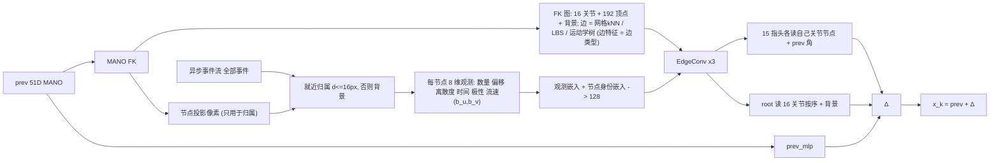

# S37 FK 图（用户设计）：FK 就是图，事件是它的观测，无几何支路——预注册

> 2026-09-07。用户对 S37 的定义："上一状态 prev 51D MANO 生成 MANO FK 之后就足够了；然后和异步事件流一起经过图神经网络，
> 得到节点和边的信息以及变化信息；逐事件 token 去掉；不加节点几何/逆深度支路。"本文是这个定义的实现与预注册。
> 同日先做的 `s37_routed`（事件图 + 按 LBS 路由读出）与另一会话做的 `s37_meshq`（事件图 + 网格查询）都不是这个设计，
> 只作对照，不在本文范围内。门槛与假设在训练启动前写定（§4 有时间戳），§6 结果与 §7 判读训完后填。
>
> 协议：9 受试者 72 条序列训练（默认 `splits_semkine.json`），验证、选点、上报只用留出受试者 zgz 的两条序列（2590 帧），
> 50 ms 步长，固定 500 步网格，`tools/select_checkpoint.py` 递推 RA 选点，两种子 3407 / 3408。对照 = 现有 S36 zgz run。
>
> **结论（09-07 23:30）**：递推 RA 22.10 对 S36 23.17（−1.07，两种子方向相反）——按预注册**打平**；abs −11.6（root 平移解开）；
> 观测置零 +79 mm（承重）；延迟 −22%、FLOPs 1/10、参数 1/4。流速项无用（H6），root 旋转仍盲（H3）。详见 §6–§7。

---

## 1. 设计（`semkine/fk_graph.py`，`MODEL.ENCODER: fk_graph`）

- **FK 只做两件事**：给出图，给出每个节点投影到哪个像素（只用于把事件分到节点）。FK 的几何量不进节点特征、不进边特征。
- **节点**（规格从 MANO 资产一次构建、固定）：16 个关节节点（LBS 权重归一化的表面质心，与关节头顺序一致）+ 192 个顶点节点
  （每个 LBS argmax 关节 12 个，静止姿态最远点采样，确定性）+ 1 个背景节点，N = 209。
- **边**（固定拓扑，`(209, 8)` 邻接表）：顶点↔顶点 静止姿态 3D kNN（k=6）；顶点→关节 LBS 行 top-2；关节↔关节 运动学树父子
  （`kintree_table`，双向）；背景↔腕与五个指根；关节←本关节权重最高的顶点补满 8。**边特征 = 边类型 one-hot（网格 / LBS / 运动学）**，
  恰为 `EdgeConv` 的 3 个边通道，直接复用 S36 的 `EdgeConv`。
- **节点特征 = 事件观测**（`assign_and_observe`，一次 `index_add_` 扫过**全部**事件，不子采样）：每个事件按像素找最近的 FK 节点
  （≤ 16 px，否则背景），每节点 8 维：`log1p(n)/log1p(N_包)`、平均偏移 (Δu, Δv)/r、偏移离散度/r、平均归一时间、极性均值、
  **局部流速 (b_u, b_v)**——该节点事件的 Δu ≈ a + b_u·t、Δv ≈ a + b_v·t 闭式最小二乘斜率（r 每包时长为单位，截断 ±4）。
  背景节点参考点 = 投影手心，尺度 4r。空节点全零。
- **编码**：8 维观测线性嵌入 + 可学习节点身份嵌入（209 × 128，只表达"我是哪个节点"）→ ReLU → EdgeConv × 3（残差）。
- **读出**：15 个手指头各读自己关节节点的 128 维特征 + 自身 prev 角 3 维（唯一事件通路，无旁路）；root 头读
  [16 个关节节点按序平铺 2048, 背景节点 128]；`prev_mlp` 支路与 `ZERO_EVENT_GATE` 照 S36（空包逐位返回 prev）。
- **与 S36 的差异**（`test_s37_fkgraph_config_diff_against_s36`）：`ENCODER`（event_gnn → fk_graph）、`PREV_RENDER`、四个 `FK_GRAPH_*`
  旋钮，以及不再适用的事件图旋钮（`ENCODER_FEAT/K/MAX_NODES/WINDOW/T_SCALE`）。训练、loss、噪声课程、网格、DDP：S36 逐字相同。
- **契约**（`tests/test_s37_fk_graph.py`，9 项）：每关节 ≥ 8 个顶点节点、邻接表无自环无越界、运动学边恰为树；事件归属正确；
  匀速合成事件的 (b_u, b_v) 复原真值；观测不含几何（同像素布局 → 同观测；节点输入维度 = 8）；手指头只读自己关节节点、
  root 读 16 关节 + 背景；空包逐位返回 prev；`ablate_evidence`（观测置零）与 `obs_feature_mask` 钩子生效；S36 键集不变；config diff 白名单。
- **成本**（单卡 512 包 60 步冒烟）：峰值显存 **2.78 GB**（S36 24.1），**0.65 s/it**（S36 约 0.9）；没有事件 kNN、没有逐事件 EdgeConv、
  没有 2048 节点上限，成本随事件数线性且常数很小。



## 2. 预注册门槛（zgz，两种子）

S36 参照：递推 RA 两种子均值 **23.17**（3407 21.42 / 3408 24.92），abs 79.0，网格中位数 25.67 / 26.74，主行延迟 7.04 ms。

- **精度**：采纳需两种子均值 RA ≤ **22.07**（S36 − 1.1）且每个种子不劣于 S36 同种子；abs ≤ **81.0**。|Δ| < 1.1 判打平。
  同时报告对 `s37_routed`（20.74）的差，但它不是门槛。
- **机制门**：同一 checkpoint 上把全部观测置零（拓扑与身份嵌入保留，`model.ablate_evidence = True`），递推 RA 必须劣化 ≥ **1.5 mm**。
- **延迟**：同会话对测记录（预期低于 S36 的 7.04 ms）。
- 结果无论如何写入本文 §6 与账本 zgz 表；报告与 CNN+渲染+域随机化基线（11.9–13.3）的距离。

## 3. 命令

```bash
python -m pytest tests/test_s37_fk_graph.py -q                              # 9 项契约
nohup tools/run_zgz_protocol.sh s37_fkgraph > logs/run_s37_fkgraph_outer.log 2>&1 &
python tools/make_s36_row.py --run s37_fkgraph                              # 主行
CUDA_VISIBLE_DEVICES=6 python tools/run_closed_loop_probe.py --split val_core --out outputs/semkine/closed_loop_s36_s37fkgraph.json \
    --arm s36_3407=<ckpt>:configs/semkine/s36_eventgnn_s3407.yaml --arm s37_3407=<ckpt>:configs/semkine/s37_fkgraph_s3407.yaml \
    --arm s36_3408=<ckpt>:configs/semkine/s36_eventgnn_s3407.yaml --arm s37_3408=<ckpt>:configs/semkine/s37_fkgraph_s3407.yaml
CUDA_VISIBLE_DEVICES=6 python tools/probe_s37_fkgraph.py --runs outputs/semkine/s36_eventgnn_s3407 outputs/semkine/s36_eventgnn_s3408 \
    outputs/semkine/s37_fkgraph_s3407 outputs/semkine/s37_fkgraph_s3408 --out outputs/semkine/probe_s37_fkgraph.json
```

## 4. 变更记录

- 09-07 20:00–20:13：实现、9 项契约、全套 pytest（334 通过 2 跳过）、单卡冒烟；本文 §1–§5 写定。
- 09-07 20:13：训练启动，两种子并行（3407 在 GPU 6,7；3408 在 GPU 4,5），1.7 it/s，`cuda_max_mem` 4.9 GB。
- 09-07 20:46 → 21:16：**两种子在 step 3378 同时卡死**，NCCL allreduce 30 分钟超时后进程被 watchdog 杀掉（`logs/s37_fkgraph_s340{7,8}.log`
  第 689–694 行）。两个独立进程在同一步同时挂，机器无 OOM 记录，同一步正是 step 3000 验证结束、恢复训练之后不久，
  最可能是 DDP 两 rank 在验证边界上的集合通信错位（本臂前向里没有任何依赖 rank 的分支）。**处置**：给 `semkine/train.py`
  加 `--resume`（Lightning `ckpt_path`，恢复模型 / 优化器 / 调度器 / global_step），两种子分别从各自 `last.ckpt`（step 3000）
  以**单卡 batch 1024** 续训到 6000（有效 batch 与 2 × 512 相同，LR 不变；`training_metadata_phase1_ddp2x512.json` 保留第一阶段元数据）。
  21:31 → 22:30 续训完成。step ≤ 3000 的六个 checkpoint来自 DDP 阶段、step ≥ 3500 来自单卡阶段，两阶段的有效 batch 与学习率一致。
- 09-07 22:31 → 22:38 选点；主行复现时 3408 的 RA 与选点相差 **0.0755 mm**，超出 0.05 mm 的复现门。根因：`assign_and_observe`
  用 float32 `index_add_` 做逐节点求和，原子加的求和顺序随机，~1e-7 的抖动被递推回路放大。修复：float64 累加再转 float32
  （`_segment_sums`，5 次运行逐位相同，3M 事件 1 ms）。**重新选点**（`selection_val_core_step50_fp32atomics.json` 保留旧结果）：
  两种子选中的 step 不变（2000 / 1500），RA 22.6676 → 22.6354、21.4916 → 21.5609，复现漂移 0.0000。
- 09-07 23:04 → 23:30：主行、`run_closed_loop_probe.py`、`probe_s37_fkgraph.py`、同会话延迟对测跑完（§6）。

## 5. 本质原因：六个预注册假设与判别探针

在 S37 / S36 各两种子的选中 checkpoint、同一批 zgz 窗口上跑（`tools/probe_s37_fkgraph.py`；TF/递推拆分复用 `run_closed_loop_probe.py`）。

| 假设 | 测什么 | 成立的判据 |
|---|---|---|
| **H1** 噪声课程把归属打坏，头学会忽略观测 | 归属召回（落入 16 px 带内的事件比例）与纯度（归属节点所属关节 = 按 GT-prev 归属的关节的比例）在 prev = GT / 课程小噪声 / 课程大噪声 / 闭环自预测 四种条件下；观测置零与换事件后的输出位移 | 大噪声下召回 < 0.5，且观测置零 RA 变化 < 1.5 mm |
| **H2** 状态条件归属在闭环自我放大（KEG 的死法） | TF 单步 RA 对递推 RA 的放大率（S36 2.58）；**oracle 归属**：闭环里事件按 GT prev 归属，其余一切自预测 | 放大率 > S36 × 1.2，或 oracle 归属收回 S37−S36 差距一半以上 |
| **H3** root 盲 | abs 误差分解为腕平移 / 全局旋转 / 手指；事件固定、prev 平移 36 mm 与绕 x/y/z 转 10° 时 root 头自身的响应增益（S36 0.32 / ≤ 0.06） | 旋转增益 ≥ 0.3 → 流速观测解开了旋转盲 |
| **H4** 学到的映射不跨受试者 | TF 单步 RA 在 4 条训练序列与 zgz 两条上的差（S36 0.48） | S37 差 ≥ S36 × 1.5 |
| **H5** 头过冲 | TF 的 `update_ratio_pose` / `alignment_pose`（S36 0.96 / 0.25） | update_ratio > 1.3 或 alignment < S36 |
| **H6** 观测充分性 | 同一 checkpoint 用 `obs_feature_mask` 分别只留 (b_u, b_v) 流速、只留计数与偏移、全部观测，测 TF 单步 RA 与闭环 RA | 若只留计数与偏移就与全部相当 → 流速项无用 |

**判读规则（预先写死）**：H2 成立 → 状态条件归属在此形态下自放大，回到路由读出；H3 旋转增益 ≥ 0.3 → 流速观测解开了 root 旋转盲；
H6 若只靠计数与偏移就够 → 流速项可删；若精度门槛通过且机制门通过 → 采纳。

## 6. 结果（2026-09-07 23:30，两种子，zgz 两条序列 2590 帧）

产物：`outputs/semkine/s37_fkgraph_s340{7,8}/selection_val_core_step50.json`、`s37_fkgraph_main_row.json`、
`closed_loop_s36_s37fkgraph.json`、`probe_s37_fkgraph.json`、`latency_ab_s37fkgraph_vs_s36.json`；日志 `logs/s37_fkgraph_*`、
`row_s37_fkgraph_zgzproto.log`、`closed_loop_s36_s37fkgraph.log`、`probe_s37_fkgraph.log`。结构图 `docs/assets/s37_fkgraph_simple.png`。

| | S36 3407 / 3408（均） | S37 fkgraph 3407 / 3408（均） | 门槛 | 判定 |
|---|---|---|---|---|
| 递推 RA（选点） | 21.42 / 24.92（**23.17**） | 22.64 / 21.56（**22.10**） | 均值 ≤ 22.07 且逐种子不劣 | **不过**（−1.07；3407 劣 +1.22，3408 优 −3.36）——按 \|Δ\| < 1.1 判**打平** |
| abs MPJPE | 78.9 / 79.0（79.0） | 58.9 / 75.8（**67.4**） | ≤ 81.0 | 过（−11.6） |
| local / global RA（两种子均） | 28.43 / 18.60 | 30.92 / **14.43** | — | global −4.2，local +2.5 |
| MPVPE-local / global | 24.26 / 15.00 | 26.47 / 11.59 | — | |
| 选中 step；网格中位数（spread） | 4000 / 5000；25.67（8.0）/ 26.74（9.0） | 2000 / 1500；26.80（9.0）/ 26.76（6.1） | — | 网格中位数与 S36 相同；早期 checkpoint 最好，后半网格 27–31 |
| 机制门：观测置零后闭环 RA | — | 101.1（113.2 / 89.1），abs 300+ | 劣化 ≥ 1.5 | **过**（+79 mm：没有观测就是开环漂移） |
| 主行：延迟 / FLOPs / 参数 | 7.04 ms / 0.827 G / 0.95 M | **5.38 ms** / **0.084 G** / **0.23 M** | 记录 | 同会话对测 5.81 → 4.51 ms（**−22%**），FLOPs 1/10，参数 1/4 |

**判定：精度打平（−1.07，差 0.03 mm 没过采纳线，且两种子方向相反），机制门过，成本大幅下降。** 与 CNN+渲染+域随机化基线（11.9–13.3）仍差约 9 mm。

### 探针读数（`probe_s37_fkgraph.py`、`run_closed_loop_probe.py`，两种子均）

| 量 | S36 | S37 fkgraph | 读法 |
|---|---|---|---|
| TF 单步 RA / 递推 RA / 放大率 | 9.17 / 23.21 / 2.58 | 9.05 / 22.10 / 2.44 | 单步相同、放大率略低，都在噪声内 |
| 观测置零：TF / 闭环 | — | 13.0（+3.9）/ 101（+79） | 观测承重；置零后 = 只靠 prev_mlp 与身份嵌入的开环 |
| **oracle 归属**（GT prev 归属，其余自预测）闭环 RA / abs | — | **51.2**（38.6 / 63.8）/ 300+ | 用"正确"的归属反而崩掉：观测里的偏移与流速是**相对 prev 节点**量的，换成 GT 节点后它们就不再描述 prev 的误差，网络读到的是自相矛盾的观测 |
| 归属召回 / 纯度 @ GT · 小噪声 · 大噪声 · 闭环 | — | 0.94/1.00 · 0.94/0.75 · **0.65/0.22** · 0.95/0.68 | 与路由读出臂相同的形状：大噪声课程下归属接近乱派 |
| H6 只留流速 (b_u, b_v)：TF / 闭环 | — | 13.0 / 101 | 与置零无异：流速**单独**不携带任何可用信息 |
| H6 只留计数 + 偏移：TF / 闭环 | — | 13.1 / 29.1 | 计数 + 偏移就撑起大半闭环 |
| H6 去掉流速（其余 6 维）：TF / 闭环 | — | 9.00 / **22.20** | 与全部 8 维（9.05 / 22.10）相同：**流速项没有贡献** |
| 腕平移 p50 / p90 | 64.4 / 118 | **46.4** / 112 | 平移改善 18 mm，是 abs −11.6 的来源 |
| 全局旋转 p50 / p90 | 12.0° / 18.2° | **9.5°** / 20.0° | 中位数改善 2.5°，尾部没变 |
| root 头响应增益：平移 36 mm / 旋转 x, y, z 10° | 0.32 / 0.02, 0.00, 0.06 | **0.90** / 0.03, 0.11, **0.19** | 平移近乎全响应；旋转仍 < 0.3，H3 的门没过 |
| 事件依赖度（换事件位移 / 真实步进） | 7.40 | **10.9** | 输出对证据更敏感 |
| 姿态更新比 / 方向余弦（TF） | 0.96 / 0.25 | 1.01 / 0.25 | 相同：方向一致性只有 0.25 |
| TF RA：训练序列均值 → zgz（差） | 8.69 → 9.17（0.48） | 8.60 → 9.05（0.45） | 跨受试者差距与 S36 相同 |

## 7. 判读

按 §5 预先写死的规则：

- **H1**（课程打坏归属 → 头忽略观测）：前半成立（大噪声下召回 0.65、纯度 0.22），后半不成立（置零 +79 mm）。与路由读出臂一样。
- **H2**（状态条件归属自放大）：**不成立**。放大率 2.44 < S36 2.58；oracle 归属让闭环从 22.1 变成 51.2，不是"收回差距"而是崩掉——
  但这一崩不是 KEG 式的回灌，而是观测的**参照系**问题（见下）。
- **H3**（root 盲）：平移解开了（增益 0.32 → 0.90，腕误差 64 → 46 mm，abs −11.6），旋转没有（增益 ≤ 0.19，门槛 0.3）。
- **H4**（跨受试者）：不成立，差距 0.45 与 S36 的 0.48 相同。
- **H5**（过冲）：不成立，更新比 1.01、余弦 0.25 与 S36 相同。
- **H6**（观测充分性）：**流速项无用**——去掉它 TF/闭环都不变，只留它等于置零。计数 + 偏移承担了全部。

**本质原因。** 这个设计把渲染比较翻了个面：S36 在事件像素上读"prev 画出来的手在不在这里"，本臂在 prev 的表面点上读
"事件落在我周围哪里、有多少"。两者信息量相当，所以单步精度相同（9.05 对 9.17）。它赢在 **root 平移**：每个节点的平均偏移
(Δu, Δv) 就是该表面点到事件的位移，200 个节点按关节顺序平铺进 root 头，等于把整只手的位移场原样交给了 root——S36 的全局
池化把这个场平均掉了。它输在**手指**（local +2.5）：手指的观测被"该节点附近有没有事件"主导，事件稀疏时（16 px 带内平均只有几十个
事件）8 维汇总丢掉了 S36 事件图里保留的局部形状。旋转仍读不出来：绕腕旋转在偏移场里是反对称的，root 头是线性层直接读
2048 维，理论上可解，但训练课程里 0.3 rad 的旋转总伴随 50 mm 平移与大幅手指噪声（上一轮已测过的 H7），旋转分量在训练分布里
不可读，这次也没变。**流速 (b_u, b_v) 在 50 ms 包内没有信息**：真实每步运动只有约 5.8 mm（几个像素），单节点的事件在时间上的
线性拟合被噪声淹没，"变化信息"在这个时间尺度上不存在于单节点内，只存在于跨包的 prev → 事件偏移里——而那正是偏移项已经给出的。

oracle 归属崩掉的机制值得单独记：观测是相对 prev 节点像素量的，把节点换到 GT 位置后偏移变成"GT 到事件"（≈ 0），网络却按
"prev 到事件"解读，于是把零偏移当成"prev 就是对的"、不再纠偏，闭环漂移。这说明本臂的机制是**读 prev 与事件的差**——正确的
状态条件化——而不是读 prev 本身；也说明它没有走捷径。

**成本**是本轮最实在的收益：同会话延迟 −22%（5.81 → 4.51 ms），FLOPs 0.084 G（S36 的 1/10），参数 0.23 M（1/4），显存 4.9 GB
（1/5），且不再有 2048 节点上限——事件数增加只多一次 `index_add`。

**留给后续的约束**：(1) 流速项可删（H6），观测退回 6 维；(2) 手指精度是这个形态的短板，可考虑每关节多于 12 个顶点节点或
把 S36 的局部事件图只保留在指尖节点周围；(3) root 旋转仍是整条线共有的未解问题，与观测形态无关，需要课程或读出层面的改动。
两种子方向相反（3407 劣 1.2、3408 优 3.4）且最佳 checkpoint 都在前 2000 步，后半网格退化到 27–31，说明训练后期在过拟合训练受试者
的偏移分布，早停或更强的域随机化是下一个可测的单变量。
