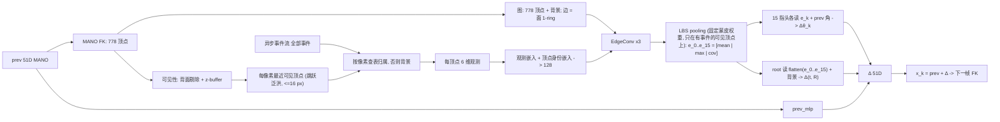

# S37 网格图（用户手绘图，09-18）：prev 的整张 MANO mesh 就是图，事件是它的观测，LBS pooling 汇到 16 关节——预注册与结果

> 2026-09-18。用户的手绘图：prev →FK→ 778 顶点 mesh 作节点 ⇐ 当前事件 → 图卷积 → mesh 特征图 → LBS pooling → 16 关节特征 →
> 回归 Δ → ⊕ prev → 下一帧 prev → FK → …。图里的状态写作"关节点绝对坐标"，实现时按讨论改读为 **51D MANO 参数**
> （`[t3, R3, residual45]`）：MANO FK 的输入是旋转 + 根平移，绕骨轴的 twist 在关节位置里不可观测，用关节位置做状态必须再加 IK。
> 门槛在训练启动前于对话中写定（对 `s37_fkgraph` 22.10 与 `s37_routed` 20.74，观测置零 ≥ 1.5 mm），本文是它的实现记录与结果。
> 预测（训练前）：TF 单步 ≈ 9 mm，闭环 RA 20–22，手指（local）改善，root 旋转不改善。
>
> 协议：9 受试者 72 条序列训练（`splits_semkine.json`），验证、选点、上报只用留出受试者 zgz 的两条序列（2590 帧），50 ms 步长，
> 固定 500 步网格，`tools/select_checkpoint.py` 递推 RA 选点，两种子 3407 / 3408。对照 = `s37_fkgraph`（同一族，只差节点 / 边 / pooling）。
>
> **结论（09-18 15:30）**：递推 RA **24.89**（3407 **20.48** / 3408 29.30）对 fk_graph 22.10、routed 20.74——两种子分裂，按门槛**不过**。
> 3407 是 GNN 线单种子最好的点之一，TF 单步 8.07 是全线最低；3408 崩在 **root 旋转**：闭环全局旋转中位数 28° 对 3407 的 16°，
> 而两种子的**手指关节（旋转对齐后）误差相同**（17.9 / 18.4，fk_graph 24.7 / 26.2）。整张网格的 RA 与旋转误差相关 0.96、与手指误差相关 −0.01：
> 这一臂的不稳定全部来自 root 旋转读出。机制门过（观测置零 +22.6 / +27.4 mm）。延迟 11.99 ms（fk_graph 5.38），FLOPs 0.314 G，参数 0.44 M。

---

## 1. 设计（`semkine/mesh_graph.py`，`MODEL.ENCODER: mesh_graph`，`configs/semkine/s37_meshgraph_s3407.yaml`）

- **节点** = prev 经 MANO FK 的 778 个姿态顶点（资产顺序）+ 1 个背景节点，N = 779。**边** = 网格面片的 1-ring（双向，最大度 8），
  边特征只有边类型（`E_MESH`）；背景节点无边，只经 root 头进入输出。没有运动学树边、没有全局节点（与 fk_graph 的差别之一，见 §7）。
- **事件 → 节点**（`_mesh_graph_forward`）：先做可见性——背面剔除（面法向 float64 累加，与 `_segment_sums` 同一条复现纪律）+ 点溅 z-buffer
  （3×3 px 窗、1 cm 深度容差，`visible_vertices`）；再用跳跃泛洪建每像素最近可见顶点查找表（≤ 16 px，否则背景，`nearest_node_lut`，O(HW)，
  与事件数、节点数无关）；事件按像素查表归属，`assign_and_observe` 逐节点汇总 **6 维**观测（计数份额、平均偏移 (Δu, Δv)/r、偏移离散度、
  归一时间、极性；流速 (b_u, b_v) 按 fk_graph H6 去掉，`MESH_GRAPH_OBS_FLOW: true` 可恢复）。观测里没有任何几何量（与 fk_graph 同一条法则）。
- **编码**：6 维观测线性嵌入 + 可学习节点身份嵌入（779 × 128）→ ReLU → `EdgeConv` × 3（残差），复用 S36 的层。
- **LBS pooling**（`lbs_pool_evidence`，固定蒙皮权重，优化器动不了）：
  `e_j = [ Σ_v W_vj·has_v·h_v / Σ_v W_vj·has_v ‖ max_{v: argmax W_v = j, has_v} h_v ‖ cov_j = Σ_v W_vj·has_v / Σ_v W_vj·vis_v ]`，257 维；
  只在看见事件的顶点上池化，没看见事件的关节证据恰为零。
- **读出**：关节头 k 读 `[e_{k+1} ‖ 自己的 prev 角]` → Δθ_k（3 维 AA）；root 头（单层线性）读 `[flatten(e_0..e_15) (4112) ‖ 背景节点 (128)]` → Δ(t, R)。
  `prev_mlp` 旁路与 `ZERO_EVENT_GATE` 照 fk_graph / S36。**对 fk_graph 只差节点、边、pooling 三处**（`test_s37_meshgraph_config_diff_against_fkgraph` 锁定）。
- **契约**（`tests/test_s37_mesh_graph.py`，12 项）：图 = 每个顶点的面 1-ring；z-buffer 同像素只留近者；背面剔除随面法向；真实手约一半顶点被隐藏；
  事件到不了隐藏节点；查找表与暴力最近点一致、出帧事件到背景；观测 6 维（带流速 8 维）；LBS pool = 观测顶点上的蒙皮加权均值；
  手指头只读自己的证据、root 读全部；空包逐位返回 prev；端到端前向与 `ablate_evidence` / `obs_feature_mask` 钩子；config diff 白名单。
  另 fk_graph 的 9 项契约确认 `assign_and_observe` 新增的 `node_mask` / `assign_pre` 不改变旧行为。
- **成本**（训练，2 × 512 DDP bf16）：1.5 it/s，每卡峰值显存 **9.0 GB**（fk_graph 4.9，S36 24）。



## 2. 预注册门槛（zgz，两种子；训练前于对话中写定）

- **精度**：报告对 `s37_fkgraph`（22.10；22.64 / 21.56）与 `s37_routed`（20.74；19.23 / 22.26）的差；采纳需两种子均值优于 fk_graph 且逐种子不劣。
- **机制门**：同一 checkpoint 观测与 `has` 置零（`model.ablate_evidence = True`），递推 RA 劣化 ≥ **1.5 mm**。
- **成本**：主行方法记录延迟 / FLOPs / 参数。
- 结果无论如何写入本文与账本 zgz 表，并报告到 CNN+渲染+域随机化基线（11.9–13.3）的距离。

## 3. 命令

```bash
python -m pytest tests/test_s37_mesh_graph.py tests/test_s37_fk_graph.py -q                 # 12 + 9 项契约
nohup tools/run_zgz_protocol.sh s37_meshgraph > logs/run_s37_meshgraph_outer.log 2>&1 &
python tools/make_s36_row.py --run s37_meshgraph                                             # 主行
python tools/draw_s37_meshgraph_current.py                                                   # 结构图 docs/assets/s37_meshgraph_current_20260923.png
CUDA_VISIBLE_DEVICES=6 python tools/run_closed_loop_probe.py --split val_core --prev-noise 0.5,1,2,4 \
    --out outputs/semkine/closed_loop_s37meshgraph_vs_fkgraph.json \
    --arm mg_3407=outputs/semkine/s37_meshgraph_s3407/s37_meshgraph_s3407-step=3000.ckpt:configs/semkine/s37_meshgraph_s3407.yaml \
    --arm mg_3408=outputs/semkine/s37_meshgraph_s3408/s37_meshgraph_s3408-step=5000.ckpt:configs/semkine/s37_meshgraph_s3407.yaml \
    --arm fk_3407=outputs/semkine/s37_fkgraph_s3407/s37_fkgraph_s3407-step=2000.ckpt:configs/semkine/s37_fkgraph_s3407.yaml \
    --arm fk_3408=outputs/semkine/s37_fkgraph_s3408/s37_fkgraph_s3408-step=1500.ckpt:configs/semkine/s37_fkgraph_s3407.yaml
CUDA_VISIBLE_DEVICES=4 python tools/probe_s37_meshgraph.py --grid --seq zgz_local --out outputs/semkine/probe_s37_meshgraph_rotdecomp.json \
    --runs outputs/semkine/s37_meshgraph_s3407 outputs/semkine/s37_meshgraph_s3408 outputs/semkine/s37_fkgraph_s3407 outputs/semkine/s37_fkgraph_s3408
```

## 4. 变更记录

- 09-18 上午：实现、12 项契约、单卡冒烟（B = 512：可见顶点 ≈ 50%，落入带内事件 ≈ 75%，每包有事件的顶点 ≈ 37%，命中关节 15.7 / 16）。
- 09-18 11:28：训练启动，两种子并行（3407 在 GPU 6,7；3408 在 GPU 4,5），1.5 it/s，`cuda_max_mem` 9.0 GB。12:33 训完，12:38 选点完成（`ZGZ_PROTOCOL_DONE`）。
- 09-18 训练中：审查发现 `facing_camera` 用 float32 `index_add_` 累加顶点法向，CUDA 原子加顺序随机，掠射角顶点的可见性可能在两次运行间翻转
  （fk_graph 踩过的 0.0755 mm 复现漂移同源）。改为 float64 累加再比较（`semkine/mesh_graph.py`）；256 个随机状态 × 40 万事件 5 次运行，
  `vis` / `lut` / `obs` / 证据逐位相同。改动只影响 1e-7 量级的边界；选点与主行都在修复后运行，主行复现漂移 **0.0000 mm**（两种子）。
- 09-18 14:40：`tools/make_s36_row.py` 的 `macs_s36` 只认 `fk_graph` 的按节点观测输入，给 `mesh_graph` 补了同一分支（root 头维度 16 × 257 + 128）。
- 09-18 14:35 → 15:30：主行、闭环探针（含 prev 噪声扫描）、机制门、旋转 / 手指分解（新工具 `tools/probe_s37_meshgraph.py`）。

## 5. 预注册假设

| 假设 | 测什么 | 判据 |
|---|---|---|
| **H1** 778 顶点的位移场分辩率改善手指 | 闭环与 TF 的手指误差（21 关节 Kabsch 旋转对齐后的残差，`ra_rotaligned`），对 fk_graph | 手指误差低于 fk_graph 且两种子一致 |
| **H2** 可见性条件归属让闭环放大更严重 | TF 单步 RA / 递推 RA 放大率（fk_graph 2.44，S36 2.58）；小噪声下证据的相对变化、可见性翻转比例 | 放大率 > 2.9，或证据对 prev 扰动的相对变化远大于 fk_graph 的关节节点 |
| **H3** root 旋转不改善 | 闭环全局旋转 p50 / p90（Kabsch 角），对 fk_graph | 不劣于 fk_graph 即为"不改善但不恶化" |
| **H4** 机制承重 | 观测置零后闭环 RA | 劣化 ≥ 1.5 mm |

## 6. 结果（2026-09-18，两种子，zgz 两条序列 2590 帧）

产物：`outputs/semkine/s37_meshgraph_s340{7,8}/selection_val_core_step50.json`、`s37_meshgraph_main_row.json`、`closed_loop_s37meshgraph_vs_fkgraph.json`、
`probe_s37_meshgraph_rotdecomp.json`（`probe_s37_meshgraph_{sensitivity,local_trajectory,rot_decomp,grid_decomp}.json` 为同批临时探针的原始读数）；
日志 `logs/s37_meshgraph_*`、`row_s37_meshgraph_zgzproto.log`、`closed_loop_s37meshgraph.log`、`probe_s37_meshgraph.log`。
结构图 `docs/assets/s37_meshgraph_current_20260923.png`（`tools/draw_s37_meshgraph_current.py`）。

| | fk_graph 3407 / 3408（均） | **meshgraph 3407 / 3408（均）** | 门槛 | 判定 |
|---|---|---|---|---|
| 递推 RA（选点） | 22.64 / 21.56（22.10） | **20.48** / 29.30（**24.89**） | 均值优于 22.10 且逐种子不劣 | **不过**（+2.79；3407 −2.16，3408 +7.74） |
| abs MPJPE | 58.9 / 75.8（67.4） | 55.6 / 62.3（59.0） | — | −8.4 |
| local / global RA（两种子均） | 30.92 / 14.43 | 36.32 / 14.96 | — | global 相同；local 3407 **25.80**（−5.1）、3408 46.85 |
| MPVPE-local / global | 26.47 / 11.59 | 27.63 / 11.69 | — | |
| 选中 step；网格中位数（spread） | 2000 / 1500；26.80（9.0）/ 26.76（6.1） | 3000 / 5000；27.92（**14.3**）/ 37.77（**26.3**） | — | 网格 spread 是 fk_graph 的 1.6–4 倍 |
| TF 单步 RA / 递推 / 放大率 | 9.24 / 22.62 / 2.45；8.87 / 21.57 / 2.43 | **8.07** / 20.25 / 2.51；10.32 / 29.54 / **2.86** | — | 3407 单步全线最低；3408 单步差 28%、放大率也高 |
| 机制门：观测置零后闭环 RA | 101（+79） | 42.8（**+22.6**）/ 56.9（**+27.4**），abs 271 / 131 | ≥ 1.5 | **过** |
| 主行：延迟 / FLOPs / 参数 | 5.38 ms / 0.084 G / 0.23 M | **11.99 ms** / 0.314 G / 0.44 M | 记录 | 延迟 2.2 倍（S36 7.04）；见 §7 |

**判定：精度门不过——两种子分裂（−2.16 / +7.74）。3407 是 GNN 线最好的单种子之一（对 routed 最好种子 19.23 差 1.2），3408 比 S36 最差种子还差 4.4。**
与 CNN+渲染+域随机化基线（11.9–13.3）仍差 9–17 mm。

### 探针读数

**旋转 / 手指分解**（`probe_s37_meshgraph.py`，zgz_local，21 关节 Kabsch 对齐；"手指" = 旋转对齐后残差）：

| | TF RA | TF 手指 | TF 旋转 p50 | 闭环 RA | **闭环手指** | **闭环旋转 p50 / p90** | 旋转 > 20° 的步 |
|---|---|---|---|---|---|---|---|
| meshgraph 3407 | 9.80 | **5.64** | 6.5° | 25.29 | **17.93** | **15.6° / 31.4°** | 0.33 |
| meshgraph 3408 | 15.32 | **5.48** | 10.0° | 47.36 | **18.40** | **28.2° / 44.5°** | 0.75 |
| fk_graph 3407 | 12.14 | 6.44 | 7.9° | 31.46 | 24.70 | 20.8° / 37.1° | 0.53 |
| fk_graph 3408 | 11.64 | 6.52 | 9.3° | 30.37 | 26.16 | 23.9° / 35.4° | 0.63 |

**整张网格的闭环分解**（12 个 checkpoint × 4 个 run，zgz_local）：

| run | 网格 RA 均值 ± sd | 手指均值 ± sd | 旋转 p50 均值 ± sd | corr(RA, 旋转) | corr(RA, 手指) |
|---|---|---|---|---|---|
| meshgraph 3407 | 36.4 ± 8.1 | 20.4 ± 2.7 | 24.3° ± **7.4°** | **0.96** | −0.01 |
| meshgraph 3408 | 59.3 ± 8.7 | 22.9 ± 3.5 | **45.6°** ± 8.9° | **0.89** | −0.20 |
| fk_graph 3407 | 35.5 ± 5.9 | 21.0 ± 2.9 | 22.4° ± 4.3° | 0.91 | −0.02 |
| fk_graph 3408 | 36.9 ± 5.3 | 22.2 ± 2.1 | 23.0° ± 2.4° | 0.34 | −0.60 |

**其它读数**（`run_closed_loop_probe.py` prev 噪声扫描；临时探针 `probe_s37_meshgraph_{sensitivity,local_trajectory}.json`）：

| 量 | fk_graph | meshgraph | 读法 |
|---|---|---|---|
| 单步 RA @ 条件误差 3.3 / 6.6 / 13.2 / 26.0 mm（3407） | 9.43 / 9.97 / 11.80 / 16.68 | 8.32 / 9.07 / 11.49 / 16.87 | 远离 GT 时的纠偏能力相同 |
| 保留率 gain_rand（RA 关节空间，小噪声 ×1，两种子） | 0.696 / 0.689 | 0.715 / 0.698 | 相同——GT 附近的回路增益不是差别所在 |
| 小噪声 ×0.3 下证据的相对变化（fk：关节节点特征） | 0.36 / 0.34 | mean 0.47 / max 0.55 / cov 0.11 | 网格证据略粗糙，max 与 mean 相当，不足以解释 |
| 可见性翻转 / `has` 翻转（×1 噪声） | — | 3.5% / 0.5% 顶点 | 可见性闪烁是小量 |
| 闭环自身轨迹上的归属召回 / 纯度（严格到 16 关节） | 0.92 / 0.27, 0.93 / 0.24 | 0.96 / 0.26, 0.98 / 0.28 | 归属质量不比 fk_graph 差 |
| 训练曲线（TB）：`val_rot_loss` step 1k → 4k → 6k | 0.0045 → 0.0074 → 0.0067 | 3407: 0.0026 → 0.0025 → 0.0035；**3408: 0.0026 → 0.0052 → 0.0041** | 3408 的 TF root 旋转在 step 2000 后恶化；两种子 `val_mano_loss`（手指）都平在 0.0047 |

## 7. 判读

- **H1（手指改善）：TF 成立，闭环在选点处成立、整张网格上打平。** TF 手指误差 5.6 / 5.5 对 fk_graph 6.4 / 6.5（−14%），两种子一致；
  选中 checkpoint 的闭环手指误差 17.9 / 18.4 对 24.7 / 26.2（−28%），但整张网格的手指均值 20.4 / 22.9 对 21.0 / 22.2——选点按 RA（由旋转主导）
  挑 checkpoint，对手指是随机的，选点处的 −28% 有一半是选点运气。可靠的结论是：手指读出**不比 fk_graph 差，且两种子稳定**（sd 2.7 / 3.5）。
- **H2（可见性条件归属让闭环自放大）：不成立。** 放大率 2.51 / 2.86 对 2.45 / 2.43，只有 3408 超；GT 附近的保留率与 fk_graph 相同（0.70），
  远离 GT 的单步纠偏曲线重合，可见性翻转只有 3.5% 顶点，归属纯度不低于 fk_graph。3408 的高放大率是 root 旋转误差在回路里的表现（下一条），
  不是归属机制。
- **H3（root 旋转不改善）：比预测更糟——不是"不改善"，而是"不稳定"。** 网格上 RA 与旋转误差相关 0.96 / 0.89、与手指误差相关 ≈ 0：这一臂
  checkpoint 之间、种子之间的全部差异都是 root 旋转。fk_graph 的旋转在 24 个 checkpoint 上都钉在 22–23° ± 2–4°，meshgraph 在 15°–60° 之间摆
  （sd 7.4° / 8.9°，3408 均值 45.6°）。3407 选点处 15.6° 是四个 run 里最好的，3408 处 28°。TB 曲线印证：3408 的 `val_rot_loss` 在 step 2000 后翻倍
  而 `val_mano_loss` 不动。
- **H4（承重）：成立**，置零 +22.6 / +27.4 mm。比 fk_graph 的 +79 小是因为置零同时清了 `has`，LBS pool 输出恰为零：关节头只剩 prev 角，
  root 只剩背景节点与 `prev_mlp`——一个更保守的先验，而 fk_graph 置零后关节节点仍带身份嵌入，"开环"漂得更远。

**本质原因。** 图里的信息只沿网格 1-ring 走 3 跳（≈ 1–2 cm），腕部顶点听不到指尖；fk_graph 里的 16 个关节节点带运动学树边与 LBS 边，
是全手范围的长程通路，root 头读到的 16 个关节节点特征已经在图里交换过全局信息。本臂把关节聚合挪到图外做成固定 LBS 均值，root 头
（单层线性，4240 维输入）只能从 16 个**各自局部**的均值 / max 里线性拼出绕腕旋转的反对称位移场——可解，但没有中间表示，训练落点决定
它拼不拼得出来：3407 拼出来了（TF 旋转 6.5°，全线最低），3408 没有（10°，且随训练恶化）。手指头不依赖长程信息，所以两种子一致。
这正是训练前分析里的第 (c) 点（"只有网格边，root 拿不到全局信息……考虑保留运动学树边或一个全局节点作长程通路"），当时选择先做最小改动
（只改节点 / 边 / pooling 三处）以便归因，归因现在清楚了。

**成本。** 延迟 11.99 ms 是 fk_graph 的 2.2 倍、S36 的 1.7 倍，来源不是 FLOPs（0.314 G，S36 的 38%）而是 B = 1 时的核启动数：
跳跃泛洪 5 轮 × 8 邻域的 gather、z-buffer 的 `max_pool2d`、779 节点 × 3 层 EdgeConv，都是小核。批内摊销后训练吞吐（1.5 it/s @ 2 × 512）与 fk_graph 相近。
如果这条形态要留，跳跃泛洪可以在事件数小时退回暴力最近点（一次 cdist），或用 CUDA graph 固化。

**留给后续的单变量。** 给 root 一条长程通路，其余不动：(a) 加回 16 个关节节点（LBS top-k 边 + 运动学树边，root 读关节节点 + 背景，
手指仍读 LBS pool）——与 fk_graph 的差别就只剩"顶点全保留 + 面 1-ring 边 + 手指读 LBS pool"；或 (b) 一个连到全部可见顶点的全局节点。
预期：手指保持 18–23，旋转回到 fk_graph 的 22° 以内且 sd 缩到 2–4°，两种子重新一致。本臂目前**不采纳**，checkpoint 与全部 JSON 保留作对照；
**当前臂仍为 S37 路由读出**。
