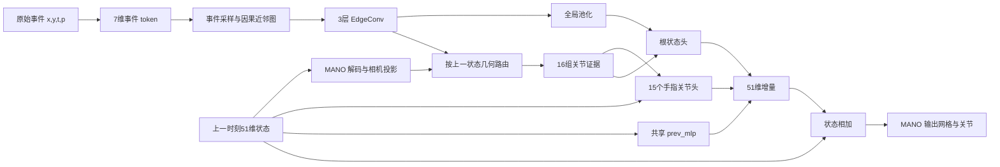

| 网络结构 | MPJPE-local | MPJPE-global | MPVPE-local | MPVPE-global | RA-MPJPE(递推) | Latency | FLOPs/step | Params |
|---|---|---|---|---|---|---|---|---|
| EventHands-PCA6 (baseline) | 30 | 10.99 | 23.58 | 8.15 | - | 1.76 ms | 1.653 G | 11.18 M |
| S37 路由读出（当前臂） | 26.41 | 15.82 | 21.40 | 12.39 | 20.74（19.23 / 22.26） | 7.72 ms | 0.827 G | 0.73 M |

当前采用臂仍为 S37 routed；本次项目审计不更换模型，不构成新实验的精度验收。

# 项目结构、指标与后续验证边界

日期：2026-09-25。响应用户“分析项目”。这是当前工作树的代码审计及已有合同测试复核，不是新训练的预注册，也不把审计之后的建议追认为旧实验的预注册。原研究目标继续由 `research_state/GOAL.md` 管理。

## 1. 项目实际在做什么

项目从单目事件流估计手部 MANO 状态，再通过 MANO 解码得到关节和完整网格。当前 51 维状态依次为平移 3、根旋转轴角 3、手指局部旋转残差 45。`model/pose_repr.py:81` 解码时给最后 45 维加上 `hands_mean`，不能直接把它们当作完整局部旋转。

代码有三个需要分清的层次：

- **旧 CNN 对照线**：事件先构造 LNES，上一状态渲染为语义轮廓/逆深度等通道，通过 ResNet18 预测增量。你打开的 `outputs/hand_data51/track_render51_dr_sem_rep2/eval_step1000/track_metrics_step50.json` 属于这条线。对应运行目录保存的 `outputs/hand_data51/track_render51_dr_sem_rep2/logs/track_render51_dr_sem_rep2/hparams.yaml` 明确记录 `BACKBONE: resnet18`、`PREV_RENDER: true`、`RENDER_CHANNELS: [semsil, inv]`、`PREDICT_DELTA: true`。它不是当前 S37 的评估文件，也不是每步独立绝对回归模型。
- **当前 S37 routed**：原始事件包输入 EventGNN，历史 MANO 几何只在路由/读出侧及状态分支进入，预测增量并递推。入口配置是 `configs/semkine/s37_routed_s3407.yaml`；主模型依然是 `model/model.py` 中历史命名的 `MNISTModel`，不能只根据 `semkine/estimator.py` 或目录名判断实际运行路径。
- **增量执行及其他研究分支**：`semkine/streaming*.py`、`event_guided_mesh.py`、`mesh_memory.py` 等是额外实现。代码存在、单元测试通过、载入旧权重，均不等于它们已替代 S37 或达到目标。

README 和 environment.yml 仍主要描述原始 EventHands。当前配置、实际 Python 环境、运行元数据和研究状态更能反映本仓库的运行方式。旧 CNN 的 hparams 还保留原 `EventHands/` 绝对路径，复制命令前必须核对当前 `EventHands1/` 的数据与资产路径。

## 2. S37 的实际数据流



具体代码与合同：

1. `semkine/dataset.py:330` 从同一有效序列区间取事件、起点状态、终点标签、相机参数及 shape；训练的上一状态是起点 GT 加混合噪声。`semkine/events.py:146` 用 packed events + ptr 表达变长包，不要求 LNES。
2. `semkine/event_gnn.py:86` 使用 7 维 token；当前配置最多均匀抽取 2048 个节点，在每节点之前的 32 个候选中选 8 个时空近邻，经 3 层、宽度 128 的 EdgeConv 编码。时间是时间特征，不是事件深度。图拓扑与该编码阶段不读取历史姿态。
3. `semkine/routed_readout.py:40` 将节点与上一状态投影的 778 个顶点比较。在像素近邻中做前表面选择，并用顶点 LBS 权重分配到 16 个 MANO 关节；局部前后表面判定有像素容差，路由有距离门。它是可见性近似，不等于完整光栅化遮挡判定，也没有测得事件真实深度。
4. `pool_joint_evidence` 对每关节生成加权均值、硬分配最大值和覆盖率。手指头读自己的证据及自身上一角度；根头读全局特征与所有关节证据，见 `model/model.py:1203`。
5. `model/model.py:1609` 还把共享 `prev_mlp(prev)` 加到完整增量上。因此“手指事件证据分开读”不意味着全部状态依赖都已解耦；某关节依然可能通过共享状态 MLP 受其他状态分量影响。相关隔离测试约束的是 `_decode_active` 的事件读出，不是整个模型对所有历史状态的偏导。
6. `forward_packet` 将增量加到上一状态。空事件包门控使增量为零；旧主线仍沿用自己的计算精度合同，不能未经回归直接更换状态加法或头的执行顺序。

当前主表路径按包重新计算 token、采样、图和特征；因果图边本身不等于已实现跨包增量缓存。

## 3. 你打开的四个指标如何理解

定义直接核对 `model/eval_track.py:83`、`:138` 和 `semkine/eval_track.py:271`；本次没有将该单次旧 CNN 文件扩充成新的正式结果行。

- `mpjpe_ra_mm`：预测关节与 GT 关节分别减去各自第 0 个关节后，计算平均欧氏距离，单位 mm。只去平移，不消除根旋转，也不是 Procrustes 对齐。
- `mpvpe_ra_mm`：同一 `root_align` 函数用于顶点数组，因此实际各减各自 **第 0 个 mesh 顶点**；它不是以腕关节为原点的顶点误差。这是需要保留并明确解释的历史口径。
- `mpjpe_abs_mm`、`mpvpe_abs_mm`：在原预测/GT 坐标中直接比较，保留整体位置偏移。
- `overall`：按各序列的有效帧数加权；不是 local/global 两个均值简单相加除二。本次已独立重算并核对该 JSON 的四项 overall 与总帧数一致。

**local/global 是动作序列类别**：主表分别取 `zgz_local` 和 `zgz_global` 上的上述对齐误差。它们并不分别代表“局部坐标误差”和“全局绝对坐标误差”。

同一文件中 abs 明显高于 RA，意味着去除整体位置后误差下降；这要求单独检查全局位置与递推状态。它不能仅凭两个平均标量就证明某一平移分量、旋转分量或深度机制出了问题，也不能用 abs 减 RA 得到严格的平移误差。

## 4. 训练和验收目前意味着什么

- `semkine/train.py:73` 读取配置并创建同一个 `MNISTModel`。S37 配方是加噪 GT 条件下的单步增量学习；正式评估则在每有效段起点用 GT 加噪初始化，之后持续把模型自己的输出作为下一步状态，见 `semkine/eval_track.py:166`。这两种状态分布不同，单步损失下降不能单独证明闭环更好。
- 现有协议使用序列提供的 MANO shape 和相机标定。原协议成绩不能直接作为无需 shape 信息、无需指定初始化的完整部署系统成绩。
- `data/hand_data51/splits_semkine.json` 的训练为九个受试者，zgz 留出；但 `val`、`val_core`、`test` 都是同样的两条 zgz 序列。这里没有发现该 manifest 的训练/留出受试者重叠；问题是选点集与最终报告集相同，不能把名叫 test 的入口称为独立最终测试。
- 主行 JSON 记录种子 3407 选 step 2500、种子 3408 选 step 5000，并汇总两个种子的结果。正式复现应追踪这些身份，不能仅按配置的 MAX_STEPS 推断报告来自最终 checkpoint。
- 原时序代码取到 `offsets[end+1]`，标签取 `pos51[end]`。其末端毫秒内事件与标签时间含义必须在严格因果回放时澄清；本次未改历史指标定义，也未凭索引差异直接认定新系统已通过因果验收。

## 5. 速度、稀疏性与异步性的边界

`tools/make_s36_row.py:128` 的当前计时代码先将包放到 GPU，做同步前向计时，再按完整模型 anchor 缩放。其 S37 路径使用每有效段的起点姿态作为预建包的 prev，**并没有像精度评估一样在计时循环中递推更新姿态**；统计是多次计时的最小轮均值。

因此主表 Latency 适合继续保存历史口径，但不包括事件接收、必要等待、排队、CPU 预处理与传输，也没有完整覆盖最终预测状态的 MANO 输出链路或报告延迟尾部。当前 S37 主行 JSON 还没有新版工具的 `latency_protocol` 字段；本次依据代码解释合同，未回写元数据以伪装成历史测量的现场记录。

`semkine/streaming.py:1` 明确说明 arrival-final token 与旧包 token 不同；`streaming_tracker.py:50` 明确约束显式状态、输出节奏、固定初始化及 shape。它们是需要独立训练/验证的新输入与执行合同，不能直接把旧 S37 精度和新缓存耗时拼成一个方法的结果。

路由当前会比较节点和完整顶点集合，读出中仍有多个小 head 和张量归约操作。它们是性能分析应覆盖的代码位置；本次没有做新的 profiler 测量，不能仅从参数量或 MACs 判定实际瓶颈占比。

## 6. 工程可维护性与证据缺口

- 工作树包含大量已有修改、删除与未追踪实验文件；本次保留原状，没有清理、还原、提交或推送。Git HEAD 不能单独描述当前可运行代码。
- 配置开关复用同一个大型模型文件。后续改动必须固定配置、代码、checkpoint、manifest 和 MANO 资产身份，确认到底激活哪条路径。
- `tools/select_checkpoint.py` 的偶数网格 `grid_median` 使用上中位数；此前续接审计已记录。最佳点排序不因这个汇总字段改变，但预注册中位门需明确定义，并保留原 JSON。
- 审计起初发现 `budget_run.py` 只清理直接子进程；此前 X1 DDP 残留已清理并单列记账。后续已完成 private process group、有界 TERM/KILL/reap、锁保护预算与GPU预留修复，20项CPU行为测试通过，再用于R0/K0评估；详见 `scratch/goal_20260925/runner/BUDGET_RUN_FIX_20260925.md`。SIGKILL或主动逃逸进程组不在保证范围，残留RUNNING必须人工核实而非自动释放。
- 训练 checkpoint 有模型/优化器/调度器与 loop 信息，并不自动证明 sampler 与随机状态可按原轨迹恢复。恢复方式应明确区分。
- 文献数量、创新必要性、最终独立数据和完整端到端验收仍有未闭合项，详 `research_state/audit/GOAL_REQUIREMENTS_20260925.md`。本次静态项目分析没有替代这些工作。

## 7. 本次实际验证及下一步顺序

已运行：

```bash
python tools/report_table.py s37_routed --label 's37_routed=S37 路由读出（当前臂）'
CUDA_VISIBLE_DEVICES='' OMP_NUM_THREADS=4 MKL_NUM_THREADS=4 \
  /data1/lyq/miniconda3/envs/EventHandsTrain/bin/python -m pytest -q tests/test_s37_routed_readout.py
```

现有七个 CPU 合同测试全部通过；覆盖路由/LBS、空证据、读出隔离、空包保持、实际 packet 前向、S36 兼容参数与配置差分。第三方依赖发出弃用警告，无测试失败。这不证明新精度或新延迟结果。

本节最初登记的资源修复、R0及K0步骤已执行，终态见§8。接下来补齐事件观测、漂移与跟踪的原文及坐标合同，基于反证决定下一有界判别；不根据模块名称升级三维图/Transformer/损失。X1固定终点缺失仍按INCOMPLETE保存，不用另一checkpoint代替。

本次新增的是项目审计文档及续接记录，未修改模型、数据、配置、已有精度产物或正在运行的训练。

## 8. 2026-09-25T17:09:37.765989+08:00 后续执行已收齐

- R0真实两遍固定回放完整51D预测逐位一致；五输入臂、三个种子的小头固定拟合均完成且身份/同初值/同批次父审通过。带符号64维压缩读出没有通过原收益/上下文门；负控制有支持但没有正收益可消除，机制检验INCONCLUSIVE。它不进入全模型训练，普通上下文也未获准替代S37。具体边界和未舍入诊断见 [S37_READOUT_PREREG.md](S37_READOUT_PREREG.md)。
- K0完整六点网格含非有限闭环；best和terminal的正确历史单步预测也没有胜过保持。原finite-only汇总不能称完整稳定性，旧JSON原样保留，详 [S37_CURRICULUM_PREREG.md](S37_CURRICULUM_PREREG.md)。本路线为诊断，不采纳。
- M1加性几何反例与M2实际MANO导数合成合同明确了条件交互和pose-blend导数边界；它们没有证明真实数据中几何机制必要、有效或创新。原文研究还在继续，组级交付/缺口以 `research_state/STATE.md` 为准。
- 主模型/原数据/配置/历史主行未因本轮诊断改动；新增的是有界scratch探针、预算启动器修复、原始回执和研究证据。当前仍S37，三项完整目标未通过联合验收。

### 2026-09-25T17:50:09.228638+08:00 旁路最小修复排查更新

R1已固定S37权重/真实自身历史，仅移除finger旁路并保留root/空包。训练主体全部预定帧未通过收益门，开发主体干预未评；实际关节位移幅度与等角度幅度对照不匹配，方向归因INCONCLUSIVE。见 S37_BYPASS_PREREG.md。不能从加性旁路的结构直接判定它有害；这一路径与head可能共适应。当前S37实现和采纳臂均保持，未新增训练或模型更改。

## 2026-09-25T18:37:02.436641+08:00 文献/运行时续审入口

G01–20有界原文交付与G22最近邻反方已齐；来源核验、适用条件与缺口见research_state/lit/COVERAGE_RESUME_20260925.md和CANDIDATES_RESUME_20260925.md。S37仍当前臂，未选新主方案。计时审计见docs/S37_RUNTIME_PREREG.md：旧fast_infer文件是骨架，B1计算核心与G006完整host回放不同口径；G006事件分位数按非空query最早pending样本而非全事件加权。没有新GPU测试或完整7ms通过证据。M3执行前只检查合成局部观测定义，不改模型、不构成新主行。

## 2026-09-25T19:51:25.753315+08:00 输入、计算及几何评分审计终态

D1核验两训练首秒的native像素→原缓存身份，说明粗栅格像素不能直接当独立物理传感像素记忆；并不证明其引起姿态错误。F1在限定CPU/FP32上下文证明相同状态的输出FK可供下一路由复用；未测GPU或完整7ms。RG1固定被动几何选择没有优于原预测，不形成新闭环结果或改模依据。详S37_NATIVE_EVENT_IDENTITY_PREREG.md、S37_GEOMETRY_REUSE_PREREG.md、S37_GEOMETRY_SCORE_PREREG.md。

项目主要未闭合项仍是自身历史误差下的有效增量校正、与简单修复及最近邻区分的必要性、同一策略的完整端到端验收。文献方法组已完成有界原文交付；不宣称查新穷尽。原H评分之间能否增加更短周期状态更新仍待协议解释，当前未擅自改变递推。

## 2026-09-25T20:18:34.349701+08:00 法向信息与原文近邻续审

NF1静态审查厘清姿态—速度消元、材料点导数、原生像素和标注插值的边界；TEGBP补读排除把已有不确定性/图传播组件直接称创新。当前forecast未形成有效方向认证门，未执行数值实验；这不是对所有法向特征经验效用的否定。详[S37_NORMAL_FLOW_PREREG.md](S37_NORMAL_FLOW_PREREG.md)。S37及三候选裁决保持，原主表和数据未改。

## 2026-09-25T20:47:54.142370+08:00 F2 GPU工程终态

F2验证GPU逐步完整mesh服务的FK复用，等价通过而预注册尾部处理门失败，原型不采纳。它不能直接加速当前末尾批量解码的H评估器，完整时延门仍缺；详[S37_GPU_FK_REUSE_PREREG.md](S37_GPU_FK_REUSE_PREREG.md)。NF2尚为执行准备，不预告经验效果。


## 2026-09-25T21:08:58.749323+08:00 NF2支持边界终态

NF2一次实际CPU八锚完整，固定共同支持不足，终态INCONCLUSIVE_SUPPORT_OR_PROFILE；B未启动/标签未读。四个无支持锚未算profile，不能写成数值失败；另四锚数值稳定/控制非恒等，但不能据无标签分数断言姿态效用。按原门停止，不降N门或改窗/方向/数据重试。35项人工定义检查与父45输入/22封印/8锚保存artifact核验完成，CPU外层8.565081570995972秒、GPU0。详docs/S37_NORMAL_FLOW_PROFILE_PREREG.md、audit/NF2_terminal_parent_20260925.json及独立terminal_review。S37与三候选裁决保持，唯一主方案/新训练/完整7ms仍未过。


## 2026-09-25T21:30:50.891733+08:00 SU1稀疏更新静态审查终态

三份真实独立审查及父训练合同完成，新增Zhang2016/Huang2010两基础原作、八原作明确复用；父核190条文件身份（不是算法测试）。P1 hard-count=0不等soft支持为零，head ablation后仍加G；旧失败不覆盖全部局部保持，但源码路径也未证明危害。通用投影/退化方向保持已有直接先例；限制速度或选择null-space代表先验，非自动新增测量。局部未知静态外观构造只在明示无回访等条件下成立，不是实际手部零信息证明。

当前不实现投影、不重扫rank、不复活P1/R1/R0/NF2固定形式；经验最小修复仍可凭具体诊断和公平train-only效用准入，不要求普遍可辨定理或flow/外观真值。下一先冻结既有R0 soft-support精确零的train-fit样本合同，再判是否值得分析其更新行为；尚未读新数组或运行。详docs/S37_SPARSE_UPDATE_PREREG.md、research_state/audit/SU1_parent_archive_20260925.json。0GPU/模型/FK/新标签/数值实验；原三候选与S37不变，完整目标active。短周期递推问题仍未答，未擅改策略。


## 2026-09-25T21:53:39.035253+08:00 SU2原更新必要性诊断终态

SU2一次固定train-fit缓存诊断完成，COMPLETED_WITH_LABELS / NO_TWO_ACTION_PARAMETER_HARM_SIGNAL。零soft支持时原更新确实存在，但两动作该子组的行加权参数风险均值均降低，仍有相反主体/行；空包0行仅空集通过，不称实证覆盖。没有保持干预、模型/FK或闭环新结果；不据此增加soft-zero门、挑有害行或扫低支持阈值。父核47输入/17封存/32输出数组/624汇总（非算法测试），独立终态审完成；CPU外层0.709282886935398秒，GPU0，PID/cleanup无残留。详docs/S37_ZERO_SOFT_SUPPORT_PREREG.md。

S37与三候选门不变，完整目标active。原短周期递推问题未答，未擅改协议。下一先核旧证据是否已经覆盖路由分支切换的具体状态扰动问题；无新的实验或训练准入。


## 2026-09-25T22:09:22.036903+08:00 DR1离散路由静态审查终态

DR1两份真实独立静态审查完成，父核51条来源记录（含复用，不是算法测试）。当前S37固定离散路由分支内e为常量，最终仍有base、finger own-angle与G的直接历史路径；no_grad不等前向独立，分支切换不等任务危害。旧root_inplane已经分离真实root头/历史旁路的有限响应，E3同seed的3/6尺度已经是同方向半幅对；P2/A2/R0/georoot原反证保留。缺少自身q0与显式分支标签的完整组合，不足以改变C0r决策，终态STOP_NO_DISTINCT_DECISION_CHANGING_DIAGNOSTIC。不运行DR1分支普查、幅度扫描或新头；无新数组/GT/权重/模型/FK/数值/GPU动作。详docs/S37_ROUTE_REGULARITY_PREREG.md与audit/DR1_parent_archive_20260925.json。

DR1已静态终态，没有数值作业待启动。下一科学动作须提出相对R0/R1/RG1/NF2/SU2/DR1不重复、能改变候选决策的允许输入经验假说，并先写两种相反结果各自改变什么决定；当前没有预注册的新实验。不因剩余预算或尚缺分支日志重跑旧探针，不要求普遍可辨定理/flow或外观真值作为所有经验方法的前提。


## 2026-09-25T22:38:40.854620+08:00 TM0/TM1终态归档

TM0两独立静态审与TM1一次固定CPU经验诊断完成。原S12/G4旧归档及EGM失败已核，TM1不同于其泛泛滤波/记忆提案；但实际终态NO_FIXED_HISTORY_READOUT_GAIN。A四组均15/15有支持，H local相对原预测有改善但相对当前C未达门，global明显退化；联合效用失败、近期性INCONCLUSIVE_NO_UTILITY。不调λ/lag/warmup/主体/动作规则重试，不把固定历史端点诊断作候选自身闭环或新鲜验证。父核62输入/34A+21B+3C封存与保存预测/评分，独立前检/终态审完成；CPU外层4.662058702902868秒、GPU0，PID/cleanup无残留。详docs/S37_TEMPORAL_HISTORY_PREREG.md。

S37与原三候选门不变；无通过创新门的新主方案或待启动训练。下一判别须有与已终止形式不同的具体信息来源或已定位实现缺陷，并预先明确能改变哪个决定；不能把剩余预算、未记日志或单动作局部收益当新实验依据。原短周期递推问题仍未答，未改50ms反馈。


## 2026-09-25T22:53:10.031330+08:00 AC0增强坐标与C0历史归档

AC0两份独立静态审查及父源码/旧JSON核查完成，终态STATIC_CLOSE_NO_DECISION_CHANGING_DIAGNOSTIC。事件/K/MANO增强传递及主投影代数一致；独立principal log可产生近2π坐标跳变，但实际训练暴露和危害未证，不为计数重开数值。恢复旧C0 SO3FK真实训练与C0c规范化反馈失败到当前摘要：不是未尝试路线。旧canonical_aa任意finger residual包角不保证完整旋转不变，但保存14记录finger超π比例全0，不能据此撤销旧实测。旧CNN也有raw prev MLP和加法，撤回完整CNN天然包角不变的过强解释，保留经验结果。父核58来源记录含复用及一个归档JSON成员；这些是文件身份，不是算法测试。无新真实数组/GT/模型/FK/数值/GPU；主模型、配置、数据、历史主行不改。详docs/S37_AUGMENTATION_COORDINATE_PREREG.md。

S37与C0r HOLD、固定C1r/R0 REJECT、C2r HOLD保持；没有新主方案或完整目标通过。原短周期更新问题仍未答，未改H反馈。
