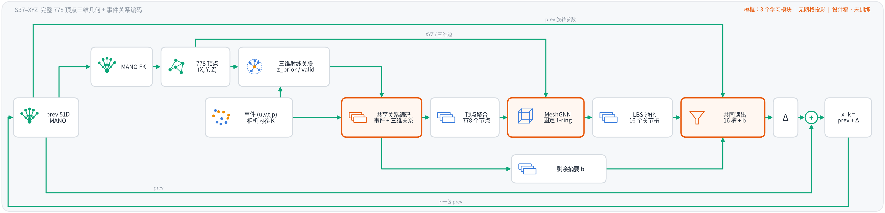

# S37–XYZ 候选：推荐结构、信息检查与训练准入

2026-09-29。同日六份稿并成这一份：完整设计、精简设计、结构审计、支路信息 DEBUG、推荐网络图、训练投入判断。当前采用臂仍为 `s37_routed`。**候选未实现、未训练，不是现有 S37 的无损剪枝。** 投入判断：现在不做完整双种子训练。

信息检查的原始记录在 `.experiments/xyz_branch_debug_20260929/`（脚本、JSON、固定输入、等价读出权重、运行日志、来源 SHA256）。该次运行哈希的是当时的 DEBUG 登记稿；登记内容在本文 §3。

## 1. 推荐结构

学习模块只有三个：**共享事件—几何关系编码 φ、一个 MeshGNN、一个共同读出**。顶点聚合、LBS 池化、剩余事件池化是确定性运算。mean、max、mass/支持与有效性是摘要里的统计，不是另外的姿态预测器。读出内部允许分组或稀疏连接；图上一个框不表示任意窄的全连接头。



[简洁版 SVG](assets/s37_xyz_recommended_template_20260929.svg) · [绘图脚本](../tools/draw_s37_xyz_template.py) · [详细版](assets/s37_xyz_recommended_20260929.png) · [箭头合同 JSON](assets/s37_xyz_recommended_20260929.json)

状态合同沿用 S37 的 51D 加性更新，并把 `prev[3:51]` 直接送入共同读出。这 48 维是 root 的 3 个轴角和 15 个关节的局部轴角，局部参数的 MANO 均值约定不变。它不经过独立 `prev_mlp`，不产生另一份增量。相同物理几何可以对应不同的数值轴角分支，不能只画 `prev + delta` 却删掉全部参数分支信息。若改用旋转复合更新，要重新审核这一输入。

### 箭头

1. **prev → 几何准备**：完整 51D 供 MANO FK。β 与 MANO 资产是确定性配置。
2. **事件与 K → 几何准备**：`(u,v,t,p)`、与事件坐标一致的 `K_event`、掩码、有效事件数。事件没有测得的 z。
3. **几何准备 → φ**：事件 token、射线、三维相对关系、`z_prior`、`valid`。关联权重与置信度是随记录传递的元数据。时间与空间在聚合前联合编码。
4. **φ → 顶点聚合**：匹配记录按 `w_ij = q_i A_ij` 写入网格。778 个顶点都保留；没有直接事件的顶点不删除。
5. **顶点聚合 → MeshGNN**：初始顶点特征 H0，以及直接事件质量与支持标记。
6. **几何准备 → MeshGNN**：完整 `V_prev[778,3]` 与固定 faces。面 1-ring 决定邻接，当前 XYZ 决定三维边向量。这是几何条件，不是另一套几何预测网络。
7. **MeshGNN → LBS 池化**：传播后的特征、传播有效性，以及透传的直接事件支持。邻居推断的特征不能标成直接观测。
8. **LBS 池化 → 共同读出**：固定蒙皮权重 W 形成 16 个按关节顺序的摘要槽，含 mean、max、支持统计与有效性。
9. **φ → 剩余事件池化**：同一个 φ 编码的无几何记录及剩余权重。必须在编码输入里写 `valid=0`，几何缺失量用占位值。不能把已匹配特征事后改标签。
10. **剩余摘要 b → 共同读出**：b 是第 17 个摘要槽，含剩余记录的 mean、max、mass/有效性。它绕过 MeshGNN，进入同一个读出，不是独立 root 预测器。
11. **prev → 共同读出**：上述 48 维原始旋转参数。
12. **共同读出 → 状态更新**：一份 51D 增量 Δs。有效事件数 N 作为元数据交给空包门。
13. **prev → 状态更新**：非空包 `s_k = s_prev + Δs`；空包直接返回原始 prev。
14. **状态更新 → 下一包 prev**：唯一的时间反馈，延迟一步。当前包不使用本包尚未算出的新状态。

简洁版里，标有 `prev 旋转参数` 的线进入读出，底部 `prev` 进入加号，最外侧 `下一包 prev` 才是时间反馈。箭头表示前向数据流。

### 权重与深度

有效事件上 `A_ij ≥ 0`，成功关联时 `sum_j A_ij = 1`，无匹配时该行为 0，且 `0 ≤ q_i ≤ 1`。直接质量 `w_ij = q_i A_ij`，剩余质量 `r_i = 1 - sum_j w_ij`。完全无匹配的事件全部进入剩余槽；弱匹配事件的未分配质量也进入该槽。掩码事件不参与聚合，也不计入 N。空组的 mean/max 置零并附显式有效性，不能让空组的零最大值盖住实际的负特征。

`z_prior` 来自历史表面关联，必须带有效性。它不是事件传感器测距。三维关联要处理可见表面和轮廓容差，不能把每条射线都赋予一个可信深度。未匹配记录不是伪造的三维节点。

不能用“同一批事件特征上的全局均值恒等式”宣称 MeshGNN 之后的摘要无损恢复了原始事件。本图保留了这些输入通路，没有证明表示无损，也没有证明去掉 EventGNN 后精度不变。宽度、层数和局部连接是实现前要登记的设计选择，不是已证明的必要深度。

复现图：`python tools/draw_s37_xyz_template.py` 与 `python tools/draw_s37_xyz_recommended.py`。生成时检查连线不穿框、不交叉，三个学习模块和读出的输入来源与本节一致。这是图形与接口检查，不是模型测试。

## 2. 几何与编码合同

本节是 §1 图所假定、同日各稿没有收回的实现合同。超参数是设计起点，正式训练前固定，不按留出序列反复调。

### 2.1 坐标

```text
d_i = K_event^{-1} [u_i, v_i, 1]^T
r_i(λ) = λ d_i,  λ > 0          # λ 是光轴深度，不是沿射线的距离
X_prior_i = z_prior_i d_i
```

`V` 与 `X_prior` 都在相机系、单位米。`K_event` 必须对应当前事件坐标：仓库 `_intrinsics` 会乘 `RENDER_SCALE`，不能拿原分辨率内参处理 240×180 事件，也不能重复缩放。非有限像素、非正深度、退化面判无效。这里没有顶点投影，也没有光栅化。换关联方向本身不增加可观测信息。已知 K 与正深度时，`(u,v) ↔ d` 与 `(V, z, d) → X_prior` 是确定性变换。

### 2.2 三类关联

不能只接收精确命中三角面的事件，否则历史失配时的轮廓事件会失去支持。

1. **射线命中表面**：最近的正向交点，按重心权重分给该面三个顶点。交点给出 `z_prior`。`mode=surface`，`valid=1`，含义只是“在当前历史网格上命中”。
2. **未命中但靠近轮廓**：用单位射线与顶点方向的夹角找候选，最多 4 个同一前表面层、无遮挡的顶点，角度核归一化。每个候选在射线上的最近点提供一个深度假设，加权均值为 `z_prior`。`mode=near`，`valid=1`，`q ≤ 1` 是核权重，不是校准概率。候选深度 `z_ij = dot(V_j, d_i) / dot(d_i, d_i)`，只接受正值。先以角度最近候选为参考，限定近前层，再取最前的深度层，拒绝超出深度容差的其他层。
3. **无可靠候选**：`valid=0`，`A_i = 0`。不补零深度当作真实几何。该事件经 `valid=0` 进入剩余槽。

轮廓候选的可见性在三维里判定：相机到候选顶点的射线若先命中更近表面，则拒绝。允许数值接触容差，拒绝背面和遮挡支持。未获直接支持的顶点仍留在网格里。

角度核从 S37 的名义关联尺度起步：`theta_max = atan(16/sqrt(fx fy))`，`sigma = theta_max/2`；近前层角度范围参考 `atan(3/sqrt(fx fy))`；深度容差初值 0.01 m。这些不是与像素距离严格等价的声明。实现可以用分块精确求交作参照，工程版用三角面加速结构，不物化 `B×N×1538` 的求交张量，不引入二维 LUT。训练预处理中的 FK 与离散关联可 `no_grad`；这只划定梯度边界，不消除历史预测误差。

### 2.3 关系编码、网格层、读出

固定尺度 `L = 0.1 m`、`Z = 1 m`。共享关系 MLP 的起点是 `12 → 64 → 128`：token7、三维相对量 `(X_prior − V)/L`、`z_prior/Z`、`valid`。`q` 与 `A` 在聚合外乘，不是另一个预测网络。未匹配记录的三维相对量与深度占位为 0，`valid=0`，表示没有有效几何，不是测得零深度。

```text
phi = RelationMLP(token7, relation, z_prior, valid)
H0_j = weighted_mean_i(phi_ij, weights = q_i A_ij)
```

先对每一对事件—顶点编码再聚合。先分别对时间和空间取均值再送网络，会把相反的时空交叉项收成同一个均值。有限宽度池化仍可能丢信息，不宣称与时空 GNN 等价。事件特征为零时，几何项不能单独生成非零 `H0`（线性层无偏置，或等价的门控）。

MeshGNN 在固定面 1-ring 上传三层、宽 128。边特征是三维差分及其长度。直接支持 `O` 与传播支持 `S` 分开：未观测顶点可以接收邻居推断，但不能标成被直接观察到。全零输入特征时，几何边不能单独激活输出。背景事件不占网格节点。没有跨包的 `778×128` 隐藏状态。

LBS 池化保留 16 个按关节顺序的槽。每个槽含传播后特征的 mean 与 max，以及只统计直接支持的份额。空组 max 按 §1 处理。DEBUG 已构造同均值、不同最大值的反例，不能只留均值。压成一个全手平均会丢掉关节槽位。

剩余槽用同一个 φ 和剩余权重 `r_i`，统计同样是 mean、max、mass/有效性。权重分母为零时均值严格为零。

共同读出的输入是 16 个关节槽、剩余槽和 `prev[3:51]`，输出一份 51D 增量。不实例化 `prev_mlp`、EventGNN、旧的 512 维全局 `proj`、以及 root 加 15 个手指头。增量头可以不设偏置，使输入特征全零时输出为零；空包门仍然逐位返回 prev。删除 `prev_mlp` 没有禁止读出通过历史旋转参数、几何特征或偏置学出新的状态先验。

不在本候选里的东西：独立事件深度头、逐顶点 GRU、全局注意力、第二套可独立输出姿态的网络。若要做独立于历史网格的事件深度，那是另一条尚未实现的线，不画进本图。

候选不能套用现有 `_decode_active`。`MeshGraphSpec` 的固定拓扑可以复用，旧网格层只有边类型，不能原样当成新的 XYZ 层。`s37_routed` 保持原样作对照。整体比较不能把同时改编码器、几何输入和读出的差异都归到三维几何上。

## 3. 信息检查

2026-09-29 执行。CPU，最多 4 个 torch 线程，种子 20260929。读 MANO 资产、路由/池化实现，以及两个 S37 已选 checkpoint 的读出权重。权重只用于等价重写，不用随机输入给姿态打分。未运行优化器、zgz 递推或 GPU 作业。来源文件在运行期间未变。

| 检查 | 判读边界 | 结果 |
|---|---|---|
| 坐标重建 | float64 容差 1e-10。证明没有新增原始观测，不证明有限网络不显式接收这些量也一样好学 | XYZ 最大误差 `1.041e-16 m`；像素/射线往返 `2.842e-14`；由相对量与顶点深度恢复 z 的误差 `0` |
| 全局摘要能否由部件摘要重建 | 同一批事件特征、现有 `pool_joint_evidence`。不能外推到先聚合到顶点再经 MeshGNN 的特征 | 补上背景后，全局均值误差 `2.220e-16`，全局最大值误差 0。不补背景时部分未匹配的均值误差 `0.407696` |
| 两个 checkpoint 的多头合并 | 保留全部输入，编译成块稀疏两层 ReLU。每种子 5 组随机输入，float64 容差 1e-9 | 输出误差 `1.776e-15` / `3.109e-15`。中间单元 1036。原头部 287878 个标量；把块稀疏形式物化成普通稠密层要存 4897223 个标量 |
| FK 与轴角分支 | 4 个合成姿态，中心差分步长 1e-5，列归一化后用最大奇异值的 1e-6 判秩。另构造 root 轴角差 2π、几何相同的例子 | 数值秩 `[51,51,51,51]`，条件数 `27.04–28.83`。顶点差 `1.155e-09 m`，加性参数残差差 `6.283185307180 rad` |
| 聚合反例 | 只证明某种摘要没有确定该差异，不证明该差异影响当前数据上的姿态精度 | 四类都成立：同关节统计但未匹配信息不同；同位置/时间均值但时空交叉项不同；同均值但最大值不同；同全手均值但关节槽位不同 |

两个 checkpoint 的 `prev_mlp` 输出都随 prev 改变。它不是死支路。从新候选里去掉它是建模选择，不是对已有 S37 的无损剪枝。128 宽的单头不是这次等价合并。

同一批节点特征上，已分配事件的关节权重行和为 1、未分配行和为 0 时：

```text
mean_all = sum_j coverage_j * mean_j + coverage_bg * mean_bg
max_all  = max(max_0, ..., max_15, max_bg)    # 空组排除
```

当前 S37 的 `coverage_j = sum_i a_ij / N`，不是新设计里的可见顶点覆盖率。这个恒等式不适用于 MeshGNN 之后的特征，也不适用于删掉 max 之后还声称可逆。

这次检查改定的六点：

1. 去掉独立的深度预测或几何预测分支有依据。射线、`z_prior` 和三维相对量来自同一组像素、K 和历史网格。只有下游还留着能重建的变量，才能叫表示冗余。
2. 全局事件读出可以并进共同摘要。背景是第 17 个槽，不必有自己的编码器或姿态头。
3. 多头可以重排，不能据此任意缩小。取消部位隔离并压成小头，是要训练验证的容量变化。
4. 收回“均值够了、最大值多余”。
5. 原始历史角只能有条件省略。完整网格在所选姿态附近保有局部自由度，但不保留全局参数分支身份。
6. 只训 MeshGNN 是为了检验“网格是否够当唯一图载体”，不是发现 EventGNN 没有用。

## 4. 是否投入训练

**不建议现在做完整双种子训练或超参数搜索。** 最多先做一次有上限的小规模机制验证，而且它不是当前追精度的优先项。推荐结构回答的是：若研究完整 XYZ 网格承载事件，信息该怎么组织。它不等于这套结构已经优于 S37。

依据：

1. §3 没有跑新网络的前向、反向、优化或闭环。完整 FK 的局部满秩不能证明池化后的特征留住了姿态。
2. `s37_meshgraph` 训练过“778 顶点、固定面 1-ring、LBS 池化”的相近组合，未过采纳门，种子分裂，延迟高于 routed。旧臂用投影归属和低维观测，不能把旧臂失败直接当成这个候选失败。诊断把不稳定主要放在 root 旋转，那不是已经由单变量训练证明的唯一原因。
3. 09-24 的 XYZ/深度记录在 `git show 85d76a1:docs/S37_XYZ_EVENT_DEPTH_ANALYSIS_20260924.md`。S37 的投影输出已经保留 z，并且 z 参与前后层选择，所以“去掉投影就补回了丢失的深度”不成立。射线表示可以留住完整 XYZ，本身不增加传感观测。那次探针的运行产物已在后续清理中删除，本次没有重跑。prev 给的深度会带上 prev 的错误；多数轮廓和遮挡事件不能解释成唯一表面点。`detach` 也不消除推理时的先验反馈。
4. 近期归因见 `S37_ROUTED_READOUT_PREREG.md` 与 `S37_ROTW_CNNROOT_PREREG.md`。更直接的目标是逐包姿态证据和根旋转读出。不把没有主行的诊断数字插进结果表。

仍然可能值得小规模看的，是未验证的归纳偏置：逐事件先联合编码时间和三维关系，再汇总到顶点；三维边向量区分表面运动方向；共同读出若真有跨关节非线性，可能松动原来的线性 root 头。没有新的原始观测，也不等于有限网络一定学不会。实施时要写明读出内部连接。保留分组权重时，要检查 root 输出确实能读到全手摘要。另外要检查：同样的 prev 下事件变化时更新是否跟着变；prev 有误差时能否朝正确方向改；prev 较准时是否多写了更新。

**阶段 0（未做）。** 最小接口和少量真实包的前向/反向：坐标、掩码、权重分配、空组/空包、梯度、数值复现、显存、完整包步时。成本含 FK、三维关联、聚合、MeshGNN 和读出。若射线关联物化出不可接受的全事件×全三角面张量，先改实现，不用加 GPU 盖住它。当前没有步时，不能承诺训练时长或比 S37 更省。

**阶段 1（未做）。** 阶段 0 合格且配置固定之后，一个种子、两份同构配置，各最多 1500 步，合计最多 3000 步，不做参数搜索。启动前按实测吞吐另写 GPU 小时上限。

- C1：图中的 XYZ 候选。
- C0：同一候选，事件、关联 A/q、固定拓扑、有效性、读出、参数规模、噪声课程和日程都相同，只把送进学习模块的显式三维关系、深度和边向量通道置零，并从头训练。
- 这只看显式三维特征在这套结构上的增量。关联仍用历史几何，读出仍接收历史旋转参数。推理时屏蔽输入不能代替匹配训练。
- 看固定验证窗口上的纠偏方向、干净 prev 的更新、root 与手指分量、短闭环。训练 loss 下降只说明实现能学习。划分和选点用当前 zgz 协议，不称为独立测试泛化。
- 数值或关联错误、或预算超限，立即停。有限预算结束后 C1 相对 C0 没有一致的正向信号，就不自动加长。那只表示这一轮不追加资源，不能宣布架构无效。单种子短训不能用于采纳。

**阶段 2（未登记）。** 只有出现正向信号后才单独写完整比较：双种子，对照 `s37_routed`。建议沿用后续臂的精度尺度：两种子均值递推 RA 至少改善 1.1 mm，且两种子各自不劣；同时锁定延迟和显存上限。这是建议的门，不是本候选已经达到的成绩。

历史对照用现有主行，不为未训练候选填数：

```bash
python tools/report_table.py s37_routed s37_meshgraph \
  --label 's37_routed=S37 路由读出（当前臂）' \
  --label 's37_meshgraph=历史 S37 网格图（非本次 XYZ 候选）'
```

## 5. 并进来的六份稿

| 原文件 | 收进本文的部分 | 不再单独保留的原因 |
|---|---|---|
| `S37_XYZ_EVENT_DEPTH_DESIGN_20260929.md` | §2 的射线求交、轮廓容差、O/S、零证据约束 | 同时保留 EventGNN、`prev_mlp` 和 512 维全局支路，是为了少改变量，不是最小结构 |
| `S37_XYZ_EVENT_DEPTH_MINIMAL_DESIGN_20260929.md` | 事件侧改为共享编码、删 `prev_mlp`、未匹配质量 `r_i` | 仍用 root + 15 个头，并把历史角留在每个手指头上 |
| `S37_XYZ_STRUCTURE_AUDIT_20260929.md` | 三个学习模块、共享 φ、剩余槽进同一个读出 | 执行前写成了“只留均值、历史角可删、128 宽单头”。§3 收回这三条 |
| `S37_XYZ_BRANCH_DEBUG_PREREG_20260929.md` | §3 的全部数值与六点改定 | 登记与结果已回填 |
| `S37_XYZ_RECOMMENDED_NETWORK_20260929.md` | §1 的图和箭头 | 结构合同本身 |
| `S37_XYZ_TRAINING_VALUE_PREREG_20260929.md` | §4 | 投入判断本身 |

过程图仍可由 `tools/draw_s37_xyz_depth_design.py` 与 `tools/draw_s37_xyz_depth_minimal.py` 生成，对应被本节取代的前两版，不是当前推荐。
