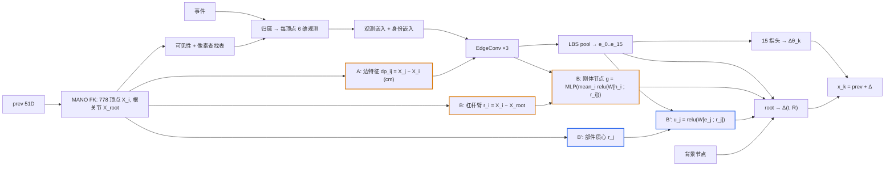

# S38 三维网格图：prev 的 FK 几何以相对量进边——两臂预注册（mesh3d / rootlever）

> 2026-09-20 00:30–01:00，训练启动前写定。起点是用户的问题："778 个顶点是 3D 的，构图时点集、边集都建在 3D 里，
> 新状态来时事件动态影响局部或全局——2D 的网络改成 3D 的可不可以？"对话中的判断：可以，而且 S37 网格图唯一的失败点
> （root 旋转两种子分裂）正好指向"缺 3D"；但"2D → 3D"要拆成互相独立的单变量，本文只做其中直接对应失败点的两个，
> 不做动态 kNN 建边（结构随状态变——KEG 的教训；1-ring 已是精确的表面邻域）。
>
> 协议：9 受试者 72 条序列训练（`splits_semkine.json`），验证、选点、上报只用留出受试者 zgz 的两条序列（2590 帧），
> 50 ms 步长，固定 500 步网格，`tools/select_checkpoint.py` 递推 RA 选点，两种子 3407 / 3408。
> 对照 = `s37_meshgraph`（24.89；3407 **20.48** / 3408 29.30）与 `s37_fkgraph`（22.10；22.64 / 21.56），
> 当前臂 `s37_routed`（20.74）。两臂对 S37 网格图**各只改一处**，`tests/test_s38_mesh3d.py` 锁定 config diff。
>
> **结论（09-21 11:30）**：**S38a 不过**——递推 RA 26.90（3407 **30.45**，选在 step 500 / 3408 23.34）对 meshgraph 24.89、fk_graph 22.10；
> TF 单步 7.07 是全线最低，闭环放大率 **4.26** 是全线最高：prev 的几何进了顶点特征后被当成先验用，闭环回灌。
> **S38b 过预注册精度门但不换臂**——RA 21.76（22.05 / 21.48）< fk_graph 22.10 且逐种子不劣；网格图的种子分裂消失（20.48 / 29.30 → 22.05 / 21.48），
> 闭环旋转 p50 19.7° / 17.0°（网格 sd 7.4 / 8.9 → 5.2 / 4.7），手指 19.6 ± 1.3 / 18.8 ± 1.9 是全线最稳；但对当前臂 routed 20.74 仍 +1.02，
> 网格中位 30–32 差于 fk_graph 26.8，abs 77 差于 meshgraph 59 / fk_graph 67，**TF 旋转没有改善**（`val_rot_loss` 全线平在 0.002–0.003，H5 成立）。
> 机制门两臂都过，但置零后劣化 +65 / +18、+109 / +28 mm 远大于 meshgraph 的 +23 / +27：root 重度依赖新加的几何项。**当前臂仍为 S37 路由读出。**

---

## 1. 起点：S37 网格图里哪些是 3D、哪些是 2D

| 环节 | S37 现状 | 维度 |
|---|---|---|
| 节点位置 | prev →FK→ 778 顶点 (x,y,z)，只用于投影、可见性、LBS 池化 | 3D，但**不进网络** |
| 可见性 | 面法向背面剔除 + z-buffer | 3D |
| 事件→节点 | 像素最近可见顶点（≤ 16 px） | 2D（事件本身是 2D 观测） |
| 节点输入 | 6 维：计数份额、平均偏移 (Δu,Δv)/16 px、离散度、时间、极性 | 纯像素量，无深度、无参考系 |
| 边 | 面 1-ring；边特征 = one-hot 边类型，而网格图只有一种类型 | **无几何**：每条边特征恒为 [1,0,0]，消息 `relu(W[h_j−h_i; 1,0,0])` 对邻居排列不变——一个学出来的各向同性拉普拉斯 |
| 读出 | 15 指头读 [e_k ‖ prev 角]；root 一层线性读 [16×257 ‖ 背景 128] | 无杠杆臂、无朝向 |

图是在 3D 里**建**的，网络是在 2D 里**算**的。`EdgeConv` 的 3 个边通道在网格图里是浪费的，所以 (A) 是零参数改动。

资产实测（本会话，`assets/mano_right.npz`）：平均边长 **7.9 mm**（中位 6.7，最大 23.9）；3 跳平均覆盖 **29.6 mm**（最大 51）；
腕部顶点到指尖 **22 跳**，全手平均 13.2 跳。数据实测：训练 72 条序列根深度中位 0.48–0.66 m（各受试者），zgz_global 0.56、
zgz_local **0.72 m**；渲染系 f = 226 px，0.53 m 处 1 px ≈ 2.3 mm，16 px 带 ≈ 35 mm。

## 2. 为什么失败点是"缺 3D"：旋转读出是双线性的

S37 判读：RA 与 root 旋转误差相关 **0.96 / 0.89**，与手指误差相关 −0.01 / −0.20；网格上旋转 3407 24°±7°、3408 46°±9°，
fk_graph 钉在 22–23°±2–4°；手指两种子一致（20.4 / 22.9）。文档里的原因是"只有 1-ring 边、3 跳、root 拿不到全局信息"。
这成立（§1 的跳数），但还有一层：

绕腕小转角 ω 时顶点位移 δX_i = ω × r_i，r_i = X_i − X_root 是**相机系**杠杆臂；像面偏移 δu_i ≈ (f/z_i)(δX_i)_xy。
由 {δu_i} 解 ω 是 ω = (Σ[r_i]ₓᵀ[r_i]ₓ)⁻¹ Σ[r_i]ₓᵀ δX_i：对 δu 线性，但系数是 r_i 的函数，而 r_i^cam = R_root·r_i^rest 随 prev
的根旋转转。S37 的证据通路里没有 R_root——节点身份嵌入最多记住 r^rest，prev 只经 `prev_mlp` **加性**进入，root 头是一层线性。
线性层表示不了"随 R_root 变的系数 × δu"这个乘积，只能拟合训练分布里的平均朝向；拟合得成不成看训练落点 → 两种子分裂、
网格上 15°–60° 摆。手指头要的 Δθ_k 是骨局部量，观测相对本顶点像素，对 R_root 依赖弱，所以两种子一致。
fk_graph 也从未读出旋转（H3 增益 ≤ 0.19），只是"稳定地读不出"；两臂都没有旋转的**机制**。

这是假设，不是结论。检验：把杠杆臂放进证据通路，看旋转是否稳定下来。

## 3. 设计（`semkine/mesh_graph.py`，`model/model.py::_mesh_graph_forward`）

几何全部来自 prev 的 FK、`no_grad`、相机系、**厘米**（`MESH_GRAPH_GEO_SCALE: 100`），全部是**相对量**：
边向量、绕根关节的杠杆臂、部件质心相对根关节。绝对坐标不进网络。枢轴 = posed MANO 根关节（OpenPose 关节 0），
即 root 旋转增量作用的那一点。

### S38a `s38_mesh3d`（A + B：边带 3D 几何）

- **(A) 1-ring 边特征 = X_j − X_i**（`edge_vectors`），取代常数 one-hot 边类型；`EdgeConv` 的 3 个边通道恰好装下，
  **零参数**改动；表面算子从各向同性变各向异性。只有 gather，逐位可复现。
- **(B) 刚体节点**（`RigidNode`）：`g = MLP( mean_{i: has_i} relu(W[h_i ; r_i]) )`，r_i = (X_i − X_root)·100，
  连所有看见事件的顶点；无顶点时**恰为零**。root 头读 [16 证据 ‖ 背景 ‖ g]。这是 S37 网格图缺的长程通路，
  也是力矩 Σ r_i × δ_i 能形成的地方（逐顶点非线性再求均值，而 LBS 部件均值把部件内的反对称场平均掉了）。
  掩码 = `has`（事件只交给可见顶点，has ⊆ vis）；均值是掩码求和，无原子操作。
- 其余全部与 S37 网格图相同：节点、归属、可见性、6 维观测、LBS pool、指头、`prev_mlp`、`ZERO_EVENT_GATE`、训练、课程、网格、DDP。
- 参数 **0.471 M**（S37 0.437，+8%），MACs 0.327 G（0.314，+4%）；显存增量 B×779×8×3×4 B ≈ 38 MB @ 512。

### S38b `s38_rootlever`（B′：图不动，只给 root 杠杆臂）

- root 头额外读 `u_j = relu(W[e_j ; r_j]) · seen_j`（`PartLever`，16 个部件共享一个 W，宽 64），
  r_j = 部件蒙皮加权质心 − X_root（厘米）；未看见的部件 u_j **恰为零**。root 输入 = [16 证据 ‖ 背景 ‖ u_0..u_15]。
- 这是对 §2 假设的最小检验：不改图、不改池化、不改指头，只让 root 在线性读之前能按部件形成"朝向相关系数 × 位移"。
  最初的全连接 MLP 版本（4336 → 256 → 6）要 1.1 M 参数，是整个 S37 模型的 2.5 倍，会把"杠杆臂"和"容量"混在一起，
  故改成逐部件共享权重：参数 **0.460 M**（+5%），MACs 0.315 G。
- 两臂对照读法：B′ 也把旋转稳住 → 杠杆臂是关键，图上的 3D 边不是；只有 S38a 稳 → 需要逐顶点力矩 / 长程通路；
  两个都不稳 → 问题不在表示（见 §5 H5）。

### 与 S37 定义的冲突及放开条件

fk_graph 预注册写的是用户的定义："FK 的几何量不进节点特征、不进边特征"。本文反过来，条件三个：
(1) 只以**相对量**进入——绝对坐标 = prev 本身，会重开"读 prev 不读事件"的捷径，相对量只提供解释事件的参考系；
(2) 机制门仍可定义——`ablate_evidence` 置零观测与 `has`，LBS pool、刚体节点、部件杠杆项都恰为零，几何保留（它是先验不是证据）；
(3) 用 prev 噪声扫描与 oracle 几何报告闭环敏感度（§4）。fk_graph 的判读已表明这一族读的是"prev 与事件的差"而非 prev 本身。



## 4. 预注册门槛（zgz，两种子；训练前写定）

- **精度**：递推 RA 两种子均值 **< 22.10**（fk_graph）且逐种子不劣于 fk_graph 同种子；报告对 meshgraph（24.89）与 routed（20.74）的差。
- **旋转**（主假设的直接读数，`tools/probe_s37_meshgraph.py --grid`）：选点处闭环旋转 p50 **≤ 22°**，且整张网格上旋转 p50 的 **sd ≤ 4°**
  （fk_graph 水平：22.4°±4.3° / 23.0°±2.4°；meshgraph 24.3°±7.4° / 45.6°±8.9°）。
- **手指**（旋转对齐后残差）：闭环 **18–23**，不劣于 meshgraph（选点 17.9 / 18.4，网格均值 20.4 / 22.9）。
- **机制门**：同一 checkpoint `ablate_evidence`，递推 RA 劣化 ≥ **1.5 mm**。
- **闭环敏感度**（`run_closed_loop_probe.py --prev-noise 0.5,1,2,4`）：条件误差 26 mm 时单步 RA **≤ 16.9**（meshgraph 16.87），
  保留率 gain_rand **≤ 0.72**（meshgraph 0.715 / 0.698）。几何来自 prev，prev 错时几何错——这一条测的就是它。
- **成本**：主行记录延迟 / FLOPs / 参数（`tools/make_s36_row.py`，头部 MACs 已改为按模块计数）。
- 结果无论如何写入本文与账本 zgz 表，并报告到 CNN+渲染+域随机化基线（11.9–13.3）的距离。

## 5. 预注册假设

| 假设 | 测什么 | 判据 |
|---|---|---|
| **H1** 杠杆臂让旋转可读且稳定 | 两臂闭环旋转 p50 与网格 sd，对 meshgraph / fk_graph | p50 ≤ 22° 且 sd ≤ 4°，两种子一致 |
| **H2** 手指不受影响 | 闭环手指误差（旋转对齐后） | 18–23，两种子 sd ≤ 3.5 |
| **H3** 3D 边 vs 部件杠杆臂 | S38a 与 S38b 的旋转读数 | 同稳 → 杠杆臂是关键；只 S38a 稳 → 需要逐顶点力矩；见 §3 |
| **H4** 几何不放大闭环 | prev 噪声扫描 | 单步 RA@26 mm ≤ 16.9，保留率 ≤ 0.72 |
| **H5** 若旋转不动，问题在课程 | TB `val_rot_loss`（TF）step 1k→6k | 两臂 TF 旋转都不降 → 0.3 rad 旋转噪声总伴随 50 mm 平移与大幅手指噪声（fk_graph H7），下一步改课程而非改图 |
| **H6** 承重 | 观测置零后闭环 RA | 劣化 ≥ 1.5 mm |

**预测（训练前）**：S38a 旋转 p50 12–18°、sd 3–5°、两种子一致，递推 RA 18–20，手指 18–23 不变；S38b 旋转 p50 18–22°、sd 4–6°，
RA 20–22；两臂 TF 单步 ≈ 8–9。

## 6. 命令

```bash
python -m pytest tests/test_s38_mesh3d.py tests/test_s37_mesh_graph.py tests/test_s37_fk_graph.py -q   # 17 + 12 + 9 项契约
tools/run_s38.sh                                                     # 等 GPU 4-7 空出后依次跑两臂（各两种子），见脚本头
#   等价于：tools/run_zgz_protocol.sh s38_mesh3d && tools/run_zgz_protocol.sh s38_rootlever
python tools/make_s36_row.py --run s38_mesh3d                        # 主行；rootlever 同
CUDA_VISIBLE_DEVICES=4 python tools/probe_s37_meshgraph.py --grid --seq zgz_local --out outputs/semkine/probe_s38_rotdecomp.json \
    --runs outputs/semkine/s38_mesh3d_s3407 outputs/semkine/s38_mesh3d_s3408 \
           outputs/semkine/s38_rootlever_s3407 outputs/semkine/s38_rootlever_s3408
CUDA_VISIBLE_DEVICES=6 python tools/run_closed_loop_probe.py --split val_core --prev-noise 0.5,1,2,4 \
    --out outputs/semkine/closed_loop_s38_vs_meshgraph.json \
    --arm m3d_3407=<selected ckpt>:configs/semkine/s38_mesh3d_s3407.yaml \
    --arm m3d_3408=<selected ckpt>:configs/semkine/s38_mesh3d_s3407.yaml \
    --arm rl_3407=<selected ckpt>:configs/semkine/s38_rootlever_s3407.yaml \
    --arm rl_3408=<selected ckpt>:configs/semkine/s38_rootlever_s3407.yaml \
    --arm mg_3407=outputs/semkine/s37_meshgraph_s3407/s37_meshgraph_s3407-step=3000.ckpt:configs/semkine/s37_meshgraph_s3407.yaml \
    --arm mg_3408=outputs/semkine/s37_meshgraph_s3408/s37_meshgraph_s3408-step=5000.ckpt:configs/semkine/s37_meshgraph_s3407.yaml
```

## 7. 变更记录

- 09-20 00:30：对话中确定方案（用户选择：S38a 与 S38b 并行；1-ring 边向量用相机系）。
- 09-20 00:45–01:00：实现。`semkine/mesh_graph.py` 新增 `GEO_SCALE`、`edge_vectors`、`lever_arms`、`part_positions`、
  `RigidNode`、`PartLever`；`FKGraphEncoder.forward(obs, edge_feat=None)`（无 edge_feat 时行为不变）；
  `model.py` 新增 4 个 MODEL 键 `MESH_GRAPH_EDGE_GEO / RIGID_NODE / ROOT_LEVER / GEO_SCALE`，全关 = S37 网格图**逐位相同**
  （S37 checkpoint `strict` 加载无缺失、无多余键）。`tests/test_s38_mesh3d.py` 17 项契约 + S37 21 项全过。
  CPU 冒烟三臂前向/反向有限；bf16 autocast 通过；每个参数都有梯度（DDP `find_unused_parameters=False` 安全）。
- 09-20 00:55：S38b 由全连接 root MLP（1.1 M 参数）改为逐部件共享的 `PartLever`（+23 k），理由见 §3。
- 09-20 01:00：GPU 0–7 全部被另一项目 `train_evtcv4d.py` 占用（每卡 41/46 GB，已运行 8 h+），训练**未启动**；
  `tools/run_s38.sh` 等 GPU 4–7 各有 ≥ 12 GB 空闲后依次跑两臂。01:15 队列挂上。
- 09-20 15:15：另一会话补 `tools/probe_s38_gate.py`（机制门）与 `tools/finish_s38.sh`（训完自动跑主行 / 旋转分解 / 机制门 / 闭环探针 / 汇总），挂上等 `S38_DONE`。
- 09-20 17:45：GPU 空出，`s38_mesh3d` 两种子并行训练 → 19:11 选点完成；`s38_rootlever` 19:11 → 20:30。`finish_s38.sh` 20:32 → 21:06 全部跑完
  （`logs/finish_s38_summary.log`）。四个 run 的主行复现漂移 **0.0000 mm**。
- 09-21 11:30：§8 / §9 填入，账本 zgz 表与 §2 更新。

## 8. 结果（2026-09-20，两臂 × 两种子，zgz 两条序列 2590 帧）

产物：`outputs/semkine/s38_{mesh3d,rootlever}_s340{7,8}/selection_val_core_step50.json`、`s38_{mesh3d,rootlever}_main_row.json`、
`probe_s38_rotdecomp.json`、`probe_s38_gate.json`、`closed_loop_s38_vs_meshgraph.json`；日志 `logs/s38_*`、`logs/finish_s38_summary.log`、
`logs/probe_s38_*.log`、`logs/closed_loop_s38.log`。

| | meshgraph 3407 / 3408（均） | fk_graph（均） | **S38a mesh3d 3407 / 3408（均）** | **S38b rootlever 3407 / 3408（均）** | 门槛 | 判定 |
|---|---|---|---|---|---|---|
| 递推 RA（选点） | 20.48 / 29.30（24.89） | 22.64 / 21.56（22.10） | **30.45** / 23.34（**26.90**） | **22.05** / **21.48**（**21.76**） | 均值 < 22.10 且逐种子不劣 | S38a **不过**（+4.80）；S38b **过**（−0.34；逐种子 −0.59 / −0.08） |
| 选中 step；网格中位（spread） | 3000 / 5000；27.9（14.3）/ 37.8（26.3） | 2000 / 1500；26.8（9.0）/ 26.8（6.1） | **500** / 6000；38.4（14.2）/ 31.7（8.8） | 2000 / 5000；32.0（13.6）/ 30.4（14.2） | — | S38a 3407 整张网格都坏，最好的是几乎没训的 step 500 |
| local / global RA | 36.32 / 14.96 | 30.92 / 14.43 | 37.39 / 17.78 | 30.15 / 14.48 | — | S38b local 与 fk_graph 同；S38a 两者皆劣 |
| abs MPJPE | 55.6 / 62.3（59.0） | 58.9 / 75.8（67.4） | 97.8 / 62.6（80.2） | 77.6 / 75.8（76.7） | — | 两臂 abs 都劣于 meshgraph |
| 闭环旋转 p50（选点，zgz_local） | 15.6° / 28.2° | 20.8° / 23.9° | 29.4° / 19.3° | **19.7° / 17.0°** | ≤ 22° | S38a 3407 不过；S38b 两种子过 |
| 网格旋转 p50 均值 ± sd | 24.3 ± 7.4 / 45.6 ± 8.9 | 22.4 ± 4.3 / 23.0 ± 2.4 | 42.5 ± 6.6 / 32.0 ± 6.7 | 27.8 ± **5.2** / 27.5 ± **4.7** | sd ≤ 4° | 都不过；S38b 最近（均值高于 fk_graph） |
| 手指（旋转对齐后）选点 / 网格 | 17.9 / 18.4；20.4 ± 2.6 / 22.9 ± 3.5 | 24.7 / 26.2；21.0 ± 2.9 / 22.2 ± 2.1 | 20.8 / 27.7；21.7 ± 2.7 / 20.6 ± 3.2 | 20.1 / 18.8；**19.6 ± 1.3 / 18.8 ± 1.9** | 18–23 | S38b 过且 sd 全线最小；S38a 3408 选点 27.7 不过 |
| TF 旋转 p50（zgz_local） | 6.5° / 10.0° | 7.9° / 9.3° | 7.4° / 8.0° | 9.3° / 6.0° | — | **无改善** |
| TB `val_rot_loss` 1k→5k（TF） | 0.0027→0.0035 / 0.0031→0.0041 | — | 0.0039→0.0036 / 0.0022→0.0034 | 0.0023→0.0030 / 0.0026→0.0032 | — | 全线平在 0.002–0.004，随训练不降（H5） |
| TF / 递推 / 放大率（闭环探针） | 8.07 / 20.24 / 2.51；10.32 / 29.54 / 2.86 | 9.24 / 22.62 / 2.45；8.87 / 21.57 / 2.43 | **7.07** / 30.11 / **4.26**；8.30 / 24.86 / 2.99 | 9.17 / 22.62 / 2.47；6.86 / 21.45 / 3.13 | — | S38a 3407：TF 全线最低、放大率全线最高 |
| 单步 RA @ 条件误差 3.3 / 6.6 / 13.2 / 26.0 mm | 8.32 / 9.07 / 11.49 / 16.87 | 9.43 / 9.97 / 11.80 / 16.68 | 7.52 / 8.70 / 11.88 / **18.68**；8.45 / 9.07 / 11.25 / 16.27 | 9.48 / 10.29 / 12.63 / 17.28；7.21 / 8.24 / 10.96 / 16.25 | @26 ≤ 16.9 | S38a 3407 不过；S38b 3407 差 0.4 不过、3408 过 |
| 机制门：观测置零后闭环 RA | 42.8（+22.6）/ 56.9（+27.4） | 101（+79） | 95.8（**+65.3**）/ 41.6（+18.2）；abs 11013 / 170 | 130.7（**+108.7**）/ 49.4（+28.0）；abs 978 / 165 | ≥ 1.5 | 都过；劣化量远大于 meshgraph |
| corr(网格 RA, 旋转) / (RA, 手指) | 0.96 / −0.01；0.89 / −0.20 | 0.91 / −0.02；0.34 / −0.60 | 0.80 / −0.19；0.76 / 0.00 | 0.97 / −0.26；0.73 / 0.20 | — | 不稳定仍全在 root 旋转 |
| 主行：延迟 / FLOPs / 参数 | 11.99 ms / 0.314 G / 0.44 M | 5.38 / 0.084 / 0.23 | 13.07 ms / 0.327 G / 0.47 M | 12.83 ms / 0.315 G / 0.46 M | 记录 | |

**网格轨迹（闭环 zgz_local，step: RA / 旋转 p50）**：S38a 3407 `5:41/29° 10:52/40° 15:74/54° … 60:57/49°`——从第一个 checkpoint 起就在 40 以上、
越训越坏；S38b 3407 `5:27/20° 20:31/20° 25:50/31° … 60:45/28°`——前 2000 步好，之后退化到 45–52（与 fk_graph "最佳点都在前 2000 步、后半退化"同一形态）；
S38b 3408 前 4500 步 35–50、step 5000 突降到 31 / 17°。

## 9. 判读

- **H1（杠杆臂让旋转可读且稳定）：TF 部分不成立，闭环稳定性部分成立。** TF 旋转 p50 S38b 9.3° / 6.0° 对 meshgraph 6.5° / 10.0°，`val_rot_loss` 同一区间且
  随训练不降——把杠杆臂放进证据通路**没有让旋转更可读**。闭环上 S38b 两种子 p50 19.7° / 17.0°（≤ 22°）、网格 sd 5.2 / 4.7（meshgraph 7.4 / 8.9），
  分裂消失；但网格旋转均值 27.8 / 27.5 高于 fk_graph 22.4 / 23.0——变的是**一致性**，不是精度。
- **H2（手指不受影响）：成立。** S38b 19.6 ± 1.3 / 18.8 ± 1.9，全线最稳；S38a 21.7 ± 2.7 / 20.6 ± 3.2 与 meshgraph 同。
- **H3（3D 边 vs 部件杠杆臂）：B′ 稳、S38a 不稳 → 部件级杠杆臂对 root 一致性有用；逐顶点 3D 边 + 刚体节点有害。** 与预注册的读法一致，方向与预测相反。
- **H4（几何不放大闭环）：S38a 不成立**——放大率 4.26 / 2.99（meshgraph 2.51 / 2.86），条件误差 26 mm 处单步 18.68（16.87）；S38b 与 meshgraph 同（2.47 / 3.13，17.28 / 16.25）。
- **H5（若旋转不动，问题在课程）：成立。** 四个 run 的 TF `val_rot_loss` 都平在 0.002–0.004、2k 之后不再下降，与 meshgraph 相同；表示层的两种改法都没动它。
  按预注册：下一个变量是课程（0.3 rad 旋转噪声总与 50 mm 平移、大幅手指噪声同时出现，fk_graph H7），不是再改图。
- **H6（承重）：成立，且过头。** 置零后 S38a +65 / +18、S38b +109 / +28 mm（meshgraph +23 / +27），abs 达 11 m / 1 m：root 头重度依赖新加的几何项，
  拿掉后剩下的通路（背景节点 + 偏置 + `prev_mlp`）失衡，开环飞掉。

**本质原因。** 几何是以 `relu(W_h h_i + W_r r_i + b)`（刚体节点）、`X_j − X_i`（边）和 `relu(W_e e_j + W_r r_j + b)`（部件杠杆项）的形式进入的——
`W_r r` 一项只依赖 prev，**不管事件说什么都在**。16 个部件质心相对根关节的相机系位置就是手的朝向加关节构型，1-ring 边向量就是局部表面朝向，
即 prev 本身；网络把它们当先验用了。证据：S38a 3407 TF 7.07 全线最低而递推 30.1、放大率 4.26——TF 里 prev = GT + 噪声，prev 先验有信息；
闭环里它回灌。这就是账本里"原 S37 FK 直连"被撤回的那条理由（"方法退化为 MANO 先验驱动跟踪"）与 KEG 的回路增益 0.91 的同一机制，
§3 里"只以相对量进入"的放开条件**不够**：相对量仍是状态。S38b 只在 root 头、经 64 维瓶颈、被 `seen_j` 门住，回路没有炸，
但 TF 旋转也没有变好——它的收益是一致性 / 正则，不是"旋转变得可读"。

**留给后续的单变量。** (1) **课程**（H5 指向的变量）：把 root 旋转噪声与平移 / 手指噪声解耦，或降低 0.3 rad 大噪声的比例，其余不动——先于任何表示层改动。
(2) 若再碰几何：只允许几何**乘**证据——力矩 `r_i × δ_i`（δ = 0 时恰为零）、或把观测转到骨局部系（方案 C）——不允许 `W_r r` 这种独立于证据的加性项；
契约里加一条"证据为零的节点 / 部件对输出的贡献恰为零，不论几何"。(3) S38b 的网格形态与 fk_graph 相同（前 2000 步好、后半退化到 45–52），
早停 / 更强域随机化仍是待测变量。**两臂都不换臂**；checkpoint 与全部 JSON 保留作对照；当前臂仍为 S37 路由读出。
