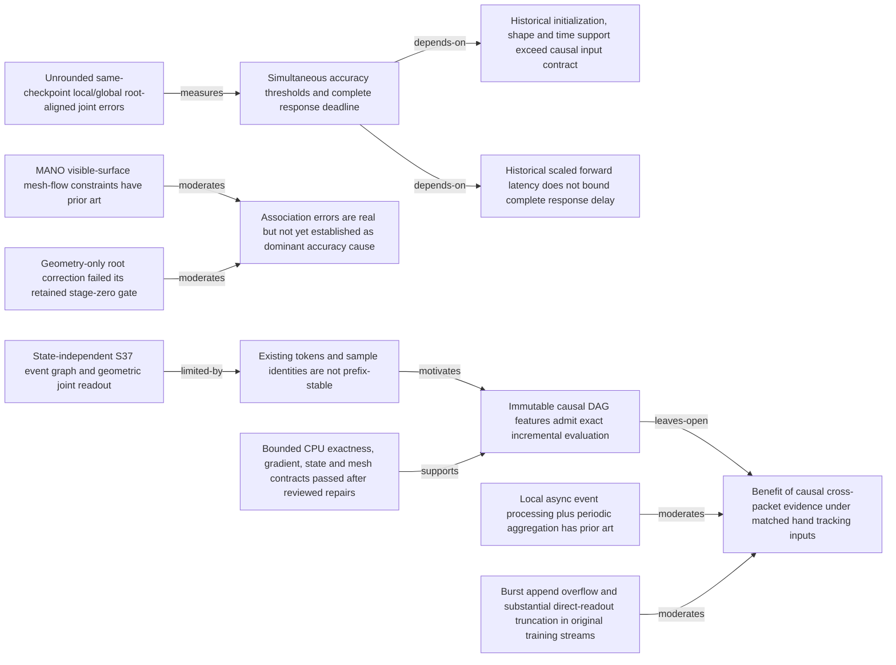

# S37 causal monocular event MANO opportunities

## Opportunity graph

## Ranked opportunities

| Rank | Opportunity | Gate | Score | Derived from |
|---:|---|---|---:|---|
| 1 | C0 minimal protocol and precision control | hold | 80.0 | State-independent S37 event graph and geometric joint readout, Historical initialization, shape and time support exceed causal input contract, Historical scaled forward latency does not bound complete response delay |
| 2 | C1 exact causal evidence cache with S37 routed readout | hold | 71.0 | Existing tokens and sample identities are not prefix-stable, Immutable causal DAG features admit exact incremental evaluation, Local async event processing plus periodic aggregation has prior art, Benefit of causal cross-packet evidence under matched hand tracking inputs |
| 3 | C2 conditional visibility association correction | hold | 53.0 | MANO visible-surface mesh-flow constraints have prior art, Geometry-only root correction failed its retained stage-zero gate, Association errors are real but not yet established as dominant accuracy cause |

## Opportunity details

### O00: C0 minimal protocol and precision control

- Question: C0 minimal protocol and precision control improves which verified limitation?
- Rationale: Known defects require controls; no novelty claim.
- Falsifier: Same-observation parity fails, or matched temporal/association destruction retains claimed gain.
- Confirmatory view: Frozen causal input, same checkpoint, unchanged local/global MPJPE formulas and full delay.
- Same-prediction parity: hold
- Decision rule: Debug all pass before screening; final acceptance requires all original thresholds.
- Next step: Close burst handling; obtain GPU budget and test complete load/long-stream contracts; no training until mandatory gates pass.

### O01: C1 exact causal evidence cache with S37 routed readout

- Question: C1 exact causal evidence cache with S37 routed readout improves which verified limitation?
- Rationale: Necessary streaming repair; accuracy effect and novelty remain unverified.
- Falsifier: Same-observation parity fails, or matched temporal/association destruction retains claimed gain.
- Confirmatory view: Frozen causal input, same checkpoint, unchanged local/global MPJPE formulas and full delay.
- Same-prediction parity: hold
- Decision rule: Debug all pass before screening; final acceptance requires all original thresholds.
- Next step: Close burst handling; obtain GPU budget and test complete load/long-stream contracts; no training until mandatory gates pass.

### O02: C2 conditional visibility association correction

- Question: C2 conditional visibility association correction improves which verified limitation?
- Rationale: Prior mixed-sign interventions and geometry failure keep necessity unresolved.
- Falsifier: Same-observation parity fails, or matched temporal/association destruction retains claimed gain.
- Confirmatory view: Frozen causal input, same checkpoint, unchanged local/global MPJPE formulas and full delay.
- Same-prediction parity: hold
- Decision rule: Debug all pass before screening; final acceptance requires all original thresholds.
- Next step: Close burst handling; obtain GPU budget and test complete load/long-stream contracts; no training until mandatory gates pass.
