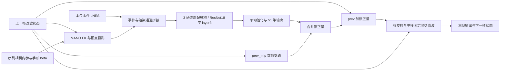

# 网络结构分析：S37 路由读出的结构问题、文献对照与下一轮待验证假设

> **2026-10-04 单目网格补充：** 单目 GCN／图网络 mesh 重建及前次遗漏补充见 [附录 H](#s37-mesh-20261004)，含正式出版身份、方法核读、图节点与输出区别，以及对当前 S37 的适用边界。

> **2026-10-04 更新：** 当前 S37 路由方法的十四方向调研见 [附录 G](#s37-literature-20261004)，本轮仅纳入已核验的中科院大类一区且 Top 期刊或 CCF A/B 主会正式长文。较新的 H2/H5、G3/E8 裁决和当前代码事实以 G.0 为准；下方较早诊断保留为历史记录。

> **2026-10-03 更新：** 本轮针对 `dt_dz_l3 + 滤波` 的十二方向调研见 [附录 F](#dt-literature-20261003)。此前正文与附录 A/B 主要描述历史 S37，不能直接当作 DT 的诊断；新增正文核验、更正、模块映射与条件性修改建议集中在附录 F。

> 2026-09-29。起点是对 `s37_routed` 计算图的逐行代码分析（同日）。本文不改代码、不提出大规模重构。
>
> **第二轮（同日晚，§8–§15）改写了第一轮的排序。** 20 个子代理分头做了代码审计、已有实验复核、顶会与期刊文献、实验设计，
> 交付物（20 个文件，已浓缩并入本文附录 B，原文件已删除）原在 `docs/research/lit_hyp_20260929/`。第一轮排第一的"状态依赖融合增益"（原 H1）被降级：仓库现象（同包迭代收敛点 ≈ 闭环误差、
> 课程臂落在同一条权衡线上）与文献（E-3DPSM 把 Q/R 改成输入相关后反而变差；学习增益只在"有显式新息、观测质量瞬时变化"时占优）
> 都指向**逐包信念本身的偏差**，而不是融合规则。第二轮最值得验证的三个假设（§14）：
> **H1 闭环误差由时间相关的逐包信念偏差决定，融合增益不是瓶颈**；
> **H2 信念的上限在事件编码器——时间近视、按时间等步长抽样、一阶池化、按事件计数定义邻域**；
> **H3 根与手指的"方向错"是同一机制——更新朝有偏的逐包信念收缩，而不是缺父系坐标系**。
> 成本最低、信息量最大的单个实验是**绝对姿态可解码性探针**（§14.4，零训练，约 1 GPU·h）。
> 运行时证据（§16）：H1、H3 已被零训练探针支持；H2（绝对可解码性）与 H5（事件率）待重跑。
>
> 第一轮原文（§0–§7）保留；被第二轮更正或降级的地方在 §1 表末与 §6 开头标出。

---

## 0. 过程与核验口径

- 5 个子代理并行、独立检索（分工：事件相机手部/人体；时序/递推/状态空间；MANO 解码与根；人体网格方法向手部迁移；
  审稿式核验与新颖性反例）。模型为 Sonnet 5（Sonnet 5.5 在当时的环境里不存在）。中途一次 API 额度中断后续跑，
  随后按用户指令提前停止检索，只用已读原文交报告。主代理没有再做检索，只做跨代理对照，并对照仓库代码与产物核查建议。
- CVF 页面当时一律返回 403，核验主要来自 arXiv / ar5iv 原文。去重后约 75 篇读过方法部分，18 篇被 ≥2 个代理独立读过。
- 检索被提前终止，因此本文所有"暂未找到直接对应工作"的判断可信度为中等。

**标记**

- 【A】代码事实（逐行确认，附 `file:line`）
- 【A·测】仓库实测（`docs/` 与 `outputs/` 中的测量，不是代码推导）
- 【B】假设
- 【C】文献支持的结论
- 核验：✔✔ ≥2 个代理独立读过原文；✔ 1 个代理读过原文；◐ 仅摘要；✘ 未完成原文核验

## 1. 交叉核验中更正或降级的内容

| 项目 | 问题 | 处理 |
|---|---|---|
| HandDGP | 两个代理读同一张 Table 2，幅度不一致（2.7 mm vs 81.3→46.3 mm）；venue 也不一致（ECCV 2024 / arXiv） | 只引"几何求解优于对照"的方向；幅度与 venue 标 ✘ |
| Ev2Hands | 窗口长度两个代理读法不一致（约 11 ms / 2 ms） | 不引窗口长度 |
| TCMR | 只有 1 个代理经 PDF 文本代理读到原文，另 2 个未能打开 | 降为 ✔ |
| KITRO | −36.7% 的收益依赖测试时的 2D 线索，线索来源未核实 | 不作为"层级解码本身有效"的证据 |
| "去掉 prev_mlp 对根旋转的回拉"（依据 HMP） | 与仓库实测冲突：去掉整个 `prev_mlp` 闭环发散（RA 81–101，`S37_ROUTED_READOUT_PREREG.md` §9）；root innovation 去掉根回拉后变差（22.94，`docs/S37_EXPERIMENT_RECORDS.md` [ROOTINNOV]） | 视为已有反证的形式，不采纳 |
| 用 TCMR 类比 `prev_mlp` | TCMR 修的是"过度依赖当前帧"，方向相反 | 不采纳该类比 |
| 把 replacement unrolling 的失败称为曝光偏差 | 那次失败是"过度信任近乎干净的自身历史"，对应 TIP 的历史 dropout | 更正表述 |
| EvRGBHand"去掉时间注意力，强光 23.5→47.3 mm"（§5 表） | 第二轮 C9 读原文、主代理复核 Table 4：完整模型强光 22.34，去掉 TA 23.87（+1.5 mm）；47.34 是同时去掉 OE、MB、BO 三个 Degrader | **更正**：TA 只贡献约 1.5 mm，不能作为"时间注意力必要"的幅度证据 |
| HKMR 71.08→77.10 | 数字正确；该消融是"每个关节只依赖紧邻父关节"，不是去掉整棵树（C13） | 引用时写明消融语义 |
| HOPE-Net 12.91 vs 6.81 | 数字正确；比较的是自适应邻接的**初始化**（骨骼 vs 单位阵），两边最终都在学邻接（C13） | 不再写成"固定树 vs 学习邻接" |
| HybrIK Eq.15 | 讲的是由 3D 关节解析求相对旋转时的误差累积，不是神经网络逐关节解码（C13） | 不再写成"朴素链式解码有害" |
| MAED/KTD"消融数值未找到" | 已找到 Table 2：CNN+STE 编码器下 KTD 45.7 / 79.1 对迭代回归 47.5 / 80.2；只用 CNN 时 PA-MPJPE 50.9 对 52.2，MPJPE 反而 88.0 对 87.5（主代理复核） | 收益 1–2 mm，且依赖编码器 |
| PyMAF 网格对齐特征的幅度 | 第二轮 C14 把有、无特征金字塔的两行混读；复核 Table 4：无金字塔时均匀网格 80.5 对网格对齐 79.6，有金字塔时 79.7 对 76.8，全局特征基线 84.1 | 引用时区分两行：对齐带来 0.9–2.9 mm |
| CLIFF ≈2.6 mm | 核实：Human3.6M MPJPE，w/o CI 84.0 对完整 81.4（C14） | 维持 |
| HandDGP 幅度冲突 | 2026-10-03 复核：2.7 mm 对应 HandDGP Table 2 的 DGP 定位消融；Table 1 的 B5 CS-MJE 也有81.3，不能仅归因于CLIFF误读（见 F.10） | ECCV 2024 已核实；不能跨行或跨指标拼收益 |
| Ev2Hands 窗口长度 | 原文 Implementation：2 ms 窗、1 ms 重叠；"约 11 ms"是 EventHands 的有效步进（C9） | 可以引用 2 ms |
| PEPNet 链接（第二轮 C10） | C10 写的 `arXiv:2312.04080` 是一篇物理论文；正确编号 `2403.19412`（主代理核对） | 已在 C10 文件内更正 |

**仓库内风险（需要决定）**

- 09-28 清除的预注册里，有几份名称与下面的候选方向重合：SPATIAL_CONTEXT、NEIGHBORHOOD、TEMPORAL_HISTORY、
  HISTORY_EVIDENCE、STATE_ACCUMULATION、NORMAL_FLOW、RELATIVE_INCREMENT、CENTERED_UPDATE、X1/event_hier。
  可从提交 `85d76a1` 取回；本文按 09-28 的指令没有读它们。开跑前应先确认是否已测过。
- MESHQ 臂的设计本身就带逐关节硬门，并且去掉了 `prev_mlp`。它没有主行、`docs/S37_EXPERIMENT_RECORDS.md` [MESHQ] §6–§7 未填，
  按 AGENTS.md 不能当结果引用。建议先给它跑 `tools/make_s36_row.py --run s37_meshq`，它可以作为"硬门 + 去掉先验"
  这一形式的现成对照。

---

## 2. Problem 1：根的融合规则（常数增益、无新息、无几何条件）

### 当前实现【A】

- 根头是单层 `nn.Linear(4624 → 6)`，输入只有 `[feat 512 ‖ e_0..e_15]`（`model/model.py:825`、`1133-1141`），
  不含 prev 的任何分量，也不含 K 与深度。
- prev 进入根只有两条路：路由分组 `a(prev)`，不可微（`model/model.py:1242-1260`）；加性、看不到事件的
  `prev_mlp`（`model/model.py:1380-1386`）。路由算出的距离 d 与顶点 id 在 `model/model.py:1365` 被丢弃。
- 于是 `Δroot = F(事件; a(prev)) + G(prev)`：两项各算各的，所有样本同一个融合增益；旋转在轴角空间相加
  （`model/model.py:1392`）。

### 为什么值得怀疑

- 【A·测】每步把根旋转换成 GT：20.74 → 12.4，是最大单项误差。prev 干净时单步根旋转误差 6–8°，真实 50 ms 只转
  1.6–3°。10° 扰动的纠正里，事件贡献 0.01–0.20，`prev_mlp` 的回拉贡献 0.27–0.63（`S37_ROUTED_READOUT_PREREG.md` §9）。
- 【A·测】同包反复迭代的收敛点 ≈ 闭环误差（同文 §8）：稳态就等于单包信念，没有跨包平均。
- 【B·H1-gain】正确工作的滤波器，稳态误差应低于单次测量误差（标量随机游走卡尔曼滤波：`P = (P+q)r/(P+q+r) < r`）。
  现在的环路稳态只和单包信念一样差，prev 干净时一步就注入 6–8°，比原地不动差 2.7–3.4 倍——常数增益本身可能在放大误差。
- 【B·H1-measure】另一种可能：根缺少显式的几何测量（观测减预测、深度、焦距）。
- 【A·测】已排除或已失败：旋转损失权重 ×10 打平（`docs/S37_EXPERIMENT_RECORDS.md` [ROTW] §A）；证据窗口 100–300 ms 无效（§9.3）；
  oracle 路由更差（§6）；root innovation 第一步（冻结主干、删除根回拉、单步训练、新息作为加项）变差，
  prev 干净时仍注入 5.3–5.7°——这部分注入来自没有被门控的 F。
- 【A·测】把根旋转换成逐帧 CNN 的估计 → 16.93（`docs/S37_EXPERIMENT_RECORDS.md` [ROTW] §B）：更好的逐包绝对测量确实是杠杆。

### 最相关已有工作

| 论文 | venue/年 | 核验 | 做了什么 | 与我们的差别 |
|---|---|---|---|---|
| KalmanNet | IEEE TSP 2022 | ✔ | GRU 根据新息 Δy 与上一步更新算出增益 Kₜ，`x̂ = x̂⁻ + KₜΔy` | 前提是有显式新息；我们的图里没有 |
| Selective Sensor Fusion | CVPR 2019 | ✔ | 两模态特征先经学习的 soft/hard mask 门控再融合，输入退化时优于直接拼接 | 我们的 F+G 是无门加法 |
| PIXIE | 3DV 2021 | ✔（手部） | moderator 输出置信 w，按 `w·F_body + (1−w)·F_part` 融合，优于直接拼接 | 两个静态专家之间，不是观测 vs 状态；单帧 |
| PyMAF | ICCV 2021 | ✔✔ | 在当前估计的投影网格处采样对齐特征，迭代回归残差 | 只在单张图内迭代，不跨时间 |
| Oberweger et al. | TPAMI 2020 | ✔（手部） | 渲染当前估计，与输入比较，updater 预测修正 | 单帧迭代，稠密图像 |
| se(3)-TrackNet（源头 DeepIM, ECCV 2018） | IROS 2020 | ✔ | 在上一帧位姿处渲染，回归相对位姿，跨帧递推 | 刚体，无关节/部件 |
| CLIFF | ECCV 2022 | ✔✔ | 把 `[cx/f, cy/f, b/f]` 拼进回归器，专门改善全局旋转；去掉约差 2.6 mm | 单帧裁剪；我们的根头看不到 K |
| Nehvi et al. / Xue et al. | CVPRW 2021 / BMVC 2022 | ✔ | 事件域里逐步重算"渲染 vs 事件"的残差 | 优化方法；自述需要好的初值，轮廓残差不足以同时解 R、t 与形状 |

反例：EventHands（✔✔）开环逐窗 + 外部卡尔曼平滑；WHAM（✔✔）自述视频方法常不如单帧；GVHMR（✔）为消除累积误差去掉自回归；
RRTrack、STORM（✔，2026）指出闭环精修会漂出收敛域。

### 【C】文献结论

- 根/全局位姿的估计普遍配有专门机制：几何求解、残差比较、置信门控。核验到的论文里没有"单层线性读出 + 常数先验"。
- 状态依赖增益在滤波、VIO、人体运动里都有证据，但没有一篇是逐包事件手部跟踪。
- 文献里的残差信号，要么联合训练，要么是测试时优化，没有冻结主干的先例。

### 可能的解决方向

- **D1 门控融合（只改融合规则）**：`Δroot = σ(g(ρ))⊙F + σ(h(ρ))⊙G`。ρ 用已算好的可靠度标量：逐部件 count、coverage、
  路由比例、被路由节点的平均 d、|F|、|G|。保留 G，只调它。
- **D2 新息作为测量**：把丢弃的 d / v* 变成逐部件相对几何量（平均偏移向量、带符号距离），送进一个小的非线性根头。
- **D3 相机与深度条件**：K 导出的量与 prev 深度作为根头输入。主要影响平移，RA 不计平移，优先级低。

### Controlled ablation

```
Step 0（零训练，先做）：闭环 oracle 门控上界——每步用 GT 在 {prev, prev+F, prev+G, prev+F+G}
       （或 αF+βG 网格）中挑最好的根旋转；另做一组只作用于根的常数 ρ 扫描
baseline（S37）
→ +A   D1，冻结主干，只训门与根头                   验证 H1-gain
→ +B   D2，冻结主干，只加相对几何，融合不变          验证 H1-measure
→ +A+B 门以新息为条件（KalmanNet 形式）              验证"增益需要新息才能按样本切换"
```

- 判据：沿用 `docs/S37_EXPERIMENT_RECORDS.md` [ROOTINNOV] 的机制门——G1 prev 干净时注入 ≤3°，G2 10° 扰动的纠正增益 ≥0.5——
  再加两个种子 RA 改善 ≥1.1 mm。
- 证伪：Step 0 上界 < 1.1 mm → H1-gain 出局；+A 让 G1 下降、G2 同比例下降 → 门只是整体缩小增益（等价于常数 ρ）；
  +B 不提高 G2 → 瓶颈在表示（P3）。
- 成本：Step 0 零训练；+A、+B 冻结主干只训读出（`TRAIN.TRAINABLE_PREFIXES` 已支持，`model/model.py:914-920`）；
  +A+B 过机制门后再做两种子全量。

### Novelty risk

- 残差驱动的位姿精修：**已有工作基本做过**（PyMAF、Oberweger、se(3)-TrackNet、DeepIM、CAPTRA、WiLoR）。
- 学习的状态依赖增益：**有类似思想但场景/结构不同**（KalmanNet、Selective Sensor Fusion、PIXIE、WHAM/PIP 的门控修正）。
- "以事件路由新息为条件、门控先验回拉的根"：**暂未找到直接对应工作**（依据时序与审稿两个代理的检索日志；检索被提前终止）。

---

## 3. Problem 2：手指头运动学孤立、不知道自己所在的坐标系

### 当前实现【A】

- 头 k 只读 `[e_{k+1} 257 ‖ θ_k^prev 3] → 64 → 3`（`model/model.py:830-834`、`1146-1153`）；对其他证据的梯度为零由测试钉死
  （`tests/test_s37_routed_readout.py:170-186`）。
- 根的输出不传给手指；池化后没有关节间消息传递；LBS 行跨 2–3 个关节，e_j 混有相邻关节上的事件；
  只有整包无事件才置零（`model/model.py:1387-1391`），没有逐关节门。
- 头输出父坐标系下的轴角增量（MANO 按 `G_j = G_parent·[R_j|t_j]` 蒙皮，`model/mano_layer.py:135-151`），
  证据却是相机系的图像特征。

### 为什么值得怀疑

- 【A·测】手指换 GT → 15.1；更新幅度比 0.96–0.98，但沿所需方向的投影只有 0.25–0.26（定义见
  `tools/run_closed_loop_probe.py:150-172`）；逐帧 CNN 的仅手指 RA 更低（global 4.4–4.9 vs 6.0–8.8，local 10.9–11.6 vs 16.8–17.2）；
  global 上手指冻结在段首反而更好；local 上闭环每步关节位移约为真实值的 3 倍。
- 【B·H2-frame】把相机系证据换算成父系增量需要父链在相机系下的朝向，头拿不到，所以方向错。
  可检验的预测：收益应集中在远端关节（PIP/DIP）。
- 【B·H2-context】逐部件隔离本身不一定是缺陷，前提是池化前的特征带上下文（PARE 的情形）。我们的主干只有 2–7 ms、
  3 跳，这个前提很可能不成立——P2 与 P3 很可能是交互作用。

### 最相关已有工作

| 论文 | venue/年 | 核验 | 做了什么 | 与我们的差别 |
|---|---|---|---|---|
| HKMR | ECCV 2020 | ✔ | 每条运动链的回归器读"共享特征 + 父链已更新姿态"；去掉层级 71.08→77.10 mm | 人体，单帧 |
| HybrIK / HybrIK-X | CVPR 2021 / TPAMI 2025 | ✔✔ / ✔（手部） | 父→子逐级求解；自述朴素链式会沿树累积误差（Eq.15），需自适应修正 | 需要 3D 关节作支架；单帧 |
| Hamba | NeurIPS 2024 | ✔（手部） | MANO 邻接图卷积 + Mamba；去掉 GCN，PA-MPJPE 6.6→7.3 | 单帧，token 是图像特征 |
| Hand4Whole | CVPRW 2022 | ✔✔（手部） | 在关节投影处采样特征；腕旋转以子关节特征为条件 | 单帧 |
| CAPTRA | ICCV 2021 | ✔ | 用上一帧位姿把当前观测变到规范坐标系，在 SO(3) 上复合小增量 | 刚体/铰接物体，但正是"把观测变到 prev 局部坐标系"的先例 |
| PARE（条件性反例） | ICCV 2021 | ✔✔ | 逐部件池化 + 各自独立 MLP，上下文来自深层共享 CNN | 说明隔离可以成立，前提是主干有上下文 |
| HOPE-Net（初始化对照） | CVPR 2020 | ✔ | 可学习邻接的骨骼初始化 12.91 mm、单位阵初始化 6.81 mm；两边均学习邻接 | 场景是 2D→3D 关节姿态提升，不是网格重建；见 H.3 勘误 |
| HaMeR（反例） | CVPR 2024 | ✔ | 单 token、无关节结构的解码器在大数据下是手部 SOTA | 单帧，参数量高两三个数量级 |

另：MAED/KTD（ICCV 2021，✔）关节 k 读"共享特征 + 祖先已预测旋转"，消融数值未找到。

### 【C】文献结论

- 带祖先或跨关节信息的解码在人体（HKMR）和手部（Hamba、HybrIK-X、Hand4Whole）都有消融支持。
- HOPE-Net只提供自适应邻接初始化的对照，不能证明固定树劣于学习图；HybrIK Eq.15分析的是Naive IK重建误差沿祖先累加，不能直接推广为链式神经解码有害（2026-10-04按C13勘误纠正）。
- 主干上下文丰富时，逐部件隔离可以成立（PARE、HaMeR）。

### 可能的解决方向

- **D1 坐标系数值**：把 prev FK 算出的父骨骼相机系朝向（6D，不回传梯度）和根 Δ（detach）加到头 k 的输入。
  状态只以数值进入读出端，证据图结构不变，符合仓库规则。
- **D2 可学习邻接的跨关节混合**：在 e_0..e_15 上加一层注意力/GCN，以 MANO 树初始化、邻接可学习，之后仍接逐关节头。
- **D3 规范化**：把每个部件的事件偏移旋转到该部件投影骨骼的方向下（CAPTRA 的 2D 版本）。

### Controlled ablation

```
Step 0（零训练）：冻结 S37 特征，拟合所需 Δθ_k，四组输入
  (i)  [e_{k+1}, θ_k]
  (ii) (i) + 父链朝向 + 根 Δ
  (iii)(i) + 全部 e_j
  (iv) (i) + 部件内偏移统计
  按 MCP / PIP / DIP / 拇指分层，报告解释方差与"沿所需方向的投影"
baseline → +A（D1，冻结主干）→ +B（D2，冻结主干）→ +A+B
可选 2×2：+B × "加宽池化前感受野"（P3 的 +B），检验 PARE 式交互
```

- 判据：仅手指 RA（闭环里根旋转用 GT，仓库已有分解工具）、方向投影、分层误差；两种子 RA ≥1.1 mm。
- 证伪：(ii) 与 (iii) 都不提高解释方差 → P2 不是瓶颈，转 P3；+A 在近端和远端收益一样大 → 不是坐标系问题，是容量。

### Novelty risk

- 祖先条件、跨关节混合：**已有工作基本做过**（HKMR、KTD、HybrIK(-X)、Hamba、Aksan SPL）。
- 以 prev FK 的父系朝向作为数值条件、解码按 prev 路由的事件证据：**有类似思想但场景/结构不同**
  （KTD 用祖先预测，CAPTRA 用 prev 做规范化）。

---

## 4. Problem 3：证据表示（时间近视、无层级、一阶池化、丢弃比较信号）

### 当前实现【A】

- token 为图像绝对坐标；等步长抽样至多 2048 个节点（`semkine/event_gnn.py:127-146`；dense 测试序列 zgz_global
  中位 29,974 事件/50 ms，只保留约 7%）。
- 每个节点只在前 32 个节点里取 8 近邻（因果，`semkine/event_gnn.py:149-176`）；3 层 EdgeConv；感受野 ≤96 个前驱，
  约 2.3 ms（dense）到 7.3 ms（sparse）；没有层级。
- 读出只有 mean / max / coverage（`semkine/routed_readout.py:93-118`）；d、v* 与边摘要 g 被丢弃（`model/model.py:1333`、`1365`）。
- 主干 51.7K 参数（占 7%），却占 99.7% 的 MACs。

### 为什么值得怀疑

- 【A·测】逐帧 CNN（LNES 整窗 + 深层级）13.56 vs 20.74，根与手指都更好。
- 【A·测】4624 维根头输入所含的根旋转信息，不多于 119 个手工 2D 残差量（ridge 8.02° vs 7.69°，§9.2）。
- 【A·测】FK 图兄弟臂（节点观测 = 事件相对 prev 的偏移）平移大幅改善（abs −11.6），旋转仍看不出来。
- 【A】仓库演进：S36 把"与 prev 比较"放在图的输入里（渲染值），闭环放大率 2.58；S37 改成只做"按 prev 分组"，
  放大率降到 2.12，但同时丢掉了比较信号。
- 【B·H3-offset】保持分组、只在读出端补回比较值，可能两者兼得。
- 【B·H3-hier】缺少整窗视野与层级，部件形状和 50 ms 内的运动进不了节点特征。

### 最相关已有工作

| 论文 | venue/年 | 核验 | 做了什么 | 与我们的差别 |
|---|---|---|---|---|
| EventHands | ICCV 2021 | ✔✔ | 100 ms 整窗 LNES + ResNet18，逐窗回归 | 整窗稠密感受野；开环 |
| Ev2Hands | 3DV 2024 | ✔✔ | 事件点云 + PointNet++ 分层抽象 + 按分割标签的特征注意力 | 分层，非因果，不用 prev |
| EventEgoHands | ICIP 2025 | ✔ | 手部 mask 过滤后取 2048 点 + PointNet++ | 同样 2048 预算，但按手筛选而非等步长 |
| AEGNN | CVPR 2022 | ✔✔ | 局部半径图 + 两级体素池化；感受野来自层级堆叠 | 我们只有单级全局池化 |
| EvHandPose | TPAMI 2024 | ✔✔ | 稠密手部光流作为表示 + Conv-GRU | 显式运动场；我们的 token 不带流 |
| RasEPC/DEV（Yin et al.） | 2023（venue ✘） | ✔ | 3D 事件表示（切片栅格化、跨平面注意力）用于人体姿态 | 非因果，全局池化 |
| PyMAF / Oberweger | ICCV 2021 / TPAMI 2020 | ✔✔ / ✔ | 在预测位置取特征或做比较 | "相对预测"的特征是反馈类方法的标准做法 |

### 【C】文献结论

- 核验到的有竞争力的事件姿态方法，要么给整窗视野（EventHands），要么有层级池化（AEGNN、PointNet++ 系）；
  没有一篇把节点限制在几毫秒的因果片段内、之后又不分层。
- 没有论文直接比较"只因果邻域 vs 对称邻域"，流式必需的因果性本身是否是瓶颈未知。

### 可能的解决方向

- **D1 相对几何作为读出端数值**：把 `(du, dv, d, 带符号距离)` 拼到节点特征 h 上再路由池化。只加数值，图结构不变。
- **D2 层级或整包感受野**：一级因果集合抽象（AEGNN / PointNet++ 式），或把"前 32 个节点"换成整包空间 kNN。
- **D3 节点显式运动特征**：局部法向流或时间面梯度。

### Controlled ablation

```
Step 0（零训练）：(a) 对手指做"部件偏移统计"探针（仓库只对根做过，§9.2）
                 (b) 冻结的 h 能否线性预测局部法向流（主干有没有编码运动）
baseline → +A（D1，只训读出）→ +B（D2，改主干，两种子全量）→ +A+B
参照线：逐帧 CNN 13.56
```

- 证伪：+A 无效 → 丢弃的偏移不携带额外信息（结合 §9.2，对根大概率如此，对手指未知）；
  +B 无效 → 感受野不是天花板，CNN 的优势来自别处（深度、稠密上下文或数据）。

### Novelty risk

- 分层池化：**已有工作基本做过**（AEGNN、Ev2Hands、EventEgoHands）。
- 相对 prev 的偏移作为数值：**有类似思想但场景/结构不同**（PyMAF、Oberweger、仓库自己的 FK 图）。
- "分层 + 按 prev 路由"的组合：**暂未找到直接对应工作**。
- 仓库内风险：整包空间 kNN + 三级集合抽象的 event_hier（X1）曾经实现过，结果随 09-28 清除。

---

## 5. Problem 4：时序状态（只传 51 维，训练与闭环分布不一致）

### 当前实现【A】

- 跨包只传 51 维状态（`semkine/eval_track.py:195`）；训练用独立同分布的课程噪声（`semkine/dataset.py:221-251`）；
  残差式 `UNROLL_PAIR` 代码存在（`model/model.py:231-275`）但本臂未开启；`out = prev + Δ`。

### 为什么值得怀疑，以及反证

- 【A·测】69 s 内误差不增长；同包迭代的收敛点 ≈ 闭环误差 → 稳态由单包信念决定，不是误差累积；
  逐帧、无状态的 CNN 反而更好；replacement unrolling 让递推变差。
- 【B·H4-memory】跨包特征记忆可弥补稀疏包（zgz_local 的 p10 只有 104 个事件/包）。
- 【B·H4-exposure】训练用的独立噪声与闭环误差分布不一致。教师强制误差与闭环误差之间的差距，用"单包信念的不动点"
  就能解释，不必借助曝光偏差。

### 最相关已有工作

| 论文 | venue/年 | 核验 | 做了什么 | 与我们的差别 |
|---|---|---|---|---|
| EvHandPose | TPAMI 2024 | ✔✔ | Conv-GRU 跨事件子段携带特征记忆，缓解单窗运动歧义 | 同领域先例；开环 |
| EventHPE | ICCV 2021 | ✔ | `d̂_t = d̂_{t−1} + Δd̂_t`，Δ 来自有记忆的 GRU | 与我们的 prev+Δ 同形，但 Δ 背后有记忆 |
| EvRGBHand | CVPR 2024 | ✔ | 对过去手部特征做时间注意力；去掉后强光下 23.5→47.3 mm | 事件 + RGB |
| OnlineHMR | CVPR 2026 | ✔ | 严格因果的 KV cache，缓存过去帧特征而不只是输出 | 人体 |
| TIP | SIGGRAPH Asia 2022 | ✔ | 注意力读自身过去输出 + 80% 历史 dropout，防止过度信任干净历史 | IMU；正对应 replacement unrolling 的失败模式 |
| DAgger / Scheduled Sampling | AISTATS 2011 / NeurIPS 2015 | ✔ | 曝光偏差的形式化与经典修正（2019 年前，作为概念源头引用） | 通用序列方法 |

反例：WHAM（✔✔）、GVHMR（✔）、EventHands（✔✔）、EvHand-FPV（✔✔，无状态逐窗）、EventEgoHands++（✔，出现抖动后仍选择不加时序）。

### 【C】文献结论

- 同领域已采用特征记忆；2026-10-03 复核 EvHandPose 后未找到隔离 Conv-GRU 的消融，不能将 flow 的消融收益归因于记忆（见 F.5）。曝光偏差有已有训练修正，但其适用条件与 DT 的实际接口须分开判断（见 F.6）。
- 但"先把逐帧估计做好、时序只作平滑"同样有顶会证据。与仓库【A·测】合看，P4 不是第一瓶颈。

### Controlled ablation

```
Step 0（零训练）：t−1 包的池化特征，能否在 [feat_t, prev] 之外解释所需更新
baseline → +A（小 GRU 记忆，需时序训练，全量）→ +B（残差式 unroll + 历史 dropout，只改训练，全量）→ +A+B
```

- 证伪：Step 0 无增益 → 特征记忆价值低；+A 让 TF 变好但闭环变差 → 重演"过度信任历史"。

### Novelty risk

- 特征记忆：**已有工作基本做过**，且在同一领域（EvHandPose）。
- 曝光偏差训练：通用技术已有；网格恢复里的自滚动训练未找到对应，但属于训练侧改动，不是结构贡献。

---

## 6. 总表与最值得验证的 3 个假设

> **第二轮说明**：本节的 H1–H3 已由 §14 取代。原 H1（状态依赖增益）降为 §13 的条件实验：只有当 E1b 显示逐包信念误差接近白噪声，
> 或 E2 的常数 (α, β) 扫描本身就带来 ≥1.1 mm 时，才值得训练门控（E10）。原 H2 并入 P-D，原 H3 并入 P-A 的 M3 分支。
> 本节 §7 的 Step 0 "oracle 门控上界"有乐观偏差（每步用 GT 挑候选），第二轮改为无偏版本（§13 E2 附注）。

| 当前结构问题 | 代码证据 | 最相关论文 | 已有方法怎么解决 | 与当前模型的差异 | 最小实验 | novelty 风险 |
|---|---|---|---|---|---|---|
| P1a 常数增益融合 | `model.py:1141, 1386, 1392` | KalmanNet、Selective Sensor Fusion、PIXIE | 由新息或可靠度决定的门控 | F+G 无门相加 | oracle 门控上界 → 冻结主干加门 | 场景不同；未见直接对应 |
| P1b 根缺几何测量 | `model.py:825, 1365` | PyMAF、Oberweger、se(3)-TrackNet、CLIFF | 投影比较或相机条件 | 单层 Linear，d 与 K 不进根头 | 冻结主干加相对几何，看 G1/G2 | 已基本做过；仓库冻结版已失败 |
| P2 手指孤立、不知道坐标系 | `model.py:1146-1153` | HKMR、Hamba、HybrIK-X、CAPTRA；反例 PARE、HaMeR | 祖先条件、学习邻接、规范化 | 只读自身证据与自身角 | 分层探针 → 冻结主干加父系朝向 | 通用思想已做过 |
| P3a 丢弃比较信号 | `model.py:1333, 1365` | PyMAF、Oberweger | 在预测位置做比较 | 算出后丢弃 | 手指偏移探针 → 读出端加偏移 | 场景不同 |
| P3b 时间近视、无层级 | `event_gnn.py:149-176` | AEGNN、Ev2Hands、EventHands | 层级池化或整窗视野 | 2–7 ms，单级池化 | 全量训练加集合抽象 | 已基本做过 |
| P4 只传 51 维 | `eval_track.py:195` | EvHandPose、TIP、OnlineHMR | 特征记忆、自滚动训练 | 无隐藏状态 | t−1 特征探针 | 同领域已做过 |

### H1 融合增益应随状态变化

- **假设**：prev 与证据的融合是常数增益；改成由已有可靠度/新息信号门控、同时保留先验项，可以减少 prev 正确时注入的误差，
  又不削弱 prev 出错时的纠正。
- **机制依据**：稳态误差只等于单包信念；prev 干净时单步比原地不动差 2.7–3.4 倍；root innovation 在 prev 干净时的注入
  来自没有被门控的 F。
- **文献支撑**：KalmanNet、Selective Sensor Fusion、PIXIE（手部）、WHAM / PIP / TIP 的门控修正。
- **与已失败实验的区别**：root innovation 是"加一项 + 删掉先验回拉 + 冻结 + 单步训练"；H1 是用门调节两项，且门也作用在 F 上。
- **出局条件**：Step 0 oracle 上界 < 1.1 mm。若误差主要是系统偏差而非随机误差，门控无用，瓶颈回到测量本身。

### H2 手指需要父链坐标系

- **假设**：手指头更新方向错（投影 0.25、幅度 0.97），是因为它们把相机系证据换算成父系增量时看不到父链朝向；
  以数值形式补上 prev FK 的父骨骼朝向（和根 Δ），方向一致性会提高，且收益集中在远端关节。
- **文献支撑**：HKMR、KTD、HybrIK-X、Hamba、Hand4Whole、CAPTRA；条件/反例 PARE、HOPE-Net、HaMeR。
- **与现有工作的差异**：输入的是 prev FK 的几何数值（不是祖先预测，也不是固定树连接），用于解码按 prev 路由的事件证据的闭环跟踪。
- **出局条件**：探针中 (ii) 对远端没有提升，或近端与远端收益一样大。可比较固定骨架支撑集、可学习边权与输入相关交互；HOPE-Net只比较可学习邻接的初始化，不能作为排除固定骨架的依据（2026-10-04纠正）。
  与朴素链式（HybrIK Eq.15）。

### H3 读出端应补回比较值

- **假设**：保持"按 prev 分组"不变，在读出端补回被丢弃的"事件相对 prev 投影表面的偏移"，能提高逐包信息量，
  尤其是手指；这些偏移也正是 H1 需要的新息来源。
- **仓库依据**：FK 图兄弟臂用偏移后平移明显改善；但 §9.2 显示偏移对根旋转的信息量与现有输入相当，对根的预期要保守。
- **与现有工作的差异**：状态只以数值进入，证据图结构仍与状态无关（仓库规则）；按 prev 蒙皮路由 + 相对偏移的事件图未见直接对应。
- **出局条件**：手指偏移探针无增益 → 瓶颈在主干（P3b），应转向把 CNN 蒸馏到事件网络或分层主干。

### 未入选的方向

- P3b 层级与感受野：诊断价值高，但 novelty 风险高、必须全量训练，且仓库 X1 记录已清除。
- P4 特征记忆：同领域已做过，当前误差也不是累积型。
- P1 D3（K 与深度条件）：主要影响平移，RA 不计平移。

## 7. 下一步

用冻结的 S37 两种子 checkpoint（step 2500 / 5000）写一个零训练探针脚本，一次回答三件事：

1. 根与手指的闭环 oracle 门控上界（H1）；
2. 按关节深度分层的 (i)–(iv) 手指探针（同时覆盖 H2 与 H3）；
3. 只作用于根的常数 ρ 扫描。

只有通过探针的假设进入冻结主干、只训读出的实验；通过机制门后再做两种子全量训练。
开跑前先确认 §1 列出的已清除预注册里是否测过同一方向。（第二轮 B8 已查，结果见 §10 与 §12。）

---

# 第二轮（2026-09-29 晚）：按结构问题的证据闭环

## 8. 分工、核验与仓库状态

- **分工**：20 个子代理（模型 Grok 4.7 Extra High Fast，21:05–21:18 并行），共用事实摘要（附录 B 的 `00_CONTEXT`），
  交付物 `<编号>_*.md`（附录 B 按编号逐篇浓缩；原文件已删除），CPU 脚本与产物在 `.experiments/lit_hyp_20260929/<编号>/`。
  - 代码审计：A1 时间信息流与 prev 状态；A2 根路径；A3 手指解码与证据融合；A4 编码器容量、梯度通路与监督。
  - 已有实验复核：B5 根旋转实验；B6 跨臂比较与统计功效；B7 时间 / 闭环 / 手指实验；B8 历史文档与 09-28 已删记录。
  - 顶会文献：C9 事件手 / 人体；C10 事件表示与感受野；C11 时序网格恢复中的 prev；C12 学习型滤波；C13 运动学解码与旋转表示；C14 反馈特征与根 / 相机条件。
  - 期刊文献：D15 TPAMI / IJCV；D16 TIP / TMM / TCSVT / TNNLS / PR；D17 TRO / RA-L / TSP。
  - 实验设计与反证：E18 根融合；E19 手指与表示；E20 表述、训练分布、统计与信息价值排序。
- **主代理核验**：本轮新引入且承重的文献数字，用 arXiv HTML 全文逐条复核了 E-3DPSM、HTTYDF、EV-VGCNN、EvRGBHand、PyMAF、MAED/KTD、TLIO；
  另核对 16 个 arXiv 编号的真实性，发现 1 个错误（PEPNet，已更正）。未经主代理复核的数字标"子代理读"。
- **标签**：第二轮统一用【代码事实】【实验事实】【论文已有结论】【推断】【待实验验证的假设】（第一轮的【A】≈代码事实，【A·测】≈实验事实，【B】≈推断或假设，【C】≈论文已有结论）。
- **仓库状态（影响复现，必须知道）**：
  - 本轮期间，同一工作区的另一个 Cursor 对话按用户指令删除了 9 份旧文档（`experiment_history.md`、`PLAN_SELECTION_VERDICT_20260825.md`、
    `ASYNC_SPARSE_SOTA_MASTER_VERDICT_20260826.md`、`debug_e55b_unroll_20260825.md`、`EVENT_GNN_SURVEY_20260829.md`、`docs/semkine/*.md` 四份）。
    它们仍在 git HEAD，可用 `git show HEAD:<路径>` 只读取回；B8 已导出副本到 `.experiments/lit_hyp_20260929/B8/extracted/`。
  - 还有一个对话在开发 XYZ 候选，21:08 改了 `model/model.py`（新增默认关闭的 `xyz_mesh` 分支，1418 → 1556 行）。S37 路由读出用到的其余源码
    （`routed_readout.py`、`event_gnn.py`、`eval_track.py`、`dataset.py`、`make_s36_row.py`）自 09-28 未变。本节引用 `model/model.py` 时以函数名为准。
  - 09-28 已删的预注册只由 B8 读取（`git show 85d76a1:<路径>`）。凡引用处都标"已删记录，未复核"，只作线索，不作实验事实。

## 9. A. 与问题相关的真实信息流

只画与 §10 五个问题有关的部分；圈号是信息被丢掉或被扭曲的位置。

```
训练 prev = GT(start) + 课程噪声（50% 小 / 30% 大 / 20% 定向，逐维独立、轴角加性）      ⑥ 根旋转损失的 89% 来自"大噪声"那 30% 样本
测试 prev = 上一步输出（时间相关误差）                                                     （A2，按身份预测下的期望份额）

事件包 (ΣN,5) ─ token7（SAE 用全部事件算）─► 按时间等步长抽样 ≤2048        ① dense 包只留 7%；训练保留率中位 0.13，local 为 1.0
                                              │
                         kNN：只在时间序前 32 个节点里取 8 个（按事件计数定义邻域）
                         ② 三跳后：空间 ≈ 整手（global 61×58 px vs 手 62×74），时间只有 ≈1.9 ms（global）/ 4.6 ms（local）
                         ③ 邻域尺度随事件率变：边长中位 13 px（global）vs 6 px（local）
                                              │
                               EdgeConv×3 → h (B,2048,128)，无下采样、无层级
                    ┌─────────────────────────┴──────────────────────────┐
     mean‖max → proj(394K) → feat 512                 路由 a(prev)：前表面最近顶点的 LBS 行（no_grad）
     ④ 只有一阶统计                                   ⑤ 距离 d、顶点 id、边摘要 g 算出后丢弃
                    │                                 e_j = [LBS 加权 mean ‖ 硬分派 max ‖ coverage]
                    │                                 ⑦ MCP / 拇指 CMC 的软均值有 21–47% 来自邻关节
                    ▼                                                    │
  根头 Linear(4624→6) ◄── 不读 r_prev、t_prev、K、深度                   └──► 手指头 k：[e_{k+1}, θ_k^prev] → 64 → 3
     F(事件; a(prev))                                                          ⑧ 零证据时仍输出 0.15–0.19 rad，∂f/∂θ ≈ 0.7
                    │                                                          ⑨ 父骨骼相机系朝向不进头（PIP/DIP 离散 p90 78–152°）
                    ▼                                                                    │
     Δ = F + G(prev) ◄── prev_mlp(prev)：看不到事件；根斜率 ≈ 课程收缩系数 ◄────────────┘
     out = prev + Δ   （轴角直接相加；δ = 0.05 rad 时与 SO(3) 复合相差 2.2–2.7°）
                    │
                    └──► 下一包 prev（跨包只有 51 维）
     ⑩ 闭环稳态 ≈ 同包迭代的不动点（global）：没有发生跨包平均
```

读图：①②③ 决定节点能看到什么；④⑤ 决定读出能拿到什么；⑥ 决定训练在优化什么；⑦⑧⑨ 是手指侧；⑩ 是闭环实际在做的事——逐包重估，而不是跟踪。

## 10. B. 最关键的结构问题（代码 → 现象 → 机制 → 文献 → 实验 → 证伪）

五个问题的关系：P-A 是结果（最大单项误差），P-B 与 P-C 是 P-A 的两个候选上游，P-D 是手指侧的同类现象，P-E 是只在稀疏工况出现的独立失效。

### P-A 根：逐包绝对信念有偏，融合规则把偏差原样交给闭环

**【代码事实】**
- 根头 `Linear(4624→6)` 只读 `[feat ‖ e_0..e_15]`，不读 r_prev、t_prev、K、深度（`model/model.py` routed 分支的 `root_head`，`_decode_active`）。
- prev 进根只有两条路：不可微的路由 a(prev)（`_route_nodes`）与加性、看不到事件的 `prev_mlp`（`forward_packet` 末尾）；路由算出的 d 与顶点 id 在 `forward_packet` 调用处丢弃。
- `out = prev + Δ` 在轴角空间直接相加（A2：|aa|≈2.3、δ≈0.05 rad 时，与 SO(3) 复合的夹角 2.2–2.7°，与 50 ms 真实转动同量级，是噪声底的一部分但不是主因）。

**【实验事实】**
- 每步把根旋转换成 GT：20.74 → 12.4（最大单因）；换成逐帧 CNN 的估计：16.93（两种子都改善）。
- prev 干净时单步注入 6.0–7.9°，而 50 ms 真实转动只有 1.6–3.0°；更新与所需方向的余弦 0.05–0.11，幅度是所需的 2.3–3.6 倍（B7 复核 `decomp_*.json`）。
- F（根头）与 G（prev_mlp）各转 15–25°、方向几乎正交、相互抵消；去掉 prev_mlp，闭环发散（81–101）。
- 同包迭代：global 上从 GT 或段首出发迭代 8 次都落在 13.4–16.8，闭环 15.66 / 15.97，69 s 内不漂移。local 上远起点不收敛（3408 走到 36.1），所以"收敛点 ≈ 闭环"只对 global 成立（B7）。
- 窗口 50→300 ms 根旋转不变；×10 旋转损失选中点打平，但整张网格均值差 1.15 mm（B6）；rootinnov 变差（它同时加新息头、删 prev_mlp 根 6 行、冻结、只训 1500 步）。
- 完美路由时，4624 维根头输入对"prev 错了多少"没有信息（R² 0，§9.2）。
- 课程三档下，根旋转那一项的期望 MSE 有 89.3% 来自大噪声档，小噪声档只占 4.1%（A2 算术）；测试闭环的常态恰恰是小误差工况。

**【论文已有结论】**
- 反对"换成状态相关增益就会好"：E-3DPSM（事件人体，直接姿态与增量的可微 Kalman 融合）把 Q、R 改成输入 / 状态相关后，EE3D-R 上 MPJPE 91.15，差于全局常数的 84.45（主代理复核附录表）。
  HTTYDF：异方差观测噪声在 30 个干扰物时把 dEKF RMSE 从 16.2 降到 8.8（主代理复核 Table I），但在无遮挡的 KITTI 上收益很小——增益自适应只在观测质量瞬时变化时划算。
- 支持"测量误差时间相关时，只调增益不够"：Time-correlated measurement noise（arXiv 2303.06507，venue 待核）；C12 / D17 汇总的经典做法是状态增广或测量差分。
- 支持"先要有可减的预测"：TLIO（固定协方差对照更差）、AI-IMU（去掉协方差适配 1.11% → 1.94%，子代理读）、KalmanNet，收益都建立在显式测量或新息上。
  PyMAF：在当前估计的投影处取特征，比均匀网格好 0.9–2.9 mm、比全局特征好 4.5–7.3 mm（主代理复核 Table 4）。
- 支持"更好的逐帧绝对估计比自回归更关键"：GVHMR 把全局朝向改成帧间相对后世界系误差明显变大；WHAM 指出多数视频法不如最好的单帧法（C11）。EvHandPose 指出单窗事件存在运动歧义（C9）。

**【推断】可能机制**
- 根更新可以近似写成 `r_out ≈ r_prev + K·(r̂(事件) − r_prev) + ε`：K 由课程决定且对所有样本相同，r̂ 是网络对这一包的隐含绝对信念。F 与 G 相互抵消正是这个形式：F ≈ K·r̂，G ≈ −K·r_prev + 常数。
- 若信念误差是白噪声，增益约 0.5 的闭环应比单包信念好约 40%；实测闭环 ≈ 信念不动点，说明误差在若干包内高度相关。误差一旦是慢变偏差，任何增益只能在"跟得上"与"少注入"之间取舍，
  压不到信念误差以下——这与 K0 / K1 / K2 落在同一条权衡线上一致（已删记录）。
- 所以根的问题首先是"逐包绝对信念有偏"，其次才是融合形式；信念为什么有偏，候选是 P-B（编码器）与 P-C（训练目标）。

**【待实验验证的假设】竞争假设**
- H-A1（M2）信念误差时间相关，增益不是瓶颈。
- H-A2（M1）常数增益设错：训练学到的 K 适合大噪声，测试时应更小；状态相关增益可以同时少注入、保纠偏。
- H-A3（M3）缺"观测减预测"：把 d、v*、K、深度等比较量交给根头，信念就会变准。
- H-A4（M5）编码器给不出绝对朝向信息（P-B）。

**最小验证实验**（详见 §13）
- E1b 信念误差自相关 + 最优滤波上界：H-A1 预测 lag 1–6 包的自相关 > 0.5，并且在冻结的信念序列上，最优常数增益、一阶低通、调好参数的标量 Kalman 相对"直接用信念"都改善 < 1.1 mm；
  若自相关低、滤波上界 ≥ 1.1 mm，H-A2 存活。
- E2 只作用于根的常数 (α, β) 扫描：最优点远离 (1, 1) 且改善 ≥ 1.1 mm → 问题是常数设错；此后任何状态相关门控都必须与这个最优常数比，而不是与 (1, 1) 比。
- E3 CNN 融合拆分：CNN 旋转只用于路由 vs 只用于输出，量化 16.93 里有多少来自"更好的测量"、多少来自"路由变好"。
- E1a（P-B）判定 H-A4。控制变量：同一 checkpoint、同一 zgz 帧集合、同一 `make_s36_row` rng；E2 只改根 6 维，手指保持原输出。

**置信度**：根旋转是最大单因——高；global 闭环稳态 ≈ 逐包信念——中高；增益不是瓶颈——中（自相关尚未测）；已达事件编码的信息上限——低，当前证据不足以支持该结论。

### P-B 表示：编码器时间近视、按时间等步长抽样、一阶池化

**【代码事实】**
- 按时间等步长抽样到 ≤ 2048 节点（`semkine/event_gnn.py:127-146`）；kNN 只在时间序前 32 个节点中取 8 个（`:149-176`），距离在 `(x/W, y/H, t_norm)` 中算，t_norm 是包内相对时间。
- 3 层 EdgeConv，无下采样、无层级；读出只有 mean、max 与 coverage（`semkine/routed_readout.py:93-118`）。SAE 与 Δt_ie 在抽样前用全部事件计算（`event_gnn.py:202-208`）。

**【实验事实】**
- A4 在 zgz 上复现抽样与建边（`.experiments/lit_hyp_20260929/A4/a4_encoder_audit.json`）：三跳后空间范围中位 61×58 px（global，整手 62×74 px）、29×35 px（local，整手 45×61 px）；
  时间范围中位只有 1.87 ms（global）/ 4.64 ms（local）；边的时间差中位为 0。节点看得到整手尺度的瞬间空间结构，几乎看不到时间演化。
- 节点保留率：训练抽样中位 0.13，zgz_global 0.074，zgz_local 1.0——训练与测试之间、两条测试序列之间，图的统计量都不同。dense 包里 61% 节点的 SAE 被"没进图的事件"改变过，SAE 是被丢弃事件唯一的回流通道。
- 逐帧 CNN（LNES + ResNet18，绝对、不读 prev）13.56，根旋转 8.1–9.3°，仅手指 RA 也全面更好。窗口 50→300 ms 根旋转不变，与"图内时间感受野没变"一致（节点仍只看前 32 个抽样事件）。
- 已删记录（85d76a1，未复核）：X1c 分层事件编码器（整包空间 kNN + 三级集合抽象，绝对 51 维，不读 prev；单种子、第 3000 步、非精确续训、未做网格选点）global 12.61 / local 24.59；
  与 S37 按 α = 0.5 融合 global 11.29 / local 21.79。相对 S37 它同时改了编码器、输出与损失，不是单变量。

**【论文已有结论】**
- EV-VGCNN（CVPR 2022，主代理复核）：同一网络、同样 2048 个顶点，原始事件点 0.565，体素代表点 0.748；原始事件点加到 8192 个也只有 0.619——抽样方式比节点数更重要。
- AEGNN（CVPR 2022）：N-Caltech101 上稠密 EST 0.817 对局部图 0.668；Bi et al.（ICCV 2019 / TIP 2020）：半径、窗长、深度都有明确的最优区间；EVSTr（TCSVT 2024）用多尺度邻域 + 段级时序（均子代理读）。
- 反例：RG-CNN 在 N-Caltech101 上与 ResNet-50 相当而计算更少，AsyNet 显示异步稀疏与同步稠密精度差很小——"图一定不如 CNN"不成立（C10、D16）。
  PEPNet（CVPR 2024，arXiv 2403.19412）用层级点网络做 6-DoF 绝对回归并超过帧式方法——点编码器可以做绝对回归（子代理读）。
- 事件姿态：Chen et al.（3DV 2022）人体姿态上点云网络比帧式 CNN 快但不更准；Shao et al.（PR 2024）时间聚合太短（T = 2、4）时明显变差；EventHands 的 LNES 在 33–300 ms 窗口都能工作（C9、D16）。

**【推断】可能机制**
- 节点特征描述"某一瞬间、整手尺度的一组边缘样本"，不是"50 ms 内各部件怎么动"；一阶池化再把瞬间样本平均掉。绝对朝向需要部件形状与相对布局，逐包增量需要时间演化，两者都没被编码好。
- 等步长抽样在 dense 包里按时间均匀取样，但事件在空间上成团，节点反复采到同一段边缘；EV-VGCNN 的对照说明这类抽样损失很大。

**【待实验验证的假设】竞争假设**
- H-B1 时间近视（节点时间感受野约 2–5 ms）；H-B2 等步长抽样在空间上不均匀；H-B3 无层级 + 一阶池化；H-B4 编码器没问题，是读出头或训练目标把信息丢了（P-C）。

**最小验证实验**（详见 §13）
- E1a 绝对可解码性（零训练）：在冻结的 S37 特征（feat、e、z）、平凡事件直方图（2 极性 × 低分辨率计数图）和逐帧 CNN 倒数第二层特征上，分别用 ridge / 小 MLP 解码绝对全局朝向与绝对手指角；
  训练受试者拟合、zgz 测试。S37 ≈ CNN → 信息在编码器里，瓶颈在读出或目标（H-B4）；S37 ≈ 直方图 ≪ CNN → 编码器没提取绝对信息，进入 E7–E9 区分原因；S37 < 直方图 → 编码器在丢信息。
- E7 GNN 绝对：S37 编码器 + 非线性头 + 绝对输出、不读 prev，补上 {编码器} × {表述} 的缺格。
- E8 感受野单变量（`ENCODER_WINDOW` 32→256 或整包空间 kNN）；E9 抽样单变量（时间等步长 → 体素 / 空间均匀）。只改一个键，训练日程、课程、损失、网格与选点协议不变，两种子。

**置信度**：表示是上游天花板之一——中；具体是时间近视——中低；"看不到部件形状"——已被 A4 否定，改为"看得到瞬间空间结构，建不起时间与层级"。

### P-C 训练目标与表述：梯度集中在"prev 很错"的工况，网络学成常数收缩器

**【代码事实】**
- 损失是 51 维参数空间的加权 MSE 取 log10（`model/model.py` 损失函数），不经 MANO；log10 只整体缩放梯度，不改 batch 内样本间的相对权重（A2）。
- 训练 prev = GT(start) + 课程噪声（逐维独立、轴角加性，`semkine/dataset.py:221-251`）；测试 prev 是自身的时间相关误差（A1）。`PREDICT_DELTA` + `prev_mlp`：网络输出修正量，不是绝对姿态。

**【实验事实】**
- 根旋转期望 MSE 的 89.3% 来自大噪声档（A2）；prev_mlp 根斜率落在课程收缩系数附近（§9.1）。A2 指出 §9.1 的预测用的是"标准差比"形式，严格的方差比 Wiener 系数更小，实测介于两者之间——
  定性的"往均值收缩"成立，定量对应有口径问题。
- prev 干净时单步比原地不动差 2.7–3.4 倍；global 上手指冻结在段首反而更好（B7：手指相对段首只动约 5.6 mm，模型手指误差 6.0–8.8）。
- A3：手指头在零证据时仍输出 0.15–0.19 rad，对自身 θ_prev 的导数约 0.7——手指头自己也在"按 θ 收缩"。
- 已删记录（85d76a1，未复核，单种子）：K1（全小噪声）第 1000 步 local 25.54 / global 16.84；K2（加大噪声比例）第 2500 步 23.56 / 14.89；K0（无噪声）发散；割线斜率 K1 ≈ 1.0、K2 ≈ 0.44–0.48。
  课程改变了增益，但没有跳出权衡线。E5.5b（从第 0 步起恒定 50% 自滚动）坍缩为"不看 prev"。

**【论文已有结论】**
- se(3)-TrackNet 用固定高斯扰动的 prev 训练残差网络（C11）；TIP 用 80% 历史 dropout 防止过度信任干净历史（第一轮已读）；HTTYDF 指出只用 MSE 训练会错估噪声、需要 NLL（C12，子代理读）。
- 没找到"课程噪声 → 学成常数收缩"的外部定量复现（C11、C12 都标为空白）——这一现象目前只是仓库内证据。

**【推断】可能机制**：训练信号集中在"prev 很错"的样本上，最便宜的降损方式是与事件弱相关的往均值收缩；测试时 prev 近真值，这个收缩就成了注入误差。
它解释"幅度对、方向错"：幅度由大噪声样本标定，方向主要来自有偏的逐包信念。

**【待实验验证的假设】竞争假设**：H-C1 目标函数本身造成收缩，改目标即可改善；H-C2 目标只是暴露了弱信念，改目标只会沿权衡线移动（K0–K2 线索支持）；H-C3 训练 / 测试 prev 分布不一致（M8）是主因。

**最小验证实验**（详见 §13）
- E1c 课程 prev 与闭环 prev 的单步误差（零训练）：同一包、同一 checkpoint，分别以 GT、GT + 课程噪声（三档分开）、闭环自身 prev 为条件。三者的单步平台相同 → 否定 M8 为主因；
  闭环 prev 下明显更差 → M8 存活，才值得做 E13（残差 unroll / 历史 dropout）。
- E1d 方向余弦按真实运动量与信念误差分箱：余弦随运动量上升、随信念误差下降 → 支持"朝有偏信念收缩"。

**置信度**：训练信号集中在大噪声工况——高（算术）；它是瓶颈的原因——中低，K0–K2 线索显示单改课程不够，更可能是"目标 × 弱信念"的交互。

### P-D 手指：更新方向系统性偏离，父系坐标系只对远端关节说得通

**【代码事实】**
- 头 k 只读 `[e_{k+1}, θ_k^prev] → 64 → 3`，对其他证据梯度为零由契约钉死（`tests/test_s37_routed_readout.py:170-186`）；没有逐关节门（对照 mesh_query 的 `seen` 门）；父骨骼在相机系的朝向不进头。
- 证据 e_j 是 LBS 软加权均值 + 硬分派 max（`routed_readout.py:93-118`）。

**【实验事实】**
- 每步换 GT 手指 → 15.1；逐帧 CNN 的仅手指 RA：global 4.4–4.9、local 10.9–11.6，S37 为 6.0–8.8、16.8–17.2。
- TF 方向余弦 0.263、幅度比 0.983（S36 0.254 / 0.956）。B7 的零假设：无偏但有噪声的估计器若余弦为 0.26，幅度比应约 3.8；观测约为 1，所以是**系统性方向偏离**，不是信噪比低。
- 窗口加长：global 仅手指 RA 改善 1.0–1.8 mm，local 反而变差 1.4–1.7 mm（§9.3 只写了 global）。
- A3（CPU，`.experiments/lit_hyp_20260929/A3/lbs_fk_stats.json`）：父骨骼相机系朝向在 zgz_local 上的离散度，MCP 中位 8.5° / p90 16.4°，PIP 30.9° / 78.2°，DIP 35.0° / 151.6°。
  LBS 软均值里来自其他关节的质量：拇指 CMC 0.47、小指 MCP 0.28、其他 MCP 0.21–0.25，各 DIP 只有 0.06–0.08。GT 路由下"无节点"平均 1.3%，"无硬分派节点"平均 6.5%（小指 MCP 16.8%）。

**【论文已有结论】**
- HKMR：读父链已更新姿态的层级回归 71.08 对"只看紧邻父关节" 77.10（C13）；MAED/KTD：CNN+STE 下 45.7 对 47.5，只用 CNN 时 MPJPE 反而略差（主代理复核）；
  Hand4Whole：腕旋转读 MCP 特征，手 MPVPE 50.4 → 39.8（子代理读）；CAPTRA：先用 prev 把观测变到规范坐标系再回归小增量（第一轮已读）。
- 反例：PARE、HaMeR、SimpleHand——主干上下文丰富时，逐部件隔离或单路径解码就够（C13）。S37 主干的时间上下文只有几 ms，PARE 的前提不成立。

**【推断】可能机制**：两种机制都可能。(1) 与根同一机制——手指头也在朝有偏的逐包信念收缩（f(0, θ) 非零、∂f/∂θ ≈ 0.7、global 冻结更好）；
(2) 远端关节的父系朝向离散大，相机系证据到父系增量的映射随姿态旋转，固定映射平均下来方向就偏。MCP 与拇指 CMC 另有证据混合问题。

**【待实验验证的假设】竞争假设**：H-D1 朝信念收缩（与根同源）；H-D2 缺父系坐标系（只对 PIP / DIP 有结构依据）；H-D3 LBS 证据混合（MCP / CMC）；H-D4 证据本身没有方向信息（P-B）。

**最小验证实验**（详见 §13）
- E5 手指分层探针（零训练，与 E1 共用一次导出）：冻结特征上拟合所需 Δθ_k，五组输入 (i) [e_{k+1}, θ_k]、(ii) + 父链朝向 + 根 Δ、(iii) + 全部 e_j、(iv) + 部件内偏移统计、(v) + 父骨骼相机系朝向；
  按 MCP / PIP / DIP / 拇指分层报解释方差与方向余弦。H-D2 预测 (ii)(v) 的收益集中在 PIP / DIP；H-D3 预测"只用 argmax 顶点的证据"对 MCP / CMC 收益最大；H-D4 预测所有组的方向余弦上界都停在 0.3 左右。
- E1d 同时检验 H-D1。

**置信度**：方向错是系统性的——高；父系坐标系是主因——远端中、MCP 低；与根同源的收缩——中。

### P-E 稀疏工况：事件点编码器在低事件率下失效（第二轮新增）

**【代码事实】**：邻域由"时间序前 32 个抽样事件"定义，按事件计数而不是按时空半径；dense 包抽到 2048、sparse 包全保留（`event_gnn.py:127-176`）。训练 keep 0.25–1.0、窗口 30–300 ms（`semkine/domrand.py`、`dataset.py`）。

**【实验事实】**
- zgz_local 每 50 ms 中位 660 事件（p10 104），训练 local 序列中位约 3000。A4：local 的 32 候选时间跨度中位 1.07 ms、均值 4.48、p90 13.1 ms，global 约 0.7 ms；边长中位 local 6.0 px、global 13.3 px——
  同一种手部运动在两种事件率下得到尺度不同的图。
- local 列 26.41 对"保持段首" 28.2 只好 1.8 mm（3407 −4.8，3408 +1.3）；0–250 ms 内模型已比保持段首差（17.8 / 20.9 对 10.5）（B7）。
- 已删记录（未复核）：分层事件编码器 X1c global 12.61、local 24.59——事件点编码器在 local 上的差距远大于 global；逐帧 CNN local 17.25–17.66。
- 旧协议已知：低事件率域覆盖曾是 CNN 线的大瓶颈，域随机化把递推 RA 从 19.26 改到 12.77（账本 §1.1）。

**【论文已有结论】**：SSM for Event Cameras（CVPR 2024）显示 RVT 在输入频率变化时大幅掉点，SSM 泛化更好——事件模型对速率变化敏感是已知问题；EventHands 的 LNES 在 33–300 ms 窗口都能工作（C9、C10）。
"按事件计数定义邻域 → 感受野随事件率漂移"没有直接研究（C10 标为空白）。

**【推断】可能机制**：按事件计数定义的邻域使节点的空间 / 时间尺度随事件率变化；训练中常见的中等稠密图（保留率 0.13）与测试 local 的全保留稀疏图不在同一分布。
LNES 帧的空间布局不随事件率改变尺度，所以 CNN 受影响小。

**【待实验验证的假设】竞争假设**：H-E1 邻域尺度随事件率漂移（结构问题）；H-E2 稀疏包本身信息不足（但 CNN 在同样的事件上 17.5 mm，信息是有的）；H-E3 local 的运动类型不同（手腕几乎不动、手指小动作），任何逐包估计都难。

**最小验证实验**：E4 事件率稀释扫描（零训练）——把 zgz_global 的事件随机稀释到 50% / 20% / 10% / 3%（最后一档接近 local 事件率），S37 与逐帧 CNN 在同一批帧上评测。
H-E1 预测 S37 随稀释的劣化远快于 CNN；两者劣化相同则否定"图结构特有的速率敏感"。控制：同一 checkpoint、同一帧、同一稀释种子。

**置信度**：低到中（新问题，主要依据是已删记录与间接统计）。

## 11. C. 文献对照表（只保留与 P-A … P-E 结构上相似的工作）

| 论文 | Venue / 年 | 任务 | 核心机制 | 解决的问题 | 对应问题 | 与 S37 的主要差异 | 是否值得实验 | 核验 |
|---|---|---|---|---|---|---|---|---|
| E-3DPSM | arXiv 2026（venue 待核） | 头戴事件相机人体 3D 姿态 | 直接姿态 + 增量，可微 Kalman 融合；推理期 Q、R 为学到的常数 | 增量漂移与直接估计抖动的折中 | P-A（反例：输入 / 状态相关 Q、R 91.15，差于常数 84.45） | 人体、头戴；有独立的直接姿态支路 | 不做；作为"状态相关增益"的反证、"常数增益融合不是创新"的依据 | 主代理复核 |
| How to Train Your Differentiable Filter | Autonomous Robots 2021 | 可微滤波的训练 | 学习异方差观测 / 过程噪声 | 何时值得学噪声 | P-A | 刚体跟踪 / VO，有显式观测 | 指导 E1b、E2 的判读 | 主代理复核 Table I |
| TLIO；AI-IMU | RA-L 2020；T-IV 2020 | IMU 惯导 | 网络回归测量与协方差，进 EKF / IEKF | 固定协方差不够 | P-A、P-C | 有显式测量与滤波状态 | 只在补上可减测量后参考（E10、E14） | 主代理确认存在；数字子代理读 |
| Time-Correlated Measurement Noise | arXiv 2023（venue 待核） | 批状态估计 | 带宽相关的测量噪声模型 | 测量误差相关时估计不一致 | P-A（M2） | 激光地标、批优化 | E1b 显示强相关时指导 E14 | 主代理确认存在 |
| KalmanNet | TSP 2022 | 学习增益滤波 | RNN 由新息学 K_t | 模型失配 | P-A | 需显式新息；有色偏差未测 | 条件实验 | 第一轮 ✔ |
| PyMAF | ICCV 2021 | 单帧人体网格 | 在当前估计的投影处取特征，迭代回归残差 | 全局特征对不齐 | P-A（M3） | 单帧、非递推 | E10b 参考 | 主代理复核 Table 4 |
| CLIFF | ECCV 2022 | 单帧人体网格 | 裁剪位置 / 焦距作为条件 | 全局旋转 | P-A | 裁剪设定；DAVIS 固定 K 时意义小 | 低优先级 | 第一轮 ✔✔；C14 复核 |
| GVHMR；WHAM | SIGGRAPH Asia 2024；CVPR 2024 | 视频人体 | 逐帧绝对朝向 vs 自回归朝向 | 全局朝向漂移 | P-A、P-C | RGB 人体 | 支持"先把逐帧绝对估计做好"（E10a） | ✔；✔✔ |
| EvHandPose | TPAMI 2024 | 事件手 | 手部光流 + Conv-GRU；单窗运动歧义分析 | 单窗事件歧义 | P-A、P-B | 开环 | 旁证 | ✔✔ |
| EventHands | ICCV 2021 | 事件手 | LNES 整窗 + ResNet18，外置 KF | 整窗表示 | P-B | 开环 | CNN 基线对照 | ✔✔ |
| Ev2Hands | 3DV 2024 | 事件双手 | 事件点云 + PointNet++ 分层 + 分割注意力，2 ms 窗 | 点云层级表示 | P-B | 非因果、无 prev、绝对输出 | E8、E9 参考 | ✔✔ |
| EV-VGCNN | CVPR 2022 | 事件分类 | 体素代表点构图 | 抽样与表示 | P-B（同网络 2048 点：原始事件 0.565，体素 0.748） | 分类任务 | 直接支持 E9 | 主代理复核 Table 5 |
| AEGNN；RG-CNN（Bi et al.） | CVPR 2022；ICCV 2019 / TIP 2020 | 事件分类 / 检测 | 局部图 + 池化；残差图卷积 + 池化 | 图 vs 稠密表示 | P-B（正反两面） | 分类任务 | 限定 E8 的预期 | 子代理读 |
| PEPNet | CVPR 2024 | 事件相机 6-DoF 重定位 | 层级点网络 + Bi-LSTM | 点编码器做绝对回归 | P-B、P-C | 相机位姿，非手 | 支持 E7 可行 | 子代理读（链接已更正） |
| Shao et al. | Pattern Recognition 2024 | 事件人体姿态 | 稠密循环连接跨窗聚合 | 单窗信息不全 | P-B | 开环 | 旁证 | ✔✔ |
| HKMR；MAED/KTD | ECCV 2020；ICCV 2021 | 人体网格 | 关节读父链 / 祖先已预测的姿态 | 运动学条件 | P-D | 单帧或视频人体，图像特征强 | E10c 参考（收益 1–6 mm，依赖编码器） | C13；主代理复核 KTD |
| Hand4Whole | CVPRW 2022 | 全身网格中的手 | 腕旋转读 MCP 关节特征 | 父子证据共享 | P-D | 方向是"近端读远端" | 参考 | ✔✔ |
| CAPTRA | ICCV 2021 | 类别级物体跟踪 | 用 prev 把观测变到规范坐标系，SO(3) 复合小增量 | 坐标系条件 | P-D、P-A | 刚体 / 铰接物体、深度点云 | E10c 的规范化变体 | ✔ |
| PARE；HaMeR；SimpleHand（反例） | ICCV 2021；CVPR 2024；CVPR 2024 | 人体 / 手 | 强主干下的部件隔离或单路径解码 | — | P-D | 主干上下文丰富 | 限定 E10c 的预期 | ✔✔ |
| se(3)-TrackNet；TIP | IROS 2020；SIGGRAPH Asia 2022 | 物体跟踪；IMU 人体 | 扰动 prev 训练残差网络；历史 dropout | 训练 / 测试 prev 分布 | P-C | 刚体；IMU | E13 条件实验 | ✔ |
| State Space Models for Event Cameras | CVPR 2024 | 事件检测 | 状态空间模型，输入频率泛化 | 速率变化下掉点 | P-E | 检测任务 | E4 参考 | 第一轮 ✔ |

## 12. D. 当前实验结论审查

### 12.1 已被实验支持

1. S37 对 S36 −2.43 mm：两种子都更好，整张网格均值也好 2.84 mm，不是选点造成的（B6）。但它是 `PREV_RENDER` 与 `ROUTED_READOUT` 两处一起改的结果，只能说"这个组合更好"。
2. 路由证据承重：置零后闭环 +7.6 mm。
3. 根旋转是最大单项误差：每步换 GT 根旋转 20.74 → 12.4。
4. 更好的绝对根有效：CNN 根替换 16.93，两种子都改善（收益里混有路由变好的份额，见 12.3 第 4 条）。
5. ×10 旋转损失不是杠杆：选中点打平，整网均值差 1.15 mm。
6. 对当前 checkpoint，评测窗口 50→300 ms 不改变根旋转。
7. global 上闭环误差 69 s 不增长，同包迭代收敛点贴近闭环。
8. 手指更新的方向错是系统性的：余弦 0.26、幅度比约 1，与"无偏但有噪声"不相容（B7）。
9. S37 的单步估计比 S36 更不迁移（训练序列 → zgz 差距 1.79 对 0.48）。
10. meshq 形态在 zgz 上失败（选中点约 42.6 mm；无主行，不作为结果报告）。

### 12.2 只是相关，不能写成因果

1. S37 的增益与"放大率 2.58 → 2.12"同时出现——§8 已撤回"误差传播方式改善"的读法。
2. CNN 在根与手指上都更好，与"编码器更强"相关，但同时混有绝对表述、15 倍参数、LNES 输入三个差异。
3. prev_mlp 根斜率与课程收缩系数接近——口径（标准差比 vs 方差比）不唯一，实测介于两者之间。
4. meshgraph 的不稳定与根旋转读出相关（网格上相关 0.96 / 0.89），没有单变量验证。
5. fkgraph 的 abs −11.6 与"偏移场进根头"相关；RA 打平。
6. local 列对 baseline 的优势（26.41 对 30）主要来自每段 GT 复位：同协议下只比"保持段首"好 1.8 mm，一个种子更差；baseline 行也不是同一协议。

### 12.3 实验设计不足，当前证据不足以支持该结论

1. "S37 增益来自误差传播方式改善"——当前证据不足以支持该结论（§8 已用同包迭代推翻）。
2. "S37 对 S36 隔离了路由读出的贡献"——当前证据不足以支持该结论：配置同时改了两处。
3. "两种子 + 1.1 mm 门保证可靠采纳"——当前证据不足以支持该结论：按观测到的种子差，严格门对真实 1.1 mm 效应的检出率约 0.35，真实零效应的误过门率约 0.23（B6 蒙特卡洛）；账本 §1.2 要求的配对 bootstrap 在 zgz 臂上没有执行记录。
4. "CNN 根替换的 −3.8 mm 全部来自更好的根测量"——当前证据不足以支持该结论：融合后的状态也用于下一步路由，两种贡献没拆开（E3）。
5. "rootinnov 否定了新息 / 几何条件"——当前证据不足以支持该结论：同时删了 prev_mlp 根行、冻结骨干、只训 1500 步。
6. "×30 旋转损失同样无效"——当前证据不足以支持该结论：只有一个种子。
7. "根旋转已达事件编码的信息上限"——当前证据不足以支持该结论：编码器的感受野、抽样、层级都没有单变量测过，§9.2 探针也只覆盖手工残差。
8. "fkgraph 打平是因为信息量相当"——当前证据不足以支持该结论：编码器整体替换、中途 DDP 续训，打平落在门边缘。
9. "PCA6 baseline 说明 S37 落后 X mm"——当前证据不足以支持该结论：协议不同（PCA6、`eval_abs`、投影 GT），同协议参照应是 CNN 诊断的 13.56。
10. "meshq 说明逐关节门 + 去掉 prev_mlp 有害"——当前证据不足以支持该结论：它还同时改了节点属性、查询聚合，去掉了路由。
11. "同包迭代收敛点 ≈ 闭环误差"用于 local——当前证据不足以支持该结论：local 上远起点不收敛。
12. "TF 误差与运动量、事件数无关"作为全局结论——只在 global 的主要样本区间近似成立，local 的 TF 误差随运动量上升。
13. "改课程救不了"（K0–K2）——只有已删记录、单种子，当前证据不足以作为定论。
14. "加长窗口对事件方法无用"——只对当前编码器成立（图内感受野没变），且 local 手指反而变差。
15. "轴角加性更新无害"——在典型增量下与 SO(3) 复合差 2.2–2.7°，与真实转动同量级；不是主因，但不能忽略。

## 13. E. 下一轮实验矩阵

**统计口径（所有实验共用）**：主表口径不变（两种子、`make_s36_row`）。另附报网格均值与中位、交叉选点（一条序列选点、另一条上报）、固定 step 的 RA、逐段 / 逐包配对 bootstrap 95% CI。
零训练探针一律用逐包配对统计（样本数上千，功效远高于两种子）。训练臂的改善若落在 1.1–2 mm，追加第三个种子后再判。

**共用导出（E1a–E1d、E5）**：一次 GPU 前向（约 1 GPU·h）。9 个训练受试者的抽样包（约 3 万，与 §9.2 同规模）与 zgz 全部 2590 包；每包存 S37 两种子的 feat / e / z、TF 输出、
同包迭代 8 次的不动点、闭环输出，CNN 两种子的倒数第二层特征与输出，低分辨率事件直方图，GT。模板：`.experiments/s37_debug_20260928/probe_info.py`、`probe_decomp.py`，
`.experiments/s37_reanalysis_20260928/probe_regime.py`，`tools/probe_s37_cnnroot.py`。

### P0（数小时到 1 天，能直接证伪核心假设）

**E1a 绝对姿态可解码性**（H2）
- Hypothesis：冻结的 S37 特征里含有与逐帧 CNN 相当的绝对朝向与手指信息（H-B4）；对立：S37 特征 ≈ 平凡直方图 ≪ CNN（H-B1–B3）。
- Modification：零训练。在三类特征上用 ridge 与 2×128 MLP 拟合绝对全局朝向（旋转矩阵或 6D）与 45 维手指角；训练受试者拟合、zgz 测试；λ 与早停只用训练受试者。
- Control：平凡直方图（2 极性 × 30×40 计数，可加时间面）为无学习参照；"预测训练集均值"为下界；CNN 倒数第二层为上参照。
- Metric：绝对根旋转角误差（°）、手指角误差（°）及其 RA 贡献，global / local 分开。
- Expected：待测；阈值预先写死——S37 与 CNN 相差 ≤ 1.5° 算"相当"，S37 比直方图差或持平且比 CNN 差 ≥ 3° 算"编码器未提取"。
- Positive result means：信息在编码器里 → 做 E10a（冻结主干训非线性绝对根头 + 融合），暂缓编码器重设计。
- Negative result means：编码器没提取绝对信息 → E7 升为 P0，再用 E8 / E9 区分原因。
- Compute cost：共用导出 + CPU 拟合。

**E1b 信念误差自相关 + 最优滤波上界**（H1）
- Hypothesis：H-A1，逐包信念误差时间相关，任何增益都救不了。
- Modification：零训练。在导出的逐包不动点与 TF 输出序列上算根旋转误差（及 RA）的自相关（lag 1–20 包）；离线求最优常数增益、一阶低通、标量 Kalman 的可达误差（参数在训练受试者上调，zgz 上评）。
- Control：直接用信念；原闭环；保持段首；原地不动。
- Metric：ACF；滤波后的等效 RA 与根旋转角；相对"直接用信念"的 Δmm；global / local 分开。
- Expected：lag-1 > 0.5，滤波改善 < 1.1 mm。
- Positive result means：关闭增益 / 门控方向，资源转向逐包信念（E1a → E7 / E10a）。
- Negative result means：ACF 低或滤波上界 ≥ 1.1 mm → H-A2 存活，做 E2，再视结果做门控（E10 的门控变体）。
- Compute cost：< 0.2 GPU·h（共用导出）。

**E1c 课程 prev 与闭环 prev 的单步误差**（M8）
- Hypothesis：训练 / 测试 prev 分布不一致是主因。
- Modification：零训练。同一包、同一 checkpoint，prev 分别取 GT、GT + 课程噪声（小 / 大 / 定向分开）、闭环自身 prev。
- Control：GT prev（TF）。
- Metric：单步 RA、根旋转角、方向余弦与投影系数，按噪声档和序列分层。
- Expected：三者的单步平台相近（M2 为主）。
- Positive result means：闭环 prev 下显著更差 → M8 存活，做 E13。
- Negative result means：否定 M8 为第一瓶颈，跳过 E13。
- Compute cost：分钟级。

**E1d 方向余弦按运动量与信念误差分箱**（H3）
- Hypothesis：根与手指都在朝有偏的逐包信念收缩。
- Modification：零训练。把 TF 更新的方向余弦与投影系数，按真实运动量、按信念误差（不动点与 GT 之差）分箱；根、MCP、PIP、DIP 分开。
- Control：B7 的无偏噪声零模型（余弦与幅度比的解析关系）。
- Metric：余弦–运动量曲线、余弦–信念误差曲线、幅度比。
- Expected：余弦随运动量上升、随信念误差下降，幅度比近似恒定。
- Positive result means：支持 H3，手指的父系条件优先级下调。
- Negative result means：余弦与两者都无关 → H3 不成立，方向错另有来源（坐标系或证据无方向信息，看 E5）。
- Compute cost：CPU。

**E2 只作用于根的常数 (α, β) 扫描**（H1 / H-A2）
- Hypothesis：常数增益设错。
- Modification：零训练闭环；根 = prev[:6] + α·F + β·G，手指保持原输出；α、β ∈ {0, 0.25, …, 1.5}。
- Control：(1, 1) = S37；(0, 1)；(1, 0)；原地不动。
- Metric：两种子 RA；prev 干净时的单步根旋转注入（G1）；10° 扰动的纠偏增益（G2）。
- Expected：若 H-A1 成立，最优点贴近 (1, 1) 或改善 < 1.1 mm。
- Positive result means：改善 ≥ 1.1 mm → 先把常数调对；此后任何门控都以 (α*, β*) 为对照，而不是 (1, 1)。
- Negative result means：常数重标定无用，与 E1b 一起关闭增益方向。
- Compute cost：约 50 次闭环，< 2 GPU·h（可先单种子粗扫）。
- 附注：第一轮 Step 0 的"每步用 GT 挑候选"是乐观上界；若要做门控上界，门控函数必须在训练受试者上拟合、在 zgz 上固定评估（E18 §E18-3）。

**E3 CNN 融合拆分**（P-A）
- Hypothesis：CNN 根替换的 −3.8 mm 主要来自"更好的输出测量"，不是"路由变好"。
- Modification：零训练。三个变体：CNN 旋转只用于路由（输出仍是 S37）、只用于输出（路由用 S37 的 prev）、两者都用（即 fuse_R）；另报 S37 与 CNN 根旋转误差的相关与各自自相关。
- Control：s37；fuse_R（已测 16.93）；oracle 路由（已测更差）。
- Metric：两种子 RA、根旋转角。
- Expected：输出支路占大头。
- Positive result means：测量是杠杆 → E10a 优先。
- Negative result means：路由支路占大头 → 优先修路由几何（M3）。
- Compute cost：< 1 GPU·h。

**E4 事件率稀释扫描**（P-E）
- Hypothesis：H-E1，按事件计数定义的邻域使 S37 对事件率敏感。
- Modification：零训练。zgz_global 事件随机保留 50% / 20% / 10% / 3%，S37 与 CNN 在同一批帧上评测；另在 zgz_local 上把节点随机下采样到训练中常见的保留率。
- Control：不稀释；同一稀释种子。
- Metric：RA、根旋转、仅手指 RA 随保留率的曲线；两模型劣化斜率之比。
- Expected：S37 劣化明显快于 CNN。
- Positive result means：速率敏感是 S37 图结构的问题 → E9 与"按时空半径定义邻域"进入 P1。
- Negative result means：两者劣化相同 → local 的困难来自信息量或运动类型，与图结构无关。
- Compute cost：< 1 GPU·h。

**E5 手指分层探针**（P-D）
- Hypothesis：见 P-D 的 H-D1–H-D4。
- Modification：零训练，共用导出。冻结特征上拟合所需 Δθ_k，输入五组：(i) [e_{k+1}, θ_k]、(ii) + 父链朝向 + 根 Δ、(iii) + 全部 e_j、(iv) + 部件内偏移统计、(v) + 父骨骼相机系朝向；另加"只用 argmax 顶点的证据"一组。
- Control：(i) 与当前头的实际输出。
- Metric：解释方差、方向余弦，按 MCP / PIP / DIP / 拇指分层。
- Expected：H-D2 → (ii)(v) 的收益集中在 PIP / DIP；H-D3 → argmax 证据对 MCP / CMC 收益最大；H-D4 → 所有组的方向余弦上界都停在 0.3 左右。
- Positive result means：哪组收益最大，E10 就做哪个冻结主干臂。
- Negative result means：所有组都无收益 → 手指瓶颈在编码器（P-B）。
- Compute cost：约 0.5 GPU·h（共用导出）。

**E6 统计与诊断协议**（全体）
- Hypothesis：选点 = 上报与两种子，使约 1 mm 的差异无法判定。
- Modification：不训练；给现有与新臂附报网格均值 / 中位、交叉选点、固定 step 的 RA、逐段配对 bootstrap CI；local 附报"对保持段首的差"与去掉每段前 500 ms 后的 RA。
- Control：主表口径不变。
- Metric：各臂的 CI 与方向一致性。
- Expected：S37 对 S36、CNN 对 S37 仍显著；fkgraph、rotw10 属于噪声内。
- Positive / Negative result means：决定哪些历史结论能进论文、哪些只能作为线索。
- Compute cost：零（已有 JSON 可复算网格统计）。

### P1（1–3 天，验证新的结构方向）

**E7 GNN 绝对**（H2 / M6）
- Hypothesis：若 S37 编码器本身不弱，GNN + 绝对输出应接近 CNN 绝对（约 13–16 mm）。
- Modification：相对 `s37_routed` 只改表述：关闭 `PREDICT_DELTA`、`PREVPOS_EMBED`、`ROUTED_READOUT`、`ACTIVE_HEAD`，换非线性绝对头；编码器、域随机化、损失、日程不变。
- Control：CNN 绝对 13.56（编码器不同、表述相同）；S37 20.74（编码器相同、表述不同）。
- Metric：主表八列；根旋转角；仅手指 RA。
- Expected：三种区间——≲ 16 mm → 表述是主因；≳ 25 mm → 编码器是天花板；介于其间 → 两者都有。
- Positive result means：≲ 16 mm → 走"先绝对、后融合"，编码器暂不动。
- Negative result means：≳ 25 mm → 改表述救不了，转 E8 / E9 / E11。
- Compute cost：两种子约 3.5 GPU·h（可先单种子 1.75 h）。E1a 阴性时升为 P0。
- 注：已删记录中的 X1c 是"分层编码器 + 绝对输出"，编码器不同、单种子、非精确续训，不能替代本实验。

**E8 感受野单变量**（H-B1）
- Hypothesis：节点时间近视是瓶颈。
- Modification：只改 `ENCODER_WINDOW` 32 → 256（候选窗扩大 8 倍，k 仍为 8，EdgeConv 的 MACs 不变，建边开销与显存增加），或改为整包空间 kNN。
- Control：S37。
- Metric：主表；prev 干净时的单步根旋转注入；E1a 探针复测。
- Expected：H-B1 成立时根旋转与手指都改善、单步注入下降。
- Positive result means：进入 E11。
- Negative result means：|ΔRA| < 1.1 且根旋转不降 → 时间感受野不是瓶颈。
- Compute cost：两种子约 3.5–5 GPU·h。
- 注：09-28 已删记录里的空间上下文 / 邻域 / 常数上下文实验都是在冻结主干上加适配器，没有重训编码器，不能替代本实验。

**E9 抽样单变量**（H-B2）
- Hypothesis：时间等步长抽样在空间上不均匀，损失信息。
- Modification：只改 `EventGNN._sample`：按像素 / 粗网格分层抽样或取体素代表点，节点上限仍为 2048。
- Control：S37。
- Metric：主表；global 与 local 分开。
- Expected：global（dense，只留 7%）受益大于 local。
- Positive result means：抽样是一个独立因素，并入 E11。
- Negative result means：抽样不是主因。
- Compute cost：两种子约 3.5 GPU·h。

**E10 冻结主干的读出臂**（有条件；每臂 1500 步热启动约 25 min × 2 种子）
- E10a 非线性绝对根头：读 z，输出绝对全局朝向（标签为 GT 或蒸馏 CNN），推理时与 S37 根先按常数权重融合。条件：E1a 阳性或 E3 显示输出支路占大头。
- E10b 根头读偏移统计（d、du、dv 按部件池化），保留 G。与 rootinnov 的区别：不删 prev_mlp 根行、不加乘性新息头。
- E10c 手指头加父骨骼相机系朝向（prev FK，detach，6D）。条件：E5 的 (ii) 或 (v) 在 PIP / DIP 上有收益。
- E10d 逐关节门（coverage 为 0 时该关节 Δ = 0）。
- E10e 门控 F 与 G（第一轮 H1 的正式臂）：`Δroot = σ(g(ρ))⊙F + σ(h(ρ))⊙G`，ρ 只用已有标量（coverage、路由比例、|F|、|G|），保留完整 prev_mlp。
  条件：E1b 显示信念误差接近白噪声，或 E2 本身带来 ≥ 1.1 mm；对照必须是 E2 找到的最优常数 (α*, β*)，而不是 (1, 1)。
- 共同判据：G1 / G2 机制门 + 两种子 RA ≥ 1.1 mm + E6 的附报口径。Positive → 进入全量训练；Negative → 对应机制在当前编码器下不承重。

### P2（只有 P0 / P1 支持后才值得的大改动）

- **E11** 速率不变、带层级的事件编码器（邻域按时空半径或体素定义 + 集合抽象），输出逐包绝对测量；仅当 E4、E8、E9 至少一项阳性。
- **E12** 2×2：{加宽感受野} × {手指跨关节 / 父系条件}，检验"主干有上下文时隔离可行"的交互；仅当 E8 与 E10c 各自有信号。
- **E13** 残差 unroll 或历史 dropout（只改训练；避开 E5.5b 的恒定高比例坍缩）；仅当 E1c 支持 M8。
- **E14** 偏差感知融合（把慢变偏差作为增广状态，或做测量差分）；仅当 E1b 显示强相关且 E10a 提供了更好的绝对测量。

## 14. F. 最值得优先验证的 3 个假设

**H1：闭环误差由时间相关的逐包信念偏差决定，融合增益不是瓶颈。**
- 依据：global 同包迭代收敛点 ≈ 闭环；K0–K2 落在同一权衡线（已删记录）；global 主要样本区间内单步误差与运动量、事件数无关；E-3DPSM 的状态相关 Q / R 更差；HTTYDF 的"只在观测质量瞬时变化时有用"；更好的绝对根直接有效。
- 证伪：E1b 的 lag-1 自相关 < 0.3 且离线最优滤波改善 ≥ 1.1 mm；或 E2 的最优常数改善 ≥ 1.1 mm。
- 若成立：关闭增益 / 门控方向，资源转向逐包信念。

**H2：逐包信念的上限在事件编码器——时间近视、按时间等步长抽样、一阶池化、按事件计数定义邻域——而不在读出头或证据量。**
- 依据：A4 实测（三跳只覆盖 2–5 ms）；CNN 在根与手指上都更好；窗口加长无效；X1c 分层编码器 global 12.61（已删记录）；EV-VGCNN 的抽样对照；local 稀疏工况下事件点编码器普遍失效。
- 证伪：E1a 中冻结 S37 特征解码绝对朝向与 CNN 特征相差 ≤ 1.5°（信息在编码器里，瓶颈在读出或目标）；或 E7 的 GNN 绝对 ≲ 16 mm。
- 若成立：E8 / E9 / E4 区分具体原因，再考虑 E11。

**H3：根与手指的"方向错"是同一机制——更新朝有偏的逐包信念收缩，幅度由大噪声课程标定——而不是缺父系坐标系。**
- 依据：根单步余弦 0.05–0.11、幅度比 2.3–3.6；手指余弦 0.26、幅度比约 1，且与无偏噪声模型不相容；手指头零证据输出非零、∂f/∂θ ≈ 0.7；global 冻结手指更好；根旋转损失 89% 来自大噪声档。
- 证伪：E1d 中方向余弦与运动量、信念误差都无关；或 E5 中加父骨骼朝向 (v) 让 PIP / DIP 的方向余弦显著上升而 MCP 不变（说明坐标系才是主因）。
- 若成立：手指侧先改信念（P-B）与目标（P-C），父系条件降为次要。

### 14.4 以最低成本最大程度减少不确定性的单个实验：E1a 绝对姿态可解码性探针

- 它位于决策树最贵的分叉处：结果决定下一步是"冻结主干、只训读出"（每臂约 25 分钟），还是"改编码器重训"（每臂 3.5 GPU·h 起）。
- 零训练，约 1 GPU·h 导出加 CPU 拟合；与 E1b（H1）、E1c（M8）、E1d（H3）、E5（手指）共用同一次导出，边际成本接近零——一次导出同时检验三个假设。
- 判据预先写死：S37 特征与 CNN 特征的绝对朝向误差相差 ≤ 1.5° → 信息在编码器里；S37 ≈ 平凡直方图 → 编码器没提取；S37 劣于直方图 → 编码器在丢信息。
- 局限：S37 特征是为 delta 目标训练的，"解码不出"也可能来自训练目标而不是结构；这个歧义要靠 E7（同一编码器、绝对目标）消除，所以 E1a 阴性时 E7 升为 P0。

## 15. CVPR / ICCV / ECCV / NeurIPS 视角

**只是工程改进**：接 CNN 根支路或 CNN 融合；调旋转损失权重、课程噪声比例；加逐关节门、父系朝向输入、偏移统计；改窗口长度；改成 SO(3) 复合。单独任何一项都是工程改进，而且多数有同类先例（CLIFF、HKMR、CAPTRA、PyMAF）。

**可能形成结构贡献（前提是 P0 / P1 支持）**
- 速率不变的事件编码器：邻域按时空半径而不是事件计数定义、空间均匀抽样、带层级，使同一手部运动在不同事件率下得到同尺度的表示。只有当 E4 证实 S37 的速率敏感远大于 CNN，且 E9 / E11 能在 local 上收回差距时才成立。
- 把"逐包绝对测量"与"跟踪"拆开：长积分的绝对测量 + 显式建模其时间相关偏差的融合。前提是 E1b 证实偏差强相关、E10a / E11 提供更好的绝对测量。常数增益的 Kalman 融合本身已有先例（E-3DPSM），不能作为贡献。

**可能的事件特有洞见（都需要更强证据）**
- "按事件计数定义的邻域使感受野随事件率漂移"：若 E4 成立，这是由事件相机特性（事件率随运动速度、纹理、光照变化）直接导出、可以严格检验的结构结论。
- "用 prev 噪声课程训练的残差跟踪器会退化为课程最优的常数增益，闭环误差等于逐包信念的不动点"：这是对一类学习跟踪器的分析性结论。需要在 S36、fkgraph、meshgraph、CNN 跟踪等多个架构上复现斜率与课程的关系，并给出能跳出权衡线的修正；目前只有 S37 一个架构的证据。
- "按预测分组但不与预测比较，证据会对状态误差失明"（完美路由下 R² 为 0）：现象清楚，但目前只在 S37 上测过。

**论文必须有的实验**：{编码器} × {表述} 的 2×2（E7 补缺格）；事件率稀释曲线（E4）；每个组件的单变量消融；≥ 5 个种子或逐包配对 bootstrap；至少一个公开数据集（EventHands 的合成 / 真实数据、EvHandPose 或 Ev2Hands 的数据）上与 LNES-CNN + 滤波基线同协议对比；目标硬件上含 FK 与路由的端到端延迟。

**当前绝对不能写的 claim**
- 精度 SOTA：同协议下逐帧 CNN 13.56，比 S37 20.74 好 7.2 mm。
- "在跟踪运动"：global 闭环 ≈ 逐包信念不动点；local 只比"保持段首"好 1.8 mm，且一个种子更差。
- 延迟优势或"异步推理"：S37 7.72 ms，高于 CNN 约 1.75 ms 的锚点（FLOPs 更低不等于更快），也没有异步运行时。
- "路由读出改善了误差传播"：§8 已撤回。
- 以"学习的状态相关增益"或"Kalman 融合"作为创新：E-3DPSM、KalmanNet 已有，且 E-3DPSM 的状态相关版本更差。
- "加长窗口对事件方法无用"：只对当前编码器成立，local 手指还变差了。
- "手指需要父链坐标系"：未测。
- 任何只基于单种子、选点即上报、或 09-28 已删记录的数字。

## 16. 运行时证据（零训练探针，2026-09-29 21:39–21:44）

> **2026-10-04 后续证据注：** 本节为 09-29 历史状态；H2 绝对根可解码性与 H5 事件率解释随后已检验，G3 层级读出和 E8 全包因果邻域也已有结果。当前应结合 `docs/S37_ROOT_TRACKING_VERDICT.md`（10-01–02）与 `docs/ARCHITECTURE_DECISION.md` 阅读；范围和候选区别见 [G.0](#s37-literature-20261004)。以下保留原记录。


探针 `.experiments/lit_hyp_20260929/debug/probe_structure_debug.py`：S37 两种子的选中 checkpoint，zgz 全部 2590 包，不训练。第一次运行在 H2 的 MLP 探针处因脚本错误中断
（MLP 训练落在 `no_grad` 里，已修复），所以 H2 只有参照值、H5 没有运行；已完成部分的数值在同目录 `structure_debug_results_run1.json` 与 `run.log`。
表中四个数依次是 3407 global / 3407 local / 3408 global / 3408 local；判定阈值在运行前写定（§14）。

| 假设 | 读数 | 判定 |
|---|---|---|
| H0 闭环复现主行 | RA 15.664 / 23.335 / 15.972 / 29.491，漂移 ≤ 0.0005 mm | 通过；另一个对话对 `model/model.py` 的改动不影响 S37 路径 |
| H1 信念偏差时间相关 | 逐包信念（同包迭代 8 次）的根旋转误差自相关 lag-1：0.85 / 0.80 / 0.86 / 0.89；lag-20：0.55 / 0.48 / 0.44 / 0.71；减去序列均值后 lag-1 仍为 0.75–0.81。离线最优常数增益滤波对信念的 RA 改善：0.81 / 1.17 / 0.60 / 0.78 mm（均值 0.84） | **支持**：误差是缓慢变化的偏差而不是白噪声；任何增益 / 门控设计的收益上界约 0.6–1.2 mm |
| H3 更新朝有偏信念收缩 | 单步更新 ≈ a·所需增量 + b·信念误差。根：a 0.49–0.56、b 0.45–0.50，只用所需增量时 R² ≤ 0，加入信念误差后 0.57–0.82。手指：a 0.47–0.55、b 0.28–0.44，R² 从 0.10–0.11 升到 0.56–0.77。手指方向余弦随运动量从 0.13–0.20 升到 0.37–0.41，随信念误差从 0.30–0.44 降到 0.05–0.18；MCP / PIP / DIP / 拇指四组形态相同 | **支持**：根与手指的更新都约等于"向本包信念拉一半"；方向错来自信念误差，没有远端关节特有的坐标系信号 |
| H4 训练 / 测试 prev 分布 | 根 prev 误差 13–20° 档：课程噪声 prev 的输出误差 9.0–12.3°，闭环自身 prev 15.0–16.0°；9–13° 档两者接近。闭环 prev 下输出误差 ≈ 输入误差（斜率约 1），课程噪声下约 0.4–0.5 | 测到差异，但机制是 H1：模型只纠正与自身信念无关的误差，闭环误差本身就是它的信念偏差，所以纠不动。这不是曝光偏差，改训练分布（unroll、历史 dropout）预期无效 |
| H2 编码器表示 | 只完成参照：逐帧 CNN 自身输出的根旋转误差 8.1 / 9.3 / 8.9 / 9.2°，训练集均值预测 18.7°（global）/ 13.6°（local）；S37 逐包信念 10.7 / 10.1 / 11.3 / 14.7°（且是从真值 prev 起步的有利条件） | 未完成，待重跑 |
| H5 事件率敏感 | — | 未运行 |

**结论**：运行时证据把当前结构最大的问题定位为——S37 的更新以约 0.5 的常数增益拉向逐包信念，而逐包信念的误差在秒量级上高度相关，
所以闭环既平均不掉它，也纠不动它（对自身误差的纠正斜率约为 0）。剩下的杠杆是逐包信念本身的质量（编码器或读出）；增益、门控、课程、unroll 类改动的收益上界约 1 mm。
下一步重跑 H2 与 H5，判断信念差来自编码器还是读出：
`CUDA_VISIBLE_DEVICES=6 python .experiments/lit_hyp_20260929/debug/probe_structure_debug.py --skip H1,H3,H4`（H0 与单步阶段仍会先跑，约 2.5 分钟）。

---

## 附：论文索引

核验标记见 §0。"venue ✘"表示 venue 未在官方页面核验。

| 论文 | 第一作者 | 年 | venue | 链接 | 核验 | 问题 |
|---|---|---|---|---|---|---|
| EventHands: Real-Time Neural 3D Hand Pose Estimation from an Event Stream | Rudnev | 2021 | ICCV | https://arxiv.org/abs/2012.06475 | ✔✔ | P1 P3 P4 |
| 3D Pose Estimation of Two Interacting Hands from a Monocular Event Camera (Ev2Hands) | Millerdurai | 2024 | 3DV | https://arxiv.org/abs/2312.14157 | ✔✔ | P3 |
| EventEgoHands: Event-based Egocentric 3D Hand Mesh Reconstruction | Hara | 2025 | ICIP | https://arxiv.org/abs/2505.19169 | ✔ | P3 |
| EventEgoHands++ | Hara | 2026 | arXiv | https://arxiv.org/abs/2609.17189 | ✔ | P3 P4 |
| EvHandPose: Event-based 3D Hand Pose Estimation with Sparse Supervision | Jiang | 2024 | TPAMI | https://arxiv.org/abs/2303.02862 | ✔✔ | P3 P4 |
| EventHPE: Event-based 3D Human Pose and Shape Estimation | Zou | 2021 | ICCV | https://arxiv.org/abs/2108.06819 | ✔ | P4 |
| EventCap: Monocular 3D Capture of High-Speed Human Motions using an Event Camera | Xu | 2020 | CVPR | https://arxiv.org/abs/1908.11505 | ✔ | P1 |
| EventEgo3D++: 3D Human Motion Capture from a Head-Mounted Event Camera | Millerdurai | 2025 | IJCV | https://arxiv.org/abs/2502.07869 | ✔ | P4 |
| Differentiable Event Stream Simulator for Non-Rigid 3D Tracking | Nehvi | 2021 | CVPRW | https://arxiv.org/abs/2104.15139 | ✔ | P1 |
| Event-based Non-Rigid Reconstruction from Contours | Xue | 2022 | BMVC | https://arxiv.org/abs/2210.06270 | ✔ | P1 |
| EvHand-FPV: Efficient Event-Based 3D Hand Tracking from First-Person View | Xu | 2025 | arXiv | https://arxiv.org/abs/2509.13883 | ✔✔ | P1 P4 |
| EgoEV-HandPose | Wang | 2026 | arXiv | https://arxiv.org/abs/2605.12297 | ✔✔ | P1 P4 |
| Complementing Event Streams and RGB Frames for Hand Mesh Reconstruction (EvRGBHand) | Jiang | 2024 | CVPR | https://arxiv.org/abs/2403.07346 | ✔ | P4 |
| A Temporal Densely Connected Recurrent Network for Event-based Human Pose Estimation | Shao | 2022/23 | Pattern Recognition | https://arxiv.org/abs/2209.07034 | ✔✔ | P4 |
| Exploring Event-based Human Pose Estimation with 3D Event Representations (RasEPC/DEV) | Yin | 2023 | venue ✘ | https://arxiv.org/abs/2311.04591 | ✔ | P3 |
| AEGNN: Asynchronous Event-based Graph Neural Networks | Schaefer | 2022 | CVPR | https://arxiv.org/abs/2203.17149 | ✔✔ | P3 |
| Recurrent Vision Transformers for Object Detection with Event Cameras | Gehrig | 2023 | CVPR | https://arxiv.org/abs/2212.05598 | ✔ | P4 |
| State Space Models for Event Cameras | Zubić | 2024 | CVPR | https://arxiv.org/abs/2402.15584 | ✔ | P4 |
| Neural Network Aided Kalman Filtering for Partially Known Dynamics (KalmanNet) | Revach | 2022 | IEEE TSP | https://arxiv.org/abs/2107.10043 | ✔ | P1 P4 |
| Selective Sensor Fusion for Neural Visual-Inertial Odometry | Chen | 2019 | CVPR | https://arxiv.org/abs/1903.01534 | ✔ | P1 |
| DROID-SLAM | Teed | 2021 | NeurIPS | https://arxiv.org/abs/2108.10869 | ✔ | P4 |
| Collaborative Regression of Expressive Bodies using Moderation (PIXIE) | Feng | 2021 | 3DV | https://arxiv.org/abs/2105.05301 | ✔ | P1 |
| PyMAF: 3D Human Pose and Shape Regression with Pyramidal Mesh Alignment Feedback Loop | Zhang | 2021 | ICCV | https://arxiv.org/abs/2103.16507 | ✔✔ | P1 P3 |
| Generalized Feedback Loop for Joint Hand-Object Pose Estimation | Oberweger | 2020 | TPAMI | https://arxiv.org/abs/1903.10883 | ✔ | P1 P3 |
| se(3)-TrackNet | Wen | 2020 | IROS | https://arxiv.org/abs/2007.13866 | ✔ | P1 |
| DeepIM: Deep Iterative Matching for 6D Pose Estimation | Li | 2018 | ECCV | https://arxiv.org/abs/1804.00175 | ✔ | P1 |
| CAPTRA: CAtegory-level Pose Tracking for Rigid and Articulated Objects from Point Clouds | Weng | 2021 | ICCV | https://arxiv.org/abs/2104.03437 | ✔ | P1 P2 |
| CLIFF: Carrying Location Information in Full Frames into Human Pose and Shape Estimation | Li | 2022 | ECCV | https://arxiv.org/abs/2208.00571 | ✔✔ | P1 |
| HandDGP: Camera-Space Hand Mesh Prediction with Differentiable Global Positioning | Valassakis | 2024 | ECCV（2026-10-03 核实，见 F.10） | https://arxiv.org/abs/2407.15844 | ✔✔（幅度冲突） | P1 |
| Camera-Space Hand Mesh Recovery via Semantic Aggregation and Adaptive 2D-1D Registration | Chen | 2021 | CVPR | https://arxiv.org/abs/2103.02845 | ✔ | P1 |
| Camera Distance-aware Top-down Approach for 3D Multi-person Pose Estimation (RootNet) | Moon | 2019 | ICCV | https://arxiv.org/abs/1907.11346 | ✔ | P1 |
| WiLoR: End-to-end 3D Hand Localization and Reconstruction in-the-wild | Potamias | 2025 | CVPR | https://arxiv.org/abs/2409.12259 | ✔ | P1 |
| Hierarchical Kinematic Human Mesh Recovery (HKMR) | Georgakis | 2020 | ECCV | https://arxiv.org/abs/2003.04232 | ✔ | P2 |
| Encoder-decoder with Multi-level Attention for 3D Human Shape and Pose Estimation (MAED) | Wan | 2021 | ICCV | https://arxiv.org/abs/2109.02303 | ✔ | P2 |
| HybrIK: A Hybrid Analytical-Neural Inverse Kinematics Solution | Li | 2021 | CVPR | https://arxiv.org/abs/2011.14672 | ✔✔ | P2 |
| HybrIK-X: Hybrid Analytical-Neural IK for Whole-Body Mesh Recovery | Li | 2025 | TPAMI | https://arxiv.org/abs/2304.05690 | ✔ | P2 |
| NIKI: Neural Inverse Kinematics with Invertible Neural Networks | Li | 2023 | CVPR | https://arxiv.org/abs/2305.08590 | ✔ | P2 |
| KITRO: Refining Human Mesh by 2D Clues and Kinematic-tree Rotation | Yang | 2024 | CVPR | https://arxiv.org/abs/2405.19833 | ✔（幅度不引用） | P2 |
| Hamba: Single-view 3D Hand Reconstruction with Graph-guided Bi-Scanning Mamba | Dong | 2024 | NeurIPS | https://arxiv.org/abs/2407.09646 | ✔ | P2 |
| Accurate 3D Hand Pose Estimation for Whole-Body 3D Human Mesh Estimation (Hand4Whole) | Moon | 2022 | CVPRW | https://arxiv.org/abs/2011.11534 | ✔✔ | P2 |
| PARE: Part Attention Regressor for 3D Human Body Estimation | Kocabas | 2021 | ICCV | https://arxiv.org/abs/2104.08527 | ✔✔ | P2 |
| HOPE-Net: A Graph-based Model for Hand-Object Pose Estimation | Doosti | 2020 | CVPR | https://arxiv.org/abs/2004.00060 | ✔ | P2 |
| Reconstructing Hands in 3D with Transformers (HaMeR) | Pavlakos | 2024 | CVPR | https://arxiv.org/abs/2312.05251 | ✔ | P2 |
| Structured Prediction Helps 3D Human Motion Modelling | Aksan | 2019 | ICCV | https://arxiv.org/abs/1910.09070 | ✔ | P2 |
| Interacting Attention Graph for Single Image Two-Hand Reconstruction (IntagHand) | Li | 2022 | CVPR | https://arxiv.org/abs/2203.09364 | ✔ | P2 |
| End-to-End Human Pose and Mesh Reconstruction with Transformers (METRO) | Lin | 2021 | CVPR | https://arxiv.org/abs/2012.09760 | ✔✔ | P2 |
| Mesh Graphormer | Lin | 2021 | ICCV | https://arxiv.org/abs/2104.00272 | ✔✔ | P2 |
| Reconstructing World-grounded Humans with Accurate 3D Motion (WHAM) | Shin | 2024 | CVPR | https://arxiv.org/abs/2312.07531 | ✔✔ | P1 P4 |
| World-Grounded Human Motion Recovery via Gravity-View Coordinates (GVHMR) | Shen | 2024 | SIGGRAPH Asia | https://arxiv.org/abs/2409.06662 | ✔ | P4 |
| Video Inference for Human Body Pose and Shape Estimation (VIBE) | Kocabas | 2020 | CVPR | https://arxiv.org/abs/1912.05656 | ✔✔ | P4 |
| Beyond Static Features for Temporally Consistent 3D Human Pose and Shape from a Video (TCMR) | Choi | 2021 | CVPR | https://arxiv.org/abs/2011.08627 | ✔（单代理） | P4 |
| Transformer Inertial Poser (TIP) | Jiang | 2022 | SIGGRAPH Asia | https://arxiv.org/abs/2203.15720 | ✔ | P4 |
| Physical Inertial Poser (PIP) | Yi | 2022 | CVPR | https://arxiv.org/abs/2203.08528 | ✔ | P1 |
| Video-based Online World-Grounded Human Mesh Recovery (OnlineHMR) | Zhao | 2026 | CVPR | https://arxiv.org/abs/2603.17355 | ✔ | P4 |
| HuMoR: 3D Human Motion Model for Robust Pose Estimation | Rempe | 2021 | ICCV | https://arxiv.org/abs/2105.04668 | ✔ | P1 P4 |
| Hand Motion Priors for Pose and Shape Estimation from Video (HMP) | Duran | 2024 | WACV | https://arxiv.org/abs/2312.16737 | ✔ | P4 |
| A Reduction of Imitation Learning and Structured Prediction to No-Regret Online Learning (DAgger) | Ross | 2011 | AISTATS | https://arxiv.org/abs/1011.0686 | ✔ | P4 |
| Scheduled Sampling for Sequence Prediction with Recurrent Neural Networks | Bengio | 2015 | NeurIPS | https://arxiv.org/abs/1506.03099 | ✔ | P4 |
| RRTrack | Li | 2026 | arXiv | https://arxiv.org/abs/2607.23669 | ✔ | P4 |
| STORM | Deng | 2026 | ICML（arXiv 页自述） | https://arxiv.org/abs/2511.09771 | ✔ | P4 |

第二轮新增（问题编号用 §10 的 P-A … P-E；"主代理复核"= 主代理用 arXiv HTML 核对过所引数字，"存在"= 主代理只核对了标题与作者，数字为子代理读）：

| 论文 | 第一作者 | 年 | venue | 链接 | 核验 | 问题 |
|---|---|---|---|---|---|---|
| E-3DPSM: A State Machine for Event-Based Egocentric 3D Human Pose Estimation | Deshmukh | 2026 | arXiv（venue 待核） | https://arxiv.org/abs/2604.08543 | 主代理复核 | P-A |
| How to Train Your Differentiable Filter | Kloss | 2021 | Autonomous Robots（arXiv 2020） | https://arxiv.org/abs/2012.14313 | 主代理复核 | P-A |
| TLIO: Tight Learned Inertial Odometry | Liu | 2020 | RA-L | https://arxiv.org/abs/2007.01867 | 存在；固定协方差对照已见原文 | P-A P-C |
| AI-IMU Dead-Reckoning | Brossard | 2020 | T-IV | https://arxiv.org/abs/1904.06064 | 存在 | P-A |
| Towards Consistent Batch State Estimation Using a Time-Correlated Measurement Noise Model | Yoon | 2023 | arXiv（venue 待核） | https://arxiv.org/abs/2303.06507 | 存在 | P-A |
| Split-KalmanNet: A Robust Model-Based Deep Learning Approach for SLAM | Choi | 2023 | IEEE TVT（D17 读） | https://arxiv.org/abs/2210.09636 | 存在 | P-A |
| Backprop KF: Learning Discriminative Deterministic State Estimators | Haarnoja | 2016 | NeurIPS | https://arxiv.org/abs/1605.07148 | 存在 | P-A |
| A Voxel Graph CNN for Object Classification with Event Cameras (EV-VGCNN) | Deng | 2022 | CVPR | https://arxiv.org/abs/2106.00216 | 主代理复核 | P-B |
| Graph-Based Object Classification for Neuromorphic Vision Sensing | Bi | 2019 | ICCV | https://arxiv.org/abs/1908.06648 | 存在 | P-B |
| Graph-based Spatial-temporal Feature Learning for Neuromorphic Vision Sensing | Bi | 2020 | TIP | https://arxiv.org/abs/1910.03579 | 存在 | P-B |
| Event-based Asynchronous Sparse Convolutional Networks (AsyNet) | Messikommer | 2020 | ECCV | https://arxiv.org/abs/2003.09148 | 存在 | P-B |
| A Simple and Effective Point-based Network for Event Camera 6-DOFs Pose Relocalization (PEPNet) | Ren | 2024 | CVPR | https://arxiv.org/abs/2403.19412 | 存在（C10 原链接有误，已更正） | P-B P-C |
| Event Voxel Set Transformer for Spatiotemporal Representation Learning on Event Streams (EVSTr) | Xie | 2024 | TCSVT | https://arxiv.org/abs/2303.03856 | 存在 | P-B |
| Efficient Human Pose Estimation via 3D Event Point Cloud | Chen | 2022 | 3DV | https://arxiv.org/abs/2206.04511 | 存在 | P-B |
| Highly Efficient 3D Human Pose Tracking from Events with Spiking Spatiotemporal Transformer | Zou | 2025 | TCSVT（D16 读，DOI 待核） | https://arxiv.org/abs/2303.09681 | 存在 | P-B |
| Encoder-decoder with Multi-level Attention for 3D Human Shape and Pose Estimation (MAED/KTD) | Wan | 2021 | ICCV | https://arxiv.org/abs/2109.02303 | 主代理复核 Table 2（第一轮已列） | P-D |

未完成原文核验、未用于任何结论：EV-VGCNN（◐）、How to Train Your Differentiable Filter（◐）、
A filter with learned kinematics（FLK，◐）、HandOccNet（仅补充材料）、KAD-Net（✘）、NC-RetNet（✘）、
LSTM-KF（✘）、StreamVGGT（✘）、Secrets of Event-Based Optical Flow（◐）。

---

# 附录

## 附录 0 本文的组成与原文件的取回

本文原来是第一轮 / 第二轮的主分析（§0–§15）。2026-10-03 把支撑它的文献调研文件并入下面的附录，**原 `docs/research/dir12_20260928/`（8 个文件）和 `docs/research/lit_hyp_20260929/`（21 个文件）已删除**。附录是浓缩，不是逐字复制：每个原文件浓缩成约 15–20%，保留了文献（会议 / 年份 / arXiv 编号）、数字、结论、实验设计与反证条件、原文自己写的局限与证据等级标签；每一份浓缩都由另一个独立的子代理对照原文逐条核对并就地修正过。

| 附录 | 内容 | 来源（已删除的原文件） |
|---|---|---|
| A | 方向 1（全局旋转）与方向 2（架构）的文献调研，2026-09-28 | `docs/research/dir12_20260928/`：`00_CONTEXT`、G01、G06+G07、G11+G12、G14、G16、G17、G18 |
| B | 第二轮结构问题调研，2026-09-29：代码审计（A1–A4）、已有实验复核（B5–B8）、顶会文献（C9–C14）、期刊文献（D15–D17）、实验设计与反证（E18–E20） | `docs/research/lit_hyp_20260929/` 的 21 个文件 |
| C | 文献总表（去重，按主题） | 由 A、B 的文献清单合并 |
| D | DT 轮（2026-10-03）补充的外部文献 | DT 轮计划文件，未逐篇核验 |
| E | 与 E-3DPSM 的创新切分（2026-08-26） | `docs/POSITIONING_VS_E3DPSM.md`（2026-10-03 并入，原文原样保留） |
| F | `dt_dz_l3 + 滤波` 十二方向文献调研、交叉审查与条件性优化路线（2026-10-03） | [本轮更新](#dt-literature-20261003) |
| G | S37 十四方向文献调研；限定中科院一区 Top / CCF A、B；新裁决、模块映射与条件性路线（2026-10-04） | [本轮更新](#s37-literature-20261004) |
| H | 单目 GCN／图网络网格重建、网格算子与遗漏补全（2026-10-04） | [单目网格补充](#s37-mesh-20261004) |

**取回原文件**（需要逐字原文时）：`git show 4b8036e:docs/research/<目录>/<文件名>`，例如 `git show 4b8036e:docs/research/lit_hyp_20260929/C12_learned_filtering_gain.md`；整个目录：`git checkout 4b8036e -- docs/research`。（只读取回，不要在别人的会话里随手 `git checkout` 覆盖工作树。）CPU 脚本与产物仍在 `.experiments/lit_hyp_20260929/` 和 `.experiments/` 下，没有动。

正文（§0–§15）里写到"A1""B5""C12""E18"等编号的地方，对应附录 B 里同编号的小节；写到"G01""G16"等的地方，对应附录 A。

## 附录 A 方向 1 / 2 文献调研（2026-09-28，原 `docs/research/dir12_20260928/`）

### 00_CONTEXT 方向 1（全局旋转）与方向 2（架构）研究：子代理共用脉络
> 原文件：`docs/research/dir12_20260928/00_CONTEXT.md`（已并入本文）
#### 问题与范围
2026-09-28 建立的事实摘要。任务：单目事件相机（DAVIS 类，240×180）3D 手部追踪；状态 MANO 51 维（平移 3 + global_orient 轴角 3 + 15 关节局部轴角）；每 50 ms 一包递推 `x_k = prev + Δ(events_k, prev)`，有效段从 GT 加噪声起步。协议：9 受试者 72 序列训练；只用留出受试者 zgz 的 `zgz_global`（1 段 69 s）与 `zgz_local`（90 段，均 0.7 s）共 2590 帧验证/选点/上报；种子 3407/3408；以递推 RA-MPJPE（只减腕点、不对齐旋转）选点。当前臂 S37 路由读出：状态无关事件图（≤2048 节点，EdgeConv×3，512 维池化）+ 读出侧路由（prev 做 FK 投影取前表面顶点 LBS 权重）+ 逐关节证据 (B,16,257)；root 头为单层线性、不读 prev 的根，另有不看事件的加性 `prev_mlp` 与 `ZERO_EVENT_GATE`。主行 RA 20.74（19.23 / 22.26），local 26.41，global 15.82；7.72 ms，0.827 GMACs，0.73 M 参数；对照 EventHands-PCA6 global 10.99。
#### 关键文献与证据
- 【实验事实，S37 prereg §8–§9，无训练】是逐包重估姿态而非跟踪运动：同包迭代收敛到 13–17 mm（global），69 s 无漂移；TF 单步 RA 是「原地不动」的 2.7–3.4 倍；闭环每步关节位移是真实运动的 1.5–3 倍。
- 最大单因是根旋转：闭环换成 GT 根旋转，global 15.66→9.58/6.15，合并 20.74→12.4（换手指仅 15.1）。TF 旋转误差 6–8°，而 50 ms 真实转动仅 1.6–3.0°；更新方向余弦 0.05–0.11，与事件数、运动量无关。
- 机制：`Δr = F(事件; a(prev)) + G(prev)` 只能表示常数增益；`prev_mlp` 根斜率 −0.24…−0.64 ≈ Wiener 收缩（往均值拉，不看事件），事件纠正增益仅 0.01–0.20。
- 信息探针（单包，°）：保持 9.21（干净 2.25 / 扰动 11.64）；S37 7.93–8.21（根输入 z 8.02）；完美路由 z = 保持（R² 0）；119 维 2D 剪影残差 ridge 7.69 / MLP 7.08；×3D 杠杆臂 7.09 / 6.96；+oracle 事件深度 5.30 / 4.51；干净样本上解码器仍注入 3.9–5.0°。
- 历史失败：KEG（闭环增益 0.91 对 0.45）；`mesh_graph` 20.48 / 29.30（根旋无长程通路）；S38a `mesh3d` 26.90；S38b `rootlever` 21.76；顶点图 + GRU 78.78；K0/K1/K2 噪声课程臂落在同一条常数增益权衡线上；S38 georoot 仅有设计（理想轮廓 rot_z 增益 ~0.2，rot_x/rot_y ~0.5）。S38a TF 7.07 全线最低但放大率 4.26 最高（prev 几何被当先验、闭环回灌）；S38b 一致性变好但 TF 旋转不改善。旧 S7：常数 δ-trust 0.5 已拿走大部分可实现增益（19.26→18.73）。local 另有手指误差（事件最稀，中位 652 事件/50 ms）；平移每步乱动 20–56 mm（`prev_mlp` 推 42–130 mm）。
- E-3DPSM（共用脉络写 CVPR 2026）：固定 Q、R 的 Kalman 融合=常数增益，不能作为本项目创新点。
#### 结论与判断
S38 教训：几何只能乘残差，证据为零则贡献恰为零。方向 1 有方案 A（778 顶点与事件同图建跨边）、B（SDF 新息 119 维 + 杠杆臂 + 根新息头，约 +1.3k 参数）、C 初稿（C1 连续时间新息 r_i≈J_i(δξ+(t_i−t_0)ξ̇)；C2 信息形式增益 (JᵀWJ+Λ_prior)⁻¹JᵀWr；C3 双速率：每包跟踪路径 + 200–300 ms 长窗绝对路径，按 NIS/剪影外事件比例重锚；均待证据修正或否定）。方向 2（主代理初步读法，待证）：root 头从事件的绝对影像坐标特征回归一个增量（既非绝对估计也非新息驱动修正），`prev_mlp` 是不看事件的先验回拉，手指头更新方向余弦仅 0.25；模型没有新息、增益、不确定度、运动模型，也没有真正的绝对估计路径；要回答哪部分多余、需优化、需增加。
#### 局限与不确定
S38 georoot 结果未留存；`kssf/jacobian/filter/gn` 等经典模块从未在闭环跟踪评测；方案 B 延迟 +0.2–0.5 ms 未实测。
### G01 单目手部 mesh：全局旋转、残差更新与事件观测
> 原文件：`docs/research/dir12_20260928/G01_monocular_hand_mesh.md`（已并入本文）
#### 问题与范围
2026-09-28 子代理 G01 的文献调研，未改代码，未用 GPU。问题：方案 A（prev 的 778 个 3D 顶点与当前事件同图，建「prev↔事件」跨边）与方案 B（prev 投影剪影的 SDF 新息 + 杠杆臂 + 根新息头，ψ(0)=0）在文献里有没有先例、能否解决相机系全局旋转、如何用最小实验与可见性修复/普通滤波/常数增益/换表示区分。范围：2023-01-01 至 2026-09-28 的单目手 mesh/姿态（RGB、深度、事件）及必要早期工作；自称深读 25 篇。检索源：OpenAlex（约 3275 命中后限流）、Crossref、CVF OA 索引、arXiv HTML；ECCV 目录未展开；MANO 原文 PDF 未取得。分区口径：CVPR/ICCV/ECCV/NeurIPS/TPAMI/TOG 按 CCF 2022 通行认定为 A（未重新核对目录）；中科院一区 Top 年份待核；3DV、ICIP 待核；IEEE Access 非 CCF-A。
#### 关键文献与证据
- MANO《Embodied Hands》（SIGGRAPH Asia/TOG 2017）——状态定义；公式仅转述自 Zhou 2020 §3.2 与 EvHandPose/HaMeR；【原文未取得】。S37 的 51 维即平移 3 + 全局轴角 3 + 15×3。
- HMR《End-to-end Recovery of Human Shape and Pose》（CVPR 2018，1712.06584）——迭代误差反馈 Θ_{t+1}=Θ_t+ΔΘ_t，Θ_0 为训练均值，轴角直接相加，不渲染回图；→ `prev_mlp` 与「参数空间相加」的祖先，ΔΘ 依赖 Θ_t 而非残差，残差为零更新不必为零。【深读】
- PyMAF（ICCV 2021，2103.16507）——Θ_{t+1}=Θ_t+R_t(Θ_t, F(φ, Π(M̃_t)))，网格对齐特征反馈，辅助任务 IUV；特征在正确位置非零，无「证据为零则更新为零」，几何只决定采样位置。【深读】
- CLIFF（ECCV 2022，2208.00571）——裁剪丢掉全局旋转，加入框位置/大小并在全图重投影（FOV 55°例）；→ 旋转监督须在原始相机平面做；DAVIS 固定内参全图更接近其条件，但 S37 root 头回归的是增量。【深读，全身】
- METRO（CVPR 2021，2012.09760）——影像特征拼接模板顶点 (x,y,z) 作 query；输出绝对座标，非对 prev 的新息。
- Mesh Graphormer（ICCV 2021，2104.00272）——方案 A 最近邻：49 影像 token + 14 关节 + 431 顶点 query，MHSA + Graph Residual Block，3DPW 报 MPJPE 与 PA-MPJPE（身体）；输出绝对 3D，无事件偏移跨边、无零残差；历史 S37 `mesh_graph` 的 1-ring 局部通路与该法的全局交互不同；结构对照不能证明两者失败机制一致（2026-10-04 补充，见 H.1）。
- Zhou 等《Monocular Real-time Hand Shape and Motion Capture》（CVPR 2020，2003.09572）——DetNet 根相对关节 + 闭式根深度 + IKNet 一次前向（非迭代）；全局旋转留在根相对误差里。
- EventHands（ICCV 2021，2012.06475）——LNES：I=(t_i−t_0)/L，同像素后事件覆盖，窗 100 ms 重叠 99 ms；ResNet-18 回归 θ=[t,R,α]∈R^12；输出套常速度 Kalman（仅按速度分两档噪声），常数增益、轴角当欧氏；报根对齐 3D-PCK/AUC，无单独全局旋转角。
- EvHandPose（TPAMI 2024，2303.02862）——【关键】事件段对应多个绝对姿态（motion ambiguity），点名纯相对姿态 Δθ 方法（EventHPE）不能解歧；用 Conv-GRU 仍预测绝对 MANO；网格流 + 对比度最大化 IWE 损失 + 手边缘损失（法向/位移权重），仅训练期；固定姿态序列根对齐 MPJPE 19.82 mm（标注精度约 20 mm）。→ 事件是运动证据，S37 的 F+G(prev) 落在其批评的相对更新上。
- Ev2Hands（3DV 2024，2312.14157）——同像素事件合成一点（x,y,t_avg,P,N），PointNet++，每窗绝对回归 R（L2）、t（L1），无跨窗状态；时间被平均，不利于分离「prev 误差」与包内运动。
- EvRGBHand（CVPR 2024，2403.07346）——事件+RGB，ConvLSTM 对齐、时序注意，21 关节 + 195 顶点 token 上采到 778，不回归全局旋转；非纯事件，无残差契约。
- EventEgoHands（ICIP 2025，2505.19169）——自我中心事件，U-Net 掩膜 + PointNet++；相对 EventHands/Ev2Hands MPJPE 约 4.5 cm（43%）、MPVPE 约 2.2 cm（34%），数据为 HOT3D 经 v2e 合成的 N-HOT3D；掩膜属可见性修复，无递推。
- E-3DPSM（预印本 arXiv 2604.08543，2026，人体）——直接分支 + 位移分支 MLP_Δ([F_t;E_{t−1}])，朴素「上一状态+delta」漂移；Kalman 融合 X_t∈R^48，A、B、H 取单位阵，Q、R 推理期为常数。CVPR 2026 OA 索引无此标题，不写成已发表。→ 常数增益不是创新；其直接分支即绝对锚，支持 C3 双速率而非 Kalman 本身。
- H2ONet（CVPR 2023）——规范姿态网格与朝向分支，6D 旋转，多帧 ΔR 乘 R_t，规范损失不含全局旋转；遮挡门是可见性修复，ΔR 来自特征拼接，当前帧特征为零仍可出非零 ΔR。→ 手部文献中最接近「全局旋转单独处理」。
- Deformer（ICCV 2023，2303.04991；种子写 CVPR，以 DOI/arXiv 为准）——运动 dθ=θ_{t+1}−θ_t 轴角相减相加，学习帧置信度融合；非 SO(3) 复合，非投影残差。
- ReFit（ICCV 2023）——重投影特征窗 + 每关节 GRU（一阶法类比）；窗特征非 SDF，GRU 隐状态使零残差契约不成立；迁移须把窗换成 r 且 ψ(0)=0。【身体】
- HandR2N2（ICCV 2023）——深度点云上围绕上轮关节采点迭代出位移，状态为关节座标，评 ICVL/MSRA/NYU；深度点是真实 3D 测量，不能当单目事件第二视角。
- Neural Voting Field（CVPR 2023）——视锥 3D 查询点预测 SDF + 每关节 4D 偏移（1 权重 + 3 方向）加权投票得相机系关节（FreiHAND/HO3D）；SDF 为网络预测场，非剪影距离。
- HOISDF（CVPR 2024）——预测手/物 SDF 引导特征（DexYCB、HO3Dv2）；与方案 B 的 s_i 同名不同物。【摘要/开头】
- HOLD（CVPR 2024，2311.18448）——单目视频规范空间 SDF + 逆 LBS + 体渲染；成本远超 50 ms 包，零残差契约不成立。
- HaMeR（CVPR 2024，2312.05251）——ViT-H 直接回归 {θ,β,π}，L_3D、L_2D 与对抗；主表 PA-MPJPE/PA-MPVPE/AUC/F@5/F@15，HInt 报 2D PCK，无未对齐全局旋转误差。
- SimpleHand《A Simple Baseline for Efficient Hand Mesh Reconstruction》（CVPR 2024，2403.01813）——直接回归顶点；原文「PA 指标不考虑全局旋转和尺度」；FreiHAND PA-MPJPE 5.8 / PA-MPVPE 6.1 mm；加性位置编码违反「几何只乘残差」契约。
- Hamba（NeurIPS 2024，2407.09646）——21 关节图 + Mamba（关节空间扫描，非时间），F_focal=5000 投影采样；评 PA-MPJPE；附录误称 Procrustes 为 non-rigid，以正文为准。
- WiLoR（CVPR 2025，2409.12259）——粗 θ^c,β^c 经弱透视投顶点采样特征，聚合后 MLP 出 Δβ、Δθ（加在粗参数上，无 SO(3) 复合）；PyMAF 的手部版；聚合把各指杠杆方向平均掉；RTE 只评平移抖动。
- HaWoR（CVPR 2025，2501.02973）——世界系：相机系回归 Φ、Γ，DROID-SLAM（手掩膜）+ Metric3D 尺度对齐，Transformer infiller；分开 Φ 与 15 个局部关节；依赖静态背景，不是第二视角。
- Dyn-HaMR（CVPR 2025，2412.12861）——重投影 Geman-McClure 损失，先 20 步只优化根朝向/平移再 60 步加局部姿态，L-BFGS；手部最接近「重投影残差更新根」，但先验/平滑项在残差为零时仍推动状态；全局指标 G-MPJPE/GA-MPJPE 先片段对齐；弱透视→透视。
- I2L-MeshNet（ECCV 2020，2008.03713）、MobRecon（CVPR 2022，2112.02753）、HandOccNet（CVPR 2022，2203.14564）——lixel 绝对 3D / 像素对齐 lifting / FIT-SET 特征注入；均为特征融合，不支持方案 B；I2L-MeshNet【未深读】，MobRecon/HandOccNet 只读方法总述、未逐式。
- FrankMocap（ICCV W 2021，2008.08324）、PyMAF-X（TPAMI 2023，2207.06400）、gSDF（CVPR 2023）、ACR/InterWild/HARP/IntagHand（CVPR 2022–2023）——【未深读】。
- EventEgo3D（CVPR 2024）、HandOS（CVPR 2025）、EgoAllo《Estimating Body and Hand Motion in an Ego-sensed World》（CVPR 2025）——【只读摘要/开头】；EventPointMesh（TVCG 2025，DOI 10.1109/tvcg.2024.3462816）、EventEgoHands++（IEEE Access 2026）、EgoEV-HandPose（预印本 2605.12297，双目，不作单目证据）——【未读正文】。
- TokenHand、MaskHand、PAD-Hand、物理手运动（ICCV 2025）、DIR、MeMaHand、MS-MANO、Prior-aware temporal、图频率手形、HHMR、Tradeoff——PDF 已下载，【未深读】。Contrast maximization（Gallego CVPR 2018，1804.01306）HTML 不全，不算深读。
#### 结论与判断
- 文献侧（限本次检索覆盖，ECCV 2024/2026 等有缺口）：没有一篇手部论文用二维剪影雅可比做在线根更新并报告未对齐的全局旋转；多数评测用 PA 或根对齐；HaWoR/Dyn-HaMR 是整段 SLAM/优化而非 50 ms 因果包。
- 可观测性七点：①一包事件是 50 ms 内动过的边缘（motion ambiguity）；②全局旋转被 PA/根对齐指标掩盖；③单目透视下绕光轴旋转与横向平移在轮廓上近共线（S38 rot_z 增益约 0.2）；④深度无第二次测量，历史深度假设不等于多视角；⑤手指同期在动，全部残差乘腕杠杆臂会把手指运动误记到根；⑥LNES/点云丢掉包内时间，推理期无人输出 ξ̇；⑦真正的递推状态仅 EventHands（R^12 常速度 KF）与 E-3DPSM，噪声均为常数。
- 失效条件：包内事件少（本任务中位约 652 事件/50 ms，手指更稀）时跨边/SDF 池化近空，若头有偏置或 `prev_mlp` 则无证据也更新；手几乎不动但姿态错；背景/前臂事件拉偏 SDF；绕光轴旋转与平移耦合使 2D 杠杆臂近共线。
- H1（方案 B，最可能被否定）：删 `prev_mlp` 根 6 维、R←exp(ω)R_prev 后，Δξ=Σ_j M(L_j)ψ(q_j)，ψ(0)=0 无偏置，递推 RA-MPJPE 明显优于只做删除与 SO(3) 复合的对照，且方向余弦显著高于 0.05–0.11。反证：119 维 2D 剪影残差探针仅降 1.5–2°（7.69/7.08 对 9.21），+oracle 深度才到 5.30/4.51；S38 理想轮廓 rot_z 增益约 0.2；Dyn-HaMR 保留先验；EvHandPose 歧义。
- H2（方案 A，较难被探针直接否定）：跨边特征仅为事件相对顶点投影的偏移 (Δu,Δv,Δt)，无事件则支路贡献为零，两种子不再像 `mesh_graph` 在根旋分裂。反证：`mesh_graph` 已失败（20.48/29.30）；Graphormer 的长程来自密集格点 token，事件更稀；S38a 把几何拼进节点即回到加性失败路径；Hamba/WiLoR 的投影采样只在 PA 上有效。若把方案 A 说成 Graphormer 事件版，须多证两点：无事件时跨边消失、读出的是增量。
- 最小可迁移机制（不把方案 A/B 整包当作已被文献证明；文献支持的只是下列最小形式，不吸收先验项、对抗项、常数 Q/R 或外观特征）：q_j=Pool_j(s_i,n_i,a_ij)∈R^7，Δξ=Σ_{j=0}^{16}M(L_j)ψ(q_j)；R←exp(ω)R_prev，平移绕腕 J_0 复合，不得把 ω 加进轴角；`prev_mlp` 根 6 维置零；空包走 `ZERO_EVENT_GATE`。接入点：`semkine/kssf.py`（有符号距离与法向）、`model/model.py::_route_nodes` 与 `semkine/routed_readout.py`（a_ij）、`semkine/jacobian.py`（杠杆臂，只进 M(L)）；现有线性 root 头可留作绝对支路，但须与 Δξ 分开消融。成本约 +1.3k 参数（根头现约 27.7k），SDF 池化近似 +0.2–0.5 ms，未实测。方案 A 的最小形式仅允许跨边 (Δu,Δv,Δt)，禁止把顶点 3D 座标或 L_j 加入节点，计算上贵于方案 B。
- 六个创新问题的回答：矛盾=单帧 PA 好而递推未对齐根旋仍是主误差；新信息只能是本包事件相对 prev 投影的空间/时间差，LBS、训练均值、`prev_mlp`、对抗先验、HMP、常数 Q/R 皆历史先验；时间戳须进入残差才算事件的贡献；变化相对 WiLoR/PyMAF 在观测与更新，相对 Dyn-HaMR 在计算（L-BFGS→一次线性 Mψ），相对 EventHands/E-3DPSM 在状态更新，相对 Graphormer（方案 A）在关联；C2 只缩放步长不改方向，C3 是已有常数增益（旧 δ-trust 仅 19.26→18.73），C4 特征非零会把错误投影再采样；C1 之后加 SDF×杠杆臂 RA 仍不降即直接否定。
#### 实验设计与反证条件
全部沿用 zgz、种子 3407/3408、递推 RA-MPJPE，同数据同事件编码，只改根更新：
- C0 现 S37；C1 = C0 + `prev_mlp` 根 6 维置零 + R←exp(ω)R；C2 = C1 + 按事件数/可见顶点比例缩放根增量（可见性修复/δ-trust）；C3 = C1 + 常速度 Kalman 或固定 Q、R（EventHands/E-3DPSM 式）；C4 = C1 + 根头读 WiLoR 式投影点特征均值、不乘 L_j（换表示）；T = C1 + M(L)ψ(q)，ψ(0)=0。
- 若 H1 成立：q=0 时 T 根增量范数为 0（C4 不必为 0）；扰动 prev、固定事件包时 T 的根旋方向余弦高于 C0 的 0.05–0.11 且高于 C1–C3；T 相对 C1 的 RA 降幅大于 C2/C3/C4，两种子同号。
- 否定 H1（任一）：T 不优于 C1，或与 C2/C3 同落常数增益折衷线；q=0 时根增量非零；合成理想轮廓 rot_z 增益仍约 0.2 且与平移共线、真实 zgz 方向余弦仍 ≤0.15；增益只在 oracle 深度下出现。
- 方案 A 另加一臂：跨边偏移图但根头不读绝对座标池化；若只在 PA 式根对齐误差变好、递推 RA 不变，则否定「建图能解决全局旋转」。
#### 局限与不确定
未读到全文：MANO 2017；上列【未深读/只读摘要/未读正文】的各篇（公式细节均未核）。对比度最大化 IWE 公式以 EvHandPose 引用为准；EvHandPose 式 (23) 平滑项 HTML 断行（读到 λ_β=0.2、λ_θ=1.0、b_smooth=0.5）；EventEgoHands 的 θ∈R^15 照录、可能记法不全；HaWoR 式 (5)、Dyn-HaMR 式 (4) 将 R^3 轴角与旋转矩阵直接相乘，未改写为共轭；除 HaMeR `mano_wrapper.py` 开头外未审计旋转实现。覆盖缺口：ECCV 2024/2026、中文期刊与 workshop 未系统检索；各 API 限流。方案 A 长程注意能否在稀事件上两种子稳定、2D 杠杆臂能否在真实 zgz 超过 C1，均为【推测】。文献的 PA-MPJPE 与本任务递推 RA-MPJPE 不同协议，不可直接比较。

### G06+G07：事件双目与单目事件深度
> 原文件：`docs/research/dir12_20260928/G06_G07_event_stereo_and_depth.md`（已并入本文）
#### 问题与范围
2026-09-28 研究子代理交付，只读文献与 S37 预注册（权威数字 `docs/S37_ROUTED_READOUT_PREREG.md` §9.2），未改代码/配置/`outputs/`，未用 GPU。回答：方案 B 想给 S37 根旋转读出加“每部位深度误差 ≤1 cm”通道，文献是否支持；双目事件深度要什么、单目 50 ms 时间序列为何模拟不了；不靠度量深度、只靠事件时间有无弱替代。G06 深读 21 篇（双目），G07 深读 12 篇（单目，未满 20，不以目录充数）。分区按通行口径（顶会/TPAMI 视为 CCF-A，TRO/RA-L/ICRA/IROS/3DV 待核）标注，待官网复核。
#### 关键文献与证据
“转引”＝数字取自 Ghosh–Gallego 综述表；“预印本”＝未正式发表；其余为深读全文。
- **S37 §9.2 探针（锚点）**：2D 剪影残差×3D 杠杆特征上再加“真值事件深度相对 prev 顶点深度的残差”，单包根旋转 7.09°/6.96°（ridge/MLP）→5.30°/4.51°。对每部位深度残差加高斯噪声，比无深度好的幅度（ridge/MLP）：σ=0 1.8°/2.5°；1 cm 1.2°/1.6°；2 cm 0.8°/0.9°；3 cm 0.6°/0.6°；5 cm 0.4°/0.3°。prev 给的深度与 prev 深度误差相关 0.74–0.98，残差恒为零；8 cm 杠杆上 1 cm 深度差约等于 7° 旋转。
- **G06 双目**
- Zhou 等《Semi-Dense 3D Reconstruction with a Stereo Event Camera》（ECCV 2018）——时间面 exp(−(t−t_last)/δ)，δ=30 ms，左右时间面一致性求逆深度；DAVIS240、基线 14.7 cm、动捕位姿。Table 1：flying1（4.96 m）均值 0.13 m/中位 0.05 m，flying3（5.74 m）0.33/0.11 m；“相对误差”＝均值/场景深度范围。→ 需第二台相机、同步、已知位姿、静态；0.05 m 已是 S37 每部位 1 cm 的 5 倍。
- ESVO（Zhou, Gallego, Shen，TRO 2021，arXiv 2007.15548）——左右时间面残差 GN 建图、Student-t 融合；DAVIS346、基线 7.5 cm、真值位姿。合成 2.15 cm（std 1.29）；upenn flying1/3（5.48/6.03 m）均值 0.16/0.19 m、中位 0.12/0.09 m；近距约 0.55 m 起，无 0.5 m 手定量。
- TSES（Zhu 等，ECCV 2018，未取全文，仅作 DDES 表中基线 36/44/36 cm）；DDES（Tulyakov 等，ICCV 2019）——左右事件嵌入回归视差，MVSEC 均值 13.6±0.2/18.0±0.2/18.4±0.5 cm，优于 TSES 与 CopNet（61/100/64 cm）；作者：**动态序列空间上下文比时间上下文可靠**。
- DSEC（Gehrig 等，RA-L 2021，数字经他文）；EIS（Mostafavi, Yoon, Choi，ICCV 2021，转引 DSEC MAE 0.529 px/2E、0.396 px/2E+2F）；EIT-Net（Ahmed 等，AAAI 2021，未取到 PDF）。→ 仍是两台相机，静止手掌内部无事件。
- Conc-Net（Nam 等，CVPR 2022）——未来事件蒸馏；DSEC MAE：事件-only 基线 0.576 px、E-Stereo 0.529、自身 0.519 px，事件＋强度 0.364 px。DTC-SPADE（Zhang 等，CVPR 2022）——编码消融 MDE：手工 17.9±0.6、DTC 15.4±0.1、CTC 15.1±0.3 cm；转引 DSEC 0.526 px。→ 驾驶场景约半像素、飞行十厘米，时间编码不创造第二光心。
- SCS-Net（Cho, Yoon，ECCV 2022，全文未取）：种子“SE-CFF”对不上题名，综述 Table 2 该位置是 SCS-Net。Hadviger 等特征双目 VO（arXiv 2107.04921，后有 Advanced Robotics 版）：基线 10 cm，手的低纹理边缘角点太少。
- CT-GP（Wang, Gammell，RA-L 2023，arXiv 2306.01188）——连续时间 GP，丢弃视差 <2 px 点，刚体轨迹，手非刚体不能套。ESVIO（Chen, Guan, Lu，RA-L 2023，arXiv 2212.13184）——基线 6.0 cm，HDR RMSE 0.17 m，攻击性飞行 0.26 m，主指标是轨迹。
- ADES（Cho 等，CVPR 2023）——影像域迁移，综述记 `2E (+2F train)`，DSEC MAE 0.771 px、1PE 18.37%，差于全监督。→ 尺度与对应是训练时影像双目教的，不支持“单目自行长出 1 cm”。
- T-ESVO（Liu 等，Adv. Intell. Syst. 2023，PDF 未下到）；IMU-aided ESVO（Niu, Zhong, Zhou，ICRA 2024，arXiv 2405.04071，仍是左右事件模型）；ESVO2（Niu 等，TRO 2025，arXiv 2410.09374，双目 VIO，指标是相对 RTK 的轨迹，尺度来自基线与 IMU）。
- Temporal Event Stereo/StereoFlow-Net（Cho, Kang, Yoon，ECCV 2024，arXiv 2407.10831）——联合学立体流；转引 MVSEC 13/—/15 cm、DSEC 0.493 px。→ 时间用在已有左右相机的匹配上。
- ES-PTAM（Ghosh, Cavinato, Gallego，ECCV Workshops 2024，arXiv 2408.15605）——融合 DSI，摘要称相对 ESVO 在 RPG 轨迹误差降约 45%，另一组约 61%。Voxel-ESVIO（Zhang 等，arXiv 2506.23078，预印本，ATE）；Kang, Cho, Yoon 立体事件 3D 检测（arXiv 2508.02288，预印本）；Xie, Chen, Orchard 信念传播双目（Frontiers in Neuroscience 2017，不引数）；Firouzi & Conradt 合作立体（Neural Processing Letters 2015）。
- 未取全文：Zhao, Zhou, Xiong 边缘引导事件–影像融合（ECCV 2024）；Bartolomei 等 LiDAR–event stereo with hallucinations（ECCV 2024）；ZEST（Lou, Liang, Shi 等，NeurIPS 2024）。
- **Ghosh & Gallego 综述《Event-based Stereo Depth Estimation: A Survey》**（TPAMI 2025，arXiv 2409.17680）——Table 4（转引）：事件-only MVSEC 均值约 11–20 cm、DSEC MAE 约 0.49–0.58 px，加强度约 0.36–0.39 px，无监督明显更差。Table 5（MVSEC）：EMVS **单目** 均值 39.37/31.42/30.54 cm、中位 14.35；ESVO 双目 23.39/20.42/24.29、中位 9.83；MC-EMVS 22.53/18.20/19.49、中位 9.53。Table 6（DSEC zurich city 04a）：EMVS 单目均值 517 cm/中位 99 cm，最好双目模型法均值仍约 290 cm。§5.2：双目优势是精度、建图速度、剔外点、**绝对尺度**，代价两倍事件与更严标定；瞬时双目较能处理独立运动物体，长时间基线法假设场景在融合窗内可对齐、动态物体会破坏时间恒常；低事件数像素仍是开放问题。
- **DERD-Net**（Hitzges, Ghosh, Gallego，NeurIPS 2025，arXiv 2504.15863）——已知位姿事件反投成 DSI，3D 卷积＋GRU 读深度；**假设静态世界与已知相机运动**，称单目事件深度 ill-posed。Table 11（MVSEC，cm）：EMVS 单目 33.78/中位 14.35；ESVO 22.70/9.83；MC-EMVS 20.07/9.53；DERD 双目 11.69/5.50；DERD **单目** 23.68/**11.55**。→ 单目学习 DSI 仍比双目差约一倍；prev 位姿错则沿错误射线投票。
- G06-21 几何极限（非论文）：由宽 240 px、FOV 62.9° 换算 f_x≈196 px；b=14.7 cm、Z=0.6 m 时视差约 48 px，|dZ/dd|≈1.25 cm/px，每部位 1 cm 需匹配稳在约 0.8 px 内；本项目无第二相机。
- **G07 单目**
- EMVS（Rebecq 等，IJCV 2018，BMVC 2016 为短版）——已知位姿、静态、DSI 射线密度极大，**必须移动相机**。Table 2（DAVIS240，纹理墙、滑轨已知运动）：23.1 cm 处均值 1.22 cm；58.5 cm 处 2.01 cm（恒光）/1.87 cm（HDR）；高速 40.5 cm 处 1.26 cm。→ 最接近“0.5–0.7 m 厘米级”的数字，前提是静态纹理墙＋已知平移。
- Gallego, Rebecq, Scaramuzza《A Unifying Contrast Maximization Framework》（CVPR 2018）——纯旋转与深度无关；平面场景 θ={ω, v/d, n}，平移与深度只以 v/d 出现。《Focus Is All You Need》（Gallego, Gehrig, Scaramuzza，CVPR 2019，22 种聚焦损失）——不给米制深度。→ 绕腕出平面旋转不是相机纯旋转。
- Zhu 等《Unsupervised Event-based Learning of Optical Flow, Depth, and Egomotion》（CVPR 2019，arXiv 1812.08156）——尺度来自训练时立体视差损失；转引 outdoor day1 误差 2.72/3.84/4.40 m（截断 10/20/30 m）。
- E2Depth（Hidalgo-Carrió 等，3DV 2020，arXiv 2010.08350）——Abs Rel 0.346、RMSE 8.564 m；平均绝对误差 1.85/2.64/3.13 m（10/20/30 m），night 约 3–4 m。→ 学习先验非测深；Abs Rel 0.35 线性搬到 0.6 m 仍约 20 cm。
- RAM-Net（Gehrig 等，RA-L 2021，arXiv 2102.09320）——事件＋影像异步融合，MVSEC 10–30 m；单目要稠密深度就再加影像，本项目无对齐强度帧。EReFormer（Liu, Li, Fan, Tian 等，预印本 arXiv 2212.02791，TCSVT 2024）——Swin-T 循环 Transformer，Abs Rel 相对改进约 8.2%，参数远超根头约 1.3 k 预算。
- Zheng 等《Deep Learning for Event-based Vision: A Comprehensive Survey and Benchmarks》（arXiv 2302.08890，2023，预印本，仅读单目深度专节）——事件-only 单目深度 ill-posed，静止则失败。
- Depth AnyEvent（Bartolomei 等，ICCV 2025，arXiv 2509.15224）——Depth Anything v2 教师蒸馏，**评估前对预测做尺度与平移对齐**。MVSEC Abs Rel 0.466、RMSE 7.824 m（E2Depth 0.527/7.894；EReFormer 0.518/8.423）；DSEC 蒸馏后 Abs Rel 0.191–0.226、RMSE 仍 8.6–9.3 m。
- EventDAM/Depth Any Event Stream（Zhu 等，ICCV 2025）——仿射/尺度不变损失；10/20/30 m 平均误差 EventDAM-S 约 1.64/2.46/3.36 m；10 m 内约 16%，搬到 0.6 m 也约 10 cm。
- 只有题名或综述一句话、未读：Ye 等（IROS 2020）；Zhu 等跨模态一致性（IROS 2023）；EVEN（Shi 等，ROBIO 2023）；Shi 等光流补偿深度（ICRA 2023）；Shiba 等 Secrets of Event-Based Optical Flow, Depth and Ego-Motion by Contrast Maximization（TPAMI 2024）；EMDepth（Lin 等，ICNC 2024）；Devulapally 等 Event+RGB（CVPRW 2024）；Distil-E2D（Lee, Lee，NeurIPS 2025）；Wang 等状态空间单目事件深度（IEEE TIM 2026）；Event Collapse（Sensors 2022，仅列为已知风险）。
#### 结论与判断
- **文献不支持 ≤1 cm**：EMVS 58.5 cm 静态纹理墙＋已知运动均值约 2 cm，落在 S37 的 2 cm 格（比无深度只好 0.8°/0.9°，且扫描偏乐观：覆盖率通道未加噪）；同传感器 23 cm 才约 1.2 cm；双目数米飞行中位最好约 5 cm，单目约 12 cm；DSEC 单目 EMVS 中位约 1 m；学习单目 10 m 截断仍 ≥1.6 m 或去尺度；E2Depth/RAM-Net/Zhu 都是车/无人机、10–30 m 截断，无一篇在 0.5–0.7 m 非刚性低纹理手上报告每部位深度，“先验在手上变到 1 cm”无文献支撑。
- **单目两条路前提都不在手上成立**：几何聚焦（EMVS/对比度最大化/DERD）要静态场景＋已知相机运动，手非刚体、皮肤低纹理、50 ms 内平移基线若只有 1 cm 量级，则比 14.7 cm 小一个数量级，方差按 Z²/B 放大；学习先验误差为米且常去尺度。剩下的是**没有独立的度量深度通道**，学习模型至多给与手姿态先验纠缠的形状。
- **单目模拟不了双目**：双目要第二光心、已知基线外参、同步、极线 Z=bf/Δx。单目只有一条光心轨迹，历史深度假设是同视线互斥解释；时间立体的极线由未知的根旋转与平移决定，测深再修旋转是循环；非刚体使不同时刻事件不对应同一表皮点；手平移小、纯旋转无视差；ADES、ZEST 是把影像/双目深度蒸馏进权重。
- **方案 B 不增加深度通道**：不要单目事件深度头，不要把 prev 顶点深度当测量（循环量，残差恒零），1 cm oracle 增益不可当作可实现信息。
- **弱替代（H2）**：包内事件时间戳（轮廓法向流/对比度聚焦）约束像面运动而非度量深度；出平面旋转可写进以根旋转为参数的扭曲模型，但雅可比依赖顶点 3D 位置，应放入待估变量，残差为零时更新必须为零（否则回到 S38 禁止的加性几何项）。强度有限：理想轮廓 rot_z 增益约 0.2 且与横向平移近共线，rot_x/rot_y 约 0.5；50 ms 手指事件中位仅约 652 个；干净样本仍注入约 3.9–5.0°；文献没有证明时间聚焦能在这种事件密度下再挖出 1° 以上的独立根旋转。
- **最小可迁移机制**：不迁移深度网络（超出约 1.3 k 参数与 +0.2–0.5 ms，且测不到 1 cm）。保留方案 B 乘法结构 Δξ=Σ_j M(L_j)ψ(q_j)，ψ(0)=0；q_j 只用 2D 有符号距离、法向、覆盖与路由权重，L_j 用 prev 的 FK 杠杆；接入点 `routed_readout.py`、`model.py`、`jacobian.py`、`kssf.py`。试 H2 只在 q_j 加**无学习参数**的时间矩（包内事件相对 t₀ 的法向流一阶矩，ψ 无偏置），不拼 prev 的 z。
#### 实验设计与反证条件
- **H1（应关闭）**：单目事件给出每部位 ≤1 cm 独立深度，使单包根旋转再降 1.2–1.6°。与 EMVS ≈2 cm、DERD 单目中位 11.6 cm、Depth AnyEvent/EventDAM 米级误差、prev 深度相关 0.74–0.98 冲突。创新六问的结论：可见性修复、常数增益时序滤波、换表示都替代不了，只加深度头与 E2Depth 同类。
- **H2（可做最小实验，预期偏弱）**：包内事件时间在不加深度通道下把单包根旋转降到低于 6.96–7.09°，且降幅不能由常数增益或纯可见性修复解释。反对：出平面旋转与平移近共线（S38）、事件只给法向分量、干净样本注入底约 4°，可能只在扰动大的包上有小增益。
- **探针**（沿用 §9.2：固定 S37 特征、zgz、ridge/小 MLP，不训完整跟踪器）：(1) 2D 残差×3D 杠杆（7.09°/6.96°）；(2) (1)＋在手上训练的单目事件深度头残差（只许用事件，不许用 prev 深度）；(3) (1)＋oracle 深度 σ=1/2 cm（上界）；(4) (1)＋包内时间矩，无深度。
- **否定条件**：(2) 相对 (1) 降幅 <1.2°，或不大于打乱深度残差后的降幅，或测出的有效深度噪声大于 2 cm（与 EMVS 近距一致），则 H1 被否；(4) 降幅 <0.3°，或仅出现在扰动子集而干净子集变差，则 H2 被否；(4) 增益若与只加可见性/覆盖率相同、或未超出干净样本注入底，则时间无额外贡献。闭环只在探针显示存在**独立于 prev 深度**的增益后才做。
#### 局限与不确定
- G07 仅 12 篇；SCS-Net、ZEST、Shiba TPAMI 2024、TSES、Ye 等 IROS 2020、Distil-E2D、跨模态 IROS 2023、EMDepth、事件塌缩全文未读；综述 Table 4–6 数字均为转引；EReFormer 读的是 2022 预印本。
- 双栏 PDF 抽取会打乱表格，列未对齐的数字未入结论；f_x≈196 px、1.25 cm/px 是换算量级；无函数级代码证据；未跑探针，实验节只是判别设计。

### G11+G12：事件/视觉里程计、SLAM 与自运动补偿
> 原文件：`docs/research/dir12_20260928/G11_G12_vo_slam_egomotion.md`（已并入本文）
#### 问题与范围
2026-09-28 子代理交付，未改仓库代码/配置/测试/`outputs/`，未用 GPU；任务约束见 `00_CONTEXT.md` §6–§7。问题：事件/视觉 VO、SLAM 与对比度最大化（自运动补偿）的机制里，哪些可迁移到 S37 的单目 240×180、50 ms/包、相机系 MANO 51 维、非刚性手的递推根旋转更新（方向 1 全局旋转、方向 2 全局路径）。深读 G11 16 篇、G12 18 篇，均未满 20。检索受限（WebSearch/WebFetch 不可用，各检索 API 429），改读 arXiv PDF/TeX、README，并克隆 `NAIL-HNU/ESVO2`（`9381fe9`，追踪残差与 LM 以此为准）。发表状态只在来源写明时采用，否则标预印本；分区仅顶会/TPAMI 通行为 CCF-A，其余待核。
#### 关键文献与证据
- **G11 事件/视觉 VO**
- EVO（Rebecq, Horstschaefer, Gallego, Scaramuzza，RA-L 2017）——事件 6-DoF 并行追踪建图：逆合成 LK 把半稠密地图投影对齐事件图，EMVS 建图，位姿距离/平均深度超约 15% 换关键帧；假设边缘静止、追踪时深度已知。→ prev 网格可充当地图，但 EVO 的地图是静态边缘。EMVS（Rebecq, Gallego, Scaramuzza，BMVC 2016）——已知位姿射线 DSI；MANO 深度是状态函数而非独立多视测量。
- Zhou 等立体事件半稠密重建（ECCV 2018，arXiv 1807.07429）——时间面 δ≈30 ms、补丁 w=25。→ 时间面是年龄场而非欧氏 SDF；单目不能把历史深度假设当独立测量。
- **ESVO**（Zhou, Gallego, Shen，TRO 2021，arXiv 2007.15548，方案 B/C 最近邻）——追踪最小化 Σ T̄_left(W(x,ρ;θ))²（负片 T̄=1−T，η≈30 ms，5 像素模糊扩盆地），Huber＋IRLS，LM 每步随机 N_p=300 点、约 5 次收敛；建图为左右时间面残差 GN＋Student-t。假设刚体静态、立体整流、初值须近。→ 把 prev 的 778 顶点当“地图”即候选姿态投影到距离场读残差、LM 解 6 维；ESVO 的场是事件时间面负片（支撑在地图点上），方案 B 反过来（事件为点、场为渲染剪影 SDF）。
- **ESVO2**（Niu 等，TRO 2025，arXiv 2410.09374；发表以仓库声明为准，未核 Xplore）——OS-TS：原时间面为 0 的一侧填模糊值、非零侧保留再取负片，因全图模糊会平移盆地（Fig. 6）；§V 明言滑窗里再优化位姿无益，因局部点云本就由这些位姿融合而来，非独立约束，后端只优化线速度与 IMU 偏置（窗长 5）。代码证据：`RegProblemLM.cpp::thread()` 残差＝`TS_negative_left_` 双线性取值（重投影失败设 255）；`df()` 雅可比须在零增量处算；Huber；`Eigen::LevenbergMarquardt`；`tracking_rpg_AA.yaml`：BATCH_SIZE 300、MAX_ITERATION 20、huber_threshold 50、MAX_REGISTRATION_POINTS 2000。论文式 (10) 无平方，代码为最小二乘。→ prev 的 MANO 网格正是“由位姿生成、不能再当独立测量”的点云。
- IMU-aided Event-based Stereo VO（Niu, Zhong, Zhou，ICRA 2024，arXiv 2405.04071）——陀螺预积分只给追踪初值；IMU 是初值非常数增益融合，本项目无手部 IMU。
- EDS（Hidalgo-Carrió, Gallego, Scaramuzza，CVPR 2022，arXiv 2204.07640）——单目帧＋事件，ΔL=pC，关键帧光度 BA；需帧；雅可比 J(u,d) 与方案 B 杠杆臂同几何但观测是亮度增量，手非单一刚体 Ṫ。
- DEVO（Klenk 等，3DV 2024，arXiv 2312.09800）——纯事件单目 VO，体素＋分数图选补丁＋DBA，TartanAir＋ESIM 训练；学“哪些块进 BA”及权重，增益非常数，但监督来自刚体光流，手无此模型。
- ES-PTAM（Ghosh, Cavinato, Gallego，ECCV Workshops 2024，arXiv 2408.15605）——边缘图对齐追踪 6–20 ms；DSEC 有轨电车占满视野时静态假设失效致追踪失败，ESVO 靠重初始化。→ 手部事件主要来自手自身运动，正是此失效条件。
- Ultimate SLAM（Vidal, Rebecq, Horstschaefer, Scaramuzza，RA-L 2018，arXiv 1709.06310，事件＋帧＋IMU）；PL-EVIO（Guan, Chen, Xie, Lu，arXiv 2209.12160v2，**预印本**）；Real-time VIO for Event Cameras（Rebecq, Horstschaefer, Scaramuzza，BMVC 2017，IMU 运动补偿）；Continuous-Time VIO for Event Cameras（Mueggler, Gallego, Rebecq, Scaramuzza，TRO 2018，已知地图）；Low-Latency VO using Event-based Feature Tracks（Kueng, Mueggler, Gallego, Scaramuzza，IROS 2016，加权 ICP）。→ 多传感器是真的第二路测量而本项目没有；刚体补偿下手指窗内运动会被当根新息；已知地图须独立于待估姿态。
- DSO（Engel, Koltun, Cremers，TPAMI 2018，arXiv 1607.02565）——残差为零则点不贡献（满足“证据为零则贡献为零”），但观测是灰度，不是事件，也不适用于非刚体。DPVO（Teed, Lipson, Deng，NeurIPS 2023，arXiv 2208.04726）——因子头预测流修正与置信 Σ∈(0,1)²，两次 GN；置信进马氏距离是“增益随置信变化”的显式形式。
- 未深读（全文未取回）：EKLT/EKLT-VIO（Gehrig 等，IJCV）、EVI-SAM、Canny-EVT。
- **G12 SLAM 与自运动补偿**
- Gallego & Scaramuzza《Accurate Angular Velocity Estimation with an Event Camera》（RA-L 2017）——纯旋转对比度最大化（共轭梯度）；《Unifying Contrast Maximization》（Gallego, Rebecq, Scaramuzza，CVPR 2018）——f(θ)=σ²(H)，软关联。→ 相机固定手在动时单一 ω/θ 解释不了；多个独立运动（各手指）无全局 θ。
- DROID-SLAM（Teed, Deng，NeurIPS 2021，arXiv 2108.10869，公式取自 TeX）——流修正 r_ij＋置信 w_ij＋深度块阻尼 λ，E=Σ‖p*−Π(G∘Π⁻¹)‖²_Σ，GN＋Schur；后端按光流选长边即闭环。→ w 小则该像素权小、增益下降；手无“回到旧房间”的共视。RAFT（Teed, Deng，ECCV 2020，arXiv 2003.12039）——相关体积＋GRU；事件无灰度外观、空区无良定峰。
- DPV-SLAM（Lipson, Teed, Deng，ECCV 2024，arXiv 2408.01654）——邻近闭环＋DBoW2/Sim(3)；GO-SLAM（Zhang, Tosi, Mattoccia, Poggi，ICCV 2023，arXiv 2309.02436）——共视由刚体流定义、闭环需连续三候选，Fig. 3 显示无闭环 ATE 累积；ORB-SLAM3（Campos 等，TRO 2021，arXiv 2007.11898）——DBoW2 连续三关键帧命中、重定位与 Atlas；VINS-Mono（Qin, Li, Shen，TRO 2018，arXiv 1708.03852）——视差关键帧、4-DoF 位姿图，前提是 IMU 钉死滚转俯仰与尺度。→ 触发都靠回访/共视/视差，手的 69 s 外观一直在变；S37 失败模式是逐包带偏而非跟丢。
- MASt3R-SLAM（Murai, Dexheimer, Davison，arXiv 2412.12392，用户称 CVPR 2025 但首页未印，**不写成已发表**）——Sim(3) 射线误差，w=σ²/q；DUSt3R（Wang 等，CVPR 2024，arXiv 2312.14132，会议行未再核）——点图＋置信图；GlORIE-SLAM（Zhang 等，arXiv 2403.19549，**预印本**）——点云按更新位姿重锚，而 MANO 顶点还依赖 15 个关节；iMAP（Sucar, Liu, Ortiz, Davison，ICCV 2021，arXiv 2103.12352）——关键帧重放对抗遗忘。→ 置信图/点图先验不创造第二视角；本项目缺的是事件对根旋转的信息而非神经地图。
- CMax-SLAM（Guo, Gallego，TRO 2024，arXiv 2403.08119）——纯旋转 B 样条对比度 BA，称 6-DoF CMax 目标“似乎不适定”故留在 SO(3)；手根 6 维加 45 维关节，比其避开的更大。EMBA（Guo, Gallego，ECCV 2024，arXiv 2409.07365）、EPBA（Guo, Gallego，TPAMI 2025，arXiv 2412.14111）——旋转光度 BA，手无静态全景，根关联已错时无额外观测可拆开。
- Secrets of Event-based Optical Flow（Shiba, Aoki, Gallego，ECCV 2022，arXiv 2207.10022，TPAMI 2024 扩展只读到仓库声明）——梯度幅值＋全变分，方差最大不一定是对的运动；Event Collapse in Contrast Maximization Frameworks（Shiba, Aoki, Gallego，Sensors 2022，arXiv 2207.04007）——坍缩是事件叠进少数像素/线、方差仍大；Motion-prior Contrast Maximization（Hamann 等，ECCV 2024，arXiv 2407.10802）——0.1–0.3 s 运动，先验避坍缩（对比 EV-FlowNet 类 U-Net；前人基准多在 0.022–0.1 s），先验为刚体/平滑流场时手指独立运动会被当外点；A Fast Geometric Regularizer… Event Collapse（Shiba, Aoki, Gallego，Advanced Intelligent Systems 2022，arXiv 2212.07350）与 Peng, Gao, Wang, Kneip《Globally-Optimal Contrast Maximisation》（CVPR 2020，CVF 404）——未深读，不用记忆公式。
- 项目内数字（取自 `00_CONTEXT.md`）：69 s 无漂移，闭环误差＝逐包重估的 13–17 mm；`outside_silhouette_fraction` 对 1 cm 平移仍可为 0，数厘米才升；根头约 2.7 万参数。
#### 结论与判断
- **可观测性判断**：(1) 根旋转的图像测量是一条轮廓的运动，而非静态 3D 边缘在已知深度下的重投影，手的边缘场混合腕刚体运动与 15 个关节运动；(2) 深度不是新测量：ESVO 的 ρ 来自立体，本项目顶点深度来自 prev 的 FK，prev 网格只是带误差初值；(3) 时间面是各向异性年龄场而非剪影 SDF，模糊会平移盆地，二者雅可比形式同、零水平集意义不同；(4) CMax 短窗旋转可观测因轨迹不依赖深度，6-DoF 不适定，补不上 r_z 与平移的退化；(5) 50 ms 与 δ≈30 ms 同量级，包内运动与 prev 误差在时间盲池化里混在一起；(6) 置信度只改 W、不创造秩；(7) 69 s 无漂移，闭环无误差可清；(8) 空包须给零新息（`ZERO_EVENT_GATE`），否则重现 `prev_mlp` 的与证据无关回拉。
- **H1（时间面/剪影场上的加权 LM 给根随证据变化的增益）——未证实，有强反对**：ESVO §V-D 的 5 次 LM 依赖初值近最优，而 TF 根误差 6–8° ≫ 真实转动 1.6–3.0°；ES-PTAM 独立运动占满视野即失败；ESVO2 §V 由位姿生成的点云不增约束；旧线常数 δ-trust（0.5）已把可实现增益 19.26→18.73 mm，且 `semkine/gn.py` 的 `lm_solve` 已是 KSSF 残差上的阻尼法方程，再跑一遍剪影 SDF 的 LM 不算新机制。
- **H2（方向 2 全局路径＝SLAM 式闭环，每 200–300 ms 或回到相似事件外观时跑更长窗口绝对估计并覆盖局部追踪）——更可能被否**：69 s 无漂移，误差是逐包地板；旧地点再现的触发在手上不存在；ESVO2 后端故意不优化位姿；`AnchorTrigger` 对小误差不敏感；定时重锚用同一退化残差只是再估一次地板。改为“LM 残差不降且轮廓外比例持续高时重解”则是另一假说（G1）。
- **最小可迁移机制**：只迁移“残差乘几何、证据为零则贡献为零、不把刚体场景地图当独立测量”的部分。X_j 为 prev 前表面顶点，ξ∈R⁶，r_j=φ(π(exp(ξ^)X_j))，φ_TS（时间面负片）与 φ_SDF（剪影 SDF，方案 B）须拆开做；Δξ=(JᵀWJ+Λ)⁻¹JᵀW r，平坦区 W=0，Λ 用 `semkine/jacobian.py` 的 `fisher`/`schur_eliminate` 找近零方向并令步长为 0。**不迁移**：立体匹配、DBoW2、Sim(3) 回环、全景 IWE、无约束 argmax Var、点云与位姿同放滑窗、`prev_mlp` 根部加性项。
- **接入与成本**：`model/model.py::forward_packet` 在路由后、`_decode_active` 前；`semkine/kssf.py`、`query_jacobian`/`project_jacobian`；改 `lm_solve` 的标量阻尼为对角 W 与 Λ；触发用 `AnchorTrigger`；根的 `prev_mlp` 输出置零，W 若学习只能乘残差；时间面需在包内按事件时间戳累积（现有路由丢掉了偏移，此步新增但无参数）。成本（结构估计、未实测）：6×6 正规方程远小于 0.827 GMAC，延迟风险在时间面散射累加与 KSSF；W 不用网络则 0 参数，用小无偏置 MLP 几千以内。
- **创新六问要点**：矛盾＝S37 根更新增益不随 prev 与事件分歧变化，而 LM/DROID 把增益放进残差正规方程但依赖静态刚体地图；新信息的候选是时间面斜坡方向（事件时间戳相对边缘的一侧，剪影 SDF 无此侧信息），立体/IMU/第二帧本项目没有；相对 ESVO 只变观测场与相机系根增量、求解器仍是 LM，相对 DROID 无学习稠密流，相对 CMax 不做无约束方差最大化，相对 ORB-SLAM3 无重定位；可见性修复、普通时序滤波、换表示后仍是线性头或固定 δ-trust 都不改变增益，“加 LM”须与 T1 比。
#### 实验设计与反证条件
推理期探针：zgz 两条序列、种子 3407/3408、现成 prev；主指标只走 `tools/report_table.py`，分项只写入本研究目录。
- T0 现有 S37 递推，基线 RA 20.74（19.23/22.26）；T1 常数 δ-trust（旧线已测）。
- T2 `lm_solve`＋剪影 SDF、W=I、固定阻尼 3–5 次；否定：根的 RA 分量不优于 T1。T3 同 T2 但 W 仅在斜坡内为正；否定：与 T2 无差异。
- T4 残差改时间面负片取值、其余同 T3；预期 OS-TS 版偏差小于全图模糊版；否定：两者都不优于 T1，或二者相同。T5 关节冻结为真值只估根；T5 仍不优于 T1 则场本身对根不可观，与关节无关。
- G0 每 4 包定时同残差重解覆盖；G0 明显优于 T3 才支持“全局重估”。G1 仅当 LM 残差不降且 `outside_silhouette_fraction` 超 `AnchorTrigger.outside_on` 时重解；否定：触发近 0 或触发后根旋转地板不变。
- 总判读：H1 失败＝T2、T4 都不优于常数 trust，或 T5 仍不优于 T1；“只加 LM”被否＝T2 不优于 T1；“只换表示”被否＝T4 与 T2 相同；H2 失败＝G0/G1 相对 T3 无额外收益。
#### 局限与不确定
- EKLT、EVI-SAM、Canny-EVT、Peng 等 CVPR 2020 全文未取回；Motion-prior CMax 损失式、EPBA 正规方程、Ultimate SLAM 完整代价函数未完整抄出。
- MASt3R-SLAM、DPV-SLAM、ESVO2、IMU-aided ESVO、PL-EVIO 的“正式发表”只在来源写明时采用；DUSt3R 会议行未再核；分区未核官方目录。
- DROID 公式来自 arXiv TeX 非 CUDA 逐行核对；ESVO 追踪的代码证据来自 ESVO2 仓库 `9381fe9`，非 2021 年 ESVO 仓库；ESVO 式 (15) 有平方、ESVO2 式 (10) 无平方、代码为最小二乘。延迟与参数为结构估计；未跑 zgz；实验节是设计非结果。

### G14：MANO 运动学、拓扑与可见性
> 原文件：`docs/research/dir12_20260928/G14_mano_kinematics_topology_visibility.md`（已并入本文）
#### 问题与范围
2026-09-28 子代理 G14，只读仓库代码，CPU 数值实验（`.experiments/dir12_20260928/G14/probe_g14.py`，约 241 s），未改 `model/`、`semkine/`、`configs/`、`outputs/`，未用 GPU（读码 HEAD `85d76a1e…`，工作区另有未提交改动）。回答：(a) 腕枢轴与掌心枢轴下，轮廓法向对 (v,ω) 的信息矩阵；(b) 点溅（splat）剪影加闭运算与 S6 真三角遮挡轮廓 SDF 的差；(c) 连续两个 50 ms GT 状态间路由顶点、可见性、SDF 改变的比例；(d) 这些几何事实支持或反驳方案 A（778 顶点与事件同图、边为相对偏移）、B（SDF 新息×杠杆臂，119 维）、C1/C2/C3 的哪条前提。文献为约 60 条 Crossref 查询加 ar5iv/CVF 取全文，深读 20 篇（RealisticHands、VIBE 只读摘要与开篇）；未宣称遍历全部文献，GitHub 超时未读官方码，CCF 分区只写通行口径、不确定处标「待核」。

#### 关键文献与证据
- Romero 等《Embodied Hands》（MANO；ACM TOG/SIGGRAPH Asia 2017，arXiv:2201.02610；CCF-A）——LBS 加 pose blendshape（与 SMPL 同构），根为腕关节。【代码证据】`model/mano_layer.py`、`semkine/lie.py`：X=R_g(X_rest−j_0)+j_0+t，R_g 绕相机系点 c=j_0+t 转，有限差分中位误差 2.0e-8 m。→ `global_orient` 就是绕腕；换枢轴只改输出坐标，不改 FK，MANO 资产不用重训。
- Pavlakos 等《SMPL-X》（CVPR 2019，arXiv:1904.05866）——手嵌 MANO，body pose 到腕为止。→ 绕腕是接口约定，非为轮廓可观测性选的枢轴。
- Zhou 等《On the Continuity of Rotation Representations》（CVPR 2019，arXiv:1812.07035）——≤4 维表示不连续，5D/6D 连续。Levinson 等《An Analysis of SVD for Deep Rotation Estimation》（NeurIPS 2020，arXiv:2006.14616）——SVD 正交化。→ 根头改 6D 或 SVD 只修参数化，不增加轮廓对 ω_z 的信息，只能作「换表示」对照。
- Liu 等 SoftRas（ICCV 2019，arXiv:1904.01786）——软占有加深度 softmax，σ→0 收敛精确形状。→ S6 `kssf.rasterize` 是硬 z-buffer 加精确线段距离，不是 SoftRas；点溅闭运算连连续内外距离都没有；SoftRas 的 σ 同样涂宽剪影、吞指缝，只是可微。
- Laine 等 nvdiffrast（ACM TOG 2020，arXiv:2011.03277）——只在轮廓位于其他几何前方时才有可见性梯度。→ 硬光栅内部像素对法向位移梯度为 0；点溅无三角形边，法向只能事后从掩膜距离变换估计。Ravi 等 PyTorch3D（SIGGRAPH Asia 2020 课程，非会议论文，arXiv:2007.08501）——网格/点云可微渲染器，概念上近 `model.py` `_render_chunk`，未主张点云剪影等于遮挡轮廓。
- Spurr 等（ECCV 2020，arXiv:2003.09282）——骨长 L_BL、掌结构 L_RB、拇指关节角范围三项生物力学软约束；摘要：仅 2D 约降深度误差 15%，加 BMC 约降 50%（其 RGB 弱监督设定，非本数据集）。→ 先验，不观测 twist；放进方案 C2 的 Λ_prior 是重复使用历史先验。
- Corona 等 LISA（CVPR 2022，arXiv:2204.01695）——逐骨 SDF 按蒙皮权重凸组合（n_j=16）。→ 自遮挡时两骨 SDF 均负则混合仍负，内部遮挡边界不出现在零等值面；方案 B 的 SDF 是影像平面到剪影的距离，LISA 式融合不能自动得到遮挡轮廓法向。
- Potamias 等 Handy（CVPR 2023）——引用 NIMBLE（骨骼肌肉内部结构）、HTML（外观）。→ NIMBLE 骨头是体积结构，轮廓仍由外表面产生，换 NIMBLE 不自动分开 ω_z 与横向平移（仅转述 Handy，NIMBLE 全文未读）。
- Pavlakos 等 HaMeR（CVPR 2024，arXiv:2312.05251）、Potamias 等 WiLoR（CVPR 2025，arXiv:2409.12259）——整图/裁块到 MANO 的回归。→ 方案 C3 低频绝对路径结构上接近，但吃 RGB；接到事件池化向量只是换输入；zgz 手约 58×58（框面积中位 3410 px²），定位非主误差，WiLoR 不处理 ω_z 与平移共线。
- Xie 等 MS-MANO（CVPR 2024）——肌肉骨骼系统接可学习 MANO，BioPR 在模拟回路修正初值，对 MyoSuite 与两个公开数据集评估。→ 先验精炼，50 ms 事件包里不提供 n^Tδu。Kocabas 等 VIBE（CVPR 2020，arXiv:1912.05656，仅摘要开篇）——时间回归器加 AMASS 对抗判别器，运动先验，不提高单包轮廓对 ω_z 的秩。
- Zhang 等 HaWoR（CVPR 2025，arXiv:2501.02973）——世界系手运动与相机轨迹。→ 本协议 RA-MPJPE 在相机系、只减腕点、不对齐旋转，世界系轨迹解释不了 ω_z 与 v_x,v_y 共线。Rudnev 等 EventHands（ICCV 2021）——事件积成 LNES 帧加前馈。→ 异步时刻未进每事件雅可比；S37 token 含 t 与 SAE 年龄，读出仍整包一个 Δ。
- Park 等 HandOccNet（CVPR 2022）——遮挡感知增强、注意力，用图像先验填遮挡。→ 方案 A 把被掌遮住的指顶点连进图是外推不是新测量，稳定遮住的表面无事件。
- Li 等 HybrIK-X（arXiv:2304.05690，预印本，扩展 CVPR 2021 HybrIK）——swing 由 3D 关节解析求，twist 由视觉线索。【代码证据】`semkine/jacobian.py` 文件头：关节位置看不到 twist，状态须带旋转；pose blendshape 对雅可比的第二项旧日志中位约雅可比范数的 0.28%（旧测量，日志已于 2026-09-29 删除，未重测）。→ 方案 B 杠杆臂 L_j 对纯 twist 为 0。
- Deng 等 NASA（arXiv:1912.03207，预印本，会议待核）——神经占有。→ 给内外而非遮挡轮廓法向，内部折叠可同属一个连通内部。RealisticHands（arXiv:2108.13995，仅摘要开篇，会议待核）——网络初值加可微渲染优化，即方案 B/S38 类 analysis-by-synthesis，仍受单目轮廓零空间限制。Siarohin 等《Motion Representations for Articulated Animation》（arXiv:2104.11280，预印本，会议待核）——部件运动表示，仅列入候选目录、未列入深读（原文限制节称其公式完整度较低）。
- 仅著录、未读全文不引公式：NIMBLE（Li, Zhang, Qiu 等，ACM TOG 2022）、HTML（Qian 等，ECCV 2020）、HALO（Karunratanakul 等，3DV 2021）、DART 手模型（Gao, Xiu, Li 等，NeurIPS 2022，非 2014 Schmidt 追踪器）、Koenderink 1984（Perception）、Cipolla & Blake 1992（IJCV）、EvHandPose、E-3DPSM、Dyn-HaMR、EasyHOI、FoundHand、PromptHMR（后四者 CVPR 2025）；AMVUR、FastMETRO 检索命中错误条目。
- 【实验事实·枢轴与信息矩阵】2623 帧（zgz_global 1387、zgz_local 1236），理想轮廓行。顶点位移与 ω×(X−c) 中位差 2.0e-8 m；掌心 c_palm 为「argmax 蒙皮权重为关节 0 的顶点」均值，v_palm=v_wrist+ω×d，d 中位 38.43 mm，腕深中位 607 mm；消去平移后 ω_z 残余两种枢轴相对差中位 0。中位（绕腕 vs 绕掌心）：g(ω_z|v_x,v_y) 0.433 vs 0.607；g(ω_x|v) 0.655 vs 0.847；g(ω_y|v) 0.450 vs 0.656；g(ω_z|v_x,v_y,ω_x,ω_y) 0.340（p10 0.207）vs 0.487；cond₃ 每毫米 32.4 vs 10.9；cond₆ 1274 vs 740；无阻尼伪逆对纯 ω_z 增益 1；课程先验（σ_t=50 mm、σ_r=0.3 rad）维纳增益 0.9999，紧先验（5 mm/0.05 rad）0.997；米弧度混用各向同性 LM 0.440 vs 0.439，改每毫米坐标后 0.975 vs 0.984。轮廓边中位 197 条，折叠边占 0.919，腕环边界边中位 16 条。
- 【实验事实·点溅 vs KSSF】16 帧：光栅面积为点溅 3.39 倍，点溅 IoU 0.248，落光栅外 0；闭运算 r=2 的 IoU 0.870、多填 0.100、缺洞 0.046（r=4：0.835/0.186/0.011）；r=2 的 EDT 对 KSSF SDF 带内（|s|<12 px）MAE 1.31 px、内部像素 MAE 3.01 px（r=4 为 5.29）、带内符号一致 0.945、法向余弦 0.682（约 47°）；被填的 229 个缝像素上 KSSF SDF 中位 +0.45 px、EDT 中位 −2 px；轮廓边外/内 178/14；只过点溅 z-buffer 的背向顶点 173（front_px=1）、78（front_px=3）；指压掌严格计数 0。
- 【实验事实·50 ms 缓存】2585 对：根旋转中位 1.32°（p10 0.58，p90 2.62），平移 5.74 mm，15 关节均 4.57°，可见顶点位移 2.76 px。可见位翻转 0.022（几乎不随根旋转增大）；路由顶点 id 改变 0.656（全分辨率 LUT 0.645，步长 4 全像素 0.108）。KSSF SDF 8 对：根旋转 ≥1.2° 的五对带内 |ΔSDF|>1 px 比例均 ≥0.67，0.67° 已有 0.257，0.94° 仅 0.007。

#### 结论与判断
- 【推断】换枢轴是坐标对齐：ω_z 条件数 32→11，但消去平移后的像素信息不变，无阻尼增益已为 1。S38「rot_z 增益约 0.2」对应的是 g 的 p10（0.207），不是维纳或伪逆增益；未缩放 LM 的 0.44 主要是单位与阻尼，其次才是掌腕杠杆。掌心枢轴下仍有约 39% 的 ω_z 列与横向平移平行（法向只见径向分量加透视），换枢轴消不掉；剪影越接近以掌心为心的圆 g 越低；指骨 twist 另是零空间，未计入 6×6。
- 点溅是光栅子集（面积约 30%）。闭运算 r=2 外轮廓可用，但指缝符号反、内部折叠法向差，zgz 上剪影误差主要是点稀造成的洞与指缝，不是指腹盖掌（仅这 16 帧）。`occluding_contour` 标的是折叠轮廓（正面性翻转）加腕开孔，不是「两个都朝向相机的表面谁更近」的 T 形遮挡边；腕环 16 条边界边始终在轮廓集合里，腕附近 SDF 有一部分量的是网格的洞，不是皮肤对背景的边界。S37 路由读出未调用 `visible_vertices`/`facing_camera`，在 8 个最近顶点内于 3 px 取 z 最小（`routed_readout.route_front_vertex_lbs`），洞大于 3 px 时最近顶点可为背向（比例未另计）。
- 50 ms 内可见集合稳（约 2% 翻转），顶点身份不稳（约 2/3 换掉）：可见位可沿用一包，路由 id 与 SDF 须每包重算。根旋转单独解释不了 SDF 是否过期（0.94° 那对带内几乎没变，0.67° 已有 26%），平移方向与转轴决定剪影怎么动。事件时刻使一阶常数扭量合理，但单一端点雅可比代表不了包内起点。
- 方案判断：A——空间锚前提只在顶点身份稳时成立，边可每包重算不可快取，图本身不增加 ω_z 的秩；B——稠密正确轮廓在缩放坐标下对根可解（伪逆增益 1，每毫米 LM 约 0.98），「残差为零则更新为零」与该线性化相容，但闭运算假缝会在真残差为零时仍给更新；C1——支持包内用各事件的 t_i，不支持一份 prev SDF 用满 50 ms；C2——增益应随 Λ 变，价值在稀疏事件而非「理想轮廓 0.2」；C3——低频绝对路径可少算可见性，不能少算 SDF 与路由。
- H1（只把根更新旋转中心由腕改掌心，v←v+ω×(c_palm−c_wrist)，闭环根旋转误差会降）——本组认为更可能被否定，至多作对角阻尼头预条件。H2（闭运算 EDT 替代 KSSF 线段 SDF 污染根新息）——应收敛为「指缝与内部折叠」；反对：符号 94.5% 一致、外轮廓占 178/192。
- 最小机制：[v_palm; ω]=[v_wrist+ω×(c_palm−c_wrist); ω]，存储不变，仍 R←exp(ω)R；真正要迁移的是「法向残差×缩放后关节雅可比」、遮挡线段 SDF、每包重算。不要在 `prev_mlp`/`root_head` 加与残差无关的 W_r c 项。相对 HaMeR/WiLoR 观测改为轮廓法向残差；相对 EventHands 关联改为每事件 (s,n)；相对 SoftRas 是线性化 J^TWr 更新；相对 HybrIK，twist 留给有法向分量的像素。6D、常数 δ-trust、可见性修复都碰不到与枢轴无关的法向残余；VIBE 式运动先验与常数 δ-trust 在残差为零时仍收缩状态或把增益冻成常数，稠密轮廓上先验增益已是 1，修不了稀疏事件的方向。
- 新信息与契约：新的行只有事件位置相对当前剪影的法向距离；杠杆臂、蒙皮权重、骨长、关节极限是 MANO 与 Spurr 式先验的重复使用，上一包可见性只贡献约 2% 翻转，都不是新测量。时间的贡献是把 δξ 与 ξ̇ 拆开，前提是每个事件用自己的 J(t_i)，而非一份快取 SDF。S37 根头从绝对影像特征回归增量，几何若以加项进入会在残差为零时仍推动状态（S38a/b 教训，见 00_CONTEXT.md）；轮廓法向残差在残差为零时贡献为零，与契约一致。

#### 实验设计与反证条件
均用现成 zgz、冻结特征或无训练求解，尚未跑成主行，不能写进 `tools/report_table.py`。
1. 只换枢轴：同一批理想轮廓行，腕/掌心坐标各做每毫米 LM（已做：0.975 对 0.984）；闭环版只改 S37 根更新复合中心，预期 RA-MPJPE 变化小于选点噪声（两种子差在 19.23 对 22.26 量级里零点几毫米）。否定 H1：两种子递推根旋转误差都降，且降幅大于重跑评估的重现误差。
2. 只换 SDF：冻结 S37 特征，同一岭回归比较 KSSF 线段 SDF 与 r=2 闭运算 EDT 两套 119 维，预期差异集中在指缝包。否定 H2：根旋转岭回归误差差小于 0.3° 且指缝包也不差。
3. 加对照：6D 根表示（预期不改善）、常数 δ-trust（旧结论：0.5 信任拿走大部分可实现增益）、上一包 SDF 快取（预期根旋转 ≥1.2° 的包变差）。否定「必须每包重算」：快取与当前 SDF 误差相同。
- 成本：枢轴改写每帧一次叉积，0 参数，延迟远小于 0.1 ms；KSSF 全图光栅加 SDF 才是成本项。接入点：`semkine/jacobian.py` 的 `ROOT_ROT`、`pivot[:,0]`（现固定 `p_root`，即腕）；SDF 对照接 `semkine/kssf.py` 的 `sdf`/`sdf_normal`，不接 `_render_chunk`。

#### 局限与不确定
- 未读全文：NIMBLE、HTML、HALO、DART、Koenderink、Cipolla & Blake、EvHandPose、E-3DPSM 等；VIBE、RealisticHands、HaWoR、EventHands、HandOccNet、MS-MANO、Motion Representations 公式完整度较低，未打开训练码；nvdiffrast、PyTorch3D、SoftRas、HALO 官方码未读，可见性实现证据来自本仓库 `kssf.py`、`mesh_graph.py`、`model.py` `_render_chunk`。未做 2023–2026 逐届 CVPR/ICCV/ECCV 目录扫描，未打开中科院分区表，会议论文不套期刊分区。HybrIK-X 按预印本处理，NASA 与 Motion Representations 会议状态待核。
- 信息矩阵是理想轮廓、无事件噪声、无路由错误，解释不了 S37「事件纠正增益只有 0.01–0.20」（那个数是稀疏事件对固定特征的回归，不是稠密轮廓的维纳增益）；0.9999 不能覆盖 prereg §9.2。
- SDF 对照仅 16 帧、时间差 8 对，均为分位数样本；指压掌为 0 只在这 16 帧成立；路由比例是步长 4；背向顶点占路由结果比例未计。掌心定义为关节 0 权重最大顶点均值（非面积加权），杠杆 38.4 mm 对该 β 稳、换受试者会变；g 的绝对行范数依赖 √边长加权，枢轴间不变性不依赖。

### G16 局部—全局误差及漂移
> 原文件：`docs/research/dir12_20260928/G16_local_global_error_drift.md`（已并入本文）
#### 问题与范围
2026-09-28 研究子代理 G16，只读，未改代码，未用 GPU。回答：S37 单步更新应归为全局（绝对）估计器还是跟踪器（增量积分），两者最优组合在文献中的形式，何时刷新绝对锚才不把常数增益带回来，`zgz_local` 与 `zgz_global` 各测什么、协议该补什么，哪部分多余/要优化/要增加。权威诊断数字来自 `docs/S37_ROUTED_READOUT_PREREG.md` §8–§9 与 `anchor.py`、`filter.py`、`eval_track.py`、`model.py`。检索端点多数 HTTP 429，候选由 Crossref 题名、arXiv id、部分 PDF 汇总，非完整清单；深读 24 篇（含本仓库模块一条）。

#### 关键文献与证据
- Zhang & Scaramuzza《A Tutorial on Quantitative Trajectory Evaluation for Visual(-Inertial) Odometry》（IROS 2018）——ATE 为对齐后 RMSE；相对误差只用起点对齐再量终点。→ `zgz_local` 近似起点（GT）对齐的约 0.7 s 相对误差，`zgz_global` 近似长时绝对误差，但本仓库 RA 不是其 ATE。Sturm 等《A benchmark for the evaluation of RGB-D SLAM systems》（IROS 2012）——ATE/RPE 源头，全文未取得。
- Geiger 等 KITTI（《Are We Ready for Autonomous Driving? The KITTI Vision Benchmark Suite》，CVPR 2012）——五种方法均无闭环，VISO2-S 平移误差 2.2%、旋转 0.016 deg/m；增量法会漂，低速时相对误差最大。→ 69 s 上误差若不随 5 s 分桶增长，就不是里程计漂移。
- ORB-SLAM3（Campos 等，IEEE TRO 2021，arXiv:2007.11898）、ORB-SLAM2（Mur-Artal & Tardós，IEEE TRO 2017，arXiv:1610.06475）、VINS-Mono（Qin, Li, Shen，IEEE TRO 2018，arXiv:1708.03852）——重定位（MLPnP）、闭环（DBoW2 候选）、回环因子都是跟丢或检测到回环才加入的稀疏绝对约束；VINS 漂移限于位置与 yaw 共 4 DoF，失败检测靠特征数过低、输出不连续、偏置突变三条内部信号；ORB-SLAM2 定位模式并存 VO 匹配（会漂）与地图匹配（无漂）。→ 对应 `anchor.py` 的「何时」，而非 `prev_mlp` 每步拉一点；S37 无跟丢状态、无第二条求解，误差从第一个 5 s 桶就在；事件手无静态地图。
- Engel, Koltun, Cremers DSO（arXiv:1607.02565，预印本，期刊版待核）——作者写几何先验引入偏差、降低长期精度。→ 反对加性几何先验的旁证。Cadena 等《Past, Present, and Future of SLAM》（IEEE TRO 2016，arXiv:1606.05830）——MAP 因子图，线性高斯下 Kalman 与 MAP 一致。→ 常数增益仅在平稳线性高斯下是 MAP；事件数在 local 与 global 差一个数量级，50 ms 真实转动仅 1.6°–3.0° 而课程噪声 0.3 rad，固定 Q,R 或 α 不是 MAP。
- Barrau & Bonnabel 不变 EKF（arXiv:1410.1465，预印本，TAC 版待核）、Tsukamoto, Chung, Slotine《Contraction Theory … A Tutorial Overview》（Annual Reviews in Control，卷期待核）、Lohmiller & Slotine（Automatica 1998，全文未取得）——误差放切空间；收缩映射使轨迹收到同一特解，扰动下停在有界球内。→ prereg §9.1 已排除左雅可比用错（朝向轴只散开 3°–6°），IEKF 解释不了 6°–8° 正交更新；同包迭代收敛是收缩映射固定点，69 s 不长大符合有界球，一次状态替换会被忘掉。
- Bengio 等 Scheduled Sampling（arXiv:1506.03099，预印本，NIPS 2015 通行出处待核）——Always Sampling 使 BLEU-4 由 28.8 掉到 11.2；语音下一步指标与闭环解码可反向（15.0/46.0 对 34.6/35.8）。Ross, Gordon, Bagnell DAgger（arXiv:1011.0686，AISTATS 2011 据引用）——T²ε 复利界，自身分布上降为 uTε。Lamb 等 Professor Forcing（arXiv:1610.09038，预印本）——指 scheduled sampling 有偏。→ S37 global 无 T² 复利曲线（误差有界且等于信念），课程噪声也不是闭环分布，做 DAgger 是修没出现的故障；TF 单步已比原地不动差 2.7–3.4 倍；local 手指段内由约 10–11 mm 升到 18–24 mm 后落到 14–18 mm，较像该类问题但非单调。
- GLAMR（Yuan 等，arXiv:2112.01524，预印本，CVPR 2022 待核）——增量只放根轨迹，后接全局优化锚。SLAHMR（Ye, Pavlakos, Malik, Kanazawa，CVPR 2023，arXiv:2302.12827）——相机系姿态乘 SLAM 加平滑项。WHAM（Shin, Kim, Halilaj, Black，arXiv:2312.07531，预印本）——根速度积分 τ=ΣΓv，接触修正；明文称 W-MPJPE₁₀₀ 不测长时漂移，另报 RTE。TRAM（Wang 等，arXiv:2403.17346，预印本）——掩人的 DROID-SLAM 加 ZoeDepth 尺度，VIMO 仅相机系平滑。GVHMR（Shen 等，SIGGRAPH Asia 2024，arXiv:2409.06662）——逐帧绝对朝向，仅绕重力相对旋转被积分（相对相机旋转用 GT 陀螺或 DPVO，两者接近）。HaWoR（Zhang, Deng, Ma, Potamias，CVPR 2025，arXiv:2501.02973）——相机系绝对 MANO（损失是 3D/2D 关节与 MANO，不是对 prev 的增量）加掩手 DROID-SLAM、Metric3D 尺度。→ 这些方法都把相机系绝对姿态（不积分）与世界系根轨迹（积分并被锚住）分成两个状态，没有「用 50 ms 增量积分 51 维 MANO」的主干；单目重投影欠定，历史深度假设不是独立测量；S37 既无相机系绝对手姿（根头不读 r_prev，完美路由下 R²=0）也无独立场景锚；local 每段从 GT 起正是 WHAM 自批的短段起点对齐。
- E-3DPSM（arXiv:2604.08543，预印本；仓库称 CVPR 2026，未核实）——直接姿态加增量姿态，朴素相加累积误差，改固定 A,B,H=I 的 Kalman 融合，Q,R 训练学一次、推理常数。EE3D-R：朴素相加 MPJPE 141.22（最差），静态融合 88.31，完整 84.45（平滑 8.40）；Q,R 依赖输入 91.15 更差；每 40 帧重置无益；训练 20 ms 推理 50 ms 为 87.45（平滑 11.90）。→ 即「绝对头加增量头加固定 Q,R 的 Kalman」，仓库已规定不能当创新点；它有效因直接头每帧给绝对观测，S37 没有，套常数 Q,R 是在融合不存在的绝对观测。
- ByteTrack（Zhang, Sun, Jiang, Yu，ECCV 2022）——框负责绝对位置，Kalman 只预测关联，低分框二次关联。OC-SORT（Cao 等，arXiv:2203.14360，预印本）——dummy update、遮挡 T 步方差 T²σ²，MOT17 帧间位移仅 1.93/0.65 像素，ORU 重锚。→ 无绝对观测时方差按 T² 长，S37 global 曲线不是这个形状；根若改速度积分须有重锚路径；`ZERO_EVENT_GATE`（空包复制 prev、协方差不长）正是 `filter.py` 的批评对象。
- EvHandPose（arXiv:2303.02862，预印本）——同段事件对应多个绝对手姿（motion ambiguity），EventHPE 类相对 Δθ 仍解不开。Ev2Hands（arXiv:2312.14157，预印本）——事件点云 PointNet++ 回归窗口末 MANO，第三维是时间非深度。→ 事件同时含绝对坐标与差分；S37 用绝对特征回归增量，卡在歧义中间。
- 本仓库【代码证据】：`anchor.py`——每步混合递推与冻结绝对预测历史上近中性（19.26→19.32 mm）；触发为 NIS、协方差迹、剪影外事件比例（开 0.20/关 0.10，冷却 20 步，连续 2 步），剪影外标定 1 cm 仍 0.00、2 cm 0.23、8 cm 0.65。`filter.py`——Σ 来自该包 Fisher 信息，`ZERO_EVENT_GATE` 只在极短空窗成立。`eval_track.py` 的 `root_align` 减腕不对齐旋转；`model.py` 根头不读 prev 根，`prev_mlp(prev)` 加到 51 维输出。
- 仅著录：Forster 预积分（IEEE TRO 2016，arXiv:1512.02363）、Solà ESKF（arXiv:1711.02508）、TLD（Kalal 等，TPAMI 2012）、Bailey（ICRA 2006）、Huang FEJ（2009）、Mahony 等 SO(3) 互补滤波（IEEE TAC 2008）、Dyn-HaMR（Yu, Zafeiriou, Birdal，CVPR 2025）、EventHands（ICCV 2021）、ReFit（Wang, Daniilidis，ICCV 2023）、DEVO（Klenk 等，3DV 2024）、Hybrid-SORT（Yang 等，AAAI 2024）；BoT-SORT、TRACE、ScoreHMR、DeepSORT、OnlineHMR 仅在检索式。
- 【实验事实·prereg §8–§9】同包迭代从 GT 或约 27 mm 外收到 13–17 mm（global），等于闭环 15.66/15.97；TF 单步 6.6–8.3 mm，迭代 8 次 13.4/16.1；5 s 分桶 RA 11.6–22.4 mm 不增长；TF 根旋转更新 5.8°–7.6°，真实转动 1.6°（global）/3.0°（local），方向余弦 0.05–0.11；手指余弦 0.25；完美路由下 4624 维根输入 R²=0，119 维不差（ridge 7.69° 对 8.04°）；每步换 GT 根旋转，合并 RA 20.74→12.4；`prev_mlp` 根斜率约 −0.24 到 −0.64，事件纠正增益 0.01–0.20；乾净子集保持 prev 2.25°，各解码器仍注入 3.9°–5.0°；`no_prevmlp` 闭环 RA 81–101；local 闭环 29.49 差于保持段首 28.2；local 事件中位 652/50 ms；整步 0.827 GMACs。同包不动点误差约 15 mm（global RA），差于本表基线 global 10.99，信念本身就吵、且吵在根旋转；local 从远点迭代不靠近 GT，手指信念几乎是空的（原文「3408 到 36.1」）；原地不动在 local 仅 4.41 mm；腕平移漂移 RA 看不见，local abs 89–110 mm 对保持段首 27.9 mm 才看得见。

#### 结论与判断
- 全局估计器（g(y)，有界但吵）与跟踪器（积分，轻噪但漂）：最优组合是新息形式 Kalman x̂←x̂⁻+K(z−Hx̂⁻)，z−Hx̂ 为零则更新为零；A,H,Q,R 常数时 K 收为常数，即 E-3DPSM 推理形态与 prereg §9.1 的 Wiener 增益。「最优」不是更好的常数 α：事件密度、遮挡、prev 准度都在变，增益须能为 0，且绝对测量不能与跟踪器同源。
- S37 两者都不是：非跟踪器（同包迭代收敛、69 s 分桶平、TF 更新几乎垂直于所需运动且 RA 为原地不动 2.7–3.4 倍），也非全局估计器（单步不是同包不动点，绝对坐标只在路由错时泄漏 prev 误差）。实为收缩逐包映射 e_∞=b/(1−α)，α 主要来自不看事件的 `prev_mlp`；旧「放大率 2.12」已改读为稳态信念误差对 TF 单步之比。矛盾不是缺时序模块，而是根更新既不是 g(y) 也不是运动增量。
- 触发均失效：NIS 无协方差，R 设为 6°–8° 噪声底则永不触发，设为 1.6° 则每步触发、退回常数混合；剪影外比例对 1 cm 为 0，10° 根旋转约 1.4 cm 落在死区，只适合粗丢失；后验迹需真实 P，过度自信（一致性失败）使其沉默。避免常数增益：不每步融合；权重用信息而非固定 α；绝对测量须是另一个估计器（同源第二次前向是重复计数）；须改吸引子，让更新在残差为零时为零并去掉不看事件的根回拉。
- 协议：`zgz_global`（1 段 69 s）测长时闭环稳态而非漂移率，RA 减腕使 `prev_mlp` 每步推腕 42–130 mm 看不见；`zgz_local`（90 段，平均 0.7 s，每段从 GT 起，33% 帧在初始化后 1 s 内）测带真值重初始化的短时行为，合并成一个 RA 会把「常被 GT 放下」算成跟踪。须分开报三条参照：原地不动、保持段首（local 至少两种子赢过）、同包迭代收敛点；并补相对误差 Δ∈{50 ms, 250 ms, 1 s, 5 s}（只起点对齐，global/local 分开，并列 abs 腕平移）。
- 多余：根上的 `prev_mlp`（平均 Wiener 收缩，prev 近真值时最优增益 0，却每步注入约 0.3 信念误差）；4624 维绝对池化回归根增量；合并 local/global；为 global 上 scheduled sampling/DAgger。要优化的是方向而非幅值：根旋转更新方向（余弦 0.05–0.11）、手指方向（0.25，local 事件稀，先承认信息不足）。要增加：新息（残差为零则该项为零，几何只作乘法因子）；与 50 ms 信念不同源的绝对估计（低频或按几何一致性触发、信息加权、改吸引子，可搬的是结构而非场景 SLAM）；不确定度在新息近零均值后才用于 NIS。
- 信息来源与失效：事件含图像绝对坐标 (x,y) 与差分，t 是时间不是深度（Ev2Hands）；单目沿视线平移与部分旋转相混，不能把历史深度假设当独立视角；深度不是免费的第二测量（prereg §9.2：真实事件深度把根旋转误差约 7° 降到 4.5°–5.3°，但每部位 1 cm 深度误差在 8 cm 杠杆上约 7°，prev 深度与其误差相关 0.74–0.98，残差恒为零）；根旋转信息只从路由错时漏进来。失效：刚体 SLAM 须掩手而手才是要估的非刚体；50 ms 事件增量当 IMU 时噪声大于信号（真实转动 1.6°/3.0° 对 TF 更新 5.8°–7.6°）；空包 `ZERO_EVENT_GATE` 回 prev 不增大不确定度，OC-SORT 的 dummy update 则把方差放大成 T²σ²；Wiener 斜率是课程三档噪声的平均，测试时 prev 近真值、最优增益近 0。local 事件最稀，远起点同包迭代不走向 GT，是观测不足而非滤波器参数问题。
- 对最近方法：相对 E-3DPSM 变在观测模型（新息残差、无直接姿态头）而非常数 Q,R；相对 WHAM/HaWoR 不引场景 SLAM（刚体假设不成立），变在状态更新（根切空间信息形式新息，而非根速度开环求和）；相对 OC-SORT 不在 2D 框上做 Kalman，而要求 3D 根更新在残差为零时为零；窗口加长不是创新（E-3DPSM 表 10：20→50 ms 主要改变平滑）。

#### 实验设计与反证条件
- H1（本文认为最可能被否定）：不改收缩映射，仅用 NIS/剪影外比例/后验迹触发刷新，`zgz_global` 闭环 RA 降到同包信念（约 13–17 mm）以下且分桶斜率不升。反对：分桶平坦、1 cm 不敏感、重置被收缩忘掉、常数混合近中性。否定 H1 的条件：A 上只加触发式 `fuse`、不改根头，global RA 即低于迭代信念（将推翻「刷新现有 S37 无用」）。
- H2：根更新改新息 Δξ=(JᵀWJ+Λ)⁻¹JᵀWr（r=0⇒Δξ=0，W 可依赖事件特征但须与 r 相乘，Λ 只放不可观方向如沿视线平移），`prev_mlp` 根 6 维置零，旋转 R←exp(ω)R_prev。预期 prev=GT 单步方向余弦高于 0.11、误差不大于原地不动、分桶斜率近 0。最强反对是 prereg §9.2（乾净点各解码器仍注入 3.9°–5.0°）。否定 H2：乾净 prev 上根旋转误差仍大于原地不动，或方向余弦仍 ≤0.11，或零残差下 ‖Δξ‖≠0。
- 判别实验（固定 S37 两个 checkpoint，同 50 ms 协议，只换根更新）：A 原样；B 仅 `prev_mlp` 根 6 维置零（预期 RA 81–101）；C 常数 δ-trust 0.5（预期近中性）；D 固定增益指数滑动（TF 仍差于原地不动）；E 新息更新（零残差检查 Δξ=0）；F 在 E 上每步 `fuse` 冻结绝对头（须不优于 E，否则创新点不成立）。每臂 global/local 分开报闭环 RA 与三条参照（原地不动、保持段首、同包迭代 8 次）及根旋转 TF 方向余弦；未跑 `make_s36_row.py` 不上报。
- 接入与成本：`forward_packet` 中 `prev_mlp` 之后、`delta+prev` 之前，根 6 维替换为 Δξ，关节头不动；绝对刷新仅 `AnchorTrigger` 开火时调 `fuse()`。119 维残差加 6×6 求解相对 0.827 GMACs 是小项，MACs/延迟未测。

#### 局限与不确定
- Sturm、TLD、Mahony、Bailey、Huang FEJ、Lohmiller 1998 的 PDF 未取得，未写公式；NEES 定义未读到；ATE/RPE 定义来自 Zhang 教程。
- 上文标预印本者（含 E-3DPSM、WHAM、TRAM、GLAMR、OC-SORT 等）无 DOI 或无录用句，按预印本处理；E-3DPSM 的 CVPR 2026 未核实；收缩教程式 (2.33) 系数与 E-3DPSM 表 8 数字未留，不编造。
- 官方库未逐函数核对（HaWoR README 与 WHAM 项目页 URL 除外）；分区未核；H1/H2 对照尚未跑；prereg 数字取自已读文档，非本组重测，本文是文献与已有探针的判读，不是新的主行结果。
- 算量为量级判断，非 profiler 输出；SDF 具体实现与 +0.2–0.5 ms 是脉络文件里的估计，不是本次测量。

### G17　AEGNN 与增量图维护
> 原文件：`docs/research/dir12_20260928/G17_aegnn_incremental_graph.md`（已并入本文）
#### 问题与范围
2026-09-28 研究子代理 G17。回答：(a) 消息传递 L 层时增量更新与整图重算等价的条件；(b) 方案 A（778 个 MANO 顶点与事件放进同一张图、跨边依赖 `prev`）下什么使缓存失效、复杂度如何；(c) 异步相对 50 ms 批处理多出什么；(d) 最小判别实验。只写本档，未改仓库、未用 GPU；网格统计为 CPU 计算；E1–E6 仅为设计、未运行。多个检索源本次失败，不算覆盖。

#### 关键文献与证据
深读 20 篇（CCF/中科院分区均未下载目录，一律“待复核”）：
- AEGNN：Schaefer, Gehrig, Scaramuzza《AEGNN: Asynchronous Event-based Graph Neural Networks》（CVPR 2022，arXiv:2203.17149）——新事件只重算 N 跳子图，称输出与整图前向相同；K=10 次采样；N-Cars 0.945（0.47 MFLOP/事件）、N-Caltech101 0.668（7.31 MFLOP/事件）；摘要称相对异步方法最高约 11× FLOPs、相对标准 GNN 约 8× 延迟（对照“每事件重算整图”）。官方代码（raw 已读）：“1 跳子图”实为**双向**半径图；带归一化 GCNConv、带 bias/root weight 的 SplineConv 直接 NotImplemented；异步 BN 用初始化 mean/var 近似，非逐位等价；`conv.py` 只有插入、无滑窗删点。→ S37 因果边更窄且无 BN，更接近逐位等价。
- Li 等 SlideGCN《Graph-based Asynchronous Event Processing for Rapid Object Recognition》（ICCV 2021，DOI 10.1109/iccv48922.2021.00097；是 Recognition 非 Detection）——增量 f^{t+1}=f^t+Δ，节点分 V^del/V^add/V^up；像素队列半径搜索插/删 O(1)；称相对滑窗重算计算最高约降 100×。h_θ 含 softmax 或 1/|N(i)| 且度数变时差分不成立。→ “和式聚合+只加脏边”模板；S37 是 mean，边数不变才封闭；S37 `_edges` 每包重建、无删除路径。本次 PDF 未见官方库链接。
- DAGr：D. Gehrig & Scaramuzza《Low-latency automotive vision with event cameras》（Nature 629:1034–1040，2024，DOI 10.1038/s41586-024-07409-w）——有向边（t_i<t_j，R=0.01，≤16 邻居），有向时“每层最多更新一个节点”；B 样条 LUT 部署；max 池化剪枝在 Gen1 上约 73% 更新被剪。Nature HTML 数字：50,000 事件、Quadro RTX 4000，稠密 GNN 30.8 ms vs 异步 8.46 ms（墙钟仅 3.7×，FLOPs 差四个数量级）；MFLOPS/事件与运行时间不相关。纯事件+directed pooling mAP 18.35；加影像后有向边降约 91% 计算、mAP 仅降约 2 点。→ 因果有向=S37 `_edges` 方向；节点位置变化须重算其全部消息，是方案 A 的反例结构；50 ms 用于填 20 fps 影像间盲区。
- AsyNet：Messikommer, Gehrig, Loquercio, Scaramuzza《Event-based Asynchronous Sparse Convolutional Networks》（ECCV 2020）——稀疏递推+rulebook，补充材料证明逐事件处理等价于一次处理全部，计算最多降约 20×；前提：非线性作用在更新后的预激活上；不处理非刚体姿态状态。
- EventNet：Sekikawa, Hara, Saito《EventNet: Asynchronous Recursive Event Processing》（CVPR 2019）——时间编码+LUT 逐事件递推，max 与对时间差近似局部常数的函数复合可递推；PDF 公式为图片未抄。Li/AEGNN 评其近似、无层次、不可堆叠。→ 浅层递归≠S37 三层 EdgeConv。
- DGCNN/EdgeConv：Y. Wang 等《Dynamic Graph CNN for Learning on Point Clouds》（ACM TOG 2019，arXiv:1801.07829）——max 聚合、每层特征空间重算 k-NN。S37 `EdgeConv` 三处不同：聚合 mean 非 max（`event_gnn.py` 81–83 行）；边特征含显式 (dx,dy,dt)，图在输入坐标建一次、三层共用 `idx`（219–222 行）；残差 h←h+mean(m)。改回特征空间 k-NN 则新事件改别人的邻域、因果缓存失效。
- SplineCNN：Fey, Lenssen, Weichert, Müller（书目作 CVPR 2018，arXiv:1711.08920，待复核）——B 样条核；ar5iv 片段式 (3) **无** 1/|N(i)|，AEGNN 附录式 (8) 有，两处不合并；有 1/|N(i)| 则度数变就整段重算。S37 是线性边 MLP。
- Bi 等《Graph-Based Object Classification for Neuromorphic Vision Sensing》（ICCV 2019，arXiv:1908.06648）——整段事件一次建半径图（R=3 后精度不升、计算明显升；D_max=32），非因果、无异步。S37 窗内 k-NN（window=32、k=8）是其截断，仅当真实邻居在窗内才与全搜索相同。
- GraphSAGE：Hamilton, Ying, Leskovec（NIPS 2017，arXiv:1706.02216）——K 层只依赖 K 跳，是“只重算受影响 k 跳”的感受野来源；采样聚合是近似，S37 为精确 top-k。
- MPNN：Gilmer 等《Neural Message Passing for Quantum Chemistry》（通行作 ICML 2017，arXiv:1704.01212，待核）——S37 EdgeConv 是其实例；全局 mean 有精确增量，max 要存冠军；S37 每次前向重算两个池化。
- GCN：Kipf & Welling（通行作 ICLR 2017，arXiv:1609.02907，待核）——D̃^{-1/2}ÃD̃^{-1/2}：一条新边改两端点的度、牵连所有系数；AEGNN 代码拒绝 normalize=True 即因此。
- GIN：Xu, Hu, Leskovec, Jegelka（通行作 ICLR 2019，arXiv:1810.00826，待核）——sum 可单射、**mean 非单射**；和式可精确增量，mean 须同时维护边数。
- TGN：Rossi 等《Temporal Graph Networks for Deep Learning on Dynamic Graphs》（ICML Workshop 2020，arXiv:2006.10637，非主会）——每节点记忆随事件更新；状态进节点则下次聚合不能当缓存，更像方案 A，与 S37“事件图状态无关”相反。
- GNNAutoScale：Fey, Lenssen 等（通行作 ICML 2021，arXiv:2106.05609，待核）——历史嵌入是训练时少算 k 跳的**近似**；姿态一变历史顶点特征即过期，不能当方案 A 缓存。
- ECC：Simonovsky & Komodakis（书目作 CVPR 2017，arXiv:1704.02901，待复核）——边标签生成滤波、带 1/|N(i)|。方案 A 若以事件相对 prev 投影顶点的偏移作边标签，所有跨边消息随 prev 同时失效。
- EvolveGCN：Pareja 等（通行作 AAAI 2020，arXiv:1902.10191）——RNN 演化 GCN 权重；不是“只重算 k 跳”，不采用。
- RVT：M. Gehrig & Scaramuzza（CVPR 2023，arXiv:2212.05598）——卷积+局部/膨胀注意力+循环，推理时间约降到 1/6，事件仍先成张量；延迟改进来自主干变轻，S37 的 7.72 ms 不在“主干>40 ms”区间。
- EGSST：Wu, Sheng, Feng, Hu《EGSST: Event-based Graph Spatiotemporal Sensitive Transformer》（NeurIPS 2024）——无向半径图+按节点数过滤连通子图（10,000 事件约留 73%）+GCN/GAT；EGM/ELM=事件计数÷时间跨度。批式、无增量等价、非 MANO 状态；旧调查所称“eGSMV (2025)”无独立命中，不采用。
- Zubic 等《State Space Models for Event Cameras》（CVPR 2024）——LTI SSM，Gen1/1 Mpx 20 Hz 检测；相关工作称 GNN 难在大时空体传消息，为低延迟猛次采样会丢事件。→ 独立支持“GNN 低延迟靠次采样=信息损失”，对齐的时间尺度是数十毫秒节拍。
- DeepGCN：Li, Müller, Thabet, Ghanem（arXiv:1904.03751v2，会议待核）——G_{l+1}=F(G_l)+G_l。残差不缩小脏集合；加深后才更需要有向边与剪枝。

只核到书目、未深读：EvGNN（Yang, Kneip, Frenkel《EvGNN: An Event-Driven Graph Neural Network Accelerator for Edge Vision》，IEEE TCASAI，Crossref 2025-03）——摘要全文均未读到，**不**引用旧调查（已删）的“16 µs/事件”；Bi 的 TIP 2020 扩展（《Graph-Based Spatio-Temporal Feature Learning for Neuromorphic Vision Sensing》）；GET（ICCV 2023，Transformer 非 GNN）；NeutronStream（PVLDB 2023，滑窗动态 GNN 训练系统）；TGL（arXiv:2203.14883）；DDCLS 2023《Event-Based Object Detection using Graph Neural Networks》。数据集：N-Cars、N-Caltech101、Gen1、1 Mpx。

项目侧事实（仓库，非本次重跑）：`_edges`（149–176 行）候选 i−1…i−32 取 k=8，边由早指向晚；`_sample`（127–146 行）步长=count/max_nodes，多来一个事件步长就变、节点集合非前缀（AEGNN 固定 K=10 才在线稳定）；`forward_packet` 路由分支（`model/model.py` 约 1299–1333 行）中事件图 `idx/dp/h` 不读 prev，同包只改 prev 时 h 可整段复用。S37 主行 7.72 ms、0.827 G、0.73 M（预注册 §6），S36 同 FLOPs 7.04 ms。手算：EdgeConv 三层≈0.824 G；路由读出约 0.0032 G（约 1/260）；一层 m=8 事件–顶点线性层约 0.275 G。MANO 面片 BFS（778 顶点、无向边 2315）：单顶点 3 跳球平均 38.0 顶点≈4.9%。仓库设计律（`docs/ARCHIVED_FAILURE_RECORDS.md` [GNN-ARMS] §3、§5.2）：KEG 把 prev 送进图结构后闭环谱增益到约 0.91 而单步误差更好；网格图臂（无事件–顶点跨边）在根旋转上两种子分裂。

#### 结论与判断
- (a) 等价充要条件：只重算“输入或入边变了的节点”沿消息方向的 L 跳闭包，且聚合对未变节点逐位不变。因果有向边把闭包收成新节点本身；双向/无向半径图须重算整个 L 跳球。失效条件：双向/无向边；滑窗删点；每层特征 k-NN；1/|N(i)| 或 D̃^{-1/2} 归一；图上 BN；max 池化最大值节点被删；全局 mean/max 读出；次采样依赖整包事件数；顶点坐标或跨边标签依赖 prev。滑窗删最老事件时脏集合沿时间向前，每层最多再盖 window 个下标，L=3 上界约 96 个节点而非 2048（上界，非实测）；窗内 top-k 等于全域时空近邻仅当真实邻居未落在 32 个事件之外，否则是近似图。
- (b) S37 事件图只依赖 (x,y,t)，换 prev 时节点特征可整段缓存，状态只进读出。方案 A 中根旋转经 FK 移动全部 778 顶点，脏种子第 0 层即全部顶点，3 跳局部性（单种子约 5%）节省为 0；增量 MAC≥0.82 G×每次状态改变，闭环迭代 I 次约 I 次全图（S37 为 1 次图+I 次读出）。
- 推荐替代：`EventGNN.forward` 不接收 prev，状态只进廉价读出——把 `route_front_vertex_lbs` 返回后被丢弃的像素偏移/到轮廓的量当证据通道乘进池化，几何为零则该通道为零（跨边进图时事件特征为零残差项仍可能非零）；不在三层消息传递里建跨边，不改 `_edges`，邻接只由 (x,y,t) 决定以避开 KEG 式回路；接入点在路由分支 `pool_joint_evidence` 之前，参数千级。
- (c) 异步多出的是“何时付费/何时可输出”，不是窗外信息；等价规则下包末输出与一次 `forward_packet` 相同。墙钟反对“FLOPs 降=延迟降”（DAGr 仅 3.7×）；S37 的 7.72 ms 远小于 50 ms，主等待是包长。包内提早输出是另一个估计量，须单独测闭环。
- (d) 方案 A 不该用“增量会变便宜”辩护，只能作表示实验；增量文献没证明把 prev 顶点放进事件图就能观测根旋转。不迁移：AEGNN 双向半径+冻结 BN、EGSST 无向子图、EvolveGCN/TGN 的状态、GNNAutoScale 历史嵌入。可见性修复、δ-trust、时序滤波、换表示都不改变 E1–E4 的脏集合；等价增量不增加可观测量；778 顶点是同一次 FK 的相关样本；本任务无第二相机。相对 AEGNN/DAGr，只把 S37 改成逐事件更新则变化只在计算（`_edges` 已是时间因果）；方案 A 的变化在关联（边由 prev 决定，DAGr 的边只由事件时空坐标决定，式 (4)）。Zubic 所述慢速大物体难传消息对掌心低事件区同样适用，是图连通性问题、非排程问题。

#### 实验设计与反证条件
全部 CPU、随机初始化、不训练；容差 ‖h_inc−h_full‖∞≤10^-4（float32，隐藏维 128）；每 200 次插入与从头重算比一次，无穷范数随插入上升且>10^-3 即非舍入。
- H1（预期成立）：S37 EdgeConv（图一次建成、三层共用、无 BN、无对称度归一、边只指向更早下标）末尾追加节点时只更新新节点，与整段重算最大差停在舍入且不随插入变大；仅在“节点集合冻结、只追加”时有意义。否定：E1 无穷范数>10^-3 或 E5 随插入上升。
- H2（预期被否定）：方案 A 根旋转 10^-3 rad 后需重算节点比例仍很小。否定：E4 脏节点比例或 MAC 比>0.5（预期接近 1）。
- E1 因果插入：按 `_edges` 建图，前缀 1..t 全图重算对照只算下标 t，t=2048 不爬升。E2 故意破坏前提（预期失败）：(i) AEGNN 式双向半径只更新新节点差≫10^-3，改每层更新 1 跳闭包且无 BN 应回到 10^-4；(ii) 冻结均值 BN 差非零且随插入变大；(iii) 每层特征 k-NN 失败。E3 次采样：`_sample` 整包步长下事件数增加使步长改变，旧缓存无身份对应，否定“S37 已是 AEGNN 运行时”。
- E4 方案 A 脏集合：778 顶点 1-环+数百事件节点，事件连若干顶点、边特征含坐标或投影偏移，三层同型 EdgeConv；顶点小旋转后统计 |Δh|>10^-5 节点比例与“脏闭包边数/全图边数”，预期都接近 1；对照：事件图不含顶点时 Δh=0。E5 漂移：E1 路径应停在舍入，过期 k-NN 或冻结 BN 应随 t 上升。
- E6 延迟：同一 2048 节点，批式前向 vs 从空图插入到 2048 的墙钟和，均与 50 ms 比；预期插入总和不明显短于批式前向且两者<50 ms。每 10 ms 输出是新估计量，须预注册闭环门槛。E1 通过而 E4 失败，说明该机制适用于 S37 事件图插入、不适用方案 A 的姿态更新；不需与 EGSST 比精度（其无等价规则）。否定“异步改进本协议”：包末增量墙钟不短于批式前向且输出差在 10^-4 内；否定“包内提早输出是创新”：闭环指标不高于包末输出，或可被“更短批窗+一次前向”复制。

#### 局限与不确定
- 分区表未下载，全部待核；GCN、GIN、MPNN、GraphSAGE、EvolveGCN、GNNAutoScale、ECC、SplineCNN、DeepGCN 的会议收录多只在 arXiv HTML 读到。EvGNN 全文未读；TGL、NeutronStream、GET、Bi TIP 版、DDCLS 只核书目；未遍历 2023–2026 全部事件 GNN。
- AEGNN `conv.py` 读的是插入路径，不能证明其实现滑窗删除；DAGr 数字来自 Nature HTML 正文；7.72 ms/0.827 G 取自预注册、非重跑，0.824 G 为手算、与主行 0.827 G 差在计数约定；网格 3 跳是 CPU BFS、未含事件跨边。
- H1 仍是假说；H2 的否定目前是结构论证+网格 BFS，缺 E4 一次前向。旧调查（已删）对 AEGNN 概括有误：双向半径才是 K-hop，因果有向可收成单节点，BN 不等价。

### G18　EventNet 与递归点集表示
> 原文件：`docs/research/dir12_20260928/G18_eventnet_recursive_pointsets.md`（已并入本文）
#### 问题与范围
2026-09-28 研究子代理 G18。回答：(a) 集合表示何时能逐事件精确递推；(b) 方案 B 的部位池化与 C1 时间矩的递推式及 float32/float64 等价条件；(c) 置换不变池化与 root 旋转；(d) 最小判别实验。只写本档，未改仓库、未用 GPU；数值核对为 NumPy CPU。多个检索源被限流，GitHub 检索 EventNet 官方库 0 条；不宣称遍历全部文献。

#### 关键文献与证据
深读 21 篇（CCF/中科院分区均“待核”）：
- EventNet：Sekikawa, Hara, Saito（CVPR 2019，arXiv:1812.07045v2）——Δt 移出 h，c(z,Δt)=(|z|−Δt/τ)_+·exp(−i2πΔt/τ)，复数 max 取模长最大者，递推 s_j=max(c(s_{j−1},δt_{j−1}),h(e_j^−))；一般序列的 max 不能在有限窗递推，此编码令 max∘c 可递推。→ “max+特定衰减⇒O(1)”的正例、和式做不到的反例；保存每通道赢者，不是方案 B 的充分统计量。
- Deep Sets：Zaheer 等（NeurIPS 2017，arXiv:1703.06114）——置换不变当且仅当 ρ(Σφ(x))。→ 方案 B 的 Σ a·s·n 即 φ 含路由权重与残差、ρ 取恒等；保证的是对**事件**置换不变，非对 16 个关节行；φ 含关节编号/杠杆臂时和仍可表达旋转，φ 只看偏移向量时和会消掉绕形心的旋转场。
- PointNet：Qi, Su, Mo, Guibas（CVPR 2017，arXiv:1612.00593）——g=γ∘MAX；输出只由 ≤K 个临界点决定。→ 无衰减 max 追加 O(1)，但有符号残差之和、计数、时间矩丢失；T-Net 对齐掉整体旋转，与估计 root 旋转相反。
- PointNet++：Qi, Yi, Su, Guibas（NeurIPS 2017，arXiv:1706.02413）——FPS+球查询；新点改变中心与成员，非 O(1)，PEPNet 层次骨干继承此点。
- Set Transformer：Lee 等（ICML 2019，arXiv:1810.00825）——SAB/ISAB(O(nm))/PMA；多一个事件改变全部注意力权重，无与集合大小无关的精确充分统计量。
- Janossy Pooling：Murphy, Srinivasan, Rao, Ribeiro（ICLR 2019，arXiv:1811.01900）——k=1 即 Deep Sets，k≥2 非 O(1)；方案 B 的交互（事件×冻结 prev 几何）已折进 a_ij,s_i,n_i，不需二阶。
- Wagstaff 等《On the Limitations of Representing Functions on Sets》（通行作 ICML 2019，读 arXiv:1901.09006，预印本）——M>N 时存在连续置换不变函数不能经 R^N 连续和式分解。→ 方案 B 只需特定低维矩（与事件数无关），不冲突。
- Phased LSTM：Neil, Pfeiffer, Liu（通行作 NeurIPS 2016，arXiv:1610.09513）——时间门，O(1) 但是整条流上的单一状态、非集合和，空间基易丢。
- Matrix-LSTM：Cannici 等（ECCV 2020，arXiv:2001.03455）——每像素一条 LSTM，遗忘门是学出的衰减。→ 格子保住旋转场左右差但是稠密读出；残差为零时仍可从旧细胞写出非零表面，违反“证据为零则贡献为零”。
- EST：Gehrig, Loquercio, Derpanis, Scaramuzza（ICCV 2019，arXiv:1904.08245）——事件场核卷积是和。→ 核只依赖单事件与固定格时是 scatter-add、逐事件精确、与顺序无关，与方案 B 同一代数；差别是格在相机像素、读出为 CNN。
- HATS：Sironi 等（CVPR 2018，arXiv:1803.07913）——窗内同像素同极性的 Σexp(−(t_i−t_j)/τ)，Algorithm 1 逐事件 O(1) 更新直方图但仍须留窗内事件；对比度归一=除以计数。HOTS（Lagorce 等，TPAMI 2017）只经 HATS 转述，未读原文。
- TORE Volumes：Baldwin, Liu, Almatrafi, Asari, Hirakawa（TPAMI 2023；深读 arXiv:2103.06108v1，非终稿）——每像素每极性深度 K 的 FIFO，log(t−FIFO+1) 夹在 log τ'=150 与 log τ=5×10^6 间。→ O(1) 移位非和；最近 K 个时刻不是全部事件的充分统计量。
- Mamba：Gu, Dao（arXiv:2312.00752v2，**预印本**）——N=1,A=−1,B=1 时 h_t=(1−g_t)h_{t−1}+g_t x_t（输入相关泄漏积分）。→ 沿给定顺序 O(1)，但状态非可交换和、打乱结果变，无部位标签丢空间基。
- Zubic 等《State Space Models for Event Cameras》（CVPR 2024）——LTI SSM；换推理频率时 RVT/GET 在 Gen1 与 1 Mpx 平均掉 21.25/24.53 mAP，其 SSM 掉 3.31 mAP。→ 指数衰减的精确递推但对象是网格特征，无部位杠杆，旧状态仍在，不满足“本包残差为零则根更新为零”。
- AEGNN：Schaefer, Gehrig, Scaramuzza（CVPR 2022）——k-hop 子图局部重算；点名 EventNet 无层次。→ 复杂度随邻居数非 O(1)；边集依赖点集，S37 EdgeConv 同理不能逐事件只加一项；无 prev 几何。
- PAT：Yang 等《Modeling Point Clouds with Self-Attention and Gumbel Subset Sampling》（CVPR 2019）——GSA 置换等变；DVS128 Gesture 事件当 4 维点云（窗 750 ms、抽 1024 点）：PAT 96.0、PointNet 88.8、PointNet++ 95.2、CNN 基线 94.4，延迟 7.5–16.9 ms（整段前向）。→ 非 O(1)，手势标签非 6-DoF root。
- PEPNet：Ren, Zhu, Zhou, Fu, Huang, Cheng（CVPR 2024）——事件点云回归相机 6-DoF，明说 Event Cloud 因时间顺序违背置换不变，层次结构放弃置换不变，后接 Attentive Bi-LSTM。→ 6-DoF 是刚性场景相机位姿，非非刚体手；目标依赖顺序/空间身份时全局对称池化是错的归纳偏置；Bi-LSTM 是 O(窗长) 序列状态。
- EventHands：Rudnev 等（ICCV 2021）——LNES：I(x,y,p)=(t_i−t_0)/L，同像素后到事件覆写，窗 100 ms、重叠 99 ms。→ 覆写丢弃该像素除最后一个外的事件，不是 Σ a s n(t)；一串轮廓事件的质量被换成一个时间戳。
- GET：Peng, Zhang, Xiong, Sun, Wu（ICCV 2023）——按时间戳与极性分组的 Group Token+EDSA。→ 组内聚合为和或 max 才可 O(1)，跨组注意力不能。
- EventMamba：Ge, Fu, He, Wang, Cao, Zha（AAAI 2025）——事件体素重建强度图，Hilbert 曲线扫描+选择性 SSM。→ 扫描序是人为空间填充曲线、非可交换和；任务是重建非位姿。
- EventEgo3D：Millerdurai 等（CVPR 2024）——沿用 LNES；REPM 把上一帧事件按置信度衰减送入当前帧（正文无闭式，不编造系数）。→ 当前窗无手事件时仍输出非零，是追踪先验非新息，与“证据为零则贡献为零”相反，除非作先验支路。

未读全文（仅书目/问题设定）：Wang 等《Space-Time Event Clouds for Gesture Recognition》（WACV 2019，仅经 PEPNet [40] 知其用 PointNet++）；Millerdurai 等《3D Pose Estimation of Two Interacting Hands from a Monocular Event Camera》（3DV 2024；Ev2Hands 在 Crossref 标题栏命中 0）；Chen 等《Efficient Human Pose Estimation via 3D Event Point Cloud》（3DV 2022）；Ren 等《Rethinking Efficient and Effective Point-Based Networks for Event Camera Classification and Regression》（TPAMI 2025）；Jiang 等 Hand Mesh（CVPR 2024）；Lin 等《Compressed Event Sensing Volumes》（IJCV 2024）；PRE-Mamba（ICCV 2025）。数据集：DVS128 Gesture；项目侧 zgz。

数值核对（CPU，float64 einsum 为参照；N=2048，t∈[0,0.05]）：float64 顺序和最大绝对误差 U 2.8×10^-14；float32 vs float64：U 5.37×10^-5、A 4.0×10^-4、其余≤5.5×10^-5；打乱 vs 时间序：U 9.2×10^-5、A 4.3×10^-4；N=20000：float32 U 4.3×10^-4、A 1.0×10^-2。指数衰减（α=20）float64 递推 7.2×10^-13、float32 3.0×10^-4；打乱后用真实时间戳移动游标仍 5.1×10^-13，“每事件乘固定系数不看时间戳”则不等；EventNet 式复数 max 递推 5.8×10^-16。线性衰减的和不能由和递推：真值 47.71，硬套 −57.30。旋转可辨性（合成杠杆）：对称时全局和精确抵销；不对称（ω=0.05）和与平移同维不可分，解出 ω≈0.030、姿态错；16 行按关节顺序排好后收到 10^-15。C1 合成：时间盲估计=δξ+0.0242ξ̇，两矩收回 δξ 与 ξ̇，Gram 条件数约 4735，归一化时间 τ=(t−t_0)/Δt 后回到 O(1)。背景（`00_CONTEXT.md`）：完美路由 z 分数 R²=0；约 1×10^-6 累加顺序差在种子 3408 被闭环放大到 0.15 mm RA；δ-trust 0.5 吃掉大部分可实现增益。

#### 结论与判断
- (a) 逐事件 O(1) 且与批次相同（实数算术）须同时满足：φ_i 可分离（只依赖该事件与包内不变量；EdgeConv、球查询、FPS、softmax 注意力不满足）；聚合是可交换幺半群或其固定个数的函数（和、积、逐通道 max/min；均值=和÷计数；PMA、Janossy k≥2 不满足）；时间重加权能穿过聚合（指数权对和与 max 都可且处理顺序可不按时间；EventNet 线性下移只与 max 交换、不与和交换）；有限窗普通 max 非 O(1)；prev 一变旧 φ_i 全部作废。
- (b) 方案 B（prev 冻结；a_ij 来自 `route_front_vertex_lbs`，s_i 有符号距离，n_i 法向，o_i 像素偏移）：每部位 U=Σa s n，S=Σa s，A=Σa|s|，O=Σa o，W=Σa，7 维 [U,S,A,ō=O/W,c=W/n_live]，逐事件加法，W=0 时 ō=0。C1：U_j≈J_j(W_jδξ+T_jξ̇)，Q_j=Σa s n(t−t_0)≈J_j(T_jδξ+Q^t_jξ̇)，T=Σa(t−t_0)，Q^t=Σa(t−t_0)^2，均可加；时间盲只得 δξ+(T/W)ξ̇（均匀时 Δt/2）。指数衰减仅作历史先验，本包新息用不衰减的和；事件图 h 不可分离，不得放进和。
- 数值契约（对原始矩）：float64 对 float64 误差<1×10^-8；float32 对 float64、N≤2048 误差<1×10^-3 视为几何同一输入；N=20000 时 A 达 1×10^-2，包远大于 2048 时不要用 float32 累加器；float32 顺序差非逐位相同，其输入统计误差乘上 root 头后能否穿过 0.05 mm 复现门未闭环验证，不能宣称通过；W≈0 时商放大误差。
- (c) 能给 root 的：含部位编号/像素坐标/杠杆的事件置换不变和；最小做法是 16 行分开加、按关节顺序送进现有 root 头（与 `_decode_active` 约 1094–1096 行注释一致）；Σ_j(JL_j)⊗U_j 类交叉矩在合成数据上可分开 ω 与平移，杠杆只能乘在残差上（S38 契约）。不能给的：对 16 行再 sum/mean/max 且 φ 无关节身份；PointNet/EventNet 的 max；Set Transformer、PAT、PEPNet；只换表示的点云网络；单目矩补不出深度，也解不开 rot_z 与横向平移共线。
- 接入与成本：累加器放在路由之后、`pool_joint_evidence` 旁，不把事件图 h 放进和；`_decode_active` 继续 `evidence.flatten(1)`；矩 0 参数，ψ 输入如 7→7+4 仍千级参数；约 3×10^5 次加乘，延迟远小于 0.1 ms（前提 SDF 与 a 已算好；SDF 本身成本约 +0.2–0.5 ms，来自方案 B 上下文估计、未实测，不是本递推新增）；s、n、o 尚未在 `routed_readout.py` 实现；不取代事件图，图特征池化仍是批次的。
- 创新判断：矛盾是逐事件更新与置换不变集合函数的冲突；方案 B 是把聚合选成匹配观测模型的充分统计量，非新网络；新信息只有事件相对冻结 prev 的 (s,n,o,t)，杠杆与 LBS 是 MANO 先验再用；异步不增加信息，时间戳是 C1 分开 δξ 与 ξ̇ 的坐标；相对 EventNet 聚合从 max 改为和（残差是质量非存在性）；可见性修复、时序滤波、换表示若最后仍全局池化，旋转偏移场仍不可辨。稀疏使“每事件加一次”比每包重跑 CNN 便宜，但 S37 已把包抽成 ≤2048，这点便宜不是精度来源；相对 PEPNet/PAT 是观测从“事件点云→绝对位姿”改为“事件相对 prev 剪影的残差”，状态更新从注意力/LSTM 改为可加矩，计算从 O(N)/O(N²) 改为 O(1) 累加；EventNet 复数相位编码的是赢者的年龄、非速度。

#### 实验设计与反证条件
不训练完整模型、不用 GPU，仅用 zgz 已能取出的包或合成场。
- H1（可迁移，代数部分有数值支持）：prev 包内冻结时，部位残差与 C1 时间矩是单事件贡献之和，逐事件递推与批次和在实数上相同，空间基须留在和里。最强反对证据是任务统计：旋转误差与事件数、运动量无关，若地板来自深度歧义与常数增益，精确矩也不动 RA。
- H2（最可能被否定）：zgz 50 ms 包上加 Σa s n t、Σa t 后线性读出 root 旋转误差稳定低于时间盲 119 维剪影残差（ridge 7.69°/MLP 7.08°）。反对：50 ms 真实转动 1.6–3.0° vs 地板 6–8°；秒制 Gram 条件数约 4.7×10^3；手指非刚体、单一 ξ̇ 是错模型；事件不是轮廓上的均匀取样。应先用探针否定或保留。
- E0 数值契约（已做，通过）：float64<1×10^-8，float32（N=2048）<1×10^-3；否定条件：用 float32 且 N≫2048 仍宣称逐位相同。
- E1 旋转是否被全局池化弄丢：同一 ridge（上下文 §9.2 协议：zgz，干净/扰动 prev）预测 root 旋转，P0 全体一个 Σsn、P1 16 部位 [U,S,A,ō,c] 按关节顺序、P2=P1+Σa s n τ,Σa τ,Σa τ²、P3 同 φ 的实数 max、P4 LNES 全局平均。预期 P1≈既有剪影残差（约 7.7°），P0、P4 明显更差，P3 近 P0；P2 相对 P1 改进不超过噪声则否定 H2；否定 H1：P0 与 P1 同误差，或 float64 递推与批次和差>1×10^-6。
- E2 与简单修复分开：可见性修复、指数滑动平均或常数 δ-trust、换表示（LNES/EST 直方图+线性头无部位顺序）、本机制（P1/P2）。预期滤波不降单步旋转地板，只换表示不分部位则旋转仍与平移混淆；若滤波与 P1 打平，本机制未超出常数增益，应放弃。
- E3 契约：s=0 的包根项须为 0；“上一包有残差、这一包为空”时若衰减状态进了根项则契约失败（衰减状态只能放先验支路）。直接否定“递归点集是 root 贡献”：P0≈P1；P2≈P1；零残差包仍有非零根项；float64 递推与批次和不一致。

#### 局限与不确定
- EventNet 式 (3) 的相位是“覆写”还是“累乘”与排版抽出不完全一致，数值核对的是“保留相位+线性模长衰减+时间旋转”读法，无作者代码。TORE 读 arXiv v1 非终稿；Wagstaff、Phased LSTM、Mamba 以预印本为准。
- 未读全文：WACV 2019、3DV 2024、3DV 2022、Ren TPAMI 2025、HOTS 原文、CES、PRE-Mamba；Hand mesh 只读问题设定。除 PointNet 外未核论文代码；分区全部待核。
- 合成杠杆不是 zgz 真实投影，旋转不可辨性是二维刚体场线性代数，非闭环 RA；float32 是否破坏 0.05 mm 复现门未跑追踪；E1–E3 未运行；H2 未被实验否定，只是先验最脆；H1 的 RA 收益无证据。


## 附录 B 第二轮结构问题调研（2026-09-29，原 `docs/research/lit_hyp_20260929/`）

### 00_CONTEXT：第二轮结构问题调研——20 个子代理共用事实摘要（2026-09-29 晚）
> 原文件：`docs/research/lit_hyp_20260929/00_CONTEXT.md`（已并入本文）
#### 问题与范围
共用事实摘要：针对当前臂 `s37_routed` 已确认的结构问题，结合仓库实验与已发表文献判断瓶颈，设计能证伪假设的最小实验（代码结构→实验现象→机制→文献→受控实验→证伪条件）。证据标签：【代码事实】【实验事实】【论文已有结论】【推断】【待实验验证的假设】。不改仓库、不训练、不启 GPU；文献须核实，读不到全文标"仅摘要"，venue 不明标"venue 待核"。

#### 关键文献与证据
- 协议【实验事实】：单目事件相机 240×180，MANO 51 维状态；训练 9 受试者 72 序列；验证=选点=上报，留出受试者 zgz 的 zgz_global（1 段 69 s）+ zgz_local（90 段均 0.7 s，每段从 GT 起步），2590 帧、50 ms 一步，含选点增益，种子 3407/3408。精度列均为 RA（只减腕点、不对齐旋转）。采纳需两种子均值改善 ≥1.1 mm 且逐种子不劣；|Δ|<1.1 判打平；S36 两种子差 3.5 mm，S37 在 zgz_local 两种子差约 6 mm（23.33/29.49），网格中位数比选中点高 2–4 mm。结果只用 `tools/report_table.py` 生成的表，没有主行的臂不能作为结果报告。
- 当前臂 S37 routed：733,830 参数、0.827 GMACs；3 层 EdgeConv 事件 GNN + 按 prev 路由的关节证据池化 + 线性根头 + 15 个手指头 + prev_mlp，out=prev+Δ【代码事实】。递推 RA 20.74（local 26.41/global 15.82），S36 23.17，rootinnov 22.94，rotw10 打平；逐帧绝对 CNN `s37diag_cnnabs`（ResNet18，11.18 M）13.56，换入其全局旋转 16.93，剩余差距在手指；EventHands-PCA6 baseline 协议不同不可比【实验事实】。
- 计算图要点【代码事实】：token 7 维 `[x/W,y/H,2p−1,t/Δt,log1p(Δt_ie/1µs),SAE_same/Δt,SAE_opp/Δt]`，在全部事件上算后才等步长抽样至多 2048 节点；建边只在时间序前 32 个节点里取 8 近邻（因果），`t_scale=1`；EdgeConv×3 无下采样/层级/全局回传；路由=前表面最近顶点 ≤16 px 取其 LBS 行否则 0，距离 d 与顶点 id 被丢弃；证据 e_j=[LBS 加权均值 128‖硬分派 max 128‖coverage 1]；根头单层 `Linear(4624→6)`，不读 prev 任何分量、不读 K/深度；手指头 `[e_{k+1} 257‖θ_k^prev 3]→64→3`；prev_mlp 51→64→51、末层零初始化、看不到事件；损失 log10[(450·MSE₄₅+60·MSE_R+30000·MSE_t)/51]，参数空间、不经 MANO。训练 prev=GT(start)+课程噪声（窗口对数均匀 30–300 ms；50% 小噪声 5 mm/0.05/0.05 rad、30% 大噪声 50 mm/0.3/0.3、20% 相关/定向）；评测 W=50 ms，每段仅开头用一次 GT+小噪声，之后 prev←上一步输出。
- 其它臂与探针【实验事实】：S37 证据置零→28.29（+7.6）；fkgraph 22.10（22.64/21.56）；meshgraph 24.89（20.48/29.30，不稳定全在根旋转）；rootinnov 第一步 G1 5.72/5.28°（门≤3）、G2 0.26/0.36（门≥0.5）；rotw10 ×30 单种子 19.10（仅诊断）；meshq 有 checkpoint 但**无主行**、prereg §6–§7 未填，不能作结果报告。探针：TF 单步 9.78/闭环 20.71，"放大率"2.12（S36 2.58）；oracle 路由→23.18（+2.5）；路由召回/纯度 @GT 0.95/1.00、@小噪声 0.95/0.76、@大噪声 0.67/0.14、@闭环 0.95/0.54；根头自身响应增益 平移 0.54、旋转 0.04/0.06/0.13；姿态更新比 0.98、方向余弦 0.26（S36 0.96/0.25）。§8：原地不动单步 2.43（global）/4.41（local）；保持段首 26.6/28.2；闭环 15.66/15.97（global）、23.33/29.49（local）；69 s 内误差不增长；§7 的"放大率=误差传播增益"读法已被 §8 修正为"闭环稳态≈逐包信念误差"。§9：每步根旋转换 GT→12.4、手指换 GT→15.1；根旋转冻结在段首（local 22.37/23.85）或手指冻结在段首（global 13.43/15.21）均优于模型；真实 50 ms 转动 1.6°（global）/3.0°（local）；去掉 prev_mlp 闭环发散（81–101）；10° 扰动纠正增益 0.47–0.66，其中 prev_mlp 0.27–0.63、事件仅 0.01–0.20；已排除可观测性、朝向分布外、轴角 π 跳变、受试者迁移。§9.1 分工况最优增益：小噪声 0.02、大噪声 0.41、干净 0。§9.2 单包根旋转探针（ridge/MLP，°，保持 9.21）：根输入 z（4624 维）8.02/8.44–8.62，z+r_prev 7.53–7.60，完美路由 z 9.20（R² 0），119 维手工 2D 剪影残差 7.69/7.08，+oracle 事件深度 5.30/4.51，干净样本上所有解码器仍注入 3.9–5.0°。§9.3：窗口 50→300 ms 两种子均值 20.34–20.90，global 仅手指 RA 改善 1–1.8 mm。CNN 根旋转 8.1–9.3°，仅手指 RA global 4.4–4.9/local 10.9–11.6（S37 为 6.0–8.8/16.8–17.2）；CNN 配置 `s1_abs_domrand.yaml` 同样开了极性增强，不构成与 S37 的差异；`track_render51_dr_*`（11.9–13.3）出处与协议待核。
- 机制诊断【实验事实】：TF 根旋转误差 6.0–7.9° 与运动量/事件数无关；根头与 prev_mlp 各转 15–25° 近正交相消；prev_mlp 根斜率吻合课程噪声下 Wiener 收缩（预测 −0.34/−0.30/−0.24）；完美路由下 z 对根旋转 R²=0；窗口 50→300 ms 根旋转 10.5–12.4° 不变；前 32 候选按均匀事件率估算仅跨 0.78 ms（global）/2.4 ms（local）（三跳上界约 2.3/7.3 ms）。旧协议线索（不可与 zgz 比）：域随机化 19.26→12.77；E5.5b 恒定 unroll 坍缩（"约 40 mm 档"待核）。
- 第一轮已覆盖文献（仅列名，本文件未给 venue/年份，约 75 篇）：事件手/人体、KalmanNet、Selective Sensor Fusion、PIXIE、PyMAF、Oberweger、se(3)-TrackNet、DeepIM、CAPTRA、CLIFF、HKMR、MAED/KTD、HybrIK(-X)、NIKI、KITRO、Hamba、Hand4Whole、PARE、HOPE-Net、HaMeR、IntagHand、METRO、Mesh Graphormer、WHAM、GVHMR、VIBE、TCMR、TIP、PIP、OnlineHMR、HuMoR、HMP、DAgger、Scheduled Sampling、AEGNN、RVT、SSM for events；另有 09-28 深读笔记：G01 单目手网格、G06/G07 事件双目与深度、G11/G12 VO/SLAM、G14 MANO 运动学与可见性、G16 局部/全局误差与漂移、G17 AEGNN 与增量图、G18 EventNet 与递归点集。本轮目标是找结构相似工作、核实关键数字、补期刊缺口、找反例，而非扩数量。

#### 结论与判断
待检验候选机制（允许推翻）：M1 常数增益融合（`Δroot=F(事件;a(prev))+G(prev)` 只能表示常数增益）；M2 逐包误差是时间相关系统偏差（与 M1 竞争；若逐包信念误差在数百 ms 内高度相关，任何增益/滤波都救不了，只有更好的逐包估计有用；线索：同包迭代收敛点≈闭环误差、K0/K1/K2 在同一权衡线上、TF 误差与运动量/事件数无关、CNN 根替换 −3.8 mm）；M3 缺观测减预测/几何条件；M4 手指头缺父链坐标系/证据混合/无逐关节门；M5 编码器时间感受野与层级不足；M6 表述本身（delta+课程噪声+prev_mlp 学成"往均值收缩"，2×2 缺"GNN 绝对"一格）；M7 泛化（TF 训练序列→zgz 差距 S37 1.79 vs S36 0.48）；M8 训练/测试 prev 误差分布不一致。

#### 局限与不确定
仓库状态警告：另有两个并行会话，一个已删 9 份旧文档（`experiment_history.md`、`PLAN_SELECTION_VERDICT_20260825.md`、`ASYNC_SPARSE_SOTA_MASTER_VERDICT_20260826.md`、`debug_e55b_unroll_20260825.md`、`EVENT_GNN_SURVEY_20260829.md`、`docs/semkine/*.md` 4 份，仍在 git HEAD），另一个在开发 XYZ 候选并改过 `model/model.py`。规则：不碰 XYZ 新文件、不恢复被删文档、不 git checkout/restore/stash/reset；行号已漂移，以函数名为准；09-28 已删预注册（提交 `85d76a1`）须标"已删记录，未复核"。

### A1：时间信息流与 prev / 递推状态（深度审计）
> 原文件：`docs/research/lit_hyp_20260929/A1_temporal_state_flow.md`（已并入本文）
#### 问题与范围
审计 S37 routed 中 prev（上一步 51 维状态）到达输出的全部路径、训练/测试 prev 误差分布差异、时间归一化与尺度歧义、跨包状态与 UNROLL、评测段首协议、空包门与单关节未路由。不改代码、未跑 GPU、不做文献检索；数字均引自既有产物。

#### 关键文献与证据
- prev 的四条路径【代码事实】：Δ_root=root_head([feat‖e_0..e_15])（不读 prev）；Δ_finger_k=joint_head_k([e_{k+1}‖θ_k^prev])；Δ=Δ_raw+prev_mlp(prev)；out=prev+Δ；空包 Δ=0→out=prev。P1 路由 a（no_grad，经 e 影响全部 51 维）；P2 手指自身角（可微，仅该指 3 维）；P3 prev_mlp（可微，全部 51 维，学 Wiener 式收缩，关掉发散）；P4 残差加法（轴角加性、非 SO(3) 复合）；本臂 prev_render 关。
- 训练 prev 噪声【代码事实】：小 50%（5 mm/0.05/0.05 rad iid）、大 30%（50 mm/0.3/0.3 iid）、相关/定向 20%（块内单方向）；加性写在轴角上、每样本独立、无时间相关。混合 RMS 约 50 mm、0.30 rad≈17°、单指维 0.17 rad≈9.7°【推断，解析近似】。
- 测试 prev【实验事实】：段首 GT+小噪声档，之后 prev←pred。闭环腕偏 p50/p90 56.2/119（3407）、75.1/102（3408）mm；rot p50/p90 10.7/17.2、11.5/18.9°；闭环根旋转均值 3407 global/local 11.3/11.1°、3408 11.6/12.8°；递推 RA 19.26/22.15；手指 RA local ~16.8/~17.2；闭环路由纯度 0.54（GT 1.0、小噪声 0.76）。稳态腕偏与训练混合 RMS 同量级，p90 超大档典型实现【推断】。
- 时间归一化【代码事实】：t_norm、SAE 均按包长归一；log1p(Δt_ie/1µs) 是唯一绝对时间线索；t_scale=1（一包长=一画面宽）；近邻窗是时间序前 32 个节点而非固定毫秒。训练窗 30–300 ms vs 测试 50 ms，速度与窗长纠缠【推断】；§9.3 窗口 50→300 ms 不变与之相容。
- 跨包状态与 UNROLL【代码事实】：跨包只有 51 维 prev，无 LSTM/GRU；`_maybe_unroll`（replacement / residual 两种）与 GAIN_REG_W 有代码、S37 未开。历史【实验事实】：E5.5b 恒定 UNROLL_P=0.5 无退火→TF RA ~42.5/递推 ~144.5，坍缩回绝对回归（~40 mm 档，00_CONTEXT 标待核）；`s22_keg_halo_unroll` 单步最好但 G 与递推最差。【代码事实】docstring `model.py:245-254`：replacement 使 TF 好而递推差，residual 为 E5.5c 补救设计。`debug_e55b_unroll_20260825.md` 已删，标"已删原文未复核"。
- 评测段首与 zgz_local【实验事实】：33% 帧在初始化后 1 s 内；保持段首 local RA 28.2，闭环 23.3/29.5（3408 差于不更新）；abs 保持段首 27.9 vs 闭环 89–110（平移乱动，RA 列掩盖）；主表 local 优势部分来自协议短段复位【推断】。
- 空包/未路由门【代码事实】：ZERO_EVENT_GATE 只看整包；关节无节点时 e_j 与 coverage 置零，仍输出 f(0_257,θ_k^prev)+prev_mlp 对应维再+prev。逐关节 coverage=0 频率现有 JSON 无。

#### 结论与判断
- 训练误差=包间独立、加性、与事件/运动无关的注入；测试误差=自回归、时间相关、与路由几何耦合，结构上不在训练支撑内（M8）【代码事实+推断】。
- 信息缺口 G1–G11：根头不读 r_prev/t_prev/K/深度；路由丢 d、vid；事件路径对根旋转纠正极弱（增益 0.04–0.13），prev_mlp 主导（TF 上 noev≈full，heads 单独更差，已强支持）；F 与 G 近正交相消；手指头缺父链（交 A3）；无逐关节门；训练/测试 prev 误差不一致；包相对时间归一化；未开 residual unroll；local 段首协议美化主表；轴角加性残差。

#### 实验设计与反证条件
- H-A1-M8（假设：闭环误差滞后 1–8 步的自相关显著高于课程噪声独立重采样；零训练，已有 ckpt 三轨）：(i) 真闭环；(ii) TF；(iii) 每步 prev=GT+独立混合噪声重采样、保持事件。(iii)≈(i) 推翻"时间相关是主因"；(iii)≈(ii) 支持 M8。
- H-A1-scale：对同批事件用 Δt=50/150/300 重算 token（只改归一化分母），看 z 与 TF Δ_rot；不变则推翻"尺度歧义是根旋瓶颈"。
- H-A1-miss：local 上指尖 coverage=0 的包占比 ≥10% 且这些包的该指误差主要由 prev_mlp+残差解释；统计 count==0 频率并比较 joint_head 与 prev_mlp 输出范数。
- G1：冻主干、根头输入拼 prev[3:6] 的线性探针（已有 z+r_prev 7.5–7.6° vs hold 9.2，加 oracle 深度才 ~5°）；G4 记录 cos(Δ_F,Δ_G)；G10 按 elapsed 分桶重跑 eval；G11 在大腕偏子集比较加性 Δ 与 SO(3) 复合的后处理 oracle；G9 属训练实验，零训练只能用闭环 prev 分布的离线噪声模型重放。

#### 局限与不确定
zgz_local 逐关节 coverage=0 频率无数据；E5.5b 原文已删；噪声 RMS 为解析近似；未重跑 eval。

### A2：根（平移 + 全局旋转）路径深度审计
> 原文件：`docs/research/lit_hyp_20260929/A2_root_path.md`（已并入本文）
#### 问题与范围
审计根路径：根头计算图、轴角加法 vs SO(3) 复合与 §9.1 左雅可比论断、像素证据→米/弧度所需几何量、损失（log10、课程份额、Wiener 收缩）、可用未用信号、RA 绕点与杠杆系数，并重读 rootinnov 与 rotw10。CPU 产物 `.experiments/lit_hyp_20260929/A2/root_geometry.json`；不做文献检索。

#### 关键文献与证据
- 根计算图【代码事实】：root_head=Linear(512+16×257=4624→6)；Δ_root=W[f;e_0..e_15]+b+g_{:6}(prev)，r_prev 不进根头，prev 的几何通道只有路由 a(prev)；损失 (450·L_local+60·L_root+30000·L_t)/51 再包 log10。
- 加性 vs SO(3) 复合夹角 p50【实验事实，蒙特卡洛】：|aa|=2.0/2.3/2.6、|δ|=0.05→2.21/2.45/2.65°；|aa|=2.3 时 |δ|=0.087→4.27°，0.262→12.8°，0.30→14.6°。训练 |aa| 中位约 2.30。TF 干净 prev 下误差 2.2–2.7°，与 50 ms 真实转动 1.6–3.0° 同量级，是 TF 6–8° 噪声底的一部分但非主因。
- §9.1 左雅可比核对【实验事实】：|aa|=2.3，轴锥半角 3°/6°/15°/30° 下真 J_lδ 与固定均值映射余弦 p50=0.9998/0.9990/0.9940/0.977；恒等映射仅 ~0.57。§9.1 排除了左雅可比近似误差，未排除加性 vs 复合误差【推断】。
- 进入根头的量【代码事实】：全局池化 f、e_j（LBS 均值/hard-max/coverage）；不进：d、顶点 id、K、顶点深度 z、r_prev、t_prev。像素→米/弧度至少需要 K、z、杠杆臂、观测−预测残差【推断，针孔一阶】。domrand：roll（±15°）同步改事件/R_g/t；scale/shift 只改 K、3D 标签不动→根头看不到 K/z，f/z 纠缠，与平移每步乱动（global 20–28 mm）相容【推断】。
- 损失份额【实验事实，产物算术】：残差≈噪声时 E‖ε_r‖² 份额：小档 4.1%、大档 89.3%、定向 6.6%（方差比 36）；log10 只做 1/L 整体压缩。故根旋转训练信号绝大部分来自 prev 很错的大噪声样本，而闭环常态是小噪声/干净【推断】。
- Wiener 口径复核【推断】：文档公式得 −0.34/−0.30/−0.24；标准差形式得 −0.37/−0.34/−0.29，方差形式得 −0.25/−0.20/−0.15；实测 −0.30/−0.24/−0.25 与 −0.33/−0.32/−0.31 介于其间，定性成立、口径含糊。
- 可用未用信号（S38 约束：几何只能乘证据，证据为零时贡献为零）：d 不能由 e 推出，有符号残差价值高，须作残差乘子，禁止 W·d 独立推根（S38a/b）；K、顶点深度 z 不能由 e 推出，应作 f/z 条件乘在残差雅可比上（oracle 深度在 §9.2 再降 ~1.5–2°）；vid 宜经 LBS/部位聚合；count/route_frac 近似冗余、加性易成置信度门捷径；r_prev 宜用乘性门控或新息形式。
- RA 与杠杆【实验事实】：global_orient 绕 rest-pose 腕 J0 旋转（零 β |J0|≈96 mm）；平均关节–腕距 104–109 mm；有限差分 RA/θ 绕相机 x/y/z 约 41/93–97/95–99 mm/rad；§9 实测 global 62.8/67.0/95.4、local 54.7/…/83.3，文档 55–95 mm/rad 核对通过，θ×106 mm 只是上界。
- rootinnov 第一步 22.94（失败）【实验事实】：事件图/手指头/课程/损失不变，根头改为乘性新息头（剪影残差×杠杆），prev_mlp 根 6 维置零，仅训 root_head+innov 1500 步。同时拆了 Wiener 回拉、未测新息叠加在保留的 prev_mlp 上，故不能排除根头结构；能排除"冻骨干+杀回拉+课程不变时仅加乘性 2D 新息即可过门"。rotw10（LAMBDA_R 60→600）：RA 20.74 打平、根旋转未降，排除"在现有编码与课程下仅提高旋转损失份额即可压根旋"（结构未动，不能排除根头结构）；对照换 CNN 绝对根旋转→16.93，瓶颈更像逐包绝对根估计的信息/表述。

#### 结论与判断
- 合读：只改损失权重无效；改读出但砍回拉且课程不变，稳态变差；外部绝对根有效。结构改动若不改课程/损失会被推回收缩解；要动的可能是课程、绝对根表述、编码信息，而非再堆同损失下的根头变体【推断】。
- 加性更新几何误差（2.2–2.7°）与左雅可比近似是两件事，前者未排除但非主因；固定线性映射在 3–6° 轴散度下成立，roll ±15° 下落在下沿。
- d、K、z、r_prev 若引入，必须作为乘在残差上的条件，不能加性拼接。

#### 实验设计与反证条件
- 假设：不改课程与损失，任何只改根头结构（更深 MLP、加残差特征、加 r_prev 通道）的臂，闭环根旋转仍被推回 ~10–13° 的常数增益收缩稳态，TF 干净样本仍注入 ≳4°。
- 预测 1（建议预注册）：仅改根头结构→闭环根旋相对 S37 改善小于 1.1 mm 对应角度（或打平），prev_mlp 根斜率仍在 −0.2…−0.4。
- 预测 2：大噪声档权重≈0（或大档 σ_r≤0.05）+同一新结构→TF 干净注入降到接近原地运动（≲3°），纠正增益随 prev 误差升高。若 (2) 也不降，则否证"课程主导"，转向信息上限（M2/M5）。

#### 局限与不确定
最可能被推翻的是"只改结构不改课程/损失必被推回收缩"：若新结构提供真正观测−预测乘性新息且保留适度先验，可能过门（rootinnov 故意杀回拉，不构成反例）。未核实：轴方向 p50=3–6° 的原始直方图；Wiener 对角系数算术口径；scale/shift 下根头对 K 的实证敏感性；GT 的 `transl` 是否已吸收 J0。

### A3：关节 / MANO 姿态解码与证据融合（深度审计）
> 原文件：`docs/research/lit_hyp_20260929/A3_joint_decoding.md`（已并入本文）
#### 问题与范围
审计 `routed_readout.py`、手指头与 mesh_query 门对照、MANO 层：索引一致性、LBS 混合与硬分派、父骨骼相机系朝向离散度、逐关节门与 f(0,θ) 非零、手指头容量与"幅度对、方向余弦 ~0.26"。只读仓库 + CPU 分析（`.experiments/lit_hyp_20260929/A3/`）；不做文献检索，不做根路径。

#### 关键文献与证据
- 索引一致性【代码事实】：16 关节、LBS 列 (778,16)、证据行 (B,16,257)、手指头 k 读 evidence[:,k+1] 与对应 prev 3 维并输出关节 k+1 局部增量，无 off-by-one；关节 0 有证据行无手指头；手指头不读 feat。索引不是瓶颈【推断】。
- LBS 列污染（argmax≠j 的质量占比）【实验事实】：thumb_cmc 0.469（父 0.348/子 0.118，argmax 顶点仅 20）；pinky_mcp 0.281（W>0.1 顶点仅 41）；ring_mcp 0.253；thumb_mcp 0.218；index_mcp 0.213；各 DIP/thumb_ip 0.056–0.077、几乎全是父。MCP/CMC 是掌指混合带：软均值掺入腕/子关节事件，硬 max 缓解但丢弃非主权重节点【推断】。
- 父关节朝向相对均值的测地角离散（中位/p90，°）【实验事实】：MCP train 15.3/29.3、zgz_local 8.5/16.4、zgz_global 11.5/17.1；PIP 23.9/61.3、30.9/78.2、13.7/22.0；DIP 27.0/100.9、35.0/151.6、14.4/23.7；THUMB 21.2/43.5、18.3/37.4、12.1/21.3。global 更集中，与"local 手指差、global 相对好"同向，因果待验。
- 逐关节门【代码事实】：S37 仅整包 ZERO_EVENT_GATE；mesh_query 对照有 seen=(cov>0) 乘手指头输出。路由零率（GT prev、zgz_local 400 包）【实验事实】：软零（e_j 全零）手指均值 1.3%，硬零（peak 零）均值 6.5%，最差 pinky_mcp 16.8%、ring_mcp 11.3%、index_* ≈8%；腕几乎总有路由。闭环 purity 0.54、大噪声 0.14，闭环零率未测。
- f(0,θ)【实验事实，选中 ckpt：3407 step 2500、3408 step 5000】：均值 ‖f(0,0)‖ 0.147 rad（≈8.4°）/0.186（≈10.7°），最大 0.292（thumb_mcp）/0.363（middle_pip），15/15 头非零偏置，‖∂f/∂θ‖@0 为 0.70/0.72；θ 网格上 ‖f(0,θ)‖ 中位 0.28–0.46 rad。无观测时头仍按 θ 收缩/推动，与 mesh_query"未见则不动"相反。
- 头容量与方向：手指头 Linear(257+3→64→3)【代码事实】；TF update_ratio_pose≈0.96–1.00、alignment_pose≈0.26（S36 0.25）——步长接近、方向近正交【实验事实】。

#### 结论与判断
- M4 缺父链坐标系：PIP/DIP 父系离散大，条件化可能有用；MCP 离散不够大（8–12°），单独作主因证据不足。M4 证据混合：CMC/MCP 污染 0.21–0.47，结构实锤，DIP 轻。M4 无逐关节门：代码实锤，GT 上软零少但 f(0,θ) 非零→无覆盖仍乱动。
- 头容量（64 宽）次要嫌疑：线性探针若已无方向，加宽无效，先做信息上界。四种机制可叠加；现有旁证更偏 C（证据缺方向）与 D（大噪声主导损失）——但该旁证来自根/整体（TF 误差与运动量无关、prev_mlp Wiener 收缩），非手指专属；A 对 PIP/DIP 结构成立但未测，B 对 MCP/CMC 结构成立【推断】。

#### 实验设计与反证条件
"幅度对、方向错"的四种机制与零训练区分检验：
- A 父系 vs 相机系：冻结权重，输入拼 vec(R_parent)，ridge/线性拟合 Δθ*；方向余弦较现头显著升而同容量无 R 探针不变→坐标系是可分因素；仅 MCP 的增益应小于 PIP/DIP。
- B 证据 LBS 混合：只用 argmax=j 节点重算 e_j，同冻结主干+线性读出；对齐升且 MCP/拇指增益最大→混合是主因，DIP（污染<0.08）应几乎不变。
- C 证据无方向信息：e_j（可加 θ）做 ridge/MLP 探针拟合真 Δθ*（TF、GT prev）；方向余弦上界仍≈0.26 而 ‖Δ‖ 拟合好→信息本身缺方向，完美坐标系/硬分派也救不了。
- D 大噪声主导损失：同 checkpoint 仅在小噪声/干净 prev 子集算 alignment_pose；干净子集≫0.26 而大噪声≈0→训练目标主导；再做只评估的损失重加权反事实。

#### 局限与不确定
仅做了 GT prev 的零率，闭环逐关节零率未测；§5-C 方向余弦信息上界探针未跑；DIP 父系 p90>100° 是否含轴角/测地表示的多峰伪影未检验；prev_mlp 手指行在 e_j=0 时相对 f(0,θ) 的份额未拆。

### A4：编码器 → 池化 → 解码器的容量、算力、梯度通路与监督
> 原文件：`docs/research/lit_hyp_20260929/A4_encoder_capacity_supervision.md`（已并入本文）
#### 问题与范围
只读审计 + CPU 分析：参数与 MACs 拆分、感受野实测、梯度通路、信息瓶颈、训练/测试节点分布、SAE 与抽样、候选机制 M5（表示是上游天花板）的正反证据。产物 `.experiments/lit_hyp_20260929/A4/a4_encoder_audit.json`、`lnes_recompute.json`；不做文献检索，不进根头/手指头内部。

#### 关键文献与证据
- 参数【代码事实+实验事实】：合计 733,830（=主行 `params_total`）；frontend 445,952（60.8%）；embed+EdgeConv×3 主干仅 51,712（7.0%）；proj（mean‖max→512→512）394,240（53.7%，只服务根头 feat）；root_head 27,750；joint_heads×15 253,485（34.5%）；prev_mlp 6,643。
- MACs：frontend 826,408,960，forward_packet 0.827 G，heads 286,752；EdgeConv×3 占 99.73%（无下采样，∝N·k·L·H²），proj 仅 0.05%；本机 thop 复算与主行逐 bit 一致。
- 感受野（zgz 每序列 100 包，global/local）【实验事实】：事件数 p50 27,548/690；节点保留率 7.4%/100%；前 32 候选时间跨度 p50/mean/p90 为 0.0/0.72/0.95 vs 1.07/4.48/13.1 ms；边长 p50 13.3/6.0 px；三跳 bbox 中位 61×58/29×35 px，时间跨度 p50 1.87/4.64 ms（mean 2.36/7.10），覆盖节点 53/44；整手 bbox 62×74/45×61。global 上空间三跳已达整手尺度（local 29×35 小于整手 45×61），时间仅 ~2/~5–7 ms，kNN 退化为近时刻的空间邻域【推断】。
- 梯度通路【实验事实，CPU autograd 合成包】：平移/根旋转损失→embed、EdgeConv、proj、root_head、prev_mlp，不到 joint_heads；手指损失→embed、EdgeConv、joint_heads、prev_mlp，不经 proj/root_head。d、v* 不进损失；边摘要 g 在 routed 路径被丢弃；>16 px 节点只经 feat 收根梯度；根对全部 16 行证据有梯度，共享 EdgeConv 上根目标与指损失有结构性竞争（非 bug）【推断】。
- 信息瓶颈【代码事实】：token 7→h 128→feat 512（mean‖max 一阶→MLP）；e_j 257；根输入 4624；手指输入 260；被丢弃：d、顶点 id、边摘要 g(4)、未抽样事件的 (x,y,t,p)（仅 SAE 间接残留）、包内绝对时间尺度（`t_norm∈[0,1]`，模型不见真实 Δt 毫秒数；注：A1 称 log1p(Δt_ie) 是唯一绝对时间线索）。
- LNES + ResNet18：LNES 只保留每（像素,极性）最后一个归一化时间戳。文档称 50 ms 丢弃 73.8%（引自 `lnes_capacity.json`，该文件当前不存在【待核】），同文 23474→2367 算术为 89.9%；本机 zgz 重算覆盖丢弃 p50 global 87.0%、local 53.6%，空槽率 global mean 95.7%（文档 97.3%）。CNN 13.56 vs S37 20.74 相关，但不单独证明感受野是差距源（delta/绝对表述纠缠，M6）【实验事实】。
- 训练/测试节点分布【实验事实，训练 78 包抽样】：窗长 p50 80.5 vs 50 ms；节点保留率 0.13 vs 0.074（global）/1.0（local）；cand32 跨度 1.22 vs ~0–0.7/1.07 ms；训练 keep U[0.25,1.0] vs 测试 1.0。节点密度与 cand32 跨度训练/测试不对齐【推断】。
- SAE 与抽样【实验事实】：dense global/sparse local：SAE_same 因丢弃事件而改变的节点比例 p50 0.61/0.00，上一同极性事件落在被丢弃集合的比例 0.77/0.00。dense 时 SAE 只是把未入图事件的像素年龄压成 2 个标量的弱旁路，不带回几何【推断】。

#### 结论与判断
- M5 支持：三跳时间覆盖 ≪50 ms；无层级/下采样、读出仅一阶；窗 50→300 ms 根旋转不变；4624 维根输入 ridge 不优于手工 2D 残差；同协议 CNN 大幅更好。反对/不充分：空间三跳在 global 上已达整手尺度；完美路由下 z 的 R²≈0 更像 M3；根换 CNN 后剩余差距在手指；TF 误差与事件数无关；dense 下 SAE 已注入丢弃事件信息仍不够；表述（M6）可单独造成收缩。
- 综合【推断】：时间半句与一阶池化证据强；"完全看不到部件形状"过强，宜改为"看得到短时局部空间结构，建不起 50 ms 运动/绝对朝向所需的时间层级"；表示很可能是天花板之一，不是已证唯一上游。

#### 实验设计与反证条件
三个零训练检验：
1. 冻结特征（feat、e、z=[feat‖e]）上的绝对姿态线性探针：线性可解码误差≈CNN 或显著≪当前根头 TF 误差→否定 M5（瓶颈在头/融合）；绝对朝向 R²≈0 或≈保持基线→支持 M5。
2. 打乱事件时间（保持 x,y,p）再编码，比较 h/feat/e 与指标代理：几乎不变→模型本就没用时间结构；崩溃→时间通道有信息，瓶颈在跨度不够。
3. 同参数同抽样下把因果窗改为双向或扩到 128/256，提冻结特征做同探针：无增益→邻域跨度不是瓶颈（转 M3/M6）；明显增益而当前 32 窗无→支持 M5，值得开训练臂。

#### 局限与不确定
`lnes_capacity.json` 缺失，73.8% 与 23474/2367 的算术冲突未复核；感受野脚本未跑满 2590 帧；梯度实验为合成几何、in-band 比例低；未测 ResNet18 逐层有效感受野；未打开 checkpoint 做冻结探针（仅设计）；训练事件中位未按 local-only 复现"~3000"。

### B5：根旋转相关实验科学审查（2026-09-29）
> 原文件：`docs/research/lit_hyp_20260929/B5_root_experiments_audit.md`（已并入本文）
#### 问题与范围
B5 是只读审查子代理（不改仓库、无训练、无 GPU），对照 `00_CONTEXT.md` §4 与 S37 各预注册、`.experiments/s37_debug_20260928/` 及 `outputs/semkine/` 的 JSON，回答：根旋转相关数字是否与 JSON 一致；每个实验改变了什么变量、能/不能得出什么；M1（训练诱导的常数增益更新形式）与 M2（逐包系统偏差、时间相关）哪个更受支持；§9.2 信息探针有无泄漏；「根旋转是逐包绝对估计上限」的置信度。不涉及外部论文，全部为项目内实验与探针。

#### 关键文献与证据
- 【实验事实】数字核对：CONTEXT §4 的根旋转数字大体与 JSON 一致——S37 RA 20.743（19.23/22.26），local 26.413 / global 15.818，7.716 ms，params 733830；rootinnov 22.94（G1 5.717/5.283°，G2 0.258/0.355，G3 +86.3 mm）；rotw10 20.743（21.104/20.383），×30 单种子 19.10；CNN 13.557（13.31/13.80），根旋 8.1–9.3°；fuse_R 16.932 / fuse_RT 16.794；每步根旋换 GT → 12.382，手指换 GT → 15.110；§9.3 窗口均值 20.34–20.90。
- 【实验事实】`probe_decomp.py` 逐步替换/冻结（零训练，同 ckpt 闭环 `base` 对照，种子 3407/3408）：根旋冻结于段首 local 22.37/23.85、手指冻结于段首 global 13.43/15.21，均优于模型；`no_prevmlp` 闭环发散（global RA 100.95/81.31）；TF 根旋 5.96–7.87°，真实 50 ms 转动仅 1.608/2.991°，方向余弦 0.048–0.115；F/G 两路各转 15–25°、近似正交。能得出：根旋是 RA 最大可归因单因。不能得出：oracle 是上帝替换，不证明「学会更好根头就能到 12.4」，也不证明「损失权重过低导致根差」。
- 【实验事实】`probe_rot.py`（§9.1 Wiener/prev_mlp 斜率）：10° 纠正增益 0.47–0.66（prev_mlp 0.27–0.63，事件仅 0.01–0.20）；global 对角斜率实测 −0.30/−0.24/−0.25 与 −0.33/−0.32/−0.31（Wiener 预测 −0.34/−0.30/−0.24，预测向量无独立 JSON）；纠正主要来自不看事件的 prev_mlp 回拉。local 斜率病态不可外推。
- 【实验事实】`probe_info.py`（§9.2，训练受试者 28800 包拟合、zgz 2590 包测试，冻结 S37，λ 在拟合集内选，无受试者泄漏）：保持 9.21°；z 8.02；z+r_prev 7.53–7.60；完美路由 9.20（R²≈0，z 的「新息」来自路由失配）；2D 残差 7.69/7.08；+dz 5.30/4.51；干净子集 3.9–5.0°（z-ridge 约 3.5，CONTEXT「所有解码器 3.9–5.0」略偏）。119 维 2D 残差信息不低于 4624 维 z。偏乐观来源：oracle 深度用包终点 GT 网格、有深度事件占比通道未加噪、扰动分布≠闭环自预测误差、残差特征为手写几何而非 rootinnov 的同一数值路径（探针好≠可训头好）；不能外推到闭环。
- 【实验事实】`probe_window.py`（§9.3，权重不变）：W 50→300 ms 根旋 10.5–12.4° 不降，总 RA 打平，手指 global −1–1.8 mm。不否定「重训长窗编码器」；节点感受野仍 2–7 ms，连到 M5 是【推断】。
- 【实验事实】`s37_rootinnov` 第一步同时改了新息头（+1.4K）、`PREV_MLP_ROOT:false`、冻结骨干/手指、S37 热启动、`MAX_STEPS=1500`、倒角 SDF（20.7 ms），未过 G1/G2/G4，G3 +86 mm 表明新息路径承重，干净 prev 仍注入 5.3–5.7°。多变量混杂（短训+冻结+热启动，网格噪声大），未测「保留 prev_mlp + 新息」，不能说「新息无用」；【推断】失败更符合「拿掉回拉后稳态变差 + 单包新息噪声≈探针下限」，而非「残差特征无信息」。
- 【实验事实】`s37_rotw10/rotw30`：单变量 `LOSS.LAMBDA_R` 60→600（两种子）/1800（仅 3407），参数/FLOPs 同 S37。×10 打平且根旋未降（与预测的 8–10° 不符），损失份额杠杆在该编码+读出上无效；×30 单种子不下结论，不外推到 SO(3)/FK 损失（C0）。
- 【实验事实】CNN 根融合（`s1_abs_domrand`，ResNet18+LNES，绝对 51 维、不读 prev）：fuse_R 对 S37 −3.81 mm，两种子均改善；混杂：路由也随之变好未拆、CNN 选点增益相对网格中位 +4.12/+2.51 mm（选点=上报，13.56 当上限偏乐观）、与 EventHands-PCA6 主表基线协议不同。
- 核对出入：「TF 误差与运动量/事件数无关」过强——global 主质量区近似平坦（RA≈6.2–6.8），但 local 按运动量分箱单调上升（3407 RA 9.45→15.15）。证据置零 +7.6、损失份额 45/39–40/15.5% 沿用 prereg 与 train 探针文档；分工况最优增益 0.02/0.41/0 无 JSON，属线性高斯推导【推断】。K0/K1/K2「同一常数增益权衡线」属【已删记录，未复核】，只能引 `dir12_20260928/00_CONTEXT.md` §4。

#### 结论与判断
- M1 vs M2【推断】：根更新可加可分 `F(事件;a(prev))+G(prev)`，G 斜率≈Wiener 收缩，干净样本加 `r_prev` 改善扰动恶化干净（支持 M1）；同包迭代收敛点≈闭环稳态、TF global 近似固定、窗口加长根旋不动、CNN 换根 −3.8 mm（支持 M2）。反方：local TF 随运动量上升；prev_mlp 回拉承重（存在状态相关纠正通道）。M1 支持另有 trust0.5 变体（decomp，global 3407 15.66→15.09，改善有限）；M1 反对/不足：闭环 69 s 误差不增长、同包迭代收敛点≈闭环，更像「每包信念误差平台」而非增益放大成漂移，rootinnov（混杂）不能反证 M1，无逐步序列最优 K/滤波下界故无法量化「M1 可救多少 mm」。倾向「闭环误差由逐包根旋信念主导（M2），M1 是训练诱导的更新代数形式」，二者可同时为真；严格证伪需逐步序列 + 滤波上界。「滤波完全无用」当前证据不足以支持（自相关未测）。
- 「根旋转=逐包绝对估计上限」置信度：当前权重/读出下加长窗口不降根旋——高；根旋是闭环 RA 最大单因——高；任何改进必须走更好绝对根估计——中；已是事件前端信息论上限——低；滤波/增益无法再抠点——低–中。综合：「当前栈下根旋≈逐包信念误差且为主瓶颈」中高；「已达上限、无需再试结构」低，应标「当前证据不足以支持该结论」。
- 判定：rootinnov 证明新息无用——拒绝；×10 损失权重非根旋杠杆——接受；更好绝对根估计有效——接受（含路由/选点混杂）；TF 与运动/事件完全无关——削弱为 global 主质量区近似成立。
- 干净 prev 上解码器仍注入 3.5–5.0°（hold 干净子集 ≈2.25°）：【推断】单包回归目标下最优解码器仍学到「平均要动一点」，与 rootinnov G1 同向；不证明几何不可观。

#### 实验设计与反证条件
1. 逐步误差自相关 + 最优常数 K/一阶滤波（扩展 `probe_decomp` 导出 npz + CPU 脚本，无训练，见 `.experiments/lit_hyp_20260929/B5/README_NEEDED_FOR_AUTOCORR.md`）：若滤波相对闭环再降 ≥1.1 mm，上限不只是「逐包绝对」。
2. 路由固定的 CNN fuse 消融（只换输出 R vs 只换路由 R）：量化「绝对根」纯贡献。
3. 保留 prev_mlp 的新息头/非冻结短训信息形式增益：若 G1/G4 通过，「上限」被结构打破。
4. GNN 绝对头（不读 prev、不 delta）或加长感受野重训：若根旋 TF 显著低于 6–8°，则非「事件前端不可达」。
5. 以网格中位/非选点上报 CNN 与 S37：排除选点夸大绝对根杠杆。

#### 局限与不确定
未重核：`probe_s37_route.json` 全文、§8 `regime_*.json`、损失份额全局聚合、Wiener 中间计算、分工况最优增益、K0/K1/K2 原始数字（已删）；现有 JSON 只有均值与分箱，无逐步 `rot_err` 序列，自相关与滤波上界缺失；fuse 中路由贡献比例缺消融；`s37_rotw10_s3408.yaml` 不存在（脚本改 SEED，不影响核对）。

### B6：跨臂比较与统计稳健性审查（2026-09-29）
> 原文件：`docs/research/lit_hyp_20260929/B6_arm_comparison_statistics_audit.md`（已并入本文）
#### 问题与范围
B6（只读 JSON/配置/文档/日志；CPU 脚本 `.experiments/lit_hyp_20260929/B6/analyze_grids.py`→`grid_stats.json`）审查 S36 / S37 及各变体臂之间的比较：每次比较改了几个变量、预算是否可比、选点网格统计、1.1 mm 采纳门槛在两种子下的检出能力、meshq 是否补主行、协议一致性、放大率在 §8 后还能否跨臂比较。

#### 关键文献与证据
- 【代码事实】变量隔离（YAML 实测）：S37 vs S36 同时改 `PREV_RENDER True→False` 与 `ROUTED_READOUT`+band/k（0.73 M/0.827 G/7.72 ms vs 0.95 M/0.827 G/7.04 ms，非单因子）；fkgraph vs S36 整编码器 `event_gnn→fk_graph`（0.23 M/0.084 G/5.38 ms，训练中途 DDP 卡死改单卡续训）；meshgraph vs fkgraph 同族三处结构差（0.44 M/0.314 G/11.99 ms）；rootinnov 多变量捆绑（20.66 ms，6 点网格 250…1500）；rotw10 仅 `LAMBDA_R 60→600`，单因子；CNN vs S37 ≥20 项差异（11.18 M vs 0.73 M）；meshq（无主行）= `MESH_QUERY`+`PREVPOS_EMBED:false`+`raw4`+去 routed，多因子。选点：固定网格取递推 `mpjpe_ra_mm` 最小，val_core=zgz 两序列/2590 帧/50 ms，选点集=上报集。
- 【实验事实】选中 RA（3407/3408）与选点相对网格均值增益：S36 21.42/24.92（−3.92/−2.69）；S37 19.23/22.26（−3.02/−2.76）；fkgraph 22.64/21.56（−3.87/−3.96）；meshgraph 20.48/29.30（−5.94/−10.20，网格均值 26.42/39.50）；rootinnov（仅 6 点）23.01/22.86；rotw10 21.10/20.38（−4.00/−4.08）；meshq 43.34/41.83（网格均值 65.79/68.44，增益 −22.45/−26.61）；CNN（8 点）13.31/13.80。两种子选中差：S36 3.50、S37 3.03、meshgraph 8.82、fkgraph 1.07、rotw10 0.72、CNN 0.49、rootinnov 0.15。
- 【实验事实】同 step 配对差（负=A 更好）：S37 vs S36 选中 −2.43、网格均值 −2.84，逐种子都更好（−2.19/−2.66），S37 选点乐观幅度均 −2.89 小于 S36 的 −3.31；fkgraph vs S36 −1.07/−0.47，逐种子反向（+1.22/−3.36）；meshgraph vs fkgraph 选中 +2.79 而网格均值 +6.95，选点掩盖 3408 网格灾难；rotw10 vs S37 选中 +0.00、网格均值 +1.15，整网更差（逐种子 +1.87/−1.88）；rootinnov vs S37 选中 +2.19、网格均值 +0.87（仅共同 step 500/1000/1500，n=3，配对弱）；CNN vs S37 选中 −7.19、网格均值 −5.30（共同 8 点）。
- 【推断】1.1 mm 门检出能力：由两种子选中差估 σ̂_S36≈3.11、σ̂_S37≈2.68，单种子臂差 σ̂_Δ≈4.10 mm；Monte Carlo（5×10⁴）严格门（均值≥1.1 且两种子都不劣）power：真 δ=0→0.23（假阳性），1.1→0.35，2.43→0.50，3.0→0.57，5.0→0.78。账本 §1.2 的 paired bootstrap 95% CI 在本批 zgz 臂上未见执行记录。用全臂种子差估的 σ̂≈2.14（含 meshgraph 8.8 与 rootinnov 0.15）会抬高 power，不宜作 S37↔S36 的默认噪声模型。
- 【实验事实】meshq 选中 RA 3407 43.34、3408 41.83，均值≈42.6，对 S37 20.74 约 +22 mm，也差于保持段首（~28）。无主行，按 `AGENTS.md` 不得入结果表。
- 【代码/实验事实】协议：各臂共用 `eval_track.track_sequence`，RA 只减腕、不对齐旋转；`TRACK.PREV_NOISE_{T,R,POSE}=0.005/0.05/0.05` 相同；主行 `default_rng(0)`，所有已有主行 drift 0.0000 mm；fkgraph 曾因 float32 atomics 漂移 0.0755，改 fp64 重选点 step 不变。EventHands-PCA6 基线行为 12 维 PCA、`eval_abs`、对 PCA6 投影 GT 计分（表内 local 30 / global 10.99，无递推 RA 列），与 S37 线不同协议；同协议参照是 CNN 诊断 `s37diag_cnnabs` 13.56。
- 【实验事实】放大率（`closed_loop_s36_s37routed.json`）：S36 2.14/3.01（均 2.58），S37 2.14/2.10（均 2.12）；fkgraph 2.44/2.43，meshgraph 2.51/2.86。§7 读法「S37 增益来自放大率下降（传播改善）」被 §8 自修正：放大率只是 闭环RA/TF RA，−2.43 读作信念更准。

#### 结论与判断
- 可保留（【实验事实】）：S37 20.74 vs S36 23.17 逐种子且整网同向；证据置零 +7.6 mm；rotw10 选中打平、网格更差 +1.15（「只加重旋转损失不能稳定赢」）；rootinnov G1/G2/G4 不过（22.94）；meshgraph 两种子分裂；fkgraph 对 S36 |Δ|=1.07 种子反向、按门打平；CNN 13.56、fuse_R 16.93（对 S37 −3.81）；meshq ~42–43 mm 形态失败；§8 global 闭环不随 69 s 漂移。
- 仅相关（勿写因果）：S37−S36 的 −2.43 对应「去渲染 prev + 路由读出」联合改动，不能拆成「只因路由」；放大率下降与采纳同时出现但不再支持传播机制；fkgraph abs −11.6 与 RA 打平并存（abs 改善与 RA 门通过无关）；meshgraph 3407 好看与 3408 崩坏和 root 旋转探针相关，但「整臂不稳只因 root」仍依赖分解探针；CNN 优于 S37 是表述/编码器双重对照，不证「只换根头就够」。
- 当前证据不足以支持：S37 增益来自放大率/传播改善；S37 vs S36 干净隔离路由读出；1.1 mm+两种子门保证可靠采纳（power≈0.35，假阳性≈0.23）；选中点优势代表整条训练轨迹（meshgraph、rotw10）；fkgraph 打平可归因观测充分性（编码器整换+DDP 中断续训，打平落在门边缘，差 0.03 mm 到 1.1）；rootinnov 否证新息几何；「×30 也无效」（单种子）；「表内 PCA6 说明 S37 仍差 8+ mm」；meshq 证明「无 prev_mlp+逐关节门」有害（还改了 raw4、查询聚合、去 routed）；放大率可跨臂排序闭环品质（S36 种子间 amp 差 0.87）。
- 判读：唯一较干净的结构正增益是 S37 vs S36（−2.43），但非单因子，弃用 §7 放大率叙事改用 §8；本协议对 ~1 mm 效应欠功率，对 ≥2.5 mm 且两种子同向（S37、CNN）更可信；打平/边缘臂（fkgraph、rotw10）用网格均值与种子符号（原文称「三重核对」）；meshq 不必优先补主行（`make_s36_row.py --run s37_meshq`，低优先级）；闭环性质用同包迭代收敛点、相对保持段首、误差是否随时间增长，而非放大率标量。

#### 实验设计与反证条件
本笔记未设新训练臂，给出比较口径：账本 §1.2 的 paired bootstrap CI 本批未见执行、×30 外推需第二种子；对打平/边缘臂用网格均值与种子符号核对；闭环性质用 §8 的可操作量；meshq 补主行仅为成本对照或写账本失败条。

#### 局限与不确定
σ̂ 由仅两种子在正态假设下估计，样本极小；rootinnov 6 点、CNN 8 点网格，与 12 点臂只能按共同 step 配对；meshq、rotw30、CNN 诊断无主行；S36 无独立 prereg；fkgraph 训练协议受 DDP 中断扰动。

### B7：时间 / 闭环与手指相关实验审查（2026-09-29）
> 原文件：`docs/research/lit_hyp_20260929/B7_temporal_finger_experiments_audit.md`（已并入本文）
#### 问题与范围
B7（只读产物与代码，CPU 脚本 `.experiments/lit_hyp_20260929/B7/`，不做文献检索、不训练）审查：`update_ratio_pose`/`alignment_pose` 的定义与 0.25–0.26 的读法；手指 global 冻结更好、local 每步位移约 3×；窗口加长手指变好而根旋转不动；S37 的 TF 训练序列→zgz 差距；local 列有多少是初始化红利；「同包迭代收敛点≈闭环误差」的实现核对。

#### 关键文献与证据
- 【代码事实】两套 alignment：`run_closed_loop_probe.py:150-172` 的 `alignment_pose` 是投影系数（姿态切片 `[6:51]`，45 维局部关节轴角，不含根旋转）；§6 表的 0.98/0.26 来自 `probe_s37_route.py:249-290`，是真方向余弦。【实验事实】S37 `update_ratio_pose`=0.983、`alignment_pose`=0.263（S36 0.956/0.254）；`closed_loop_s36_s37routed.json` 的 TF alignment 为投影系数（约 0.28–0.30），勿混读；`probe_decomp` 手指真余弦 0.247–0.281，模长比 0.94–1.04。
- 【推断】零假设（`alignment_null_hypothesis.json`，MC）：无偏加性各向同性噪声下（D=45，SNR=||d_need||/σ）投影系数恒为 1，真余弦≈SNR/√(SNR²+D)，模长比≈√(1+D/SNR²)；要余弦 0.26 需 SNR≈1.83，模长比应≈3.81，但观测是模长比≈0.98，故与「低 SNR 无偏」不相容；随机方向且模长匹配时 E[cos]≈0（MC 0.002）。根旋转更极端：`cos_rot` 0.05–0.11，模长比 2.3–3.6。
- 【实验事实】CNN 逐帧方向余弦当前算不出：`probe_s37_cnnroot.json` 只有闭环/融合后的 RA、`ra_art`、`rot_deg`，无逐帧 `pred51`。
- 【实验事实】global 手指冻结（`probe_decomp.py:130-131`，`pred[6:51]←prev[6:51]`）：hold 仅手指 RA 5.64/5.64，模型仅手指 RA 8.78/5.97，冻结后总 RA 13.43/15.21（基线 15.66/15.97）；`prev_mlp_norm.fingers_rad` global 0.82 rad 远大于 GT 步长 0.38（强线索非因果）。【推断】prev 已近真值时头仍输出近正交更新而注入误差。
- 【实验事实】local 每步位移 11.06/11.67 mm 对 GT 3.79，约 2.9–3.1×；平移模长比≈20×（54 vs 2.7 mm）；local 手指误差 16.8–17.2（hold art 23.5）。【推断】手指余弦 ~0.25 + 模长比 ~1 = 正交噪声 + 模长匹配，不是经典过冲，应称噪声再注入/信念跳动。
- 【实验事实】窗口 W=50 / 300：均值递推 RA 20.74 / 20.90；global 根旋 11.3/11.6° / 12.4/10.5°；global 手指 8.78/5.97 / 7.01/4.98；local 手指 16.77/17.24 / 18.48/18.62（变差 +1.7/+1.4 mm，§9.3 正文未强调）。
- 【实验事实】TF 训练序列→zgz 差距：S36 zgz TF 9.17、gap 0.48；S37 9.78、gap 1.79（约 3.7×；3407 7.59→9.02，3408 8.41→10.55）；`lyq_local` 上 S37 8.87 vs S36 12.20；路由大噪声纯度 0.14、闭环纯度 0.54。S37 在训练受试者上更低、zgz 上反超变差，更像过拟合/表征绑死训练受试者。
- 【实验事实】local 列构成：90 段、均 ~0.7 s、GT+小噪声起步；hold 段首 RA 28.16；模型闭环 local 23.33/29.49，均值 26.41，相对 hold 仅 −1.8（3407 −4.8，3408 +1.3）；0–250 ms 帧占 ~11%、0–1000 ms 占 ~33%；0–250 ms 模型 17.8/20.9 而 hold 10.5。同包迭代 local：远起点 8 次 26.8/36.1 不收敛到 GT，闭环 23.3/29.5 ≈ 从 GT 迭代 8 次的 19.1/27.6。
- 【代码/实验事实】同包迭代核对（`probe_regime.py:76-89`，固定包事件迭代至多 8 次，`stride=2`；闭环共享 `default_rng(0)`，3407 15.66382/23.33449 逐位复现）：闭环 / gt_8 / far_8——global 15.66/15.97，13.38/16.14，14.53/16.83；local 23.33/29.49，19.09/27.55，26.85/36.09。

#### 结论与判断
- alignment≈0.26 + 模长比≈1 ⇒ 方向系统性偏离（模长被训到接近所需步长，方向大部分正交，夹角约 75°），非无偏低 SNR 的自然结果（稳固性高）。
- global 冻手指更好 = 小信号上的更新注入（中高）；local 3× 步长以噪声再注入为主（中，缺逐维符号统计）。
- 窗口：根不受证据量限制（6× 窗口、1/6 递推步数，旋转不变 → 瓶颈在逐包表示/读出，高）；global 手指部分受限（长窗仍高于 hold 5.6 mm）；local 手指不受益，不能把「手指一律信息受限」做成全局结论。
- S37 单步更不迁移是稳健现象，但 C1–C5 主因未区分；PREREG §9 点 7 的「受试者迁移」针对根旋转噪声底，与 TF gap 不是同一命题。
- local 列对 EventHands-PCA6（30）的「赢」很大程度是协议红利（短段 + 反复 GT 复位）；相对同协议 hold 仅好 1.8 mm 且一籽失败，「跟踪能力」信号弱；主表 26.41 相对 30 的 3.6 mm 中有多少来自协议/选点不可比（PREREG §8 已警告 baseline 不在同一批帧），无法拆成干净的「初始化 vs 跟踪」。
- 同包迭代≈闭环：global 中高（far_8 与闭环同落 14–17 mm），local 低（远起点不收敛，3408 达 36），PREREG §8 对 local 过满；fixpt 仅 stride=2 子集，不能声称逐包数值恒等。

#### 实验设计与反证条件
- 【待实验验证的假设】CNN 方向余弦：在 zgz 同一 `valid_runs`/50 ms 网格上对 `s37diag_cnnabs` 存 `(prev_GT, pred_abs, GT_end)`，用 `probe_s37_route.py:252` 的真余弦报 `alignment_pose` 与 `update_ratio_pose`。
- 【待实验验证的假设】global 手指增益乘 0（或 trust→0）应复现 freeze 收益，借此拆 prev_mlp 手指分量 vs 事件头。
- 【待实验验证的假设】TF gap 区分检验（零训练优先）：C1 路由 betas 换成训练受试者均值/他人，看 TF RA 与路由纯度是否大变（评测两边本就用本序列 aux betas，更可疑的是训练时每样本真 betas 使头记住手型–证据耦合）；C2 对事件做训练同分布 shift/scale，或比 S36 灵敏度（token 含绝对坐标 x/W,y/H）；C3 按序列拆 gap、训练受试者 leave-one-sequence-out TF；C4 oracle 路由在训练序列 vs zgz 的 TF 差、证据置零后 gap 是否消失；C5 同 ckpt GT 路由 vs 自路由的 gap。
- 【推断】local 诊断协议（不进 `report_table`）：hold-gap `RA_model−RA_hold`（建议 local 采纳要求两种子均 <0）；剔除每段前 200–500 ms；同包迭代 `fixpt gt_8/far_8`（要求 far 向 gt 移动）；可选长段/降低复位频率测漂移。

#### 局限与不确定
CNN 方向余弦无数字；prev_mlp 手指分量与事件头无因果拆分（只有 hard freeze）；local 3× 缺逐维符号统计；C1–C5 未点名主因；26.41 vs 30 不可拆；fixpt 与闭环帧集不对齐（stride=2 vs 满帧）；两套 alignment 定义易混读。

### B8：历史证据与已删记录的重叠检查（2026-09-29）
> 原文件：`docs/research/lit_hyp_20260929/B8_history_and_deleted_records.md`（已并入本文）
#### 问题与范围
B8（只读检索，缓存 `.experiments/lit_hyp_20260929/B8/extracted/`）检查已有历史实验与已删记录对下一轮候选方向的重叠，并回答六问：事件图编码器+绝对输出是否训过；`track_render51_dr` 11.9–13.3 出处；分层/整包 kNN 编码器；K0/K1/K2；特征记忆/历史证据/法向流/相对增量/中心化更新；旧协议 S7 δ-trust 与 S13 绝对锚。审计时 HEAD=`85d76a1`，多数 Part1 文档已暂存删除，以 `git show 85d76a1:<path>` 核对；Part2 一律标「已删记录（85d76a1），未复核」。

#### 关键文献与证据
- 【实验事实｜旧协议】E5.5b（`debug_e55b_unroll_20260825.md:32-33`）：KEG-halo + 恒定 `UNROLL_P=0.5` 使网络学会无视 prev、坍缩回绝对回归；step 3500 TF RA 42.5 mm / 递推 144.5 mm；「约 40 mm 档」是文档对齐历史绝对回归量级，是「学会不看 prev」的失败对照，不是 GNN-abs 成绩。
- 【实验事实｜zgz】`s37diag_cnnabs` 逐帧绝对 CNN（非 GNN）RA 13.56（13.31/13.80）。
- 【实验事实】`track_render51_dr_*`（CNN+渲染 prev+域随机化，约 2026-08-27，`*_rep2` 副本，hand_data51 线）：`outputs/hand_data51/report_domrand_2x2.md`，评测 zgz 两序列/2590 帧/50 ms，选中 worse-of-two：`dr_sem` 11.89/12.39，`dr_so3fk` 12.25/12.19，`dr_both` 13.01/12.97，`dr_semsil` 13.66/13.95；账本 11.9–13.3≈前三臂。训练受试者未在 metadata 钉死，非 3407/3408 主行；checkpoint 仍在 `outputs/hand_data51/track_render51_dr_*`。
- 【实验事实｜旧协议】S7 常数 δ-trust 0.5（冻结 `track_render51` step1000）：RA 19.258→18.730（约 −0.53 mm），oracle 最优约 18.52，常数收缩已挖尽。S13 触发式绝对锚：合同 PASS，跟踪精度跑未完成/被否决；等预算间歇锚判最差组合（出处 `docs/POSITIONING_VS_E3DPSM.md:190,203-209`，该文件已并入本文附录 E，行号指原文件）。域随机化双副本 worse-of-two 19.26→12.77（历史控制线，不可与现行表混比）。`s1_track_domrand` 在 5 受试者线上递推约 16.64 mm（不可与 zgz 主行直比）。
- 【已删记录，未复核】SPATIAL_CONTEXT：冻 S37@2500 加残差消息 MLP（L 局部/F 远程），A local/global 42.29/25.42，L 39.23/17.15，F 38.97/17.37，F−L local 仅 0.25，`STOP_FIXED_ADAPTER_UTILITY_FAILED`（1.1 mm 门）。NEIGHBORHOOD：B−A local −0.03 mm，漏邻居支持率 0.82，停止。CONSTANT_CONTEXT：常数 bias b∈R^128，C 36.87/17.53 vs L 38.60/17.19，C−L global +0.34（容差 0.3），不采纳。
- 【已删记录，未复核】TEMPORAL_HISTORY：H 对 O local 改善约 5.73、对 C 仅 0.22（门 0.5），global 恶化 14.3/2.2；HISTORY_EVIDENCE：O−H local 4.76 PASS、C−H −0.85 FAIL、H−O global +15.3 FAIL，`NO_FIXED_PAST_EVIDENCE_READOUT_GAIN`。CENTERED_UPDATE：未过 0.5 mm 级门，`STOP_FIXED_NULL_CENTERING`。
- 【已删记录，未复核】STATE_ACCUMULATION（BF16 尾部累加改 FP32）：MP0 梯度 L2 门 PASS；MP1 对 L local 仅 +0.059 mm、对 A global 退化约 5.36 mm，`STOP_FIXED_PRECISION_TRAIN_UTILITY_FAILED`。NORMAL_FLOW：NF2 支持门未过（local 1/4 eligible），无姿态 mm，`INCONCLUSIVE_SUPPORT_OR_PROFILE`。RELATIVE_INCREMENT：仅定义合同，无 mm。EVENT_OBSERVATION：局部合同 PASS，G22 NOT_TESTED。PAST_ANCHOR（HASTE 式二维轨迹伪锚）：PA1 local 支持 0/16（门 8/16），global 16/16 未开 B 标签，`INCONCLUSIVE_FIXED_TRACK_SUPPORT`。
- 【已删记录，未复核】CURRICULUM K0/K1/K2（仅改 prev 噪声课程，架构=S37，单种子 3407 筛查）：K1@1000 local 25.54/global 16.84、K2@2500 23.56/14.89，双门均 FAIL；K0 step500 local 55.1/global 91.0 后 global NaN，cos≈0.24–0.28；割线斜率 K1≈1.0（弱收缩）、K2≈0.44–0.48（强收缩），支撑「同一权衡线」。`outputs/semkine/k*` 已不在盘上。
- 【已删记录，未复核】x1_hier / `event_hier`（整包空间 kNN + 三级 set-abstraction，绝对 51D、不读 prev）：X1c@3000 单种子，G-a abs global 12.61/local 24.59（门 ≤13/≤17，local FAIL），G-b α=0.5 与 S37 融合 global 11.29/local 21.79（联合 FAIL），`STOP_FIXED_X1C_JOINT_GATES_FAILED`（原 X1 曾 TIMEOUT）；相对 S37 多因子（编码器+输出契约+loss 块+步数），非单变量，但是「GNN/层级编码器×绝对」最接近的实测。
- 【已删记录，未复核】event_guided_mesh_memory（778 顶点，顶点 GRU+unroll）：选 step500，RA 78.78（64.25/93.32），精度门失败，强负对照。c0（`c0_s37_so3fk`，S37 路由+SO(3)/FK 损失）与 s39_covmap（root 头读表面 coverage map，配置内 debug：换 GT 根旋 19.26→13.47）仅有配置/动机，结果未核实。

#### 结论与判断
- 六问：①有 X1/`event_hier` 绝对臂（global≈12.6 尚可、local≈24.6 未过门，与 S37 融合亦未过），未核实到非分层 `event_gnn`+绝对的干净 2×2 格点；E5.5b ~40 mm 指 unroll 坍缩后 TF 42.5 mm。②`track_render51_dr` 数字出自 `report_domrand_2x2.md`，引用须注明 hand_data51/非主行协议。③X1 测过且非单变量。④K1/K2 门 FAIL、K0 NaN，课程只移动「保持 vs 修复」权衡。⑤特征记忆 78.78 不采纳；历史/时间历史读出、法向流、中心化更新、状态累加（保真过但效用失败）、空间/邻域/常数上下文均未过门；相对增量无精度。⑥δ-trust 19.26→18.73 再挖空间极小；S13 未作为精度结果跑完。
- 对下一轮：填 2×2 需单变量绝对 GNN，勿把 42.5 当 GNN-abs SOTA；GNN 线仍落后 CNN+渲染+domrand 控制 8–10 mm；再调课程难破常数增益；短训远程消息未超局部、不证明重训更大图无用，固定 ckpt 扩邻域无用，被动历史残差头未过门；数值修补≠精度；法向流需新可观测合同；几何加性记忆高风险；触发锚勿作创新主线；covmap/c0 若重做须重跑并写主行。

#### 实验设计与反证条件
本笔记不设新实验；文中 1.1 mm、0.5 mm、G-a ≤13/≤17、PA1 门 8/16、容差 0.3 等是被引已删预注册的判据。

#### 局限与不确定
Part2 未复核执行哈希/重跑；`outputs/semkine/k*`、`x1*`、`event_guided*`、`s39*` 现已不在盘上，数字只来自 `85d76a1` 文档；`track_render51_dr` 训练受试者未钉死；c0、s39_covmap 结果未核实；K0/K1/K2 斜率在已删 CURRICULUM，非正式两种子主行；E5.5b 与 S7/S13 为旧协议数字，不可与 zgz 主行直比。

### C9：事件相机手部 / 人体姿态与网格（结构对照 S37）
> 原文件：`docs/research/lit_hyp_20260929/C9_event_hand_body_pose.md`（已并入本文）

#### 问题与范围
子代理 C9（2026-09-29）检索与 S37 结构假说 M1–M8 相似的事件手 / 人体姿态与网格工作：M1 常数增益融合 `Δ=F(事件;a(prev))+G(prev)`；M2 逐包误差高度时间相关；M3 缺观测减预测 / 几何条件；M4 手指头缺父链 / 无逐关节门；M5 事件编码器时间感受野与层级（核心）；M6 delta + 课程噪声 + prev_mlp 学成收缩；M7 泛化；M8 训练 / 测试 prev 误差分布不一致。给出各 M 的支持 / 反对 / 空白，提炼可迁移机制与最小证伪实验，并核实三处第一轮数字。不含通用事件表示（C10）与通用时序 HMR（C11）；深读 12 篇 + 轻读 2 篇。

#### 关键文献与证据
- **EventHands**，Rudnev 等《Real-Time Neural 3D Hand Pose Estimation from an Event Stream》（ICCV 2021，arXiv:2012.06475，全文）——LNES + ResNet-18 开环绝对回归 MANO；外挂常速度 KF（低 / 高速两档噪声）事后平滑，不是端到端 F+G。窗 100 ms、重叠 99 ms，有效步进约 11 ms。【论文已有结论】Table 1：LNES 100 ms 优于同窗 EOI/ECI，300 ms 仍稳健（合成 3D-AUC 约 0.87），33 ms 时差距缩小 → 类帧 + 时间戳归一化能吃长窗。强调合成训练可泛化，但仍用 KF 抑真实抖动（M7）。
- **EvHandPose**，Jiang / Shi 等《Event-based 3D Hand Pose Estimation with Sparse Supervision》（TPAMI 2024，arXiv:2303.02862，全文）——【论文已有结论】§III-B motion ambiguity：静止部位无事件，同一段事件对应多个绝对姿态，相对 Δθ（点名 EventHPE）也解不开（支持 M2）。Conv-GRU 跨子段（子段监督约 66.7 ms，弱监督 10–100 ms，快动评测 5 ms）；Pose-to-IWE 对比度最大化 + hand-edge 为训练期几何对齐（M3）；ResNet34 量级；Table II 仅合成训练 → 真实 MPJPE 升 20–50 mm（M7）。
- **Ev2Hands**，Millerdurai / Golyanik《3D Pose Estimation of Two Interacting Hands from a Monocular Event Camera》（3DV 2024，arXiv:2312.14157，全文）——事件点云（同像素合并、时间取均值）+ PointNet++ 分层 + 分割标签特征注意力分左右手；无 prev；窗 2 ms、重叠 1 ms → 1000 FPS。与 S37 同为 2048 级预算，但有层级、非因果。
- **EventEgoHands**，Hara 等《Event-based Egocentric 3D Hand Mesh Reconstruction》（ICIP 2025，arXiv:2505.19169，HTML + 补充）——LNES → 分割掩膜 + 过滤点云，补充材料 B.2 核实 N=2048；PointNet++、绝对 MANO，交叉注意力建模双手关系（M4 弱支持）；对齐 30 fps 视频窗（合成 N-HOT3D）。θ∈R^15 照录（第一轮已疑记法不全）。
- **EventEgoHands++**，Hara 等《… with Real Dataset》（arXiv 2026，arXiv:2609.17189，轻读）——实例检测 + 自适应注意力，时序非重点；抖动后倾向不强加时序（与 EvHand-FPV 同，第一轮主文档已引；M8 旁证）；主表数字未抄录。
- **EvRGBHand**，Jiang / Shi《Complementing Event Streams and RGB Frames for Hand Mesh Reconstruction》（CVPR 2024，arXiv:2403.07346，全文）——【论文已有结论】Table 4 强光 MPJPE：完整 22.34；去 TA 23.87（约 +1.5 mm）；去 MB 23.50；去 OE+MB+BO（全部 Degrader）47.34。第一轮「去 TA：23.5→47.3」是把 Degrader 全关误记为去 TA，应降级。【推断】TA 的真实贡献只是挑战场景约 2.5–3 mm 集体模块收益中的一部分（正文 §5.3）。RGB+事件，不外推纯事件递推。
- **EventHPE**，Zou 等《Event-based 3D Human Pose and Shape Estimation》（ICCV 2021，arXiv:2108.06819，全文）——d̂_t=d̂_{t-1}+Δd̂_t，Δ 来自光流条件的有记忆 GRU，需已知起始姿态；事件帧约 15 ms×4 通道。与 S37 delta 递推同形（M1/M6）。
- **EventCap**，Xu 等《Monocular 3D Capture of High-Speed Human Motions using an Event Camera》（CVPR 2020，arXiv:1908.11505）——灰度锚 + 事件轨迹优化，渲染 / 轮廓约束，显式比较观测与预测（M3）。
- **EventEgo3D / ++**，Millerdurai 等《EventEgo3D++: 3D Human Motion Capture from a Head-Mounted Event Camera》（CVPR 2024 / IJCV 2025，arXiv:2502.07869）——LNES + REPM 残差传播，绝对热图路径。
- **E-3DPSM**，Deshmukh / Golyanik《Event-based 3D Pose State Machine》（arXiv 2026，arXiv:2604.08543，全文；第一轮注明 CVPR 2026 OA 无标题，按预印本）——【论文已有结论】直接姿态 P^D 与增量 P^Δ 经可微 Kalman 式融合，推理期 Q,R 为训练后固定常数（§4.2）。EE3D-R MPJPE：完整 84.45（平滑 8.40）；只做增量 141.22（表 3 最差）；仅直接姿态平滑误差 17.22；MLP 使 Q,R 依赖输入 → 91.15，差于常数（附录 E.5）。【推断】与 S37 的 F+G 同属「稳态常数权衡两路」，不能当创新。源文件在 M1「反对（常数增益非充分）」下并列仓库【实验事实】：`prev_mlp` 斜率≈课程 Wiener 收缩，rootinnov / rotw 不救根旋。
- **Chen-EPP**，Chen / Wang《Efficient Human Pose Estimation via 3D Event Point Cloud》（3DV 2022，arXiv:2206.04511，全文）——RasEPC 切片聚合 (x,y,t_avg,p_acc,e_cnt)。Table 4：PointNet-2048 MPJPE3D 82.46 mm、延迟 12.29 ms（Jetson）；Point Transformer 73.37 mm；重实现 Pose-ResNet18/50 类帧 CNN 更准但更重；Table 2 点数 1024→2048→… 精度 / 速度权衡。人体 2D→三角化，不是 MANO 根旋。
- **Yin-3DRep**，Yin / Wang《Exploring Event-based Human Pose Estimation with 3D Event Representations》（CVIU，arXiv:2311.04591，HTML）——Chen 扩展，RasEPC + DEV。
- **DHP19**，Calabrese / Delbruck《DHP19: Dynamic Vision Sensor 3D Human Pose Dataset》（CVPRW 2019，PDF）——恒定计数事件帧 + CNN + 三角化，约 8 cm 级 3D；基准。
- **EvHand-FPV**，Xu / Chen《Efficient Event-Based 3D Hand Tracking from First-Person View》（arXiv 2025，arXiv:2509.13883）——LNES-Fast 轻量无状态绝对法；M6 反例。
- **EgoEV-HandPose**，Wang / Wang《Egocentric 3D Hand Pose … Stereo Event Cameras》（arXiv 2026，arXiv:2605.12297，轻读）——立体重投影迭代（M3），非单目。**EBHNet**《3D Hand Sequence Recovery from Real Blurry Images and Event Stream》（ECCV 2024）——模糊图 + 事件序列，仅扫结构，与 S37 递推图不相似。**EventPointMesh** 与部分 2025–2026 预印本未全文打开。WHAM / GVHMR 类视频工作（主文档）也常去掉自回归。
- 【代码事实】S37：7 维 token + 因果 EdgeConv×3，评测窗 50 ms，邻域只在时间序前 32 节点（三跳 global 约 0.78–2.3 ms），无下采样无层级，`ENCODER_MAX_NODES: 2048`。【实验事实】CNN-LNES（`s37diag_cnnabs`）递推 RA 13.56 vs S37 20.74；窗 50→300 ms 根旋不变（§9.3）；CNN 臂 11.18 M / 约 1.65 G；`prev_mlp` 斜率≈课程 Wiener 收缩（§9.1）；同包迭代收敛≈闭环（§8）；TF 误差与运动量 / 事件数无关（§9）；TF 训练受试者→zgz 差 3.7× S36；完美路由使 z 对 prev 误差无信息（§9.2，文献未复现）。

#### 结论与判断
- **M1**：E-3DPSM 已有 F+G 同形，不能当创新；事件手递推里几乎无人做「显式新息 × 状态依赖 K_t」。**M2**：motion ambiguity 支持「需更好逐包而非滤波」；GRU / 时间注意力改善的是开环稳定性，无论文在「闭环稳态 = 单包吸引子」下做受控对比。**M3 / M4**：多数学习法是绝对回归，无事件相对 prev 投影；几乎无人消融逐关节门或父坐标系条件；与 S37「丢弃 d / v*、根头不读 r_prev,K」完全同形的消融外部证据少。M4 仅弱支持（Ev2Hands 特征注意力分左右手、EventEgoHands 交叉注意力，均非 MANO 父链局部位姿头），主要靠 RGB 手网格侧与仓库 MESHQ 设计。
- **M5**：类帧 + CNN（EventHands）与 PointNet++ 点云（Ev2Hands、Chen）均可行，但点云不自动优于深 CNN；无论文在同一 MANO 递推协议上做「GNN 无层级 vs CNN LNES」2×2，仓库缺「GNN 绝对」格；无一篇把根旋隔离成「单层线性、不读 prev 几何」的设计。**M6 / M8**：开环绝对法（EventHands、Ev2Hands、EventEgoHands、EvHand-FPV）反对「必须 delta」；【推断】M8 几乎是仓库特有：递推法（EventHPE、E-3DPSM）通常用真值滚动或隐藏状态，无独立课程噪声课表；文献只提供「绝对开环避开曝光偏差」的旁证。
- **三项核实**：EvRGBHand 23.5→47.3 为误读；EventEgoHands N=2048 成立（差异在手部分割过滤 vs 等步长抽样、PointNet++ 分层）；Ev2Hands 窗口为 2 ms，「11 ms」是 EventHands 有效步进，主文档 §1「不引 Ev2Hands 窗口长度」处理正确，可恢复引用 2 ms 并注明勿混淆。
- **最可能被推翻**：「无层级 / 短感受野是 S37 相对 CNN 的主因」——Chen 显示点云未必超过深 CNN，仓库窗长实验暗示瓶颈可能在读出 / 表述（M2/M6）。

#### 实验设计与反证条件
- **机制 A 整窗类帧感受野**（M5/M2）：用 `INPUT_MODE: legacy_lnes` + ResNet，或「先栅格化再 CNN」只换编码器；冻结 S37 读出，把等步长 2048 EdgeConv 换成同包 LNES+CNN 特征再路由。根旋 TF 仍约 6–8° 且与事件数无关 → 反对「只换表示就够」（支持 M2）；根旋显著降且随窗长降 → 支持 M5。
- **机制 B 分层点集抽象**（M5）：`semkine/event_gnn.py` 的 embed+EdgeConv×3 换 2–3 级 PointNet++ SA 或 Chen RasEPC 聚合，保持 2048 入，因果约束可先关再开；同训练课表只改层级。无改善（类似窗长 50→300）→ 反对「缺层级是主因」；改善且探针「完美路由 z」R² 上升 → 支持 M5。
- **机制 C 短时记忆 / 运动场进 Δ**（M2/M6）：φ_t=Decode(h_t)，h_t=GRU(h_{t-1},f(E_t)) 开环，加到 `forward_packet` 的根 / 手指头；参照 EvHandPose（FlowNet 形状流 + Conv-GRU）与 EventHPE（光流条件 Δθ GRU）；不要先做成 E-3DPSM 式常数 Q,R（已占位）；成本为 +一个轻量 GRU / 流头，但 EvHandPose 为 ResNet34 量级、远大于 S37 的 0.73 M，需砍。TF 单步根旋仍与包内运动量无关 → 记忆未成可用新息（M3 仍在）；相关且闭环改善 ≥1.1 mm → 支持「逐包动态线索」而非常数 G。

#### 局限与不确定
- 部分 venue 以 arXiv HTML 为准；E-3DPSM、EgoEV、EvHand-FPV、EventEgoHands++ 按预印本处理，不写成已录用；EventHands 末位作者待以 CVF 为准。
- Chen / Yin 是人体关键点三角化，mm 不可与手 MANO RA 混比；EvRGBHand 为 RGB+事件。
- EventEgoHands++ 主表、EBHNet、EventPointMesh、部分新预印本未读全。

### C10：事件表示学习：感受野、层级、抽样与点/图相对稠密的精度差距
> 原文件：`docs/research/lit_hyp_20260929/C10_event_representation_receptive_field.md`（已并入本文）

#### 问题与范围
子代理 C10（2026-09-29）回答 (a) 点 / 图 vs 稠密精度差；(b) 什么缩小差距（感受野、层级、体素、窗长、深度、时间 bins）；(c) 抽样策略；(d) 异步 vs 同步等价；(e) 极性通道。避免重复 G17（增量图调度）、G18（集合递推代数）。S37 锚点【代码事实】：等步长 ≤2048、`window=32` 因果 kNN、EdgeConv×3 无下采样、mean‖max 池化（`semkine/event_gnn.py:_sample/_edges`）。深读 12 篇；分类 / 检测指标与 S37 的 RA-mm 不可换算。

#### 关键文献与证据
- **AEGNN**，Schaefer / Scaramuzza《AEGNN: Asynchronous Event-based Graph Neural Networks》（CVPR 2022，arXiv:2203.17149，全文）——【论文已有结论】Table 1：N-Caltech101 EST 0.817 vs AEGNN 0.668；N-Cars EST 0.925 vs AEGNN 0.945；同表 AsyNet 0.745、HATS 0.642、NVS-S 0.670。检测：NVS-S 0.346\* vs Ours 0.595 mAP（+7.7% 叙述），称 NVS-S「感受野限于直接邻域」。体素池化尺寸消融正文写「仍开放」；等步长必要，非均匀网格仅边际；批评单纯多跳 EdgeConv 无池化感受野不足（对 S37「3 跳×32 因果窗」的参照）。MFLOP/ev 以 arXiv PDF（7.31 / 0.47）为准。
- **EST**，Gehrig / Scaramuzza《End-to-End Learning of Representations…》（ICCV 2019，arXiv:1904.08245，全文）——分极性通道显著优于沿极性求和（2026-10-03 复核 arXiv v4 §4.1：去极性最多约下降7个百分点（原文写7%），旧稿77%为误读（见 F.8））；光流任务极性敏感性弱于时间；补充 Table 7 中 bins 的收益依数据集而变，N-Cars 在 B=9→16 略降；Table 9 光流指标也不单调（2026-10-03 更正，见 F.8）。
- **Bi 等**《Graph-Based Object Classification for Neuromorphic Vision Sensing》（ICCV 2019，arXiv:1908.06648；Bi / Andreopoulos）——Table 2：RG-CNN N-Caltech 0.657 vs ResNet-50 事件图 0.637，GFLOPs 更低（Table 3：0.79 vs 3.87 @224）。补充：半径 R=1.5→3 为 0.551→0.630，4.5/6 不升且 GFLOPs 升；窗长 10→30 ms 0.528→0.630，50/70 ms 不更好；深度 2→4 0.514→0.630；压缩 k=1→12 0.636→0.612（Table 4）。
- **EV-VGCNN**，Deng / Li《A Voxel Graph CNN…》（CVPR 2022，arXiv:2106.00216）——Table 5 同网络：Original events 2048 顶点 0.565 vs Event voxels 2048 0.748（N-Cal）；点式加到 8192 仍 0.619 < 体素 2048。无极性消融表。
- **AsyNet**，Messikommer / Scaramuzza《Event-based Asynchronous Sparse Convolutional Networks》（ECCV 2020，arXiv:2003.09148）——Table 1：Event Histogram + Standard Conv → Ours：N-Caltech 0.761→0.745，N-Cars 0.945→0.944；FLOPs 降一个数量级；归因异步计算路径，非更大感受野。
- **PEPNet**，Ren / Cheng《A Simple… Point-based Network…》（CVPR 2024，arXiv:2403.19412；主代理更正：原写 2312.04080，该编号是一篇物理论文）——摘要：相对传统帧方法约 38% 性能提升、约 6% 参数；Table 4（shape translation，random split）：仅层级 + Max（Cond1）T+R=3.04；层级 + Bi-LSTM + Temporal agg（Cond4）2.25；放弃置换不变，回归绝对 6-DoF。任务是相机 6-DoF 重定位，非 MANO；与 M6「GNN×绝对格」叙事相容。
- **HATS**，Sironi / Benosman《HATS: Histograms of Averaged Time Surfaces…》（CVPR 2018，arXiv:1803.07913）——稠密手工基线。**Matrix-LSTM**，Cannici / Matteucci《A Differentiable Recurrent Surface…》（ECCV 2020，arXiv:2001.03455）——对应 (b)(e)，源文件未列具体数字。
- **GET**，Peng / Wu《GET: Group Event Transformer…》（ICCV 2023）——Group Token（按时间与极性分组）相对无该模块约 +2.7% top-1 / +1.6 mAP；Group Token 表示 84.8% vs 其他 token 化 80.4%。
- **DAGr**，D. Gehrig / Scaramuzza《Low-latency automotive vision…》（Nature 2024，doi 10.1038/s41586-024-07409-w）——有向池化计算降约 91%、mAP 约降 2 个百分点（影像 + 事件）；纯事件 directed pooling mAP 18.35（非其 SOTA 对比配置）。
- **SSM**，Zubić / Scaramuzza《State Space Models for Event Cameras》（CVPR 2024，arXiv:2402.15584）——Table 2：RVT 在 Gen1 上 20→200 Hz 平均掉约 26 mAP，S5 约 3.3 mAP（「3.31」，相对 RVT/GET 的 21+）→ 时间建模形式影响跨率稳定性（M2 侧证、M7 弱相关）。
- **EGSST**，Wu / Hu《EGSST: Event-based Graph Spatiotemporal Sensitive Transformer》（NeurIPS 2024）——本轮抽消融（对应 b），源文件未列数字。
- 入目录未深读：EventNet（CVPR 2019，G18 已深读）；RVT（CVPR 2023，稠密递推检测）；EventMamba（AAAI 2025，未取全文）；Bi 的 TIP 2020 扩展（未读）；Ev2Hands / EventEgoHands（→ C9）；eGSMV（WACV 2026）；TPAMI 2025「Rethinking Point-Based…」（全文未取到，不引数字）。
- 【实验事实】仓库：CNN 绝对臂 13.56 vs S37 20.74（最直接证据，不可由分类文献外推毫米数）；窗 50→300 ms 闭环均值几乎不变、根旋不降（§9.3），与邻域仍锁在前 32 节点 / 数 ms 一致【推断：机制未被文献证伪】。

#### 结论与判断
- **(a)** 多类分类稠密 EST 常显著领先浅层图（0.817 vs 0.668），二分类可打平；回归上 PEPNet 层级点云可反超帧 CNN-LSTM。无与 S37 同协议的「局部因果图 vs LNES+ResNet」对照。**(b)** 缩小差距：体素顶点（0.565→0.748）、半径 / 深度、层级 + 时序（3.04→2.25）、时间 bins、Group Token（+2.7%）；有向池化以精度换算力；加长窗不自动涨点（Bi >30 ms 不升，与 S37 窗实验同向【推断】）。
- **(c)** 等步长 / 均匀抽样为主流，非均匀仅边际；体素选点远优于同预算随机点；压缩比增大精度缓降。**(d)** 异步相对同步多宣称等价，实测同构稀疏异步约 −1.6 pp，收益在 FLOPs / 早出；故异步增量调度不推荐当精度机制（G17 已否决）。**(e)** 分极性 > 求和；少有干净的去极性消融。
- **M 级**：M5 为主轴；M1/M3/M4/M8 空白，M2 弱空白，M6 弱支持「点编码器可做绝对回归」，M7 弱相关。
- **最可能被推翻**：把 AEGNN 相对 EST 的 N-Caltech 差距直接归因于「缺层级」——也可能是 SplineConv 容量、训练配方或同步 CNN 骨干（AEGNN 自身未做池化消融）。

#### 实验设计与反证条件
均为【待实验验证的假设】。
- **机制 1 一级因果集合抽象 / 体素池化**：在 `EventGNN.forward` 的三层 EdgeConv 间或后按 bin(x,y,t) 做 max/mean 得粗图再一层 EdgeConv（保持因果边则用 DAGr 式 directed voxel pooling），N→N/4–N/8，参数增加≪现 394K 读出。冻结读出与头只改主干（两种子短训或探针）：zgz TF 根旋与闭环 RA 相对 S37 改善 <1.1 mm 且根角不降 → 「缺层级」不是天花板。
- **机制 2 空间均匀 / 体素代表点抽样**：S37 `_sample` 为时间等步长（`event_gnn.py:127-146`），高事件率时空间仍可能扎堆；改为先按粗网格分层再等步长，成本 O(ΣN)，相对 0.827 G 主干可忽略。同 checkpoint 仅改抽样：闭环打平且探针「部件形状线性可读性」不变 → 抽样非主因。
- **机制 3 极性–时间分通道**（EST/GET 型）：S37 token 已有 2p−1（`encoder.py`），但三层因果邻域未必形成整掌极性–时间结构；在 `proj` 前对正负极性分别 mean‖max，特征维 ×2。训练时置零极性通道 vs 基线：RA / 根角不变 → 「极性未进有效感受野」假设弱（训练已有极性增强）。

#### 局限与不确定
- 数字核对 arXiv / CVF / Nature / NeurIPS 抽取；OCR 冲突以 arXiv PDF 为准；分类 / 检测 mAP 与 S37 RA-mm 不可换算，PEPNet 为刚体相机位姿。
- 「第一轮已读」篇只抽 (a)–(e) 相关表，冲突时以本轮原文为准；未读 EventMamba 全文、未核 EV-VGCNN 补充材料密度曲线、未做 CPU 复现。
- 空白：因果「前 32」邻域 vs 对称半径图的精度差、手部绝对朝向 / RA-mm 上的层级消融、AEGNN 体素尺寸消融。

### C11：时序人体 / 手部网格恢复：prev 状态用法、逐帧 vs 时序、噪声注入与曝光偏差
> 原文件：`docs/research/lit_hyp_20260929/C11_temporal_mesh_recovery_state.md`（已并入本文）

#### 问题与范围
子代理 C11（2026-09-29）问：(a) prev 以何种形式进入计算图、融合增益是否随样本变；(b) 时序是否不如逐帧 / 只平滑 / 误差是否时间相关；(c) 噪声注入训练的残差跟踪学到什么；(d) 曝光偏差修正的消融数字。对照 S37 的 M1–M8，避开学习型滤波理论（C12）与 render-and-compare 深挖（C14）。第一轮已读 VIBE、TCMR、WHAM、GVHMR、TIP、PIP、OnlineHMR、HuMoR、HMP，本轮补数字；约 12 篇深读。

#### 关键文献与证据
- **TCMR**，Choi / Lee《Beyond Static Features…》（CVPR 2021，arXiv:2011.08627，全文）——Table 1：去掉 static↔temporal 残差后 Accel 29.2→8.7（无 PoseForecast）/7.7（完整），PA-MPJPE 略降 → 原管线强依赖当前静态特征，时序支路边际；时序损失 / Accel 优化推向过度平滑。「去掉当前帧残差」不宜搬（主文档已驳类比 prev_mlp，方向相反）。
- **WHAM**，Shin / Black（CVPR 2024，arXiv:2312.07531）——「existing video-based methods … are less accurate than the best single-frame methods」，归因视频 3D GT 远少于单帧（亦支持 M7）。Table 1：WHAM 之前 TCMR/VIBE/MPS-Net/GLoT 的 3DPW PA-MPJPE ≈ 50–53 mm，单帧 ReFit/HMR2.0 ≈ 40–44 mm；Accel 时序更低（TCMR 6.0 vs HMR2.0 18.1）→ 时序常换平滑；WHAM 首次同时超过单帧精度并保持低 Accel。
- **GVHMR**，Shen / …（SIGGRAPH Asia 2024，arXiv:2409.06662，DOI 10.1145/3680528.3687565）——Tab.3（RICH）：朝向改为帧间相对（w/o Γ_GV）→ WA 78.8→101.2，W-MPJPE 126.3→177.5；Fig.9 自回归朝向误差随时间增大。每帧在 GV 系绝对回归朝向再用相机旋转对齐，避免 Γ_t=Γ_{t-1}ΔΓ 累积 → 反对「靠递推修系统偏差」。
- **OnlineHMR**，Zhao / Jeni（CVPR 2026，arXiv:2603.17355）——训练用重叠滑动窗并行，推理 FIFO KV cache 严格因果；Table 7：窗长 3→6，3DPW PA-MPJPE 窗 4 最优（41.7），Accel 随窗升（6.4→6.6）。属训练 / 推理时序接口对齐，非噪声注入；改动面大，不推荐搬。
- **se(3)-TrackNet**，Wen / Bekris（IROS 2020，arXiv:2007.13866，全文）——Δξ=φ(I_t, R(T_{t-1}))，训练时 T_{t-1} 为真值高斯扰动（σ_t=2 cm，σ_w=15°），T^-=T*exp(ξ)；确定性 CNN，无样本依赖增益标量；prev 以渲染输入（DeepIM 族同理）。结构同 S37 `prev_mlp`+加性残差（【代码事实】`model/model.py` `forward_packet` `out = delta + prev` 约 L1525–1530，`prev_mlp` 约 L1519–1524）。刚体 RGB-D，未分析 gain–σ 曲线。
- **TIP**，Jiang / Liu（SIGGRAPH Asia 2022，arXiv:2203.15720，DOI 10.1145/3550469.3555428）——训练历史为 GT、测试为自回归噪声历史，易过拟合干净历史 → 对历史 c,q 施 80% dropout（丢 4/5 帧），排除历史速度 v 防发散；历史注意力 + soft-IK 反馈，非常数 K。Table 2：No history w/ SBP 在 TotalCapture 上 10 s root error 0.411 vs TIP 0.194。无「dropout 开 / 关」数值消融表。
- **MPS-Net**，Wei / Liao（CVPR 2022，arXiv:2203.08534）——HAFI 对邻帧学 softmax 权重（§3），融合随输入变；Table 4 叙述：TCMR 相对 MPS-Net Accel 低 0.8 时牺牲 PA-MPJPE 1.8 mm。
- **HMP**，Duran / Black（WACV 2024，arXiv:2312.16737）——MANO 潜空间运动先验离线优化；相对 PyMAF-X 在 HO3D-OCC：RA-MPJPE 48.9→38.1，RA-ACC 26.0→3.0 → 正确表述下时序 / 先验可同时助精度与平滑（但不等于在 prev 残差闭环里加 RNN 就能修常数信念误差）。**VIBE**，Kocabas / Black（CVPR 2020，arXiv:1912.05656）——视频 HMR 基线，属 WHAM Table 1 的 50–53 mm 组。**GLoT**，Shen / Yang（CVPR 2023）——Masked Pose and Shape Estimation 随机遮当前帧特征逼网络用时序，曝光修正的另一形式（定性）。
- 目录对照：**PMCE**（You / Li，ICCV 2023，arXiv:2308.10305）；**HaWoR**（Zhang / Potamias，CVPR 2025，arXiv:2501.02973，世界手轨迹）；**Dyn-HaMR**（Yu / Birdal，CVPR 2025，arXiv:2412.12861，优化 + SLAM）；**PoseRBPF**（Deng / Fox，RSS 2019，arXiv:1905.09304，粒子滤波）；**BundleTrack**（Wen / Bekris，IROS 2021，arXiv:2108.00516，仅 abs）；**PIP**（Yi / …，CVPR 2022，arXiv:2203.08528，第一轮 ✔，本轮未重读）；MotionBERT / TRAM / SLAHMR / 4DHumans（主文档 / G16 已录）；PHALP、Deformer、HuMoR 仅作目录或第一轮已读。
- 【实验事实】仓库：同包迭代稳态≈闭环（§4/§8）；TF 训练序列优于 zgz 3.7×（同型于「时序头吃训练分布」）；10° 扰动增益 0.47–0.66（§9）；换 CNN 根 → RA 16.9（§4）；E5.5b 失败为内部实验。

#### 结论与判断
- **(a)** 视频 HMR 多为特征 token / 注意力 / RNN 隐状态，少直接喂 51D；残差刚体跟踪 prev→渲染。注意力 / 门控增益随样本变，S37 式 `prev_mlp`+加性残差近常数【推断】；把 M1 说成「时序 HMR 通病」过宽。
- **(b)** 时序不如逐帧、只平滑：有（WHAM Table 1，TCMR/MPS 强调 Accel，GVHMR 反自回归累积）；外部文献几乎不报逐帧误差自相关 / 功率谱，仓库闭环稳态证据更强。**(c)** se(3) 在固定 σ 扰动上回归相对修正；固定 σ 下最优修正接近常数收缩，与仓库 §9.1 Wiener 斜率一致但属外推【推断】，无 gain–噪声关系论文。**(d)** TIP 机制清晰但缺 dropout 数字；OnlineHMR 给窗长表；GLoT 定性；网格跟踪上自滚动 / scheduled sampling 干净消融稀缺。
- **M 级**：M3/M4/M5 对本任务空白或弱相关；M6 支持 se(3) 同族，反对来自 GVHMR 等非 delta 路线；无人在事件手上做 {GNN,CNN}×{绝对,跟踪} 四格；M8 有 TIP / se(3)-TrackNet / GLoT 等机制类支持，但未见网格 HMR 把自滚动 / scheduled sampling 做成数字清晰的主消融、可直接搬到 S37 的先例。

#### 实验设计与反证条件
均为【待实验验证的假设】。
- **机制 A 历史曝光修正（TIP 式 dropout / 脏历史，M8）**：训练时以概率 p 将历史置零或替换为噪声（TIP p=0.8）；S37 对 `prev` / `prev_mlp` 输入做 Bernoulli mask 或增大课程噪声中「相关误差」比例；接入 `semkine/dataset.py:_sample_prev_noise` 与 `forward_packet` L1519–1530；无新增 MAC，千步级探针。臂 0 现行课程；臂 1 TIP 式 80% prev dropout；臂 2 自滚动短 unroll（若开已有 `UNROLL_*`）。预注册门：zgz 递推 RA 均值改善 ≥1.1 mm 且两种子不劣，同时测 TF 单步是否变差。臂 1/2 相对臂 0 |Δ|<1.1 mm → 否定「曝光偏差是当前主瓶颈」。
- **机制 B 扰动 prev 的增益诊断（M1/M8）**：TF 探针扫 σ_R∈{0, 5°, 10°, 30°}，估 gain=1−‖e_out‖/‖e_in‖（评测探针即可，`semkine/eval_track` / `.experiments/s37_debug_*`，CPU / 单卡小时级）。gain(σ) 小噪声≈0、大噪声≈常数且与 Wiener 预测重合 → 支持 M1；随事件几何剧烈变化 → 反对「只有常数增益」，支持状态依赖头。
- **机制 C 拒绝只靠自回归 prev 修根朝向（M2；锚 GVHMR / WHAM）**：与仓库 CNN 根替换探针同型，对照「更好的逐包绝对根」与「加强 prev_mlp / 时序平滑」；新训绝对根头约一臂。仅加平滑 / Accel 损失而逐包根旋 TF 误差不变 → 支持 M2；绝对根头（无 prev）闭环显著优于 S37 残差根 → 反对「必须 prev 残差跟踪」作为根通路。

#### 局限与不确定
- 人体 RGB 视频 HMR 与事件手递推在观测模态、状态维、评测（PA vs 仅减腕 RA）上均不同，数字不可横比，只比结构。
- TIP 80% dropout 无开关消融表；HMP 是离线优化；se(3)-TrackNet 是刚体 RGB-D、噪声为合成位姿扰动。
- 未穷尽 2023–2026 时序网格工作；未重读 PIP；BundleTrack / PoseRBPF 表格未逐格抽取；「噪声方差 → 收缩系数」曲线文献未给，Wiener 外推属【推断】。

### C12：学习型滤波——状态/新息相关增益、新息表示、有色测量误差

> **2026-10-03 复核注：** HTTYDF 的完整 Q 实验是分量间相关，不是时间相关；“只有质量瞬变才有用”不是普遍结论；偏差白化改善支持有色误差的可处理性，不是否定有色误差存在。见 F.3/F.4。以下为历史调研原文。

> 原文件：`docs/research/lit_hyp_20260929/C12_learned_filtering_gain.md`（已并入本文）
#### 问题与范围
子代理 C12（2026-09-29）：S37 的常数增益融合 `Δroot = F(事件;a(prev)) + G(prev)` 能否靠状态/新息相关增益、显式新息或有色测量误差处理改善，并区分 M1（常数增益）与 M2（逐包误差是时间相关系统偏差）。M1–M8 指：M1 常数增益、M2 逐包系统偏差、M3 缺观测−预测新息/几何条件、M4 手指头缺父链/逐关节门、M5 事件编码器时间感受野、M6 delta+课程噪声表述、M7 泛化、M8 训练/测试 prev 误差分布不一致。只留结构相似者，原文自述深读 12 篇，TLIO/AI-IMU 等导航滤波转 D17。未改仓库、未训练。

#### 关键文献与证据
- Haarnoja / Abbeel《Backprop KF: Learning Discriminative Deterministic State Estimators》（NeurIPS 2016，arXiv:1605.07148）——CNN 输出 z_t 与 R_t 并与 KF 端到端训练；遮挡盘 Table 1：BKF RMS 0.0537，piecewise KF 更高（R 不依赖观测而过大、几乎只靠动力学），LSTM(64) 0.1407【论文已有结论】→ 观测条件协方差优于常数 R 的依据（M1/M3/M7）；它有 EKF 动力学与显式 z、R，S37 没有。
- Jonschkowski / Brock《Differentiable Particle Filters…》（RSS 2018，arXiv:1805.11122）——粒子+显式测量似然；算法先验使定位更 policy-agnostic，误差率降约 ~80%（作者声明，未重跑），LSTM 换策略泛化差（M7）。
- Becker / Neumann《Recurrent Kalman Networks…》（ICML 2019，arXiv:1905.07357）——因子化潜空间，Kalman 增益由不确定度决定；摆锤高噪声 Table 2：RKN log-lik ≈6.18–6.25 > LSTM/GRU ≈5.65–6.05【论文已有结论】（M1/M3）。
- Karl / van der Smagt《Deep Variational Bayes Filters…》（ICLR 2017，arXiv:1605.06432）、Krishnan / Sontag《Structured Inference Networks…》含 Deep Kalman（AAAI 2017，arXiv:1511.05121）——生成式/变分潜 SSM，非实时判别增益，仅作 M3 弱对照。
- Kloss / Bohg《How to Train Your Differentiable Filter》HTTYDF（Autonomous Robots 2021，arXiv:2012.14313）——Table I（30 distractors）常数 R→异方差 R：dEKF RMSE 16.2→8.8，NLL 14.0→10.7，corr(R,可见像素)=−0.78；常数 R 时 σ_rp≈25.4、几乎忽略观测。仅 MSE 训练会高估过程噪声、过度信任观测侧，NLL 才能学准（弱支持 M6）；训练 k=1 时 NLL 爆炸（Fig. 3：dUKF 47.4±3.9）（弱支持 M8）；单步过程噪声的分量间相关可学但难（VI-E3；2026-10-03 正文复核更正，不能当作跨时间有色测量证据，见 F.4）。**反例**：KITTI-10 Table IV 无遮挡 VO 上异方差噪声几乎不降 RMSE，异方差 R+常数 Q 更差（作者疑过拟合）。
- Revach / Eldar《KalmanNet…》（IEEE TSP 2022，arXiv:2107.10043；第一轮已读，本轮核实）——RNN 学 K_t，输入含新息差分；状态演化失配时相对 MB-KF 约 +3 dB（Fig. 6(a) 叙述）；无显式 Q、R 仍近 MMSE；新息特征必要；Table I 纯 RNN 长轨迹相对 MMSE 差 >50 dB（M7）。
- Chen / Trigoni《Selective Sensor Fusion for Neural VIO》（CVPR 2019，arXiv:1903.01534；第一轮已读，本轮核实）——soft/hard mask vs direct；EuRoC Vision Degradation：Direct rot 0.0696→Soft 0.0533（Table 3）；干净数据增益很小（KITTI Normal Soft 平移略差）；退化下 graceful，OKVIS/MSCKF 强退化下 abrupt fail（Table 5 叙述）。
- Kurtz / Lin《Kalman Filtering with Gaussian Processes Measurement Noise》（arXiv:1909.10582，2019，venue 待核）——视觉 SLAM/AprilTag 测量噪声显著自相关，白噪声 KF 非最优，GP 测量噪声扩展可改进【论文已有结论】→ 直接支持 M2：只改增益不够，要改噪声时间模型。
- Bryson / Henrikson《Estimation using sampled data containing sequentially correlated noise》（J. Spacecraft & Rockets 1968）——状态增广处理有色测量噪声；测量差分同脉络，Chang (2014) 证明线性下与增广等价；Schmidt–Kalman consider（教材级）。均为基础，未读原文，经 Kurtz/Lin 二手核实。
- Feng / Black《Collaborative Regression…》PIXIE（3DV 2021，arXiv:2105.05301）——门是模态/部位专家置信，非父系关节门，轻列不外推 M4。TLIO、AI-IMU 等转 D17；OTAKNet（2025 预印）、DEM 有色 NCM（控制会议）结构不相似，未纳入。

#### 结论与判断
- **M1**：文献支持状态/新息相关增益优于常数增益，但几乎总以显式新息/显式测量为前提，且只在"瞬时可观质量变化"（遮挡、coverage）划算；慢变系统偏差靠学 R(x) 不够（HTTYDF KITTI-10）。S37【代码事实】无样本相关门（`model/model.py` `_decode_active` / `prev_mlp` 残差相加），【实验事实】同包迭代收敛点≈闭环（`00_CONTEXT` §4 §8）。文献不支持"无新息的 F+G 上只加标量门就能跨包滤波"。
- **M2**【推断】：若信念误差数百 ms 内高度自相关且近似加性偏差 b_t，最优更新须估计 b（增广/consider）或差分掉 b；只学 K_t 的上界是"把偏差当过程噪声"或"增益压近 0"，对应 S37 现象：干净 prev 仍注入 6–8°（`00_CONTEXT` §4 §9），常数缩小 ρ 只能换权衡线（旧协议 K0/K1/K2 线索）。M2 比 M1 更贴合"同包不动点≈闭环"；M1 机制在瞬时可靠度变化上仍局部有用。
- **M3**：所有有效学习滤波都显式构造新息或学习测量（KalmanNet 的 Δy；BKF/HTTYDF 的 z_t、R_t；RKN 的观测均值+不确定度）；无顶会工作在丢弃投影残差/深度/r_prev 的线性读出上证明能恢复绝对朝向→支持主文档 D2，不支持"只加门不加新息"。
- M4、M5 文献空白；M6 弱支持（无直接"delta+课程噪声=Wiener 收缩"论文，该结论来自仓库 §9.1）；M7 DPF/KalmanNet 支持结构化先验更可迁移；M8 无顶会直接对比"训练 i.i.d. 注入噪声 vs 测试自回归误差"。
- **推荐判决序**：先做机制 C 的零训练探针（M1 vs M2），再决定是否投入 A/B。

#### 实验设计与反证条件
- **机制 A（异方差观测门，M1）**：Δ=σ(g(ρ))⊙F+σ(h(ρ))⊙G，ρ∈{coverage,|d|,|F|,|G|}；接入 `model/model.py` 根头与 `prev_mlp` 相加处，可靠度取自 `semkine/routed_readout.py`；冻结主干只训门与根头（千步级，同主文档 D1）。证伪：主文档 Step 0 oracle 门网格上界 <1.1 mm → H1-gain 出局；门使 G1↓ 且 G2 同比例↓ → 只是常数 ρ【待实验验证的假设】。
- **机制 B（显式新息+学习增益，KalmanNet 形，M1∩M3）**：y=φ(事件,prev)，Δy=y−y(prev)，K_t=GRU(Δy,Δx)，Δroot=K_tΔy；用已有 `ROOT_INNOVATION` 钩子（`semkine/root_innovation.py`），保留 G 并以新息条件门控，不再"新息加项+删根回拉"；机制门通过后再两种子全量。证伪：无几何新息时学增益≈常数门；加 B 不提高 G2 → 瓶颈在表示（P3/M5）。
- **机制 C（有色偏差增广/测量差分，决定 M1 vs M2）**：v_t=ψv_{t−1}+ε_t 增广 [x;v]，或 z̄_t=z_t−ψz_{t−1} 白化；在根旋转上维护 b（EMA/小维状态），root←root+K(Δy−b)；或以同包迭代不动点与闭环之差作"可滤波性"探针（已有 §8）。零训练探针优先，增广需改状态契约。证伪 M2：白化/增广后稳态明显低于单包信念（≥1.1 mm 且双种子）→ M2 被削弱；不动点仍钉死闭环 → 支持 M2、M1 上限到顶【待实验验证的假设】。

#### 局限与不确定
- 无深读论文是"单目事件 50 ms 手部 MANO 递推"，迁移均为结构类比【推断】；顶会几乎无"姿态相关系统偏差+学习增益"直接对照，无事件手部闭环学习增益反例。
- Bryson & Henrikson、Schmidt–Kalman 未读原文；Kurtz & Lin venue 待核；HTTYDF 数字取自 ar5iv HTML，与 Springer 版有出入以 DOI 版为准；KalmanNet "+3 dB"未逐格抄表；DPF "~80%"未重跑。

### C13：运动学 / 层级解码、父链坐标系条件、旋转表示与增量复合
> 原文件：`docs/research/lit_hyp_20260929/C13_kinematic_decoding_rotation.md`（已并入本文）
#### 问题与范围
子代理 C13（2026-09-29，只读文献与仓库代码）：S37 手指头只读 `[e_{k+1} ‖ θ_k^prev]`、不读祖先证据/父骨骼朝向（M4），且更新为轴角欧氏相加 `out = Δ + prev`（M6），文献是否支持或反对；并核实第一轮主文档 §3（H2）引用的四个数字。【代码事实】手指头输入构造见 `model/model.py:860-871`，`_decode_active` 取 `evidence[:, k+1]` 与 `prev[:, 6+3k:9+3k]`（约 1184–1191），契约（`tests/test_s37_routed_readout.py`）钉死对其它证据梯度为零。根与相机条件归 C14；其余 M 只给净结论。深读核心 12 篇，未做 2023–2026 全目录扫描。

#### 关键文献与证据
**第一轮四个数字的核实**
- HKMR 71.08→77.10 正确【论文已有结论】（Table 2，H36M P1 MPJPE：Full 71.08，No joint hierarchy 77.10；Forward only 75.99，Discriminator 74.21）；但"No joint hierarchy"=每关节只依赖紧邻父关节，非全部祖先，也非去掉整棵树。
- Hamba 去 GCN 6.6→7.3 正确（FreiHAND，PA-MPJPE 6.6→7.3，PA-MPVPE 6.3→7.2；表号 4/5 随版本互换）；去掉的是 GSS 块内 MANO 邻接 GCN，非层级父链回归器，与 S37 仅弱同构。
- HOPE-Net 12.91 vs 6.81 数字正确、语义被夸大（Table 3：自适应图卷积邻接初始化，Skeleton 12.91 mm vs Identity 6.81 mm）；两边最终都学邻接，非固定树 vs 学习图的最终结构对照。
- HybrIK Eq.15 误差累积属实（§3.2：`p_k−q_k=Σ_{i∈A(k)}ε_i`，Naive IK；Adaptive 使误差只依赖当前关节），但指 3D 关节→相对旋转的解析 IK 重建，非神经逐关节轴角头的链式解码。

**支持父链/祖先条件与跨关节混合（M4）**
- Georgakis / Wu《Hierarchical Kinematic Human Mesh Recovery》HKMR（ECCV 2020，arXiv:2003.04232）——每链回归器读共享特征+已更新父链姿态，层级建模约 6 mm 增益；人体单帧外循环迭代。
- Wan 等《Encoder-decoder with Multi-level Attention…》MAED/KTD（ICCV 2021，arXiv:2109.02303）——`ω_k=W_k·Concat(x,ω_ancestors)`，6D；3DPW：KTD PA-MPJPE 45.7 / MPJPE 79.1 vs Iterative 47.5 / 80.2；KTD_random 47.7 / 82.5，KTD_reverse 47.6 / 79.7（Table 2，补上第一轮缺的消融数）；视频人体、共享图像特征强，S37 事件证据短感受野。
- Dong 等《Hamba: … Graph-guided Bi-Scanning Mamba》（NeurIPS 2024，arXiv:2407.09646）——去 MANO 邻接 GCN 约 +0.7 mm；属跨关节混合，非父链坐标系条件。
- Moon 等《Accurate 3D Hand Pose Estimation for Whole-Body …》Hand4Whole（CVPRW 2022，arXiv:2011.11534）——腕用 body+8 个 MCP 特征，手指头去 body 粗特征；EHF 手 MPVPE：Body 50.4→Body+MCP 39.8，Body+All hand joints 43.4（Table 1）；方向是腕←子节点，对 S37 更像"父/子证据应共享"。
- Weng / Guibas《CAPTRA: CAtegory-level Pose Tracking…》（ICCV 2021，arXiv:2104.03437）——`Z=R_t⁻¹(X−T_t)/s_t` 按 prev 规范化点云，RotationNet 回归 6D 小增量，`R_{t+1}=R_tR̂`；Table 4 规范化显著优于无规范化、再加 RotationNet 更好（NOCS-REAL275，逐格 mm 未抽全，待核）；附录 Table 6 小角度 6D 残差前 3 主成分解释大部分方差；§5.8 强制不准确关节约束平移误差约 +80%，GT 轴硬约束增益很小（Table 2）。物体点云，是"观测相对 prev"与 SO(3) 增量的先例。
- Li / Lu《HybrIK》（CVPR 2021，arXiv:2011.14672）与《HybrIK-X》（arXiv:2304.05690，TPAMI 线）——逐级求相对旋转，Adaptive 防累积；HybrIK-X Table VII 噪声关节输入（中等噪声档）Naive 手 MPJPE 57.6 vs Adaptive 16.5；需可靠 3D 关节，S37 无 IK 支架。《NIKI》（Li / Lu，CVPR 2023，arXiv:2305.08590）仅摘要+开篇浅读。

**反例/限制**
- HOPE-Net（Doosti，CVPR 2020，arXiv:2004.00060）：学到的邻接可连非骨骼边（如 index PIP–thumb TIP）；【推断】硬接线 MANO 树做证据混合可能不如可学习混合，但它是 2D→3D 提升网络的初始化，非手指头条件消融。
- PARE（Kocabas，ICCV 2021，arXiv:2104.08527）：逐部件池化+各自 MLP，依赖深层共享 CNN 上下文；【推断】隔离本身不是罪，S37 主干感受野仅 2–7 ms（`00_CONTEXT` §3），前提不成立。
- HaMeR（Pavlakos，CVPR 2024，arXiv:2312.05251）、SimpleHand《A Simple Baseline for Efficient Hand Mesh Reconstruction》（Zhou，CVPR 2024，arXiv:2403.01813）：强视觉主干下单路径/简化 token 解码足够；【推断】条件是丰富外观+单帧绝对回归，只限制外推，不能否定父链条件。
- 【推断】"树硬约束"≠"父朝向作条件特征"，后者更贴近 S37 的 D1。IntagHand（Li / Liu，CVPR 2022，arXiv:2203.09364，跨手注意力非父链）、MobRecon / HandOccNet（CVPR 2022）仅读摘要/元数据，无父链条件消融，筛掉。

**旋转表示与增量复合（M6）**
- Zhou / Li《On the Continuity of Rotation Representations》（CVPR 2019，arXiv:1812.07035）——SO(3) 在 ≤4 维欧氏空间无连续表示，6D/5D 连续；不连续表示可出现 >170° 误差，连续表示测例 ≤2°（§5.1/Fig.5）；是绝对回归，非残差加性 vs 群复合。
- Levinson 等《An Analysis of SVD for Deep Rotation Estimation》（NeurIPS 2020，arXiv:2006.14616）——9D→SVD→SO(3)，噪声下期望误差约为 Gram-Schmidt 的一半（§3.3）。
- Li / Fox《DeepIM》（ECCV 2018，arXiv:1804.00175）——增量位姿复合先例，非手部数字。Aksan（SPL 等序列先验）未深读。
- 【代码事实】S37 `out=Δ+prev` 为轴角相加（`model/model.py:1525-1530`），仓库已有右侧复合（`semkine/lie.py:1-9,34-37`，`retract_51d`）但主路径未用。

#### 结论与判断
- 【推断】文献对 M4 支持较强且有消融数；对 M6 只有连续表示与物体跟踪先例，无可直接搬用的手部递推反证；M1–M3、M5、M7–M8 基本空白（M3 仅 CAPTRA 为"观测相对 prev"先例）。
- Zhou/Levinson 不能直接证伪轴角加性：50 ms 局部增量很小，加性近似误差可能低于 1.1 mm 门，需最小实验。
- 主文档修正：HybrIK Eq.15 应写作"Naive IK 重建误差沿祖先累加"，不再写"朴素链式神经解码有害"；HOPE-Net 是初始化消融；HKMR 消融是"仅紧邻父"；Hamba 是块内邻接混合。
- 最可能被推翻：S37 短感受野下"加父链 6D 即显著改善远端手指"——若瓶颈是证据本身不可辨识，父系条件会失败。

#### 实验设计与反证条件
- **机制 A（父链/祖先姿态条件，优先）**：Δθ_k=f_k(e_{k+1}, θ_k^prev, {θ_j^prev}_{j∈A(k)}, [R_pa(k)^cam]_6D)，R 由 prev 的 FK 得出并 detach；接入 `model/model.py:_decode_active`，FK 取自 `_fk` / `model/mano_layer.py`；每头多 3–18 维输入，参数相对 0.73 M 可忽略。冻结主干只训手指头，四臂：(i) 现状；(ii) +父 θ_prev；(iii) +父相机系 6D；(iv) +全祖先；指标为仅手指 RA（根旋 GT 替换），分近端/远端。证伪：(ii)(iii) 两种子均值改善 <1.1 mm，或远端不优于近端 → 推翻"父链坐标系是瓶颈"【待实验验证的假设】。
- **机制 B（prev/父系规范化后回归增量，与 A 正交）**：用 R_pa^cam⊤ 把证据旋到父系，更新 `R_k←R_k Exp(δφ_k)`（`forward_packet` 的 `out=delta+prev` 改为 `retract_51d`）；成本仅 15 次 3×3 旋转。2×2：{相机系, 父系}×{轴角加性, SO(3) 复合}。证伪：规范化臂不优于相机系臂 → 推翻 H2-frame。
- **机制 C（可学习跨关节混合）**：16 个证据行上轻量可学习邻接（初始化 Identity 或 MANO），对照硬接线骨骼邻接。证伪：手指 RA 增益 <1.1 mm，或 Skeleton 硬接线优于 Identity → 修正"可学习邻接必胜"。

#### 局限与不确定
- 文献数字来自 RGB/深度单帧或短视频，与 zgz 递推 RA 协议不可比，只迁移机制不迁移毫米值。
- 未找到手部残差回归"轴角加性 vs SO(3) 复合"的同协议已发表对照；CAPTRA Table 4 逐格数值未抽全；Hamba 作者全序仅核第一作者与 venue；HybrIK-X 的 TPAMI 卷期页码未核（以 arXiv:2304.05690 为准）；NIKI/IntagHand 仅读摘要+开篇。
- 无文献在事件相机递推手跟踪上做父链条件对照，也无"逐关节门×父链条件"交叉消融；手部远端父系条件数字仍薄。

### C14：与预测比较的反馈特征、根 / 全局朝向估计与相机条件回归、事件域模型式跟踪

> **2026-10-03 复核注：** HandDGP已由ECCV原文与作者页核实为ECCV 2024；Table 2 的2.7 mm是DGP定位消融，Table 1的B5也包含81.3（CS-MJE），旧“只来自CLIFF”的来源推断过强。正文已作对应勘误；其余为历史调研范围。见 F.10。

> 原文件：`docs/research/lit_hyp_20260929/C14_feedback_root_camera.md`（已并入本文）
#### 问题与范围
子代理 C14（2026-09-29）：S37 根头（`Linear(4624→6)`）不读 K、深度、r_prev，路由后丢弃偏移 d、v*，是否因缺"与预测的比较量"（M3）而限制根旋转；对比"预测处取对齐特征"与"显式 obs−pred 残差"、相机/裁剪条件回归、事件域模型式跟踪的残差构造与失败条件，并核实 CLIFF「约 2.6 mm」与 HandDGP 的幅度冲突。深读 12 篇；时序状态归 C11，运动学父链归 C13，PyMAF-X 等期刊版归 D15。

#### 关键文献与证据
**预测处取特征 vs 显式比较**
- Zhang / Sun《PyMAF: … Pyramidal Mesh Alignment Feedback Loop》（ICCV 2021，arXiv:2103.16507）——在投影点双线性取特征再回归 ΔΘ；Table 4 H3.6M（MPJPE / PA-MPJPE）：Mesh-aligned 76.8/50.9 vs Grid 80.5/54.7 vs Global baseline 84.1/55.6。对齐 ≫ 网格/全局，但对齐特征≠有符号残差【论文已有结论】。S37 按 prev 分组 a(prev) 后丢弃 d、v*（`routed_readout.py:40-118`）【代码事实】。
- Wang / Daniilidis《ReFit: Recurrent Fitting Network for 3D Human Recovery》（ICCV 2023，arXiv:2308.11184）——重投影开窗 r=3 拼 Θ_t 与 bbox，26 路 GRU；Table 3 反馈 dropout、多步、full-frame adjusted reprojection、26 GRU vs 1 GRU 均有收益；无"关重投影只喂全局特征"与"显式 2D 残差"头对头；与 CLIFF 同族。
- Li / Fox 等《DeepIM: Deep Iterative Matching for 6D Pose Estimation》（ECCV 2018，arXiv:1804.00175）——渲染当前估计 vs 观测，回归相对 SE(3)；训练需多轮迭代匹配测试分布；跟踪变体平均约每 340 帧需 PoseCNN 重初始化（se(3)-TrackNet 转述）。
- Wen / Bekris《se(3)-TrackNet》（IROS 2020，arXiv:2007.13866）——R_{t−1} 渲染 vs O_t，回归 Δξ∈se(3)；比 DeepIM tracking 少重初始化，仍依赖 CAD；训练加噪 σ_t、σ_w（M8）。
- Weng / Guibas《CAPTRA》（ICCV 2021，arXiv:2104.03437）——按 prev 规范化点云再回归小 R̂，Table 4 规范化 ≫ 无规范化；属坐标系条件而非观测−预测，在线加噪（M8）。
- Potamias / Zafeiriou《WiLoR》（CVPR 2025，arXiv:2409.12259，第一轮已读 G01）——粗网格多尺度顶点采样→Δθ，聚合掉部件杠杆，主表 PA 不暴露相机系根旋。Yu / Birdal《Dyn-HaMR》（CVPR 2025，arXiv:2412.12861，第一轮已读 G01）——测试期 L_2d 重投影优化先动根，是优化器非 50 ms 因果头。Zhang 等《PyMAF-X》（TPAMI 2023，arXiv:2207.06400）只列，归 D15。

**相机/裁剪条件与全局朝向**
- Li / Yan《CLIFF》（ECCV 2022，arXiv:2208.00571）——I_bbox=[c_x/f,c_y/f,b/f]（CI）+全图重投影监督（CS）；Table 2 H36M MPJPE：w/o CI&CS 85.2→w/o CI 84.0→full 81.4；去 CI +2.6 mm，去 CI&CS +3.8 mm；PA-MPJPE 仅 54.5→52.1（原文另一处写 PA Δ≈0.3，两处口径未对齐，待核）。主文档"约 2.6 mm"成立，是含全局旋转的 MPJPE 非 PA【论文已有结论】。
- Kocabas / Black《SPEC》（ICCV 2021，arXiv:2110.00620）——CamCalib（pitch/roll/vfov）拼进回归；SPEC-SYN/MTP 上 W-MPJPE 相对 IWP 假设改善显著，3DPW PA 改善小（Table 2–3）。
- Wang / Komura《Zolly》（ICCV 2023，arXiv:2303.13796）——畸变图+距离/焦距，针对近距透视畸变，固定内参 DAVIS 下优先级低于 CLIFF 式位置编码。
- Valassakis / Garcia-Hernando《HandDGP》（ECCV 2024；arXiv:2407.15844；2026-10-03 补核，见 F.10）——可微全局定位+图像整流；FreiHAND 相对 A2（w/o DGP）CS-MVE 降 2.7 mm（49.0→46.3，Table 2），HO3D 35.1 mm，H36M 17.3 mm，另有相对 CMR 的 2.6 mm 叙述；改善相机系平移/尺度，非根旋角。
- **幅度冲突核实**：CLIFF 2.6 mm（H36M MPJPE）与 HandDGP 2.7 mm（FreiHAND CS-MVE）皆真但指标与对象不同，不能互相替代或否定；2026-10-03 更正：HandDGP Table 1 的 B5 root regression 行也有 CS-MJE=81.3，不能仅凭数字断定来自CLIFF；它与完整方法 CS-MVE=46.3 不同指标，不可拼成同指标收益（见 F.10）。

**事件域模型式跟踪**
- Nehvi / Theobalt《Differentiable Event Stream Simulator …》（CVPRW 2021，arXiv:2104.15139）——可微渲染前后帧灰度差分→与观测事件帧相关，另有 no-event、剪影项；需好初值，假设首帧形状准确，黑底合成，约 1.5 min/帧。
- Xue / Stückler《Event-based Non-Rigid Reconstruction from Contours》（BMVC 2022，arXiv:2210.06270）——EM 事件↔轮廓三角面关联；合成 MANO Table 1 mean MPJPE 明显优于 Nehvi 11.61 mm（约 2.5×）；失败：缺轮廓事件、轮廓不足以同时解 R、t 与形状、增量 EM 可漂移（足够轮廓事件时可"snap"回）、初值噪声大则失败；非实时（MANO 缓冲约 8.76 s）。
- Xu / Theobalt《EventCap》（CVPR 2020，arXiv:1908.11505）——事件轨迹切片+强度图 CNN 位姿批优化；依赖低帧率强度图抑漂，人体骨架非 MANO，非因果。
- Li / Li《RRTrack》（arXiv:2607.23669，2026）——渲染掩膜一致性检测漂移并触发校正，承认闭环精修会漂；STORM（`2511.09771`，仅确认存在）、Oberweger（TPAMI 2020 反馈环，本轮未重开全文）；旁证 EventHands（开环+外置 KF）、WHAM/GVHMR 自回归漂移批评、KalmanNet。

#### 结论与判断
- **M3**【推断】：强支持"在预测位置取条件证据"优于全局特征（PyMAF Table 4），弱支持"必须显式 obs−pred 残差"（多数停在对齐特征）。S37"按 prev 分组但不比较"≈CAPTRA 规范化一半+PyMAF 采样一半，却丢了二者保留的"当前位置上的比较信号"。
- **闭环反馈不稳**：【实验事实】仓库两遍 it2/sem_it2 render-and-compare 已撤回，abs MPJPE 与 jitter 爆炸、延迟近翻倍（`docs/FAILURE_AND_CLEANUP_LEDGER.md`）；DeepIM/se(3)-TrackNet/Xue/RRTrack 均承认漂移或需重初始化。无同设定文献复现，仓库失败是最直接证据。
- **相机条件**【推断】：DAVIS 全图、固定 K，"根头看不见几何比较"比"裁剪丢位置"更致命；更贴的迁移是把丢弃的 d/投影偏移/深度杠杆送进根头（类 PyMAF/ReFit+仓库 §9.2 剪影残差），而非再估 vfov。
- **事件模型式跟踪**一致要求显式残差+好初值+足够轮廓事件；S37 路由有"关联"影子，无"预测轮廓 vs 事件"比较项。
- M1 本批无法证成/证伪；M2 空白（"同包迭代收敛点≈闭环"来自 `S37_ROUTED_READOUT_PREREG.md` §8）；M6 弱反例（相对量回归在小运动体制成功，失败多因缺可比较测量或训练分布）；M8 弱支持（DeepIM 多轮迭代、se(3)-TrackNet 训练加噪、CAPTRA 在线加噪均承认训练状态误差分布须覆盖测试递推；【实验事实】S37 课程噪声独立、测试自相关，`00_CONTEXT` §3–4，文献方向一致、无事件手直接数字）；M4、M5、M7 空白。

#### 实验设计与反证条件
- **机制 A（预测位置比较量进根头，主推）**：r_i=(p_i−Π(v*_i(prev)), d_i)，部件均值 r̄_j=Σ_i a_ij r_i/Σ_i a_ij，Δroot=F_φ([feat;e_{0:15};r̄_{0:15};z_prev])，可选硬约束 r̄=0⇒该支路≈0。接入：`semkine/routed_readout.py:route_front_vertex_lbs` 已返回 d、v 但在 `model/model.py` 被丢弃，于 `pool_joint_evidence` 旁并行池化偏移拼进根头；零训练探针 CPU，冻结主干训根头 ~10²–10³ 步，不引入第二遍渲染。证伪：①同 checkpoint 拼 d/偏移，G2（10° 纠正增益）不升、G1 不降 → "缺比较"不是根旋瓶颈；②纯 PyMAF 式"按 GT 投影对齐再池化"也不升 → 需显式残差；判据沿用 rootinnov 门+RA ≥1.1 mm【待实验验证的假设】。
- **机制 B（相机/裁剪几何条件，次优先）**：I_cam=[c_x/f,c_y/f,b/f] 或 K 归一化量+prev 腕深拼进根头；监督若改 2D 须在全图相机系（成本更高）。证伪：固定内参、几乎不裁剪的 DAVIS 上只加 CI 类输入、两种子 RA 改善 <1.1 mm → "根缺 K"优先级下调（本批倾向于此）。
- **机制 C（事件轮廓关联残差，高风险，对照）**：Xue 式视线–轮廓能量或 Nehvi 式渲染事件相关，作评测期旁路或冻结主干短程 LM。若从 GT 初值单缓冲优化根旋明显降角误差、但从闭环 prev 发散 → "残差有信息但闭环不稳"，应先做机制 A 的一次前向比较量，而非两遍 render-and-compare。

#### 局限与不确定
- 深读 12 篇+2 篇第一轮补视角，未穷尽；CVF 部分页曾 403，以 arXiv HTML/项目 PDF 为准；未扫 TPAMI/IJCV 期刊反馈变体（归 D15）。所有 mm 数字取自原文表，未与 zgz 递推 RA 混比。
- HandDGP venue、STORM 方法细节、Oberweger 全文本轮未补核；EventCap 为灰度+事件批优化，与 S37 纯事件递推仅部分类似。
- 最可能被推翻："对齐采样特征已足够、不必显式 obs−pred"可能被机制 A 探针推翻，或反过来被证伪。DeepIM 作者：Yi Li, Gu Wang, Xiangyang Ji, Yu Xiang, Dieter Fox。

### D15：IEEE TPAMI / IJCV 期刊文献（相对 M1–M8）
> 原文件：`docs/research/lit_hyp_20260929/D15_TPAMI_IJCV.md`（已并入本文）
#### 问题与范围
子代理 D15，检索日 2026-09-29，范围 2019–2026：在 TPAMI/IJCV 中找与 S37 结构问题 M1–M8 同构的文献（M1 常数增益融合 Δ=F(obs;a(prev))+G(prev)；M2 逐包误差是时间相关系统偏差；M3 缺观测−预测/几何条件；M4 手指头缺父链/无逐关节门；M5 事件编码器时间感受野与层级；M6 delta+课程噪声+prev_mlp 表述；M7 泛化；M8 训测 prev 误差分布不一致），按结构相似而非关键词筛选。分区为二手汇总（2023 中科院升级版转载：TPAMI 1 区 TOP、IJCV 2 区，JCR 通常 Q1），待官方 fenqubiao.com 复核。覆盖缺口：TPAMI/IJCV 无 KalmanNet 式学习增益或 M8 闭环误差课程的手部跟踪论文，无 AEGNN 类事件图网络期刊扩展版，VIBE/TCMR 期刊扩版未核实。

#### 关键文献与证据
- Gallego 等《Event-based Vision: A Survey》（TPAMI 2022，arXiv 1904.08405，DOI 待核）——综述，事件是异步亮度变化，任务依赖表示选择（帧/体素/图/尖峰）；无手部跟踪系统 → M5，界定"事件≠帧"与表示税。【论文已有结论】
- Jiang 等《EvHandPose: Event-based 3D Hand Pose Estimation with Sparse Supervision》（TPAMI 2024，46(9):6416–6430，arXiv 2303.02862；第一轮已读，本轮核 Table II）——开环 + Conv-GRU 跨子段携带特征 + 手部光流，应对静止时 motion ambiguity。Table II：normal 3D-MPJPE 19.82 / PA 10.19；EventHands 38.51 / 14.18；去 flow 25.19；同网络换表示 TORE 23.78、Matrix-LSTM 58.36（另比 ECI/Voxel/Time surface/EST）；合成/他域训练在 EvRealHands 上 70+ mm。→ M2/M5/M6/M7。【论文已有结论】
- Li 等《HybrIK-X: Hybrid Analytical-Neural Inverse Kinematics for Whole-Body Mesh Recovery》（TPAMI 2025，arXiv 2304.05690，DOI 10.1109/TPAMI.2025.3528979；第一轮已读）——twist–swing 沿运动学树求解；Naive 误差沿树累积（Eq.15/Fig.4），Adaptive/divide-and-conquer 缓解远端。AGORA FB NMJE 115.7 vs PyMAF-X 140.0（Table 3）；FreiHAND 手部 HybrIK PA-MPJPE 优于多数全身专家（Table 4，文内相对全身法约 −1.5 mm MPJPE）。相对 CVPR 版多手+脸、backward-updated 合并子树、截断稳健、ICE 相机。→ M4。【论文已有结论】
- Millerdurai 等《EventEgo3D++: 3D Human Motion Capture from a Head-Mounted Event Camera》（IJCV 2025，arXiv 2502.07869）——静止几乎无事件，frame buffer/REPM 把过去 LNES×置信度加到当前；Table 5 相对仅 EPM 约 −8% MPJPE / −11% PA-MPJPE；LNES 窗 T=33 ms、N=20、140 Hz；MPJPE EE3D-S 98.67、EE3D-R 102.15、EE3D-W 166.19（Table 1–3）。相对 CVPR EventEgo3D 多 2D/bone 损失、EE3D-W、SMPL、allocentric RGB。→ M2/M5/M7。【论文已有结论】
- Zhang 等《PyMAF-X: Towards Well-Aligned Full-Body Model Regression From Monocular Images》（TPAMI 2023，arXiv 2207.06400，DOI 10.1109/TPAMI.2023.3271691）——在预测网格投影处采样特征回归 Δθ。Table X（H36M）MPJPE 274.0→78.2/73.2/72.1 mm（第 1/2/3 次迭代，带 SAA）；Table VII mesh-aligned ≫ global/grid；Table XI 孤立手专家 + 朴素粘贴会伤腕；ResNet-50 相对 baseline −4.7/−5.5 mm（3DPW/H36M）。相对 PyMAF ICCV：手脸专家、自适应腕整合（肘 twist 补偿）、更全基准。→ M1/M3/M4。【论文已有结论】PyMAF（ICCV 2021，arXiv 2103.16507）为会议版对照，第一轮已读。
- Tian 等《Recovering 3D Human Mesh from Monocular Images: A Survey》（TPAMI 2023，arXiv 2203.01923，DOI 10.1109/TPAMI.2023.3298850）——综述无新算法；优化范式用 2D 证据作 data term，回归范式推理常开环 → M3/M4/M6 框架。【论文已有结论】
- Baldwin 等《Time-Ordered Recent Event (TORE) Volumes for Event Cameras》（TPAMI 2023，45(2):2519–2532，arXiv 2103.06108）——像素极性 FIFO，TORE=log(t−FIFO+1)，无固定窗；DHP19 仅换表示 2D 姿态 +23%、整体管线 +29%（§VII）。→ M5。【论文已有结论】
- Oberweger 等《Generalized Feedback Loop for Joint Hand-Object Pose Estimation》（TPAMI 2020，42(8):1898–1912，arXiv 1903.10883；第一轮已读）——updater 吃"输入深度‖合成深度"预测 Δpose，NYU 上 DeepPrior++ 12.3→10.8 mm（Table I）；对照"图像差最小化"优化平均 3D 误差 32.3 mm，劣于初值 12.2 mm（§V，Fig.11）；训练时显式采样当前误差分布。→ M1/M3，M8 单帧弱版。【论文已有结论】
- Gehrig 等《EKLT: Asynchronous Photometric Feature Tracking using Events and Frames》（IJCV 2019，arXiv 1807.09713；ECCV 2018 扩展，任务书写 2020 差一年）——亮度增量 L 与生成模型预测 L̂ 的光度残差最大似然对齐；仿真约 0.4 px（Table 1），真实优于 ICP/EM-ICP（Table 2–3）。→ M3。【论文已有结论】
- 其余提及：EventHands（见上）、DeepIM、se(3)-TrackNet、CLIFF、HybrIK(CVPR)、HaMeR/PARE（会议反例，M4）、Scheduled Sampling/DAgger（M8，会议/经典）、KalmanNet；EventHPE、AEGNN、RVT 为会议-only 剔除。

#### 结论与判断
- M1：PyMAF-X、Oberweger 支持"条件于当前预测位置的残差更新"，无与 S37"事件头 F + 无事件 prev_mlp G 加性、无新息门"同构的学习增益；Oberweger 的 32.3 mm 反例说明残差形式≠可学常数增益有用，【推断】盲目加"渲染−事件"L2 可能重蹈。
- M2：EvHandPose/EventEgo3D++ 证明"单包不够"，但仍是开环/缓冲特征逐窗回归，不证明"闭环稳态≈系统偏差、滤波无用"，更支持加强逐包/跨窗表示；期刊无"同包迭代收敛点≈闭环误差"的受控复现，也无 K0/K1/K2 式课程增益线讨论。【推断】
- M3/M4：无期刊证明"丢弃 d/v*/g 仍最优"（反馈类方法把对齐当必要输入）；事件相机 + MANO 路由下"完美路由 z 对 prev 误差无信息"无期刊先例（仅仓库探针级）；HybrIK-X/PyMAF-X 支持父链/分层解码；逐关节硬门（meshq）无期刊对照；未新挖到"无树结构仍 SOTA"的 TPAMI 手部文。
- M5：TORE/LNES/CNN 换了表示族，不证伪"EdgeConv 感受野过短"；EventEgo3D++ 整窗稠密 + 跨帧缓冲，S37 为包内因果 32 邻域（数 ms）。M6/M7：期刊几乎全是绝对/开环回归，"GNN×跟踪"格空白（2×2 {GNN/CNN}×{绝对/跟踪} 期刊空白，M6 仍主要靠仓库诊断；无期刊实验断言"delta+prev_mlp 必然学成均值收缩"）；域差 70 mm / 166 mm 量级，无 S37"zgz 差 3.7× S36"同构。M8：本刊几乎空白，仅 Oberweger 可弱迁移。

#### 实验设计与反证条件
- 机制 A（预测位置条件对齐残差，M1/M3）：Δθ=R(φ_mesh(Π(M̂(θ⁻))), φ_img) 替代 F(z)+G(θ⁻)；改 `semkine/routed_readout.py` 保留 d/顶点 id，`model/model.py` 根头 Linear(4624→6) 读 [z‖e‖r_prev‖geom_resid]；成本【推断】相对 0.827 G 数个百分点–低十几个百分点 MACs。证伪：冻结主干只训读出，相对常数增益 |ΔRA|<1.1 mm 且 G1/G2 不改善 → 失败（rootinnov 已有失败先例，需与真几何残差区分）。
- 机制 B（运动学条件解码，M4）：Δθ_k=f(e_{k+1}, θ_k^prev, R_pa)，`model/model.py` 手指头（约 830–834、1146–1153），15× 小 MLP 多拼 3–9 维。证伪：分层探针（主文档 H2）仅远端关节加父朝向，仅近端改善、远端不变 → 父链不是瓶颈。
- 机制 C（跨包事件记忆，M2/M5）：Conv-GRU / REPM / TORE FIFO，`semkine/event_gnn.py` 包间状态；GRU/缓冲相对 EdgeConv×3 的 99.7% MACs 为小头，TORE+CNN 则整换编码器。证伪：仅加包间特征缓冲不改损失，闭环 RA 与同包迭代收敛点不变 → 支持 M2，反对"缺记忆是主因"。

#### 局限与不确定
- 未改仓库、未训练、未用 GPU；分区为二手表非官方库；Gallego 的 IEEE DOI 待核，部分 DOI 以 EuropePMC/researchr/arXiv 为准；无法拉取付费 IEEE PDF 时不以二手博客补数字；MOT 的 exposure-bias 论文非 TPAMI/IJCV，不在验收范围。

### D16：期刊文献之二——IEEE TIP / TMM / TCSVT / TNNLS 与 Pattern Recognition
> 原文件：`docs/research/lit_hyp_20260929/D16_TIP_TMM_TCSVT_TNNLS_PR.md`（已并入本文）
#### 问题与范围
子代理 D16，2026-09-29：在 TIP、TMM、TCSVT、TNNLS、Pattern Recognition（2019–2026）中按 M1–M8 结构相似筛选事件姿态/事件图/手部网格文献，宁少勿滥；深读 11 篇，另 4 篇核实后剔除或降级。分区（中科院 1 区/CCF 档）为社区口径，全部待核。覆盖缺口：IEEE TMM 上同构的事件姿态/事件图几乎空白（时序双手多为 ACM TOMM）；TNNLS 多为事件去噪图网络；M1/M8 在目标期刊几乎无同构实验；TIP/TMM 手部网格多为单帧/自监督。

#### 关键文献与证据
- Shao 等《A Temporal Densely Connected Recurrent Network for Event-based Human Pose Estimation》（Pattern Recognition 2024，Vol.147, 110048，arXiv 2209.07034；第一轮已读，全文）——帧式 heatmap + CNN-RNN，单窗事件只含运动部件致身体部件 incomplete/disappeared，dense recurrent 跨步堆积。Table III：tDenseRNN DHP19 MPJPE 5.08 vs RNN 5.36 vs DKD 5.40；CDEHP AP 80.18 / PCK 79.70；+PoseAug 4.55 / AP 82.22；T=2,4 显著差于 T=8,16。训练/评测同为固定长度 clip（非 M8）。→ M2/M5。【论文已有结论】
- Bi 等《Graph-Based Spatio-Temporal Feature Learning for Neuromorphic Vision Sensing》（TIP 2020，Vol.29:9084–9098，arXiv 1910.03579；全文）——事件→图，残差 GCN + 图池化 + Graph2Grid 3D CNN；分类/动作非姿态。Table 1：RG-CNNs N-Caltech101 0.657 vs G-CNNs 0.630 vs ResNet50 0.637，ASL-DVS 0.901；Table 2：0.79 GFLOPs / 19.46 MB vs ResNet50 3.87 / 25.61。建图半径、Dmax=32 对照 S37"前 32 因果邻 + 无池化"。→ M5 强支持。【论文已有结论】
- Zou 等《Highly Efficient 3D Human Pose Tracking from Events with Spiking Spatiotemporal Transformer》（TCSVT 2025，35(10):9708–9722，arXiv 2303.09681；html v5 全文，数字假定与期刊版一致）——spike 特征双向时空注意力，端到端回归姿态序列；期刊版强化 SynEventHPD、效率（19.1% FLOPs / 3.6% energy）。Table III（E, T=8）PEL-MPJPE 58.7、PA-MPJPE 44.1、9.4 G FLOPs、Engy 0.0083；ResNet-GRU 60.0；EventHPE(MPS) G+E 65.1；Table IV Real&Syn + DA 相对 Real-only 改善 2.9（58.7→55.8 量级叙述）。→ M2/M5/M6，弱 M7。【论文已有结论】
- Xie 等《Event Voxel Set Transformer for Spatiotemporal Representation Learning on Event Streams》（EVSTr，TCSVT 2024，34(12):13427–13440，arXiv 2303.03856；全文）——体素集 + MNEL 多尺度邻域 + VSAL + S²TM 段级时序；N-Caltech101 0.797 vs VMV-GCN 0.778 vs EV-VGCNN 0.748；0.93 M / 0.34 G MACs vs EV-VGCNN 0.84 M / 0.70 G。→ M5。【论文已有结论】
- Deng 等 MVF-Net《A Multi-View Fusion Network for Event-Based Object Classification》（TCSVT 2021，32(12):8275–8284；仅摘要）——M5/M7 弱。Deng 等《Learning From Images: A Distillation Learning Framework for Event Cameras》（TIP 2021，Vol.30:4919–4931；仅摘要）——图像域蒸馏提升事件特征，M7 弱。
- Sun 等《SMR: Spatial-Guided Model-Based Regression for 3D Hand Pose and Mesh Reconstruction》（TCSVT 2024，34(1):299–314；仅摘要，无 mm 数字）——spatial-aware 姿态引导特征再回归 MANO → M3/M4，对照 S37 根头不读 r_prev/K/深度、路由丢 d/v*。【代码事实】`routed_readout.py` 丢距离与顶点 id，根头单层线性。
- Ren 等《A Dual-Branch Self-Boosting Framework for Self-Supervised 3D Hand Pose Estimation》（TIP 2022，Vol.31:5052–5066；仅摘要）——解耦 3D 手模型拟合与像素级姿态，part-aware loss → M4。
- 剔除/旁证：EV-VGCNN《A Voxel Graph CNN for Object Classification with Event Cameras》（CVPR 2022，arXiv 2106.00216，非目标期刊；无层级池化也够分类，M5 边界）；EvGNN（IEEE TCASAI 2025，arXiv 2404.19489，硬件）；ACM TOMM 交互双手时空上下文（doi 10.1145/3639707，venue 不符）；《Hierarchical neural network for hand pose estimation》（Signal Processing: Image Communication 2020，六部递进回归，旁证父链分层）；TNNLS 2024 事件去噪 GNN-Transformer（Xplore 9893571，旁证）；DiffHand（PR 他文引用 2025，未核，不深读）。另提及 KalmanNet、DAgger/scheduled sampling、EventHPE、AEGNN、TIP-SA（SIGGRAPH Asia，易与 TIP 混名）。

#### 结论与判断
- M1/M8：目标五刊空白，期刊文献不能支撑"必须学自适应增益"，也无 DAgger/scheduled sampling 在手部事件跟踪的期刊版。
- M2：弱支持"逐包/短窗偏差需更长时空聚合"（Shao、Zou），更支持拉长有效观测，不支持"滤波必有用"，亦无"滤波无用"证明；S37 同包迭代收敛≈闭环（§8）无对应实验。
- M3/M4：弱支持空间/姿态条件化与部位化解码（SMR、Ren），门级证据空白；完美路由下 z 对 prev 误差 R²≈0（§9.2）无期刊复现，render-and-compare / innovation 形式在目标刊稀缺；"他关节证据梯度为零"契约 + 无逐关节门无期刊对照。M5：强支持"无层级/短时邻域限制表征"（Bi、EVSTr、Shao、Zou），对绝对朝向回归是否充分仍【待实验验证的假设】；S37"窗口 50→300 ms 根旋不变"（§9.3）因图内 RF 未变，期刊无对照。M6/M7：期刊多为绝对/序列回归，受试者泛化空白。净增量：M5（及弱 M2）最大，M1/M8 近零。【推断】

#### 实验设计与反证条件
- 机制 A（层级池化 + 多尺度邻域，M5）：EdgeConv–Pool–EdgeConv–Pool 替换 `semkine/event_gnn.py` 的 3×EdgeConv 无池化，冻结读出与头，zgz 协议两种子；参数 +0.1–0.5 M【推断】（EVSTr 0.34 G，S37 主干约 0.827 G）。若根旋 TF 与闭环均 |Δ|<1.1 mm → 否定"层级 RF 是瓶颈"；仅 TF 降、闭环不降 → M2 胜于 M5。
- 机制 B（跨包稠密时序状态，M2/M5）：`forward_packet` 外维护短隐状态（或上一包 512-d feat）喂 `root_head`；oracle 多包拼成真长窗但图仍 3 跳 vs 真加隐状态。长窗不降而隐状态降 → 需跨包记忆；两者都不降 → M2/M3（表征不可辨）而非 RF。
- 机制 C（空间/姿态条件化，M3/M4）：仅拼接 r_prev 到根头（§9.2 已有 ridge 信号）。TF 根旋不降 → 与"缺几何条件"冲突（或条件形式不对）；降而闭环不降 → 回到 M2/M8。

#### 局限与不确定
- 未改仓库、未训练；SMR、Ren、Deng、TNNLS 去噪文仅摘要，不外推数字；Zou DOI 未在 IEEE 页打开，数字待 PDF 终稿核对；分类数字（Bi、EVSTr）外推到手部朝向回归是【推断】；勿混淆 ACM TOMM 与 IEEE TMM；分区未查官方表。

### D17：期刊文献——TRO / RA-L / TSP / T-IV 学习型滤波、学习协方差、事件跟踪
> 原文件：`docs/research/lit_hyp_20260929/D17_TRO_RAL_TSP_filtering.md`（已并入本文）
#### 问题与范围
子代理 D17，2026-09-29：在机器人与信号处理期刊中找与 M1–M3 相似的"学习测量 ± 学习协方差 + 经典滤波""学习 Kalman 增益/分裂协方差""测量误差时间相关""事件跟踪中增益与不确定度的设定"；与 C12（ML 会议学习滤波）、G11/G12（事件 VO/SLAM 几何）、G06/G07 分工。深读 11 篇。缺口：IJRR 同构全文未取到；KalmanNet/Split 无有色测量噪声实验；事件手部无"学习 R + EKF"期刊先例。

#### 关键文献与证据
- Liu 等《TLIO: Tight Learned Inertial Odometry》（RA-L 2020，arXiv 2007.01867，DOI 10.1109/LRA.2020.3007421；全文）——网络回归 3D 位移与不确定度进 stochastic cloning EKF；相对 RoNIN 速度拼接 yaw/位置漂移降 27%/33%；Fig.8：手调常数协方差（tlio-fixcov/tlio-mse）达不到学习协方差，且有初始化失败；相对 3d-ronin-mse 再降 27%/31%；Fig.9：测量时间相关下高频更新仍改善。→ M1/M3/M8。S37 无显式测量与 R(d)，是 F+G 无门。【论文已有结论】【代码事实】
- Brossard 等《AI-IMU Dead-Reckoning》（T-IV 2020，arXiv 1904.06064，DOI 10.1109/TIV.2020.2980758）——IEKF + 伪测量，CNN 适配噪声 N_n；KITTI 平均平移误差 1.10%；seq.01：完整 1.11%，无协方差适配 1.94%，无外参对齐 1.65%；转弯协方差放大约 10²；适配 N_n 可故意偏离真实统计。→ M1。【论文已有结论】
- Revach 等《KalmanNet: Neural Network Aided Kalman Filtering…》（TSP 2022，arXiv 2107.10043，DOI 10.1109/TSP.2022.3158588；第一轮已读，本轮核实）——RNN 学 K_t，x̂=x̂⁻+K_tΔy，前提是显式新息；线性状态演化失配相对错配 MB-KF 约 +3 dB（Fig.6(a)），观测旋转失配仍可近 MMSE（Fig.6(b)）；合成非线性 + 部分信息下失配时相对 EKF/UKF/PF 更稳（Table IV 等）；数据效率高、短轨迹训练可测长轨迹（M7 弱，Table I 等）。【论文已有结论】
- Choi 等《Split-KalmanNet…》（TVT 2023，非 TSP，arXiv 2210.09636）——分别学先验协方差与新息协方差；噪声异质 ν 大时 KalmanNet 的 MSE 超过 perfect EKF（即劣于后者）而 Split 仍近 MMSE（Fig.3–4），可跟踪慢变 R_t（Fig.5）。→ M1。
- Buchnik 等《Latent-KalmanNet…》（TSP 2024，arXiv 2304.07827）——高维观测编码到潜空间再滤波 → M3，M5 弱，不升格。
- Zhou 等《Event-Based Stereo Visual Odometry》（ESVO，TRO 2021，arXiv 2007.15548）——时间表面残差；Student-t IRLS、t 滤波深度融合、Huber + LM 跟踪；Table III Student-t vs LS 均值深度误差 2.76→2.15 cm，std 2.94→1.29 cm；不确定度剪枝不可靠深度（Fig.14）。事件 VO 的"增益"是残差权重/鲁棒核，不是学出的 K。→ M3。
- Mueggler 等《Continuous-Time Visual-Inertial Odometry for Event Cameras》（TRO 2018，arXiv 1702.07389）——B 样条 + 事件/IMU NLS，固定噪声模型 → M3。Niu 等《ESVO2: Direct Visual-Inertial Odometry with Stereo Event Cameras》（TRO 2025（仓库/PDF 声明），arXiv 2410.09374；轻读）——IMU 预积分协方差加权 → M3。
- 《Towards Consistent Batch State Estimation Using a Time-Correlated Measurement Noise Model》（arXiv 2303.06507，venue 待核）——真实测量协方差非块对角；带宽 b=0（忽略相关）NEES/RMSE 最差，b≥1 显著改善（Fig.2、Table I/Fig.4）→ M2 直接支持：误差时间相关时应学相关噪声模型，而非仅对角 R 或仅 K。【论文已有结论】
- Chen 等《RNIN-VIO: Robust Neural Inertial Navigation Aided VIO…》（ISMAR 2021/TVCG 特刊，非 TRO/RA-L）——学习位移 + log-对角协方差进 EKF，Table 5 Challenging02 ATE 0.743→0.520 m；先 MSE 再 NLL → M1/M3。Wagstaff 等《A Self-Supervised, Differentiable Kalman Filter for Uncertainty-Aware VIO》（AIM 2022，arXiv 2203.07207，旁证不计深读）——可微 EKF 学异方差，M1+M3，M8 弱。
- 未入深读：Ultimate SLAM（RA-L 2018）；ESVIO（事件残差常取 P=I）；FlexKalmanNet；Barfoot 等稀疏变分推断（IJRR）；Backprop KF、HTTYDF（无遮挡时异方差几乎无用）、RKN 归 C12；RoNIN 为 TLIO 基线。

#### 结论与判断
- M3 优先于 M1：所有成功期刊滤波都有新息/几何残差；【代码事实】S37 根头无 prev、无 d、无投影残差，完美路由下 z 对 prev 误差 R²=0（00_CONTEXT §9.2）；【推断】补新息之前 KalmanNet 式增益接口不成立。
- M1：支持"状态/测量相关增益优于常数"，但一律需显式测量 +（通常）学习 R；不支持"无新息的常数 F+G 加标量门=Kalman"；S37 的 coverage 是最便宜的 R 代理，但须先有可减残差。
- M2：时间相关测量模型文支持 M2 与 M1 竞争；慢色噪声需增广/差分/批相关模型，不能靠换学习增益滤掉；KalmanNet 对有色偏差空白，不能写成"M2 已被否定"；【实验事实】S37 同包迭代不动点≈闭环误差、TF 误差与运动/事件数无关（固定噪声底），【推断】若闭环误差高度自相关，应先做相关/增广探针，仅学对角门可能落回 K0/K1/K2 常数增益权衡线。M3 强支持（所有成功期刊滤波都构造新息/几何残差；事件 VO 的"不确定度"是鲁棒权重/深度融合而非端到端学 K，把 ESVO 当学习滤波会误读）。M4 空白；M5 仅 Latent-KalmanNet 弱相关，无事件 GNN 感受野期刊对照；M6 弱旁证（网络输出是相对位移测量，反对把网络当完整后验更新）；M7 弱（KalmanNet 数据效率，TLIO/AI-IMU 跨序列留一，无事件手受试者迁移）；M8 弱（TLIO stochastic cloning 显式处理重叠窗相关，Wagstaff 可微 EKF 训练时暴露闭环不确定性，无"课程独立噪声 vs 自生成相关误差"消融）。会议 HTTYDF 与 TLIO 并存，关键在测量质量是否随样本剧变，S37 闭环稳态更像慢偏差而非遮挡异方差。
- 建议主文档对照表新增 TLIO、AI-IMU、Split-KalmanNet、时间相关测量噪声文，KalmanNet 行注明"需显式新息；有色偏差未测"。

#### 实验设计与反证条件
- 机制 A（优先，学习协方差门控）：Δ_root=σ(−s)F+σ(s)G，s=MLP(coverage,|F|,|z−h|)≈log R；接入 `model/model.py` 根融合（root_head 与 prev_mlp 相加处），冻结主干只训门（千–万参）。证伪：(1) oracle 每步在 {0,F,G,F+G} 或 αF+(1−α)G 上选最优，上界 <1.1 mm → 放弃增益故事；(2) 学习 α(coverage) 相对最佳常数 α 改善 <1.1 mm 且两种子不劣 → 反对"自适应增益必要"；(3) 干净 prev 上仍注入大角（G1 失败）→ 等价常数 ρ。
- 机制 B（显式几何新息）：r=φ(events)−Π(MANO(prev))，Δ=K r，恢复路由丢弃的 d/顶点或渲染 prev 比较（对照 mesh_query/rootinnov），CPU 探针级可先做。证伪：冻结主干训"残差→ΔR"头对照同容量读绝对 z；残差头在 TF 干净样本仍 ≥3.9° 注入且闭环不降 → 瓶颈在编码器（M5）而非融合（M1）。
- 机制 C（M2，有色误差模型）：AR(1)/带宽-b 逆协方差或增广偏差 b_t，用 `PREV_NOISE_MODE` correlated 档对齐。证伪：闭环根旋误差滞后-1 相关 ρ₁≈0 而增益消融仍无效 → 弱化 M2；ρ₁ 高且增广 b/差分新息改善 ≥1.1 mm、仅学对角 R 无效 → M2 优先于 M1。

#### 局限与不确定
- 场景鸿沟：证据来自 IMU 行人/车辆、合成 SS、立体事件刚体 VO，无单目事件 MANO 闭环；ESVO 是 NLS + 鲁棒核，接口不同于 S37 可微读出。Split-KalmanNet 是 TVT 非 TSP；RNIN-VIO/Wagstaff 不在指定期刊；时间相关批估计文 venue 待核，数字来自 arXiv HTML；未开 IEEE 付费 PDF；AI-IMU 学到的是"滤波器好用的权重"而非校准似然。

### E18：根融合（M1 / M2 / M3）实验设计与反证
> 原文件：`docs/research/lit_hyp_20260929/E18_root_fusion_experiments.md`（已并入本文）
#### 问题与范围
2026-09-29 子代理 E18，仅基于代码与仓库既有实验，不改仓库、不训练、不启 GPU。问题：S37 根（全局旋转）的逐包融合误差，究竟是 M1（`Δroot = F + G` 只能表示常数增益，改常数或加状态门即可）、M2（逐包信念误差是时间相关的系统偏差，增益/滤波上界约等于信念本身）还是 M3（缺观测减预测/几何条件 d、v*、r_prev、K 没被读出）。目标：用最低成本实验先把 M1 与 M2 判开，再决定走门控（H1）还是更好的绝对根测量；M3 用单变量冻结读出臂单独证伪。对照臂 `s37_routed`（20.74；19.23 / 22.26）。本文无外部论文，证据全部来自仓库代码与既有预注册（prereg）。

#### 关键文献与证据
- 融合结构【代码事实】：闭环 `out = prev + F_heads + G_prev_mlp`（有事件时），根 6 维与手指共用同一加法（`model/model.py:1518-1530`）；根头 `Linear(4624→6)` 不读 prev；`dist/vid` 在调用处被丢弃（`model/model.py:1503` ↔ `routed_readout.py:40-89`）——M3 的代码依据。F/G 可在脚本里拆开（关 `prevpos_embed` 得仅头，`prev_mlp(prev)` 即 G），无需改模型。
- M1 线索【实验事实】（`S37_ROUTED_READOUT_PREREG.md` §9.1）：分工况最优增益 0.02 / 0.41 / 0（干净），模型约用 0.3；K0/K1/K2 落在同一条常数增益权衡线。
- M2 线索【实验事实】：同包迭代收敛点约等于闭环（§8）；TF 误差与运动量/事件数无关（§9）；CNN 根替换 −3.8 mm。
- `s37_rootinnov`（已失败臂，`docs/S37_EXPERIMENT_RECORDS.md` [ROOTINNOV] §1、§5）【实验事实】：新增 `root_innov_head`、`PREV_MLP_ROOT:false`（删 G）；RA 22.94，G1/G2 不过。它删了 G 并加新息头，而 H1 是保留 G、门控 F 与 G，所以其失败不能否定 H1。
- CNN 根替换 `probe_s37_cnnroot`（`docs/S37_EXPERIMENT_RECORDS.md` [ROTW] §5B）【实验事实】：`fuse_R` 16.93、`fuse_RT` 16.79（约 −3.8 mm）；oracle 路由（GT prev）反而更差 +2.5 mm（§6）；"完美路由无信息"（§9.2）；2D 残差信息量 ≥ z（§9.2），但干净样本仍注入 3.9–5° 根旋误差。延迟：S37 7.72 ms，CNN 诊断臂为 EventHands 量级 ~1.7 ms（主行 Params/Latency 列）【实验事实】；CNN 诊断臂精确 Latency 未在 E18 重测，延迟论述依赖主行锚与 Params 列【推断】。
- 可用钩子与模板【代码事实】：`route_prev_override`（路由几何用另一份 51 维，解码仍用包内 prev）、`prev_mlp_root`（硬删 G，不是门控）、`TRAIN.TRAINABLE_PREFIXES`、`ablate_evidence/joint_heads/innovation`；探针 `probe_decomp`（`trust0.5` 约等于 α=β=0.5 单点，但作用于整 51 维）、`probe_regime.probe_seq`（fixpt 迭代得逐包信念）、`probe_s37_rootinnov` 的 G1（TF 根旋 °）/G2（响应增益）/G3（闭环）；`make_s36_row.eval_seed`（`default_rng(0)`，种子 3407/3408，zgz `val_core`，主行必须走此协议）。
- 成本锚点【实验事实】：零训练 zgz 闭环数分钟/次；rootinnov 式 1500 步约 25 min；全量 6000 步 2×512 约 1 h 45 min。采纳门：均值改善 ≥1.1 mm 且逐种子不劣。

#### 结论与判断
- P0 四条零训练实验（E18-1～4）可同周跑完；禁止在 E18-1～3 出结果前启动 E18-5a–c 双种子训练。排序（减少不确定性/GPU·h）：E18-1（<0.2）> E18-2（<2）> E18-3（<0.5）> E18-4（<1）> 5c/5b/5a（各约 0.8）> E18-6b/c（0.5–2）> 6d（P2）。
- M2 成立（E18-1 支持、E18-2 打平）→ 做更好的逐包绝对根（E18-6），门控与 αβ 期望打平；M1 成立 → 门控必须对照"调好的常数 (α*,β*)"，无增益则 H1 出局。
- 与第一轮 H1 / Step 0：Step 0 等于本文 E18-3 的乐观支加未拆根的 ρ 扫描；本文强制无偏评估与根限定 (α,β)。"上界 <1.1 mm → H1 出局"保留，但上界必须是 E18-3 无偏上界，仅乐观上界通过不能开训。

#### 实验设计与反证条件
- **E18-1（P0，<0.2 GPU·h）信念误差自相关与滤波上界，零训练。** 用 `probe_seq` 取每包 fixpt 收敛态（建议 8 次迭代）与 TF 一步输出的根旋/RA 误差序列 ε_t；报 ACF（lag 1…20）、半相关时间、global/local；离线把信念当测量 z_t，求最优常数增益 `x̂_t=(1−κ)x̂_{t−1}+κ z_t`、一阶低通、标量 Kalman（q,r 在训练受试者调、zgz 评），对照直接用 z_t 与 hold/copy-prev。支持 M2：lag-1 ACF >0.5 且滤波改善 <1.1 mm；支持 M1：ACF 近白噪声或滤波上界 ≥1.1 mm。
- **E18-2（P0，<2 GPU·h）常数 (α,β) 扫描。** 根 = `prev[:6] + α·F[:6] + β·G`，手指保持 45 维；α,β ∈ {0,0.25,…,1.5}（约 49 点）；对照 (1,1)=原 S37。存在远离 (1,1) 且改善 ≥1.1 mm（逐种子不劣）→ M1；最优点贴近 (1,1) 或 <1.1 mm → 转 M2/M3。
- **E18-3（P0，<0.5 GPU·h）无偏门控上界。** 乐观支复现 Step 0（每步用 GT 在 {prev, prev+F, prev+G, prev+F+G} 中挑）；无偏支在训练受试者上拟合门 g(ρ)（ρ=|F|_rot、|G|_rot、coverage、事件数、可选 d 池化统计；多项式/逻辑门/浅 MLP，可选留一受试者交叉），zgz 上固定、不得看 GT 选动作；对照常数 (α*,β*)、随机门、全选 prev+F+G。乐观 ≥1.1 而无偏 <1.1 mm → H1 出局；无偏仍 ≥1.1 mm → 做 5c。
- **E18-4（P0，<1 GPU·h）CNN 根 vs S37 根。** 在 `s37/cnn/fuse_R/fuse_RT` 上加 `route_R_only`、`out_R_only`（即 fuse_R）、`route_R+out_R`，并报误差相关 `corr(ε_S37, ε_CNN)`。Δ(out_only)≫Δ(route_only) → 收益在测量；route_only 占大头 → 优先修路由几何。
- **E18-5（P1，冻结主干只训根读出，各约 0.8 GPU·h）**：与失败的 rootinnov 的差别是保留 G、无新息头。5a 根头读 `[z‖r_prev]`（≥1.1 mm 且 G1 下降 → 非加性条件有用；重演"删 G 后变差"→ 加性 G 不可丢，转 5c；仅当 E18-1 不支持纯 M2 或 E18-2 显示需状态依赖才做；注：原文变量对照表写 5a「保留 G」，但 5a 正文又称关掉根上加性 `prev_mlp`（`prev_mlp_root=false`），两处不一致）；5b 根头拼池化 d/v* 偏移统计（G1≤3° 或 RA≥1.1 → M3 存活；打平则与 §9.2 一致；E18-1 偏 M2 时升为优先"测量"臂）；5c 门控 `σ(g)⊙F + σ(h)⊙G`（入口：E18-3 无偏上界 ≥1.1 mm；相对最佳常数再 ≥1.1 mm 才算必要，只等价缩小 α 则 H1 出局）。
- **E18-6（P1，M2 确认后）延迟预算内的更好绝对根**：6a 已测 fuse_R/fuse_RT；6b 条件 CNN（<0.5 GPU·h）；6c 蒸馏根头（冻结 GNN+手指，1500–3000 步，约 1–2 GPU·h）；6d 轻量绝对根支路（P2）。6c 接近 fuse_R 且延迟不增 → 采纳；远差 → 绝对根信息在 CNN 表征里，需改编码器（交 M5/M6）。

#### 局限与不确定
- CNN 诊断臂精确 Latency 未重测【推断】；轴角空间滤波与 SO(3) 几何滤波的差距未量化（E18-1 应同时报一种简单 SO(3) 插值敏感性）。
- 09-28 已删预注册中是否扫过 αβ/门控未读；开跑前主代理应查 `85d76a1`。
- 本代理未运行任何 GPU 作业；数字均引自 `00_CONTEXT.md` / 已有 prereg。


### E19：手指（M4）与证据表示（M5）——实验设计与反证
> 原文件：`docs/research/lit_hyp_20260929/E19_finger_representation_experiments.md`（已并入本文）
#### 问题与范围
2026-09-29 子代理 E19，独立于文献组；不改仓库、不训练、不用 GPU。针对两个机制：M4（手指孤立 / 缺父链 / 无逐关节门）与 M5（时间近视、无层级、一阶池化，导致形状/绝对朝向不可恢复）。设计 E19-A～F 六组实验，并给出"放弃事件图编码器路线"的否决触发条件。对照臂 `s37_routed`。

#### 关键文献与证据
- S37 结构【代码事实】：手指头 `[e_{k+1} 257 ‖ θ_k^prev 3] → 64 → 3`；根头单层 `Linear(4624→6)`（4624 = feat 512 + 16×257）；`event_encoder` 因果窗 `ENCODER_WINDOW=32`、`ENCODER_K=8`、`MAX_NODES=2048`；`_sample` 为等步长抽样；`_route_nodes` 的 d、v 在正向里被丢弃，只保留 a；`pool_joint_evidence` 为 mean‖max‖coverage。
- 已有实验事实【实验事实】：仅手指 RA，CNN ≪ S37；手指更新方向投影 ~0.25；评测窗加长（`probe_window`，只改评测窗、不改 `ENCODER_WINDOW`）根旋不变（§9.3）；dense 包感受野 ~2–3 ms；local 闭环位移 3×（过动）；S37 特征在相对/残差设定下根旋误差 8.02°（§9.2 `probe_info`）；CNN 闭环根旋 8–9°。
- PARE（原文仅作"PARE 前提/PARE 式"对照，主文档 §3）：主干有上下文时隔离读出可行 → 用于检验"窄感受野下是否必须条件读出"，对应 E19-F 的 2×2 交互。
- EventHands / CNN 对照臂：逐帧 CNN 倒数层 512 维（ResNet18 avgpool、LNES 输入、ckpt `outputs/semkine/s37diag_cnnabs_s340{7,8}/`；该维度与 EventHands 全模型同量级）作为"可解码性"上限参照【实验事实】。
- EdgeConv：S37 编码器为"抽样 + 短因果 EdgeConv + 一阶池化"，E19-A 检验它是否保留了朝向/形状信息。
- `mesh_query` 逐关节门（`cov>0` 门控，`model/model.py:1406-1419`）与 `s37_meshq`：S37 routed 无逐关节门；meshq 已有门但无主行，E19-E1 前应先补主行（`make_s36_row --run s37_meshq`，主文档 §1）。
- MANO `mano.parents`：提供父链；分层 MCP（j=1,4,7,10）/ PIP（2,5,8,11）/ DIP（3,6,9,12）/ 拇指（13,14,15）。
- 已有探针边界：`probe_info`（相对根旋残差 + 扰动 prev）、`probe_window`（评测窗）、rotw / rootinnov（根融合，本文不重复）。

#### 结论与判断
- 单个最低成本最大杀伤实验是 E19-A【推断】：若平凡事件直方图（及时间面）在绝对朝向与手指角上 ≥ S37 的 `feat‖e_*`（ridge 与 MLP 一致），且 CNN 倒数层显著优于二者，说明当前 EdgeConv 事件图在既定抽样与池化下没有提供超出计数图的姿态信息，继续堆手指头/门控/偏移收益有限；再加 E19-C1 负结果（加宽窗全量训练仍 |ΔRA|<1.1 且 TF 根旋不降）则升级为"放弃本路线"，转稠密事件表示 / CNN 式主干 / 蒸馏，而不是更深的同构 GNN 读出修补。
- 若 E19-A 显示 S37 ≫ 直方图，则不应因文献 novelty 放弃事件图，而应做 B→E→C。
- 排序（不确定性消除/GPU·h）：A（~0.5–1）> B（~0.3–0.6，可共享特征缓存）> E3（~0.8）> E2（~0.8）> E1（~0.8）> C1（~7）> D（~7）> C2/F（14+，P2）。E1/E2/E3 先做完 E19-B 再开（B 负则跳过 E3）。

#### 实验设计与反证条件
- **E19-A（P0，≪1 GPU·h）绝对姿态可解码性，零训练。** 三组固定特征：S37 冻结 `feat‖e_0..15`（4624 维）；平凡直方图（2 极性×30×40=2400，log1p；及 4 时间片×2×15×20=2400）；CNN 倒数层 512。目标为绝对全局朝向 `pos51[end,3:6]` 与手指 45 维；解码器 ridge（λ∈1e-2…1e3）与 2×128 MLP；对照 hold 与仅 coverage（16 维）。协议：50 ms 包，训练 9 受试者每序列 ≤160 包（约 1e4），仅 zgz `val_core` 全包（~2590 帧）测试；标准化与 λ/早停只用训练集；不注入 prev；路由主报 GT(start)、附录 GT(end)；禁止用 zgz 建直方图词典；两种子各提取各拟合。判据：直方图朝向 ° ≤ S37（差 <0.3° 或更差）→ M5 成立；S37 显著优于直方图且接近 CNN → M5 弱化，瓶颈转向 delta/融合/手指头（M1/M4/M6）。预期 S37 ~8°（绝对设定更差，但相对排序可比）。
- **E19-B（P0，~0.3–0.6 GPU·h）手指探针 (i)–(v)。** 目标 Δθ*_k = θ_k^GT(end) − θ_k^prev，输入组 (i) `[e_{k+1},θ_k]`；(ii) +父链朝向 6D +根 Δ；(iii) +全部 `e_0..e_15`；(iv) +部件内偏移统计（mean(du,dv)、mean(d)、coverage）；(v) (ii)+父骨骼相机系朝向；各层单独拟合（禁止跨层共享权重），随机父链作安慰剂；prev=GT(start)+课程小噪声。指标 R²、方向投影、分层均值。H2 假设：手指更新方向投影 ~0.25 主要因相机系证据与父系 Δθ 缺父链朝向。H2 真：(ii)(v) 在 DIP/PIP 的升幅 > MCP；(iv) 有增益且与 (ii) 可加 → H3-offset；PARE 式预期 (iii) 在短感受野下几乎无用；(ii)/(v) 远端升、近端弱 → 采纳冻结主干 + 父链条件臂（E19-E）；(ii)(iii)(v) 均不升 → M4/H2 出局转 M5；近端=远端同等小升 → 容量而非坐标系。
- **E19-C（P1，~7 GPU·h）感受野单变量重训。** C1 仅改 `ENCODER_WINDOW 32→256`（全量 2×6000）；C2 因果集合抽象（每 4 节点平均再 EdgeConv×2，P2）；备选整包空间 kNN。M5 真：根旋与手指双降，闭环 ≥1.1 mm；打平（|Δ|<1.1）则瓶颈不在 ENCODER_WINDOW，与"评测窗加长无效"一致。OOM 时不得降 `MAX_NODES`（破坏单变量），改用梯度检查点。
- **E19-D（P1，~7 GPU·h）7% 抽样：** 等步长（D0）vs 16×12×4 时空体素均匀抽样至 2048（D1）；建议在 E19-A 显示"直方图≈S37"之后做，否则降优先级；global 手指与根旋改善 → 抽样是 M5 子因，打平 → 7% 抽样不是主因。
- **E19-E（冻结主干 1500 步 ×2 种子，约 2.5 GPU·h）**：E1 逐关节门 `Δθ_k *= 1[coverage_{k+1}>0]`（硬门与 s37_meshq 对照）；E2 证据加偏移 (d,du,dv)；E3 父链 6D 条件（只训 `joint_heads.`）。E1 假设无覆盖关节仍更新导致 local 过动，负结果则过动主因不是无覆盖更新；E2 负结果则偏移对手指也无新信息（与 §9.2 根上结论一致，转 P3b）。门：仅手指 RA、方向投影、闭环 RA ≥1.1 mm。
- **E19-F（P2，7–14+ GPU·h）2×2 窗(32/256)×手指头(隔离/父链条件)**：超加性（ΔRA(F11) > ΔRA(C1)+ΔRA(E3)）→ PARE 式交互成立；仅当 B 正且 C 或 E 正才做。

#### 局限与不确定
- 成本为按仓库实测标度外推【推断】（C1 边候选 O(N·window)，256/32=8×，MACs 增幅小于 8×，显存近似线性）；"S37-z 朝向 ~8°"来自相对/残差设定，绝对设定基线会更差。
- 本代理未训练、未用 GPU；meshq 无主行，E1 前需补。


### E20：跨问题实验设计——表述、训练分布、统计与信息价值排序
> 原文件：`docs/research/lit_hyp_20260929/E20_crosscutting_experiments_and_statistics.md`（已并入本文）
#### 问题与范围
2026-09-29 子代理 E20，独立于文献组；不改仓库、不训练、不启 GPU。覆盖跨机制问题：{编码器 × 表述（绝对/跟踪）}缺失的一格（M5 vs M6）、训练 prev 分布与闭环 prev 分布不一致（M8 / H4 曝光偏差）、两种子下 1.1 mm 采纳门的统计功效与选点偏差、7.72 ms 延迟预算内的绝对根支路，并按信息价值（IV）排序，挑出单个最低成本实验。

#### 关键文献与证据
- 2×2 现状矩阵【实验事实】：CNN-LNES 绝对 13.56（`s37diag_cnnabs`；13.31/13.80，`docs/S37_EXPERIMENT_RECORDS.md` [ROTW] §5B）；CNN-LNES 跟踪 11.9–13.3（`track_render51_dr_*`，账本 09-06 条，**主行路径与 zgz 对齐未核，标"待核"**）；EventGNN 跟踪 S36 23.17、S37 20.74；EventGNN 绝对一格**缺**。账本 09-06 条称 `track_render51_dr_*`「同协议、主表已有」，但配置/主行路径未在 E20 内打开核对。【推断】目前所有 GNN 数字都叠在跟踪表述上，所有强绝对数字都叠在 CNN 上，只有对角线对比才能拆开"编码器天花板"与"跟踪表述损害"。
- 配置对照【代码事实】：`s1_abs_domrand`（ResNet18+LNES，`PREDICT_DELTA/PREVPOS_EMBED/PREV_RENDER: false`）、`s1_track_domrand`（同编码器，三者 true，渲染比较）、`s37_routed_s3407`（EventGNN，delta + prev_mlp + 课程 + `ROUTED_READOUT`，`PREV_RENDER:false`）。
- E5.5b 坍缩【实验事实】（`FAILURE_AND_CLEANUP_LEDGER.md`；`debug_e55b_unroll_20260825.md` 已删，旁证未复核原文）：恒定 `UNROLL_P=0.5`（无退火）→ TF ~42.5 / 递推 ~144.5，最优解是无视 prev 而坍缩回绝对回归（~40 mm 档）；修复形态 E5.5c = `UNROLL_RAMP` 退火 + `UNROLL_RESIDUAL:true`；代码注释称 replacement 式递推 27.8→31–34。
- 既有数字【实验事实】：TF 9.78 vs 闭环 20.71；同包迭代收敛约等于闭环；prev 干净时单步比原地不动差 2.7–3.4×（`00_CONTEXT` §4）；Wiener 收缩（§9.1）；`fuse_R` 16.93（−3.8 mm）；完美路由 R²≈0（§9.2）；课程噪声 prev 混合 50/30/20（`semkine/dataset.py:221-251`）。
- 成本与延迟锚点【实验事实】：S37 两种子全量约 1 h 45 min/种子（~1.0 s/it，6000 步）；CNN 绝对约 1.3 h/种子；零训练探针数分钟；S37 7.72 ms / 0.827 G / 0.73 M，CNN 全模型锚 1.76 ms / 1.653 G / 11.18 M；S37 延迟/FLOPs 比远高于 CNN（图算不规则）；加 CNN 时延迟近似可加，加在图上则不可按 FLOPs 线性外推。
- 选点偏差【实验事实】：`select_checkpoint` 网格中位数 S37 23.52/24.33 vs 选中 ~19–22（中位比选中高 2–4 mm）；选点集与上报集重合（`00_CONTEXT` §2）。采纳门：均值改善 ≥1.1 mm 且逐种子不劣，|Δ|<1.1 打平。
- 历史 dropout（原文仅称"TIP 类"）：支持 X2 为正时进入 X3 的文献方向，具体论文原文未列。

#### 结论与判断
- IV 排序（评分口径为本代理自用：IV = 可证伪的核心机制数 × 对"下一臂做什么"的决策影响 1–3 ÷ 预估 GPU·h）：X2（M8 vs M2，~0.1–0.5 GPU·h，P0）> X1 GNN 绝对（M6 vs M5，~2–3.5，P0）> 轻量绝对根延迟探针（~0.1，P0）> H1 oracle 门控上界（主文档 §7，~0.2，P0）> X3 残差 unroll（~4，P1）> 手指父链/偏移探针（~0.2–1）> 绝对根轻量训练+融合（~2–4，P1）> 层级/长时序编码器大改（≫10，P2）> 跨包特征记忆 GRU（≫5，P2，主文档已降级）。
- 单个最优实验是 X2（零训练，分钟级，直接切割 M8 vs M2；否定 M8 可跳过 X3）；若限定必须改结构的训练臂，则次优是 X1。
- 最可能被推翻的结论【推断】：①"曝光偏差是第一瓶颈"——更可能被 X2 + 同包迭代证据推翻为"稳态由逐包系统偏差（M2）决定"，故 X3 更可能打平而非过门；②"GNN 跟踪差主要因表述（M6）"——更可能被 X1 推翻为编码器/感受野（M5）天花板（若 GNN 绝对 ≫ CNN 绝对）。
- 两种子只对 ≳2.5–3 mm 且同向的效应可靠（S37 vs S36 属此类）；主表口径不改，1.1 mm 门理解为筛选阈值 + 同向约束，小效应靠诊断协议，不能当已证伪。

#### 实验设计与反证条件
- **X1 GNN 绝对（P0，两种子 ~3.5 GPU·h 墙钟，单种子诊断 ~1.75 h）**：新臂 `s37diag_gnnabs`，相对 S37 仅改 `PREDICT_DELTA/PREVPOS_EMBED/ROUTED_READOUT/ACTIVE_HEAD=false`、`ZERO_EVENT_GATE` 也关、`pose_head: Linear(512→51)` 或 512→256→51，其余（EventGNN 128/3/8/2048/32、域随机化、日程）同 S37；可选对照：同配置 delta + 干净 GT prev 的 TF。判据：A 区 ≲16 mm（接近 CNN 绝对）→ 编码器够用，S37 的 20.74 被跟踪表述/课程拉坏（M6 升真，H1/H4 优先级降）；B 区 ≳25 mm → 编码器是天花板（转 M5 或 CNN 蒸馏/替换根，不再堆 unroll/门控）；C 区 16–22 → 两者都贡献（下一步做同编码器上的绝对→跟踪课程消融）。
- **X2 prev 分布探针（P0，数分钟–0.5 GPU·h，零训练）**：同 ckpt 同包，prev 来源四档：GT（TF）、GT+课程噪声（50/30/20）、闭环上一步输出（`eval_track.track_sequence` 回放）、可选 GT+闭环残差；报单步 RA、根旋 °、更新方向余弦、所需 Δ 的投影，分 global/local 与课程工况。预期课程大噪声工况接近闭环量级、小噪声/干净工况注入额外误差。三种 prev 平台相同 → M8 不是第一瓶颈；差距大且呈向均值收缩 → 曝光偏差成立，上 X3。
- **X3 残差 UNROLL（P1，~3.5–4 GPU·h，step 慢 +20–40%）**：只开 `UNROLL_PAIR:true, UNROLL_P:0.5, UNROLL_RAMP:[500,2000], UNROLL_RESIDUAL:true`；禁止 replacement 与从 step 0 恒定高 p；可选对照同 ramp 的 replacement。M8 真：闭环 −1–3 mm 且两种子同向；M2 真：TF 略好、闭环打平/变差。过门 ≥1.1 mm 且逐种子不劣才采纳，否则记账本、不再堆 scheduled sampling。
- **X4 延迟内绝对根（测延迟 P0，训练 P1）**：A 完整 ResNet18-LNES（+~1.65 G、+~1.75 ms → ~9.5 ms，超预算，仅作 oracle 上界）；B 半分辨率 120×90 轻量 CNN→6D（~0.4 G，+0.4–0.6 ms → ~8.2–8.3，临界）；C 更浅骨干（0.05–0.2 G，+0.2–0.5 ms，≤8.2 ms，优先）；D 冻结 S37、只训 feat→绝对根旁路（~0 增量，受 M5 限制，§9.2 完美路由 R²≈0）；E 事件图节点投影到粗网格再 2D conv（<0.15 G，P2）；F 低占空比每 K 步跑绝对根（涉及异步融合，与 H1 相关）。测序：fuse_R 上界 16.93 → `thop` + `profile_s36_latency` 测 B/C 的 batch-1 ms → 仅当增量 ≤0.5 ms 且 fuse 仍 ≥半上界再训。
- **X5 统计协议（P0，零额外训练）**：功效粗算（σ̂≈g/√2，α=0.05、功效 0.8、相对已知基线）：S36 overall g=3.5、σ̂~2.48，检出 1.1 / 2.0 / 2.43 mm 需 ~40 / ~12 / ~8 种子；S37 overall g=3.03、σ̂~2.14，需 ~30 / ~9 / ~6；S37 local g~6、σ̂~4.24，需 ~117 / ~35 / ~24；两臂各 n 种子比较约为 2 倍。诊断附加 JSON：网格中位数、两序列交叉选点（global 选、local 报，及对换）、固定步 2500/5000/6000 的 RA、90 个 local 段 + global 帧块的配对 bootstrap 95% CI；主指标用中位或配对仅写入 prereg「机制门」，不改 `report_table` 列。采纳：主表过 1.1 mm 且同向，且（中位数同向或交叉选点同向）；打平：|Δ|<1.1 或种子反向，即使选中点好看也不叙事。

#### 局限与不确定
- `track_render51_dr_*` 的 11.9–13.3 未核对主行路径与 zgz 对齐，2×2 右上角标"待核"；`debug_e55b_unroll_20260825.md` 已删，以账本 + 代码注释为准。
- 功效计算为正态近似，σ 来自仅 2 点之差，本身噪声大；轻量 CNN 的 ms/MACs 为按 ResNet18 锚点外推，必须实测。
- 本代理未跑 GPU、未改配置；X1 的非线性头需在实现前确认现有 `pose_head` 路径（`model/model.py:873-874` 已有 `Linear(feat→51)`）无需新算子。


## 附录 C 文献总表

共 415 篇（去重后）

### 单目手部与人体 mesh 回归、全局旋转与残差更新

| 文献（简称与标题） | 会议/期刊 年份 | 要点 | 出处（文件编号） |
|---|---|---|---|
| **HMR**：End-to-end Recovery of Human Shape and Pose | CVPR 2018（arXiv 1712.06584） | 〔G01〕迭代误差反馈 Θ+ΔΘ，轴角相加，是 prev_mlp 与参数空间相加的祖先 〔C14〕CLIFF Table 1 中 HMR 在 3DPW 的 PA-MPJPE 为 81.3；C14 的跨表来源推断于2026-10-03降级：HandDGP本身也有81.3，但为另一行的CS-MJE，不能与CS-MVE拼收益（见 F.10） | C14, G01 |
| **I2L-MeshNet** | ECCV 2020（arXiv 2008.03713） | 原记录未深读；2026-10-04补读§3.1–3.4，见H.3；lixel的z为根相对，另需根深度恢复相机坐标 | G01；H.3 |
| **Zhou2020**（又记作 DetNet/IKNet）：Monocular Real-time Hand Shape and Motion Capture | CVPR 2020（arXiv 2003.09572） | DetNet 根相对关节+闭式根深度+IKNet 一次前向；全局旋转留在根相对误差里；（DetNet/IKNet 条目）Zhou 2020 的根相对 3D 关节网络与一次前向 IK 网络 | G01 |
| **METRO** | CVPR 2021（arXiv 2012.09760） | 关节/顶点 query 与影像特征同序列，输出绝对座标而非新息 | 00_CONTEXT, G01 |
| **Mesh Graphormer** | ICCV 2021（arXiv 2104.00272） | 方案 A 最近邻：顶点与影像格点 token 同一 encoder；绝对 3D 输出、无零残差、无事件偏移跨边 | 00_CONTEXT, G01 |
| **MobRecon** | CVPR 2022（arXiv 2112.02753） | 〔G01〕像素对齐 lifting+spiral 卷积；特征融合，未逐式 〔C13〕螺旋图卷积+效率，无父链条件消融，筛掉（仅摘要/元数据） | C13, G01 |
| **HandOccNet** | CVPR 2022（arXiv 2203.14564） | 〔G01〕FIT/SET 特征注入遮挡区；非投影残差，无零残差契约 〔G14〕遮挡感知特征填充；方案 A 连被遮顶点是外推非新测量 〔C13〕遮挡特征注入，无父链条件消融，筛掉（仅摘要/元数据） | C13, G01, G14 |
| **CLIFF** | ECCV 2022（arXiv 2208.00571） | 〔G01〕裁剪丢全局旋转，须在全图/原相机系重投影监督；全身 〔C14〕相机/裁剪位置条件 CI：H36M MPJPE 去 CI +2.6 mm（81.4→84.0），去 CI&CS +3.8；PA-MPJPE 54.5→52.1（原文另处写 Δ≈0.3，口径待核） | 00_CONTEXT, C14, D15, G01 |
| **FrankMocap** | ICCV Workshop 2021（arXiv 2008.08324） | 手部回归基线；未深读 | G01 |
| **H2ONet** | CVPR 2023（DOI 10.1109/cvpr52729.2023.01635） | 规范姿态与全局朝向解耦、6D 旋转、多帧 ΔR；手部最接近单独处理全局旋转，但属特征拼接+可见性门 | G01 |
| **HandR2N2** | ICCV 2023 | 深度点云上关节迭代精化残差 RNN；真实 3D 测量，不能当单目事件第二视角 | G01 |
| **Neural Voting Field** | CVPR 2023 | 视锥 3D 查询点预测 SDF+关节偏移投票得相机系关节；SDF 为网络预测场 | G01 |
| **gSDF** | CVPR 2023 | 手-物三维 SDF；未深读 | G01 |
| **ACR** | CVPR 2022–2023 | 与 InterWild/HARP/IntagHand 同组「雙手/個性化」；未逐式 | G01 |
| **InterWild** | CVPR 2022–2023 | 同组「雙手/個性化」；未逐式 | G01 |
| **HARP** | CVPR 2022–2023 | 同组「雙手/個性化」；未逐式 | G01 |
| **IntagHand** | CVPR 2022（G01 记作 CVPR 2022–2023） | 双手交叉注意力，非父链条件，浅读不夸大 | 00_CONTEXT, C13, G01 |
| **HaMeR**：HaMeR: Reconstructing Hands … | CVPR 2024（arXiv 2312.05251） | 〔G01〕ViT-H 单帧绝对回归 θ,β,π；主表 PA-MPJPE，无未对齐全局旋转误差 〔G14〕ViT 加 transformer 回归 MANO（RGB），接事件向量只是换输入 〔C13〕Transformer 直接回归 MANO，强主干下单路径解码足够，只限制外推 〔D15〕（并列条目「HaMeR/PARE」）主文档已列的无树结构仍强的会议反例（M4） | 00_CONTEXT, C13, D15, G01, G14 |
| **SimpleHand**：A Simple Baseline for Efficient Hand Mesh Reconstruction | CVPR 2024（arXiv 2403.01813） | 〔G01〕直接回归顶点；明文 PA 不含全局旋转和尺度；FreiHAND PA-MPJPE 5.8 / PA-MPVPE 6.1 mm 〔C13〕token 生成+简化上采样回归，强视觉主干下不需父链解码 | C13, G01 |
| **Hamba**：Hamba: … Graph-guided Bi-Scanning Mamba | NeurIPS 2024（arXiv 2407.09646） | 〔G01〕21 关节图+Mamba 关节空间扫描，仍是单帧绝对回归；评 PA 指标 〔C13〕GSS 块内 MANO 邻接 GCN；去 GCN FreiHAND PA-MPJPE 6.6→7.3，属跨关节混合非父链条件 | 00_CONTEXT, C13, G01 |
| **HOISDF** | CVPR 2024 | 预测手/物 SDF 引导特征；与方案 B 剪影 SDF 同名不同物 | G01 |
| **WiLoR** | CVPR 2025（arXiv 2409.12259） | 〔G01〕粗网格顶点投影采样特征出 Δθ（网格对齐反馈），聚合平均掉杠杆方向，仍报 PA 〔G14, G16〕定位加紧裁块回归 MANO；zgz 手约58×58，定位非主误差，不处理 ω_z 与平移共线 〔C14〕手部多尺度顶点采样回归 Δθ，PyMAF 手部对应，不暴露相机系根旋（第一轮已读） | C14, G01, G14, G16 |
| **HandOS** | CVPR 2025 | 单阶段手方法，报 PA-MPJPE；仅读摘要 | G01 |
| **TokenHand** | CVPR/ICCV 2023–2026 | PDF 已下载，未深读 | G01 |
| **MaskHand** | CVPR/ICCV 2023–2026 | PDF 已下载，未深读 | G01 |
| **PAD-Hand** | CVPR/ICCV 2023–2026 | PDF 已下载，未深读 | G01 |
| **物理手运动（ICCV 2025）** | ICCV 2025 | 物理/扩散手运动方法；PDF 已下载，未深读 | G01 |
| **DIR** | CVPR/ICCV 2023–2026 | PDF 已下载，未深读 | G01 |
| **MeMaHand** | CVPR/ICCV 2023–2026 | PDF 已下载，未深读 | G01 |
| **图频率手形** | CVPR/ICCV 2023–2026 | 图频率手形方法；PDF 已下载，未深读 | G01 |
| **HHMR** | CVPR/ICCV 2023–2026 | PDF 已下载，未深读 | G01 |
| **Tradeoff** | CVPR/ICCV 2023–2026 | PDF 已下载，未深读 | G01 |
| **GraphCMR** | CVPR 2019；正式标题与方法见 H.1 | 单图特征条件的网格顶点图回归；Mesh Graphormer 的局部图块参考来源之一 | G01；H.1 本轮补全 |
| **FastMETRO** | ECCV 2022；正式标题与方法见 H.1 | 图像编码与关节／顶点解码分工的 Transformer 对照；不能称为 GCN | G01, G14；H.1 本轮补全 |
| **HandBooster** | 未注明 | 仅出现在检索种子标题清单（无深读结论） | G01 |
| **CameraHMR** | 未注明 | 仅出现在检索种子标题清单（无深读结论） | G01 |
| **EgoWorld** | 未注明 | 仅见于 CVF PDF 获取清单；未深读 | G01 |
| **EasyHOI** | CVPR 2025 | 仅著录未深读 | G14 |
| **FoundHand** | CVPR 2025 | 仅著录未深读 | G14 |
| **PromptHMR** | CVPR 2025 | 仅著录未深读 | G14 |
| **AMVUR** | 未注明 | 仅出现在检索记录，口语查询命中错误条目 | G14 |
| **HMR2.0** | 未注明 | WHAM Table 1 中单帧方法，Accel 18.1 vs TCMR 6.0 | C11 |
| **SPEC** | ICCV 2021 | CamCalib（pitch/roll/vfov）拼入回归，收益主要在世界/相机系朝向 | C14 |
| **Zolly** | ICCV 2023 | 畸变图+焦距/距离条件，针对近距透视畸变，固定内参下优先级低 | C14 |
| **HandDGP** | ECCV 2024（2026-10-03 核实，见 F.10） | 可微全局定位；FreiHAND CS-MVE 降 2.7 mm（49.0→46.3），改善相机系平移/尺度非根旋 | C14 |
| **CMR** | CVPR 2021；手部方法，见 H.2 | 语义聚合、spiral表面图解码与2D–1D相机空间配准；区别于人体GraphCMR | C14；H.2 本轮补全 |

### 事件相机手与人体姿态

| 文献（简称与标题） | 会议/期刊 年份 | 要点 | 出处（文件编号） |
|---|---|---|---|
| **EventHands**（又记作 EventHands-PCA6 baseline）：Real-Time Neural 3D Hand Pose Estimation from an Event Stream | ICCV 2021（arXiv 2012.06475） | 〔00_CONTEXT, G01〕LNES 时间面+ResNet-18 绝对回归+常速度 Kalman（常数增益）；无单独全局旋转角；本项目对照基线 EventHands-PCA6 global 10.99 〔G14, G16〕LNES 帧加前馈的事件手姿态；异步时刻未进每事件雅可比 〔G18〕LNES 覆写归一化时间，丢弃同像素除最后一个外的事件，不是可加矩 〔00_CONTEXT〕PCA6 协议（MPJPE local 30 / global 10.99），与 S37 线协议不同，不可直接比较 〔B5, B6, B7〕主表基线，12 维 PCA、eval_abs、对 PCA6 投影 GT 计分，local 30/global 10.99；与 S37 线协议不同不可因果比较 〔C9〕LNES+ResNet-18 开环绝对回归 MANO，外挂常速度 KF；100 ms 窗有效步进约 11 ms，LNES 可吃长窗 〔C14〕开环+外置 KF 的事件手跟踪，旁证逐包绝对测量比改增益重要 〔D15〕EvHandPose 对照基线，normal 3D-MPJPE 38.51 / PA 14.18 〔E18, E19〕CNN 全模型/诊断臂的量级参照（~1.7 ms 延迟量级；512 维倒数层同量级），作为 CNN 对照 | 00_CONTEXT, B5, B6, B7, C9, C14, D15, E18, E19, G01, G14, G16, G18 |
| **EvRGBHand**：Complementing Event Streams and RGB Frames for Hand Mesh Reconstruction | CVPR 2024（arXiv 2403.07346） | 〔G01〕事件+RGB 顶点回归，ConvLSTM/时序注意；不回归全局旋转 〔G18〕只读到问题设定：事件补 RGB，非点集递推 〔C9〕Table 4：去 TA 仅 22.34→23.87，47.34 是全关 Degrader；第一轮「去 TA 23.5→47.3」为误读 | C9, G01, G18 |
| **EvHandPose**：EvHandPose: Event-based 3D Hand Pose Estimation with Sparse Supervision | TPAMI 2024（46(9):6416–6430；arXiv 2303.02862；DOI 10.1109/tpami.2024.3380648；G14 记作预印本、期刊版待核） | 〔G01〕指出事件段对应多个绝对姿态（motion ambiguity），纯 Δθ 不能解歧；IWE 对比度最大化与手边缘损失仅训练期；固定姿态 MPJPE 19.82 mm 〔G14, G16〕事件运动歧义：同段事件对应多个绝对手姿，只做相对增量解不开 〔C9〕点出 motion ambiguity（静止部位无事件），Conv-GRU + Pose-to-IWE；仅合成训练真实 MPJPE 升 20–50 mm 〔D15〕开环+Conv-GRU+手部光流；normal 3D-MPJPE 19.82，去 flow 25.19；证明单窗不足需跨窗记忆 | C9, D15, G01, G14, G16 |
| **Ev2Hands**（又记作 Two interacting hands (Ev2Hands 线索)）：3D Pose Estimation of Two Interacting Hands from a Monocular Event Camera | 3DV 2024（arXiv 2312.14157；DOI 10.1109/3dv62453.2024.00008；G16 记作 2023 预印本、3DV 版待核） | 〔G01〕事件点云（同像素合成一点、时间取平均）每窗绝对回归 R,t；无递推状态 〔G16〕事件点云回归窗口末 MANO，第三维是时间不是深度 〔C9, C10〕事件点云 + PointNet++ 分层，2 ms 窗 / 1 ms 重叠，无 prev，绝对回归 | C9, C10, G01, G16, G18 |
| **EventEgo3D** | CVPR 2024 | 〔G18〕LNES+置信度衰减的 REPM 历史缓冲，当前窗无事件时仍输出非零，是先验非新息 〔D15〕EventEgo3D++ 的会议版 | D15, G01, G18 |
| **EventEgoHands**：Event-based Egocentric 3D Hand Mesh Reconstruction | ICIP 2025（DOI 10.1109/icip55913.2025.11084751；arXiv 2505.19169） | 〔G01〕自我中心事件，掩膜过滤点云后绝对回归；合成 N-HOT3D 上相对 EventHands/Ev2Hands MPJPE 约 4.5 cm（43%）、MPVPE 约 2.2 cm（34%） 〔C9, C10〕分割掩膜后 N=2048 点 + PointNet++，绝对 MANO，与 S37 同点数预算但有层级 | C9, C10, G01 |
| **EventPointMesh** | TVCG 2025（DOI 10.1109/tvcg.2024.3462816） | 事件点云网格恢复相关工作，C9 中仅列为未全文打开 | C9, G01 |
| **EventEgoHands++**：… with Real Dataset | IEEE Access 2026（DOI 10.1109/access.2026.3735008；C9 记作 arXiv 2026） | 实例检测 + 自适应注意力，时序非重点，抖动后倾向不强加时序（轻读） | C9, G01 |
| **E-3DPSM**：Event-based 3D Pose State Machine | 预印本 arXiv 2604.08543（2026；共用脉络/仓库称 CVPR 2026，未核实，OA 索引无此标题） | 〔00_CONTEXT, G01〕人体事件；Kalman 融合直接位姿与位移，Q/R 推理期为常数，等价常数增益，不能当创新点 〔G14, G16〕绝对头加增量头加固定 Q,R 的 Kalman；朴素相加 MPJPE 141.22，完整 84.45；仓库已规定不能当创新点 〔A1〕仅以 docs/POSITIONING_VS_E3DPSM.md 文件名出现；A1 引该文档称 s22_keg_halo_unroll 单步最好、G 与递推最差 〔B8〕仅作为 POSITIONING_VS_E3DPSM.md 文件名出现，文中引其 S13 相关论述 〔C9〕直接 + 增量姿态经常数 Q,R 可微 Kalman 融合（84.45 vs 仅增量 141.22）；MLP 化 Q,R 反差（91.15）；F+G 不能当创新 | 00_CONTEXT, A1, B8, C9, G01, G14, G16 |
| **EgoEV-HandPose**：Egocentric 3D Hand Pose … Stereo Event Cameras | 预印本 arXiv 2605.12297（2026） | 〔G01〕双目事件手姿态，不作单目证据；未读正文 〔C9〕立体事件相机重投影迭代，非单目，轻读 | C9, G01 |
| **EventHPE**：Event-based 3D Human Pose and Shape Estimation | ICCV 2021 | 〔G01〕被 EvHandPose 点名的相对姿态 Δθ 事件方法，不能解除 motion ambiguity 〔G16〕预测相对 Δθ 的事件姿态方法，仍有运动歧义 〔C9〕光流条件 GRU 预测 Δ 并递推 d_t=d_{t-1}+Δ，需已知起始姿态，与 S37 delta 同形 〔D15, D16〕会议-only 事件人体姿态；D16 中 Zou 表里作 G+E 对照 PEL 65.1 | C9, D15, D16, G01, G16 |
| **Efficient Human Pose via 3D Event Point Cloud**（又记作 Chen-EPP）：Efficient Human Pose Estimation via 3D Event Point Cloud | 3DV 2022 | PointNet-2048 82.46 mm / 12.29 ms，Point Transformer 73.37 mm，类帧 CNN 更准更重；人体三角化，只借结构 | C9, G18 |
| **EventCap**：Monocular 3D Capture of High-Speed Human Motions using an Event Camera | CVPR 2020 | 〔C9〕灰度锚 + 事件轨迹优化，显式比较观测与预测 〔C14〕事件轨迹+强度图批优化人体位姿，依赖强度图抑漂，非因果 | C9, C14 |
| **EventEgo3D++**：EventEgo3D++: 3D Human Motion Capture from a Head-Mounted Event Camera | IJCV 2025（arXiv 2502.07869；C9 记作 CVPR 2024 / IJCV 2025） | 〔C9〕LNES + REPM 残差传播，绝对热图路径 〔D15〕头戴事件相机 3D 人体；REPM 缓冲跨帧特征，约 −8% MPJPE；EE3D-W 166.19 vs 工作室 102.15 显示大域差 | C9, D15 |
| **Yin-3DRep**：Exploring Event-based Human Pose Estimation with 3D Event Representations | CVIU（arXiv:2311.04591） | Chen-EPP 扩展，RasEPC + DEV | C9 |
| **EvHand-FPV**：Efficient Event-Based 3D Hand Tracking from First-Person View | arXiv 2025 | LNES-Fast 轻量无状态绝对法，强调效率；M6 反例 | C9 |
| **EBHNet**：3D Hand Sequence Recovery from Real Blurry Images and Event Stream | ECCV 2024 | 模糊图 + 事件序列恢复，与 S37 递推图结构不相似，仅扫结构 | C9 |
| **Nehvi 事件模拟器**：Differentiable Event Stream Simulator … | CVPRW 2021 | 可微渲染差分事件与观测相关，需好初值、黑底合成、约 1.5 min/帧 | C14 |
| **Xue 事件轮廓重建**：Event-based Non-Rigid Reconstruction from Contours | BMVC 2022 | EM 事件-轮廓关联；合成 MANO 优于 Nehvi 11.61 mm（约 2.5×）；轮廓不足以同时解 R、t 与形状，可漂移 | C14 |
| **Shao tDenseRNN**：A Temporal Densely Connected Recurrent Network for Event-based Human Pose Estimation | Pattern Recognition 2024 (Vol.147, 110048，arXiv 2209.07034) | 稠密时序连接跨步堆积，DHP19 MPJPE 5.08；T 过短性能崩 | D16 |
| **Zou Spiking Spatiotemporal Transformer**：Highly Efficient 3D Human Pose Tracking from Events with Spiking Spatiotemporal Transformer | TCSVT 2025 (35(10):9708–9722，arXiv 2303.09681) | SNN 事件姿态序列回归，仅事件 PEL-MPJPE 58.7，优于 ResNet-GRU 60.0 与 EventHPE 65.1 | D16 |
| **ResNet-GRU** | 未注明 | Zou Table III 仅事件基线 PEL 60.0 | D16 |
| **DKD/RNN** | 未注明 | Shao Table III 对比基线，DHP19 MPJPE DKD 5.40 / RNN 5.36 vs tDenseRNN 5.08 | D16 |

### 事件深度估计与事件双目视觉

| 文献（简称与标题） | 会议/期刊 年份 | 要点 | 出处（文件编号） |
|---|---|---|---|
| **Zhou 2018 Semi-Dense Stereo**：Semi-Dense 3D Reconstruction with a Stereo Event Camera | ECCV 2018（arXiv 1807.07429） | 时间面左右一致性求逆深度；indoor flying 中位 5–11 cm，需第二台相机、已知位姿与静态场景 | G06_G07, G11_G12 |
| **TSES**：Realtime Time Synchronized Event-based Stereo | ECCV 2018 | 时间同步事件双目；未取全文，仅作 DDES 表中单视角基线 36/44/36 cm | G06_G07 |
| **DDES**：Learning an Event Sequence Embedding for Dense Event-Based Deep Stereo | ICCV 2019 | 事件序列嵌入回归视差，MVSEC 约 13.6–18.4 cm；动态序列空间上下文比时间上下文可靠 | G06_G07 |
| **EIS**：Event-Intensity Stereo | ICCV 2021 | 事件＋强度图双目补静止区；仍是两台相机 | G06_G07 |
| **EIT-Net**：Deep Event Stereo Leveraged by Event-to-Image Translation | AAAI 2021 | 事件转影像再双目；未取到对应 PDF | G06_G07 |
| **Conc-Net**：Stereo Depth from Events Cameras: Concentrate and Focus on the Future | CVPR 2022 | 未来事件蒸馏；DSEC MAE 事件-only 0.519 px、加强度 0.364 px，驾驶场景 | G06_G07 |
| **DTC-SPADE**：Discrete Time Convolution for Fast Event-Based Stereo | CVPR 2022 | 离散时间卷积编码；MVSEC 十厘米级、DSEC 0.526 px，时间编码不创造第二光心 | G06_G07 |
| **SCS-Net**：Selection and Cross Similarity for Event-Image Deep Stereo | ECCV 2022 | 事件–影像双目；全文未取，种子“SE-CFF”对不上题名，实为此文 | G06_G07 |
| **ADES**：Learning Adaptive Dense Event Stereo from the Image Domain | CVPR 2023 | 影像域迁移的事件双目，DSEC MAE 0.771 px；尺度与对应在训练时由影像教，不支持单目自长深度 | G06_G07 |
| **Temporal Event Stereo (StereoFlow-Net)**：Temporal Event Stereo via Joint Learning with Stereoscopic Flow | ECCV 2024（arXiv 2407.10831） | 立体匹配与立体流联合学习；MVSEC 13/—/15 cm、DSEC 0.493 px；时间用在已有双目的匹配上 | G06_G07 |
| **Edge-guided event-image stereo fusion**：Edge-guided fusion … event-image stereo | ECCV 2024 | Zhao, Zhou, Xiong 的事件–影像融合；未取全文 | G06_G07 |
| **LiDAR-event stereo fusion with hallucinations** | ECCV 2024 | Bartolomei 等事件＋LiDAR 融合；未取全文 | G06_G07 |
| **ZEST**：Zero-shot Event-Intensity Asymmetric Stereo | NeurIPS 2024 | 测试用单目事件、训练用影像（1E (+1F train)）；未取全文 | G06_G07 |
| **Ghosh & Gallego 事件双目综述**：Event-based Stereo Depth Estimation: A Survey | TPAMI 2025（arXiv 2409.17680） | Table 5：EMVS 单目均值约 30–39 cm 劣于双目；DSEC 单目 EMVS 中位 99 cm；双目优势含绝对尺度 | G06_G07 |
| **DERD-Net** | NeurIPS 2025（arXiv 2504.15863） | 已知位姿 DSI 读深度；MVSEC 双目中位 5.50 cm，单目中位 11.55 cm；称单目事件深度 ill-posed | G06_G07 |
| **Kang 立体事件连续时间 3D 检测**：Continuous-time 3D detection with stereo events | arXiv 2508.02288（2025，预印本） | plane-sweep 体积的车载检测，不是逐手部深度 | G06_G07 |
| **Xie 信念传播事件双目**：Event-Based Stereo Depth Estimation Using Belief Propagation | Frontiers in Neuroscience 2017 | 早期事件驱动双目，问题定义已含第二视图与极线 | G06_G07 |
| **Firouzi 合作立体**：Asynchronous Event-based Cooperative Stereo Matching | Neural Processing Letters 2015 | 每事件异步更新视差的合作网络；异步只降匹配延迟 | G06_G07 |
| **CopNet** | 未注明 | DDES 对比表中的单视角基线 61/100/64 cm | G06_G07 |
| **MC-EMVS** | 未注明 | 双目 DSI 按体素融合（调和平均）的 EMVS 变体，DERD 沿用、ES-PTAM 建图用它；MVSEC 均值约 18–23 cm、中位 9.53 cm（综述 Table 5） | G06_G07 |
| **E-Stereo** | 未注明 | Conc-Net 对比表中的事件双目基线，DSEC MAE 0.529 px | G06_G07 |
| **EMVS**（BMVC 2016 短版；源文件未给全称） | IJCV 2018；BMVC 2016 | 已知位姿、静态场景的射线密度 DSI 建图；58.5 cm 纹理墙均值约 2 cm，必须移动相机 | G06_G07, G11_G12 |
| **Zhu 2019 无监督事件学习**：Unsupervised Event-based Learning of Optical Flow, Depth, and Egomotion | CVPR 2019（arXiv 1812.08156） | 无监督光流/深度/自运动；尺度来自训练时立体视差损失，驾驶场景误差数米 | G06_G07 |
| **Focus Is All You Need** | CVPR 2019 | 22 个聚焦损失，旋转实验比较；损失本身不给米制深度 | G06_G07 |
| **E2Depth**：Learning Monocular Dense Depth from Events | 3DV 2020（arXiv 2010.08350） | 监督单目事件深度，Abs Rel 0.346、驾驶场景米级误差；学习先验非测深 | G06_G07 |
| **Ye 等 IROS 2020 单目学习**：Unsupervised Learning of Dense Optical Flow, Depth and Egomotion… | IROS 2020 | 未取全文，仅题名 | G06_G07 |
| **RAM-Net** | RA-L 2021（arXiv 2102.09320） | 事件＋影像异步融合的循环网络单目深度；做法是再加影像，MVSEC 10–30 m | G06_G07 |
| **EReFormer**：Event-based Monocular Dense Depth Estimation with Recurrent Transformers | 预印本 2022（arXiv 2212.02791）；TCSVT 2024 | 事件循环 Transformer（Swin-T），MVSEC 驾驶深度；参数远超 1.3 k 预算，不改变 ill-posed | G06_G07 |
| **Zheng 等事件视觉综述**：Deep Learning for Event-based Vision: A Comprehensive Survey and Benchmarks | arXiv 2302.08890（2023，预印本） | 仅读单目深度专节：事件-only 单目深度 ill-posed，静止则失败 | G06_G07 |
| **Zhu 等跨模态一致性自监督单目深度**：Self-Supervised Event-Based Monocular Depth Estimation Using Cross-Modal Consistency | IROS 2023 | 未取全文，仅题名 | G06_G07 |
| **EVEN** | ROBIO 2023 | 夜间单目事件深度；未取全文 | G06_G07 |
| **Shi 等光流补偿深度**：Improved Event-Based Dense Depth via Optical Flow Compensation | ICRA 2023 | 光流补偿的稠密深度；未取全文 | G06_G07 |
| **EMDepth** | ICNC 2024 | 自监督单目事件深度；未取全文 | G06_G07 |
| **Devulapally 事件+RGB 融合**：Multi-Modal Fusion of Event and RGB… | CVPRW 2024 | 未取全文，仅题名 | G06_G07 |
| **Depth AnyEvent** | ICCV 2025（arXiv 2509.15224） | Depth Anything v2 蒸馏的事件深度；评估前去尺度平移，MVSEC RMSE 7.8 m | G06_G07 |
| **EventDAM (Depth Any Event Stream)**：Depth Any Event Stream | ICCV 2025 | Depth Anything 迁移到事件流；10 m 内误差约 1.6 m，损失明示尺度不可观 | G06_G07 |
| **Distil-E2D** | NeurIPS 2025 | 影像到深度先验蒸馏；未取全文 | G06_G07 |
| **事件相机单目深度状态空间模型**：Event Camera Monocular Depth… State-Space | IEEE TIM 2026 | 状态空间单目事件深度；仅 Crossref 题名 | G06_G07 |
| **Depth Anything v2** | 未注明 | Depth AnyEvent 的影像教师（ViT-L） | G06_G07 |

### 事件里程计、SLAM 与对比度最大化（自运动补偿）

| 文献（简称与标题） | 会议/期刊 年份 | 要点 | 出处（文件编号） |
|---|---|---|---|
| **Unifying Contrast Maximization**（又记作 Contrast maximization）：A Unifying Contrast Maximization Framework | CVPR 2018（Gallego 等；arXiv 1804.01306） | 〔G01〕IWE 对比度最大化；HTML 不全，IWE 公式以 EvHandPose 引用为准 〔G06_G07, G11_G12〕IWE 方差统一运动/深度/光流；纯旋转与深度无关，平移与深度只以 v/d 出现 | G01, G06_G07, G11_G12 |
| **DROID-SLAM** | NeurIPS 2021（arXiv 2108.10869） | 〔G01〕HaWoR 世界系估计所用单目 SLAM，需静态背景 〔G11_G12〕可微 BA：流修正＋置信 w＋阻尼 λ；闭环靠共视长边，手无回访 〔G16〕TRAM/HaWoR 所用稠密 BA SLAM，须掩手/人 | G01, G11_G12, G16 |
| **ESVO**：Event-Based Stereo Visual Odometry | TRO 2021（arXiv 2007.15548） | 〔G06_G07, G11_G12〕双目事件 VO：时间面负片距离场＋LM 追踪、Student-t 建图；方案 B/C 最近邻，需刚体静态与近初值 〔D17〕Student-t IRLS 鲁棒残差与 t 滤波深度融合，深度误差 2.76→2.15 cm；增益非学出 | D17, G06_G07, G11_G12 |
| **Hadviger Feature-based Event Stereo VO**：Feature-based Event Stereo Visual Odometry | arXiv 2107.04921，2021（后有 Advanced Robotics 版） | 时间面角点＋重投影的双目 VO，基线 10 cm；手的低纹理边缘角点太少 | G06_G07 |
| **CT-GP**：Event-Based Stereo VO with Native Temporal Resolution | RA-L 2023（arXiv 2306.01188） | 连续时间 GP 双目 VO，刚体轨迹；手非刚体不能套 | G06_G07 |
| **ESVIO** | RA-L 2023（arXiv 2212.13184） | 〔G06_G07〕双目事件＋IMU，基线 6 cm，HDR RMSE 0.17 m；指标是轨迹，分米级 〔D17〕事件残差常取 P=I，反例旁注 | D17, G06_G07 |
| **T-ESVO** | Advanced Intelligent Systems 2023 | 自适应时间面；Wiley PDF 未下到 | G06_G07 |
| **IMU-aided ESVO**：IMU-Aided Event-based Stereo Visual Odometry | ICRA 2024（arXiv 2405.04071） | 陀螺预积分只给追踪初值，加速建图；仍需双目 | G06_G07, G11_G12 |
| **ES-PTAM** | ECCV Workshops 2024（arXiv 2408.15605） | 双目 PTAM，融合 DSI；独立运动占满视野（有轨电车）时静态假设失效，手部同理 | G06_G07, G11_G12 |
| **ESVO2**：ESVO2: Direct Visual-Inertial Odometry with Stereo Event Cameras | TRO 2025（arXiv 2410.09374） | 〔G06_G07, G11_G12〕双目事件 VIO 扩到 VGA；OS-TS 只填空侧；后端不再优化位姿，位姿生成的点云非独立约束；代码 NAIL-HNU/ESVO2 〔D17〕视觉残差 + IMU 预积分协方差加权 | D17, G06_G07, G11_G12 |
| **Voxel-ESVIO** | arXiv 2506.23078（2025，预印本） | 体素地图滤点的双目 VIO，指标 ATE，不报手部深度 | G06_G07 |
| **Secrets of Event-based Optical Flow (Shiba 等)**：Secrets of Event-Based Optical Flow, Depth and Ego-Motion by Contrast Maximization | ECCV 2022（arXiv 2207.10022）；期刊扩展 TPAMI 2024 | 对比度最大化改用梯度幅值＋全变分，方差最大不一定是对的运动；TPAMI 全文未读 | G06_G07, G11_G12 |
| **Event Collapse (Shiba 等)**：Event Collapse in Contrast Maximization Frameworks | Sensors 2022（arXiv 2207.04007） | 对比度最大化的退化极值：事件叠进少数像素/线；用于估腕旋转有风险 | G06_G07, G11_G12 |
| **EVO** | RA-L 2017 | 事件 6-DoF 追踪/建图并行：投影半稠密地图对齐事件图；地图为静态边缘 | G11_G12 |
| **EDS**：Event-aided Direct Sparse Odometry | CVPR 2022（arXiv 2204.07640） | 事件生成模型＋关键帧光度 BA，需帧；雅可比与方案 B 杠杆同几何 | G11_G12 |
| **DEVO**：Deep Event Visual Odometry | 3DV 2024（arXiv 2312.09800；Klenk, Motzet, Koestler, Cremers） | 纯事件单目学习型 VO：分数图选补丁、可微 BA；监督来自刚体光流 | G11_G12, G16 |
| **Ultimate SLAM** | RA-L 2018（arXiv 1709.06310） | 〔G11_G12〕事件＋帧＋IMU 关键帧 VIO；多传感器是真的第二路测量 〔D17〕事件 VO/SLAM，G11 已读，无新增不确定度消融 | D17, G11_G12 |
| **PL-EVIO** | arXiv 2209.12160v2（2023，预印本） | 事件点线＋IMU 关键帧图优化；窗内扭曲事件等同用一个刚体速度解释 | G11_G12 |
| **Real-time VIO for Event Cameras**：Real-time Visual-Inertial Odometry for Event Cameras | BMVC 2017 | IMU 积分运动补偿事件窗＋关键帧；补偿模型是单一刚体 | G11_G12 |
| **Continuous-Time VIO for Event Cameras**（又记作 Continuous-Time Event VIO）：Continuous-Time Visual-Inertial Odometry for Event Cameras | TRO 2018（arXiv 1702.07389） | 〔G11_G12〕已知地图的连续时间重投影；地图须独立于待估姿态 〔D17〕B 样条 + 事件/IMU NLS，固定噪声模型 | D17, G11_G12 |
| **Low-Latency VO with Event Feature Tracks**：Low-Latency Visual Odometry using Event-based Feature Tracks | IROS 2016 | 局部加权 ICP，近似 2D 刚体假设 | G11_G12 |
| **DSO**：Direct Sparse Odometry | TPAMI 2018（arXiv 1607.02565；G16 记作 2016 预印本、期刊版待核） | 〔G11_G12〕稀疏直接法；残差为零则点不贡献，但观测是灰度且需刚体 〔G16〕滑窗直接法；几何先验引入偏差，反对加性几何先验的旁证 | G11_G12, G16 |
| **DPVO**：Deep Patch Visual Odometry | NeurIPS 2023（arXiv 2208.04726） | 〔G11_G12〕补丁重投影因子头预测流修正与置信，置信进马氏距离 〔G16〕GVHMR 相对相机旋转来源之一，与 GT 陀螺接近 | G11_G12, G16 |
| **EKLT**（又记作 EKLT / EKLT-VIO）：EKLT: Asynchronous Photometric Feature Tracking using Events and Frames | IJCV 2019（arXiv 1807.09713；ECCV 2018 扩展；G11_G12 记作 IJCV 2019–2020） | 光度生成模型残差跟踪，仿真约 0.4 px，优于 ICP/EM-ICP | D15, G11_G12 |
| **EVI-SAM** | 未注明 | 种子，未取回全文，未深读 | G11_G12 |
| **Canny-EVT** | 未注明 | 种子，未取回全文，未深读 | G11_G12 |
| **Accurate Angular Velocity Estimation**：Accurate Angular Velocity Estimation with an Event Camera | RA-L 2017 | 纯旋转对比度最大化估角速度；相机固定手在动时不适用 | G11_G12 |
| **DPV-SLAM** | ECCV 2024（arXiv 2408.01654） | DPVO 加邻近闭环与 DBoW2/Sim(3)；闭环触发依赖再次看到同一静态结构 | G11_G12 |
| **MASt3R-SLAM** | arXiv 2412.12392（用户称 CVPR 2025，首页未印，不写成已发表） | 点图先验的实时稠密 SLAM；置信入权，低置信剔除 | G11_G12 |
| **GO-SLAM** | ICCV 2023（arXiv 2309.02436） | 共视闭环＋全 BA；触发是几何共视而非定时 | G11_G12 |
| **ORB-SLAM3** | TRO 2021（arXiv 2007.11898） | 〔G11_G12〕DBoW2 长期关联、重定位、Atlas；S37 失败模式不是跟丢 〔G16〕跟丢才重定位、回环才加绝对约束，不是每步混合 | G11_G12, G16 |
| **VINS-Mono** | TRO 2018（arXiv 1708.03852） | 〔G11_G12〕预积分、视差关键帧、4-DoF 位姿图；前提是 IMU 钉死滚转俯仰与尺度 〔G16〕漂移仅4 DoF，三条内部信号失败检测，回环因子为稀疏绝对约束 | G11_G12, G16 |
| **GlORIE-SLAM** | arXiv 2403.19549（2024，预印本） | 神经点云随位姿重锚；MANO 顶点还依赖关节，只重锚根不够 | G11_G12 |
| **RAFT** | ECCV 2020（arXiv 2003.12039） | 相关体积＋GRU 迭代光流，DROID 更新算子来源；事件无灰度外观 | G11_G12 |
| **DUSt3R** | CVPR 2024（arXiv 2312.14132；会议行未再核） | 回归点图与置信图；单目事件包无第二幅图 | G11_G12 |
| **iMAP** | ICCV 2021（arXiv 2103.12352） | 隐式神经地图＋关键帧重放，对抗遗忘而非观测新事件 | G11_G12 |
| **CMax-SLAM** | TRO 2024（arXiv 2403.08119） | 纯旋转 B 样条对比度 BA；称 6-DoF CMax 目标似乎不适定 | G11_G12 |
| **Motion-prior Contrast Maximization** | ECCV 2024（arXiv 2407.10802） | 0.1–0.3 s 非线性轨迹先验避坍缩；先验为刚体/平滑时手指独立运动会被当外点 | G11_G12 |
| **EMBA**：Event-based Mosaicing Bundle Adjustment | ECCV 2024（arXiv 2409.07365） | 旋转事件相机光度 BA，需前端初始轨迹；手无静态全景 | G11_G12 |
| **EPBA**：Event-based Photometric Bundle Adjustment | TPAMI 2025（arXiv 2412.14111） | 联合精化旋转轨迹与全景；数据关联是后端能否帮前端的前提 | G11_G12 |
| **Fast Geometric Regularizer (Event Collapse)**：A Fast Geometric Regularizer… Event Collapse | Advanced Intelligent Systems 2022（arXiv 2212.07350） | 只读到动机，正则公式未抽出，未深读 | G11_G12 |
| **Globally-Optimal Contrast Maximisation** | CVPR 2020 | 全文未取回（CVF 404），不用记忆公式 | G11_G12 |
| **EV-FlowNet** | 未注明 | Motion-prior CMax 的对比对象，U-Net 类光流网络 | G11_G12 |
| **ORB-SLAM2** | IEEE TRO 2017；arXiv:1610.06475 | 定位模式并存会漂的 VO 匹配与无漂的地图匹配 | G16 |
| **DBoW2** | 未注明 | ORB-SLAM3 闭环候选检索 | G16 |
| **MLPnP** | 未注明 | ORB-SLAM3 纯视觉重定位所用 | G16 |

### MANO 运动学、旋转表示与可微渲染/可见性

| 文献（简称与标题） | 会议/期刊 年份 | 要点 | 出处（文件编号） |
|---|---|---|---|
| **MANO**：Embodied Hands | ACM TOG（SIGGRAPH Asia）2017（arXiv:2201.02610 为 2022 公开版） | 〔G01〕手部蒙皮模型，状态=形状 β、姿态 θ（全局轴角+15 关节）；原文未取得，公式转述自后续论文 〔G14〕LBS 加 pose blendshape，根为腕关节；global_orient 绕腕，换枢轴不改 FK、不用重训 〔00_CONTEXT, A2, A3〕51 维状态所基于的手模型；global_orient 绕 rest-pose 腕关节 J0 旋转（J0 随 betas 变），A3 核对了 16 关节/LBS 索引一致 〔E19〕提供 mano.parents 父链与分层（MCP/PIP/DIP/拇指），E19-B 的父链朝向条件基于它 | 00_CONTEXT, A2, A3, E19, G01, G14 |
| **MS-MANO** | CVPR 2024（G01 记作 CVPR/ICCV 2023–2026） | 肌肉骨骼约束的先验精炼，50 ms 事件包不提供 n^Tδu | G01, G14 |
| **Hand4Whole**：Accurate 3D Hand Pose Estimation for Whole-Body … | CVPRW 2022 | 腕以 8 个 MCP 为条件，EHF 手 MPVPE 50.4→39.8；方向为腕←子节点，对应证据混合 | 00_CONTEXT, C13, G01 |
| **SMPL** | 未注明 | MANO 与其同构的 LBS 公式（G14 仅作对照提及） | G14 |
| **SMPL-X** | CVPR 2019；arXiv:1904.05866 | 手嵌 MANO、body pose 到腕为止；绕腕是接口约定而非为可观测性选的枢轴 | G14 |
| **Zhou 6D**（又记作 Zhou 连续旋转表示）：On the Continuity of Rotation Representations | CVPR 2019（arXiv 1812.07035） | 〔G14〕≤4 维旋转表示不连续，5D/6D 连续；改 6D 只修连续性，不增加 ω_z 信息 〔C13〕SO(3) 在 ≤4 维无连续表示，6D/5D 连续；不连续表示可 >170° 误差，连续 ≤2°；绝对回归非残差加性对照 | C13, G14 |
| **Levinson SVD**：An Analysis of SVD for Deep Rotation Estimation | NeurIPS 2020（arXiv 2006.14616） | 〔G14〕SVD 正交化把输出投回 SO(3)，不改变 J_r 〔C13〕9D→SVD→SO(3)，噪声下期望误差约为 Gram-Schmidt 的一半 | C13, G14 |
| **SoftRas**：Soft Rasterizer | ICCV 2019；arXiv:1904.01786 | 软占有可微光栅；S6 KSSF 不是 SoftRas，其 σ 同样涂宽剪影吞指缝 | G14 |
| **nvdiffrast**：Modular Primitives for High-Performance Differentiable Rendering | ACM TOG 2020；arXiv:2011.03277 | 仅轮廓位于其他几何前方才有可见性梯度；点溅无三角形边 | G14 |
| **PyTorch3D**：Accelerating 3D Deep Learning with PyTorch3D | SIGGRAPH Asia 2020 课程（非会议论文）；arXiv:2007.08501 | 网格/点云可微渲染器，近似 _render_chunk，未主张点云剪影等于遮挡轮廓 | G14 |
| **Spurr 生物力学约束**：Weakly Supervised 3D Hand Pose via Biomechanical Constraints | ECCV 2020；arXiv:2003.09282 | 骨长/掌结构/关节角软约束，仅 2D 降深度误差约15%、加 BMC 约50%（RGB 设定）；是先验，不观测 twist | G14 |
| **LISA** | CVPR 2022；arXiv:2204.01695 | 逐骨 SDF 蒙皮凸组合；自遮挡边界不入零等值面，不能自动得到遮挡轮廓法向 | G14 |
| **Handy** | CVPR 2023 | 高保真手形外观；引用 NIMBLE/HTML，换 NIMBLE 不自动分开 ω_z 与横向平移 | G14 |
| **HybrIK-X**：HybrIK-X: Hybrid Analytical-Neural Inverse Kinematics for Whole-Body Mesh Recovery | TPAMI 2025（arXiv 2304.05690；G14 记作 2023 预印本，C13 记作 TPAMI 线、卷期未核） | 〔G14〕swing 解析、twist 靠视觉线索；关节位置对 twist 为零空间 〔C13〕噪声关节输入下 Naive 手 MPJPE 57.6 vs Adaptive 16.5（Table VII） 〔D15〕沿运动学树 twist–swing 解码，Naive 误差沿树累积，Adaptive 缓解；AGORA FB NMJE 115.7 vs PyMAF-X 140.0 | 00_CONTEXT, C13, D15, G14 |
| **HybrIK**：HybrIK: A Hybrid Analytical-Neural Inverse Kinematics Solution | CVPR 2021（据 HybrIK-X 文中；D15 称其为 HybrIK-X 的会议版） | 〔G14〕HybrIK-X 所扩展的早期版本 〔C13〕Eq.15 指 Naive IK 重建误差沿祖先累加，Adaptive 只依赖当前关节；不等于神经链式解码有害 〔D15〕HybrIK 会议版，父链解码 | 00_CONTEXT, C13, D15, G14 |
| **NASA** | arXiv:1912.03207，2020（预印本，会议待核） | 神经占有，给内外而非遮挡轮廓法向 | G14 |
| **Motion Representations for Articulated Animation** | arXiv:2104.11280，2021（预印本，会议待核） | 部件运动表示，仅列入候选目录；原文限制节称其公式完整度低于 MANO/Spurr/LISA/SoftRas，会议归属待核 | G14 |
| **RealisticHands** | arXiv:2108.13995，2021（仅读摘要与开篇） | 网络初值加可微渲染优化，即 analysis-by-synthesis，仍受单目轮廓零空间限制 | G14 |
| **NIMBLE** | ACM TOG 2022（Li, Zhang, Qiu 等） | 手的骨骼肌肉模型，仅著录，全文未读 | G14 |
| **HTML** | ECCV 2020（Qian 等） | 参数化手外观模型，仅著录，全文未读 | G14 |
| **HALO** | 3DV 2021（Karunratanakul 等） | 手隐式表示，仅著录，全文未读 | G14 |
| **DART（手模型）** | NeurIPS 2022（Gao, Xiu, Li 等） | 手模型，仅著录；不是2014 Schmidt 追踪器 DART | G14 |
| **DART（2014 Schmidt 追踪器）** | 2014 | 与 NeurIPS 2022 手模型 DART 不是同一篇，仅用于区分 | G14 |
| **Koenderink 1984**：What does the occluding contour tell us | Perception 1984 | 遮挡轮廓理论，仅 Crossref 著录，无公式 | G14 |
| **Cipolla & Blake 1992**：Surface shape from apparent contours | IJCV 1992 | 轮廓表面形状，仅著录，无公式 | G14 |
| **MyoSuite** | 未注明 | MS-MANO 模型精度的对照基准 | G14 |
| **HKMR**：Hierarchical Kinematic Human Mesh Recovery | ECCV 2020 | 祖先/父链条件回归；H36M P1 MPJPE 71.08 vs 无层级 77.10（仅用紧邻父关节的消融） | 00_CONTEXT, C13 |
| **MAED / KTD**：Encoder-decoder with Multi-level Attention … | ICCV 2021 | KTD 祖先 6D 条件解码，3DPW PA-MPJPE 45.7 vs Iterative 47.5；乱序/反序树更差（补第一轮缺数） | 00_CONTEXT, C13 |
| **NIKI**：NIKI: Neural Inverse Kinematics with Invertible NNs | CVPR 2023 | IK 线工作，仅摘要+开篇浅读 | 00_CONTEXT, C13 |
| **KITRO** | 未注明 | 第一轮主文档附录已列文献；00_CONTEXT 仅列名，未给标题/venue/结论 | 00_CONTEXT |
| **PARE**：PARE: Part Attention Regressor for 3D Human Body Estimation | ICCV 2021 | 〔C13〕逐部件隔离解码依赖深层共享上下文；S37 感受野 2–7 ms，前提不成立 〔D15〕（并列条目「HaMeR/PARE」）主文档已列的无树结构仍强的会议反例（M4） 〔E19〕部件/手指隔离读出在主干有上下文时可行；E19 用其前提检验窄感受野下是否必须条件读出，并设计 2×2 交互（E19-F） | 00_CONTEXT, C13, D15, E19 |
| **HOPE-Net**：HOPE-Net: A Graph-based Model for Hand-Object Pose Estimation | CVPR 2020 | 邻接初始化消融：Skeleton 12.91 vs Identity 6.81 mm，被第一轮夸大，非固定树 vs 学习图终态对照 | 00_CONTEXT, C13 |
| **Aksan SPL** | 未注明 | 序列先验，列为覆盖缺口，未深读 | C13 |

### 局部-全局误差、漂移与世界系运动

| 文献（简称与标题） | 会议/期刊 年份 | 要点 | 出处（文件编号） |
|---|---|---|---|
| **HaWoR** | CVPR 2025（arXiv 2501.02973） | 〔G01〕相机系回归+SLAM 世界系，Φ 与局部关节分开；依赖静态背景 〔G14, G16〕相机系绝对手姿加掩手 SLAM 与 Metric3D 尺度的世界系手运动；无「增量积分51维MANO」主干 〔C11〕世界坐标手轨迹，非残差 prev，目录对照 | C11, G01, G14, G16 |
| **Dyn-HaMR** | CVPR 2025（Yu, Zafeiriou, Birdal） | 〔G01〕重投影鲁棒损失先优化根再优化局部，最接近残差更新根，但保留先验/平滑项 〔C11〕优化 + SLAM 的手网格恢复，弱相似，目录对照 〔C14〕测试期重投影优化先动根，是优化器非因果头（第一轮已读） | C11, C14, G01, G14, G16 |
| **EgoAllo**：Estimating Body and Hand Motion in an Ego-sensed World | CVPR 2025 | 世界/异心系身体+手；仅读开头 | G01 |
| **Metric3D** | 未注明 | 〔G01〕HaWoR 用于尺度对齐的度量深度网络 〔G16〕HaWoR 用于尺度对齐 | G01, G16 |
| **Zhang & Scaramuzza 轨迹评估教程**：A Tutorial on Quantitative Trajectory Evaluation for Visual(-Inertial) Odometry | IROS 2018 | ATE 与起点对齐的相对误差；local 近似相对误差、global 近似长时绝对误差 | G16 |
| **Sturm RGB-D benchmark**：A benchmark for the evaluation of RGB-D SLAM systems | IROS 2012 | ATE/RPE 源头，全文未取得 | G16 |
| **VISO2-S** | 未注明 | KITTI 中报告平移误差2.2%、旋转0.016 deg/m 的立体里程计 | G16 |
| **Cadena SLAM 综述**：Past, Present, and Future of SLAM | IEEE TRO 2016；arXiv:1606.05830 | MAP 因子图；常数增益仅在平稳线性高斯下是 MAP | G16 |
| **Forster 预积分**：On-Manifold Preintegration | IEEE TRO 2016；arXiv:1512.02363 | 仅核书目，未深读 | G16 |
| **Barrau IEKF**：The invariant extended Kalman filter as a stable observer | arXiv:1410.1465，2014（预印本，TAC 版待核） | 轨迹无关误差方程；解释不了6°–8°正交更新 | G16 |
| **Tsukamoto 收缩理论教程**：Contraction Theory … A Tutorial Overview | Annual Reviews in Control；arXiv 2021-10-01（卷期待核） | 同包迭代收敛为收缩映射固定点，扰动下停在有界球内 | G16 |
| **Lohmiller & Slotine**：On Contraction Analysis for Non-linear Systems | Automatica 1998 | 收缩原论文，全文未取得 | G16 |
| **Scheduled Sampling**：Scheduled Sampling for Sequence Prediction with RNNs | arXiv:1506.03099，2015（预印本；NIPS 2015 待核） | 〔G16〕闭环与单步脱节；S37 global 无复利曲线，无需此修复 〔D15, D16〕（并列条目「Scheduled Sampling/DAgger」）M8 曝光偏差的会议/经典文献，期刊几乎空白 | 00_CONTEXT, D15, D16, G16 |
| **DAgger**：A Reduction of Imitation Learning … to No-Regret Online Learning | arXiv:1011.0686，2011（AISTATS 2011 据引用，待核） | 〔G16〕T²ε 复利界；S37 global 误差有界，修的是未出现的故障 〔D15, D16〕（并列条目「Scheduled Sampling/DAgger」）M8 曝光偏差的会议/经典文献，期刊几乎空白 | 00_CONTEXT, D15, D16, G16 |
| **Professor Forcing** | arXiv:1610.09038，2016（预印本） | 指 scheduled sampling 有偏；闭环训练也非无偏修复 | G16 |
| **GLAMR** | arXiv:2112.01524，2021（预印本；CVPR 2022 待核） | 增量只放根轨迹，后接全局优化锚 | G16 |
| **SLAHMR**：Decoupling Human and Camera Motion | CVPR 2023；arXiv:2302.12827 | 相机系姿态乘 SLAM 加平滑项；单目重投影欠定 | C11, G16 |
| **WHAM** | CVPR 2024（arXiv 2312.07531；G16 记作 2023/2024 预印本） | 〔G16〕根速度积分加接触修正；自述短段起点对齐指标不测长时漂移 〔C9, C11〕明文指出视频法精度低于最佳单帧法；3DPW 上旧视频法 PA-MPJPE 50–53 mm vs 单帧 40–44 mm；首次同时超过单帧并保持低 Accel 〔C14〕主文档引其自回归漂移批评，旁证 | 00_CONTEXT, C9, C11, C14, G16 |
| **TRAM** | arXiv:2403.17346，2024（预印本） | 掩人的 SLAM 加米制尺度；静态 SLAM 不能直接用于非刚性手 | C11, G16 |
| **GVHMR** | SIGGRAPH Asia 2024（arXiv 2409.06662） | 〔G16〕重力-视线坐标逐帧绝对朝向，仅绕重力相对旋转被积分 〔C9, C11〕每帧绝对回归 GV 系朝向避免自回归累积；w/o Γ_GV 时 WA 78.8→101.2、W-MPJPE 126.3→177.5 〔C14〕主文档引其自回归漂移批评，旁证 | 00_CONTEXT, C9, C11, C14, G16 |
| **ByteTrack** | ECCV 2022 | 框负责绝对位置，Kalman 只预测关联 | G16 |
| **OC-SORT** | arXiv:2203.14360，2022（预印本；ECCV 2022 待核） | 无观测时方差按 T²σ² 增长，观测中心加 ORU 重锚 | G16 |
| **SORT** | 未注明 | OC-SORT 所改进的 Kalman 跟踪基线 | G16 |
| **TLD**：Tracking-Learning-Detection | TPAMI 2012 | 全文未取得，仅目录 | G16 |
| **Hybrid-SORT** | AAAI 2024（Yang, Han, Yan, Zhang） | 仅著录未深读 | G16 |
| **Solà ESKF**：Quaternion kinematics for the ESKF | arXiv:1711.02508，2017 | 已下载未读到可引 NIS/NEES 定义 | G16 |
| **Bailey EKF-SLAM 一致性**：Consistency of the EKF-SLAM | ICRA 2006 | PDF 未取得，一致性文献缺口 | G16 |
| **Huang FEJ** | ISER 2009（Huang, Mourikis, Roumeliotis） | PDF 未取得，一致性文献缺口 | G16 |
| **Mahony SO(3) 互补滤波**：Nonlinear Complementary Filters on SO(3) | IEEE TAC 2008（通行出处） | 全文未取得，仅目录 | G16 |
| **BoT-SORT** | 未注明 | 仅出现在检索式 | G16 |
| **TRACE** | 未注明 | 仅出现在检索式 | G16 |
| **ScoreHMR** | 未注明 | 仅出现在检索式 | G16 |
| **DeepSORT** | 未注明 | 仅出现在检索式 | G16 |
| **ZoeDepth** | 未注明 | TRAM 用于米制尺度对齐 | G16 |
| **VIMO** | 未注明 | TRAM 的相机系时序平滑模块 | G16 |

### 事件图、点集与递推表示

| 文献（简称与标题） | 会议/期刊 年份 | 要点 | 出处（文件编号） |
|---|---|---|---|
| **PointNet++** | NeurIPS 2017（arXiv:1706.02413） | 〔G16〕Ev2Hands 回归事件点云所用骨干 〔G18〕FPS+球查询依赖当前点集，新点改变中心与成员，非 O(1) 〔C9〕Ev2Hands / EventEgoHands 所用分层点云骨干（SA 下采样 + 局部聚合） | C9, G16, G18 |
| **AEGNN**：AEGNN: Asynchronous Event-based Graph Neural Networks | CVPR 2022（arXiv:2203.17149） | 〔G17, G18〕异步 GNN：新事件只重算 N 跳子图；官方实现是双向半径图、异步 BN 为近似、无滑窗删点 〔C10〕N-Caltech101 上 EST 0.817 vs AEGNN 0.668；N-Cars 0.925 vs 0.945；体素池化消融仍开放；批评多跳 EdgeConv 无池化感受野不足 〔D15, D16〕事件图网络，会议-only，无期刊扩展版 | 00_CONTEXT, C10, D15, D16, G17, G18 |
| **SlideGCN (Li et al.)**：Graph-based Asynchronous Event Processing for Rapid Object Recognition | ICCV 2021 | 滑窗增量图卷积（V^del/V^add/V^up），像素队列半径搜索 O(1)；差分只在度数不变的和式聚合下成立 | G17 |
| **DAGr**：Low-latency automotive vision with event cameras | Nature 629:1034–1040，2024 | 〔G17〕有向事件图每层最多更新一个节点；50,000 事件稠密 30.8 ms vs 异步 8.46 ms，墙钟仅快 3.7× 〔C10〕有向池化计算降约 91%、mAP 约降 2 pp；纯事件 directed pooling mAP 18.35 | C10, G17 |
| **AsyNet**：Event-based Asynchronous Sparse Convolutional Networks | ECCV 2020 | 〔G17〕卷积版局部等价更新，逐事件处理等价于一次处理全部，计算最多降约 20× 〔C10〕同构稀疏异步 vs 稠密同步 N-Caltech 0.761→0.745，N-Cars 0.945→0.944，FLOPs 降一个数量级 | C10, G17 |
| **EventNet**：EventNet: Asynchronous Recursive Event Processing | CVPR 2019（arXiv:1812.07045） | 复数 max+线性模长衰减使 max∘c 可逐事件 O(1) 递推；保存每通道赢者，非可加和，浅层非层次 | 00_CONTEXT, C10, G17, G18 |
| **DGCNN/EdgeConv**（又记作 EdgeConv）：Dynamic Graph CNN for Learning on Point Clouds | ACM TOG 2019（arXiv:1801.07829） | 〔G17〕每层特征空间重算 k-NN 的 max EdgeConv；S37 的 EdgeConv 在聚合、图构建、残差三处不同 〔00_CONTEXT, A4〕S37 编码器主干 3 层 EdgeConv（Linear(131→128)），仅 7% 参数却占 99.7% MACs，无下采样/层级 〔E19〕S37 事件图编码器的因果 EdgeConv（k=8）；E19-A 检验其是否比平凡直方图保留更多朝向/形状信息 | 00_CONTEXT, A4, E19, G17 |
| **SplineCNN** | CVPR 2018（书目作，待复核；arXiv:1711.08920） | B 样条核；ar5iv 片段无 1/\|N(i)\|，AEGNN 附录有，有归一则度数变须整段重算 | G17 |
| **Bi et al. ICCV 2019**（又记作 Bi-RG-CNN）：Graph-Based Object Classification for Neuromorphic Vision Sensing | ICCV 2019（arXiv:1908.06648） | 〔G17〕整段事件一次建半径图，非因果、无异步规则；S37 窗内 k-NN 是其截断 〔C10〕RG-CNN N-Caltech 0.657 vs ResNet-50 事件图 0.637；半径 / 窗长 / 深度消融显示 30 ms、R=3 后不再涨 | C10, G17 |
| **GraphSAGE**：Inductive Representation Learning on Large Graphs | NIPS 2017（arXiv:1706.02216） | K 层只依赖 K 跳邻域，是“只重算受影响 k 跳”的感受野定义来源 | G17 |
| **MPNN**：Neural Message Passing for Quantum Chemistry | 通行作 ICML 2017（待核；arXiv:1704.01212） | 消息传递模板；全局 mean 有精确增量、max 要存冠军 | G17 |
| **GCN**：Semi-Supervised Classification with GCNs | 通行作 ICLR 2017（待核；arXiv:1609.02907） | 对称度归一使一条新边牵连所有系数，局部更新不封闭 | G17 |
| **GIN**：How Powerful are GNNs | 通行作 ICLR 2019（待核；arXiv:1810.00826） | sum 可单射、mean 非单射；和式可精确增量，mean 须同时维护边数 | G17 |
| **TGN**：Temporal Graph Networks for Deep Learning on Dynamic Graphs | ICML Workshop 2020（arXiv:2006.10637） | 每节点记忆随事件更新；状态进节点后不能当缓存，与 S37“事件图状态无关”相反 | G17 |
| **GNNAutoScale** | 通行作 ICML 2021（待核；arXiv:2106.05609） | 历史嵌入是训练时的近似；姿态一变历史特征过期，不能当方案 A 缓存 | G17 |
| **ECC**：Dynamic Edge-Conditioned Filters | 书目作 CVPR 2017（待复核；arXiv:1704.02901） | 边标签动态生成滤波、带 1/\|N(i)\|；方案 A 的 prev 依赖边标签会使所有跨边消息失效 | G17 |
| **EvolveGCN** | 通行作 AAAI 2020（待核；arXiv:1902.10191） | 用 RNN 演化 GCN 权重而非 k 跳重算，不采用 | G17 |
| **RVT**：Recurrent Vision Transformers for Object Detection with Event Cameras | CVPR 2023（arXiv:2212.05598） | 〔G17, G18〕推理时间约降到 1/6，来自主干变轻；S37 的 7.72 ms 不在需压缩区间 〔C10〕稠密递推检测，与 SSM 同表，Gen1 跨率掉约 26 mAP 〔D15〕会议-only，主文档已有 | 00_CONTEXT, C10, D15, G17, G18 |
| **EGSST**：EGSST: Event-based Graph Spatiotemporal Sensitive Transformer | NeurIPS 2024 | 〔G17〕无向半径图+连通子图下采样，批式检测，无增量等价规则、无 MANO 状态 〔C10〕图时空敏感 Transformer，本轮抽消融，源文件未列数字 | C10, G17 |
| **Zubic SSM**（又记作 SSM for events；SSM）：State Space Models for Event Cameras | CVPR 2024 | 〔G17, G18〕LTI SSM 检测，20 Hz；GNN 低延迟靠次采样是信息损失；换频率时 SSM 仅掉 3.31 mAP，是网格特征的指数衰减递推 〔C10〕Gen1 上 20→200 Hz，RVT 掉约 26 mAP，S5 仅约 3.3；时间建模形式影响跨率稳定性 | 00_CONTEXT, C10, G17, G18 |
| **DeepGCN**：DeepGCNs: Can GCNs Go as Deep as CNNs? | arXiv:1904.03751v2（会议待核） | 图残差让深层可训，但不缩小脏集合；动态 k-NN 有额外开销 | G17 |
| **EvGNN**：EvGNN: An Event-Driven Graph Neural Network Accelerator for Edge Vision | IEEE TCASAI 2025（arXiv 2404.19489；G17 记作 Crossref 2025-03） | 〔G17〕摘要全文均未读到，不引用旧调查的“16 µs/事件” 〔D16〕硬件加速，算法层对 S37 弱，剔除 | D16, G17 |
| **Bi TIP 2020**（又记作 Bi RG-CNNs）：Graph-Based Spatio-Temporal Feature Learning for Neuromorphic Vision Sensing | IEEE TIP 2020（Vol.29:9084–9098，arXiv 1910.03579） | 〔G17〕疑为 Bi ICCV 2019 的扩展，只核书目 〔C10〕Bi 的扩展工作，题名不同，未读 〔D16〕事件图 + 池化 + Graph2Grid；N-Caltech101 0.657，0.79 GFLOPs vs ResNet50 3.87 | C10, D16, G17 |
| **GET**：Group Event Transformer for Event-Based Vision | ICCV 2023 | 〔G17, G18〕按时间戳与极性分组的 Group Token Transformer；组内为和/max 才可 O(1)，非 GNN 〔C10〕Group Token（时间 + 极性分组）+2.7% top-1 / +1.6 mAP | C10, G17, G18 |
| **NeutronStream** | PVLDB 2023 | 滑窗动态 GNN 训练系统，只核书目 | G17 |
| **TGL** | arXiv:2203.14883 | HTML/PDF 406，只核书目，未深读 | G17 |
| **DDCLS 2023 事件 GNN 检测**：Event-Based Object Detection using Graph Neural Networks | DDCLS 2023 | 非 CCF-A/一区，仅缺口记录 | G17 |
| **eGSMV** | WACV 2026 | 旧调查所称“eGSMV (2025)”无独立命中，不采用 | C10, G17 |
| **Deep Sets** | NeurIPS 2017（arXiv:1703.06114） | 置换不变当且仅当 ρ(Σφ)；方案 B 的 Σ a·s·n 是其特例，对事件而非关节行置换不变 | G18 |
| **PointNet** | CVPR 2017（arXiv:1612.00593） | 对称 max 只留 ≤K 个临界点，加性质量丢失；T-Net 对齐掉整体旋转 | G18 |
| **Set Transformer** | ICML 2019（arXiv:1810.00825） | 注意力池化，多一个事件改变全部权重，无与集合大小无关的充分统计量 | G18 |
| **Janossy Pooling** | ICLR 2019（arXiv:1811.01900） | k=1 即 Deep Sets，k≥2 精确形式非 O(1) | G18 |
| **Wagstaff et al.**：On the Limitations of Representing Functions on Sets | 通行作 ICML 2019（读 arXiv:1901.09006，预印本） | 连续和式分解的潜维度须不小于集合大小；方案 B 只需特定低维矩，不冲突 | G18 |
| **Phased LSTM** | 通行作 NeurIPS 2016（读 arXiv:1610.09513） | 时间门 O(1) 递推，但是单条序列状态非集合和，空间基易丢 | G18 |
| **Matrix-LSTM**：A Differentiable Recurrent Surface… | ECCV 2020（arXiv:2001.03455） | 〔G18〕每像素一条 LSTM；遗忘门使残差为零时仍可输出非零，违反零证据零贡献 〔C10〕可学习事件表面，对应时间 / 极性表示讨论，源文件未列数字 〔D15〕（并列条目「Matrix-LSTM/EST/Time surface/ECI/Voxel」）EvHandPose Table II 比较的事件表示，Matrix-LSTM 58.36 最差 | C10, D15, G18 |
| **EST**：End-to-End Learning of Representations… | ICCV 2019（arXiv:1904.08245） | 〔G18〕事件场核卷积是和，等价 scatter-add、逐事件精确，与方案 B 同一代数但格在相机像素 〔C10〕分极性通道显著优于沿极性求和；时间 bins 的收益不单调，依任务和指标判断（B=2,4,9,16；2026-10-03 复核更正，见 F.8） 〔D15〕（并列条目「Matrix-LSTM/EST/Time surface/ECI/Voxel」）EvHandPose Table II 比较的事件表示，Matrix-LSTM 58.36 最差 | C10, D15, G18 |
| **HATS**：HATS: Histograms of Averaged Time Surfaces… | CVPR 2018（arXiv:1803.07913） | 〔G18〕指数时间表面的局部和，Algorithm 1 逐事件 O(1) 但仍须留窗内事件 〔C10〕稠密手工基线（N-Caltech 0.642） | C10, G18 |
| **HOTS** | TPAMI 2017（Lagorce 等） | 时间表面式只经 HATS 转述，未读原文 | G18 |
| **TORE Volumes**（又记作 TORE）：Time-Ordered Recent Event (TORE) Volumes for Event Cameras | TPAMI 2023（45(2):2519–2532；arXiv 2103.06108） | 〔G18〕每像素 FIFO 的对数时间体，O(1) 移位非和，早于 K 的事件被硬丢 〔D15〕像素 FIFO 最近时间戳表示，DHP19 仅换表示 2D +23%、整体 +29% | D15, G18 |
| **Mamba** | arXiv:2312.00752v2（预印本，2023/2024） | 选择性 SSM；N=1 时是输入相关泄漏积分，状态非可交换和 | G18 |
| **S4/S4D/S5** | 未注明 | Zubic 等使用的 LTI 状态空间递推，非本任务的可交换矩 | G18 |
| **PAT**：Modeling Point Clouds with Self-Attention and Gumbel Subset Sampling | CVPR 2019 | 置换等变注意力；DVS128 Gesture 11 类 96.0（PointNet 88.8、PointNet++ 95.2），非 O(1) | G18 |
| **PEPNet**：A Simple… Point-based Network… | CVPR 2024 | 〔G18〕事件点云回归相机 6-DoF，放弃置换不变，Bi-LSTM 读时间；刚性场景非手 root 新息 〔C10〕层级点云回归相机 6-DoF，相对帧法约 38% 提升、约 6% 参数；Cond1 T+R=3.04 vs Cond4 2.25 | C10, G18 |
| **EventMamba** | AAAI 2025 | Hilbert 扫描+选择性 SSM 做事件重建，扫描序非可交换和 | C10, G18 |
| **Space-Time Event Clouds**：Space-Time Event Clouds for Gesture Recognition | WACV 2019 | 事件当点云用 PointNet++ 做手势；两路径 404，未读全文 | G18 |
| **Rethinking Point-Based Networks**（又记作 Rethinking-Point-Based）：Rethinking Efficient and Effective Point-Based Networks for Event Camera Classification and Regression | TPAMI 2025 | 〔G18〕PEPNet 后续，未读全文 〔C10〕全文未取到，不引数字 | C10, G18 |
| **Compressed Event Sensing Volumes** | IJCV 2024 | TORE 近邻，未深读 | G18 |
| **PRE-Mamba** | ICCV 2025 | 事件去雨 4D SSM，未深读 | G18 |
| **ResNet18** | 未注明 | 〔00_CONTEXT, A4〕逐帧绝对 CNN 诊断臂 s37diag_cnnabs（11.18 M）：RA 13.56 对 S37 20.74，相关但不单独证明感受野是差距源 〔E19, E20〕CNN-LNES 对照臂的骨干；avgpool 后 512 维倒数层用作可解码性上限；完整 ResNet18-LNES 绝对根延迟 +~1.75 ms 超预算 | 00_CONTEXT, A4, E19, E20 |
| **LNES** | 未注明 | 〔A4〕事件表示：每（像素,极性）只留最后一个归一化时间戳；文档 73.8% 丢弃率与 23474→2367 的算术 89.9% 冲突待核，本机重算 global 87.0%/local 53.6% 〔E19, E20〕CNN 臂的事件输入表示（legacy_lnes）；E19-A 与 E20 的 CNN 对照均基于它 | A4, E19, E20 |
| **SAE** | 未注明 | token 特征 SAE_same/SAE_opp（全量事件上计算）；dense global 下 SAE_same 因丢弃事件而改变的节点比例 p50 0.61（sparse local 0.00），但只是弱的无几何旁路 | A1, A4 |
| **EV-VGCNN**：A Voxel Graph CNN for Object Classification with Event Cameras | CVPR 2022 (arXiv 2106.00216) | 〔C10〕同网络体素 2048 顶点 0.748 vs 原始事件点 2048 0.565、8192 点仍 0.619 〔D16〕非目标期刊，剔除；无层级池化也够分类，M5 边界 | C10, D16 |
| **NVS-S** | 未注明 | AEGNN 对比基线（0.670），感受野限于直接邻域，检测 0.346* vs AEGNN 0.595 mAP | C10 |
| **Point Transformer** | 未注明 | Chen-EPP Table 4：MPJPE3D 73.37 mm，优于 PointNet-2048 | C9 |
| **Time surface / ECI / Voxel** | 未注明 | （并列条目「Matrix-LSTM/EST/Time surface/ECI/Voxel」）EvHandPose Table II 比较的事件表示，Matrix-LSTM 58.36 最差 | D15 |
| **EVSTr**：Event Voxel Set Transformer for Spatiotemporal Representation Learning on Event Streams | TCSVT 2024 (34(12):13427–13440，arXiv 2303.03856) | 多尺度邻域 + 段级时序，N-Caltech101 0.797，0.34 G MACs | D16 |
| **VMV-GCN** | 未注明 | EVSTr Table I 对比基线，N-Caltech101 0.778 | D16 |

### 学习型滤波与融合增益

| 文献（简称与标题） | 会议/期刊 年份 | 要点 | 出处（文件编号） |
|---|---|---|---|
| **KalmanNet**：KalmanNet: Neural Network Aided Kalman Filtering… | IEEE TSP 2022（arXiv 2107.10043） | 〔C12, C14〕RNN 学卡尔曼增益，新息特征必要；模型失配约 +3 dB，纯 RNN 长轨迹差 >50 dB 〔D15, D16, D17〕RNN 学 Kalman 增益，前提是显式新息；状态失配约 +3 dB；有色偏差未测 | 00_CONTEXT, C12, C14, D15, D16, D17 |
| **Selective Sensor Fusion**：Selective Sensor Fusion for Neural VIO | CVPR 2019 | soft/hard mask 门控融合；EuRoC 视觉退化 rot 0.0696→0.0533，干净数据增益边际 | 00_CONTEXT, C12 |
| **PIXIE**：Collaborative Regression… | 3DV 2021 | 门是模态/部位专家置信，非父系关节门；轻列，不外推 M4 | 00_CONTEXT, C12 |
| **Wiener 滤波（收缩）** | 未注明 | 经典线性高斯收缩，用来解释 prev_mlp 对根轴角的斜率（预测 −0.34/−0.30/−0.24） | B5 |
| **Backprop KF**：Backprop KF: Learning Discriminative Deterministic State Estimators | NeurIPS 2016 | 〔C12〕CNN 同时输出观测 z 与协方差 R 并与 KF 端到端训练；遮挡盘 RMS 0.0537 vs LSTM(64) 0.1407，观测条件 R 优于常数 R 〔D17〕（并列条目「Backprop KF/HTTYDF/RKN」）ML 会议可微滤波，归 C12；HTTYDF：无遮挡时异方差几乎无用 | C12, D17 |
| **DPF**：Differentiable Particle Filters… | RSS 2018 | 可微粒子滤波，算法先验使定位更 policy-agnostic，误差率降约 ~80%（作者声明，未重跑） | C12 |
| **RKN**：Recurrent Kalman Networks… | ICML 2019 | 〔C12〕因子化潜空间 Kalman 更新，增益由不确定度决定；高噪声摆锤 log-lik ≈6.18–6.25 高于 LSTM/GRU ≈5.65–6.05 〔D17〕（并列条目「Backprop KF/HTTYDF/RKN」）ML 会议可微滤波，归 C12；HTTYDF：无遮挡时异方差几乎无用 | C12, D17 |
| **DVBF**：Deep Variational Bayes Filters… | ICLR 2017 | 无监督潜 SSM，生成式，与 S37 判别跟踪仅弱相似（M3 对照） | C12 |
| **Structured Inference Networks / Deep Kalman**：Structured Inference Networks… | AAAI 2017（arXiv:1511.05121 为 2015） | 结构化变分推断，非实时增益，仅作 M3 弱对照 | C12 |
| **HTTYDF**：How to Train Your Differentiable Filter | Autonomous Robots 2021 | 〔C12〕异方差 R 在遮挡任务 dEKF RMSE 16.2→8.8，但 KITTI-10 无遮挡几乎无增益；MSE 训练高估过程噪声；k=1 训练 NLL 爆炸 〔D17〕（并列条目「Backprop KF/HTTYDF/RKN」）ML 会议可微滤波，归 C12；HTTYDF：无遮挡时异方差几乎无用 | C12, D17 |
| **Kurtz & Lin**：Kalman Filtering with Gaussian Processes Measurement Noise | arXiv 2019（venue 待核） | 视觉类测量噪声显著自相关，白噪声 KF 非最优，GP 噪声扩展可改进；支持 M2：只改增益不够 | C12 |
| **Bryson & Henrikson**：Estimation using sampled data containing sequentially correlated noise | J. Spacecraft & Rockets 1968 | 状态增广处理有色/序相关测量噪声（基础，未读原文，二手核实） | C12 |
| **Chang (2014)** | 未注明 | 证明线性情形下测量差分与状态增广等价（二手引用） | C12 |
| **Schmidt–Kalman consider** | 未注明 | 不确定偏差作考虑参数的不完全估计，教材级，未核全文 | C12 |
| **TLIO**：TLIO: Tight Learned Inertial Odometry | RA-L 2020（arXiv 2007.01867；C12 记作 TRO/RA-L） | 〔C12〕IMU 位移学习+滤波，转 D17，本笔记未深读 〔D17〕网络回归位移+协方差进 EKF；学习协方差优于常数协方差，漂移再降 27%/31% | C12, D17 |
| **AI-IMU**：AI-IMU Dead-Reckoning | T-IV 2020（arXiv 1904.06064；C12 记作 TRO/RA-L） | 〔C12〕IMU 死推算学习，转 D17，本笔记未深读 〔D17〕CNN 适配伪测量噪声，无适配 1.94% vs 完整 1.11% | C12, D17 |
| **OKVIS / MSCKF** | 未注明 | 经典 VIO，在 Selective Fusion 强退化下 abrupt fail（Table 5 叙述） | C12 |
| **OTAKNet** | 2025 预印 | 检索到但结构不相似，未纳入 | C12 |
| **DEM 有色 NCM 估计** | 控制会议 | 检索到但结构不相似，未纳入 | C12 |
| **Split-KalmanNet**：Split-KalmanNet… | TVT 2023 (arXiv 2210.09636，非 TSP) | 分裂学先验/新息协方差，异质噪声下近 MMSE | D17 |
| **Latent-KalmanNet**：Latent-KalmanNet… | TSP 2024 (arXiv 2304.07827) | 高维观测编码到潜空间再 KalmanNet，M3 弱相关 | D17 |
| **Time-Correlated Noise**：Towards Consistent Batch State Estimation Using a Time-Correlated Measurement Noise Model | arXiv 2303.06507，正式 venue 待核 | 忽略测量噪声相关性最差，b≥1 显著改善，直接支持 M2 | D17 |
| **RNIN-VIO**：RNIN-VIO: Robust Neural Inertial Navigation Aided VIO… | ISMAR 2021 / TVCG 特刊 | 学习位移+协方差进 EKF，Challenging02 ATE 0.743→0.520 m | D17 |
| **Wagstaff Diff-KF**：A Self-Supervised, Differentiable Kalman Filter for Uncertainty-Aware VIO | IEEE/ASME AIM 2022 (arXiv 2203.07207) | 可微 EKF 学异方差，旁证，非指定期刊 | D17 |
| **FlexKalmanNet** | ICRA/预印 | 双层优化学协方差，结构弱相关 | D17 |
| **Barfoot 稀疏变分推断** | IJRR | 检索到但不贴 M1 消融 | D17 |
| **RoNIN** | 未注明 | TLIO 对照基线（速度拼接） | D17 |

### 时序 mesh 恢复、反馈与 prev 状态（渲染比较跟踪）

| 文献（简称与标题） | 会议/期刊 年份 | 要点 | 出处（文件编号） |
|---|---|---|---|
| **PyMAF**：PyMAF: … Pyramidal Mesh Alignment Feedback Loop | ICCV 2021（arXiv 2103.16507） | 〔G01〕网格对齐特征反馈 Θ+R(Θ,F(φ,Π(M)))；特征非零，不满足证据为零则更新为零 〔C14〕在当前网格投影点取特征再回归；H3.6M MPJPE Mesh-aligned 76.8 vs Grid 80.5 vs Global 84.1，对齐≫全局但非显式残差 〔D15〕PyMAF-X 的会议版，网格对齐反馈 | 00_CONTEXT, C14, D15, G01 |
| **PyMAF-X**：PyMAF-X: Towards Well-Aligned Full-Body Model Regression From Monocular Images | TPAMI 2023（arXiv 2207.06400） | 〔C11〕HMP 在 HO3D-OCC 上的对比基线 〔C14〕PyMAF 期刊扩展，只列，归 D15 〔D15〕在预测网格投影处采样特征迭代回归 Δθ，H36M MPJPE 274.0→72.1 mm；孤立手专家朴素粘贴伤腕 | C11, C14, D15, G01 |
| **Deformer** | ICCV 2023（arXiv 2303.04991；种子写 CVPR，以 DOI/arXiv 为准） | 参数空间轴角差分当运动并按置信度融合；非 SO(3) 复合 | C11, G01 |
| **ReFit**：ReFit: Recurrent Fitting Network for 3D Human Recovery | ICCV 2023（DOI 10.1109/iccv51070.2023.01346；Wang, Daniilidis） | 〔G01〕重投影特征窗+每关节 GRU 的拟合反馈（身体）；零残差契约不成立 〔C11〕WHAM Table 1 中单帧方法，3DPW PA-MPJPE 约 40–44 mm 〔C14〕关键点重投影开窗反馈+26 路 GRU，反馈各部件均有收益；无显式残差头对头 | C11, C14, G01, G16 |
| **HOLD** | CVPR 2024（arXiv 2311.18448） | 视频规范空间 SDF+逆 LBS 的 render-and-compare；成本远超 50 ms 包 | G01 |
| **Prior-aware temporal** | CVPR/ICCV 2023–2026 | 时序先验手方法；PDF 已下载，未深读 | G01 |
| **HMP** | WACV 2024 | 〔G01〕（并列条目「HMP/NeMF」）Dyn-HaMR 阶段 I/III 的运动先验与补全 〔C11〕MANO 潜空间运动先验离线优化；HO3D-OCC RA-MPJPE 48.9→38.1、RA-ACC 26.0→3.0 | 00_CONTEXT, C11, G01 |
| **NeMF** | 未注明 | （并列条目「HMP/NeMF」）Dyn-HaMR 阶段 I/III 的运动先验与补全 | G01 |
| **VIBE** | CVPR 2020（arXiv 1912.05656） | 〔G14〕时间回归器加 AMASS 对抗判别器，运动先验，不提高单包轮廓对 ω_z 的秩 〔C11〕视频 HMR 基线，3DPW PA-MPJPE 约 50–53 mm 组 〔D15〕（并列条目「VIBE/TCMR」）视频网格；期刊扩版未核实 | 00_CONTEXT, C11, D15, G14 |
| **OnlineHMR** | CVPR 2026 | 重叠滑动窗训练 + 推理 KV cache 严格因果；窗长 4 时 3DPW PA-MPJPE 最优 41.7 | 00_CONTEXT, C11, G16 |
| **Oberweger Feedback**（又记作 Oberweger；Oberweger 反馈环）：Generalized Feedback Loop for Joint Hand-Object Pose Estimation | TPAMI 2020（42(8):1898–1912；arXiv 1903.10883） | 〔C14〕手部反馈环，主文档已列，本轮未重开全文 〔D15〕合成深度反馈 updater，NYU 12.3→10.8 mm；图像差优化 32.3 mm 反例 | 00_CONTEXT, C14, D15 |
| **se(3)-TrackNet** | IROS 2020 | 〔C11〕在真值高斯扰动 prev（2 cm / 15°）上回归相对位姿，确定性 CNN，无样本依赖增益；结构同 S37 prev_mlp+残差 〔C14〕上一帧渲染 vs 当前观测回归 se(3) 增量，比 DeepIM 跟踪少重初始化，仍依赖 CAD | 00_CONTEXT, C11, C14, D15 |
| **DeepIM**：DeepIM: Deep Iterative Matching for 6D Pose Estimation | ECCV 2018 | 〔C11〕「把 prev 渲染为输入」的残差跟踪族，与 S37 路由几何条件不同通道 〔C13, C14〕渲染-观测比较回归相对 SE(3)，增量位姿复合先例；需多轮迭代训练，跟踪约每 340 帧需重初始化 | 00_CONTEXT, C11, C13, C14, D15 |
| **CAPTRA**：CAPTRA: CAtegory-level Pose Tracking … | ICCV 2021 | 按 prev 规范化点云+6D 小增量+SO(3) 复合；规范化显著优于无规范化；强制不准确关节约束平移 +80% | 00_CONTEXT, C13, C14 |
| **TCMR**：Beyond Static Features… | CVPR 2021 | 〔C11〕去掉 static↔temporal 残差后 Accel 29.2→8.7/7.7，时序支路边际，推向过度平滑 〔D15〕（并列条目「VIBE/TCMR」）视频网格；期刊扩版未核实 | 00_CONTEXT, C11, D15 |
| **PIP** | CVPR 2022 | 物理 / 门控，第一轮标 ✔，本轮未重读 | 00_CONTEXT, C11 |
| **HuMoR** | 未注明 | 第一轮已读，本轮仅提及 | 00_CONTEXT, C11 |
| **TIP**（又记作 TIP-SA；历史 dropout（TIP 类））：Transformer Inertial Poser | SIGGRAPH Asia 2022 | 〔C11〕训练历史为 GT 测试为噪声历史，80% history dropout；有 / 无历史 root error 0.411 vs 0.194，无 dropout 开关消融 〔D16〕易与 IEEE TIP 混名 〔E20〕文献方向：残差 unroll / 历史 dropout；X2 为正时支持 X3，具体论文原文未列 | 00_CONTEXT, C11, D16, E20 |
| **MPS-Net** | CVPR 2022 | HAFI 学邻帧 softmax 权重（增益随输入变）；Accel 与 PA-MPJPE 权衡 | C11 |
| **GLoT** | CVPR 2023 | Masked Pose and Shape Estimation 随机遮当前帧特征逼网络用时序（定性） | C11 |
| **PMCE** | ICCV 2023 | 目录对照，不深读 | C11 |
| **PoseRBPF** | RSS 2019 | 粒子滤波 prev，非噪声注入残差网，目录对照 | C11 |
| **BundleTrack** | IROS 2021 | 位姿图记忆，仅读 abs，非课程噪声残差 | C11 |
| **MotionBERT** | 未注明 | 主文档 / G16 已录，不重复 | C11 |
| **4DHumans** | 未注明 | 主文档 / G16 已录，不重复 | C11 |
| **PHALP** | 未注明 | 仅作目录对照，不深读 | C11 |
| **FlowNet** | 未注明 | 〔C9〕EvHandPose 的形状流分支（FlowNet 形状流 + Conv-GRU） 〔C14〕DeepIM 的回归骨干 | C9, C14 |
| **RRTrack** | arXiv 2026 | 渲染掩膜一致性检测漂移并校正，承认闭环精修会漂（反例） | C14 |
| **STORM** | arXiv 2511.09771（主文档引用） | 闭环精修漂出收敛域的引用，本轮仅确认存在，未深读 | C14 |
| **PoseCNN** | 未注明 | DeepIM 跟踪变体约每 340 帧用其重初始化 | C14 |
| **DeepPrior++** | 未注明 | Oberweger 反馈前的初值网络，NYU 12.3 mm | D15 |

### 期刊文献补充（综述与 D15–D16 中仅作旁证或被剔除的期刊论文）

| 文献（简称与标题） | 会议/期刊 年份 | 要点 | 出处（文件编号） |
|---|---|---|---|
| **Gallego Survey**：Event-based Vision: A Survey | TPAMI 2022 (arXiv 1904.08405，DOI 待核) | 事件相机综述；任务依赖表示选择，界定“事件≠帧”与表示税 | D15 |
| **Tian Survey**：Recovering 3D Human Mesh from Monocular Images: A Survey | TPAMI 2023 (arXiv 2203.01923) | 单目人体网格综述，区分优化 data term 与开环回归范式 | D15 |
| **MVF-Net**：A Multi-View Fusion Network for Event-Based Object Classification | TCSVT 2021 (32(12):8275–8284) | 事件分类多视图融合，仅摘要，M5/M7 弱 | D16 |
| **Deng Distillation**：Learning From Images: A Distillation Learning Framework for Event Cameras | TIP 2021 (Vol.30:4919–4931) | 图像域蒸馏提升事件特征，仅摘要，M7 弱 | D16 |
| **SMR**：SMR: Spatial-Guided Model-Based Regression for 3D Hand Pose and Mesh Reconstruction | TCSVT 2024 (34(1):299–314) | 空间姿态引导的 MANO 参数回归，仅摘要，无数字 | D16 |
| **Ren Dual-Branch (DSF)**：A Dual-Branch Self-Boosting Framework for Self-Supervised 3D Hand Pose Estimation | TIP 2022 (Vol.31:5052–5066) | 解耦 3D 手模型拟合与像素姿态，part-aware loss，仅摘要 | D16 |
| **ACM TOMM 交互双手**：Exploiting Spatial-Temporal Context for Interacting Hand Reconstruction… | ACM TOMM (doi 10.1145/3639707) | venue 非 IEEE TMM，旁证 M4/弱 M8，剔除 | D16 |
| **Hierarchical NN hand pose**：Hierarchical neural network for hand pose estimation | Signal Processing: Image Communication 2020 | 六部递进回归 + interference cancellation，旁证父链分层，剔除 venue | D16 |
| **TNNLS 事件去噪 GNN-Transformer** | TNNLS 2024 (35(3)，Xplore 9893571) | 事件去噪图网络，旁证，仅摘要片段 | D16 |
| **DiffHand** | Pattern Recognition（他文引用 2025） | 未核 DOI/作者，不深读 | D16 |

### 数据集、仿真器与评测基准

| 文献（简称与标题） | 会议/期刊 年份 | 要点 | 出处（文件编号） |
|---|---|---|---|
| **FreiHAND** | 未注明 | 〔G01〕手 mesh 评测数据集，主流方法报 PA-MPJPE 〔C13, C14〕单目手部数据集；Hamba 去 GCN 与 HandDGP DGP 消融所用 〔D15〕手部基准，HybrIK 手部结果 | C13, C14, D15, G01 |
| **HO3D** | 未注明 | 〔G01〕手-物评测数据集（HO3Dv2 等） 〔C14〕HandDGP 报告 35.1 mm 的数据集 | C14, G01 |
| **DexYCB** | 未注明 | 手-物评测数据集，SimpleHand/HOISDF 使用 | G01 |
| **HInt** | 未注明 | HaMeR 使用的野外手评测，报 2D PCK | G01 |
| **3DPW** | 未注明 | 〔G01〕Mesh Graphormer 的身体评测集，同时报 MPJPE 与 PA-MPJPE 〔C11〕时序 HMR 常用评测集（PA-MPJPE / Accel） 〔C13, C14〕MAED/KTD、SPEC、CLIFF Table 1 所用评测集 | C11, C13, C14, G01 |
| **ICVL/MSRA/NYU** | 未注明 | HandR2N2 的深度手关节评测数据集 | G01 |
| **N-HOT3D** | 未注明 | 〔G01〕EventEgoHands 用 HOT3D 经 v2e 合成的事件数据集，非真实事件闭环 〔C9〕EventEgoHands 使用的合成事件手数据（对齐 30 fps 视频窗） | C9, G01 |
| **DSEC** | RA-L 2021 | 驾驶双目事件数据集；数字经他文转引 | G06_G07 |
| **MVSEC** | 未注明 | 室内飞行/驾驶事件数据集，G06/G07 多数数字的评测基准 | G06_G07 |
| **TartanAir** | 未注明 | DEVO 的训练数据，用 ESIM 模拟事件 | G11_G12 |
| **ESIM** | 未注明 | DEVO 训练中模拟事件的仿真器 | G11_G12 |
| **AMASS** | 未注明 | 运动数据集，VIBE 判别器所用；G14 视作先验来源 | G14 |
| **KITTI**：Are We Ready for Autonomous Driving? The KITTI Vision Benchmark Suite | CVPR 2012 | 〔G16〕分段相对误差；增量法会漂，低速时相对误差最大 〔C12〕Selective Fusion 与 HTTYDF（KITTI-10）使用的数据集；无遮挡 VO 上异方差 R 不降 RMSE | C12, G16 |
| **EE3D-S/R/W**（又记作 EE3D-R） | 未注明 | 〔G16〕E-3DPSM 评测数据集，EE3D-R 上去掉融合、只做增量时 MPJPE 141.22（表 3 最差） 〔C9〕E-3DPSM 评测所用事件人体数据集，MPJPE 完整模型 84.45 〔D15〕EventEgo3D++ 合成/工作室/野外数据，MPJPE 98.67/102.15/166.19 | C9, D15, G16 |
| **MOT17** | 未注明 | OC-SORT 论文数据集，帧间位移仅1.93/0.65像素 | G16 |
| **N-Cars** | 未注明 | 〔G17〕AEGNN 评测集：准确率 0.945，0.47 MFLOP/事件 〔C10〕二分类事件数据集，图网络可与稠密 CNN 打平 | C10, G17 |
| **N-Caltech101** | 未注明 | 〔G17〕AEGNN 评测集：准确率 0.668，7.31 MFLOP/事件 〔C10〕多类事件分类数据集，稠密 EST 对图网络优势明显 〔D16〕（并列条目「N-Caltech101/ASL-DVS」）事件分类数据集（Bi、EVSTr 评测） | C10, D16, G17 |
| **Gen1** | 未注明 | 〔G17, G18〕事件检测数据集：DAGr 剪枝约 73% 更新，Zubic 20 Hz 检测 〔C10〕事件检测数据集，SSM / RVT 跨频率评测 | C10, G17, G18 |
| **1 Mpx** | 未注明 | 事件检测数据集：Zubic 20 Hz 检测与换频率评测 | G17, G18 |
| **DVS128 Gesture** | 未注明 | PAT 的事件手势评测集：事件当 (x,y,t,p) 点云，窗 750 ms、抽 1024 点 | G18 |
| **zgz**（又记作 zgz（zgz_global + zgz_local）；zgz val_core） | 未注明 | 〔G18〕本项目评测数据：50 ms 真实转动仅 1.6–3.0°，S37 旋转误差地板 6–8° 〔B5, B6, B7, B8〕留出评测序列，两序列 2590 帧、50 ms，选点=上报；local 段 90 段均 ~0.7 s 〔E18, E19, E20〕两种子递推 RA 的统一评测集（~2590 帧，zgz_global / zgz_local，90 个 local 段）；选点集与上报集重合是乐观偏置来源 | B5, B6, B7, B8, E18, E19, E20, G18 |
| **DHP19**：DHP19: Dynamic Vision Sensor 3D Human Pose Dataset | CVPRW 2019 | 〔C9〕事件人体姿态基准，恒定计数事件帧 + CNN + 三角化，约 8 cm 级 3D 〔D15, D16〕事件人体姿态数据集（TORE、Shao 用） | C9, D15, D16 |
| **TotalCapture** | 未注明 | TIP 的有 / 无历史 root error 评测集 | C11 |
| **HO3D-OCC** | 未注明 | HMP 的遮挡手评测子集 | C11 |
| **RICH** | 未注明 | GVHMR Tab.3 消融评测集 | C11 |
| **EuRoC** | 未注明 | Selective Fusion 使用的 VIO 数据集（Vision Degradation 子集） | C12 |
| **Human3.6M** | 未注明 | CLIFF/PyMAF/HKMR 等的评测集（H36M MPJPE） | C13, C14 |
| **EHF** | 未注明 | Hand4Whole 手 MPVPE 评测集（无旋转对齐） | C13 |
| **NOCS-REAL275** | 未注明 | CAPTRA 刚性物体评测集 | C13 |
| **SPEC-SYN / MTP** | 未注明 | SPEC 报告 W-MPJPE 改善的数据集 | C14 |
| **DAVIS** | 未注明 | S37 使用的事件相机全图、固定内参设定，CLIFF 裁剪条件迁移优先级低 | C14 |
| **EvRealHands** | 未注明 | EvHandPose 实采事件手数据集 | D15 |
| **AGORA** | 未注明 | 全身基准，HybrIK-X vs PyMAF-X | D15 |
| **ASL-DVS** | 未注明 | （并列条目「N-Caltech101/ASL-DVS」）事件分类数据集；D16 仅记 Bi TIP 2020 在其上 RG-CNNs 0.901（EVSTr 在 D16 只报 N-Caltech101） | D16 |
| **CDEHP/PoseAug** | 未注明 | Shao 评测数据集 CDEHP；PoseAug 增强后 MPJPE 4.55 | D16 |
| **SynEventHPD** | 未注明 | Zou 期刊版强化的合成事件姿态数据 | D16 |

### 本项目内部对照臂与已删实验记录（非外部文献，仅保留出处索引）

| 文献（简称与标题） | 会议/期刊 年份 | 要点 | 出处（文件编号） |
|---|---|---|---|
| **S37**（又记作 S37 routed；S37 / s37_routed） | 未注明 | 〔B5, B6, B7〕当前臂；路由读出，RA 20.74（19.23/22.26），0.73 M/0.827 G/7.72 ms；对 S36 −2.43 但非单因子 〔E18, E19, E20〕本项目当前臂：EventGNN + 路由读出 + delta 跟踪，20.74（19.23/22.26），7.72 ms / 0.827 G / 0.73 M；所有实验的对照臂 | B5, B6, B7, E18, E19, E20 |
| **S36**（又记作 S36 EventGNN） | 未注明 | 〔B6, B7〕S37 的对照臂，RA 23.17（21.42/24.92），0.95 M；无独立 prereg 〔E20〕上一代 EventGNN 跟踪臂，overall 23.17；S37−S36 的 2.43 mm 差距是两种子可靠检出的效应量例子 | B6, B7, E20 |
| **S37 fkgraph** | 未注明 | 整编码器换为 fk_graph（0.23 M/0.084 G）；对 S36 −1.07 种子反向，按门打平 | B6 |
| **S37 meshgraph** | 未注明 | mesh_graph（0.44 M/0.314 G/11.99 ms）；两种子分裂（20.48/29.30），劣于 fkgraph | B6 |
| **s37_rootinnov** | 未注明 | 〔B5, B6〕冻结骨干+新息头+去根 prev_mlp 的混杂第一步；22.94，G1/G2/G4 未过 〔E18, E19〕已失败臂（删 G + 新息头，RA 22.94，G1/G2 不过）；不能否定保留 G 的门控假设 H1 | B5, B6, E18, E19 |
| **S37 rotw10 / rotw30**（又记作 rotw (S37_ROTW_CNNROOT_PREREG)） | 未注明 | 〔B5, B6〕单变量 LAMBDA_R ×10/×30；×10 选中打平、网格更差 +1.15，损失份额非根旋杠杆 〔E18, E19〕根融合类既有实验（S37_ROTW_CNNROOT_PREREG 所属），E19 因其与 rootinnov 同属根融合而不重复 | B5, B6, E18, E19 |
| **S37 meshq**（又记作 s37_meshq / mesh_query） | 未注明 | 〔B6〕逐关节硬门+无 prev_mlp 的查询读出；选中 ~42–43 mm，无主行，强负对照 〔E19〕带逐关节 cov>0 门的读出臂，已有但无主行；E19-E1 前需补主行作对照 | B6, E19 |
| **s37diag_cnnabs**（又记作 s37diag_cnnabs (CNN abs)） | 未注明 | 〔B5, B6, B7, B8〕ResNet18+LNES 绝对 51 维、不读 prev；zgz 递推 RA 13.56，fuse_R 16.93（对 S37 −3.81） 〔E19, E20〕CNN-LNES 绝对基线 13.56（13.31/13.80）；2×2 缺格 X1 的对照，也是 E19-A 的 CNN 倒数层来源 | B5, B6, B7, B8, E19, E20 |
| **s1_abs_domrand** | 未注明 | 〔B5〕CNN 根融合所用的绝对回归 ResNet18+LNES 模型 〔E20〕ResNet18+LNES 绝对配置（PREDICT_DELTA/PREVPOS_EMBED/PREV_RENDER 均 false），GNN 绝对臂的公平对照 | B5, E20 |
| **E5.5b / E5.5c** | 旧协议（2026-08-25 文档） | 〔B8〕KEG-halo+恒定 UNROLL_P=0.5 使网络无视 prev，TF 42.5/递推 144.5 mm；非 GNN-abs 成绩 〔E20〕恒定 UNROLL_P=0.5 坍缩（TF ~42.5 / 递推 ~144.5）；E5.5c 用 UNROLL_RAMP 退火 + UNROLL_RESIDUAL:true 修复，X3 复用此形态 | B8, E20 |
| **track_render51_dr_*** | 2026-08-27 训练（hand_data51） | 〔B8〕CNN+渲染 prev+域随机化，zgz 选中 11.89–13.95（账本 11.9–13.3）；非 3407/3408 主行 〔E20〕CNN-LNES 跟踪 11.9–13.3（账本 09-06 条），主行路径与 zgz 对齐未核，待核 | B8, E20 |
| **S7 δ-trust** | 旧协议 | 常数 δ-trust 0.5：19.258→18.730，oracle 约 18.52，常数收缩已挖尽 | B8 |
| **S13 触发式绝对锚** | 旧协议 | 合同 PASS，跟踪精度跑未完成/被否决；等预算间歇锚判最差组合 | B8 |
| **s1_track_domrand** | 旧协议（5 受试者线） | 〔B8〕稠密线递推约 16.64 mm，G 与递推强相关；不可与 zgz 主行直比 〔E20〕ResNet18+LNES 跟踪配置（delta + prev + 渲染比较），2×2 的 CNN 跟踪格 | B8, E20 |
| **HASTE（PAST_ANCHOR 所仿）** | 未注明 | HASTE 式二维轨迹伪锚→姿态候选；PA1 local 支持 0/16（门 8/16），INCONCLUSIVE | B8 |
| **SPATIAL_CONTEXT** | 已删记录（85d76a1） | 冻 S37 加远程/局部残差消息 MLP；F−L local 仅 0.25，未过 1.1 mm 门，STOP | B8 |
| **NEIGHBORHOOD** | 已删记录（85d76a1） | 固定 ckpt 邻域替换 B−A local −0.03 mm，停止 | B8 |
| **TEMPORAL_HISTORY** | 已删记录（85d76a1） | 历史残差 ridge 读出：对 C 仅 0.22（门 0.5），global 恶化 14.3/2.2，NO_FIXED_HISTORY_READOUT_GAIN | B8 |
| **HISTORY_EVIDENCE** | 已删记录（85d76a1） | H vs C vs N：C−H local −0.85 FAIL，H−O global +15.3 FAIL | B8 |
| **STATE_ACCUMULATION** | 已删记录（85d76a1） | BF16→FP32 尾部累加：梯度保真 PASS，任务效用 FAIL（L local 仅 +0.059，A global 退化 5.36） | B8 |
| **NORMAL_FLOW** | 已删记录（85d76a1） | 法向流/forecast 认证，NF2 支持门未过，INCONCLUSIVE，无姿态 mm | B8 |
| **RELATIVE_INCREMENT** | 已删记录（85d76a1） | 仅相对增量定义/构造合同，无精度结论 | B8 |
| **CENTERED_UPDATE** | 已删记录（85d76a1） | 手指头 null 证据中心化更新，未过 0.5 mm 级门，STOP_FIXED_NULL_CENTERING | B8 |
| **CURRICULUM K0/K1/K2** | 已删记录（85d76a1） | 仅改 prev 噪声课程；K1/K2 门 FAIL，K0 NaN；同一常数增益权衡线（斜率 K1≈1.0、K2≈0.44–0.48） | B5, B8 |
| **EVENT_OBSERVATION** | 已删记录（85d76a1） | 合成单关节阈值事件局部可观测合同 PASS，G22 NOT_TESTED，不放行训练 | B8 |
| **PAST_ANCHOR** | 已删记录（85d76a1） | 二维轨迹伪锚 PA1，local 支持 0/16，INCONCLUSIVE，关闭固定 PA1 | B8 |
| **CONSTANT_CONTEXT** | 已删记录（85d76a1） | 常数 bias b∈R^128 vs 局部消息块 L：C−L global +0.34（容差 0.3），不采纳 | B8 |
| **x1_hier / event_hier (X1)** | 已删记录（85d76a1） | 整包 kNN+三级 set-abstraction 的绝对 51D 臂：abs local 24.59 FAIL，融合联合 FAIL；多因子 | B8 |
| **event_guided_mesh / event_guided_mesh_memory** | 已删记录（85d76a1） | 778 顶点事件引导图+顶点 GRU 记忆：RA 78.78，精度门失败，强负对照 | B8 |
| **c0_s37_so3fk** | 已删记录（85d76a1） | S37 路由+SO(3)/FK 损失块，仅配置存在，结果未核实 | B8 |
| **s39_covmap** | 已删记录（85d76a1） | root 头读表面 coverage map；仅配置/动机（换 GT 根旋 19.26→13.47），训练结果未核实 | B8 |
| **probe_s37_cnnroot / fuse_R / fuse_RT** | 未注明 | 零训练把逐帧 CNN 根旋换进 S37 闭环：16.93 / 16.79（约 −3.8 mm）；E18-4 拆路由 vs 输出收益，E20-X4 以其为延迟内绝对根的上界 | E18, E20 |


## 附录 D DT 轮（2026-10-03）补充的外部文献

### D.1 范围与可信度

这一节来自 DT 轮（EventHands-Track render + SO3 + FK + DomRand 的抖动 / 误差 / 参数量优化，2026-10-03）计划阶段的三路只读调研中的外部文献部分。原来只写在计划文件里，没有单独成文，现并入本文。**可信度：这里的会议和年份是调研时记录的，没有像附录 A / B 那样逐篇对照原文核验；DT 轮的结论不依赖其中任何一个数字。** 各条文献推出的候选臂、预注册的门和实测结果在 `docs/DT_RENDER_TRACK_PREREG.md` 与 `docs/DT_RENDER_TRACK_VERDICT.md`。

### D.2 架构问题与文献依据

| 问题 | 文献依据 | 对应的 DT 候选 | DT 轮实测 |
|---|---|---|---|
| 平移几乎没有被监督（SmoothL1 的 beta = 1 m，毫米级误差落在二次区，梯度约为 0） | 无外部文献，来自代码注释和历史 §13 | C1 `dt_tr` | RA +2.5 mm，绝对 MPJPE 只 −1.6 mm，不通过 |
| 抖动主要来自平移；评测缺 Accel 指标 | VIBE（CVPR 2020）、HuMoR（ICCV 2021）、SmoothNet（ECCV 2022）的加速度度量 | D0a 抖动拆分、`acc_err` | 绝对口径下平移占大头；根对齐口径（主表）不适用 |
| 尺度增强打断"像素大小 ↔ 深度"线索，网络看不到相机内参 | CLIFF（ECCV 2022，去掉相机信息 +2.6 mm）、CAM-Convs（CVPR 2019）、Metric3D（ICCV 2023）、HandDGP（ECCV 2024，Table 2 的 FreiHAND CS-MVE、DGP 端到端定位消融为 −2.7 mm，并非规范化收益；2026-10-03 更正，见 F.10） | C2a `dt_nos`、C2b `dt_cam`，以及事后加的 C2c `dt_dz` | `dt_nos`、`dt_cam` 不通过；`dt_dz` 绝对 MPJPE −21.6 mm，RA 持平 |
| 根旋转更新是轴角直接相加，大角度下步长失真 | Zhou 等（CVPR 2019，旋转表示）、Geist 等（ICML 2024，so(3) 切空间增量）、se(3)-TrackNet（IROS 2020） | C3 `dt_so3c` | 根旋转误差不变，RA +0.1，eager 延迟 +45%，不通过 |
| 没有任何输出滤波 | EventHands（ICCV 2021，外置常速 KF）、E-3DPSM（常数 Q / R 优于输入相关 Q / R） | D0c / Stage 3 的 `FilteredTracker`（增益事先固定） | 绝对口径 `acc_err` −44%；根对齐口径只有 −18 至 −24% 且过平滑；RA −0.2 至 −0.3 mm |
| 渲染是 778 个顶点的点撒，每步做 MANO FK + 投影 + scatter，有主机同步 | RePOSE（ICCV 2021）、nvdiffrast（只作速度证据） | D0b 渲染分解 | 17 次主机同步，发射受限；CUDA graph 整次前向 0.54–0.69 ms |
| 骨干 11.2 M 对 180×240 输入偏大，layer4 约占 8.4 M | EvHand-FPV（2025，11.2 M → 1.2 M 精度反升）、EventEgo3D++（IJCV 2025，1.25 M）、Lite-HRNet（CVPR 2021） | C5 `dt_w05`、C6 `dt_l3` | `dt_l3` 参数 −75%、RA 不变差；`dt_w05` RA 高 3.8%，不通过 |
| 训练只有教师强制 + 高斯 prev 噪声，没有时间项 | UmeTrack（SIGGRAPH Asia 2022，加速度 L1，抖动 3.48 → 2.61 且精度同升） | C4 `dt_acc` | 绝对口径 `acc_err` −47%，但绝对 MPJPE +22 mm、根对齐口径抖动 +4%，不通过 |
| 同网络蒸馏（备选） | DistilPose（CVPR 2023） | C7 `dt_w05_kd` | 未运行（`dt_w05` 有精度缺口，但 `dt_l3` 提供了已采纳的压缩替代，C7必要性下降；2026-10-03 复核，见 F.12） |

### D.3 已被仓库实测否定、DT 轮没有重复的方向

> **2026-10-03 适用范围注：** 下述反证对应账本中的具体实现与协议，不等于否定整个研究方向；新候选须说明新增了什么信息或训练条件，并先验证机制，不能换名重复失败臂。见附录 F。


迭代 render-and-compare（发散）、语义 mask、KSGN、恒定 UNROLL_P、保持率惩罚、两网络锚定（全量后收益消失）、输入相关的学习增益。这些在 `docs/FAILURE_AND_CLEANUP_LEDGER.md` 和 `docs/ARCHITECTURE_DECISION.md` 里有出处。

### D.4 DT 轮没有展开的文献线索

- DeepIM 式平移参数化（Δu / f、Δv / f、ln z 比）：计划里只作条件项，只在 C1、C2 都没改善绝对误差时考虑；DT 轮没有做（`dt_dz` 之后绝对误差已大幅下降）。
- render-lite（半分辨率渲染 + 顶点子采样）：D0b 实测与像素数成正比的 kernel 只占 GPU 忙碌时间的 3.7%，不值得做。

## 附录 E 与 E-3DPSM 的创新切分（2026-08-26）（原 `docs/POSITIONING_VS_E3DPSM.md`）

> 原文件：`docs/POSITIONING_VS_E3DPSM.md`（2026-10-03 并入本文，原文原样保留，标题降一级；取回：`git show 4fbb8e9:docs/POSITIONING_VS_E3DPSM.md`）

E-3DPSM: *A State Machine for Event-Based Egocentric 3D Human Pose Estimation*，CVPR 2026，
MPI-INF（Deshmukh, Akada, Rhodin, Theobalt, Golyanik），arXiv 2604.08543。

结论：**上一份裁决里"绝对锚 + 增量融合"这条机制不能作为创新点**，它是 E-3DPSM 的核心贡献，
而且我们量的 α 融合在数学上是它的一个特例。

**但（2026-08-26 追加测量）我们也不需要它。** 跨 7 个现成 checkpoint 的测量显示递推误差几乎完全
由保持率 G 决定（Spearman +0.929），与单步精度**负相关**（−0.607）；现成的 `s1_track_domrand`
（G=0.27）拿到 **16.64 mm**，已经优于所有 α 融合配置（18.75 / 17.21）。
所以最干净的切分不是"我们把它的机制换个说法"，而是**整条锚/融合线退出我们的主线**：
我们的主张是"G 是控制量"，它的主张是"用锚把 G 稀释掉"——不同的量、不同的干预点、
不同的评测形式。撞车风险从"核心机制重叠"降到"共享同一个问题背景"。

---

### 1. 为什么是特例（必须先认清，否则一定被审稿人抓）

E-3DPSM 的 PRM 同时预测直接位姿 `P^D_t` 和增量 `P^Δ_t`，用一个可微 Kalman 风格模块融合，
`P^D` 充当 global anchor。关键细节在它的 §4.2：**`A, B, H` 固定为单位矩阵，`Q, R` 只在训练时学一次，
推理时保持常量**（原文："fixed as identities… learned once during training and remain constant at
inference, i.e., they are not frame-dependent"）。

单位动力学 + 常量 `Q, R` 的协方差递推收敛，于是 Kalman 增益收敛到常量 `K∞`，更新式变成

    x_t = (I − K∞)(x_{t−1} + Δ_t) + K∞ · P^D_t

这正是我们扫的

    x_k = (1 − α)·f_trk(x_{k−1}) + α·f_abs(events_k)

只不过我们的 α 是标量、它的是 48×48 矩阵。**我们的 α 融合是它稳态形式的标量特例。**
所以"用绝对预测当锚来消除漂移"这句话在任何层面都不能写成我们的贡献，
"per-DoF 而不是标量增益"也不行——它学的本来就是满矩阵 `Q, R`。

另一个必须避开的坑：它的附录明确报告**输入/状态相关的 `Q, R` 比全局常量更差**（过拟合、滤波不稳）。
所以如果我们想做"自适应增益"，不能用"拿特征回归 Q/R"这条路——那是它已经做过并且报负的实验。
要做自适应，必须换一个**它没用过的、可解释的因果信号**，并且明确引用它这条负结果作为对照。

---

### 2. E-3DPSM 已占的地盘（不要碰）

| 它的贡献 | 具体内容 |
|---|---|
| 机制 | 直接位姿 + 增量位姿双头，可学 Kalman 融合，`P^D` 作 global anchor |
| 论证 | "事件相机测的是变化，所以预测增量更自然"；`L_Δ` 增量监督 |
| 消融 | 纯增量累积 → 严重漂移；纯直接 → jitter 差；静态 Kalman < 学出来的 Kalman |
| 骨干 | SPEM：卷积金字塔 + deformable attention + S5 SSM + joint-query transformer decoder |
| 工程 | 去掉事件分割掩码和 2D heatmap；训练双向 SSM、推理可因果；80 Hz |
| 附录 | 周期性重置内部状态没用；输入相关 `Q, R` 更差；与 Kalman 后处理基线的对比 |

它的设置：**egocentric fisheye、人体、J=16 关节、固定 T ms 的 LNES 帧**。没有 mesh、没有 MANO、
没有形状参数、没有任何渲染/几何反馈、没有自适应打包。

---

### 3. 我们能立的三条（都已有运行时数据）

#### 立论 1：漂移的可测量分解——保持率 G

把递推误差拆成两个可分别测量的量：

- **单步偏置**：完美条件输入（teacher forcing）下的单步误差。实测 12.11 mm（KEG）/ 10.95 mm（LNES）。
- **闭环保持率 G**：条件输入的误差在一步之后还剩多少。实测**自身误差方向 0.748 / 0.613**，
  **随机方向 0.578 / 0.372**——保持率主要是架构属性，跟误差方向关系不大。

于是 `递推误差 ≈ 单步偏置 / (1 − G_rand)`。**跨 7 个现成 checkpoint 验证**（同 split 同协议，
递推误差跨 16.6–34.3 mm）：

| arm | 单步偏置 | G_rand | G_self | 递推 RA | 预测 |
|---|---|---|---|---|---|
| `s1_track_domrand` | 14.94 | 0.236 | 0.272 | **16.64** | 19.54 |
| `s20_lnes_mixed` | 10.93 | 0.372 | 0.613 | 20.86 | 17.40 |
| `s20b_lnes_hardened` | 14.68 | 0.274 | 0.448 | 20.93 | 20.23 |
| `s21_keg_halo` | 12.11 | 0.578 | 0.748 | 27.77 | 28.70 |
| `s20b_keg_hardened` | 13.83 | 0.542 | 0.729 | 31.39 | 30.20 |
| `s20_keg_mixed` | 11.13 | 0.579 | 0.800 | 32.53 | 26.46 |
| `s22_keg_halo_unroll` | 10.87 | 0.693 | 0.816 | 34.30 | 35.45 |

- **Spearman(G, 递推) = +0.929**（Pearson +0.955）；
- **Spearman(单步偏置, 递推) = −0.607** ——单步精度越好，跟踪越差；
- 闭式预测的预测/实测比落在 **0.85–1.23**，可用于训练前排序候选架构；
- G 跨度 0.24–0.69（约 3 倍）⇒ **G 可独立控制**，不是架构的宿命。

最有说服力的单点是 `s22_keg_halo_unroll`：unroll 训练本来就是冲着"修闭环行为"去的，结果拿到
全场**最好的单步精度（10.87）**、全场**最差的 G（0.816）**、全场**最差的递推（34.30）**。
这既是"按单步指标选模型会主动选坏"的干净例证，也从机制上解释了本项目里 unroll 两次失败的原因。

**这条为什么不与 E-3DPSM 冲突，反而是它的补充**：它用一张漂移曲线（Fig. 6）说明
"naive fusion 漂、learned fusion 不漂"，但从未给出一个可测量的量来*预测*漂移。
G 是训练前就能测的量，它解释了融合为什么有效（融合把有效保持率从 G 压到约 (1−α)G），
也给出了"该不该加锚、加多少"的定量依据。立论是**分析与诊断工具**，不是抢它的机制。

**等预算对照实验（已跑，KEG 臂）**——这是"稀释保持率"与"偶发救火"两种机制的判别实验。
把锚的总用量固定，只改花法：连续式每步掺 α，间歇式每 1/α 步整步替换（平均用量相同）。

| 锚预算 | 连续掺（常量 α） | 间歇整步替换（等预算） |
|---|---|---|
| 25% | RA **20.18**，jitter **2.65** | RA 20.25，jitter 8.13 |
| 50% | RA **18.75**，jitter **4.06** | RA 19.38，jitter 9.57 |
| 参考 | 纯跟踪器 RA 27.77 / jitter 1.64 | 纯锚 RA 19.32 / jitter 7.40 |

结论：等预算下间歇式**精度不占优**（25% 打平，50% 差 0.63 mm），**jitter 差 2–3 倍**
（8.13 / 9.57 vs 2.65 / 4.06，已接近或超过纯锚的 7.40）。所以收益来自**持续压低保持率**，
不是"偶发地把状态拽回来"。这条直接推论出：**hysteresis 触发式锚（低占空比、整步替换）
是两头都不占的最差组合**，所以 S13 那条 40 分钟的跑不必跑完。

与 E-3DPSM 的关系也因此更清楚：它附录测的是"周期性重置内部状态"并报无用，
我们测的是等预算下**锚本身**该怎么花，结论解释了它"常量增益 + 连续融合"为什么是对的设计；
同时暴露出它当作卖点的时序稳定性（2.7×）在 51 自由度手部这里是**代价**而不是收益
（jitter 1.64 → 4.06 mm）。

论文里的说法应当是：我们采用 E-3DPSM 的 direct+delta 融合作为稳定化基线 [cite]，
并给出它生效的定量机理。

#### 立论 2：单目事件-剪影对齐"可观测但不可辨识"（纯负结果，零重叠）

这条 E-3DPSM 完全没有，因为它是纯前馈+滤波，没有任何几何反馈。而我们的 KSSF 渲染管线让我们
能把这件事量出来：

- 从漂移位姿沿真值方向做线搜索：目标函数 `mean min(|sdf|, 12px)` 在 **100%** 的包里单调下降，
  s=1（真值）处取最小（3.75 → 2.37 px）；99% 的包 argmin 落在 s ≥ 0.75；同范数随机方向升到 10.69 px。
  → **信息在**。
- 只用事件、不看真值，对同一目标函数做有限差分下降：目标函数吃掉可用落差的 46%（3.69 → 3.05 px），
  关节误差只动 **0.025 mm**（19.93 → 19.90）。
- 在漂移尺度上撒 48 个扰动：目标函数与关节误差相关 **ρ = 0.167**（Spearman 0.159）；
  **按目标函数选最优候选得 22.29 mm，比原地不动的 21.27 mm 更差**，而同批样本的下界是 12.65 mm。
- 解析一阶模型（轮廓法向残差的 Gauss-Newton）：下降率 54.1%，随机同范数步 50.9%，收益 0.08 mm，
  法方程 `cond ≈ 3e15`，残差 99.7% 同号。

即：真值是一个**孤立的窄极小点**，其余区域在 20 mm 尺度上近似平坦。这一条封掉了一整类设计
（render-and-compare 迭代精化、解析因子图、位姿无关第二观测器）在**单目事件手部**上的可行性，
是有明确实用价值的负结果，而且方法论上可复用（先量 ρ 再动手）。

#### 立论 3：手部设置下增量不是瓶颈——与 E-3DPSM 的论证正面分歧

E-3DPSM 的立论是"事件测变化，所以把问题从'手在哪'降成'手动了多少'"。我们在 51 自由度手部上量到
的是相反的图景：

- 相邻 50 ms 手的真实位移 **2.91 mm**，而完美条件下的单步误差 **12.11 mm**——要跟的量比估计器
  自身误差小 4 倍。
- 模型的单步位移量级**已经准了**（3.14 mm vs 2.91 mm），所以问题不在"动了多少"。
- 误差是一个**慢变的站立偏置**：步间自相关 0.91，约 1/3 能量是整条序列不变的常量
  （减掉常量 12.11 → 9.52 mm）。
- 包内运动只有 2.83 mm，用真值以 2/5/10 ms 刷新包内姿态，收益 ≤ 0.03 mm。

结论：在手部设置下，运动本身落在估计器噪声底之下，增量/直接这条轴不是瓶颈所在；
真正被放大的是站立偏置。**"在人体上成立的机制，在手上成立但理由不同"是一条实质性的、
可测量的分歧**，也顺带解释了为什么锚在这里换来的是 jitter 变差（1.64 → 4.06 mm）而不是变好
——与 E-3DPSM 报告的 2.7× 时序稳定性提升方向相反，这个反差本身值得写。

---

### 4. 方法贡献要换靶：直接压 G，而不是在推理端掺锚

既然 `递推误差 ≈ 偏置/(1−G)`，G 与递推误差的 Spearman 是 +0.929，而 G 在现成 checkpoint 上已经
有 3 倍跨度（0.24–0.69）——说明它可控但**从来没有被当成目标优化过**（现有 recipe 里 G 的差异是
副产物）。E-3DPSM 占的是"在推理端用锚把有效 G 稀释掉"，我们的方法贡献落在**训练端把 G 本身做小**
——同一个病，不同的治法，机制不重叠：

- 目标是一个**已被我们测量定义**的量：输出对条件输入的敏感度（沿实测误差方向的传递率）。
- 手段是训练侧的（在损失/正则里约束这个传递率），而 E-3DPSM 的增量分支保持率是**放任不管**的，
  它只在外面套一个滤波器去补偿。
- 评测天然自带：报 G 的下降与递推误差的下降是否按 `1/(1−G)` 对应上，这是别人没有的证据形式。

第二可选贡献（真实架构差异，但要注意它体量偏小）：**异步自适应打包 + 事件守恒**。
E-3DPSM 的输入是固定 T ms 的 LNES 帧；我们的 `AdaptivePacketizer` 按信息量成包，并且这一轮修掉了
跨调用静默丢事件的 bug（现在有事件守恒/分块不变性的测试）。配合"包内运动只有 2.83 mm"这条测量，
可以说明窗长该怎么选。建议作为支撑性贡献，不作为主打。

**不要写的句子**（逐条对应 E-3DPSM 已有）：
"我们提出绝对锚与增量预测的融合以消除漂移"、"我们用可学习的 Kalman 滤波自适应地平衡两个分支"、
"事件相机天然适合预测增量"、"周期性重置状态可以抑制漂移"（它已报负）、
"我们用特征回归观测噪声实现自适应增益"（它已报负）。

---

### 5. 实验表怎么摆（把锚放进基线，不放进贡献）

| 行 | 归属 | 我们已有的数 |
|---|---|---|
| KEG/halo 递推 | 高 G 反例 | 27.77 mm（G=0.578） |
| **`s1_track_domrand` 递推** | **当前最好基线** | **16.64 mm（G=0.236）** |
| `s22` unroll | 单步最好、跟踪最差的反例 | 34.30 mm（单步 10.87，G=0.693） |
| 纯绝对预测 | 对照（G=0 的极限） | 19.32 mm（jitter 7.40） |
| direct+delta 常量融合 | **E-3DPSM 稳态形式**，明确引用 | KEG 18.75 / LNES 17.21 |
| 等预算间歇锚 | 机制判别对照 | 25%: 20.25 / jit 8.13；50%: 19.38 / jit 9.57 |
| 触发式锚（S13） | 已由等预算对照预判为最差组合，不跑 | — |
| δ-trust 收缩 | 已记录的对照 | ≈0.4 mm |
| **压低 G 的训练侧方法** | **我们的贡献** | 待做，目标 < 16.64 mm |

注意融合那一行现在是**被我们自己的基线打败的**（18.75 / 17.21 vs 16.64），这反而是最好的
叙述位置：我们把 E-3DPSM 的机制作为基线复现，并说明为什么在这个设置下直接控制 G 更划算。

诚实披露项：α 的最优值随序列变（`*_global` 0.5–0.75，`*_local` 0.25）；加锚后 jitter 变差；
LNES 臂的绝对误差变差（28.97 → 35.05）。这些都要写进正文，因为它们正是"锚只是稀释而不是治本"
的证据，也正是我们方法贡献的动机。

---

### 6. 触发式锚（S13）已不必跑

原计划用 `tools/run_semkine.py` 跑触发式锚来验证方案。等预算对照（第 3 节立论 1）已经把这个问题
提前回答了：低占空比 + 整步替换在精度上不占优、jitter 差 2–3 倍，所以触发式是两头都不占的组合。
这条 40 分钟的跑取消，结论直接引用等预算对照。

如果后续仍要一行 S13 基线，用 `--only` 限到两条序列，并且只跑 `filter+router+anchor`
（router 的逐步 Jacobian 是耗时主因，全 5 臂全序列不值得）。

---

<!-- DT_LIT_RESEARCH_20261003_BEGIN -->

<a id="dt-literature-20261003"></a>


---

## 附录 F `dt_dz_l3 + 滤波` 的结构优化文献调研（2026-10-03）

### F.0 阅读范围、当前计算图与证据边界

本轮按用户给出的方向，由 **12 个独立调研子代理**分工检索、阅读原文并对照本仓库；主代理读取历史结构文档、核对 DT 计算路径，合并重复方向并审查迁移条件；另由两位独立审查子代理分别检查12份报告的源码/迁移边界和核心论文结论，修正发现的问题。文献抽查不等于全量逐篇独立复核。它是文献与结构分析更新，**没有新增训练、精度评测或算法修改**。正式当前臂的标记、数据划分和既有实验结论不在本轮变更。

| 方向 | 内容入口 |
|---|---|
| F.1 | [模型驱动跟踪与渲染反馈](#dt-f-1) |
| F.2 | [渲染—观测对应与特征匹配](#dt-f-2) |
| F.3 | [状态空间、贝叶斯滤波与偏差状态](#dt-f-3) |
| F.4 | [学习式滤波与概率校准](#dt-f-4) |
| F.5 | [因果时序与跨包特征记忆](#dt-f-5) |
| F.6 | [递归训练与闭环稳定性](#dt-f-6) |
| F.7 | [不确定性与观测—运动先验融合](#dt-f-7) |
| F.8 | [事件时空表征与运动编码](#dt-f-8) |
| F.9 | [旋转几何与关节运动学](#dt-f-9) |
| F.10 | [深度、尺度与相机参数化](#dt-f-10) |
| F.11 | [域泛化与几何一致增强](#dt-f-11) |
| F.12 | [轻量骨干、多尺度特征与蒸馏](#dt-f-12) |
| F.13–F.15 | [跨方向取舍、纠错与下一轮阅读路线](#dt-synthesis) |

阅读入口：历史正文 §2–§5、第二轮 §9–§16、附录 A/B/C、DT 补充附录 D；当前实现与运行记录为 `configs/dt/dt_dz_l3.yaml`、`model/model.py`、`model/backbones.py`、`semkine/anchored.py`、`semkine/domrand.py`、`semkine/dataset.py`、`docs/DT_RENDER_TRACK_PREREG.md`、`docs/DT_RENDER_TRACK_VERDICT.md` 和 `docs/FAILURE_AND_CLEANUP_LEDGER.md`。各方向在后文列出具体行号和原文定位。源码行号以本轮调研保存的快照为准；合并前核对远程改动仅删除 `model/model.py` 中未用的 `ReturnPrevposModel` 九行，核心结构未变，该文件738行之后的当前行号比快照前移9行。文档同时新增的历史附录E与引用路径整理已保留，本轮调研顺延附录F。

**当前对象【代码事实】。** `dt_dz_l3` 使用稠密 LNES 输入和截断的 ResNet18，默认两极性事件平面与上一状态的剪影/逆深度平面拼接；随后 `3×3 Conv(in_ch→3)`、ResNet18 至 layer3、全局平均池化与 51 维输出头。`prev_mlp(51→64→51)` 读取数值状态，在 CNN 输出端相加；该支路不是将状态送入 CNN 特征的联合融合。51 维布局为平移 3、根轴角 3、手指轴角 45。训练中的几何、旋转及 FK 损失，不能等同于测试时新增了独立几何观测。



图中滤波节点是 `FilteredTracker`：根旋转用 SO(3) 测地插值，手指与平移在线性参数空间混合；根/手指/平移增益为 `(0.5, 1.0, 0.5)`。当前以LNES全零触发返回上一状态，尚未用原始事件数区分非空全零图（见F.8）；当前没有独立的速度预测。出处：`model/model.py:974–981,1270–1279,1529–1578,2063–2103`；`model/backbones.py:44–79,94–99`；`semkine/anchored.py:87–104,132–159`；`tools/dt/filter_eval.py:56–58`。渲染发生在 `no_grad` 下，顶点投影采用像素取整与 scatter；默认路径并不是可微的完整三角面渲染器，也不是物理事件生成器。

**这次必须修正的阅读前提。**

1. **S37 的诊断不能直接迁移为 DT 的事实。** 原文关于事件图的时间感受野、LBS 路由、逐关节隔离、同包不动点与有色信念误差，描述的是历史 S37。DT 的稠密输入、全局读出和渲染条件不同；这些机制在 DT 上只能写成待验证假设。
2. **输出低通不等于贝叶斯观测融合。** 网络输出本身依赖上一状态及其渲染，测量误差与先验可能相关；把它当作独立观测并直接套 Kalman 公式，需要新的模型定义和验证。
3. **“深度一致”有近似边界。** `depth` 增强修改 MANO 根深度，根投影与目标尺度变换一致；整手用刚性深度平移近似逐顶点深度缩放，仍有透视残差。`semkine/domrand.py:33–53,239–263` 已明确说明，不能把它表述为每个顶点/每个事件的严格物理仿真。
4. **主表与部署目标分开判断。** 根对齐误差消除了平移；平移抖动或绝对深度改善不自动等于主表改善。固定滤波也改变相位和纠偏速度。既有记录见 `docs/DT_RENDER_TRACK_VERDICT.md:132–187,301–312`；本轮不新增或重抄成绩表。
5. **结构改动的价值要来自新的可用证据。** 更复杂的融合、运动先验和多尺度头，不能仅凭网络名称证明增加了信息。先检验局部匹配/运动表示是否解释现有残差，再决定是否增加状态、训练课程或网络容量。

文献核验标记：**M** = 已读方法正文并给出节/公式/图/表定位；**A** = 仅作者摘要/官方介绍，不能支撑具体实现结论；**R** = 只作检索线索、原文未完成核验。各子报告若采用更细的标记，原样保留并在汇总中说明。论文的出版年份与 arXiv 首次提交年份分开记录；RGB、深度、IMU、双目、双向离线或额外标注依赖须明确注明。

后文的 P0/P1/P2 是**调研建议的优先级**：P0 为诊断或机制核验，P1 为诊断支持后的最小模块试验，P2 为更高成本的后续方案。它们没有在本轮实施，也不改变现有预注册或批准的训练规模。


---

<a id="dt-f-1"></a>

### F.1 模型驱动的三维跟踪与渲染反馈

**结构问题与证据边界**

【代码事实】本轮对象是 `dt_dz_l3 + 滤波`，不是历史 S37。`configs/dt/dt_dz_l3.yaml:13,31-43` 指定 LNES、MANO 全轴角 51 维、delta、数值 prev 和 prev 渲染，骨干为 layer3 后汇聚的 ResNet18（`model/backbones.py:99`）。稠密前向把 LNES 与渲染通道拼接，经过 CNN，再加 `prev_mlp(prev)`，最后加 prev；渲染位于 `no_grad` 内（`model/model.py:2063-2103`）。因此 DT 已有状态条件视觉反馈，不能沿用 §2/C14 对 S37 的“只按 prev 分组、不保留比较量”诊断。

【代码事实】当前 renderer 将 MANO 顶点投影取整、scatter 成占据图和逆深度，并未光栅化完整三角面，也没有前后两态亮度变化模型（`model/model.py:1529-1558`）。训练 prev 来自窗口开始的 GT 再加噪声（`semkine/dataset.py:369-388`）；beta 与 K 从序列 `_aux.npz` 读取（同文件 `226-238`），配置 beta 来源为 `sequence_gt`（yaml `55-58`），不是在线估计未知手型。模型确有缺省 beta/K 回退，但正常传参路径优先使用序列值（`model/model.py:1455-1480`）。

【代码事实】`FilteredTracker` 将上一反馈态与本步预测按固定增益融合并再次反馈，根用 SO(3) 测地插值，手指、平移线性，空包保持（`semkine/anchored.py:132-159`）；主增益为根/手指/平移 `0.5/1.0/0.5`（`tools/dt/filter_eval.py:57`）。这是闭环更新律的一部分，不能当作独立输出平滑后处理。

【历史实测】账本 `docs/FAILURE_AND_CLEANUP_LEDGER.md:64` 撤回两遍 `it2/sem_it2`：第一遍预测回灌第二遍后，绝对误差与抖动爆炸、延迟近翻倍。DT 轮简单 SO(3) 复合未改善根旋转，固定滤波的大部分抖动收益在平移（`docs/DT_RENDER_TRACK_VERDICT.md:16-17`）。S37 的有色信念偏差、绝对根融合诊断（`docs/ARCHITECTURE_DECISION.md:52,113`）仅为历史证据，尚不是 DT 的新测量。【待验证假设】DT 的主要风险可能在“静态几何条件是否足以表达当前事件的运动证据”与“闭环 prev 是否落在可纠正域”，不能直接认定为缺新息或增益错误。

**核心文献对照表**

阅读级别 M 表示本轮已查看方法正文及列出的限制/消融；五篇均为 M。DeepIM、se(3)-TrackNet、Nehvi、Xue 已出现在历史文档，本轮新增的是正文复核和迁移限制；FoundationPose 是本方向补充。出版信息分别由 ECVA、Rutgers 作者机构、NVIDIA 作者页、Nehvi 作者项目页和 BMVC 原文核验。

| 文献与出版信息、原文 | 方法正文定位与本轮核验 | 可借鉴模块 | 对 DT 的前提差异 |
|---|---|---|---|
| Yi Li 等，**DeepIM: Deep Iterative Matching for 6D Pose Estimation**，ECCV 2018。[会议原文](https://www.ecva.net/papers/eccv_2018/papers_ECCV/papers/Yi_Li_DeepIM_Deep_Iterative_ECCV_2018_paper.pdf)；[初版方法 HTML](https://arxiv.org/html/1804.00175v1) | M；§3.1–3.5、§4.2 Table 1：观测/渲染 RGB 与 mask 比较，物体中心旋转与图像平移、尺度变化解耦；单步训练后追加测试迭代可能变差。 | 明确每种更新量的图像含义；研究纠正域，而非只看一步平均误差。 | 刚体 RGB 的两图有可比较外观；DT 的 LNES 与静态点撒几何不是同一种观测。多次执行已有 DT 不能据此获得 DeepIM 的迭代效果。 |
| Bowen Wen 等，**se(3)-TrackNet: Data-driven 6D Pose Tracking by Calibrating Image Residuals in Synthetic Domains**，IROS 2020。[方法正文](https://arxiv.org/html/2007.13866)；[出版记录](https://www.researchwithrutgers.org/en/publications/se3-tracknet-data-driven-6d-pose-tracking-by-calibrating-image-re/) | M；§III-A/B、Fig.2/3、§III-C：前态模型渲染和本帧 RGB-D 观测各自编码、拼接后估计切空间残差；用 Exp 复合。 | 跨帧模型参照和观测分工；几何更新与测量证据分开检查。 | 已知 CAD、稠密深度、刚体六自由度；不同编码器主要解决纯合成训练的域差，不证明给 DT 换双分支必有效；SO(3) 复合在 DT 已测过。 |
| Bowen Wen、Wei Yang、Jan Kautz、Stan Birchfield，**FoundationPose: Unified 6D Pose Estimation and Tracking of Novel Objects**，CVPR 2024。[正文](https://arxiv.org/html/2312.08344)；[作者出版页](https://research.nvidia.com/labs/srl/publication/wen-2024-foundation-pose/) | M；§3.3–3.4、§4.4、§4.5 Running time、补充 §5.2 Pose Tracking：全局估计产生/精修/排序候选；跟踪只以前态渲染和当前帧精修。 | “提议”与“质量判别”是两个任务；初始化能力应单独计入。 | RGB-D、单刚体。正文明确跟踪阶段没有多个假设；不能称为每帧多假设抗漂移，也不能把 novel-object 泛化等同受试者/动作泛化。 |
| Jalees Nehvi 等，**Differentiable Event Stream Simulator for Non-Rigid 3D Tracking**，CVPR Workshops 2021。[正文](https://arxiv.org/html/2104.15139)；[作者项目页](https://vcai.mpi-inf.mpg.de/projects/Event-based_Non-rigid_3D_Tracking/) | M；§5.1 Eq.(4)、§5.2 Eq.(6–9)、§5.4、§6.4 Table 4：前后两态灰度渲染差经软阈值得到事件；MANO 用 event/no-event 数据项，先刚体后关节拟合。 | 两态运动解释；有事件与预测了却未观测到事件的证据可分别检查。 | 好初值、已知形状、恒光和 Lambertian 表面；原实现非实时。手部 no-event 项与一般网格 silhouette 项应区分；无事件不等同观测到静态手形。 |
| Yuxuan Xue、Haolong Li、Stefan Leutenegger、Jörg Stückler，**Event-based Non-Rigid Reconstruction from Contours**，BMVC 2022。[会议原文](https://bmvc2022.mpi-inf.mpg.de/0078.pdf)；[含补充正文](https://arxiv.org/html/2210.06270) | M；§3.1–3.3、§4.3 Real Data、§4.4、补充 C.3：EM 联合关联和轮廓拟合，常速先验；增量拟合仍可能漂移。 | 将轮廓支持不足与关联错误作为可失败的观测条件。 | 静背景、低纹理、足够轮廓事件和好初值；实采首帧灰度估手姿、人工设置 R/t。作者说明轮廓尚不足同时恢复形状与 R/t，故不能作默认全 51 维观测。 |

**对现有文档的更新**

1. 对 §2/C14/D17 的“补回比较信号”加对象限定：S37 的通道丢失不能套到已拼接 prev 渲染的 DT。DT 更具体的问题是**静态形状参照与事件运动观测不处于同一生成模型**；这由代码与 Nehvi §5.1 的两态生成式直接对照得到，是否构成精度瓶颈仍是假设。[Nehvi 方法](https://arxiv.org/html/2104.15139#S5.SS1)
2. C14 的事件模型式证据要细分：Nehvi 的 MANO 是 event/no-event 项，一般网格才另加 silhouette；Xue 的实采初始化用了灰度和人工 R/t，其限制不是单纯算力不足。两者均不能证明当前事件包足以观测完整根和全部关节。[Nehvi §5.2–5.3](https://arxiv.org/html/2104.15139#S5.SS2)、[Xue §4.3–4.4](https://arxiv.org/html/2210.06270#S4.SS4)
3. FoundationPose 可作为“估计、精修、判别分别建模”的旁证，但其跟踪没有多假设选择，不支持“候选打分已解决跨帧漂移”的表述。精修成功也不构成闭环稳定保证。[FoundationPose §4.5 与补充 §5.2](https://arxiv.org/html/2312.08344)
4. 附录 D.3 的“迭代 render-and-compare 已被否定”应缩为已测 `it2/sem_it2` 实现被否定。DeepIM Table 1 支持“测试迭代与学习到的纠正域有关”，并不为重开本仓库同臂提供理由；DT `dt_so3c` 的失败也只否定已测更新因素。[DeepIM 初版 §4.2](https://arxiv.org/html/1804.00175v1)

**候选修改（本轮均未实施）**

**候选 A：新增两态渲染一致性诊断，先决定是否存在可用纠正信号。** 保留 DT 所有输入、头和滤波；旁路按包开始 prev 与候选末态，构建轮廓扫掠/遮挡变化的事件支持分数，与只渲染末态作对照。它只是低纹理几何近似，不称为精确亮度事件仿真。先用有限扰动分别改变根旋转、平移、单个手指，其他块固定；GT 仅用于事后检查分数是否沿真实纠正方向下降，不能参与部署选择。新增成本是候选 FK/投影与两态缓存；无需新增标注或传感器，只用当前及历史包，因果成立。当前点撒渲染取整且 `no_grad`，首轮不应伪称可微优化器。

最小判别试验是在固定训练协议和 zgz 两序列上，分别从 GT prev、受扰 prev、实际闭环 prev 检查局部方向及纠正半径，按低事件率、自遮挡拆开，统计限于诊断文档。若 GT 附近也偏好错误根/手指，或只识别平移，就停止对应学习分支；不能用更低渲染分数推出更低主表误差。若未来比较有符号事件，须处理已有极性翻转/逐像素交换增强（yaml `17-18`），并把预测与观测转换到相同表示，不能直接用事件计数减 LNES。

**候选 B：在固定滤波后新增独立候选验收。** 仅当 A 的分数在实际闭环误差范围内可靠，才在 `FilteredTracker.forward` 的输出处比较“原固定滤波提议”与“保持 prev”，按当包支持条件接受或拒绝；不重复运行回归器，不删 `prev_mlp`。阈值或轻量判别器只从现有训练序列拟定，zgz 固定评估；额外候选渲染须纳入整步延迟。最小对照是原滤波、始终接受、始终保持及验收器，检查根对齐误差、恢复能力与误拒绝，尤其真实快速动作；两种子按既定门判定。若只靠大量保持降低抖动、拖慢恢复，或相对原滤波只有平移改善，则失败；不能宣称自适应 Kalman 增益有效，更不能宣称 FoundationPose 已验证此事件手部验收方案。

**优先级**

P0：候选 A 的观测可比较性与局部纠正域诊断；先消除“分数更好但姿态更错”的风险。P1：A 在闭环 prev 上成立后，条件性测试 B；与旧 `it2` 的区别是验收一次提议，不回灌第二次学习更新。P2：完整灰度事件仿真、全局重定位或多假设搜索，须另证外观模型和观测支持并核算成本；不能默认添加 RGB/深度。DeepIM 平移参数化在附录 D.4 已列且 `dt_dz` 后优先级下降，不重复包装为首选。

本轮遵守 9 人 72 序列、`splits_semkine.json`、zgz 开发即测试；未训练、未跑 GPU、未生成项目新结果。五篇相关方法正文均已核验；未穷尽 2025–2026 跟踪文献，不沿用历史 RRTrack/STORM 的存在性记录作方法证据，也未复核 Xue 后续 IJCV 扩展的新增实验。

---

<a id="dt-f-2"></a>

### F.2 渲染—观测对应、特征匹配与姿态细化

**结构问题与证据边界**

【代码事实】本轮对象是 `dt_dz_l3 + 滤波`，不是历史 S37 图编码器。`configs/dt/dt_dz_l3.yaml:13–43` 使用 LNES、MANO 51 维、`PREV_RENDER/PREVPOS_EMBED/PREDICT_DELTA=true`、`resnet18_l3`；`model/backbones.py:70–79,99` 保留 layer1–3，随后全局平均池化与线性回归。渲染默认是 `sil/inv`（`model/model.py:1404–1417`），即顶点取整投影、逐像素最小深度、点占据与归一化逆深度（`:1529–1558`）。它没有三角面填充，因而代码称作 silhouette 的通道实际是顶点占据图，不等于完整可见轮廓。beta 与 K 来自序列 `_aux.npz`（`semkine/dataset.py:224–238`），配置 `configs/dt/dt_dz_l3.yaml:57` 为 `BETA_SOURCE: sequence_gt`；缺上下文时另有零 beta/默认 K 回退（`model/model.py:1455–1489`），不能默认形状和内参由事件估计。

【代码事实】`model/model.py:974–981` 将两路事件平面与两路静态几何通道交给 4→3 的 3×3 卷积；`:2068–2097` 在 `no_grad` 中生成 prev 渲染、拼接后调用 `rn(conv1(x))`，再独立加 `prev_mlp(prev)` 与 prev。没有显式对应、局部搜索或观测减预测，但非线性 CNN **可能隐式学会比较**，所以“没有显式新息”不能写成“没有使用比较信息”。单靠 4→3 维度也不能证明任务信息损失；应检查位移方向能否解码和输入反事实响应。静态占据/深度与 LNES 的极性、最近事件时间语义不同，直接做像素差没有观测模型依据。

【历史实测】账本 `docs/FAILURE_AND_CLEANUP_LEDGER.md:63–64` 撤回的是语义 mask 与两遍 `it2/sem_it2`：第一遍状态再渲染后预测，递推绝对误差和抖动爆炸。它没有否定单次前向的局部匹配或经训练校准的共同特征。`docs/网络结构分析.md` §2/4、C14 的根头、距离丢弃及有色信念偏差诊断主要来自 S37，不能挪作 DT 新证据；DT 滤波只是预测后的固定增益融合（`semkine/anchored.py:132–159`），不产生新观测。

**核心文献对照表**

【文献结论】四篇均查看到方法正文；CVF PDF 入口本轮返回 403，方法以作者 arXiv HTML 原文复核，会议身份以 CVF 检索条目核对。PyMAF、ReFit、WiLoR 已在历史 C14/G01 出现，本轮增量是方法边界复核；RePOSE 从附录 D 的速度线索补为残差机制。

| 文献与原文 | 方法正文定位／阅读级别 | 可借鉴模块与迁移限制 |
|---|---|---|
| Hongwen Zhang 等，**PyMAF: 3D Human Pose and Shape Regression with Pyramidal Mesh Alignment Feedback Loop**，ICCV 2021。[原文](https://arxiv.org/html/2103.16507) | 正文 §3.1–3.3，Eq.1/3，Table 4：投影下采样网格，双线性采样金字塔特征，有序拼接并结合当前参数回归修正；GT 网格渲染 IUV 作辅助监督。 | 提供“当前位置附近取什么证据”，但采样特征不是有符号 obs−pred；正确投影处特征仍非零。RGB 人体单图内细化，无跨包稳定性保证；金字塔与对齐的作用须分开。 |
| Shun Iwase 等，**RePOSE: Fast 6D Object Pose Refinement via Deep Texture Rendering**，ICCV 2021。[原文](https://arxiv.org/html/2104.00633) | 正文 §3.1–3.3，Eq.4–12、Fig.3：观测 CNN 特征减可学习模板深纹理，三角面重心插值；LM 用特征梯度×投影雅可比；GT 处特征一致性与姿态损失共同训练。 | 真正可比较的残差来自共同语义与训练校准，不来自把两图相减。其观测特征采用 **3 维**，反证“低维必然失效”。§4.4 有 YCB-Video 刚体跟踪实验，仍不能推出事件关节手的闭环保证；刚体 CAD、RGB 与局部初值是条件。 |
| Yufu Wang、Kostas Daniilidis，**ReFit: Recurrent Fitting Network for 3D Human Recovery**，ICCV 2023。[原文](https://arxiv.org/html/2308.11184) | 正文 §3.2–3.4，Eq.1/2、Table 3：每关键点独立特征通道，在当前投影周围开窗口，拼当前参数与 bbox，分参数 GRU 更新；训练逐步监督并停止跨迭代梯度。 | 局部窗口能保留朝哪个方向移动的上下文；特征通道不是经监督检测出的关键点，亦非解析残差。Table 3 比较窗口半径与迭代次数，单图内增加迭代未发散不等于长序列有界；固定全图 K 下 bbox 修正不是本项目主缺口。 |
| Rolandos Alexandros Potamias、Jinglei Zhang、Jiankang Deng、Stefanos Zafeiriou，**WiLoR: End-to-end 3D Hand Localization and Reconstruction in-the-wild**，CVPR 2025。[原文](https://arxiv.org/html/2409.12259)；[出版条目](https://openaccess.thecvf.com/content/CVPR2025/html/Potamias_WiLoR_End-to-end_3D_Hand_Localization_and_Reconstruction_in-the-wild_CVPR_2025_paper.html) | 正文 §4.2，Eq.6/7、Fig.4、Table 5：粗 MANO 投影到 ViT 多尺度特征，采样全部顶点、聚合后预测姿态/形状残差。 | 手部多尺度对齐的直接先例。弱透视 RGB、强预训练和大量数据；聚合后没有显式保留逐顶点偏移，不能据此断言必然丢失旋转信息。§5.3 的视频连贯性评测是逐帧重建，没有自递推状态反馈。 |

**对现有文档的更新**

1. 将“对齐采样”“局部窗口反馈”“共同特征残差”分为三种机制：前两种提供状态条件证据，只有经语义校准的差值才适合解释为测量误差。PyMAF Eq.3 和 WiLoR Eq.7 不能证明零残差时零更新；RePOSE Eq.10/11 则明确训练 GT 处特征一致性。[PyMAF](https://arxiv.org/html/2103.16507)、[RePOSE](https://arxiv.org/html/2104.00633)
2. 附录 D 不宜只把 RePOSE 当快速渲染依据。更重要的是观测特征与模板纹理联合训练、三角面连续支持、解析几何更新；更换点撒为面渲染只是支撑条件，不自动形成事件新息。其低维特征成功也要求降级“早期压缩一定丢比较信息”的推断。[RePOSE §3](https://arxiv.org/html/2104.00633)
3. 两遍历史失败与新的单次匹配候选必须区分；先测局部误差方向，再考虑迭代。ReFit 采用多步训练/逐步监督，WiLoR 为单图粗到细，本项目的 GT-prev mixed noise 与自递推误差也不能因模仿模块而自动匹配。[ReFit §3.4](https://arxiv.org/html/2308.11184)、[WiLoR §4.2](https://arxiv.org/html/2409.12259)

**候选修改（仅建议，本轮未实施）**

以下均为【待验证假设】，论文模块不构成本项目收益证据。

**A：一次前向的有方向局部对应读出，P1 条件试验。** 在 `rn` 的 layer1/2 空间特征上新增少量 MANO 关节/表面锚点的局部窗口读出，取代对应姿态回归输入的一部分全局池化；不再次调用网络。先用当前混合特征做能力探针；若需事件观测头，另用浅层 LNES 特征，避免把 prev 渲染当观测标签。由现有 target MANO 与 K 生成锚点二维监督，估计局部概率中心并明确读出 `r_j = u_j^obs − Π(X_j(prev))`，保留锚点次序、事件支持和窗口边界标志；没有支持时该测量支路贡献为零，原 `prev_mlp` 保留作独立对照。需新增小头与采样，MACs/延迟要另测，不默认人工二维标注或未来帧。

最小判别：相同 LNES 配合正负根/手指扰动，比较中心点采样、窗口采样、显式偏移三种等预算读出；在固定训练协议内用噪声 prev 和自递推 prev 分开检查纠正方向、干净 prev 注入与稀疏包失效，再统一比较裸网络及原固定滤波。若窗口只提高 teacher forcing、偏移追随渲染而非观测、或事件稀少/遮挡时硬造关键点，则停止。通过只说明二维对应有用，不说明单目深度可观或闭环收敛。[机制来源：ReFit §3.2、Table 3](https://arxiv.org/html/2308.11184)

**B：同语义特征比较，P2 后续。** 仅在 A 显示对应可读后，新增事件特征 `F_e` 与 MANO 规范顶点描述子渲染 `F_r(prev)`，用可见性和实际事件支持掩膜计算残差，接单次修正头。模板由三角面插值；FK/prev 可 detach，但描述子训练不能包在现有整段 `no_grad` 内。用已有 target 网格在有支持区域施加特征一致性，配姿态监督和扰动态区分检查，防止全常数描述子。成本包含面渲染、空间特征与训练损失；没有新增传感器和手工标签。

最小判别：在同一批包上先看 GT 几何是否比扰动几何具有更小且有方向的匹配误差；再比较原拼接、只采样、显式残差，保持一次更新和相同固定滤波。若 loss 很小但错误状态同样小、支持掩膜靠 prev 自我确认、或改进仅来自容量，则放弃。事件记录变化而非持续外观，规范纹理未必跨速度/极性可匹配；这是假设性的学习测量，不能称为物理事件似然，也不移植 RePOSE 的多轮 LM 或保证稳定。[机制来源：RePOSE Eq.4–12](https://arxiv.org/html/2104.00633)

**优先级**

P0 先诊断当前早期适配前后及 layer1/2 中正负投影偏移的可解码性，并做固定观测、交换/扰动 prev 的反事实，区分真正比较与姿态先验回拉；这是诊断建议，没有本轮新测量。P1 优先 A，其空间方向契约和失败条件可直接检查。P2 才考虑 B：共同语义需要重新学，事件无活动不能等同完整轮廓缺失。9 人72序列、固定 `splits_semkine.json`、zgz 开发=测试均保持，正式 S37 当前臂标记不变；单帧、递推、固定滤波的效果分别报告，未来外部数据验证须另获用户授权。

核验限制：CVF PDF 未能读取，四篇作者 arXiv HTML 方法均已读取；没有查验官方实现逐行等价性，没有训练、GPU 探针或新增项目结果。

---

<a id="dt-f-3"></a>

### F.3 状态空间、贝叶斯滤波与偏差建模

**结构问题与证据边界**

【代码事实】当前对象是 `dt_dz_l3 + 滤波`，不是 S37。`configs/dt/dt_dz_l3.yaml:13-43` 指定 LNES、ResNet18 layer3、51D MANO、delta、prev 数值嵌入与渲染。实际稠密路径在 `model/model.py:2063-2103`：prev 经 MANO 渲染后与事件拼接；`2084-2090` 另将 `prev_mlp(prev)` 加到输出；`2091-2097` 再加 prev。因此本帧预测既是事件函数，也是上一估计的函数，不能直接解释为独立绝对观测。beta 与 K 从序列 `_aux.npz` 读取（`semkine/dataset.py:225-238`）；缺显式输入时才使用上下文或默认值（`model/model.py:1455-1480`）。本轮不新增 shape、相机或其他传感器估计。

【代码事实】`semkine/anchored.py:132-159` 只做固定增益闭环融合：根在 SO(3) 插值，手指和平移线性；空包严格保持 prev。主增益是根0.5、手指1、平移0.5（`tools/dt/filter_eval.py:56-59`），没有速度状态、P/Q/R 或似然。由于输出回灌，下一步网络输入随滤波改变，离线平滑一条冻结输出序列不等价于真实闭环。`DT_RENDER_TRACK_PREREG.md:298-300` 曾把 `((1−a)+aρ)^k` 登记为修订读法，但它仍不能当真实跟踪器的精确多步律。独立代码审查补核 `tools/dt/filter_eval.py:360–398,822–889,1085–1088`：同一滤波闭环内，局部旋转扰动满足一阶向量式 `e_next≈(1−a)e+a f`，故一步幅值比至多为 `(1−a)+aρ_f`，只有响应同向时取等；`ρ_f`须在该滤波轨迹内测量，不能借裸跟踪器响应代替。多步需要沿轨迹的一阶响应积，固定幂律另需恒定同向响应等条件。本轮在共同根旋转切空间、小扰动与小名义残差条件下采用 `J_filtered≈(I−G)+G J_network` 作局部解释，只描述选定轨迹、小扰动、固定事件条件下的一阶响应，不保证全局稳定。

【历史实测】DT 结论见 `docs/DT_RENDER_TRACK_VERDICT.md:180-200,267`：滤波主要降低绝对平移抖动，主表根对齐指标消除平移，RA 收益有限且根对齐加速度有过平滑。§14/16、C12/D17 中的秒级有色“逐包信念”证据来自 S37，**不是 DT 噪声已呈 AR(1) 的测量**。只能据此提出诊断，不移植其数值上界。

**核心文献对照表**

| 论文、出版信息与原文 | 正文定位与阅读级别 | 可借鉴模块 | 迁移限制 |
|---|---|---|---|
| Viktor Rudnev 等，**EventHands: Real-Time Neural 3D Hand Pose Estimation from an Event Stream**，ICCV 2021；[作者页](https://4dqv.mpi-inf.mpg.de/EventHands/)、[原文](https://arxiv.org/html/2012.06475v3) | **方法正文已读**：§5.2–5.3；附录B Eq.9–11。12D pose 扩为24D pose/velocity，按真实 Δt 构造过程噪声，快慢运动使用两档噪声。 | 显式运动先验与网络测量分工、时间尺度 | 网络逐窗绝对回归，未读取滤波 prev；PCA6 与51D不同。两档 Q/R 和协方差递推不能概括为全过程“固定增益”；重叠窗也不保证测量噪声白化。历史已收录，本轮新增正文复核。 |
| Mayur Deshmukh 等，**E-3DPSM: A State Machine for Event-Based Egocentric 3D Human Pose Estimation**，CVPR 2026；[作者官方项目页](https://4dqv.mpi-inf.mpg.de/E-3DPSM/)、[作者仓库](https://github.com/MayurDeshmukh10/E-3DPSM)、[原文](https://arxiv.org/html/2604.08543v1) | **方法正文已读**：§4.2 Eq.8–16；附录E.5 Table11；Fig.2。48D 关节坐标，delta 预测状态，direct 分支提供新息；A/B/H=I，Q/R 全局学习后推理固定。 | 将运动更新与绝对锚分开；Joseph 协方差更新 | Q/R 固定不等于初始瞬态 K 固定；同源两头也未自动证明误差独立。训练编码器双向、推理有因果/非因果两种，在线只能比较因果版。Table11 只否定该输入相关 Q/R 实现。历史已收录，本轮新增统计前提与因果限制。 |
| Joan Solà，**Quaternion kinematics for the error-state Kalman filter**，arXiv预印本（2017）；[原文PDF](https://arxiv.org/pdf/1711.02508) | **方法正文已读**：§4.4、§6.1–6.3；Eq.272–278、283、284–286。名义旋转与小角误差分开，误差注入后重置及变换 P。 | MANO 旋转切空间误差、新息和协方差输运 | IMU 驱动的实例不能提供事件手运动模型；纠偏来自可观的补充测量。本轮把历史仅著录项升级为方法核验，未建议新增 IMU。 |
| Axel Barrau、Silvère Bonnabel，**The Invariant Extended Kalman Filter as a Stable Observer**，IEEE TAC **62(4), 2017**, 1797–1812；[期刊DOI](https://doi.org/10.1109/TAC.2016.2594085)、[原文PDF](https://arxiv.org/pdf/1410.1465) | **方法正文已读**：§2 Eq.7/12、Theorem1–2；§3.4 Theorem4–5。特定群仿射动力学及不变观测使误差传播与轨迹解耦，局部稳定还需线性系统条件。 | 区分“在流形上计算”与“有稳定性证明” | MANO FK、透视渲染、CNN更新不自动满足群仿射与不变输出条件；不能因根使用SO(3)就称 IEKF 或宣称定理适用。本轮补正式venue与适用条件。 |
| Vince Kurtz、Hai Lin，**Kalman Filtering with Gaussian Processes Measurement Noise**，arXiv预印本（2019）；[原文PDF](https://arxiv.org/pdf/1909.10582) | **方法正文已读**：§III Eq.5–6、§IV Theorem1 Eq.9–15、§IV-A。用 GP 核描述观测误差相关，修正条件观测预测；有限过去窗口控制计算。 | 先验—观测交叉相关、误差 ACF、因果有限历史 | 主体为线性高斯、视觉SLAM噪声示例及标量仿真；不能据此认定 DT 为零均值平稳 GP。C12已收录，本轮新增方法边界；正式发表venue未核实。 |

**对现有文档的更新**

1. **区分固定融合与KF。** 独立白噪声 KF 要有 `x⁻=f(x_prev)`、`z=h(x)+v` 和可减的新息；固定输出插值可在特定线性稳态模型下对应一个稳态增益，却不能反推当前DT存在该模型。EventHands 的速度状态、E-3DPSM 的 direct 锚是不同接口，不应因都叫滤波而合并。[EventHands §5.3/附录B](https://arxiv.org/html/2012.06475v3)、[E-3DPSM §4.2](https://arxiv.org/html/2604.08543v1)。

2. **R不覆盖重复使用先验的问题。** 【本轮新增分析】令局部 `e⁻=x−x⁻`、`v=z−Hx`，`C=Cov(e⁻,v)`，则线性高斯更新使用
   `S=HP⁻Hᵀ+R+HC+CᵀHᵀ`，`K=(P⁻Hᵀ+C)S⁻¹`。
   DT的 `z=g(events,x_prev)` 使 C 可能非零；只给网络输出边际协方差 R，不会使 C 消失。可用联合/条件观测模型，但不能把上一估计的信息重新当独立证据计入。此式是局部联合高斯推导，不声称当前DT具备已校准似然；时间相关误差同样要求条件历史。[Kurtz/Lin §IV](https://arxiv.org/pdf/1909.10582)。

3. **增广偏差有可识别门槛。** 【本轮新增分析】若 `x_t=x_{t−1}+w_t`、`b_t=b_{t−1}+η_t`、`z_t=x_t+b_t+ε_t`，则 `A=diag(I,I), H=[I I]`，`(d,−d)` 不可观；增加 b 状态并未增加信息。若规定 `b_t=φb_{t−1}+η_t, φ≠1`，不同动态可在理想模型中分离，φ接近1时却病态，且强行零均值只能引入先验，不能恢复任意受试者偏差。旧C12“白化后明显改善→M2削弱”宜更正：若M2指有色误差存在，改善支持其**可处理性**；只能削弱“偏差无法被时序处理”的强版本。

4. **流形修正确保几何一致，不创造观测。** 51个存储坐标可对应 `R³×SO(3)^16` 的名义状态与51D切空间误差；旋转残差、注入方向、协方差重置须一致。它不等于把轴角相加换成复合就提高可观性。`dt_so3c` 的既有失败只否定该更换，未检验完整误差状态滤波；IEKF 定理也不能直接迁移。[Solà §6](https://arxiv.org/pdf/1711.02508)、[Barrau/Bonnabel §2–3](https://arxiv.org/pdf/1410.1465)。

**候选修改（本轮未实施，最多两项）**

- **P0：新增根6D“观测契约”记录器，先判滤波能识别什么。** 固定同一DT checkpoint，记录 GT-prev 与闭环prev下的根切空间误差、输出、prev小扰动响应；分别估计残差均值、去均值ACF、先验—输出误差交叉协方差及 `J_network`，按local/global、速度与事件量分层。仅用9人72序列拟合噪声/相关模型；zgz两序列按固定协议判读，不重划分。计算只需导出和CPU统计，不增加标注或非因果推理；既有导出不足时，后续须登记固定checkpoint导出。最小判别是：固定输出离线平滑与真正回灌是否结论一致；C是否可忽略；AR模型是否优于白噪声解释。若残差主要非平稳均值、强依赖prev或相关模型不迁移，则拒绝“R头+标准KF”解释。诊断改善不构成新主表结果，小扰动Jacobian也不是长程稳定保证。

- **P1条件试验：替换根固定插值为显式随机游走/偏差误差状态基线。** 仅在P0得到可用条件观测模型，或已有同协议prev-free根观测后接入；后者仍须测时间相关，不能仅凭网络分支独立就设C=0。保留51D外部接口和手指路径，内部根6D误差加6D AR偏差；`φ=exp(−Δt/τ)`、过程噪声按真实时间标定，根更新在SO(3)注入并重置P。空包均值继续严格hold，可增加内部不确定性，序列起点重置。矩阵最多12D、观测6D，需实测额外延迟；无需新传感器与标注。最小比较是同一观测、同一运动先验的白噪声版/AR版/原固定增益，先冻结训练受试者拟合值再评zgz，检查RA、根对齐运动保真与恢复响应。若φ≈1导致病态、偏差吸收真实慢运动、只降低平移抖动或闭环无收益，即停止。常速度模型须另证运动误差更小再引入，不能默认给51维全部加速度状态。两网络锚定全量失败仍是反证，本候选不据文献将其复活；没有合格观测就停在P2，不能宣称贝叶斯最优或解决绝对深度偏差。

**优先级**

P0先厘清条件误差与可识别性，比增加完整51D协方差或速度状态便宜且更能避免重复计数。P1只在观测契约及动态差异成立后成立；完整MANO流形KF、GP长历史、IEKF稳定性设计列P2。训练协议、当前臂S37标记及既有DT结果均不改。本轮5篇均看到方法正文；独立文献审查通过作者官方项目页与仓库补核E-3DPSM为CVPR 2026，方法定位仍按arXiv v1；Kurtz/Lin正式venue未核实，继续保留预印本标记。

---

<a id="dt-f-4"></a>

### F.4 学习式滤波、噪声估计与校准

**结构问题与证据边界**

【代码事实】本轮对象为 `dt_dz_l3 + 滤波`。`configs/dt/dt_dz_l3.yaml` 指定 LNES、layer3 后结束的 ResNet18、51D MANO delta、prev 数值嵌入及 prev 渲染。实际稠密路径把事件与 prev 渲染拼接后送 CNN，再加 `prev_mlp(prev)`，最后加回 prev（`model/model.py:2063–2097`）。它不是“只从当前事件取得独立测量”的传感器：本帧输出本身依赖历史估计。beta/K 从数据辅助信息读取（`semkine/dataset.py:227–238`），此处不新增传感器或估计来源。

【代码事实】`FilteredTracker` 仅把 prev 向跟踪器输出移动固定比例，根在 SO(3) 上插值，手指/平移线性，空包保持 prev；没有维护速度、P、Q、R（`semkine/anchored.py:132–159`）。主增益是预先固定的 `(0.5,1,0.5)`（`tools/dt/filter_eval.py:56–59`），且 `anchor_blend` 经 detach/主机 NumPy 运算，是推理模块，不能直接用作可微滤波训练层（`semkine/anchored.py:87–104`）。

【历史实测】DT 滤波使 RA 仅下降约 0.2–0.3 mm，属于既有平局带；根对齐加速度已被压到 GT 的约 0.6–0.8 倍，并减慢扰动恢复。主要抖动收益位于主表不含的平移（`docs/DT_RENDER_TRACK_VERDICT.md:181–186`）。S37 的高 ACF 与低滤波上界是历史另一架构证据（`docs/网络结构分析.md:898–905`），不能当成 DT 已测结论。

【代码事实】配置的 `PREV_NOISE_P_CORR` 名称不等于跨包有色噪声。mixed 第三档对平移3D、根3D、手指45D各抽随机方向/幅值，没有维护时间偏差状态；每个样本以独立确定性随机流给 GT prev 加扰动（`semkine/dataset.py:253–283,363–388`）。【待验证假设】训练扰动与自递推误差的时间结构不匹配，可能比增益是否可学习更关键。

**核心文献对照表**

四篇均已出现于历史 C12/D17；本轮新增的是方法正文复核、训练目标区分及 DT 迁移边界，不计为新发现论文。

| 原始论文与出版信息 | 方法正文定位、阅读级别 | 可借鉴模块 | 与 DT 的差异/限制 |
|---|---|---|---|
| Guy Revach 等，**KalmanNet: Neural Network Aided Kalman Filtering for Partially Known Dynamics**，IEEE Transactions on Signal Processing，2022；[原文](https://arxiv.org/html/2107.10043v3)，[出版 DOI](https://doi.org/10.1109/TSP.2022.3158588) | 正文核验：§II-A/B、§III-A/B/D，式(7)、(10)–(14)，Fig.2–4。保留 f/h 和新息，用 GRU 学增益；序列 MSE/BPTT 训练，无增益标签 | 新息、上一更新等因果特征；直接优化递推状态误差 | 已有状态/观测模型；原始模型式(1)是加性白高斯噪声。方法不显式输出校准 P；模型失配收益不能证明解决 DT 的慢变自生成偏差 |
| Alina Kloss、Georg Martius、Jeannette Bohg，**How to Train Your Differentiable Filter**，Autonomous Robots 45:561–578，2021；[出版正文](https://link.springer.com/article/10.1007/s10514-021-09990-9)，[含附录原文](https://arxiv.org/html/2012.14313) | 正文核验：arXiv §IV-B/E、VI-C/D、VI-E3、VII-B/C；出版版对应§4、6、7。比较 MSE/NLL、冻结传感器仅训噪声、序列长度和异方差 | 分开训练均值与协方差；滤波后验 NLL；冻结模型时隔离噪声学习贡献 | 传感器 z=n_s(D) 与已知选择矩阵 h 明确分工。VI-E3 是单时刻分量相关 Q，不是跨包有色测量；无遮挡 VO 的 NLL 收益不等于精度收益 |
| Philipp Becker 等，**Recurrent Kalman Networks: Factorized Inference in High-Dimensional Deep Feature Spaces**，ICML 2019，PMLR 97:544–552；[会议页](https://proceedings.mlr.press/v97/becker19a.html)，[正文 PDF](https://proceedings.mlr.press/v97/becker19a/becker19a.pdf) | 正文核验：§2.1–2.5、式(8)、§3.2/Fig.2。编码当前观测及方差，潜状态拆为观测/记忆两部分，因子化协方差使更新化为标量运算，输出似然训练 | 轻量因果隐状态、均值/方差双输出、标准化残差校准检查 | 潜高斯/因子化先验是设计条件，不是已被证明适用于 MANO 的物理协方差；缺失图像实验也不等于零事件时有绝对姿态信息 |
| Martin Brossard、Axel Barrau、Silvère Bonnabel，**AI-IMU Dead-Reckoning**，IEEE Transactions on Intelligent Vehicles 5(4):585–595，2020；[作者原文 PDF](https://arxiv.org/pdf/1904.06064)，[出版元数据](https://ieeexplore.ieee.org/abstract/document/9035481/footnotes) | 正文核验：§IV/IV-A/C、式(16)–(17)、§V-D。CNN 适配伪测量协方差，训练目标是相对平移误差 | 从因果质量线索学习“对滤波有效的权重”，有界协方差适配 | IMU/轮式车辆约束均不能默认移植。作者明确协方差可偏离真实统计，因此不能将任务损失训出的门称为校准概率 |

**对现有文档的更新**

1. **纠正“correlated”含义。** C12 的 HTTYDF “有色/相关噪声可学”应拆开：该文的完整 Q 仅学习分量间相关，不能支撑 AR(1) 观测偏差已解决。DT mixed 扰动同样没有跨包偏差状态。跨包误差仍须在 DT 自身诊断。[HTTYDF §VI-E3/B-C3](https://arxiv.org/html/2012.14313)
2. **降低“只有质量瞬变才有用”的绝对措辞。** KalmanNet 还针对 f/h 失配和非线性，收益不局限于遮挡；但它依赖有意义的新息及可用近似模型，并没有展示 DT 式 prev 条件测量的闭环校准。HTTYDF 则给出清晰条件反例：NLL 改善而无遮挡 KITTI 的追踪误差收益很小。[KalmanNet §II-B/IV](https://arxiv.org/html/2107.10043v3)，[HTTYDF §VII-B](https://arxiv.org/html/2012.14313)
3. **区分三种目标。** 学 K 的序列 MSE 是状态精度目标；学后验 Σ 的 NLL 是概率质量目标；协方差也可只是任务最优权重。HTTYDF 的 MSE 可取得更好 RMSE，却高估 Q；RKN 还检查标准化残差分布。因此“加 NLL 校准即可提高 RA”必须降级为待验证假设。[HTTYDF §VI-C](https://arxiv.org/html/2012.14313)，[RKN §2.5/3.2](https://proceedings.mlr.press/v97/becker19a/becker19a.pdf)，[AI-IMU §IV/C](https://arxiv.org/pdf/1904.06064)
4. **补模型依赖观测边界。** 【代码推论】DT 输出是 `z(events,prev)`；把它当独立测量再套标准 `S=HPHᵀ+R` 会漏掉先验误差与测量误差的交叉相关项。detach prev 只切梯度，不使两种误差统计独立。可学习门仍可能作为更新策略有用，但其成功不自动证明 Kalman 后验有效；慢偏差也可能让门压近零而留下运动滞后。历史 EDD 的死区/TF 压门失败仅否定那次实现（`docs/FAILURE_AND_CLEANUP_LEDGER.md:57`）；附录 D.3 的“输入相关学习增益已否定”应限定到已测臂，不能扩成整类学习滤波不成立。

**候选修改（本轮未实施）**

**候选一：冻结均值的根不确定度侧头。** 在 DT 现有输出旁加根旋转3维 log-variance 小头，以 SO(3) 对数残差为目标，先固定主干/输出均值，用 `0.5[log|Σ|+eᵀΣ⁻¹e]` 学条件误差尺度。它描述 DT 当前估计的不确定度，不冒充独立观测 R。只需已有 GT，推理只读当前特征与历史状态，成本是小头；须有数值下界、统一切空间及自递推训练片段。最小判别先比较 TF 和训练序列自递推残差的均值、ACF、按事件质量分桶尺度；再对照常数 Σ 的 NLL、覆盖率/标准化残差。所有拟合与温度设定限训练9人，zgz 固定上报。若只靠扩大方差降低 NLL、仍有持续有偏残差，或仅 TF 校准而闭环失准，停止把它用于门控；不得声称主表精度提升或有色偏差已建模。

**候选二：条件成立才训根增益策略。** 替换 `FilteredTracker` 的固定根增益为很小的因果 MLP/GRU；保留手指1、平移0.5，从0.5初始化，输入为更新范数、事件质量和既往更新，根插值另实现可微张量版。目标是短段自递推状态/FK误差；若还输出 Σ，校准 NLL 与精度必须分别验收。它是对 DT 更新的策略，直到提供显式传感器/新息接口之前不称 KalmanNet。先做训练序列上常数增益与条件门可达收益对照，随后只训小模块、逐种子与训练分布确定的最佳常数比较；同时验扰动恢复与根对齐运动，防止以滞后换平滑。没有新增标注，但短段 rollout 使训练显存增加。若条件门只复制常数缩放、相对常数收益落入1.1 mm平局带、误差下降仅在平移或恢复变慢，即停止；不重复从 step 0 恒定50%随机自滚动的失败臂（账本:71），也不以已有 S37 ACF 决定 DT 的结论。

**优先级**

P0：先在当前 DT 的 TF/自递推残差上辨别慢偏差、瞬时异方差与 prev 依赖，纠正文献和配置中“相关”的口径。P1：仅当质量线索能在训练序列预测误差尺度、且条件门有超出最佳常数的空间时开展上述小头/增益试验。P2：完整潜 RKN、全51D协方差或偏差增广；前两者提高假设与训练成本，后者还涉及状态可识别性，归 F.3 的条件审计。协议仍为9人72序列、zgz开发=测试、既有 `splits_semkine.json`；此报告只建议，不训练、不运行诊断、不产生本项目新结果。

---

<a id="dt-f-5"></a>

### F.5 因果时序、特征记忆与多尺度运动

**结构问题与证据边界**

【代码事实】本轮对象是 `dt_dz_l3 + FilteredTracker`，不是历史 S37。`configs/dt/dt_dz_l3.yaml:13` 选择 LNES；第32–43行设置51维 MANO、delta、prev 数值嵌入、prev 渲染及 `resnet18_l3`。`model/backbones.py:76`、第78–79、99行确认 layer3 后全局池化、线性读出，layer4 为 Identity。`model/model.py:2063` 的稠密 forward 将本包 LNES 与 prev 网格的剪影/逆深度拼接，再做 CNN；第2083–2097行加 `prev_mlp(prev)` 并返回 `prev + delta`。这个调用没有输入/输出特征隐状态或历史 token。51维姿态保留了历史估计结果，却没有保存曾出现的边缘、遮挡证据、运动模式及其可信度；这一点与 GRU/SSM/KV 缓存不同。另须区分 SO(3) 损失与更新：配置没设 `ROOT_COMPOSE`，第1049行默认仍是轴角相加。

【代码事实】训练样本的 prev 取窗口起点 GT，再加 mixed 噪声（`semkine/dataset.py:365`、第370–388行）；当前配置没有连续记忆训练。beta 为 `sequence_gt`（配置第57行），K 来自序列句柄（dataset 第372行），不是新估计量。`semkine/anchored.py:154` 的滤波只融合上一姿态与当前输出并回灌，根测地插值、其余线性，空包保持；预注册增益由 `tools/dt/filter_eval.py:57` 固定为根0.5/手指1/平移0.5。它不会恢复 CNN 已丢弃的历史观测信息。

【历史实测】历史§5“69秒误差不增长”“同包吸引子”和跨包稀疏统计针对 S37，不能宣称已证明 DT 不需要记忆。DT 结论文档第312行确实报告根对齐滤波过平滑；平移抖动下降不能推导主表根对齐精度改善。账本第64、71行否定两遍反馈精修与恒定 unroll 的具体实现；第67行明确 raw recurrent scan 尚未完成公平比较。旧顶点图+GRU也把几何反馈、图结构与记忆混在一起，不是当前稠密主干上独立特征记忆的反证。

**核心文献对照表**

本轮四篇都已在历史索引出现；新增内容是方法正文复核、因果条件及迁移限制，而非声称首次检索。四篇均读到方法正文，未用摘要替代机制判断。

| 文献与出版信息、原文 | 方法定位与阅读级别 | 可借鉴模块、因果性 | 与 DT 的不同和限制 |
|---|---|---|---|
| Jiang 等，**EvHandPose: Event-based 3D Hand Pose Estimation with Sparse Supervision**，IEEE TPAMI，2024；[原文](https://arxiv.org/html/2303.02862v3)、[作者官方代码与期刊确认](https://github.com/AlanJiang98/EvHandPose) | 正文复核：§III-B、§IV、Fig.2、§VI-C/Table II、附录A-B | LNES/shape-flow 经 ResNet34 融合后，Conv-GRU 编码过去子段，输出当前绝对 MANO。模型的过去特征递推可因果，Pose-to-IWE 是训练监督模块。 | 不是只递推姿态；但 Table II 主要消融 flow/损失/数据，未找到独立去 Conv-GRU 的实验。附录A-B 用标注关节插值生成裁剪框，所以不能将整套评测等同于无额外条件的严格在线系统。 |
| Zubić、Gehrig、Scaramuzza，**State Space Models for Event Cameras**，CVPR，2024；[CVF出版记录](https://openaccess.thecvf.com/content/CVPR2024/html/Zubic_State_Space_Models_for_Event_Cameras_CVPR_2024_paper.html)、[原文](https://arxiv.org/html/2402.15584v3) | 正文复核：§3.1 式(2)(3)、§3.2/Fig.2、§3.3、§4.3.2/Table4、§4.3.3 | 每层复用上一时刻潜状态；S4/S4D/S5 为连续时间 LTI 神经层，训练卷积/并行scan、推理递推。改变采样频率时重新离散化时间尺度，并处理混叠。 | 是特征空间的序列模型，不是 MANO Kalman 滤波或 Mamba。任务为检测；多个状态模态/时间尺度也不等于一个固定输出EMA。变采样率证据不能外推成事件删点或未知手姿歧义已解决。 |
| Zhao 等，**OnlineHMR: Video-based Online World-Grounded Human Mesh Recovery**，CVPR，2026；[CVF出版记录](https://openaccess.thecvf.com/content/CVPR2026/html/Zhao_OnlineHMR_Video-based_Online_World-Grounded_Human_Mesh_Recovery_CVPR_2026_paper.html)、[原文](https://arxiv.org/html/2603.17355v1) | 正文复核：§3.2 式(8)(9)、Fig.2/3、附录§12/Table7 | 当前帧query只读当前与前N−1帧缓存K/V；训练重叠窗口按末帧输出，推理仅使用最近N−1帧缓存K/V；未逐行核验官方缓存代码。有限历史的因果注意力避免每步重编码整窗。 | RGB人体、空间token及世界坐标SLAM不能直接搬至固定相机事件手；只借用缓存与末帧监督接口。其Table 7中部分精度与Accel随更长历史变差，作者在附录§12推测与运动滞后有关（We infer）；原文未直接测相位滞后，不能默认历史越长越好。 |
| Zou 等，**EventHPE: Event-Based 3D Human Pose and Shape Estimation**，ICCV，2021；[CVF出版记录](https://openaccess.thecvf.com/content/ICCV2021/html/Zou_EventHPE_Event-Based_3D_Human_Pose_and_Shape_Estimation_ICCV_2021_paper.html)、[原文](https://arxiv.org/html/2108.06819v1) | 正文复核：§3.2 式(1)(2)、Fig.2、§4 Implementation Details | 事件+光流的CNN特征送顺序GRU，再预测姿态及平移变化；平移累加，旋转用矩阵复合。结构具有特征记忆和物理输出递推两个状态。 | 依赖已知起始人体姿态/形状，或首幅灰度初始化；光流训练使用图像光度监督。正文训练/测试以有限序列描述，不能据此宣称已验证任意长流的状态管理与恢复；更不能把旋转递推写成简单轴角加法。 |

**对现有文档的更新**

1. 将§5“EvHandPose特征记忆在同领域有效且有消融”降为“同领域已采用特征记忆；正文明确论证其用途，但本轮未找到隔离Conv-GRU的消融”。去flow的收益不能归功于记忆。长期静止仍被作者列为失败条件；历史观测只提供可用证据，不能凭空识别从未观测到的静止手指。[EvHandPose §III-B、VI-C/D](https://arxiv.org/html/2303.02862v3)

2. 将“开环”写成精确的“绝对姿态读出 + 特征递推”。EvHandPose不把上一步MANO直接作为姿态增量基点，但Conv-GRU仍跨时间传状态。EventHPE则同时递推隐状态与姿态，绝不等同于DT仅传51维。EvHandPose裁剪条件及EventHPE起始姿态条件须一起保留，避免把可因果模块升级为已验证在线系统。[EvHandPose原文](https://arxiv.org/html/2303.02862v3)、[EventHPE原文](https://arxiv.org/html/2108.06819v1)

3. C11/G18中的SSM应补上“物理时长”条件：改变Δ会改变潜状态衰减及动态核；它的跨率适配依赖重新离散化和抗混叠。DT目前训练随机窗30–300ms、测试50ms，若仅按包计步而不输入实际Δ，同样内容分成不同包可能产生不同记忆；这是假设风险，并非本项目新实测。[SSM §3、4.3.3](https://arxiv.org/html/2402.15584v3)

4. 以OnlineHMR明确在线边界：窗口末帧只能看过去；TCMR等中心帧/双向方法只能借鉴训练先验或用作未来授权的离线上限，不能直接进入本协议。因果还包括裁剪、预处理、缓存复位和坐标增强一致性，不只是网络名称含RNN。[OnlineHMR §1、3.2](https://arxiv.org/html/2603.17355v1)

**候选修改（仅建议，本轮未实施）**

**候选1：短FIFO特征记忆，先判别信息再扩成GRU。** 在layer3池化与51维头之间新增小读出，读取当前256维特征及最近1–3包缓存，保留当前delta/渲染/输出滤波接口。先做参数匹配的“当前特征重复”对照，避免将增容量误记为记忆收益。最小诊断是冻结DT后比较当前feature+prev与再加过去feature，训练探针仅用现有9人72序列，zgz两序列按既定开发=测试协议诊断。必须检查历史打乱、每步清缓存、序列边界复位；TF与自递推分别分析。若只有TF改善、闭环恶化，或打乱历史仍同样改善，则不支持有效运动记忆。注意现有feature已读prev-render：缓存它会新增状态依赖通路，不能称“纯事件记忆”；必要时用轻量LNES-only编码器作因果对照。连续训练段需共享同一DomRand相机/深度变换，并记录Δ；否则历史坐标不一致。新增成本为缓存和小头，无新标注；空间Conv-GRU仅在全局缓存不足且局部证据诊断支持后考虑。

**候选2：Δ感知的小S5/对角SSM替换已证实有用的记忆层。** 输入特征、缓存维度及输出头与候选1匹配，在同一潜状态上按实际包时长离散化；比较单时间尺度与多个可学习时间尺度。只有P1记忆有效、且包时长变化暴露问题后才开展。判别为同一过去事件流分包方式变化时，状态/输出是否稳健，保持输出时间戳、当前固定划分与预注册精度/延迟口径一致；不先更改主表50ms协议。空包继续满足输出hold，潜状态选择随真实时间衰减还是保持须显式登记。若收益可由固定EMA复制，或更快动态被抹掉，则不支持新增SSM必要性；LTI稳定潜状态也不证明含prev-render的非线性姿态闭环稳定。

**优先级**

P0：历史条件增量信息、打乱/复位及时间间隔诊断；它先回答DT是否真缺可用历史。P1：小FIFO/GRU与现有固定滤波的受控对照，保持主表根对齐精度和动态保真共同约束。P2：有证据后才做Δ感知多尺度SSM或空间Conv-GRU。既有失败支持谨慎隔离机制，不支持笼统封禁记忆；正文也没有提供“加记忆即可消除稳态偏差”的结论。本轮只读与保存报告，未训练、未运行诊断、未改远程文档或数据协议。

---

<a id="dt-f-6"></a>

### F.6 递归训练、误差累积与闭环稳定性

**结构问题与证据边界**

【代码事实】本轮对象为 `dt_dz_l3 + 滤波`。`configs/dt/dt_dz_l3.yaml:13,28,31-43,45-68` 指定 LNES、depth 尺度增强、layer3 CNN、51D MANO、prev 数值嵌入与渲染、delta、SO3/平移/FK 单步损失。训练的 prev 取窗口起点 GT 再加 mixed noise（`semkine/dataset.py:370-388`）；50/30/20 配比的第三分量是各状态块的随机方向扰动（`253-283`），**并没有生成跨窗口共享的时间相关噪声过程**。beta、K 来自序列 `_aux.npz`（`225-238`）。稠密推理先渲染 prev、加 `prev_mlp`，再执行 `prev+delta`（`model/model.py:2063-2097`）；滤波将融合结果回灌，根/手指/平移增益为0.5/1/0.5，空包保持（`semkine/anchored.py:154-159`；`tools/dt/filter_eval.py:56-59`）。因此训练条件分布与部署反馈分布确有接口差异，尚不能据此判定它是主要误差来源。

【代码事实｜本轮新增】旧 E20 的 `TRACK.UNROLL_PAIR/P/RAMP` 建议不能直接用于当前 DT：`dataset.py:405-410` 的 `legacy_lnes` 分支在构造 pair 前返回5元组；pair 只在 raw-event 分支产生（`411-416`），`model.py:292-294` 又只识别两个 EventPacketBatch。已有 `_maybe_unroll` 的 lead 在 `no_grad` 下并 detach（`299-310`），改变的是下一步条件，不是多步反传；当前 `training_step` 仍评分单步（`582-584`）。即使新增 BPTT，渲染仍在 `no_grad`（`2070-2071`），梯度不会完整经过状态→渲染→CNN通路。

【历史实测】§5/§16、C11/E20 的有色信念偏差、同包不动点与 replacement 失败均是 S37/更早臂证据。账本 `docs/FAILURE_AND_CLEANUP_LEDGER.md:70-71` 明确 E5.5b 属旧5人协议；`model.py:300-304` 还记录旧 s22/s23 的额外 BN 更新混杂，不能把全部退化归于 unroll 本身。DT 已有 G6 放大比护栏与滤波纠偏变慢的记录（`docs/DT_RENDER_TRACK_VERDICT.md:15,186,296`）；放大比含 TF 分母，不是稳定性常数，`DT_RENDER_TRACK_PREREG.md:237` 已作此解释。本轮不生成新实测。

**核心文献对照表**

| 原始论文与核实出版信息 | 方法正文定位、阅读级别 | 可借鉴模块与限制 |
|---|---|---|
| Stéphane Ross、Geoffrey J. Gordon、J. Andrew Bagnell，**A Reduction of Imitation Learning and Structured Prediction to No-Regret Online Learning**，AISTATS 2011，PMLR15:627–635；[正文](https://proceedings.mlr.press/v15/ross11a/ross11a.pdf) | **方法正文已读**：§2 Theorem2.1–2.2、§3 Algorithm3.1/Theorem3.1、§4。DAgger 在当前策略访问的状态上查询专家，聚合历轮数据。 | 学自身条件分布；不是简单将 GT 换成自身输出。线性 horizon 界依赖自身分布损失、no-regret 等条件；恢复代价 u 最坏仍可随 T 增长。DT 的事件序列不由估计动作改变，但渲染/数值条件会变；可用已有标签重标访问状态，却不能移植控制任务定理。历史已收录，本轮补正文与条件。 |
| Samy Bengio、Oriol Vinyals、Navdeep Jaitly、Noam Shazeer，**Scheduled Sampling for Sequence Prediction with Recurrent Neural Networks**，NIPS/NeurIPS 2015，卷28；[正文](https://proceedings.neurips.cc/paper/2015/file/e995f98d56967d946471af29d7bf99f1-Paper.pdf) | **方法正文已读**：§2.4、Fig.1–2、§4.3/Table3。逐 token 随机选择 GT 或生成 token，逐渐降低教师比例；实验不经采样决策反传。 | 课程启用自预测；单步评价与完整解码可以方向不同，但Table3前者在val、后者在test，不是同集因果对照。离散 token 实验不提供连续 MANO 的统计一致性或闭环稳定保证；不能把渐进混合等同多步损失/BPTT。历史已收录，本轮核实 venue 与训练细节。 |
| Yifeng Jiang 等，**Transformer Inertial Poser: Real-time Human Motion Reconstruction from Sparse IMUs with Simultaneous Terrain Generation**，SIGGRAPH Asia 2022 Conference Papers，DOI10.1145/3550469.3555428；[正文](https://arxiv.org/html/2203.15720) | **方法正文已读**：§3.1、§3.2、§4.3/Table2。对 c、q 历史施80% dropout，并排除历史速度；推理还用 SBP/soft-IK 修正反馈。 | 防止复制相似干净历史。Table2 比较有无历史/SBP/地形，**没有隔离 dropout 开关**，不能将整体收益归给80%。IMU接触约束与事件手不同；删历史 token 不等于将 DT 的完整51D锚置零。历史已收录，本轮复核证据边界。 |
| John Miller、Moritz Hardt，**Stable Recurrent Models**，ICLR 2019；[正文](https://arxiv.org/html/1805.10369)、[会议目录](https://iclr.cc/Downloads/2019) | **方法正文已读**：§2.1 Definition1/Eq.2、§2.2、§3.2 Lemma1、§4.3。以同输入下状态映射一致收缩定义稳定，给 RNN/LSTM 的充分参数条件。 | 明确“收缩”的量词、范数及有限记忆代价。约束 recurrent W 的结论不能只套在 DT 的 `prev_mlp`；完整状态反馈还含恒等项、渲染、CNN与滤波。数据上有限扰动恢复只支持局部证据，不满足全状态/全输入保证。本轮新增条件框架。 |

**对现有文档的更新**

1. **把机制拆开。** 曝光偏差是自身历史与训练历史分布的差异；持续观测偏差、不可观性、错误更新方向和放大都可能造成闭环误差。§16 的 S37 证据支持“该模型主要向有偏信念收缩”，不能证明所有分布修正无效，更不能给 DT 相同上界。反过来，GT+噪声与自身 prev 输出不同，也不足以单独确认曝光偏差是主因。DAgger 的 `T²ε` 是特定条件下最坏界，不是本项目误差应随时间二次增长的预测。[Ross等 §2–4](https://proceedings.mlr.press/v15/ross11a/ross11a.pdf)

2. **区分三种训练。** detached pair 是条件采样；数据聚合在历轮访问状态上训练；多步 rollout 损失评分未来轨迹，只有不切断反馈梯度时才是 BPTT。现有 residual 形式 `GT+noise+(lead预测−lead标签)` 保住噪声覆盖，却既不等于实际闭环状态，也未从一对样本证明长期相关结构。E5.5b 否定的是从第0步高比例 replacement；账本 `:59` 的 CMN 残差库失败也警告不能用狭窄自身误差替换现有覆盖。[Scheduled Sampling §2.4](https://proceedings.neurips.cc/paper/2015/file/e995f98d56967d946471af29d7bf99f1-Paper.pdf)

3. **稳定与准确分开。** 【文献条件＋本轮推导】在选定局部状态度量、共同不变域内，若完整部署映射 `F_t` 满足 `d(F_t(p),F_t(q))≤λd(p,q)`、λ<1，且真轨迹单步缺陷 `d(F_t(x*_{t−1}),x*_t)≤b_t`，则 `e_t≤λe_{t−1}+b_t`；b 有界才得到误差有界，持续偏差仍留非零误差地板。零事件时 F 为恒等，λ=1，所以当前 hold 语义无法满足“所有输入均严格收缩”；可研究有信息窗口的多步恢复，但要额外限定事件覆盖、域与缺陷。[Miller/Hardt Definition1、Lemma1](https://arxiv.org/html/1805.10369)

4. **单步保持率不是证书。** 有限方向平均保持率下降不限制完整最坏方向；时变系统还看沿轨迹的 Jacobian 乘积，单步谱半径小也不自动保证多步收缩。渲染 detach 后的 autograd 更漏掉一条实际反馈路径；真实小扰动回放需重算渲染。03报告已解释 `J_filtered≈(I−G)+GJ_network`；本节只补训练梯度和稳定条件。不得用降低增益/抖动或单步 loss 改善宣布闭环稳定，也不直接复活已失败的保持率惩罚。

**候选修改（本轮未实施）**

- **P0：新增稠密连续窗回放诊断接口。** 固定 DT checkpoint，沿合法连续段比较 GT+原 mixed noise、真实裸反馈、真实固定滤波反馈；在相近 prev 误差幅度内比较单步缺陷、1/2/5/10/20步恢复及运动保真，按事件量与 local/global 分层。扰动旋转用局部 SO(3) 差，平移/角度须分别或经明确尺度度量，额外前向用 eval BN并重算渲染。无需新标签、传感器或部署运算；数值只入预注册诊断，主表格式不变。最小判别是“同量级误差的自反馈是否额外难纠正，且误差是否随 horizon 放大”；若主要是单步偏差平台、或 TF 分母变化，就降低训练修分布优先级；有限恢复不宣称全局稳定。

- **P1条件试验：dense LNES 的短程部署反馈条件训练。** 仅在 P0 支持自反馈工况缺口后，新增同连续段2–4窗的 dense sampler，窗内一致几何增强、K/beta、边界重置；在 warm-up 后渐进混入由现模型生成的条件轨迹，前步输出经预注册固定滤波再 detach 回灌，逐步监督原 SO3/平移/FK目标。保留原 GT+mixed-noise 覆盖，不直接置零全部 prev，也不复刻TIP的80%。初版改变条件分布、不宣称完整多步 BPTT；未来若反传要先处理渲染缺失梯度。训练增加短段前向和必要评分，部署结构/延迟不增加。最小对照为同配置、同更新预算的原训练与短反馈训练，先验证状态确被回灌、BN统计不被额外污染，再按现有9人72序列/固定 `splits_semkine.json`、zgz开发=测试协议判读裸与滤波闭环。若仅 TF变好、长段误差/失败段不降、靠减速换平滑或噪声覆盖变窄，即失败；无保证可达到DAgger界或解决观测偏差。

**优先级**

P0接口核验和完整反馈回放先于重新打开 UNROLL。P1只在 DT 自身诊断支持条件分布缺口时成立；完整 BPTT、历史 dropout 头改造、全局收缩架构列P2，需避免重演保持率干预失败。3篇为历史文献的正文复核，1篇新增稳定条件；4篇均读到方法正文，未跑实验或改远程文档。OpenReview直接入口遇验证页，ICLR venue经官方目录核实、方法经作者 arXiv全文核实；TIP dropout独立消融仍未找到。

---

<a id="dt-f-7"></a>

### F.7 不确定性与观测—运动先验融合

**结构问题与证据边界**

【代码事实】本轮对象为 `dt_dz_l3 + 滤波`。`configs/dt/dt_dz_l3.yaml:13-43` 指定 LNES、ResNet18 layer3、51D MANO delta、prev 数值嵌入与 prev 渲染；`model/model.py:2068-2097` 将事件与 prev 渲染共同送入 CNN，再加 `prev_mlp(prev)`、加回 prev。因而 CNN 输出也含历史姿态条件，不能把 CNN 叫“纯观测”、把 `prev_mlp` 叫完整运动模型，更不能把两者当独立传感器。beta/K 来自序列 `_aux.npz`（`semkine/dataset.py:225-238`；配置 `MANO.BETA_SOURCE: sequence_gt`，`dt_dz_l3.yaml:55-58`），不是网络本轮推断的额外测量。

【代码事实】`FilteredTracker` 没有似然、方差或缺失状态，只对 prev 与整帧输出固定插值，空包保持 prev（`semkine/anchored.py:132-159`）；主增益为根0.5、手指1、平移0.5（`tools/dt/filter_eval.py:57`）。网络也只有“LNES 全零”门（`model/model.py:2093-2097`），没有区分静止、低对比度、遮挡或数据丢失。保持均值是当前操作契约，不等于知道手确实没动。

【历史实测】DT 滤波主要降低绝对平移抖动，主表根对齐口径收益有限且有过平滑（`docs/DT_RENDER_TRACK_VERDICT.md:180-186`）。账本还指出静止样本不足使旧 `jitter_static` 无效（`docs/FAILURE_AND_CLEANUP_LEDGER.md:61`），故不能默认已有静态段验证。S37 的逐包信念偏差、ACF 和 oracle 门上界不能迁作 DT 新测量。本节补充观测接口、歧义与置信度审计；KF/交叉相关公式、噪声头和整输出增益训练归 F.3/F.4，不重复。

**核心文献对照表**

| 论文、出版信息与原文 | 正文定位与阅读级别 | 可借鉴模块 | 项目差异与限制 |
|---|---|---|---|
| Tianhao Han 等，**UST-Hand: An Uncertainty-aware Spatiotemporal Point Cloud Interaction Network for 3D Self-supervised Hand Pose Estimation**，CVPR 2026；[会议页](https://openaccess.thecvf.com/content/CVPR2026/html/Han_UST-Hand_An_Uncertainty-aware_Spatiotemporal_Point_Cloud_Interaction_Network_for_3D_CVPR_2026_paper.html)、[正文](https://arxiv.org/html/2605.17742v1) | **方法正文已读**：§3.1 Eq.2、§3.3 Eq.6–7、§3.4、§4.2；Fig.1/2。热图峰值置信度、条件 RealNVP 多假设、置信加权三角化 | 在信息不足时保留多个合理姿态，而非强行点回归；先明确置信度作用位置 | 同步标定多视角 RGB；§4.2 明确以当前帧为中心的五帧窗口，含未来。不能默认在线因果或将三角化搬到单目。此处只能借多假设训练思路；未验证事件版覆盖率 |
| Lennart Bramlage、Michelle Karg、Cristóbal Curio，**Plausible Uncertainties for Human Pose Regression**，ICCV 2023；[会议页](https://openaccess.thecvf.com/content/ICCV2023/html/Bramlage_Plausible_Uncertainties_for_Human_Pose_Regression_ICCV_2023_paper.html)、[原文PDF](https://openaccess.thecvf.com/content/ICCV2023/papers/Bramlage_Plausible_Uncertainties_for_Human_Pose_Regression_ICCV_2023_paper.pdf) | **方法正文已读，并核看方法页图式**：§3.2 Eq.3–6、§3.4 Eq.11–13、§4.5、§5.2。比较 MAP+MC dropout 与 DER，按关节/坐标 isotonic recalibration | 把误差排序与区间覆盖率分开验收；干扰试验检验不确定性含义 | RGB 人体关节回归，未提供递推事件似然。DER 单参数分离两种不确定性有局限；§5.2 遮挡下两者相对增幅相近，不能将两个输出名当来源已正确识别 |
| Lee Chae-Yeon、Nam Hyeon-Woo、Tae-Hyun Oh，**Learning Correlation-aware Aleatoric Uncertainty for 3D Hand Pose Estimation**，BMVC 2025；[会议页](https://bmvc2025.bmva.org/proceedings/1060/)、[正文](https://arxiv.org/html/2509.01242v1) | **方法正文已读**：§3.2 Eq.5–7、Fig.2；§4.2 Fig.3。HaMeR 均值另配方差，共享线性 W 形成 `Σ=W diag(σ²) Wᵀ` | 轻量结构化关节相关；sparsification 检验误差排序 | 大规模 RGB 预训练、3D关节高斯分布，未做事件闭环校准。共享 W 限定协方差结构；关节坐标协方差不直接等于51D轴角协方差，单峰高斯也不表示多个离散解释 |
| Changhao Chen 等，**Selective Sensor Fusion for Neural Visual-Inertial Odometry**，CVPR 2019；[作者页](https://changhao-chen.github.io/selective_sensor_fusion/)、[正文](https://arxiv.org/html/1903.01534v1) | **方法正文已读**：§3.2 Eq.6–8、§3.3 Eq.9–18、§4.3/4.7、Fig.5。两模态特征分别受 soft/hard mask 选择，并检查缺失、遮挡和错同步 | 门控对象应有明确支路与退化语义；用受控干预判断门是否响应信息丢失 | RGB与IMU是真实互补测量，DT的render/prev只是历史条件。原文§2.1/2.3含双向LSTM，不能整套称因果。本论文历史已收录；本轮新增正文与接口/因果边界复核 |

**对现有文档的更新**

1. **区分可信度与可识别性。** 【文献结论】预测方差有误差排序能力仍须检查覆盖率；只有边际覆盖率良好也不够，Plausible Uncertainties §4.5另验方差与残差相关。【本轮推论】即使概率在训练分布上校准，遮挡下输出收窄也可能来自强运动先验，不能据此说当前事件恢复了该自由度；多个姿态具有相似证据时，均值甚至可能落在两种合理姿态之间。[校准与排序原文](https://openaccess.thecvf.com/content/ICCV2023/papers/Bramlage_Plausible_Uncertainties_for_Human_Pose_Regression_ICCV_2023_paper.pdf)

2. **UST-Hand 的 confidence 不是通用概率校准。** 正文 Eq.2 用热图峰值，Fig.2展示误差关系；这支持质量排序，不能替代预测区间覆盖率。§3.2把 confidence 拼进 Q/K/V，也没有从代数上保证小 confidence 必然产生更小注意力权重，这是对作者“naturally”解释的适用边界。概率多假设与跨视角消歧是不同贡献；DT的 prev 渲染不能冒充另一视角。[UST-Hand §3–4](https://arxiv.org/html/2605.17742v1)

3. **低事件率、遮挡与缺包不能共用“低置信=静止”。** 【本轮推论】同样的少事件可由小运动、低对比或遮挡造成；大量背景/噪声事件也不保证手部信息多。投影支持度是相关线索，不是事件似然。若只比较当前估计与其自身渲染，吻合由同一个状态生成，未加入独立证据；迭代收敛、低更新范数、两条共享先验支路一致都可能稳定地错。Selective Sensor Fusion 的传感器缺失试验不能证明运动先验在无事件时仍能纠偏。[原文§4.3](https://arxiv.org/html/1903.01534v1)

4. **限定旧门控失败的外推。** `FAILURE_AND_CLEANUP_LEDGER.md:57` 否定的是 EDD 的死区和 teacher-forcing 压门实现；两遍render反馈失败见`:64`，两网络锚定全量收益消失是另一具体反证。它们要求新建议先区分先验贡献与事件贡献，不能扩成“不确定性方法全部无效”；也不能换个概率名词就复活同臂。此处不删 `prev_mlp`，DT 删除它已失败（`DT_RENDER_TRACK_VERDICT.md:204`）。

**候选修改（本轮未实施）**

- **P0：新增“观测贡献—风险”诊断接口。** 在当前 checkpoint 的固定事件/prev 上记录预空包门的原始 CNN 函数 `h(E,render(prev))`；只在诊断中计算 `d_E=h(E,r)-h(0,r)`、`d_prior=h(0,r)+prev_mlp(prev)`。非空包时两项和恰为现有delta，但这只是反事实代数拆分，`h(0,r)`可能未训练，不能叫独立运动模型或似然。按真实速度与事件量交叉分桶，再分别施加事件删减/局部删除、prev扰动，检验哪个量预测“更新比hold更有益”、哪个只跟先验吻合。局部删除只是证据丢失压力试验，不冒充真实遮挡；优先已有采集遮挡段，若无标签就明确未知。只用现有GT，额外前向只在诊断，因果性不变；本轮不运行。拟合/阈值仅来自9人72序列，固定zgz协议判读。最小判别比较事件count、更新范数、render一致性与事件贡献指标的风险排序，并单报低速低事件/运动低事件。若反事实分解极不稳定、风险线索不迁移、静态桶样本不足，则不训门，不宣称可观性已证明。

- **P1条件试验：只对已核验的事件贡献门控，保留先验接口。** 仅P0证明 `d_E` 有明确纠偏作用、质量能预测其收益后，在 `model/model.py:2080-2097` 的贡献接口加有界小门，使非空包 `delta=d_prior+g(q)d_E`，外层保留现有固定滤波；`g=1`应还原现有函数，空包仍严格hold。门只读当前包及历史信息，训练目标为已有GT下的更新收益，称可靠度策略，不称校准Kalman R；根切空间与手指分别处理，禁止将关节XYZ方差直接复制到轴角。两次CNN前向成本高，先做冻结模型的离线oracle上界，只有收益超出同协议最佳常数且延迟允许才做小门/一遍近似；一遍近似须另验接口误差，不能略去成本。若门只缩小全部运动、保留的prior持续偏、改善只在平移、纠偏变慢或相对常数落入平局带，即停止。不同于F.4“门控整帧输出”，这里检验门控对象是否包含重复先验；若P0不支持分解，本候选不成立，不扩建双网络锚定或重启迭代render。

**优先级**

P0先回答“错误是否来自证据、历史条件还是歧义”，并分别验风险排序、分桶覆盖率与更新收益。P1须有可解释贡献及可迁移质量条件；DER分解、结构化全手协方差、flow多假设在线采样列P2。UST-Hand的多视角和未来窗口只能借训练先验，当前数据协议不增加RGB/IMU、不新设划分、不以zgz重新拟合置信度。本轮4篇均核验方法正文，venue均由作者/会议原始页面核实；未核实事件版校准、DT真实遮挡/静止分层样本数与部署开销，不产生项目新结果表。

---

<a id="dt-f-8"></a>

### F.8 事件时空表征、运动编码与三维姿态

**结构问题与证据边界**

【代码事实】当前对象是 `dt_dz_l3 + 滤波`。`configs/dt/dt_dz_l3.yaml:13,35–43` 使用 `legacy_lnes`、51D delta、prev 数值嵌入与渲染，骨干为 `resnet18_l3`；评测窗为 50 ms（同文件:91）。`model/model.py:2063–2097` 把事件图与 prev 渲染拼接，经 CNN 输出，再加 `prev_mlp` 和 prev；这已具备稠密观测—预测比较通路，不能套用 S37“局部图前32个事件的感受野”诊断。`model/backbones.py:70–79,99` 在 layer3 后全局汇聚。

【代码事实】`semkine/dataset.py:299–310,482–490` 可恢复微秒时间，但 legacy 图明确传入 `us // 1000`；`semkine/events.py:98–103` 在每个像素、极性槽只写最后一个毫秒归一化时间。它丢失重复事件及槽内更早时刻，**没有丢失所有时间**。新增 `EVENT_CHANNELS=(last,count,first)`（:41–55）默认仍只开 last；first 反序覆写、count 对数压缩且在32次饱和（:107–113）。first/last/count 不是全部包内事件的充分统计量，first−last 的活动跨度也不能独立识别速度：阈值、纹理、噪声与重复经过同样影响它。

【代码事实】输入适配器把所有事件和渲染通道压到3通道（`model/model.py:977–981`），多 bin 仍可能在第一层被压缩。beta 与 K 从序列 `_aux.npz` 读取（`semkine/dataset.py:225–238`）；增加表示不提供独立深度观测。滤波回灌使用固定块增益，根测地插值、空包保持（`semkine/anchored.py:132–159`；主增益 `tools/dt/filter_eval.py:57`）。

【历史实测】账本 `docs/FAILURE_AND_CLEANUP_LEDGER.md:16,34–39` 已撤回“LNES使运动方向完全消失”，保留 previous-state geometry、零事件 identity 与域随机化。DT 结论 `docs/DT_RENDER_TRACK_VERDICT.md:134–136,199–203` 区分绝对抖动与根对齐指标；平移平滑不能充当表示改善主表的证据。本轮只有只读复核，未训练、未运行探针、未改数据协议。

**核心文献对照表**

四篇均在旧文档 C9/C10/D15 出现；本轮新增的是方法正文复核、勘误和向当前 dense DT 的迁移边界。

| 原始论文与出版信息 | 正文定位、阅读级别 | 可借鉴模块与迁移限制 |
|---|---|---|
| Viktor Rudnev 等，*EventHands: Real-Time Neural 3D Hand Pose Estimation from an Event Stream*，ICCV 2021，12385–12395；[CVF书目](https://openaccess.thecvf.com/content/ICCV2021/html/Rudnev_EventHands_Real-Time_Neural_3D_Hand_Pose_Estimation_From_an_Event_ICCV_2021_paper.html)、[正文](https://arxiv.org/html/2012.06475) | 正文已读，arXiv v3；§5.1 Eq.(4)、§5.2–5.3、Table 1 | LNES 保留最近事件的相对时刻；整窗归一化适合 CNN。原法为12D绝对回归与外置常速KF，未证明本项目51D递推增量的最优表示。 |
| Jianping Jiang 等，*EvHandPose: Event-based 3D Hand Pose Estimation with Sparse Supervision*，IEEE TPAMI 2024；[作者官方代码与venue](https://github.com/AlanJiang98/EvHandPose)、[正文](https://arxiv.org/html/2303.02862) | 正文已读，arXiv v3（2023-12-28）；§III-B、§IV-A1 Eq.(4)–(11)、§IV-B2 Eq.(14)–(22)、§VI-C Table II、附录A-F | LNES边缘与事件预测 shape-flow 互补；mesh-flow由相邻MANO投影产生，Pose-to-IWE只用于训练监督。ResNet34+Conv-GRU与本项目不同，长期静止歧义仍未完全解决（§VI-D）。 |
| Daniel Gehrig 等，*End-to-End Learning of Representations for Asynchronous Event-Based Data*，ICCV 2019，5633–5643；[CVF书目](https://openaccess.thecvf.com/content_ICCV_2019/html/Gehrig_End-to-End_Learning_of_Representations_for_Asynchronous_Event-Based_Data_ICCV_2019_paper.html)、[正文](https://arxiv.org/html/1904.08245) | 正文已读，arXiv v4（2019-08-20）；§3.2–3.3 Eq.(3)–(10)、§4.1、§6.2 Tables 7/9 | EST以核加权求和把时刻、极性保留为2B图通道，直接兼容CNN。任务为分类/光流；不支持把其收益或最优B外推到MANO闭环。 |
| R. Wes Baldwin 等，*Time-Ordered Recent Event (TORE) Volumes for Event Cameras*，IEEE TPAMI 2023，45(2):2519–2532，DOI 10.1109/TPAMI.2022.3172212；[作者出版列表](https://sites.google.com/a/udayton.edu/vasari1/publications/all-recent-publications)、[正文](https://arxiv.org/html/2103.06108) | 正文已读，arXiv v1（2021-03-10），期刊书目已核；§III Eq.(2)–(5)、§VII-A/B、Fig.10 | 每像素极性FIFO保留最近K个时刻及对数年龄，可异步更新。其历史跨度随局部事件率变化；DHP19的2D替换较干净，但3D管线还更换了提升模块且涉及多相机，不能称为单目手姿态单因素证据。 |

**对现有文档的更新**

1. **更正时间损失的层次。** EventHands §5.1 Eq.(4) 明确最近事件时间保留；DT 的额外损失是毫秒量化和槽内覆写。包内异步时间、跨包隐藏记忆、输出滤波是三个不同干预。本节不重复第05方向的GRU/SSM，也不重做第01方向的两态物理事件render。
2. **纠正 EST 旧数字与泛化。** C10“丢极性最多77%”与本轮正文不符：arXiv **v4 §4.1 Results、Table 2后段落写 up to 7%**，对应N-Cars时间戳EST=0.917与去极性Voxel=0.847的约7个百分点，不能解释为任意任务相对下降7%。§6.2.1 Table 7 中 N-Cars 的9→16 bins略降；§6.2.2 Table 9 光流各序列的误差/离群率也不随B一致下降，应写“收益依任务和指标”，不能写“越细越好”。[对应正文](https://arxiv.org/html/1904.08245)
3. **收紧TORE与现有代码注释。** TORE的跨包FIFO会引入历史证据；空包时图仍有年龄值，直接沿用 `x全零` 检测将破坏 identity，因此不是纯包内表示替换。`events.py:65–67` 的23474→2367与73.8%算术矛盾，按这对数应约89.9%；没有原产物不能报告当前DT丢弃率。新增first/count也不能称为“恢复全部被覆写信息”，更不能由事件编码不依赖prev推出整个闭环增益不受影响。
4. **限定hand-flow/IWE的结论。** EvHandPose的形状流用于输入、网格流与IWE用于训练，两者不能混称为推理期“光流精修器”；Eq.(15)显式使用每事件时间差。它支持时间对齐后比较，却不等同于把LNES减静态剪影，也未证明低事件率就是静止。低纹理、遮挡和阈值可产生相似缺证据；长期静止需要保持可信先验，表示不能凭空恢复不可观测自由度。[§III-B、IV-A/B及VI-D](https://arxiv.org/html/2303.02862)

**候选修改（仅建议，最多两个）**

**候选A：固定四时间bin的分极性体素替换事件面，优先级P1。** 只把当前包的两通道LNES替换为 `2B` 通道、B=4的固定三角时间核加权事件和，沿用原分辨率、极性增强、深度一致DomRand、prev渲染、51D头、损失和固定滤波；修改共享事件构建器及适配器输入宽度，不启用学习核、记忆或流网络。先沿用毫秒时间以只改变覆写/聚合方式；微秒精度另作后续因素。包结束时计算，只用包内事件，因果性与50ms输出节拍不变；无需新增标注。构建约O(N+2BHW)，第一适配器输入增宽，后续骨干不变，但内存/预处理耗时必须计入完整延迟。

最小判别：同种子、同最终步比较原LNES与候选，并给候选加一个**同宽、同计数、时间随机置换**控制，区分保留时间顺序与仅增加容量/活动量；随机置换只在当前包内进行。按固定zgz两序列和事件率桶观察TF与递推RA、根角及速度/加速度护栏，输出滤波前后分别看。若只减少绝对抖动，或候选与时间置换控制相同，则不能声称包内运动是有效原因；若低率退化、手指更阻尼或成本不合预算则停止。失败只否定此B、此核和3通道适配器组合，不否定所有EST。

**候选B：仅启用 `EVENT_CHANNELS=[last,first]`，优先级P1低成本对照。** 利用已存在构建器，仅新增最早时刻，保留last、dense渲染比较及其余模块；不同时加入count，避免把时间跨度与事件量混在一起。事件面由2变4、含渲染后由4变6，适配器额外54个权重（3输出×2新增输入×3×3）；不额外FK、不新增标注、不维护包间状态。仍只保留两端时刻，不能宣称速度已编码。

最小判别：固定训练配方和种子，以双份last张量的同宽复制控制判断first是否增加有效信息（须在对照构建器复制张量；`EV.event_channels` 禁止重复项，不能直接把配置写为 `[last,last]`），保持原50ms评测。仅有通道增宽收益、TF改善却闭环无改善、或收益只来自高事件率桶，应分别降级为容量/训练分布/局部工况效应。count可作为以后独立活动量因素，不与本臂合并；三者全开不是本节首选。

**优先级与未核实项**

P0先核对时间合同、重复率与原始事件数/全零图判据：当前 `model/model.py:2095` 用LNES全零判空，而非原始N；所有事件都落首毫秒时可能出现非空包全零图。新表示若改变该判据，须独立记录门控修复，不能把它算作时间表示收益。P1首选A，B作低成本信息下限。P2再考虑事件预测shape-flow辅助分支或训练期IWE约束，前提是包内时间已显示增益；其网格插值、遮挡、背景事件与稀疏标签条件应另行预注册，不能与输入替换一起改。

固定9人72序列训练、`splits_semkine.json`、zgz开发=测试；不新增传感器、不更换划分。子代理初稿快照未包含评测源码；主代理合并时补读 `semkine/eval_track.py:113–128,166–190` 和 `tools/tracking/evalx.py:110–134`：评测确实调用相同 `EV.splat_event_image`，按offset恢复包内毫秒，且读取相同channels配置，训练端见 `semkine/dataset.py:299–310,482–484`。这核实了构建器复用及默认时间口径；未运行逐位一致性检查，增强、窗长及递推prev分布仍另有差异，不能据此宣称整个训练/评测完全一致；未取到TORE/EvHandPose期刊最终PDF，正文定位以所注明arXiv版本为准，不假定终稿表格完全一致。未做本项目新结果表，正式当前臂S37标记不改。

---

<a id="dt-f-9"></a>

### F.9 旋转几何、运动学与结构化手部解码

**结构问题与证据边界**

【代码事实】本轮对象是 `dt_dz_l3 + 滤波`。配置使用 51 维 MANO 状态、delta、prev 数值嵌入与网格渲染，未开独立手指头（`configs/dt/dt_dz_l3.yaml:29–43`）。去 layer4 后，layer3 的 256 维全局池化经共享 fc 输出全部状态（`model/backbones.py:14,79,99`；`model/model.py:1268–1275`）。dense 前向先把 LNES 与 prev 渲染拼接，CNN 输出再加读取**全部51维**的 `prev_mlp`，最后加 prev（`model/model.py:2068–2097`）。因此 S37 §3 所述“每头只看自身角与自身证据、对其他证据梯度为零”不能套到 DT；DT 的问题只能表述为“全局池化与加性数值支路是否充分表达局部几何交互”，目前未证实。

【代码事实】默认 `ROOT_COMPOSE=add`（`model/model.py:1049`）；SO(3) 分支为相机系左乘 `Exp(delta_root)Exp(prev_root)`，再转主值轴角，手指不变（`model/model.py:2048–2061`）。MANO 已沿父链复合旋转并 LBS 蒙皮（`model/mano_layer.py:123–159`），当前损失也已比较旋转与根相对 FK 关节（`model/model.py:158–175`）。“没有运动学”或“缺 SO(3) 损失”均不成立。beta 与 K 从各序列 `_aux.npz` 读取，beta 不由网络预测（`semkine/dataset.py:224–241`；配置 `:34,55–58`）；缺上下文时模型有零 beta 和固定 K 回退（`model/model.py:1458–1475`），不能把回退常量写成正常数据路径。

【历史实测】C3 `dt_so3c` 在统一配方下未过根角与 RA 门，并增加 eager 成本（`docs/DT_RENDER_TRACK_PREREG.md:54,70,110`；`docs/DT_RENDER_TRACK_VERDICT.md:120,198,225`）。这是“仅更换根复合规则”的反证，不是否定连续表示或所有局部坐标系。账本 `:56,65` 的 KSGN 失败是强共享 fc 旁的零初始化加法图头未形成有效通路；复制同一个 global feature 到16节点也缺局部证据。这些早期记录的旧划分边界见账本 `:18–21`，不得移用毫米结果到 DT。

【代码事实】外部 `FilteredTracker` 在网络预测后做根旋转测地融合，手指和平移线性融合并反馈，空包保持（`semkine/anchored.py:132–159`）；主增益为根0.5、手指1、平移0.5（`tools/dt/filter_eval.py:57`）。滤波后的根几何正确，不代表网络内部 AA 加法已被替换；主表根对齐指标也不能由平移平滑解释。

**核心文献对照表**

以下4篇均已查看方法正文。本轮新增是正文复核与 DT 迁移限制；Zhou、HybrIK-X、Hamba 已见历史 §3/C13，不是新发现的论文。

| 原始论文与出版信息 | 正文定位与机制 | 可借鉴内容与迁移边界 |
|---|---|---|
| Javier Romero、Dimitrios Tzionas、Michael J. Black，**Embodied Hands: Modeling and Capturing Hands and Bodies Together**，ACM TOG 36(6), Article 245，SIGGRAPH Asia 2017。[正文](https://arxiv.org/html/2201.02610)；2022是重上传年份 | §3.3：15个关节加根，球关节参数化、局部 pose blend-shape 正则；§4.3.1 Eq.(17–19)：手姿 GMM；§6.1/Fig.16：低维姿态覆盖限制 | MANO 提供形状、FK和表面先验，**没有因此硬保证解剖关节限位**。低维空间会漏掉特殊姿态；正文还指出单高斯先验在观测消失后可能把手困在均值附近。原任务是多视扫描拟合，不能据此默认给事件闭环加均值回拉或硬 PCA 截断。 |
| Yi Zhou、Connelly Barnes、Jingwan Lu、Jimei Yang、Hao Li，**On the Continuity of Rotation Representations in Neural Networks**，CVPR 2019，pp.5745–5753。[CVF元数据](https://openaccess.thecvf.com/content_CVPR_2019/html/Zhou_On_the_Continuity_of_Rotation_Representations_in_Neural_Networks_CVPR_2019_paper.html)；[原文](https://arxiv.org/pdf/1812.07035) | §4.1–4.2：完整 SO(3) 的低维表示不连续，6D用两个基向量与 Gram–Schmidt；补充§B Eq.(14–16)；§5.1：SO(3)重建实验 | 证明针对**全旋转空间的全局表示**，不证明小范围 AA 残差是 DT 主瓶颈。6D解码也排除秩退化集合，零向量/共线向量附近须检查条件性；6D向量相加并不等于旋转复合。 |
| Jiefeng Li、Siyuan Bian等，**HybrIK-X: Hybrid Analytical-Neural Inverse Kinematics for Whole-Body Mesh Recovery**，IEEE TPAMI 2025。[方法正文](https://arxiv.org/html/2304.05690)；[作者代码确认venue](https://github.com/jeffffffli/HybrIK) | §III-B1：骨方向解 swing、视觉预测 twist；§III-B2 Eq.(13–17)：Naive/Adaptive误差；§III-B3/Fig.5：四个子树与 backward update；§IV-E/Table VII：关节噪声消融 | Eq.(15)累加的是**预测骨长与模板不一致所致 IK 重建误差**；Adaptive 用重建父点代替预测父点，仍不能全消祖先错位。手部有实验，但 DT 没有独立可靠3D关节支架；人体拆成手/脸/躯干子树的收益不等价于 MANO 内继续拆手指。骨方向本身不能唯一识别 twist。 |
| Haoye Dong、Aviral Chharia、Wenbo Gou、Francisco Vicente Carrasco、Fernando De la Torre，**Hamba: Single-view 3D Hand Reconstruction with Graph-guided Bi-Scanning Mamba**，NeurIPS 2024，Advances in NIPS 37。[会议页](https://proceedings.neurips.cc/paper_files/paper/2024/hash/03e9a69e5b686c316a07d73f0cf5e225-Abstract-Conference.html)；[正文](https://arxiv.org/html/2407.09646) | §3.2 Eq.(4–8)/Fig.3–4：先回归MANO、投影采21个关节token；MANO邻接掩码内学GCN权重，加global mean token，再双向空间扫描；§4.2 Table4：各支路消融 | 借鉴“真实局部特征+全局上下文”，不是把同一池化向量复制成图。图边权是输入无关、骨架掩码约束；不能说论文证明任意全连接学习图更好。双向扫描在**同一帧空间关节序列**内，非非因果时间滤波。主系统依赖强ViT/ViTPose与2.7M混合RGB样本（§4/附录A.1–A.2）；PA指标收益不能外推9人事件递推RA。 |

**对现有文档的更新**

1. **降级父链缺失假说。** 历史 §3/C13 的独立头输入缺失在 DT 不存在；prev 已包含祖先角，渲染已含其几何影响。补父系旋转只能是冗余但更易用的坐标条件，需证明相对于共享特征、完整prev的增量价值。
2. **分开三个几何层面。** 旋转输出表示、帧间更新复合、MANO空间父链FK各自解决不同问题。Zhou 不足以支撑重做已失败的 C3；HybrIK Eq.(15)也不能证明所有链式神经解码有害。[Zhou原文](https://arxiv.org/pdf/1812.07035)、[HybrIK-X §III-B2](https://arxiv.org/html/2304.05690)
3. **收窄 Hamba 的归纳偏置。** 其证据支持关节处采样、局部图混合与全局token共用，不能只摘出“加GCN”。该整体与 KSGN 加性旁路不同，但大数据与局部采样可靠性前提仍需验证。[Hamba §3.2/4.2](https://arxiv.org/html/2407.09646)
4. **限位与姿态先验谨慎后置。** MANO用球关节过参数化；直接夹 AA 各坐标没有解剖含义。低维或均值先验可能压制真实动作与恢复能力，不能把姿态“更自然”当 RA 或闭环稳定改善。[MANO §3.3/4.3.1/6.1](https://arxiv.org/html/2201.02610)

**候选修改（仅建议，本轮未实施）**

**一个条件候选：以局部证据和父系朝向为条件的共享解码器。** 替换 `resnet18_l3` 的最后 fc：从 layer3 特征图按 **prev** 投影关节的邻域采样局部token，拼 global pooled token、完整prev，以及detach的父骨骼相机系旋转矩阵前两列；先用共享 MLP，只有其局部证据有效时再加一层骨架掩码内可学习混合。数值条件进入证据解码的非线性过程，不再只有事件盲加法；输出、AA更新、零事件 identity、已有损失及滤波律保持，根/平移走同一受控对照。注意21个观测关节与15个局部旋转并非一一对应，需显式指定关节/骨段聚合。

前提：只用当前MANO GT、序列beta/K及训练9人72序列；不加传感器、外部预训练或改 `splits_semkine.json`。成本来自保留特征图、邻域grid sampling与小MLP；可复用一次prev FK，不增加第二遍网络预测或输出再渲染。空间混合在本包内，因果性不变；2D投影不能当3D向量用父旋转直接“逆旋转”。

最小判别顺序：先离线冻结特征，比较 (a) global+全prev，(b) 加局部采样，(c) 再加父系朝向，读取各关节所需局部更新；在训练受试者定探针容量/正则，按固定zgz开发=测试协议观察近端/远端、低事件率和prev扰动分桶。只有(b)/(c)有稳定增量，才建议授权后短训；共享MLP与图层必须匹配预算，并以递推主表、根替换后的手指诊断和预注册护栏裁决。若局部证据不优于(a)、提升仅在干净GT prev、或错误投影下远端误差放大，就停止。若MLP与图打平，保留MLP；不宣称MANO树必胜、父链是已证实瓶颈，或论文毫米收益可复现。

**优先级**

**P0诊断**：建议先统计解码后旋转到主值AA分支的距离、欧氏更新大小与实际测地更新的差异；分别看根错、近端错在MANO FK中对远端位置的贡献，再做上述冻结特征探针。这些诊断尚未执行，不构成本项目新结果。可解释远端误差的根/近端杠杆效应不能自动归因于“缺父朝向”。

**P1条件试验**：仅在局部证据或父系条件探针通过后替换共享读出；避免复活KSGN强旁路。**P2后续**：完整HybrIK支架、逐链神经解码、6D全输出和软解剖先验均后置。当前没有DT分支跳变测量、可靠关节支架或特殊姿态覆盖证明，收益与误差传播都未知。

**核验限制**：4篇方法正文均由原论文PDF或arXiv HTML读取；HybrIK-X出版年由作者官方仓库确认，IEEE最终排版全文本轮未打开，公式/表定位按arXiv正文。没有本项目新实验、远程写入或论文代码复现，也未证实DT的父链条件收益。

---

<a id="dt-f-10"></a>

### F.10 单目深度、尺度歧义与相机参数化

**结构问题与证据边界**

【代码事实】当前对象是 `dt_dz_l3 + 滤波`，不是 S37 的线性根头。配置启用 51 维 MANO、delta、prev 数值嵌入与投影渲染，并使用 `resnet18_l3`（`configs/dt/dt_dz_l3.yaml:31–45`；`model/backbones.py:99`）。稠密前向把 LNES 与 prev 渲染拼接，CNN 输出加上 `prev_mlp` 后直接加回状态（`model/model.py:2068–2097`）；当前根旋转仍用默认 `add`（`:1049`）。滤波在输出后融合并回灌，平移在线性相机坐标中处理（`semkine/anchored.py:132–159`）。因此输出参数化、渲染反馈和滤波是三个不同作用点。

【代码事实】beta 和 K 从每序列 `_aux.npz` 读入（`semkine/dataset.py:226–241`），配置指定 `BETA_SOURCE: sequence_gt`、不预测 beta。腕根的相机位置是 `p0=j0(beta)+t`，不是直接把 MANO 的 `t` 当腕位置（`semkine/domrand.py:233–258`）。已知 K 确定射线，已知 beta 给出度量手模尺度；二者均不是新增测量。【几何推导】没有度量形状时，整体三维位置同乘尺度不改变透视投影；固定 beta 后这一自由度受到约束，但姿态缩短、遮挡和事件边缘的语义对应仍可使深度弱可观，不能笼统写成“单目绝对深度永远不可解”。

【历史实测】`DT_RENDER_TRACK_VERDICT.md:14–18`、§2.4 和账本 `FAILURE_AND_CLEANUP_LEDGER.md:662–673` 记录：训练范围外 local 深度被低估，范围内 global 仍有正偏差；`dt_dz` 改善绝对误差但 RA 持平、global 绝对误差变差。`dt_nos`、射线平面 `dt_cam`、根 SO(3) 复合 `dt_so3c` 均未通过。主表根对齐消除了平移，不能把深度偏差下降直接解释为主表改善；训练中 FK 也明确减去根关节（`model/model.py:171–175`）。S37 的 oracle 每部位深度探针仅是历史证据（原文 G06/G07，`:1097`），不是当前 DT 的深度精度或可观性测量。

【代码事实＋推导】depth 增强只把根深度改为 `p0_z/s`，整手作刚性深度平移；顶点自身深度偏移 `d_z` 不变（`semkine/domrand.py:47–53,251–258`）。而严格二维缩放所对应的逐顶点深度是 `(p0_z+d_z)/s`：根投影精确，整手近似。已有几何门只证明所测平均投影误差受控，不能证明增强是一组精确物理视图。增强与域泛化归 F.11；本节只讨论这一区别对几何求解和输出坐标的限制。

**核心文献对照表**

本轮四篇均复核到方法正文，均已在历史文档出现；新增的是公式、机制条件和迁移限制的核验。

| 原始文献与出版信息 | 正文定位、方法与阅读级别 | 可借鉴模块及限制 |
|---|---|---|
| Yi Li、Gu Wang、Xiangyang Ji、Yu Xiang、Dieter Fox，[DeepIM: Deep Iterative Matching for 6D Pose Estimation](https://www.ecva.net/papers/eccv_2018/papers_ECCV/papers/Yi_Li_DeepIM_Deep_Iterative_ECCV_2018_paper.pdf)，ECCV 2018 | 正文 §3.3、式(2)：横向位移采用投影位置变化，深度采用 `log(z_src/z_tgt)`；§3.5 为迭代训练。已下载 ECCV 原文核验。 | 借平移编解码，不增加反复渲染。原方法是已知 CAD、RGB 的刚体匹配，手部姿态可改变像素尺度；不能把其收敛表现移植到事件手。原文固定相机实验把 `fx,fy` 置为 1，不能误述为所有相机下都使用实际像素位移。 |
| Eugene Valassakis、Guillermo Garcia-Hernando，[HandDGP: Camera-Space Hand Mesh Prediction with Differentiable Global Positioning](https://www.ecva.net/papers/eccv_2024/papers_ECCV/papers/05563.pdf)，ECCV 2024 | 正文 §3.1 式(3–6) 堆叠二维／三维对应解平移；§3.2 式(7) 为置信加权；§3.3 为相机整流。正文与 Tables 1–2 已核验。 | 三维关节已与相机轴同向、只有根平移未知，求解器不负责根旋转。必须预测当前观测的二维语义关节及可靠度；用 prev 投影当二维输入会循环自证。RGB 单帧，不提供纯事件对应质量保证。 |
| Wei Yin 等，[Metric3D: Towards Zero-shot Metric 3D Prediction from A Single Image](https://openaccess.thecvf.com/content/ICCV2023/html/Yin_Metric3D_Towards_Zero-shot_Metric_3D_Prediction_from_A_Single_Image_ICCV_2023_paper.html)，ICCV 2023 | 阅读 [arXiv v1 正文](https://arxiv.org/pdf/2307.10984) §3.1–3.2、Fig.2–5：以规范焦距 `fc` 缩放深度标签 `Dc=(fc/f)D`，或重采样输入，预测后逆变换。出版信息由 CVF 核验。 | 规范化消除不同相机造成的监督冲突；米制尺度仍依赖监督和物体／场景先验。若 K 完全固定，该操作主要变成常数换单位；当前按序列加载 K，不能默认72条全部相同，需先核对数值分布（见 F.11）。即使存在焦距差异，规范化也不保证修复范围内 global 偏差，更不能默认加载 RGB 大模型给事件测深。 |
| Jose M. Facil 等，[CAM-Convs: Camera-Aware Multi-Scale Convolutions for Single-View Depth](https://arxiv.org/html/1904.02028v1)，CVPR 2019 | 正文 §3、式(1–4)、Fig.2–3：多尺度特征层加入主点中心坐标、视场角及归一化坐标；另有焦距归一化。方法正文已核验，CVPR 出版入口见 [原文](https://openaccess.thecvf.com/content_CVPR_2019/papers/Facil_CAM-Convs_Camera-Aware_Multi-Scale_Convolutions_for_Single-View_Depth_CVPR_2019_paper.pdf)。 | 证明跨相机条件编码的归纳偏置，不证明 K 创造深度信息。它比 `dt_cam` 的首层两张射线平面更丰富；旧失败不能否定全类别，也不足以支持重新加几张 K 通道。 |

**对现有文档的更新**

1. HandDGP venue 可由 [作者官方页](https://nianticlabs.github.io/handdgp/) 与 ECCV 正文确认为 ECCV 2024，解除 C14 的 venue 待核。附录 D `:2547` 把 2.7 mm 归因于“规范化”应纠正：Table 2 是 A2（保留整流、去掉 DGP 端到端学习）对完整方法，属于定位求解的消融；2.7 mm具体为FreiHAND CS-MVE的49.0→46.3，而同表CS-MJE为48.9→46.3，差2.6 mm。正文还指出整流提高相机空间质量时，相对空间质量可能下降。
2. C14 的“81.3 只来自 CLIFF”也应降级：HandDGP Table 1 的 B5 root regression 行本身有 CS-MJE=81.3；该行既不是 Table 2 的 A2，也不能与完整方法的 CS-MVE 跨指标拼成收益。无需在本项目借这些数值推算改善幅度。[HandDGP Tables 1–2](https://www.ecva.net/papers/eccv_2024/papers_ECCV/papers/05563.pdf)
3. 附录 D 的 DeepIM 条件项可保留，但应从“再加相机条件”改为“换平移输出坐标”。`dt_so3c` 只测了旋转合成；`dt_cam` 只测了输入射线；`dt_nos` 只测去尺度增强，均未测 uv/logz 编解码或 DGP。文献不能冲销这些负结果，也不能把它们扩大为所有几何形式已被否定。

**候选修改（仅建议，本轮未实施）**

**候选一：P1 条件试验，腕根射线／对数深度增量。** 替换平移三维的编解码，保留 CNN、根旋转、手指、prev 分支及现有损失。令上一腕根 `p=(x,y,z)`，输出 `a,b,c`，解码为 `z'=z exp(-c)`、`x'=(x/z+a)z'`、`y'=(y/z+b)z'`，最后返回 `t'=p'-j0(beta)`。其中 `a=Δu/fx`、`b=Δv/fy`、`c=log(z/z')`；须统一 prev 输入、目标构造与解码的坐标，并在回到原 51 维之后使用既有滤波，避免同时改滤波律。这是 DeepIM 式(2) 的归一化变体，改变学习条件数，不增加信息或传感器。

最小判别先核验 GT 目标编码／解码、零增量和空包保持，再与原相机 XYZ 输出作同预算、同种子配对，单独看 local/global 深度偏差、教师强制与闭环，以及既有主表和护栏。若只能改变误差权重、global 偏差不减、闭环仍向训练均值收缩，或主表变差则失败；只改善绝对误差时必须写成绝对分支收益。正深度域和指数输出需要稳定实现，不能靠测试集选限幅取得效果。

**候选二：P2，满足对应条件后才试一次 DGP 平移解码。** 在当前事件特征上新增二维关节与置信头，二维监督由现有 GT MANO 和 K 投影生成；将本帧预测 MANO 的根相对关节，与当前二维预测组成 HandDGP 式(3) 的线性系统，解三维腕根，再转换为 `t`。额外成本是二维读出、已有 FK 和一个小型加权求解；不增加 RGB、深度标注、未来帧或测试期反复渲染。

最小判别为两级 oracle 诊断：GT 相对三维＋GT 二维验证坐标合同；预测相对三维＋GT 二维评估姿态误差导致的定位上限，再进入真实事件二维头。oracle 仅用于诊断，不能当推理输入。归一化射线集中、可见点太少或置信把大部分点清零时矩阵会病态；须报告射线散布、条件数与保持比例，弱观测包沿用保持。若真实二维对应不够准、改善只在 oracle 出现，或三维姿态为补偿平移而变坏，停止。该求解不能宣称恢复了手指深度测量或直接修复根旋转。

**优先级**

P0 先按现有固定协议做坐标合同、对应噪声与求解条件的诊断，区分“度量尺度已知但对应弱”与“监督／输出先验偏置”；这些诊断不需新增数据划分。P1 仅在绝对深度仍值得优化且主表不受损时筛选候选一；主表已消平移，因此它不是默认最高杠杆。P2 的 DGP 需可靠事件二维证据后再立项；多尺度相机通道、Metric3D 外部教师与重新扩大增强均不列为本节候选。训练仍为 9 人 72 序列，zgz 开发即测试，`splits_semkine.json` 不变；本轮只有只读研究，没有实验或新精度结果。

---

<a id="dt-f-11"></a>

### F.11 域泛化与几何一致性增强

**结构问题与证据边界**

【代码事实】本轮对象为 `dt_dz_l3 + 滤波`，不是历史 S37。`configs/dt/dt_dz_l3.yaml:10-28` 指定 LNES、30–300 ms 训练窗、roll/shift、0.8–1.25 尺度、独立删点及噪声注入，尺度语义为 `depth`；`:31-58` 指定51维轴角状态、delta、prev 数值嵌入与渲染、layer3 后汇聚、`PREDICT_BETA=false`、`BETA_SOURCE=sequence_gt`。实际前向把事件与 prev 渲染拼接，叠加 `prev_mlp`，再加到 prev，空包保持（`model/model.py:2063-2102`）。增强必须同时对应事件、prev、target 与 K，而非只改图像。

【代码事实】beta 与 K 从各序列 `_aux.npz` 读取（`semkine/dataset.py:224-241`），递推模型保存序列上下文（`model/model.py:1419-1430`）；这是“已知序列形状和内参”条件下的跨主体评估，不能外推为未知手形泛化。`focal` 模式把尺度写入 K，3D标签不动；`depth` 模式保留焦距、把腕部相机深度 `p0_z=(j0+t)_z` 除以 a，其他局部姿态及 beta 不动（`semkine/domrand.py:208-263`）。roll 用 `R'=Q R、t'=Q(j0+t)-j0`，不能简化为旋转 t。

【几何推导】depth 的像素缩放隐含每个顶点 `Z_i→Z_i/a`，标签却让整手刚性移动 `Δz=p0_z(1/a−1)`；两者深度差的绝对值为 `|Z_i−p0_z||1/a−1|`。腕部精确，整手只是弱透视近似，误差随手内深度跨度及尺度偏离1增大（`semkine/domrand.py:33-64`）。这不否定已采纳方案，而是限定“深度一致”的含义：几何投影平均误差小，不等于重新生成了完整物理事件流。

【历史实测】DT 账本采纳 depth 增强，主要收益在绝对平移，RA 持平；范围内 global 深度偏差仍未解决，组合臂还带护栏偏离（`docs/FAILURE_AND_CLEANUP_LEDGER.md:664-673`）。几何审计记录平均门通过，但一个标签池在 a=1.25 时 p95 超过附带要求（`docs/DT_RENDER_TRACK_VERDICT.md:299`）。旧低事件率 DomRand 收益是历史证据，不能当作当前 DT 的新增消融结果（账本`:38-39`、`:69`）。本轮只读、不运行实验；训练9人72序列、`splits_semkine.json` 固定，zgz仍为开发=测试，不用于拟合新增增强参数或改变划分。

**核心文献对照表**

以下为【文献结论】及本轮迁移判断，不是本项目实测。

| 原始论文与出版核验 | 方法正文定位、阅读级别 | 可借鉴模块与迁移限制 |
|---|---|---|
| Kehong Gong、Jianfeng Zhang、Jiashi Feng，**PoseAug: A Differentiable Pose Augmentation Framework for 3D Human Pose Estimation**，CVPR 2021，8575–8584。[CVF出版页](https://openaccess.thecvf.com/content/CVPR2021/html/Gong_PoseAug_A_Differentiable_Pose_Augmentation_Framework_for_3D_Human_Pose_CVPR_2021_paper.html)；[正文](https://arxiv.org/html/2105.02465) | **方法正文已读**：§3.1–3.4，Eq.(4)–(7)、Fig.3；骨方向、骨长、刚体变换后重新透视投影，局部KCS判别合理性。 | 借鉴“几何变换后重新建立观测/标签对应”。它输入2D关节；改变MANO手指或beta却沿用原事件会破坏监督，不能直接搬入DT。学习增强器的误差反馈也不能来自zgz。 |
| Viktor Rudnev等，**EventHands: Real-Time Neural 3D Hand Pose Estimation From an Event Stream**，ICCV 2021，12385–12395。[CVF出版页](https://openaccess.thecvf.com/content/ICCV2021/html/Rudnev_EventHands_Real-Time_Neural_3D_Hand_Pose_Estimation_From_an_Event_ICCV_2021_paper.html)；[正文](https://arxiv.org/html/2012.06475) | **方法正文已读**：§3、§4.1–4.2、§5.1，Eq.(1)–(4)；连续手部动画、光照/纹理/背景、阈值及噪声生成；附录D.2给传感器校准入口。 | 合成到真实需场景与传感器共同覆盖。极性交换和变窗是训练代理，不等于重仿真。原文是合成训练、12维PCA输出及外置KF，不能证明本项目51维自递推跨主体收益。 |
| Henri Rebecq、Daniel Gehrig、Davide Scaramuzza，**ESIM: an Open Event Camera Simulator**，CoRL 2018，PMLR 87，969–982。[出版页](https://proceedings.mlr.press/v87/rebecq18a.html)；[正文PDF](https://proceedings.mlr.press/v87/rebecq18a/rebecq18a.pdf) | **方法正文已读**：§3.1–3.4，Eq.(1)–(3)、Fig.3–4；根据亮度变化/光流自适应渲染，在对数亮度上产生阈值穿越事件，支持正负阈值和阈值噪声。 | 借鉴时空采样及正负阈值分离。需要渲染亮度与运动，已有事件流不能无损反推；§3.4明确带宽等非理想性尚未完整建模。 |
| Yuhuang Hu、Shih-Chii Liu、Tobi Delbruck，**v2e: From Video Frames to Realistic DVS Events**，CVPR Workshops 2021，1312–1321。[CVF出版页](https://openaccess.thecvf.com/content/CVPR2021W/EventVision/html/Hu_v2e_From_Video_Frames_to_Realistic_DVS_Events_CVPRW_2021_paper.html)；[正文](https://arxiv.org/html/2006.07722) | **方法正文已读**：§3.1–3.3、§4步骤E–G及Fig.5；固定像素阈值失配、亮度相关低通带宽、leak与shot噪声。 | 表明低照度同时改变事件时刻、尾迹、数量与噪声。需要亮度帧；插帧涉及离线双向光流，不能加入因果推理默认路径；分类/检测验证不能替代手部递推验证。 |

**对现有文档的更新**

1. **限定旧尺度归因的适用对象**：旧原句“尺度增强打断\"像素大小 ↔ 深度\"线索，网络看不到相机内参”（`docs/网络结构分析.md:2547`）对应旧 focal 语义；当前 depth 已重新对应表观尺寸与深度标签。预注册F7“本数据集只有一台相机，焦距恒定”（`docs/DT_RENDER_TRACK_PREREG.md:29`）也不能替代逐序列K核对：`semkine/domrand.py:36-37` 注释注明54条共用K、18条 `_v4` 各自提供K，实际加载也是逐序列；本轮未重新统计K数值。`dt_nos`、`dt_cam` 未通过，只否定已测实现；不能推出相机几何无用或直接撤回 depth。
2. **将“相机一致”拆成投影与生成两层**：PoseAug重新投影2D监督；事件则由时间亮度阈值穿越生成。仅空间搬移原事件，无法保证新视点下遮挡、皮肤纹理和光照引起的事件都正确；大幅出平面旋转、关节/手形增强需要重新合成，列后续而非默认改法。[PoseAug §3.3](https://arxiv.org/html/2105.02465#S3.SS3)、[EventHands §4](https://arxiv.org/html/2012.06475#S4)
3. **物理仿真与简单扰动必须分名**：当前 keep 是独立Bernoulli（`semkine/domrand.py:328-332`）；名为 hot 的事件实际上均匀抽时间、位置、极性（`:315-325`），不保持固定坏点。全局/像素极性翻转（`semkine/dataset.py:340-348`）只改变符号，不模拟ON/OFF阈值不对称。ESIM/v2e则维护亮度记忆并改变阈值穿越及响应时刻；不能把删点比率称为阈值参数，不能把均匀注噪称为已覆盖暗光传感器域。[ESIM §3.4](https://proceedings.mlr.press/v87/rebecq18a/rebecq18a.pdf)、[v2e §4](https://arxiv.org/html/2006.07722#S4)
4. **保留已有时序一致机制**：普通包已把同一dr施于prev和target（`semkine/dataset.py:374-382`）；三连窗共享dr、flip、swap mask，独立抽事件keep/hot及prev噪声（`:83-94`、`:442-464`）；leading pair也共享虚拟相机（`:508-538`）。所以不能把 `dt_acc` 失败归于相机逐窗跳变，更不能把它扩大为否定所有时序一致增强。未在旧文档找到“相机逐窗跳变导致失败”的原句，此条是防止新增误归因，不声称旧文档已有该错误。

**候选修改（本轮均未实施）**

**候选1：给现有depth增强增加训练集透视审计，再条件化接收尺度。**【待验证假设】尾部投影失配可能污染训练。P0沿用现有0.8–1.25范围，对训练标签比较“原投影做像素缩放”与“变换后标签重新投影”，按手内深度跨度、尺度、遮挡/出界分档；检查prev、target及包内标签。若误差尾部集中在强透视姿态，P1仅在dataloader新增接收门，复用已登记平均2px及附带p95要求，以独立可复现子流重采样不合格尺度，不能根据zgz重调门或范围。可离线缓存训练标签的FK/尺度误差，代价在训练预处理，无新增标注与在线延迟；推理仍因果。最小判别试验只比较当前depth与接收门，保留相同网络、其余随机流、协议及固定滤波，登记训练深度覆盖是否削弱。若尾误差下降却覆盖收缩、绝对偏差或根对齐指标变坏，便不采纳；不能宣称恢复完整物理仿真或证明跨主体捷径已消除。

**候选2：将一部分均匀噪声改为有持续像素位置的扰动代理。**【待验证假设】固定像素异常可能是均匀注噪未覆盖的域差。先仅用72条训练序列诊断静止/低运动时的像素活动持续性和正负不平衡；运动边缘与噪声未分离时不拟合参数。若确有固定异常像素，P1给raw-event增强新增坏点/保留率场，在单包内固定位置、按时间独立产生噪声，已有三连窗或leading pair若启用则共享此场；几何变换后注入，保持总扰动预算，替换部分均匀噪声。无新传感器、标注或推理成本。最小试验以“相同总事件数及时间戳、随机打乱空间位置”为对照，其他增强固定；若只靠事件数变化获益、删掉真实手边缘或训练侧找不到持续模式，停止。必须称结构化扰动代理；没有亮度与校准不能宣称模拟阈值、暗光带宽或获得传感器域泛化。

**优先级**

P0是训练集投影误差与持续噪声诊断：直接对应已知近似及实现命名，不改现有采纳。P1仅在诊断成立后做上述单因素条件试验，参数由训练侧与既有门固定，zgz只按固定协议上报，正式当前臂仍不改。P2才是以训练动作驱动的完整手部亮度/事件重合成；ESIM/v2e只能提供模型依据，尚需纹理、照明、校准及算力验证。公开外部数据或新增跨传感器验证属于未来另行授权范围。本轮新增的是EventHands/PoseAug方法复核、两种尺度语义的迁移限制及噪声模型纠正，不将历史已出现的论文包装成首次发现。

**核验限制**：四篇均读到方法正文，出版信息由CVF/PMLR核对；CVF PDF入口部分403，已用原始arXiv正文或PMLR PDF复核。未读取真实传感器bias/阈值标定和原始亮度数据，无法确认72序列是否存在显著传感器参数变化，也未把任何训练侧诊断建议写成实测结论。

---

<a id="dt-f-12"></a>

### F.12 轻量骨干、多尺度特征与结构化蒸馏

**结构问题与证据边界**

【代码事实】本轮对象是稠密 DT，而非旧 S37 的 EdgeConv、路由池化与逐关节头。`configs/dt/dt_dz_l3.yaml:13,31–43` 指定 LNES、51D 全轴角 MANO、delta、prev 数值嵌入、prev 渲染和 `resnet18_l3`；`model/model.py:2063–2097` 将 LNES 与 prev 渲染拼接，经输入适配卷积和 CNN 回归，再加 `prev_mlp(prev)` 与 prev。默认渲染通道为剪影及逆深度（`model/model.py:1403–1417`），不是 RGB。`BACKBONE: resnet18` 不是这里实际替换骨干的控制键，`CNN_BACKBONE` 才是（`model/model.py:1036–1042,1268–1275`）。

【代码事实】L3 保留 64/128/256 宽度的前三阶段，将 layer4 置 Identity，最后仍做全局平均池化再线性回归 51D（`model/backbones.py:35–36,70–79,94–99`）。180×240 输入在这些步长下的 layer3 空间图为 12×15【按卷积尺寸公式推导，非运行探针】；保留空间图与最终保留可定位的空间读出是两件事。beta 和 K 从序列 aux 读取并用于递推上下文（`semkine/dataset.py:227–238`、`tools/dt/filter_eval.py:520–521`），不是网络新估计的量。

【历史实测】`dt_l3` 已以参数缩减且 RA 不变差获得价值；统一半宽 `dt_w05` 的 RA 上升 3.8%，没有通过效率门；L3 采纳另有护栏偏离登记（`docs/DT_RENDER_TRACK_PREREG.md:275–284`、`docs/FAILURE_AND_CLEANUP_LEDGER.md:666–673`）。这只否定已测的统一降宽，未证明所有轻量网络或分阶段宽度调整无效，也未证明 L3 成功只因分辨率。旧 S37 的 CNN 对照与感受野推测不能代替 DT 的层级诊断。

【历史实测】eager 前向的 MANO/渲染同步与小核发射占明显开销；CUDA graph 下 L3 才表现出较大的速度收益（`docs/DT_RENDER_TRACK_VERDICT.md:47–50,217–225`）。骨干 MACs、参数和论文人体裁块 FPS 均不能当完整 DT 闭环延迟；比较必须包含 LNES 输入、FK/渲染、prev 支路、滤波与反馈，并固定硬件、batch=1、精度和执行方式。本轮没有计时或训练。

**核心文献对照表**

阅读级别统一为：M＝已读原论文方法正文；A＝只核验作者/官方元数据或摘要。四篇核心均为 M，方法核对使用下列 arXiv 作者稿；会议信息另由 CVF/IEEE 原始出版条目确认，未做作者稿与会刊逐字差异比较。

| 原论文与出版信息 | 方法正文位置、证据等级 | 能借鉴的模块与迁移边界 |
|---|---|---|
| Changqian Yu 等，**Lite-HRNet: A Lightweight High-Resolution Network**，CVPR 2021。[作者稿 v1](https://arxiv.org/html/2104.06403v1)，[CVF 原文](https://openaccess.thecvf.com/content/CVPR2021/papers/Yu_Lite-HRNet_A_Lightweight_High-Resolution_Network_CVPR_2021_paper.pdf) | M；§3.1–3.2，式(2)–(6)、Table 1–2；§4.3/Table 6–7。保留并行高低分辨率，用条件通道加权代替 shuffle block 中昂贵的逐位置 1×1 混合；权重从最小分辨率的跨分支特征计算后上采样。加权操作随通道线性增长，整个权重生成器仍含通道平方项，不能笼统说全网线性。 | 核心是减少交换信息的成本并保留高分辨率，并非简单减少所有阶段宽度。原任务是人体裁块 2D 热图，未验证事件 LNES、51D MANO 或递推。深度卷积、分支、上采样可能增加小核及内存开销；论文算力不保证 DT 延迟收益。 |
| Tsung-Yi Lin 等，**Feature Pyramid Networks for Object Detection**，CVPR 2017。[作者稿 v2](https://arxiv.org/html/1612.03144v2)，[出版条目](https://doi.org/10.1109/CVPR.2017.106) | M；§3、Fig.3，§5.1.1。单次 bottom-up 特征层级，经 top-down 上采样与 lateral 1×1 投影相加，再 3×3 消除上采样混叠，生成各层预测可用的语义特征。 | 支持复用现有 layer1–3 的定位/语义互补；不要求反复跑不同尺度输入。完整 FPN 是额外特征构建成本，原版 C5 与 DT 已删除 layer4 不对应。仅融合后再次 GAP 不自动保留关节位置；检测尺度收益不等价于根旋转或手指姿态收益。多尺度匹配机制交方向 F.2，不在此重复扩写。 |
| Suhang Ye 等，**DistilPose: Tokenized Pose Regression With Heatmap Distillation**，CVPR 2023。[作者稿 v3](https://arxiv.org/html/2303.02455v3)，[CVF 条目](https://openaccess.thecvf.com/content/CVPR2023/html/Ye_DistilPose_Tokenized_Pose_Regression_With_Heatmap_Distillation_CVPR_2023_paper.html) | M；§3.1–3.3，式(2)、(4)–(7)；§4.1.3、§4.3.3/Table 6。TDE 对齐 visual/keypoint tokens；学生的二维坐标和 σx/σy 生成模拟热图，另蒸馏教师热图的置信值。CNN 扩展只借模拟热图，省略 TDE。 | 结构化位置目标可为回归提供局部指导。原文是同 RGB 输入的 17 点人体 2D 回归，不是“同网络 51D 参数蒸馏”或跨 RGB/事件特征蒸馏。51D 包含米制平移及 16 个旋转；应经 MANO FK/投影建立关节目标，保留旋转与平移监督。σ 是热图模拟宽度，未证明是可用于滤波的校准协方差。完整 TDE 也不是可随意丢弃的训练专用支路。 |
| Lin Wang 等，**EvDistill: Asynchronous Events To End-Task Learning via Bidirectional Reconstruction-Guided Cross-Modal Knowledge Distillation**，CVPR 2021。[作者稿 v1](https://arxiv.org/html/2111.12341v1)，[CVF 条目](https://openaccess.thecvf.com/content/CVPR2021/html/Wang_EvDistill_Asynchronous_Events_To_End-Task_Learning_via_Bidirectional_Reconstruction-Guided_Cross-Modal_CVPR_2021_paper.html) | M；§3.2–3.4，式(3)、(6)–(9)，Fig.5；§6。训练期双向模态重建构造配对，进行分布适配，再匹配邻近空间特征的余弦 affinity；重建模块可在推理时移除。 | 明确反对把不同模态特征直接逐元素拟合当作充分方案。跨模态要有任务语义和空间对应，或显式构造对应。证据来自分割/识别；原文限制要求源/目标数据类别接近。不能直接证明人体 RGB 教师可恢复事件手部的深度、旋转或闭环动态；当前 DT 教师/学生均读 LNES，无此跨模态问题。 |

**对现有文档的更新**

1. 附录 D 的 Lite-HRNet、DistilPose 已出现，本轮新增是方法正文复核及迁移限制，不能算新发现。把“同网络蒸馏由 DistilPose 支持”改为“2D 热图到坐标回归的结构化蒸馏可提供设计依据”。TDE 特征对齐与 51D 输出拟合不是同一目标。
2. 附录 D.2:2553 的“`dt_w05` / `dt_l3` 没有留下需要蒸馏的精度缺口”应收窄：W05 有已测退化，L3 提供了已采纳的压缩替代，因此 C7 的必要性降低；C7 未运行仍是事实，不能写成蒸馏已经无效。
3. `PREREG:58` 所称稠密蒸馏“静默空操作”是旧警告，当前快照已修复：`model/model.py:439–475` 让冻结教师读取同一 LNES/prev/betas/K，`so3_trans_fk` 时调用已有损失；旋转覆盖根与手指四元数、FK 为根相对关节目标（`model/model.py:157–183`）。已有几何输出蒸馏不能伪装新增机制；也不能称其只有 51D MSE。`dt_dz_l3.yaml` 未设置 `DISTILL_WEIGHT`/`DISTILL_CKPT`，默认权重为零（`model/model.py:1063–1070`），因此当前组合臂没有启用 KD。
4. 旧 D16/Deng 引用 **Learning From Images: A Distillation Learning Framework for Event Cameras**，作者和 TIP 2021 已由[作者页面](https://suppdoc.github.io/EventKD/)核对；本轮未取得其方法正文，最终卷页也未从出版页独立核对，维持 A，不升级旧“多层定制蒸馏”的机制证据。跨模态细节由已读 EvDistill 支撑，二者不是同一方法。

**候选修改（最多两个，均为待验证假设）**

**候选 1：空间诊断阳性后，试保留高分辨率的轻量骨干。** 保留 DT 的 LNES/渲染输入、prev MLP、51D delta 与噪声配方，用 Lite-HRNet-18 替换 `self.rn`；移除人体热图终端，使用固定 2×3 空间网格池化后的小回归头。这是迁移设计，不是原论文已验证的 MANO 方案。先冻结现有 L3，对 layer1、layer3 的小网格特征与 GAP 特征做等容量关节/旋转解码探针；若空间特征无稳定增益，就不启动换骨干。正式最小对照给 L3 同样的网格头，区分读出变化与新骨干收益；先做未训练完整前向时延检查，再按固定划分训练两种子。只改善 TF、闭环不改善，或 batch=1 完整延迟不降，即否定本候选的实用价值；不可把成功归因成“通道加权解决递推偏差”。已失败的 W05 不是此方案的重复实验。

**候选 2：有教师优势时，试训练期关节热图辅助蒸馏。** 学生保留 L3 的 layer1/2 宽度，仅把 layer3 从 256 降到 128；区别于已测全阶段半宽。冻结 `dt_dz_l3` 教师，使用相同 prev 和增强，先确认教师在学生输入条件以及 rollout 中有优势。已有旋转/平移/FK 输出蒸馏作为对照；新增 layer2 的训练专用关节热图头，以教师 51D 经相同 beta/K 的 MANO FK 投影构造目标，学生推理删除辅助头，51D 主路径不变。高斯宽度事先按像素容差固定，不宣称教师提供真实后验；画面外/无有效投影的点屏蔽，不默认屏蔽所有被遮挡的 MANO 关节。最小判别为无 KD、已有几何 KD、几何 KD+热图三组；加等容量 GT 投影热图对照以区分蒸馏和普通辅助监督。若热图拟合变好但闭环/手指主指标不变，或效果由 GT 辅助头完全复制，则不支持“教师结构知识产生收益”。二维投影不能唯一决定深度、骨轴扭转，不能替代全部 51D 监督；教师有系统偏差时还可能复制偏差。这里是同事件模态，RGB 教师、配对采集、重建生成器不作为默认扩展。

**优先级与限制**

P0：逐阶段空间/GAP 可解码性、教师优势和完整部署计时口径，信息价值高于继续按参数量列轻量模型。P1：仅在 P0 阳性且学生确有压缩精度缺口时做候选 2；L3 已无明显缺口时不强行蒸馏。P2：候选 1 的整骨干替换，因分支小核、读出改动和训练分布均须重新判断。固定 9 人72序列训练、zgz 两序列开发＝测试、`splits_semkine.json`；不把新训练种子说成独立测试集。本轮只读文献/快照，未运行任何探针、GPU 实验或新结果；人体 AP、分类/分割收益和“无额外推理模块”均不证明本项目精度、SOTA 或完整循环延迟。所有代码行号针对本轮 `source_snapshot` 调研快照，后续代码删改可能导致行号移动。

---

<a id="dt-synthesis"></a>

### F.13 跨方向取舍：先证明信息与接口，再增加模块

十二个方向不是十二项应同时实施的改造。它们反复触及同一条链：事件提供什么证据 → 渲染条件是否帮助读出纠正方向 → 更新在递推状态下是否仍有效 → 滤波是否以滞后换取平滑。**本轮结论是优先核验这条链的三个接口，而不是先选一个更复杂的网络。** 以下排序是基于源码与文献迁移条件的建议，尚无新增项目实验支持。

| 优先问题 | 为什么先做 | 最小判别与下一步 | 关联方向 |
|---|---|---|---|
| P0：包内事件信息与空包契约 | 当前LNES保留最后时刻，既不是无时间图，也不是完整运动表示；毫秒量化、覆写与全零门是不同因素 | 先区分原始N=0与图全零，再检查时间顺序相对于活动量/通道容量的增量；有增量才比较固定少量bin或first面 | F.8、F.11 |
| P0：有方向的局部观测—渲染对应 | 当前拼接支持学习比较，但没有显式证据证明网络读出了纠正方向；静态顶点图也不等于事件预测 | 固定事件、正负扰动prev，比较观测偏移及匹配分数能否选择正确纠正；先在真实闭环prev范围核验，再考虑一次前向局部读出 | F.1、F.2、F.9 |
| P0：部署反馈与训练条件分布 | 当前dense LNES不会执行历史raw packet的UNROLL_PAIR接口；固定滤波又改变下一步prev和渲染 | 回放完整的网络→滤波→回灌→重渲染，检查同量级误差下TF与自反馈的差别；只有条件分布缺口明确才做dense短程反馈训练 | F.5、F.6 |
| P0：估计误差与先验依赖 | 网络输出已经含prev条件，增加R头或增益门不自动形成独立观测 | 区分持续均值偏差、去均值ACF、条件异方差和先验—输出误差相关；检查质量指标是否预测更新收益而不只预测更新大小 | F.3、F.4、F.7 |
| P0：深度、几何与评价目标 | 固定K/beta提供尺度先验，但不消除所有单目歧义；根对齐评价删除平移 | 将深度/平移、根朝向、手指形状与动态保真分开；保留已采纳depth增强，先查几何残差，避免重复ray输入和简单SO(3)复合失败臂 | F.9、F.10、F.11 |
| P0：完整循环成本 | layer3截断已经得到有效参数包，继续缩宽未必保持精度；参数/MAC不代表端到端延迟 | 统一测事件构建、FK/投影、网络、滤波、同步和状态回灌；只有明确成本或空间信息缺口才做多尺度/蒸馏候选 | F.2、F.12 |

**第一批P1候选应互斥、逐项判别。** 若事件时间信息有用，先选F.8的低成本表示对照；若局部对应可读，F.2与F.9的采样/结构条件应合并为一个分阶段读出试验，不能同时增加图、匹配头、记忆和新损失；若完整回放显示部署条件缺口，再单独实施F.6的dense短段训练。三者解决的分别是输入信息、证据读出和训练条件，不能用一次合并改造说明其中任何一项是原因。

F.5记忆须证明过去特征相对于当前特征+prev的增量；已有混合feature依赖prev-render，缓存它会形成额外闭环状态。F.3偏差状态须有可识别的观测/动态模型；F.4增益须胜过训练分布确定的最佳常数；F.7贡献门须先验证反事实分解而不是重复计算先验。这些是**有诊断门的后续候选**，目前不能排成确定的精度收益榜。F.1验收器、多假设搜索、完整事件仿真和全手协方差进一步增加假设与成本，后置。

**不要合并成同一个概念的五组对象。**

- 渲染剪影/逆深度与预测事件：前者描述一态几何，后者需要时间、亮度变化及传感器模型；几何事件支持只是近似。
- 跨包特征记忆、运动先验与输出低通：三者改变信息、状态或响应，不能由都使用历史而互相替代。
- 误差排序、概率覆盖率与自由度可观性：排序好不等于区间已校准，区间收窄也不证明新观测消除了歧义。
- 同帧骨架空间扫描与时间因果性：Hamba的双向关节扫描属于空间；带未来窗口或双向时间LSTM的系统另有在线限制。
- 旋转表示、旋转更新复合与FK：当前已有FK与旋转损失；6D连续性、SO(3)复合和骨架约束解决不同层面的问题。

**训练与评价边界。** 所有拟合、课程、阈值、增益选择及校准限既有9人72序列；保持 `splits_semkine.json`，zgz开发=测试，不再建立新划分。固定zgz的诊断仍会形成开发适配，不能包装成额外独立测试或跨域泛化证明。未来候选沿用现有预注册、主表生成和护栏口径；当前文档中的P0/P1不替代预注册，也不授权启动训练。主表根对齐误差、绝对深度/平移、动态保真、扰动恢复与成本要分别裁决，本轮没有新增成绩表。

**闭环稳定的可说范围。** 完整有限扰动回放可支持某种工况下的恢复；局部Jacobian或单次增益可解释一步响应。它们不能证明所有事件序列上的长期稳定。真实反馈中滤波后的状态改变下一次网络输入，冻结输出序列的后处理不能代替该实验。`DT_RENDER_TRACK_PREREG.md` §11.2曾登记标量幂律；本轮交叉审查进一步核对 `tools/dt/filter_eval.py`，确认当前报告生成器已改为同一滤波轨迹内的一步向量响应及幅值上界。幂律只有恒定同向响应等条件下成立，不能把旧修订当精确真实闭环规律；详见F.3。

### F.14 本轮勘误、迁移降级与新增源码核验

保留原文作为历史记录，顶部更新入口与以下勘误用于防止旧结论继续被误用。只修改明确核验的原句；其他范围问题在对应章节说明，不整体重写历史实验判断。

| 旧表述或容易误读的结论 | 本轮核验与处理 | 证据位置 |
|---|---|---|
| 真实滤波跟踪器严格服从 `((1−a)+aρ)^k` | 同一闭环的一阶向量式给出一步幅值上界；响应同向才取等，且不能用裸网络ρ替代滤波轨迹内ρ。旧预注册修订仍需收窄，本轮在F.3/F.13明确 | `filter_eval.py:360–398,822–889,1085–1088` |
| EST去极性最多下降77%；bin越细越好 | arXiv v4正文写最多7%，对应约7个百分点；N-Cars及光流不支持单调结论。已更正C10与汇总表对应原句 | F.8；EST §4.1、Tables 7/9 |
| HTTYDF完整Q实验证明时间有色噪声 | 该消融是单步过程噪声分量相关；不能代替跨时间测量相关证据。已更正原句并加C12复核注 | F.3/F.4；HTTYDF §VI-E3 |
| 同领域记忆有效且有独立消融 | EvHandPose使用Conv-GRU，但本轮未找到隔离它的消融；不能把flow收益归给记忆。已降级原总结 | F.5；EvHandPose消融与推理设置 |
| HandDGP的−2.7 mm来自规范化，81.3只来自CLIFF | 前者是Table 2的FreiHAND CS-MVE、DGP端到端定位消融；Table 1的B5也有CS-MJE=81.3，不能与完整方法的CS-MVE跨指标拼收益。已更正对应原句并加C14复核注；ECCV 2024 venue已核实 | F.10；HandDGP Tables 1–2 |
| 稠密KD仍静默空操作，或蒸馏只拟合51D MSE | 当前dense路径已接通，并按配置使用旋转/平移/FK输出蒸馏；当前dt_dz_l3权重默认0、没有启用。C7未运行不等于蒸馏无效；L3替代压缩降低其必要性 | F.12；`model/model.py:439–475` |
| 失败账本否定整个渲染迭代、图解码或学习滤波方向 | 反证针对具体实现、数据与训练条件；新候选仍须说明新增证据且避免重演同臂。已在D.3加适用范围注 | F.1/F.3/F.4/F.6/F.9；既有账本 |
| FoundationPose的多候选评分就是连续跟踪流程 | 其跟踪是单假设细化；全局估计/初始化的多假设评分不可直接当跟踪验证 | F.1；FoundationPose方法流程 |
| UST-Hand、Selective Sensor Fusion可整套当在线单目方法 | 前者依赖多视角和居中未来窗口，后者是RGB/IMU且含双向时间模块；只借明确局部机制 | F.7；两篇方法正文 |
| S37独立头缺父链事实可以诊断DT | DT共享全局头和完整51D prev，不存在同样输入隔离；局部条件收益仍待诊断 | F.9；当前计算路径 |
| 当前first/count恢复全部时间，或状态无关编码保证闭环增益不变 | 两端时刻与饱和计数不是完整统计；输出仍依赖prev-render，改变编码仍可改变闭环响应 | F.8；`semkine/events.py`与dense forward |
| 整个数据集焦距恒定；当前扰动已模拟真实传感器 | 当前加载逐序列K，源码注释区分共用K与_v4；尚未统计其数值。Bernoulli删点和均匀时空注噪是代理扰动，不是阈值/带宽/持久坏点仿真 | F.11；DomRand及dataset源码 |

**补读评测源码后的边界。** 主代理合并时新增读取 `semkine/eval_track.py:113–128,166–190`、`tools/tracking/evalx.py:110–134`，确认评测复用 `EV.splat_event_image`、相同通道配置及默认毫秒口径；训练端见 `semkine/dataset.py:299–310,482–484`。它确认共享事件构建代码，尚无逐位一致性检查，不能把增强、窗长、prev分布也说成一致。全零图与原始N=0的区别是源码可构造边界，**尚未统计真实数据发生率或精度影响**。同宽双份last控制须单独复制张量，不能写成重复项 `EVENT_CHANNELS=[last,last]`，该配置会被校验拒绝。

### F.15 下一轮论文阅读路线与证据等级

建议先按接口串起来读，而不是把同一关键词下的全部论文排成长列表。每篇的原文链接、方法定位、额外传感器/标注依赖、已读范围与未核实项都在F.1–F.12表内；已有论文的正文复核与新加入文献也分别注明。

| 阅读阶段 | 先读的原论文 | 阅读时要回答的问题 | 回看章节 |
|---|---|---|---|
| 1. 事件信息与模型条件 | EventHands → EST → EvHandPose | 时间信息如何保留？shape-flow/IWE分别在输入还是训练？空事件是否只意味着静止？ | F.1、F.5、F.8 |
| 2. 渲染与对应 | DeepIM → RePOSE → ReFit → FoundationPose | 观察与渲染比较的共同语义是什么？修正方向来自什么？初始化、多候选与跟踪是否同流程？ | F.1、F.2 |
| 3. 部署条件与递推 | DAgger → Scheduled Sampling → TIP → Stable Recurrent Models | 改条件分布、逐步监督、detach和完整BPTT分别做了什么？稳定结论需要哪些假设？ | F.6 |
| 4. 估计误差与融合 | Solà误差状态 → HTTYDF → KalmanNet → Plausible Uncertainties | 网络输出何时能叫观测？交叉相关和慢偏差如何处理？任务增益与概率校准如何分别验收？ | F.3、F.4、F.7 |
| 5. 几何与尺度 | MANO → Zhou旋转表示 → HandDGP → HybrIK-X/Hamba | 已知形状、内参能消除哪些歧义？FK与解剖限位有何差别？局部图和父系条件是否增加证据？ | F.9、F.10 |
| 6. 泛化与效率 | 先读F.11/F.12所列原文及本项目成本账本 | 增强是否保持标签与投影关系？传感器扰动是否真实？蒸馏传递什么结构且教师是否可靠？ | F.11、F.12 |

**证据等级不随合并自动提升。** 已读方法正文（M）说明可分析其机制，不等于已复现；采用arXiv正文而未读期刊终稿的报告保留版本限制；正式venue未核实的论文继续标预印本。所有“候选、探针、预期、停止条件”都是本轮建议。本轮贡献是修正阅读前提、建立当前结构与论文机制的对应、给出可证伪的小步路线，没有证明哪个候选会带来精度提升，也没有完成新颖性或SOTA审查。

<!-- DT_LIT_RESEARCH_20261003_END -->

---

<!-- S37_LIT_RESEARCH_20261004_BEGIN -->

<a id="s37-literature-20261004"></a>

## 附录 G S37 路由方法：十四方向限定出版范围调研（2026-10-04）

### G.0 阅读范围、当前结构与证据边界

本轮先读现有网络结构文档，再核对当前 S37 配置、实现和 2026-10-01–02 的根跟踪裁决，按用户给定的十四方向分派十四个研究子代理，另由独立代理核对出版准入，主代理交叉审校代码、论断与引用元数据。研究对象是当前 `s37_routed`；昨日附录 F 的 `dt_dz_l3 + 滤波` 仅供历史对照，不能直接替代本轮的结构事实。本轮交付为文献调研与条件性优化建议，没有训练、探针、GPU 计时、新成绩或代码修改。

**出版门槛。** “一区 Top”按中科院大类一区且 Top 执行，会议按 CCF 2026 第七版 A/B 正式主会 Full/Regular 长文执行。期刊与会议是两条独立准入路径；CCF A 类期刊、JCR Q1、会议展示资格、作者写“顶会”均不代替对应门槛。已正式发表论文的作者稿可以用来阅读方法，但必须保留正式出版链接并注明作者稿版本；仅预印本、Workshop、Short、Demo、Findings 不进入本轮核心清单。附录 A–F 是此前不同范围的研究历史，其文献不自动取得本轮资格。

中科院文献情报中心在 [2026-03-27 声明](https://www.las.cas.cn/news/tzgg/202603/t20260327_8178738.html) 中确认从 2026 年起不再更新与发布分区表，所以采用已有的 2025 年分区；未将其他机构的 2026 分区表称作中科院分区。本次期刊大类与 Top 的公开证据来自高校官方网站整理清单，未声称登录 CAS 账户直接查询。具体白名单、原始来源、版本和被排除项见下文准入表。

**阅读级别。** M=已读到方法正文，并列出节、公式、图或表；A=只读摘要/元数据；R=未完成核验。这个 M/A/R 与 CCF A/B 等级是两套标记。论文方法结论与迁移候选只由已读方法正文支撑；“作者做过某模块”不等于该模块的独立贡献经过消融，也不将其他任务的论文收益换算成 S37 的毫米收益。

**本轮规模：** 十四方向共53条核心书目，按标题与正式出版身份去重为50篇；49篇有方法正文阅读，1篇EvDistill仅作为摘要/出版线索，不支撑修改候选。每方向至少2篇读到方法；各表注明所读版本及原文位置。复核旧论文与补入新论文分别说明，未宣称穷尽该类别。

#### 当前计算图复核

| 模块 | 当前 S37 的事实 | 本轮需要区分的概念 |
|---|---|---|
| 事件编码 | `raw_packed`；7 维事件 token；最多 2048 节点；按时间序抽样；此前 32 个候选中 k=8；3 层 EdgeConv；节点 128D、包特征 512D。图和 h 不读取 prev。 | 包内因果边不等于跨包记忆；按包归一化的时间距离不等于固定毫秒尺度。SAE 线索在抽样前用完整事件形成，不能声称未采样事件的信息全部消失。 |
| 几何路由 | prev 的 MANO FK 与 K 投影在 `no_grad` 下完成；查最近 8 顶点，在距离额外 3 px 的候选内取前表面，再施加 16 px 门；顶点 LBS 行给 16 关节责任。 | 最近顶点近似可见性不等于三角 z-buffer；LBS 影响不是事件来源后验；自行投影一致不提供独立的观测可信度。 |
| 证据读出 | 每关节加权 mean、硬 argmax 分派的 max、coverage，得到 257D；默认未把距离、顶点 id 交给头。 | mean 的软混合、max 的硬分配、真实观测质量和关节覆盖分别检查；非空包中的空关节仍可能被头偏置或先验更新。 |
| 解码与状态反馈 | 默认根 concat 头读取全局 feat 和全部 16 份证据，线性 4624→6；指头读取自身证据与自身轴角；另有完整 51D prev 的 `prev_mlp`。51D 加性 delta 回灌。 | 指事件头缺直接父链数值不等于完整输出完全不知道祖先；FK 路由和全局 prev 分支有间接依赖。当前默认不是后续 per_joint 根头。 |
| 门与辅助输入 | 原始事件 count≤0 严格 hold；beta/K 取序列 aux；不预测 beta；`PREV_RENDER=false`。 | 非空包不能套用 DT 的 dense LNES 全零门；已知 beta/K 不能称新增深度测量；当前没有默认 DT 外部固定滤波器。 |

代码位置以本轮快照为准：`semkine/event_gnn.py:131–244`、`semkine/routed_readout.py:43–123`、`model/model.py:1261–1276,1614–1642,2104–2153,2349–2357,2430–2510`；配置为 `configs/semkine/s37_routed_s3407.yaml` 与 `configs/semkine_recipes/s37.yaml`。旧正文行号来自旧版本，不应拿它们直接定位当前源码。

指关节的51D存储参数还涉及MANO均值约定：`model/pose_repr.py:83–103`在解码时将手指残差加上`hands_mean`，而MANO层本身不再重复加均值；实际局部旋转是`Exp(p_j+m_j)`。本轮所说“自身轴角”通常指该存储参数，涉及复合、旋转误差或角度约束时必须先还原实际旋转，见G.11。

#### 较新仓库记录如何约束建议

【历史实测】正文 §16 的“H2/H5 待重跑”是 2026-09-29 状态；`docs/S37_ROOT_TRACKING_VERDICT.md` §2/§4 与 `docs/ARCHITECTURE_DECISION.md` 已补上后续证据：H2 的绝对根朝向可解码性已检验，H5 的事件率/邻域物理跨度解释未得到支持。不能把它们重新包装成全新、尚未执行的探针。更准确的结论是：**编码器与根观测训练目标共同影响可解码性，当前闭环仍会把观测偏差反馈进状态**；负结果不证明所有图编码器缺乏能力。

【历史实测】G3 层级空间读出和 E8 全包因果邻居均已在特定 S37 delta 配方下检验，未超过其对照。本轮从退役提交 `a555857` 读取 `configs/rt/rt_g3.yaml`、`rt_e8.yaml` 及当时 `semkine/event_gnn.py`：G3 是 `ENCODER_GRID_CELL=8` 的空间层级读出；E8 是 `ENCODER_NBR=causal_all`、时间权重 0.1。它们不等于所有多尺度网络或所有跨包时序方法；新候选必须写清新增了什么机制，并避免换名重跑。当前 `semkine/sparse_pyramid.py` 是另一实现，不与 G3 自动等同。

【历史实测】GT 路由能使另一绝对根探针读出更多信息，但把 GT prev 路由直接塞入原反馈头可使闭环更差。两者可同时成立，说明“信息存在”和“原读出/反馈能利用信息”必须分开。删除 `prev_mlp`、删根回拉后加新息、二次 render 反馈、恒定 50% replacement unroll、保持率惩罚、KSGN 强加法旁路、两网络锚定等已有失败或缺乏优势记录，新建议均须说明区别。

【范围限制】既有有限序列、GT 初始化、开发=测试协议、有限常数滤波搜索和特定预算构成实测边界。它们支持局部反证，不能推出所有自适应滤波无效、unroll 必然无效、没有外部深度就必然不可解，或统计稳定等于准确。本轮沿用固定 9 人 72 序列与只读 split，不拟合 zgz 阈值或校准器；RA 主指标删除平移，平移改善不能直接记成 RA 改善。正式臂按当前 AGENTS 保持 S37，其他记录中的更强结构不授权本轮改正式臂。

#### 十四方向导航

| 方向 | 本轮重点 | 链接 |
|---|---|---|
| 1 | 层级事件图、多尺度时空感受野；与 G3/E8 的区别 | [G.1](#s37-g-1) |
| 2 | 几何路由、软对应、可见性与空匹配 | [G.2](#s37-g-2) |
| 3 | 模型跟踪、观测—预测匹配、几何残差 | [G.3](#s37-g-3) |
| 4 | 骨架解码、跨关节交互、父链运动学 | [G.4](#s37-g-4) |
| 5 | 递推训练、曝光偏差、训练—推理一致性 | [G.5](#s37-g-5) |
| 6 | 有偏观测、时间相关噪声、贝叶斯估计 | [G.6](#s37-g-6) |
| 7 | 不确定性、先验融合、自适应滤波 | [G.7](#s37-g-7) |
| 8 | 因果记忆、多时间尺度运动 | [G.8](#s37-g-8) |
| 9 | 闭环稳定性、误差传播、长序列漂移 | [G.9](#s37-g-9) |
| 10 | 事件表示、运动编码、自适应采样 | [G.10](#s37-g-10) |
| 11 | 旋转表示、流形姿态更新 | [G.11](#s37-g-11) |
| 12 | 可观测性、深度、尺度歧义 | [G.12](#s37-g-12) |
| 13 | 域泛化、几何一致性增强 | [G.13](#s37-g-13) |
| 14 | 图网络效率、稀疏计算、结构蒸馏 | [G.14](#s37-g-14) |

以下分方向给出合格论文、原文定位、模块映射与最多两项条件候选。跨方向的先后顺序和停止条件在末尾统一汇总。

---

#### S37 文献调研出版准入表

研究日期：2026-10-04。门槛：**中科院一区且 Top 期刊，或 CCF A/B 类会议正式长文**。本表按期刊 **大类一区 + Top=是** 执行。小类分区单列核验状态；不以 JCR Q1、CCF A/B 期刊、CORE、学校自定目录或“顶会”称谓替代用户门槛。

##### 当前可直接沿用的白名单

- 会议 A：CVPR、ICCV、NeurIPS、ICML、ICLR、AAAI、ACM MM（ACMMM）、SIGGRAPH。
- 会议 B：ECCV、ICRA、IJCAI。
- 期刊：TPAMI、TIP、TNNLS、TRO、Pattern Recognition、TMM、TCSVT、T-IV、ACM TOG。它们均见高校官方公开整理的 **2025 中科院升级版、计算机科学大类、一区、Top=是** 清单；另有河北师大公开2025总表交叉核对。证据层级是机构公开整理/导出，**未冒称本次直接通过 CAS 在线账户查询**。

##### 会议：采用第七版正式目录

版本：CCF 2026-03-31 正式发布的第七版，官方页面注明 2026-04-09 勘误更新。已直接下载 [CCF 官方正式 PDF][ccf-pdf]，用全文及类别标题核验；不沿用2022版。官方公告要求会议论文为 Full paper / Regular paper 正式长文，Short、Demo、Technical Brief、Summary、Findings 和伴随 Workshop 不计入目录。[官方公告][ccf-page]

| 会议 | 2026等级 | CCF领域 | 结论 | 官方PDF页码/说明 |
|---|---|---|---|---|
| CVPR | A | 人工智能 | 准入 | p.57 |
| ICCV | A | 人工智能 | 准入 | p.57 |
| NeurIPS | A | 人工智能 | 准入 | p.57；目录旧DBLP路径仍为nips |
| ICML | A | 人工智能 | 准入 | p.57 |
| ICLR | A | 人工智能 | 准入 | p.57；2026正式目录已列入，不再视为未评级 |
| AAAI | A | 人工智能 | 准入 | p.57 |
| IJCAI | B | 人工智能 | 准入 | p.58；2026等级为B |
| ECCV | B | 人工智能 | 准入 | p.58 |
| ICRA | B | 人工智能 | 准入 | p.58 |
| ACM MM / ACMMM | A | 计算机图形学与多媒体 | 准入 | p.47；ACMMM是常用拼写，正式简称为ACM MM |
| SIGGRAPH | A | 计算机图形学与多媒体 | 准入 | p.47；仍须核具体论文是否为正式长文 |
| IROS | C | 人工智能 | 排除 | p.59 |
| BMVC | C | 人工智能 | 排除 | p.59 |
| AISTATS | C | 人工智能 | 排除 | p.59 |
| CoRL | 未列出 | — | 排除 | 官方第七版全文检索简称、Conference on Robot Learning均未找到；不凭名气猜A/B |
| RSS | 未列出 | — | 排除 | 官方第七版全文检索简称、Robotics: Science and Systems均未找到 |
| WACV | 未列出 | — | 排除 | 官方第七版全文检索简称与Winter Conference on Applications of Computer Vision均未找到 |
| SIGGRAPH Asia / SIGGRAPHAsia | 未单独列出 | — | 待核、不自动准入 | 第七版只有SIGGRAPH条目；不将亚洲会议名强行映射为SIGGRAPH。旧宣传材料或学校目录中的A称谓不能证明当前独立条目。若具体论文正式发表为ACM TOG，可另走下方期刊门槛 |

此处“未列出”指本次所核**官方第七版正式目录没有独立条目**，并不评价会议学术质量。其他会议必须先查本版目录后再纳入。

##### 期刊：采用2025中科院升级版

中科院文献情报中心 [2026-03-27 官方声明][cas-stop] 确认，自2026年起不再更新与发布分区表，并说明其他机构发布的分区表与该中心无关。因此本次采用最新已有官方年份 **2025**；不将2026“新锐分区”称为中科院分区。菏泽学院科研处 [2026-09-24通知][heze] 明确采用2025数据并提供其导出的Excel；其下载需验证码，本次未使用该附件。

[青岛农业大学图书馆公开清单][qau-page] 于2025-11-21声明基于2025中科院升级版，按大类整理1区/2区Top期刊。附件《Top期刊-计算机科学.pdf》的表头明确列出“分区”“TOP”，且以下准入刊均为1区/是。[河北师大2025公开总表][hebtu-page] 交叉核对，字段为“刊名/分区/是否TOP期刊”。

| 期刊 | 2025大类与分区 | Top | 2025小类 | 结论 | 公开证据定位 |
|---|---|---|---|---|---|
| TPAMI | 计算机科学 1区 | 是 | 未公开核实 | 准入 | 青农计算机PDF p.2，序号10；河北师大表row8614 |
| TIP | 计算机科学 1区 | 是 | 未公开核实 | 准入 | 青农计算机PDF p.3，序号21；河北师大表row8588 |
| TNNLS | 计算机科学 1区 | 是 | 未公开核实 | 准入 | 青农计算机PDF p.4，序号36；河北师大表row8610 |
| TRO | 计算机科学 1区 | 是 | 未公开核实 | 准入 | 青农计算机PDF p.3，序号32；河北师大表row8622 |
| Pattern Recognition | 计算机科学 1区 | 是 | 未公开核实 | 准入 | 青农计算机PDF p.3，序号27；河北师大表row16796 |
| TMM | 计算机科学 1区 | 是 | 未公开核实 | 准入 | 青农计算机PDF p.2，序号19；河北师大表row8605 |
| TCSVT | 计算机科学 1区 | 是 | 未公开核实 | 准入 | 青农计算机PDF p.2，序号17；河北师大表row8555 |
| T-IV | 计算机科学 1区 | 是 | 未公开核实 | 准入 | 青农计算机PDF p.5，序号44；河北师大表row8596 |
| ACM TOG | 计算机科学 1区 | 是 | 未公开核实 | 准入 | 青农计算机PDF p.3，序号23 |
| TAC | 计算机科学 2区 | 是 | 未公开核实 | 排除 | 青农计算机PDF p.6，序号56；河北师大表row8549为2/是 |
| TSP | 工程技术 2区 | 是 | 未公开核实 | 排除 | 青农工程技术PDF p.11，序号121；河北师大表row8626为2/是 |
| IJCV | 大类名称待核；总表分区2 | 否 | 未公开核实 | 排除/不准入 | 河北师大表row9415明确2/否；未以CCF-A期刊称谓覆盖CAS门槛 |
| RA-L | 大类名称待核；总表分区2 | 否 | 未公开核实 | 排除/不准入 | 河北师大表row8533明确2/否；不能因ICRA/IROS展示资格升级期刊分区 |

上述row均为Excel一基行号，含表头。对“准入”期刊，大类一区且Top已经由明确年份和学科的机构官方清单证明，小类仍标待核。IJCV与RA-L的公开总表未说明大类/小类，但其Top=否足以阻止本次自动准入；如获得可复核的2025官方记录再重判。

##### 每篇论文仍须通过的出版状态检查

1. 用出版方正式论文页核标题、作者、年份、DOI、最终venue及论文类型；arXiv、代码仓库、作者主页仅作辅助。
2. 会议必须是上表A/B主会正式Full/Regular长文；workshop、short、findings、demo等不得冒用主会等级。预印本若已正式刊载，应记录正式版本；未证实接收/出版的稿件不纳入主表。
3. SIGGRAPH/SIGGRAPH Asia作品按实际最终出版物核验：正式ACM TOG论文可按TOG期刊资格纳入；只写“SIGGRAPH Asia”、poster、talk、technical communication或独立会议轨道不能自动视为TOG。
4. 若用户改为JCR口径，需要重建期刊表；本表没有把JCR Q1当作CAS一区Top。后续代理不得用会议白名单替代期刊门槛。

##### 留存与复核

本目录保存了 `CCF_2026_official.pdf`、`CCF_2026_official.txt`、`CAS_2025_QAU_computer.pdf/.txt`、`CAS_2025_QAU_engineering.pdf/.txt`、`CAS_2025_hebtu.xls`。`venue_gate.json` 可供后续检索代理直接读取；`eligible=false` 的待核项在补证前一律不进入合格主表。

青农附件链接由页面 `Cms.attachment` 公开接口返回：`https://lib.qau.edu.cn/getAttaDownloadurl?contentid=9a26517ab3a54017a98da330cf3e5082&modelname=news&n=16`；计算机科学附件为索引1，工程技术为索引10，公开下载token会变化，复核时应从[原页面][qau-page]点对应PDF。本次在不登录、不购买、不绕过验证码的条件下直接取得这两个公开附件。

[ccf-page]: https://www.ccf.org.cn/Academic_Evaluation/By_category/
[ccf-pdf]: https://www.ccf.org.cn/ccf/contentcore/resource/download?ID=112CF3BF7E1140ACEB271ADAED12A67ADFABB8FF099E40C2759502A85C8A281F
[cas-stop]: https://www.las.cas.cn/news/tzgg/202603/t20260327_8178738.html
[heze]: https://kyc.hezeu.edu.cn/info/1040/4015.htm
[qau-page]: https://lib.qau.edu.cn/content/fwqkdh/9a26517ab3a54017a98da330cf3e5082
[hebtu-page]: https://huaxue.hebtu.edu.cn/a/2025/09/23/A5A5BBD96F6B4410B87B6D4C43BDFD63.html

---

<a id="s37-g-1"></a>

### G.1 层级事件图与多尺度时空感受野

**结论与对象。** 当前 `s37_routed` 的问题应表述为“是否缺少对任务有用的跨尺度关系”，不能写成“空间三跳太小，所以必须加层级”。已读当前配置、`event_gnn.py`、本文§4、§9–16、P-B、C10/G17/G18及后续 `S37_ROOT_TRACKING_VERDICT.md` §2–4、`ARCHITECTURE_DECISION.md`。后续记录优先：H2绝对朝向可解码性已测，H5率敏感未支持为主因，E8整包因果邻域与G3层级读出均未超过同配方S37。因此本方向先做覆盖与信息传递诊断，结构候选仅条件保留；本轮没有运行探针、训练或计时。

**【代码事实】** 当前为token7、≤2048节点、前32个**抽样后节点**中取k=8、128维残差mean消息、3层共用同一邻接；无中间下采样。坐标为 `(x/W,y/H,t_norm·t_scale)`，不是固定像素/毫秒半径（`semkine/event_gnn.py:131–180,207–227`）。图与h不读prev，prev仅在路由读出后进入。各节点的图感受野局部，但全局mean/max和逐关节路由池化都汇总整包节点（`:231–250`），token的SAE又在抽样前计算，不能把局部消息传递等同于“根头完全看不到整包”。方向10负责输入表示和首次选点；这里讨论选点后如何组合尺度。方向14负责等价增量更新和排程，异步本身不增加信息。

**核心论文与准入。** 下列4篇均为已核实主会正式长文，按[CCF第七版正式目录（2026-03-31发布、4月9日勘误）](https://www.ccf.org.cn/Academic_Evaluation/By_category/)及本轮统一 `VENUE_GATE.md` 的CVPR/NeurIPS条目准入；两者均见[官方PDF p.57](https://www.ccf.org.cn/ccf/contentcore/resource/download?ID=112CF3BF7E1140ACEB271ADAED12A67ADFABB8FF099E40C2759502A85C8A281F)。M表示本轮读到方法正文，区别于会议的A类。CVF出版条目用于录用与作者核验；AEGNN/PEPNet方法读作者稿，未声称逐字等于出版终稿。

| 论文、作者、出版与等级 | 正文定位/阅读 | 机制 | 对应S37接口 | 不适用条件与证据边界 |
|---|---|---|---|---|
| **AEGNN: Asynchronous Event-Based Graph Neural Networks**；Simon Schaefer、Daniel Gehrig、Davide Scaramuzza；[CVPR 2022, pp.12371–12381](https://openaccess.thecvf.com/content/CVPR2022/html/Schaefer_AEGNN_Asynchronous_Event-Based_Graph_Neural_Networks_CVPR_2022_paper.html)，CCF A | **M**；[作者稿v3](https://arxiv.org/html/2203.17149v3) §3 Eq.(3–4)、§4.1/4.3、Fig.2、附录§8.1 | 半径图；簇内max后重连粗图；7个图卷积块、2次池化形成层级 | `layers`之间的粗图与上下文传播 | 分类/检测，无MANO/prev；双向半径邻接不能直接替代当前因果边；正文明确聚类方法的性能影响仍开放，没有干净的“去层级”因果消融 |
| **PointNet++: Deep Hierarchical Feature Learning on Point Sets in a Metric Space**；Charles R. Qi、Li Yi、Hao Su、Leonidas J. Guibas；[NIPS 2017正式论文集](https://proceedings.neurips.cc/paper/2017/hash/d8bf84be3800d12f74d8b05e9b89836f-Abstract.html)，按NeurIPS条目CCF A | **M**；[正式PDF](https://proceedings.neurips.cc/paper/2017/file/d8bf84be3800d12f74d8b05e9b89836f-Paper.pdf) §3.2–3.4、Figs.2–4、Eq.(2) | FPS+球查询+局部PointNet；MSG/MRG联合不同尺度；插值与skip恢复原点特征 | 粗上下文回传原事件h，再用原像素路由 | 常规欧氏点云不是事件时间伪深度；球查询固定的是所选度量尺度，不能自动保证毫秒尺度；FPS/分组不支持常数成本在线追加；密度鲁棒性还依赖随机dropout训练 |
| **EGSST: Event-based Graph Spatiotemporal Sensitive Transformer for Object Detection**；Sheng Wu、Hang Sheng、Hui Feng、Bo Hu；[NeurIPS 2024 Main Conference Track](https://proceedings.neurips.cc/paper_files/paper/2024/hash/da733d44e4be3902d952d6c1ffcb7db6-Abstract-Conference.html)，CCF A | **M**；[正式PDF](https://proceedings.neurips.cc/paper_files/paper/2024/file/da733d44e4be3902d952d6c1ffcb7db6-Paper-Conference.pdf) §3.1–3.5、Eq.(2–8)、Fig.3、§4.3/4.5 | 无向半径图；过滤小连通子图；聚合子图坐标并重建kNN/GAT；后接多尺度LViT | 提醒检查粗化是否改变各手指的语义覆盖 | 子图与对象非一一对应；按事件量删小子图可能删低事件指尖；事件数/时间跨度是活动率代理，非速度真值；批式检测、标签扩增与头均不同，不能归因于纯图层级 |
| **A Simple and Effective Point-based Network for Event Camera 6-DOFs Pose Relocalization (PEPNet)**；Hongwei Ren、Jiadong Zhu、Yue Zhou、Haotian Fu、Yulong Huang、Bojun Cheng；[CVPR 2024, pp.18112–18121](https://openaccess.thecvf.com/content/CVPR2024/html/Ren_A_Simple_and_Effective_Point-based_Network_for_Event_Camera_6-DOFs_CVPR_2024_paper.html)，CCF A | **M**；[作者稿v1](https://arxiv.org/html/2403.19412v1) §3.1–3.3、Eq.(5,11–19)、Fig.3、Table4/§4.6 | 分层FPS/kNN；保留时间序；局部注意聚合与A-Bi-LSTM结合隐式/显式时间关系 | 区分“变粗看得远”和“编码时间关系”两件事 | 场景特定相机重定位，不是非刚体手；无额外深度输入、无大预训练要求，但不能据此证明手尺度可辨识；Bi-LSTM需整窗，包末输出可因果，逐事件前缀输出不可照搬 |

**【历史实测】** A4已有三跳审计显示global瞬间空间范围接近整手，时间范围较短；§4早期“几毫秒片段必然丢部件形状”被P-B修正。后续裁决§2.1同时指出训练目标与编码器影响绝对朝向信息，§2.2显示local在事件充足时也有劣势；§3的E8虽扩大时间可达范围，G3虽引入层级，均没有一致收益。它们否定已测配方的直接采纳，不证明所有图架构都无容量；CNN对照同时改变表示、容量和目标，不能据差距单独归因于层级。

**【历史源码复核】** 已取回提交`a555857`的G3/E8配置与`event_gnn.py`。G3仅覆写`ENCODER_GRID_CELL:8`：h在8px空间格求mean，加log计数，经3个3×3卷积（stride为1/2/2）与GAP，拼到全局mean/max再投影；`return_nodes`仍返回原h与原像素（历史源码`:132–156,302–320,371–395`）。它没有粗图消息回传手指节点，也没删除路由节点，不能把G3失败解释为“粗化删了指尖”。E8为整包`causal_all`且另设邻居距离时间权重0.1，边dp保持原尺度，故也不是纯扩大候选窗。

另读 `semkine/sparse_pyramid.py`，它自称S38、已有level0与全部祖先特征联合，但节点变成格中心；这是不同谱系，不能绑定G3成绩或称当前S37。新候选若只是再加全局网格池化便重复G3；若只是细格+祖先便与S38重合。

**【本轮推论】固定32的物理跨度有两种工况。** 设原事件数C、保留节点数n=min(C,2048)、包长Δ，若时间分布近似均匀，32候选跨度约为 `32Δ/n`。C未达上限时，它近似随事件率的倒数增长；C超过上限后，等索引步长使采样率近似固定为2048/Δ，继续稀释但仍饱和时跨度可以基本不变。`ARCHITECTURE_DECISION.md` H5已有饱和平台记录，故“所有速率变化都会漂移图尺度”不成立。非均匀事件簇、同时间戳和局部空间密度仍会改变选中的边，这只是待测条件。三层最多回溯96个抽样下标，不等于96个原事件，也不等于固定毫秒感受野；包内时间归一化还使同一毫秒差在不同Δ下的距离权重不同。

**【文献结论→迁移边界】** AEGNN说明粗化需同时重连并继续处理，才形成跨簇关系；仅减节点或最终池化不是同一个机制。PointNet++区分单尺度层级与多尺度密度适配，并用特征传播保住原点的输出位置；因此若粗节点直接在簇中心按MANO路由，可能把不同手指责任合并，这不是单纯扩大感受野。EGSST把小连通块当候选噪声，给出了语义选择偏置的具体来源：手指小动作产生的有效弱证据也可能被过滤。它的检测收益不能证明该选择适合手。

PEPNet补充了另一个限制：层级聚合和时间关系编码不是等价操作。其作者稿Table4各行均保留HS，主要对照聚合/LSTM形式，没有独立证明层级本身的收益；表格与§4.6行号描述有不一致，本轮不复述旧C10的数字归因。作者关于事件云“不置换不变”的叙述也不应扩大成数学定理：时间戳保留为坐标时，集合模型仍可能表达时间关系。4篇均没有S37同传感器、同MANO标签、同递推协议的层级消融，分类准确率/mAP/相机位姿误差不换算RA毫米。

**最多两个条件候选（当前均不执行）。**

1. **P0：语义覆盖与有效感受野审计。** 接入点为 `_sample/_edges` 与 `return_nodes` 交接，仅分析现存索引、邻接/特征导出及G3记录。把饱和/未饱和、包长、局部密度分开，记录祖先集合的真实px/ms跨度；对拟议粗化检查不同关节责任混合与弱部位占比，但明确G3原路由覆盖不变。几何可达不等于实际利用，已有导出不足时登记后续固定权重遮挡或CPU小探针：针对各手指所需更新，比较现有`e_j`与加入节点对应粗空间上下文，保持同一读出容量；不重开已完成的H2绝对根/H5率探针。增量信息是“远部位关系能否补足某手指证据”，不是再测平均率。标签用原训练受试者GT分组与原MANO更新目标，无新采集；推理仍不读GT。最小对照为同包同采样节点、等维度本地特征投影、打乱粗上下文空间位置；首次选点不改，尺度不在zgz拟合。CPU分析现有导出，缺导出则列缺口，本轮不执行。停止条件：上下文不增加任务可读信息、空间打乱仍同效，或无法拆开新增容量，则停止结构建议。

2. **P1条件保留：单个粗上下文块回传原事件。** 只有P0证明特定手指缺跨簇关系，才在第三层h之后、`pool_joint_evidence`之前加一个状态无关粗图块：保留 `_sample`、细图及原事件像素，粗聚合→一次跨簇消息→回传与细h拼接/残差，继续在原事件做路由，coverage由原节点算。新增的是送达各手指的粗簇关系：G3仅送全局proj，S38已将输入改成格节点，本项保留原事件身份；不能仅凭接口差异宣布新颖或有效。固定簇/尺度由训练受试者确定，原MANO标签、无额外预训练；只改此块，不另加记忆、滤波、损失或表示。成本是粗建边/回传，须以后测全`forward_packet`，不由节点少推定更快。最小对照为等通道/参数细节点MLP、只聚合回传无跨簇消息、完整单粗块；目标、配方与读出保持一致，并复用已测G3作“只到全局”参照。所有输入早于包末；若声称逐事件因果，只能用该节点时刻已闭合的过去簇，另验前缀契约。停止条件：发现已有臂实现完全相同路径则取消；信息/覆盖无增益、收益仅来自参数，或两种子方向不一致则不采纳。P2整套MSG/Transformer替换当前不排序。

**新增与限制。** 本轮贡献是补齐4篇准入及方法阅读，明确饱和抽样的尺度平台、局部感受野与整包读出的区别、G3仅全局空间支路及E8度量改变、粗化的手指语义风险，并把PEPNet的“层级收益”降为未隔离。AEGNN/PointNet++为复核，不冒充新发现。BMVC/IROS属CCF C、WACV未列入，均不纳入；旧3DV/ICIP与仅预印本线索不作本方向机制依据，CAS未核实期刊也未用。未遍历2025–2026全部事件图或核验S38实验谱系；候选没有新增成绩、速度或新颖性/SOTA结论。

---

<a id="s37-g-2"></a>

### G.2 几何路由、软对应与可见性

【本轮判断】值得追问的不是“把 LBS 变成注意力是否更先进”，而是事件到表面的对应、节点是否能匹配、关节应读取哪些上下文是否混在同一个权重里。先检查三者的失配，再考虑一个有拒绝能力、容量受限的读出侧修正。本轮仅查阅与写报告，没有训练、探针、计时、代码改动或远程写入。

#### 当前实现与反证约束

【代码事实】s37_routed_s3407.yaml 与 recipes/s37.yaml 均打开 ROUTED_READOUT、ACTIVE_HEAD、PREVPOS_EMBED，关闭 PREV_RENDER；ROOT_FUSION 未写，默认 concat。model/model.py:2349–2357 在 no_grad 下完成 prev 的 MANO FK、透视投影与路由。routed_readout.py:43–94 对事件节点查最近 8 个投影顶点，只在“距离不超过最近者额外 3 px”的候选里选最小 z，再作 16 px 门；随后查该顶点的 16 维 LBS 行。这里没有三角形覆盖、插值深度或逐像素完整遮挡判定，frontK+3px 不是 z-buffer。

【代码事实】LBS 权重描述关节变换影响顶点的程度，既不是事件生成概率，也不是经数据校准的可见性概率。即使行和为 1，也无法解释为“16 个关节谁生成此事件”的后验。读出使用 LBS 加权 mean、argmax 责任的硬 max 与 coverage（routed_readout.py:97–123）；距离、顶点 id 默认没有进入读出。根头为 Linear(4624→6)，读取全局 512 维特征和全部 16 份 257 维证据；逐指事件头只读自己的证据及自身 prev 轴角（model.py:2104–2150）。完整输出另加读取全部 51D prev 的 prev_mlp，路由 FK 也含祖先影响，因此不能将“事件解码头没有父链输入”写成“手指输出完全不知道祖先”。

【历史实测】S37_ROUTED_READOUT_PREREG.md §6 的证据置零会明显损害闭环；GT prev 只替换路由却让闭环更差。这已反驳“完美路由必然改善原头”。网络结构分析.md §10 P-D 的 MCP/CMC 软均值混合与硬 max 缺席提示接口问题，但按 GT-FK 判定纯度仍只是几何一致性。ARCHITECTURE_DECISION.md §2 B2、§4.2 表 A 又表明 GT 路由证据可以解码较准的绝对根朝向，自身 prev 路由较差；必须同时承认“证据含信息”和“现有反馈读出用错/失配”，不能用早期 oracle 失败断言路由没有信息。

【历史实测】G14 的三角光栅与点溅比较只有 16 帧；50 ms 间可见位较稳而顶点 id 大量改变，支持检查表面离散化，不证明真实事件在整包内对应同一端点表面。最新 S37_ROOT_TRACKING_VERDICT.md §2/§4 已完成 H2/H5：绝对朝向受训练目标和编码器共同限制，事件率机制没有得到支持。下面不是重跑这两个假设；也不把可见性修复等同于修好编码器或闭环偏差。

#### 合格原文与机制映射

阅读级别 M=读到方法正文，A=仅摘要/元数据，R=未核实。四篇均为正式主会长文；CVPR、ICCV 的 A 级来自本轮 VENUE_GATE 所依据的 [CCF2026 官方目录](https://www.ccf.org.cn/ccf/contentcore/resource/download?ID=112CF3BF7E1140ACEB271ADAED12A67ADFABB8FF099E40C2759502A85C8A281F) p.57 人工智能 A 类会议表（第七版，2026-03-31 发布、4月9日勘误），不能把 M 当会议等级。CVF 条目核对出版身份；CVF PDF 直接打开返回 403，方法读作者 arXiv/HTML 版本，未逐式核对出版社终稿差异。

| 论文、出版身份与准入 | 方法正文位置与机制 | 映射 S37 | 迁移限制 |
|---|---|---|---|
| Muhammed Kocabas、Chun-Hao P. Huang、Otmar Hilliges、Michael J. Black，**PARE: Part Attention Regressor for 3D Human Body Estimation**，ICCV 2021，11127–11137；CCF A。[出版条目](https://openaccess.thecvf.com/content/ICCV2021/html/Kocabas_PARE_Part_Attention_Regressor_for_3D_Human_Body_Estimation_ICCV_2021_paper.html)；M，[作者稿 v2](https://arxiv.org/html/2104.08527v2) | §4.1–4.2，式(1)(2)、图4：部件分支预测注意力，按每部件的空间 softmax 池化视觉特征；先用部件分割引导，后移除该监督以读取其他有用区域。 | 替代固定 a 的学习证据分配；逐部件头本身不要求读取全部关节特征。 | RGB/SMPL、像素对齐稠密 CNN、分割伪标签与大规模图像训练；最终 attention 可越出部件，不能称物理表面对应或校准可见性。 |
| JoonKyu Park、Yeonguk Oh、Gyeongsik Moon、Hongsuk Choi、Kyoung Mu Lee，**HandOccNet: Occlusion-Robust 3D Hand Mesh Estimation Network**，CVPR 2022，1496–1505；CCF A。[出版条目](https://openaccess.thecvf.com/content/CVPR2022/html/Park_HandOccNet_Occlusion-Robust_3D_Hand_Mesh_Estimation_Network_CVPR_2022_paper.html)；M，[作者稿 v1](https://arxiv.org/html/2203.14564v1) | §3.1–3.4，式(1)–(3)、图3–4：无监督 necessity map 分出主/次特征；FIT 用相关性注入主特征，softmax 再乘 sigmoid 相关门，SET 增强。 | 区分“在候选间选谁”和“是否存在有用候选”；解释遮挡时上下文补全的角色。 | RGB 手物遮挡及 MANO/热图/网格监督；necessity 与 sigmoid 均不是物理可见性真值。填入遮挡区的是已有特征推断，不能计作新事件观测。 |
| Paul-Edouard Sarlin、Daniel DeTone、Tomasz Malisiewicz、Andrew Rabinovich，**SuperGlue: Learning Feature Matching With Graph Neural Networks**，CVPR 2020，4938–4947；CCF A。[出版条目](https://openaccess.thecvf.com/content_CVPR_2020/html/Sarlin_SuperGlue_Learning_Feature_Matching_With_Graph_Neural_Networks_CVPR_2020_paper.html)；M，[作者稿 v2](https://arxiv.org/html/1911.11763v2) | §3.1–3.3，式(1)(7)–(10)、图3：上下文产生匹配分数，dustbin 接收不可匹配点，Sinkhorn 求部分软分派；有匹配和未匹配监督。 | 可借“拒绝质量显式保留”的接口，避免所有事件必被派给一根手指。 | 两幅 RGB 的局部特征、有深度/位姿或单应真值；原约束每关键点至多一对应，事件→部件是多对一，不能照搬列容量或声称一对一最优传输适用。 |
| Rıza Alp Güler、Natalia Neverova、Iasonas Kokkinos，**DensePose: Dense Human Pose Estimation in the Wild**，CVPR 2018，7297–7306；CCF A。[出版条目](https://openaccess.thecvf.com/content_cvpr_2018/html/Guler_DensePose_Dense_Human_CVPR_2018_paper.html)；M，[作者稿 v1 的 HTML](https://ar5iv.labs.arxiv.org/html/1802.00434) | §2.1、§3.1–3.2，式(3)、图7：先分类背景/24 个表面片，再回归片内 UV，使用真实图像到表面的人工对应。 | 提醒“语义部件分类—表面定位—蒙皮影响”是不同目标，不能用 LBS 行替代对应标签。 | RGB 人体、额外人工表面标签；现有 MANO 端点 GT 可生成几何伪标签，不能提供整包每个事件的真实表面来源。 |

【文献结论】PARE 的池化沿空间归一化，而分割监督沿部件类别归一化；二者不是同一概率。最终每部件空间权重总和仍为 1，因此遮挡部件也会读到某处特征。HandOccNet 专门指出所有候选相关性都弱时 softmax 仍可给相对最高者大权重；其额外门解决强制选择问题，但没有证明门值可直接当融合可靠度。SuperGlue 将未匹配状态纳入分派和监督，为这一接口提供更明确的参照。上述定位分别见 [PARE §4](https://arxiv.org/html/2104.08527v2)、[HandOccNet §3.2](https://arxiv.org/html/2203.14564v1)、[SuperGlue §3.2–3.3](https://arxiv.org/html/1911.11763v2)。

【本轮推论】S37 的 surface correspondence、LBS joint influence 与 task attention 应分开检查。手被自身几何判为可见只说明该假设网格的遮挡次序；事件缺失还可能来自无对比度变化，邻近事件也可能来自另一时刻、背景或遮挡者。prev 的深度及由它计算的遮挡门没有独立传感信息，不能从“自己投影一致”自证可靠。上下文跨部件借用可以改善预测，但不能被记成该关节实际看到了事件。DensePose 提供的是分类与表面定位的监督边界，而不是把伪标签变成真值的办法。[DensePose §2–3](https://ar5iv.labs.arxiv.org/html/1802.00434)

#### 最多两项条件候选

**候选 1，P0→P1：先审计，再试固定的三角表面路由。** 接入 _route_nodes，复用已有一次 FK；比较当前最近顶点与真正三角覆盖/深度排序/重心插值 LBS，不增加渲染反馈迭代。先在既有训练序列及独立核验样本上记录跨指混淆、最近候选漏召回、硬 max/mean 分歧，分开 GT 几何与自身 prev；无覆盖或画面外必须保留拒绝状态，不能就近跳到后表面。整包运动轨迹处的事件来源未知，应列未判定，不能强贴端点标签。

必须先验证错误集中于离散顶点/背向面/指间遮挡，而不是统一姿态偏差；标签成本为 GT MANO/K 派生的表面伪标签与少量独立来源核验，无新增深度输入。增量仅为更准确的几何离散化，不是新测量。冻结头替换只作分布敏感性诊断；正式对照需当前路由与三角路由各用相同预算重训同一读出，避免将 oracle 分布失配误认为方法优劣。预设实现预算：0 新可学习路由参数，完整步增时上限为当前延迟的 10%，实际未计时。若独立核验没有降低跨指错误、收益只在 GT 几何而自身 prev 不成立，或增加耗时却未过既有主指标门，则停止；不能凭自遮挡 mask 更“干净”采纳。

**候选 2，P1（仅诊断阳性后）：固定候选集合上的有界软责任与空匹配。** 接入 pool_joint_evidence 之前；图、h、原 prev_mlp 和 51D 更新保留。先验证冻结 h 在候选几何之外还能区分易混部件，且正确来源有足够候选召回；H2 的绝对根探针不能替代这个检查。用共享小 MLP 读取 h 与候选像素偏移，在固定 top-8/固定 16px 支持集上对几何分数作有界修正，另留一个 dustbin；保留拒绝质量后才将表面分派经 LBS 映射到关节。不学 σ、不扩邻域、不将 prev 写入事件图，防止复活 KEG/S38 的全局摊平机制；不使用 SuperGlue 的单位列容量。

新增的是内容对歧义候选的条件判别，所需监督是匹配/未匹配信息。只能得到端点 GT 投影时应明确是弱伪标签，并先以有真实来源的合成事件或独立标注核验；若无法取得该证据，不启动学习臂。预算预设共享修正器≤10K 参数、K=8、每包一次，完整延迟增量≤10%，不是估计收益。最小对照为原路由、等容量固定几何评分器、加内容修正、内容修正加 dustbin；统一读出训练，单独记录对应与闭环效果。硬 max 对 argmax 的不连续性必须保留作混杂检查；若拒绝率趋于全拒绝/全接受、分派熵趋于全局平均，或对应改善而闭环门未过，则否证。全拒绝的非空包也不自动 hold：原头偏置与 prev_mlp 仍可更新，不能同时添加逐关节冻结门来掩盖这一点。

#### 新增贡献与范围限制

本轮复核 PARE/HandOccNet，不把旧论文包装为新发现；新增 SuperGlue 的部分分派与 DensePose 的监督分层，使“学习 soft correspondence”有明确的多对一、拒绝状态及标签边界。没有证据将论文收益换算为 S37 毫米，也未作新颖性/SOTA 判断。BMVC、IROS 为 C，未纳入；RSS/CoRL/WACV/SIGGRAPH Asia 在本轮确认目录中未列入，不纳入核心；没有凭 TOG/IJCV 的 CCF 期刊等级替代 CAS 一区 Top。未系统扫描 2023–2026 全部主会；未核验真实事件逐点来源及跨对象遮挡标注，未证明模型自身深度可作为校准置信度。PyMAF/DenseFusion 的迭代匹配与渲染反馈归 G.3，本节不以其迭代收益支撑候选。

---

<a id="s37-g-3"></a>

### G.3 模型驱动三维跟踪、观测—预测匹配与几何残差

本方向优先补“测量如何形成”，其次才讨论迭代次数。**S37 有模型引导的路由，但当前没有经校准的预测观测与真实观测之差。** 合格论文中，DeepIM/RePOSE 给出渲染比较，RGB2Hands 给出独立观测对应后的手模型拟合，Gallego 等给出事件生成条件下的对比度残差；四者的输入契约不同，不能合并为一个“渲染反馈模块”。

**出版与阅读核验。** 会议按本轮准入表的 CCF 2026 第七版：ECCV 为 B、ICCV 为 A；期刊按 2025 中科院大类一区且 Top，TPAMI/ACM TOG 均准入，评级证据见 G.0 统一门槛。以下四篇均为 M（已读方法正文）。DeepIM、RePOSE 是旧文献的重新核验；RGB2Hands 与事件光度深度跟踪是本方向补入的机制对照。期刊方法分别读作者机构 PDF，正式年份按卷期而非稿件页眉；出版方入口受 403/验证页限制，另核对出版方提交至 Crossref 的 DOI、刊名、卷期及 journal-article 类型，不冒称已访问到完整出版方页面。[CCF 目录](https://www.ccf.org.cn/Academic_Evaluation/By_category/)；[2025 CAS 机构公开清单](https://lib.qau.edu.cn/content/fwqkdh/9a26517ab3a54017a98da330cf3e5082)。

| 合格论文、作者与出版记录 | 正文定位 / 阅读 | 机制与 S37 接入位置 | 迁移限制 |
|---|---|---|---|
| Yi Li、Gu Wang、Xiangyang Ji、Yu Xiang、Dieter Fox，**DeepIM: Deep Iterative Matching for 6D Pose Estimation**，ECCV 2018，CCF B。[正式论文页](https://openaccess.thecvf.com/content_ECCV_2018/html/Yi_Li_DeepIM_Deep_Iterative_ECCV_2018_paper.html)；[原文](https://www.ecva.net/papers/eccv_2018/papers_ECCV/papers/Yi_Li_DeepIM_Deep_Iterative_ECCV_2018_paper.pdf) | M；§3.1–3.5，Fig.2–4，Eq.1–3 | 将观测 RGB、按当前姿态渲染的 RGB 及两份掩膜共同输入网络，学习相对姿态；训练把自身修正后的状态再次渲染。对应 S37 根读出缺少的“当前几何与观测如何不匹配”。 | 刚体、已知可渲染模型、RGB 及掩膜；单图内细化不证明事件手长序列稳定。相对变换参数化不能移植为全部 51 维统一刚体更新。 |
| Shun Iwase、Xingyu Liu、Rawal Khirodkar、Rio Yokota、Kris M. Kitani，**RePOSE: Fast 6D Object Pose Refinement via Deep Texture Rendering**，ICCV 2021，CCF A。[正式论文页](https://openaccess.thecvf.com/content/ICCV2021/html/Iwase_RePOSE_Fast_6D_Object_Pose_Refinement_via_Deep_Texture_Rendering_ICCV_2021_paper.html)；[原文](https://openaccess.thecvf.com/content/ICCV2021/papers/Iwase_RePOSE_Fast_6D_Object_Pose_Refinement_via_Deep_Texture_Rendering_ICCV_2021_paper.pdf) | M；§3.1–3.3，Eq.4–12，Algorithm 1 | 观测像素特征减可学习模板深纹理的渲染特征；用特征梯度和投影雅可比做 LM，训练同时约束 GT 处特征一致性。对应 `_route_nodes` 后尚未定义的测量空间。 | RGB 刚体 CAD、局部初值与同语义训练；当前 S37 的离散近邻及 `no_grad` 路由不提供此优化器所需雅可比。 |
| Jiayi Wang、Franziska Mueller、Florian Bernard、Suzanne Sorli、Oleksandr Sotnychenko、Neng Qian、Miguel A. Otaduy、Dan Casas、Christian Theobalt，**RGB2Hands: Real-Time Tracking of 3D Hand Interactions from Monocular RGB Video**，ACM TOG 39(6), Article 218, 2020；CAS 2025 大类一区 Top。[正式 DOI](https://doi.org/10.1145/3414685.3417852)；[作者机构原文](https://handtracker.mpi-inf.mpg.de/projects/RGB2Hands/content/RGB2Hands_author_version.pdf) | M；§4.2–4.5，Eq.3–13；§5 对应预测 | CNN 提供观测端的表面对应、关键点和相对深度，再优化 MANO 的投影误差；观测匹配并非从当前模型最近顶点直接生成。对应 S37 将几何分派与观测对应混用的边界。 | 单目 RGB 双手，需对应/分割/深度学习监督；可见区和遮挡区处理不同，尺度先验属于额外条件。不能按 SIGGRAPH Asia 名称直接套会议资格，此处走 TOG 期刊门槛。 |
| Guillermo Gallego、Jon E. A. Lund、Elias Mueggler、Henri Rebecq、Tobi Delbruck、Davide Scaramuzza，**Event-Based, 6-DOF Camera Tracking from Photometric Depth Maps**，TPAMI 40(10):2402–2412, 2018；CAS 2025 大类一区 Top。[正式 DOI](https://doi.org/10.1109/TPAMI.2017.2769655)；[作者机构原文](https://rpg.ifi.uzh.ch/docs/PAMI17_Gallego.pdf) | M；§4.1–4.3，Eq.1、7、11–13、Fig.4；§4.4 后验近似 | 由已知光度深度地图、当前和历史姿态预测同像素两时刻的对数亮度变化，与带极性的触发阈值比较；噪声/外点混合似然。提供真正的事件观测模型范例。 | 已知静态场景的 RGB-D 地图和相机运动；S37 的 MANO 几何、beta/K 不包含表面亮度地图，手自身还会关节运动。稿件页眉 2017，正式卷期为 2018。 |

期刊出版元数据的可复核记录为 [RGB2Hands 的 Crossref 注册记录](https://api.crossref.org/works/10.1145/3414685.3417852) 和 [事件跟踪的 Crossref 注册记录](https://api.crossref.org/works/10.1109/TPAMI.2017.2769655)；对应出版方分别为 ACM 和 IEEE。作者稿和最终排版的页码可能不同，以上方法定位优先使用章节与公式。

**代码事实与已有实测的约束。** `model/model.py::_route_nodes` 将 prev 经 MANO FK/投影后，在 `no_grad` 内构造责任；`forward_packet` 接收距离和顶点编号，但默认只把 LBS 池化证据传给头。根头读 `[feat;e_0…e_15]`，prev 的数值还经独立 `prev_mlp` 加回。因此 LBS 责任是由当前假设决定的“事件分给谁”，不能直接叫观测给出的表面对应；coverage 也不是测量可靠概率。手指与根都会改变投影，全部二维错位用腕杠杆臂解释会混淆二者。当前配置 `PREV_RENDER=false`，不能以 DT 的 CNN 渲染输入解释 S37。

历史 §10 P-A、§16 和较新的 `S37_ROOT_TRACKING_VERDICT.md` §3–4 已指出：真实自回灌与 GT-prev 条件下的单步行为不同；后者的优势不能用作闭环通过依据。`ARCHITECTURE_DECISION.md` B2 中 oracle 路由下可解码，并不等于自身路由仍有正确纠偏量。二次 `it2/sem_it2`、冻结主干加根新息且删除根 `prev_mlp` 均已有失败记录；10 月初的 CNN 渲染比较也未取得足够的闭环优势。本轮不重启这些臂，也不将负结果扩大为“所有几何残差不可能有效”。

**从正文得到的四个机制边界。**

1. 【文献结论】DeepIM 的几何监督是两个三维姿态下模型点的距离，网络输入则是共同图像空间中的观测和渲染。其迭代训练对单图内重复修正有用，不能把训练中重复同一包等同跨包递推课程；这两种误差分布需分别检查。[DeepIM §3.4–3.5](https://www.ecva.net/papers/eccv_2018/papers_ECCV/papers/Yi_Li_DeepIM_Deep_Iterative_ECCV_2018_paper.pdf)
2. 【文献结论】RePOSE 将观测特征与模板表示共同校准，且在 GT 处施加一致性。单纯把 S37 节点特征减 LBS 行、静态轮廓或另一网络的任意特征，没有共同单位和语义；损失较小也可能来自常数表示，不能直接称为新息。[RePOSE §3](https://openaccess.thecvf.com/content/ICCV2021/papers/Iwase_RePOSE_Fast_6D_Object_Pose_Refinement_via_Deep_Texture_Rendering_ICCV_2021_paper.pdf)
3. 【文献结论】RGB2Hands 的投影残差成立，是因为观测端先预测与当前拟合几何相区分的对应。其遮挡处理避免把被遮挡手收缩到另一只手的轮廓边界。【本轮推论】事件到 prev 最近顶点的距离缺少语义验证，可能只是在奖励当前错误分派；观测分支不读 prev 也仍不意味着误差统计独立。[RGB2Hands §4.3–5](https://handtracker.mpi-inf.mpg.de/projects/RGB2Hands/content/RGB2Hands_author_version.pdf)
4. 【文献结论】事件亮度残差涉及同像素两个触发时刻、极性、亮度地图与运动。【本轮推论】单态 MANO 轮廓只能测试部分几何相容性；两态扫掠也仍是几何近似，缺乏表面亮度和阈值时不能宣称物理事件似然。没有事件既可能是静止，也可能是低纹理/遮挡，不能把空白像素当完整负轮廓观测。[Gallego 等 §4.3](https://rpg.ifi.uzh.ch/docs/PAMI17_Gallego.pdf)

【本轮推论】一个可审查的测量契约至少要写清四件事：被比较的量是什么，观测的有效时刻是什么，哪个参数扰动应该使它增大，以及不支持该测量时怎样退出。例如二维语义点偏移以像素为单位；相对深度先验由训练标签提供，不能换称传感器测深；事件对比度残差则以触发阈值归一化。把当前包的事件聚合到“包末手形”会在快速动作中引入模型不匹配，哪怕 GT 末态完全正确也可能有非零几何距离。因此先检查时间契约，比先增加优化迭代更能区分结构问题。

还要区分局部目标下降与真值误差下降。LM 阻尼、可微性和较小拟合损失只说明该优化步骤对所定义目标有效；错误的对应、缺失活动区或根—手指混淆仍可产生低损失错误解。根扰动与单指扰动的可区分性、闭环 prev 附近的有效范围，以及无支持时的退化行为，都是本项目必须单独验证的条件。没有这些证据，不应把“残差为零时修正为零”升级为长序列稳定性证明；也不应凭 GT 路由上一次可解码就删除 S37 现有回拉。

**候选一：P0 观测—预测可比较性与纠正方向诊断。** 这是复用 F.1/F.2 的测量契约、针对 S37 重新限定输入的诊断建议，未在本轮执行。固定事件编码和全部现有头，旁路读取已算出的 `dist/vid`、节点时间/极性和 MANO 投影；对实际闭环 prev 作正负根、单指和横向平移扰动，比较最近顶点距离、可见模型边界的几何支持、按时间展开的两态几何支持。事件支持须由真实节点给出，不能只在被当前路由选中的点上自我验证。现有 GT 只用来事后检查方向，不进入候选选择。

必须先验证：扰动变错时残差是否增大、梯度方向是否恢复相应参数、正确运动能否通过；GT 附近与实际闭环附近分别检查，快运动/稀疏包/自遮挡分别记录。不新增人工标签，但包内姿态轨迹若无标注，插值假设须标注，不能以终点 GT 给全部事件冒充精确表面标签。额外成本是若干 FK/投影，仅做离线机制诊断；数值导数不依赖现有不可微近邻。最小对照含原距离、两态支持和事件时间打乱；若只能辨平移、在真值附近偏好错误姿态，或支持强弱主要由速度而非误差决定，停止对应方向。通过也不证明闭环稳定或新深度可观。

**候选二：P2 条件性学习观测对应后的单次根匹配。** 仅在候选一证明存在可用且有方向的观测线索后考虑。在无 prev 的事件节点特征上预测少量具有固定 MANO 语义的可见表面/关节二维观测，接入根读出形成 `u_obs−Π(X(prev))`，连同时间、可见支持、投影雅可比交给一次根修正；手指读出与 `prev_mlp` 保留。与旧 rootinnovation 的增量是**先由事件端形成经监督检查的语义对应**，不是把由 prev 选择的距离/SDF重新命名，也不同时删除根回拉。

这需要可核验的对应监督。现有姿态与 K 可给投影，但只为实际可见、时间对齐的锚点生成有效监督；最近 GT 顶点只能作带噪伪标签，遮挡或无活动锚点不得强制指定观测。若现有数据无法满足该条件，候选停留于 P2，不默认新增 RGB/深度或人工标注。成本含观测小头和少量几何计算，尚无整步延迟结果。最小等预算对照为原 S37、只增几何量、观测对应但只拼接、显式有符号偏移；一次前向，不增加同包重复迭代。全部拟合规则从固定训练数据确定，zgz 仅沿现协议评估。若收益只来自 teacher forcing、遮挡时硬造对应、主要改善根对齐删除的平移，或闭环恢复/末步性能无一致改善，否决。

本方向新增的是“观测对应”和“物理事件预测”两个不同门槛，以及对旧 S37 新息失败的具体区分；没有新的项目实验数字。IROS 的 se(3)-TrackNet、BMVC 事件可微渲染和未正式发表的模型均不作为本轮候选依据；未穷尽 2025–2026 论文，也未验证上述假说的有效性或新颖性。

---

<a id="s37-g-4"></a>

### G.4 骨架结构解码、跨关节交互与父链运动学

**本方向结论。** 优先阅读“观测证据怎样在关节之间交换”和“局部更新怎样受父系姿态条件化”，而非先扩大骨架网络。S37的事件解码头有明确局部隔离，但完整输出并非完全没有祖先信息。新增结构的价值必须超过现有全状态加法支路，并在自身状态产生的路由下成立。父链朝向是既有状态的确定性变换，不能称为新增传感器观测。

**代码与历史边界。** 本轮复核 `model/model.py:2104–2153`：第k个手指头输入为自己的 `evidence[:,k+1]` 与自身上一时刻轴角；根默认读取全局特征与16行有序证据，采用concat线性头，不能混入其他分支的per_joint设置。`2349–2357`通过完整prev做MANO FK投影与LBS路由，`2498–2504`又把完整51D prev交给`prev_mlp`后加到输出。因此“事件头不直接读父链数值”成立，“整个手指输出完全看不到祖先”不成立。间接载入父链是否足以学习姿态相关的事件解释，仍未测定。

当前两个S37配置的LOSS均未写TYPE，`BaseModel:103`默认`mse_51d`；源码的`so3_trans_fk`为已有可选实现。**已有FK计算不等于当前启用了FK监督，也不等于具有解剖角度界限。** 本轮不改变损失或配置。旧正文P-D/E5已经提出父链探针；下文是对其控制组与信息解释的收紧，不作为首次提出。最新 `S37_ROOT_TRACKING_VERDICT.md` §2–4已补完H2/H5，并记录E8/G3未胜；它们不证明所有图解码器无效，也不证明手指瓶颈一定来自缺父系条件。

还须区分证据行隔离与原始事件隔离：节点h已经过三层共享EdgeConv，某个e_k中的节点特征可能包含图邻居的信息。手指头对其他e行的直接梯度为零，并不意味着它对其他部位原始事件的梯度必为零；已有上下文的质量与显式跨行交换应分别考察。几何误差归因也应先在同一输出上用MANO FK替换根或近端角，观察远端误差变化，再讨论解码瓶颈；这种反事实只定位几何来源，不证明某个新增输入可被网络利用。骨段越长、祖先旋转越错，远端位置越敏感属于几何机制，不能直接推出“每关节增加同一权重损失”会有益。

**合格核心文献（4篇，方法正文M=4）。** 全部为正式主会论文；评级采用G.0统一的[CCF第七版正式目录](https://www.ccf.org.cn/Academic_Evaluation/By_category/)与[官方PDF](https://www.ccf.org.cn/ccf/contentcore/resource/download?ID=112CF3BF7E1140ACEB271ADAED12A67ADFABB8FF099E40C2759502A85C8A281F)，2026-03-31发布、04-09勘误。此处M为阅读层级，与会议A/B不同。下表方法定位均按正式出版方PDF；CVF下载在浏览工具中曾返回403，本轮用公开URL直接读取其PDF，并非只读摘要。

| 论文、作者与出版准入 | 已读正文位置 | 可借机制与S37接入点 | 不适用条件及迁移边界 |
|---|---|---|---|
| [Semantic Graph Convolutional Networks for 3D Human Pose Regression](https://openaccess.thecvf.com/content_CVPR_2019/html/Zhao_Semantic_Graph_Convolutional_Networks_for_3D_Human_Pose_Regression_CVPR_2019_paper.html)，Long Zhao、Xi Peng、Yu Tian、Mubbasir Kapadia、Dimitris N. Metaxas；CVPR 2019，CCF A，M | [正式PDF](https://openaccess.thecvf.com/content_CVPR_2019/papers/Zhao_Semantic_Graph_Convolutional_Networks_for_3D_Human_Pose_Regression_CVPR_2019_paper.pdf) §3.2–3.3，式2–4；§4.1–4.2 | 固定拓扑内学习通道相关边权，并结合非局部交互；适合在16份路由证据之后研究语义关节图 | 输入含2D人体关节及可选RGB特征；不是事件点图、运动学解析求解或在线跟踪；边权先验与输入无关，不是逐包可见性或置信度 |
| [Model-Based Deep Hand Pose Estimation](https://www.ijcai.org/Abstract/16/345)，Xingyi Zhou、Qingfu Wan、Wei Zhang、Xiangyang Xue、Yichen Wei；IJCAI 2016，按2026目录为CCF B，M | [正式PDF](https://www.ijcai.org/Proceedings/16/Papers/345.pdf) §3.1–3.3，式1–3；§4.1、Table 1 | 可微FK把角度误差映射到关节位置，并另设角度范围惩罚；用于区分结构有效性、监督目标与解码输入 | 深度图、预检测手部、固定骨长及不同26D/23关节模型；不能照搬其角度界限到MANO45D轴角，更不能把已具备的FK重复添加成创新 |
| [HybrIK: A Hybrid Analytical-Neural Inverse Kinematics Solution for 3D Human Pose and Shape Estimation](https://openaccess.thecvf.com/content/CVPR2021/html/Li_HybrIK_A_Hybrid_Analytical-Neural_Inverse_Kinematics_Solution_for_3D_Human_CVPR_2021_paper.html)，Jiefeng Li、Chao Xu、Zhicun Chen、Siyuan Bian、Lixin Yang、Cewu Lu；CVPR 2021，CCF A，M | [正式PDF](https://openaccess.thecvf.com/content/CVPR2021/papers/Li_HybrIK_A_Hybrid_Analytical-Neural_Inverse_Kinematics_Solution_for_3D_Human_CVPR_2021_paper.pdf) §3.1–3.3，式11–17、算法1/2 | 在父系坐标中由3D骨段求swing，再预测twist；Adaptive用已重建父位置形成下一骨段目标 | 人体SMPL与可靠3D关节支架；骨段方向不能唯一确定twist。其链上重建误差不等于S37时间闭环误差；2D事件特征不能直接乘3D父旋转逆矩阵 |
| [Hamba: Single-view 3D Hand Reconstruction with Graph-guided Bi-Scanning Mamba](https://proceedings.neurips.cc/paper_files/paper/2024/hash/03e9a69e5b686c316a07d73f0cf5e225-Abstract-Conference.html)，Haoye Dong、Aviral Chharia、Wenbo Gou、Francisco Vicente Carrasco、Fernando De la Torre；NeurIPS 2024 Main Conference Track，CCF A，M | [正式PDF](https://proceedings.neurips.cc/paper_files/paper/2024/file/03e9a69e5b686c316a07d73f0cf5e225-Paper-Conference.pdf) §3.2，式4–9、Fig.3/4；§4.2 | 初步MANO预测指导关节token采样，再经骨架GCN、双向空间扫描及全局特征融合；为语义节点交互提供手部先例 | RGB、ViT与大规模训练；21个关节token及全局token不能直接等同S37的16份LBS证据。双向关节扫描发生于同一帧，不是跨包时间记忆 |

**文献怎样约束修改方向。**

【文献结论】SemGCN区分骨架拓扑与学习边权：骨架提供可通信集合，权重是学习到的结构先验；非局部模块才扩展远程交互。Hamba进一步说明单帧关节token可以同时保留局部图关系和全局上下文，空间双向扫描本身不要求未来帧。两者支持把“证据交换”作为独立模块研究，但不能据此宣称MANO树一定优于全连接、输入相关注意力或原来的独立头。[SemGCN方法](https://openaccess.thecvf.com/content_CVPR_2019/papers/Zhao_Semantic_Graph_Convolutional_Networks_for_3D_Human_Pose_Regression_CVPR_2019_paper.pdf)、[Hamba方法](https://proceedings.neurips.cc/paper_files/paper/2024/file/03e9a69e5b686c316a07d73f0cf5e225-Paper-Conference.pdf)

【本轮推论】S37路由证据已经通过LBS混合邻关节，并且各行来自同一包事件；图交换不会创造独立观测，可能再次传播错误分配或同源偏差。它潜在增加的是“某关节解码时可使用其他部位的证据”。这是**语义关节读出图**，与E8事件邻域、G3层级网格读出的已测改动处于不同接入点；不能把不同模块的负结果直接互相代替，也不能因名称不同免除同预算对照。

【文献结论】HybrIK把父链变换用于真正的3D骨段，且显式区分可由关节位置约束的swing与仍需视觉线索的twist。Adaptive推导处理的是3D支架与模板骨长不一致时的链上重建残差。Model-Based Hand则把FK和角度范围惩罚分开：模型输出的骨架结构有效，并不自动保证角度处于解剖范围；其约束主要减少无效姿态，不能简单等同提高位置精度。[HybrIK §3.2](https://openaccess.thecvf.com/content/CVPR2021/papers/Li_HybrIK_A_Hybrid_Analytical-Neural_Inverse_Kinematics_Solution_for_3D_Human_CVPR_2021_paper.pdf)、[Model-Based Hand §3/4.1](https://www.ijcai.org/Proceedings/16/Papers/345.pdf)

【本轮推论】远端误差较大至少可能来自根/近端旋转的几何杠杆、局部证据缺失、路由错误和解码交互不足。只有最后一类适合优先加父系数值条件。父旋转是从完整prev计算的确定性量；若全prev加法支路已能表达需要的修正，重复拼父角没有信息增量。真正需检验的是：当前事件头与状态支路的**加性分离**是否限制了“同样事件证据在不同父姿态下如何解释”的非线性关系。

**候选一：先拆分父系条件的表示便利与事件—状态交互，P0优先、P1有条件。**

接入点是 `_decode_active` 的手指头。先冻结当前编码器，导出现有e与完整prev，不删除`prev_mlp`，不改路由、损失、旋转更新或根。低成本探针的基线必须包含“自身e/自身AA解码 + 全51D prev加法支路”，不能只拿自身AA作为基线，再把已有全状态的信息当新发现。比较相同总容量的加性模型 `A(e_k,aa_k)+B(prev)` 与联合条件模型 `C(e_k,prev)`；若联合条件有效，再比较全prev与由它计算的父系朝向条件，判断是输入信息、交互方式还是更易学习的坐标表达。

使用现有MANO标签，不增传感器、外部预训练或数据划分；拟合和正则只在9名训练受试者中确定。至少同时检查自身prev、既定噪声课程prev与GT prev三种输入，GT仅作诊断上界。按近端/远端、覆盖率与姿态区间解释变化；可在评分阶段固定根输出观察手指效应，但不得把GT根灌回路由并误称真实闭环。若收益只在GT prev出现、容量匹配后消失，或联合模型只复制状态且动态响应更弱，就停止。通过后P1只替换一个条件手指头，保留全状态支路与其他计算契约；该方向检验“交互能力”，与已经失败的删除PM臂不同。

**候选二：16行路由证据上的单层骨架混合，P0后P1，不与候选一同时叠加。**

接入点是 `pool_joint_evidence` 后、手指解码前。先以冻结证据比较独立小MLP、骨架掩码内静态可学习混合、同预算无拓扑约束混合；自环保留，原始e仍供根头使用，使根读出不被同时改变。若局部混合确有增量，P1再加入一个小残差混合层，输入只有现有事件证据，不新增时间状态。MANO的16个驱动关节与21个输出关节应显式对应，不能直接复制Hamba21关节邻接。

增加的是相邻部位证据的可访问性，标签仍为现有51D与MANO标注。计算主要是小语义图上的映射；实际参数、延迟与全模型FK成本须在将来实测，不能用token数推断端到端加速。比较骨架初始化与无约束混合时应匹配参数及训练预算；对无证据源节点保留明确掩码，并将coverage仅作观测量，不称已校准不确定度。检查错误prev路由下邻关节污染、低覆盖关节冻结与动态响应。若混合只提高教师强制、在自身闭环中传播错路由，或不优于同容量独立MLP，停止该方向。禁止用KSGN强加法旁路、删除PM或同时加滤波掩盖失败。

**新增与复核范围。** 本方向新增SemGCN“输入无关结构权重”和深度手部FK/物理惩罚的机制区分；重读HybrIK、Hamba是复核旧C13/F.9，不冒称新发现。对旧“父系规范化”建议进一步收紧：没有明确3D向量语义的事件隐藏特征或2D坐标不能直接用3D旋转逆变换。完整IK支架、大规模Mamba以及解剖角限制均后置，尚无可靠支架或角度越界频率证明其必要。旧C13中的Hand4Whole为CVPR workshop，依本轮门槛不进入核心证据；Deep Kinematic Pose Regression的ECCV workshop版本也排除。四篇正式PDF均已读到方法，未复现论文代码、未启动项目实验、未生成新成绩；本方向没有穷尽2025–2026所有主会论文，不宣称SOTA或新颖性。

---

<a id="s37-g-5"></a>

### G.5 递推训练、曝光偏差与训练—推理一致性

**需要补充的论文类别与当前证据**

本方向应重点读“自身状态条件下的训练分布”“视觉跟踪的序列目标”“反馈细化的课程学习”和“教师强制/自由运行的行为差异”。【本轮推论】这些论文帮助区分训练接口问题与测量能力问题；它们没有证明S37只要增加unroll就能改善。新版 `S37_ROOT_TRACKING_VERDICT.md` §0、§4、§6已经显示：部分跟踪器的GT条件单步优势没有转化为闭环优势，短训两网络锚定的优势在全量训练后明显缩小；同时编码器与根测量方式均有瓶颈。因此递推训练应放在测量与表示诊断之后，不能替代G.1/G.3的结构判断。正式当前臂仍按AGENTS保留S37，本节没有新实验。

【代码事实】S37配置 `s37_routed_s3407.yaml:76–86` 与共享recipe采用50%小、30%大、20%定向的prev扰动。`dataset.py:339–369,466–485` 从GT条件状态加扰动；第三档只是各状态块的随机方向，**不是跨包共享的有色噪声过程**。推理使用自身51D输出，且prev同时改变几何路由、手指条件和全局 `prev_mlp`，不只是一个历史token。当前默认监督是 `mse_51d`；不能写成已启用FK或SO(3)多步监督。

【代码事实｜本轮复核】raw-event pair接口和 `model.py::_maybe_unroll:327–371` 已存在：前窗预测在 `no_grad`、`detach` 和冻结BN统计下生成，按概率替换后一窗prev；已有线性ramp及residual模式。S37配置未开启 `UNROLL_P`，模型默认0（`:1237`）。因此“加ramp/加残差”本身不是新结构，pair也不是完整BPTT。新代码里的 `_maybe_rollout:382起` 属DT2稠密triplet，而 `dataset.py:234–236` 限定triplet为 `legacy_lnes`，不能原样接到当前 `raw_packed` S37。

【历史实测】失败账本`:59,71`分别记录CMN单轮自身残差库缩窄扰动覆盖，以及旧S22 KEG halo从第0步恒定50% replacement失败；它们不是当前S37同配方的全部rollout对照。`_maybe_unroll` 注释还指出旧s22/s23存在额外BN统计更新混杂（`:359–364`）。账本关于忽略prev/绝对回归坍缩是当时机制解释，应与原始对照和混杂一起读。不能把旧负结果外推为“所有递推训练无效”，也不能忽略它们重新堆叠课程、损失、滤波和记忆。

**限定出版范围的核心文献**

以下4篇均为正式主会长文，全部读到方法正文（M）；等级统一采用本附录G.0所核[CCF2026第七版正式目录](https://www.ccf.org.cn/Academic_Evaluation/By_category/)。M表示方法阅读，与CCF等级无关。

| 论文、作者、正式出版与等级 | 原文位置和机制 | 对应S37接口与迁移边界 |
|---|---|---|
| Samy Bengio、Oriol Vinyals、Navdeep Jaitly、Noam Shazeer，**Scheduled Sampling for Sequence Prediction with Recurrent Neural Networks**，NIPS/NeurIPS 2015，卷28；CCF A。[出版页](https://proceedings.neurips.cc/paper/2015/hash/e995f98d56967d946471af29d7bf99f1-Abstract.html)／[正文](https://proceedings.neurips.cc/paper/2015/file/e995f98d56967d946471af29d7bf99f1-Paper.pdf) | **M**：§2.4、Fig.1–2、§4.1/Table1。逐token选择教师或自身预测，教师比例随训练下降；实验没有经采样决策反传。 | 对应prev条件课程，而非额外跨包状态。原实验为离散序列，不提供连续MANO闭环的稳定或统计一致性保证；序列整段一次抽签与逐步抽签也不能混为同一配方。 |
| Alex M. Lamb、Anirudh Goyal、Ying Zhang、Saizheng Zhang、Aaron C. Courville、Yoshua Bengio，**Professor Forcing: A New Algorithm for Training Recurrent Networks**，NIPS/NeurIPS 2016，卷29；CCF A。[出版页](https://proceedings.neurips.cc/paper/2016/hash/16026d60ff9b54410b3435b403afd226-Abstract.html)／[正文](https://proceedings.neurips.cc/paper/2016/file/16026d60ff9b54410b3435b403afd226-Paper.pdf) | **M**：§2.1–2.2、Eq.1–4、Fig.1。保留教师条件似然目标，用行为序列判别器约束自由运行与教师运行的分布。 | 提醒比较整个条件行为，而非只比较单步loss；S37没有其RNN隐状态。额外判别器及双模式序列有训练成本；对齐分布不等于输出正确，也不是本轮推荐加GAN。 |
| João Carreira、Pulkit Agrawal、Katerina Fragkiadaki、Jitendra Malik，**Human Pose Estimation With Iterative Error Feedback**，CVPR 2016；CCF A。[出版页](https://openaccess.thecvf.com/content_cvpr_2016/html/Carreira_Human_Pose_Estimation_CVPR_2016_paper.html)／[正文](https://openaccess.thecvf.com/content_cvpr_2016/papers/Carreira_Human_Pose_Estimation_CVPR_2016_paper.pdf) | **M**：§2、Algorithm1，§2.1/Eq.5。Fixed Path Consolidation逐步加入预定义修正路径，保留早期步骤；目标修正有界。 | 对应修正难度与阶段覆盖；其训练路径由标签预定义，不是当前策略生成的闭环轨迹。它对同一RGB图做2D细化；S37跨包有真实运动、路由也变。训练目标有界不能当推理硬限幅或稳定证书。 |
| Xing Wei、Yifan Bai、Yongchao Zheng、Dahu Shi、Yihong Gong，**Autoregressive Visual Tracking**，CVPR 2023，pp.9697–9706；CCF A。[出版页](https://openaccess.thecvf.com/content/CVPR2023/html/Wei_Autoregressive_Visual_Tracking_CVPR_2023_paper.html)／[正文](https://openaccess.thecvf.com/content/CVPR2023/papers/Wei_Autoregressive_Visual_Tracking_CVPR_2023_paper.pdf) | **M**：§3.1–3.3、Eq.2–3、§4.1。历史框坐标与当前视觉特征共同预测，序列条件目标加空间损失；训练使用16帧序列。 | 对应连续轨迹目标与坐标契约。RGB模板/搜索区、量化框坐标与ViT不是事件MANO；“目标一致”本身不能证明训练历史与部署历史同分布，正文也不能据此推导完整跨帧状态BPTT。 |

**从论文到S37，必须拆开的四件事**

1. **覆盖不是只看噪声标准差。**【本轮推论】GT加独立扰动可能覆盖较大的误差球，却缺少模型自身偏置与路由错误共同出现的状态；反过来，自身预测可能集中在很窄的子空间，使课程覆盖倒退。应比较相近根/手指/平移误差幅度下的方向、跨块相关、几何路由责任和可恢复性，而非凭“加入自身误差”宣布更贴近推理。CMN的失败要求保留原覆盖；单个leading residual没有建立长期时间相关过程的证据。

2. **课程、序列损失和梯度长度是三个变量。**[Scheduled Sampling §2.4](https://proceedings.neurips.cc/paper/2015/file/e995f98d56967d946471af29d7bf99f1-Paper.pdf)的采样决策未反传；[IEF §2](https://openaccess.thecvf.com/content_cvpr_2016/papers/Carreira_Human_Pose_Estimation_CVPR_2016_paper.pdf)把各预定义修正步作为训练样本。因此“训练出现自身状态”“未来步骤被评分”“未来loss反传到早期更新”并不等价。S37路由本来在 `no_grad` 中；即使去掉prev的detach，autograd也不会完整包含状态改变几何归属的反馈。若以后研究BPTT，必须明确是冻结路由的近似梯度，不能称端到端可微几何闭环。

3. **不能把历史dropout直接变成51D状态置零。**【本轮推论】当前S37跨包仅显式保留51D位姿，没有可直接套用长历史dropout的记忆序列。置零prev同时改变手的位置、朝向、路由和先验收缩，已不只是“防止复制历史”；删除 `prev_mlp` 还有既有失败。仅遮某条学习支路又会形成训练和推理不同的条件，应单独解释并对照。本文不把未独立消融的历史dropout比例当作可迁移配方。

4. **行为对齐也可能对齐到有偏解。**[Professor Forcing §2](https://proceedings.neurips.cc/paper/2016/file/16026d60ff9b54410b3435b403afd226-Paper.pdf)启发比较自由运行与教师条件的行为差异；【本轮推论】S37两者接近可能来自都忽略状态、都过度收缩，不能只靠分布距离下降判成功。[ARTrack §3.3](https://openaccess.thecvf.com/content/CVPR2023/papers/Wei_Autoregressive_Visual_Tracking_CVPR_2023_paper.pdf)支持把视觉跟踪作为序列任务来审视，但其RGB框跟踪结果不能换算事件手毫米收益；不应据此跳过S37逐包根观测能力的诊断。

【本轮推论】还要防止把“梯度切断”和“统计独立”混淆。前窗预测detach后仍由同一模型、同段事件和之前状态生成，误差仍可能相关；它只是不给后窗loss回传。评估时必须使用真正预测的prev重新计算全部依赖路径，而不是只替换数字输出、继续沿用GT路由。只用TF loss选课程也容易奖励近似复制干净历史：短段训练的内部检查应同时看误差后的纠正、正常运动的跟随以及空包严格保持，不能用更慢的输出掩盖失效。

【历史证据边界】最新裁决里的有限段恢复支持已有模型在所测轨迹上的性质，不建立任意初始化、任意事件覆盖的结论。训练帧数、采样长度和部署运行长度也不是同一个尺度；把每包窗口加长不等于让模型见到更长的自身状态链。固定原数据协议后，可以在已有训练数据内核查短段的访问状态与课程覆盖，但不能以本节为由新建封存测试集，或把同一zgz上的课程选择当独立外部验证。

**最多两项条件候选；本轮均未实施**

- **P0：状态覆盖与条件恢复的对照审计。**接入 `dataset._sample_prev_noise`、`_maybe_unroll` 和现有递推记录；在既有训练序列内，用固定checkpoint和同一事件包比较GT条件、原三档扰动、真正连续自身反馈条件，按状态误差幅度与运动/事件数分层，每次按实际prev重算路由。检查方向/相关结构及短段可恢复性，明确坐标单位、时间戳、合法段边界和empty hold；不新建split或改zgz协议。不需要新标注或部署模块，成本是有限离线回放与统计。最小对照保持事件、K/beta、增强、checkpoint一致，只换条件来源；若匹配幅度后自身条件没有额外困难，或差距主要由逐包观测偏差解释，停止把曝光偏差列作优先主因。既有zgz记录只用于复核，新增阈值不能在zgz拟合。

- **P1：仅在P0支持后，连续raw短段的条件课程。**新增的是按部署时间戳契约接续的2–4窗raw sampler及连续自身状态覆盖，不是重命名现有pair/ramp/residual。共享同一段的K/beta和几何增强、逐窗传递真正预测状态、保持合法段复位；保留原GT+mixed-noise样本，warm-up后按预先固定日程混入短段。首版前步detach、只监督末窗，保留S37所有头、`prev_mlp`和原 `mse_51d`；不同时加滤波、FK损失或记忆。增量信息是多步实际访问状态，不是独立新观测；2–4窗仅覆盖短期，不能声称解决任意长漂移。前步使用冻结BN统计，额外成本约为每个入选样本多1–3次前向与数据/路由计算；部署成本不增加。最小对照为同更新预算的原训练与连续条件训练，另核实真实回灌生效；停止条件是覆盖缩窄、忽略prev/事件、只改善TF、靠降低运动响应换取平滑，或既有闭环门槛未过。全BPTT及行为判别器暂不进入候选；它们会另外改变梯度机制或成本。

**新增与排除边界**

本节复核Scheduled Sampling，并新增Professor Forcing、IEF及ARTrack的互补训练机制；尤其纠正“pair=residual相关过程=BPTT”的混称和旧S22结果直接外推S37的问题。4篇出版状态与方法正文均已核验；CVF网页/PDF通过直接下载核读，网页工具部分请求曾403，未因此把摘要当方法全文。DAgger的AISTATS 2011因本轮目录为CCF C，Transformer Inertial Poser（此处简称TIP，非IEEE TIP期刊）的SIGGRAPH Asia独立会议资格也不自动准入，故均不进入核心清单或候选依据。尚未证明上述课程能解决S37有偏根观测；所有候选均需后续预注册验证，本轮不改算法、不训练、不产生新成绩。

---

<a id="s37-g-6"></a>

### G.6 有偏观测、时间相关噪声与贝叶斯状态估计

本方向优先回答“持续误差究竟属于哪个模型”，再讨论滤波。重点补充**条件偏差、跨时误差谱、状态增广和可辨识性**方面的论文。S37 已有持续误差的历史诊断，但它没有把网络输出定义为独立传感器测量，也没有显式维护贝叶斯后验；因此不能把“误差相关”直接改写为“已有有色测量噪声模型”。本轮只调研，不生成新探针、训练结果或滤波器。

#### G.6.1 先纠正当前结构与历史记录的口径

**【代码事实】** 当前 S37 的事件图不读 `prev`，几何路由和 `prev_mlp` 会读 `prev`，最终回灌的是51维姿态点估计。根输出由事件读出项和状态项共同构成；从同包迭代得到的“不动点信念”仍是这一计算图的产物，不能与其原闭环当成两台独立传感器。路由的 `no_grad` 只改变梯度，不能使两路误差统计独立。

`semkine/dataset.py:339–369` 的 `mixed` 第三分支每次调用重新抽一个高斯方向，再乘均匀随机幅值，分别填平移、根轴角和45维手指角。它可能产生**同一调用内**的方向约束，却没有跨包保存的偏置变量或 AR 演化；配置名中的 `p_corr` 不能证明训练模拟了时间相关偏置。姿态噪声、图采样噪声和传感器噪声也不能共用一个未解释的 `R`。

**【历史实测】** 原网络文档§16已有逐包信念误差自相关的记录；更新的 `ARCHITECTURE_DECISION.md` §2/B2 与 `S37_ROOT_TRACKING_VERDICT.md` §4.2 又记录闭环持续偏差和扰动恢复。它们是不同对象、不同诊断，不应混成同一个噪声参数。后续H2/H5已经执行，不能沿用旧§16“仍未完成”的状态。对有限信念序列调出的最佳常数滤波只约束所扫描的滤波族，不能证明所有带偏置模型、学习融合或新增观测的收益上界。较快回到自身轨迹，也不能证明轨迹已接近真值。

#### G.6.2 合格核心论文及原文阅读

以下4篇均为M级：读到方法正文。会议等级采用本附录准入表的CCF第七版正式目录；TRO采用2025中科院计算机科学大类一区且Top的高校官方公开整理证据。评级出处统一见G.0/出版准入表，不能以论文年份代替评级版本。

| 论文、作者与正式出版 | 准入与原文位置 | 可参考机制 | S37接入关系与迁移限制 |
|---|---|---|---|
| **Kalman-Filter-Based Pose Estimation of Cable-Driven Parallel Robots Using Cable-Length Measurements with Colored Noise**；Vinh L. Nguyen、Ryan J. Caverly；ICRA 2025，pp.12237–12243；[IEEE DOI](https://doi.org/10.1109/ICRA55743.2025.11128427)、[IEEE登记元数据](https://api.crossref.org/works/10.1109/ICRA55743.2025.11128427)；[作者上传原论文](https://www.researchgate.net/publication/395211414_Kalman-Filter-Based_Pose_Estimation_of_Cable-Driven_Parallel_Robots_Using_Cable-Length_Measurements_with_Colored_Noise) | CCF B，ICRA主会7页正式论文；M：§II-B/C、§III-B/C，式(12)–(18)、Algorithm 4，§IV | 用原始线长和预测线长比较；将运动学模型误差写成白噪声驱动的带通状态，联合估计真实运动与有色误差 | 可借“测量模型误差有自己的状态”，不能移植IMU、8条已知线长或电缆振动频带。物理约束与事件网络的隐含姿态信念不同 |
| **Kalman Filter, Sensor Fusion, and Constrained Regression: Equivalences and Insights**；Maria Jahja、David Farrow、Roni Rosenfeld、Ryan J. Tibshirani；NeurIPS 2019；[正式论文页](https://proceedings.neurips.cc/paper_files/paper/2019/hash/b522259710151f8cc7870b970b4e0930-Abstract.html)、[正式全文](https://proceedings.neurips.cc/paper_files/paper/2019/file/b522259710151f8cc7870b970b4e0930-Paper.pdf) | CCF A；M：§1式(1)–(7)、§2 Theorem 1、§3.2–3.4 | 把KF预测作为增广测量，并按相应协方差做融合；过去真值可得时将融合联系到约束回归 | 用于区分过程、测量和先验；正文初始模型明确零均值且噪声互相独立。满矩阵R处理同一时刻多测量相关性，不能由此宣称已处理跨时间有色误差 |
| **Learning to Filter with Predictive State Inference Machines**；Wen Sun、Arun Venkatraman、Byron Boots、J. Andrew Bagnell；ICML 2016，PMLR48:1197–1205；[正式论文页](https://proceedings.mlr.press/v48/sun16.html)、[正式全文](https://proceedings.mlr.press/v48/sun16.pdf) | CCF A；M：§3.1/3.2、§4.1–4.3，式(3)–(9)、Algorithms 1/2及定理的前提 | 用预测未来观测的充分统计量表示信念，直接学习过滤递推，避免先拟合错误的潜状态生成模型 | 说明“状态定义”应服务可预测的信息。推理使用当前观测与过去信念；未来观测是训练目标。k可观测性、充分特征、优化与样本条件不能自动套到51D MANO点估计；也不直接证明可估计S37偏置 |
| **On-Manifold Preintegration for Real-Time Visual–Inertial Odometry**；Christian Forster、Luca Carlone、Frank Dellaert、Davide Scaramuzza；IEEE TRO 2017，33(1):1–21；[IEEE DOI](https://doi.org/10.1109/TRO.2016.2597321)、[IEEE登记元数据](https://api.crossref.org/works/10.1109/TRO.2016.2597321)、[作者机构全文](https://rpg.ifi.uzh.ch/docs/TRO16_forster.pdf) | CAS2025大类一区Top；M：§IV状态与MAP、§V IMU模型、§VI-C/E，式(44)、(46)–(48) | 将慢变陀螺仪/加速度计偏置纳入状态，显式定义其演化与跨关键帧约束，并按偏置修正预积分 | 偏置属于物理IMU测量，受视觉与惯性信息共同约束；S37没有这些输入。能借“说明偏置属于哪一个测量”，不能把姿态残差直接称传感器偏置，也不能借它证明事件单模态可辨识 |

出版核验限制：ICRA/TRO的IEEE网页本轮返回机器人验证，未绕过；出版信息由IEEE登记到Crossref的正式记录确认。ICRA方法正文来自共同作者Caverly于2025-09-05上传的原论文，非ResearchGate生成的摘要；TRO方法来自作者机构版本，版式20页与正式刊载21页不同，采用节/公式定位，不冒称逐页核对出版社排版。NeurIPS与ICML读取正式论文集全文。

#### G.6.3 文献真正支持的三点，以及不能外推的结论

**【文献结论】** ICRA2025把误差来源明确限定为电缆模型与实际振动的差异，再加入带通滤波器状态。它的白噪声对照还加上有色过程的稳态方差，所以对照不是故意低估噪声。这里可参考的是“相同总方差下比较是否需要时间结构”；论文所用频带来自实体机器人激励，不能照搬为事件手部偏置频率。原文报告的改进幅度也不能换算成S37毫米收益。[ICRA原文§III-C/IV](https://www.researchgate.net/publication/395211414_Kalman-Filter-Based_Pose_Estimation_of_Cable-Driven_Parallel_Robots_Using_Cable-Length_Measurements_with_Colored_Noise)

**【文献结论】** TRO的慢变偏置与ICRA的振动有色状态是两种模型：前者采用Brownian演化，后者用稳定带通系统。NeurIPS2019提供白噪声KF与增广融合的代数联系，其等价恒等式本身不等于“错误噪声模型下仍然统计最优”。PSIM则提醒，递推变量应包含对任务有用的历史统计量；把任意GRU或点姿态称作贝叶斯信念，仍需要充分性和校准证据。[TRO§VI-E](https://rpg.ifi.uzh.ch/docs/TRO16_forster.pdf)、[NeurIPS§1–3](https://proceedings.neurips.cc/paper_files/paper/2019/file/b522259710151f8cc7870b970b4e0930-Paper.pdf)、[PSIM§3–4](https://proceedings.mlr.press/v48/sun16.pdf)

**【本轮推论】** S37的有效误差至少要区分五项：姿态相关的网络条件偏差；运动先验失配；窗口输出的有效时间与标签时间不齐；同包各维/各头相关；不同包的残差相关。平滑运动会使误差序列相关，重复姿态下的模型错误也会相关；高自相关单独不能区分它们。满协方差、时间记忆、慢偏置状态和时间偏移参数对应不同问题，不能互相替代。

旋转应在约定的局部切空间统计，例如 `Log(R_GT^T R_est)`，并注明左右误差约定；若窗口有效时间不是包末，延迟误差可能随角速度改变，不能仅靠扩大R掩盖。对于固定真值与恒定偏差观测，稳定且单位直流增益的低通保留该偏差；这一简单推导只能解释低通为何不消除常量偏差，不能证明新增信息、可辨识偏置估计或条件校正也无效。

#### G.6.4 最多两项条件候选

**候选一：P0，补足有效误差分解，而非重做已完成的H1。** 接入现有导出与诊断记录，先明确比较对象是TF输出、闭环输出还是同包不动点。所有角误差放在同一约定下，分析条件均值、去条件均值后的跨时相关、过程预测残差、窗口时标及两路交叉误差；优先复用已有数据。本轮没有执行这些分析。

新增信息是分辨“持续偏差在什么条件下可预测”，不是再得到一个lag-1数。拟合、时标选择与模型参数冻结只用现有9人训练数据；zgz仍按既定协议作固定诊断，不用于拟合校正器。按完整序列讨论一致性，不能把相邻包当大量独立样本。标签沿用已有姿态和时间戳，成本主要是现有导出的整理；如果需新增前向导出，应另行预注册。最小对照含原误差、仅训练数据估计的常量偏差校正、同总方差的白噪声解释以及时间结构解释。若相关性由时标错位或姿态条件均值解释，转去修正对应接口；若残差时间结构不在多个训练序列复现，停止提出有色状态模块。

**候选二：P2，仅在可辨识条件满足后做低维偏置/有色状态增广。** 示意模型为 `x_t=f(x_{t-1})+w_t`、`z_t=h(x_t)+C b_t+v_t`、`b_t=A b_{t-1}+u_t`。它是待验证假说，不是当前S37计算图，也不默认A=1。接入点应位于明确的根测量与因果运动预测之间；不能把原S37输出既当过程预测又当独立测量，不删除承重的`prev_mlp`去复活旧失败。

必须先有明确定义且可比较的测量、跨序列可复现的误差结构，并检查真实姿态与偏置能否区分。若只有`z=x+b`且两者采用相同未知随机游走，观测只确定和，增加状态维度不能自行恢复两个量。额外约束可以来自经验证的不同动力学或可比较的几何残差，但其独立信息必须说明；beta/K和当前自路由都不是自动增加的一台传感器。最小对照在同一冻结测量上比较不增广、匹配总方差的白噪声模型与增广模型，不同时重训编码器、增益网络和记忆。评估既看误差，也看延迟与真实运动被误归到偏置的情况。若模型只在zgz选参后有效、参数无稳定解释、偏置吸收真实运动，或没有超过匹配对照，停止。当前证据不足以把它升为优先实施项。

#### G.6.5 本轮增量与排除范围

新增直接合格的有色误差原文是ICRA2025 L-EKF；TRO提供明确偏置状态参照，NeurIPS和PSIM用于限定贝叶斯最优性与信念定义。与原稿相比，本轮撤回“满R等于跨时相关”“p_corr已经模拟AR偏置”和“有限常数扫描证明所有滤波上界”的读法。`How to Train Your Differentiable Filter`（Autonomous Robots）、KalmanNet（TSP）、DAgger原始AISTATS论文及未核发表的有色噪声预印本不进入本节核心支持；PSIM正式ICML论文可以讨论它自身的训练算法，不能据此把AISTATS原论文升级为CCF A/B。仍未找到在同等事件手部输入、相同递推协议下验证可辨识偏置状态收益的合格直接论文，因而不主张新意、最优性或预期提升幅度。

---

<a id="s37-g-7"></a>

### G.7 不确定性感知的先验融合与学习式自适应滤波

**S37 的接口与本方向结论**

【代码事实】当前 S37 的事件编码器不读 prev；逐关节证据却经过 prev MANO 投影和 LBS 责任分配，再输入根/手指头，另叠加完整51D的 `prev_mlp`，最后加回 prev（`model/model.py:2349–2357,2472–2510`）。因此最终输出是状态条件预测，不能拆成两个统计独立的传感器。当前默认没有 DT 的外部固定滤波器，也没有维护后验协方差 P、过程噪声 Q、观测噪声 R。`routed_readout.py:105–120` 的 coverage 是责任质量除以采样节点数，不是姿态误差方差；高 coverage 可以来自错误 prev 把背景事件吸入。`no_grad` 切断反向传播，不消除误差依赖。原始事件数为零时严格 hold 已存在，不能把它当本轮新门控。

【历史实测】`ARCHITECTURE_DECISION.md` B2/B3/B4 记录自指路由、持续根偏差、同源绝对头失效，以及异源根更准但误差方向仍相关；异源收益不能直接归因于误差独立。较新的 `S37_ROOT_TRACKING_VERDICT.md` §4.3/6 还记录两网络锚定短训收益在全预算下缩至集成量级。本方向因此优先回答“可信度描述什么、是否增加可用纠正信息”，不给原有有偏输出套上方差名词便宣称解决漂移。旧有限常数增益/低通扫描只是已测更新族的对照，不是所有条件增益的理论收益上界。

**合格核心论文与正文对照**

四篇均为已正式发表的主会长文，阅读级别 **M＝本轮读到方法正文**。NeurIPS、ICML 均按 [CCF 第七版正式目录](https://www.ccf.org.cn/Academic_Evaluation/By_category/)（2026-03-31，4月9日勘误；正式PDF p.57）为 A；本节未借用不合格期刊或会议。旧名称 NIPS 统一标作 NeurIPS，年份保留实际出版年。

| 论文、作者、正式出版与原文 | 正文定位／机制 | S37 可参考的接口 | 不适用条件与迁移边界 |
|---|---|---|---|
| Tuomas Haarnoja、Anurag Ajay、Sergey Levine、Pieter Abbeel，**Backprop KF: Learning Discriminative Deterministic State Estimators**，NeurIPS 2016，CCF A；[正式页](https://proceedings.neurips.cc/paper/2016/hash/697e382cfd25b07a3e62275d3ee132b3-Abstract.html)，[会议PDF](https://proceedings.neurips.cc/paper/2016/file/697e382cfd25b07a3e62275d3ee132b3-Paper.pdf) | M；§4、§5.1、Fig.3：CNN 同时输出观测 z 和正定 R；滤波递推作为计算图，用序列状态目标联合训练。 | 均值、观测权重和递推目标必须有明确接口，不能只有单步置信头。 | 合成追踪采用给定线性高斯动力学；其低维观测有定义。S37 路由证据未提供同类观测模型。按状态精度优化的 R 不自动获得真实噪声解释。 |
| Philipp Becker、Harit Pandya、Gregor Gebhardt、Cheng Zhao、C. James Taylor、Gerhard Neumann，**Recurrent Kalman Networks: Factorized Inference in High-Dimensional Deep Feature Spaces**，ICML 2019，PMLR97:544–552，CCF A；[正式页](https://proceedings.mlr.press/v97/becker19a.html)，[会议PDF](https://proceedings.mlr.press/v97/becker19a/becker19a.pdf) | M；§2.1–2.5、Eq.2–8、§3.2/Fig.2：当前观测及方差、观测/记忆两部潜态、保留成对交叉协方差，标量增益更新；另检查标准化误差分布。 | 记忆是否被观测更新取决于交叉协方差，方差与点误差应分别验收。 | 自选潜空间、局部线性带状转移；除对应观测—记忆对外的协方差被忽略。不能将其“因子化”当成51D MANO逐维独立的证明，也不覆盖跨包慢偏差。 |
| Alex Kendall、Yarin Gal，**What Uncertainties Do We Need in Bayesian Deep Learning for Computer Vision?**，NeurIPS 2017，CCF A；[正式页](https://proceedings.neurips.cc/paper/2017/hash/2650d6089a6d640c5e85b2b88265dc2b-Abstract.html)，[会议PDF](https://proceedings.neurips.cc/paper/2017/file/2650d6089a6d640c5e85b2b88265dc2b-Paper.pdf) | M；§2.1–2.2、§3.1–3.2、Eq.8–9：异方差高斯损失学习 log-variance；MC dropout 近似参数不确定性，预测方差合并两者。 | 区分残差尺度、模型参数不确定性；已有GT可监督方差，无须人工置信标签。 | 深度/分割视觉任务；多个随机前向增加成本。单个方差头不产生参数后验，也没有证明闭环后验校准、事件似然或遮挡下可观测性。 |
| Volodymyr Kuleshov、Nathan Fenner、Stefano Ermon，**Accurate Uncertainties for Deep Learning Using Calibrated Regression**，ICML 2018，PMLR80:2796–2804，CCF A；[正式页](https://proceedings.mlr.press/v80/kuleshov18a.html)，[会议PDF](https://proceedings.mlr.press/v80/kuleshov18a/kuleshov18a.pdf) | M；§3.1–3.4、Eq.3/6、Algorithm1、Fig.4：将预测CDF在真实标签处的数值与经验频率配对，单调映射重校准；同时要求尖锐度。 | 置信区间覆盖率与区间宽度分别检查，校准拟合必须与评分分开。 | 大样本校准论述依赖同分布独立样本；整段递推误差不满足逐帧独立，整体边际校准不保证每个运动/遮挡子群校准，更不保证每次更新有益。 |

**应补充的机制区分与旧判断修订**

【本轮推论】建议把四种量分开命名：①本步状态预测误差的条件尺度；②参数后验引起的预测分歧；③随历史测量递推的状态后验协方差；④为降低任务误差而学的更新权重。它们可以有关联，却没有相等关系。给最终 S37 输出拟合零均值高斯，通常得到前两者中的近似残差模型，不能直接称为独立观测 R；均值仍有系统偏差时，方差还会吸收偏差平方。[异方差与参数不确定性原文](https://proceedings.neurips.cc/paper/2017/file/2650d6089a6d640c5e85b2b88265dc2b-Paper.pdf)

【文献结论＋本轮推论】RKN §2.3 专门保留观测单元与记忆单元的协方差，否则不可直接观测的记忆在该模型中得不到更新。S37 的父链/关节耦合与潜态配对不是一回事：将根和各指方差独立预测，可能只是便宜的风险侧头；若要称贝叶斯滤波，还须声明被舍弃的相关性和观测模型，不能用 RKN 名称遮盖它们。[RKN 方法](https://proceedings.mlr.press/v97/becker19a/becker19a.pdf)

【本轮推论】风险排序、概率校准、融合收益是三道不同门。排序回答“谁更容易错”，校准回答“所称概率与频率是否一致”，融合回答“这个时刻哪个纠正方向更有用”。将所有区间放宽可改善覆盖率，却失去尖锐度；高方差估计仍可能给出比低方差、有偏先验更好的纠正方向。低事件量也不等于静止，投影一致或更新小也不等于正确；这些都要用真实运动与闭环误差检验。[校准及尖锐度原文](https://proceedings.mlr.press/v80/kuleshov18a/kuleshov18a.pdf)

【历史记录修订】旧§2/C12 已收录 Backprop KF/RKN；本轮复核不计作发现新论文。新增 Kendall–Gal 的不确定性含义及 Kuleshov 的校准/尖锐度门槛。旧“任何增益压不到信念误差以下”应限为已测族、具体偏差与信息条件；反过来，学得条件方差也不证明可突破该族。删除 `prev_mlp`、冻结主干并删根回拉、二遍渲染、两网络锚定均有失败记录，本节不换名重开这些方案。KalmanNet（TSP）、HTTYDF（Autonomous Robots）及 BMVC 手部协方差论文不符合本次已核白名单，保留旧历史但不用它们支撑本节候选。

**最多两项条件候选；本轮未实施**

**候选A，P0：固定均值的根风险侧头与校准审计。** 接在当前 `_decode_active` 的现有特征之后，仅预测根旋转误差尺度，不改变 S37 均值和反馈。用已有GT定义统一局部切空间的残差 `Log(R_predᵀ R_GT)`，先查均值偏差、时间自相关与路由/prev依赖；跨大角度或接近π的样本单列，禁止直接拟合轴角差。侧头以正值对角协方差和数值下界计算高斯NLL，明确只近似当前输出的条件风险。无新增标签/传感器，但自递推训练片段增加数据生成成本，部署仅小头；它不维护后验P，也不立即控制增益。

最小对照为常数误差尺度、只用事件数/coverage的风险模型、冻结特征侧头；分别比较实际闭环与GT-prev的排序、区间覆盖及宽度，按速度与事件量交叉分组。所有拟合、温度或单调重校准只用9人72训练序列，可在现有训练范围内做序列/时间块交叉拟合，不能改 `splits_semkine.json` 或用 zgz 拟合；相关块不能冒充独立帧。若只有扩大方差、TF校准而闭环失准、低风险仍长期有偏，或质量关系跨训练序列失效，停止将该头用于融合。此诊断增加的是误差风险描述，没有新增观测信息；不能宣称主表已改善。

**候选B，P1条件试验：对已验证测量的有界根更新权重。** 仅当其他方向先给出能在实际 prev 上纠偏的明确根测量，而且A能区分其与先验的风险时才开展；当前S37没有该接口，不把整体delta重新命名为测量。接入已核测量后的根更新，沿同一SO(3)局部新息方向用一个有界标量权重；先验与测量错误须在同一参考切空间统计，并审计交叉相关。保留既有先验接口和空包hold；称任务更新策略，未经概率检验不称最优Kalman增益。

先用训练序列冻结预测检查条件权重是否有超出最佳常数的可达空间，再仅训练小权重模块；对照已有S37、相同测量直接使用、训练范围确定的最佳常数及条件权重，加入等容量无质量输入对照。测量成本必须算入整步，短片段rollout监督只用当前/历史包及已有GT。若优势只来自测量均值更准、降速保持或额外容量，条件权重未超过常数、扰动恢复变差，或收益仅在平移，就撤销B；若有效测量前提不成立，不扩建双网络锚定或完整RKN。P2完整潜态滤波和全手协方差须另立信息与相关性论证，本轮不提一揽子改造。

本轮完成4篇合格核心、4篇方法正文核验；不穷尽2025–2026全部滤波论文。未运行新诊断、训练、计时或项目成绩，期望收益不能换算为S37毫米；沿用既定9人训练、zgz开发即测试协议，其选择偏差限制保持有效。

---

<a id="s37-g-8"></a>

### G.8 因果时序记忆与多时间尺度运动建模

**本方向结论：先验证过去事件是否在当前证据和 `prev` 之外提供信息，再考虑小型、按真实时间衰减的特征记忆。** 本轮复核了旧正文§5、§9–§16以及更新的 `S37_ROOT_TRACKING_VERDICT.md`。跨包记忆在事件检测、人体运动任务中已有正式论文依据，但这些论文不证明 S37 增加隐藏状态就能纠正有偏观测，也不证明长时间尺度必然改善闭环。当前应把“保留历史证据”“平滑位姿输出”“延长单包窗口”分开讨论。

#### G.8.1 合格核心论文及方法阅读

以下四篇均为正式主会长文，按 **2026 CCF 第七版**准入；评级证据统一为 [CCF官方目录](https://www.ccf.org.cn/Academic_Evaluation/By_category/)（PDF人工智能A类p.57，详见G.0出版准入表）。M表示本轮读过方法正文，与CCF等级A不同。没有引用第三方综述作为机制依据。

| 正式论文、作者与准入 | 本轮阅读定位及原文 | 可以借鉴的机制 → S37接入点 | 不能直接迁移的条件 |
|---|---|---|---|
| **Efficiently Modeling Long Sequences with Structured State Spaces（S4）**，Albert Gu、Karan Goel、Christopher Ré；ICLR 2022，CCF A | M；§2.1–2.4、§3.1–3.3，式(3)–(5)；[ICLR正式主会条目](https://iclr.cc/virtual/2022/poster/6959)、[作者稿v3](https://arxiv.org/pdf/2111.00396v3) | 连续状态、离散递推与因果卷积是同一线性状态模型的不同计算形式；时间步参与离散化 → 全局事件特征后的跨包隐状态 | 作者稿为已发表论文的后续正文版本；语言/音频/序列基准不是手部跟踪。线性潜状态的数值处理与MANO闭环稳定性没有等价关系 |
| **State Space Models for Event Cameras**，Nikola Zubić、Mathias Gehrig、Davide Scaramuzza；CVPR 2024，CCF A | M；§3.1–3.3、Fig.2，式(2)–(7)，§4.1与§4.3.3；[正式页](https://openaccess.thecvf.com/content/CVPR2024/html/Zubic_State_Space_Models_for_Event_Cameras_CVPR_2024_paper.html)、[作者机构保存的CVPR正文](https://rpg.ifi.uzh.ch/docs/CVPR2024_Zubic.pdf) | 特征图上的SSM跨时间保留状态，调整离散时间尺度；同时分析频率变化下的混叠 → 区分包间间隔与证据窗长度 | 任务为Gen1/1Mpx检测；输入是稠密事件表示，主干含空间注意力，非当前稀疏EdgeConv。论文速度/mAP不能换算S37延迟/毫米 |
| **HumMUSS: Human Motion Understanding using State Space Models**，Arnab Mondal、Stefano Alletto、Denis Tome；CVPR 2024，CCF A | M；§3、§4.1–4.4，Fig.3–4，§5.4/Fig.5–8；[正式页](https://openaccess.thecvf.com/content/CVPR2024/html/Mondal_HumMUSS_Human_Motion_Understanding_using_State_Space_Models_CVPR_2024_paper.html)、[CVPR正文](https://openaccess.thecvf.com/content/CVPR2024/papers/Mondal_HumMUSS_Human_Motion_Understanding_using_State_Space_Models_CVPR_2024_paper.pdf) | 空间/时间状态块交替，提供单向时间块的因果版本；改变采样率时调离散参数 → 参考时间轴与关节轴的解耦 | 原输入主要为2D关节及置信度，使用运动预训练；离线双向时间块读取未来。其人体关节语义稳定，S37由错误prev生成的路由证据语义可能漂移 |
| **Kalman Linear Attention: Parallel Bayesian Filtering For Efficient Language Modeling and State Tracking（KLA）**，Vaisakh Shaj、Cameron Barker、Aidan Scannell、Andras Szecsenyi、Elliot J. Crowley、Amos Storkey；ICML 2026，CCF A；PMLR306:109765–109800 | M；§4.1–4.2/§5.1–5.2，式(7)–(17)，Theorem1–2/Corollary1–2，Appendix B Algorithm1；[正式出版页](https://proceedings.mlr.press/v306/shaj26a.html)、[正式PDF](https://raw.githubusercontent.com/mlresearch/v306/main/assets/shaj26a/shaj26a.pdf) | OU潜状态加过程噪声；信息形式中的精度和信息均值可用两类关联扫描计算 → 说明记忆内容与其可信度可以分别递推 | 实验是语言与离散状态任务；正文主推导使用对角高斯潜状态，不包含手部关节协方差或MANO观测模型。潜特征精度不是已校准的姿态置信度 |

#### G.8.2 先明确当前S37到底保留了什么

**【代码事实】** `event_gnn.py:207–239` 每次从当前包构造token、边和节点特征，并重新池化；默认S37没有跨包特征缓存。图里的“只连过去候选”限制的是包内边方向，不能当作持久时间记忆。`eval_track.py:168–208` 在有效段开始初始化51D `prev`，随后将输出喂回；因此递推状态存在，但事件信息通过51D姿态及下一包的几何路由间接传递。手指局部头之外还有读完整 `prev` 的 `prev_mlp`，不能把“没有隐藏状态”改写为“没有任何历史”。

**【代码事实】** 配置训练证据窗为30–300 ms，评测默认步长及窗口均50 ms；`event_gnn.py:217–222` 的包内时间坐标归一化到包长度。证据窗长度 (W_t)、两次输出结束时刻间隔 (d_t) 和条件姿态的年龄是三个量。当前普通训练样本的 `prev` 对应窗首；在默认50 ms非重叠评测中两者近似对应，但扩大评测窗口、重叠输入或跳包后不能继续混称一个“时间步”。新增记忆若只看到归一化时间和包序号，会把同样的离散步数当作同样的物理时长。

**【历史实测】** 新根跟踪裁决§2/§4已经记录：E8邻域与G3层级读出未在已测配方中胜过S37；不加锚定的已测跟踪臂虽有单步优势，闭环仍落后；两网络锚定的早期收益全量后明显缩小。这些记录提高记忆候选的举证要求。它们没有包含下述按真实时间管理的特征记忆独立对照，不能推导“所有记忆都无效”。旧§5的有限长序列诊断也不能当成任意场景、任意持续时间下没有漂移的证明。

#### G.8.3 四篇论文补充的机制与适用边界

**【文献结论】** S4的关键是把潜状态递推与用于并行训练的因果卷积联系起来；其离散矩阵依赖时间步。对本问题最有用的是“时间尺度要进入状态转移”，并非用模型名称替换GRU。一般SSM中的多通道状态可以表达不同衰减尺度，但有限维历史压缩会遗失信息；稳定离散潜状态也不能消除来自当前包编码器的系统偏差。[S4方法正文](https://arxiv.org/pdf/2111.00396v3)

**【文献结论】** 事件SSM在各阶段保存上一时刻状态，并在变频部署中改变离散尺度；其低通输出掩码和高频 (H_2) 惩罚针对混叠。它证明“频率适配”需考虑状态离散化和输入带宽，不能把论文中的频率变化等同于S37的事件随机稀释：降低事件数而不改变包结束间隔，与提高推理频率是不同干预。该论文仍先构造稠密时间分箱，借用它不意味着当前图需要同时改成四阶段Transformer，也不意味着第一轮应同时加记忆和频域正则。[CVPR正式页](https://openaccess.thecvf.com/content/CVPR2024/html/Zubic_State_Space_Models_for_Event_Cameras_CVPR_2024_paper.html)

**【文献结论】** HumMUSS显式区分双向与单向GDSSM。因果版本替换时间轴上的双向块，空间关节轴可以继续双向交互，因为同一时刻的关节不是未来帧。由此应审查“扫描轴”：手部单帧空间双扫描、当前包内部双向扫描和跨包未来读取，属于三种不同操作。输出包结束位姿时读取当前包全部已到达事件仍是包级因果，但带来积包延迟；它不等价于每个事件到达就输出。移植整套HumMUSS还会引入运动预训练与跨关节结构，本方向仅借用其因果时间块原则。[HumMUSS正文](https://openaccess.thecvf.com/content/CVPR2024/papers/Mondal_HumMUSS_Human_Motion_Understanding_using_State_Space_Models_CVPR_2024_paper.pdf)

**【本轮推论】** KLA让每个输入产生似然参数，先扫描精度，再扫描信息均值；这提供“内容记忆”和“可信度记忆”的新参考。可是S37的 (e_t=a(prev_t),h_t) 随上一步输出改变，不能提前独立算出整段路由序列。KLA的关联扫描不会自动把这条姿态—路由闭环并行化。只有从不读 `prev` 的全局 `feat_t` 构造记忆输入，才首先满足相对清楚的输入接口；即便该子模块可扫描，姿态回灌仍需顺序运行。潜变量高斯精度与真实角度误差的对应需要另作训练集校准，因此本轮没有把KLA直接升为新滤波器候选。[KLA正式正文](https://raw.githubusercontent.com/mlresearch/v306/main/assets/shaj26a/shaj26a.pdf)

#### G.8.4 最多两项条件候选

1. **P0：历史增量信息诊断，先不修改图或滤波。** 接入读数为状态无关的 `feat_t`；在固定训练协议的数据中比较当前特征+实际 `prev` 与额外过去一包/短历史摘要的解码能力，目标分别考察绝对根与所需更新，避免只证明“能预测自己的带偏输出”。诊断中的标签仅使用已有训练标签；分析拟合与选择只在固定训练身份内部完成，不新建或改写全局划分，不在zgz挑历史长度。用段级而非相邻帧随机留出；只读历史结束时刻≤当前结束时刻，清除跨有效段缓存，并记录窗口重叠比例。等维当前特征扩展、另一有效段的历史、时间打乱历史作为容量和身份捷径对照；不能把平滑相关性直接叫新信息。主报告同时区分GT条件姿态与自身回灌，否则GT路由改善会冒充历史收益。**证伪条件**：真实历史在训练内部留出的有效段上没有稳定增益，或收益只在GT路由/重叠重复事件下出现，即停止新增记忆；单纯TF改善不进入P1。本轮不执行该诊断。

2. **P1：仅在P0通过后，给根头加入小型时间间隔条件化记忆。** 最小接口为 `feat_t → 小投影 → 两个不同衰减尺度的隐状态 → 根6维残差（平移3+轴角3）`，保留现有图、路由、`prev_mlp`、位姿表示及手指头。转移使用真实 (d_t)，输入同时记录 (W_t) 与事件量；按时间衰减的递推可写成 (h_t=A(d_t)h_{t-1}+B(d_t)u_t)，例如实衰减 (A(d_t)=\exp(-d_t/\tau))，但这是本轮简化候选，不是对S4或KLA的完整复现。时间尺度只由训练身份数据选定；不把积分过一段事件的包特征假定为连续信号的瞬时采样。新增支路零初始化，先验核查关闭/初始支路时输出回到S37；为归因，另列等参数当前包支路、单时间尺度，以及相同顺序训练日程但每包重置隐藏状态的对照。新增的是姿态51D未保存的历史特征，区别于旧删除 `prev_mlp`、恒定replacement unroll或双网络锚定。

   该候选需要顺序片段训练，标签沿用已有51D，不新增传感器或光流监督；先冻结原模型训练支路，收益若支持再单列解冻实验，不能混称同一对照。训练采用因果前缀预热与固定片段的梯度截断：截断计算图时保留数值状态，不能每次截断都清零，也不能跨片段身份或有效段续接。推理在序列/有效段开始将隐状态清零，长无效间隔重新初始化；空事件包严格保留现有51D输出，隐状态仅作无观测时间衰减，不将带偏置的空包投影当新证据。停止条件包括仅降低TF误差、闭环或突发运动延迟恶化、段首收益占主导、缓存错误跨段泄露，或增益不超过匹配容量/重置对照。两时间尺度增加持久状态与顺序数据开销；常数状态空间不代表整模型常数计算量，更不是闭环收敛证明。后续若转为逐关节路由记忆，必须独立解决错误 `prev` 引起的责任漂移与遮挡后关节对应，此处不提前合并。

#### G.8.5 本轮贡献、排除与未核范围

本轮新增KLA正式出版及信息扫描边界，复核事件SSM和HumMUSS的真实时间适配/因果版本，明确当前S37仅有姿态回灌而无特征缓存。保留旧F.5对EvHandPose的更正：其flow收益不能作为记忆独立收益，本方向没有复用该消融数字。原始Mamba的COLM不在本轮准入白名单，因此不作为核心；未核正式出版的记忆预印本也未纳入。这里的四篇正文均已读方法，未对其公开代码做实现复现，未开展S37新实验；多尺度记忆能否提供条件于当前证据的独立信息仍是待验证假说。

---

<a id="s37-g-9"></a>

### G.9 闭环稳定性、误差传播与长序列漂移

**本节判断：先补完整反馈的扰动传播审计，再决定是否需要稳定化模块。** 当前记录已经说明S37能较快回到自己的轨迹，同时保持持续估计偏差。收缩、准确、保留真实运动、浮点复现是四个不同要求；更小的保持率或更平滑的曲线不能替代它们。新增调研重点是收缩定理的量词、局部惩罚的证书边界，以及“stable tracking”论文究竟稳定了什么。

**出版与阅读范围。** 下列4篇均为正式主会长文，按本轮已核的[CCF第七版正式目录](https://www.ccf.org.cn/Academic_Evaluation/By_category/)为A类；ICLR以2026目录的A级执行。M表示已读方法正文，区别于会议评级。3篇读取NeurIPS正式PDF；Stable Recurrent Models的正式发表经[ICLR 2019官方目录](https://iclr.cc/Downloads/2019)及OpenReview出版PDF索引核实，方法读取作者arXiv v4（2019-03），因正式下载入口返回验证/403，保留与终稿未逐字对照的限制。

| 合格核心论文、作者与正式出版 | 阅读定位 | 机制及S37映射 | 迁移边界 |
|---|---|---|---|
| John Miller、Moritz Hardt，**Stable Recurrent Models**，ICLR 2019，CCF A。[正式页](https://openreview.net/forum?id=Hygxb2CqKm)；[所读作者v4 PDF](https://arxiv.org/pdf/1805.10369v4) | **M**：§2.1 Definition 1/Eq.2，§2.2，§3.2 Lemma 1/Proposition 3 | 同输入下，状态映射在规定范数中一致收缩；在有界输入和Lipschitz条件下给有限上下文近似。应考察S37完整部署映射，而非只约束`prev_mlp`。 | 全状态/输入量词比有限方向恢复强；收缩会遗忘远期状态，不能同时假定任意长期记忆。本文不证明有偏姿态估计准确。 |
| Gaurav Manek、J. Zico Kolter，**Learning Stable Deep Dynamics Models**，NeurIPS 2019，CCF A。[正式页](https://papers.neurips.cc/paper_files/paper/2019/hash/0a4bbceda17a6253386bc9eb45240e25-Abstract.html)；[正文](https://papers.nips.cc/paper_files/paper/2019/file/0a4bbceda17a6253386bc9eb45240e25-Paper.pdf) | **M**：§2，§3 Eq.9–10，§3.1 Eq.12/Theorem 1 | 联合学习动力学和正定Lyapunov函数，将向量场投影到满足下降条件的半空间。说明“结构硬约束”与训练样本上的软处罚不同。 | 定理主要为欧氏空间连续时间自主动力学向固定平衡点收敛；S37是受事件驱动的离散估计器，真实手持续运动，旋转还在流形上，不能直接照搬。 |
| Drew Linsley、Alekh Karkada Ashok、Lakshmi Narasimhan Govindarajan、Rex Liu、Thomas Serre，**Stable and expressive recurrent vision models**，NeurIPS 2020，CCF A。[正式页](https://proceedings.neurips.cc/paper/2020/hash/766d856ef1a6b02f93d894415e6bfa0e-Abstract.html)；[正文](https://proceedings.neurips.cc/paper_files/paper/2020/file/766d856ef1a6b02f93d894415e6bfa0e-Paper.pdf)；[补充](https://proceedings.neurips.cc/paper_files/paper/2020/file/766d856ef1a6b02f93d894415e6bfa0e-Supplemental.pdf) | **M**：§2 Eq.1–4，§3 Eq.6，SI §1.2 Eq.3–9及§2 | C-RBP依赖固定输入下的平衡点，以局部Jacobian近似处罚兼顾收敛与表达能力。可借其区分局部响应和全局保证的方法。 | SI §1.2明确：全1向量乘Jacobian的替代量**不再是严格上界**；不能将LCP值称谱范数证书。固定图像的同输入迭代与跨包动态跟踪条件不同。 |
| Ali Younis、Erik B. Sudderth，**Differentiable and Stable Long-Range Tracking of Multiple Posterior Modes**，NeurIPS 2023，CCF A，Main Conference Track。[正式页](https://proceedings.neurips.cc/paper_files/paper/2023/hash/85b2ff7574ef265f3a4800db9112ce14-Abstract.html)；[正文](https://proceedings.neurips.cc/paper_files/paper/2023/file/85b2ff7574ef265f3a4800db9112ce14-Paper-Conference.pdf) | **M**：§2.2，§4 Eq.14–15，§5，§6–7及高维状态限制 | 将粒子后验表示为连续混合密度，重要性加权样本梯度避免混合重参数化的高方差/不连续问题。“稳定”主要落在梯度估计和多次训练的可靠性。 | 未给S37式统一闭环姿态误差收敛定理；有限粒子仍受高维稀疏性限制。51D MANO多模态后验需要新状态、NLL与粒子成本，不是一个可直接加上的安全滤波器。 |

**代码事实：当前反馈是带离散分配的混合映射。** `model/model.py::_route_nodes`（2349–2357）在`no_grad`下重算prev的MANO几何、投影和顶点责任；`forward_packet`（2430–2510）先编码不读prev的事件，再路由、逐关节解码，加完整51D `prev_mlp`，最后执行轴角参数加法。默认root concat读取全部关节证据；单个手指头还直接读自身历史角，因此分析不能只留下根的PM斜率。`route_front_vertex_lbs`含最近8顶点、前表面选择、16px门，责任来自选中顶点的LBS行；`pool_joint_evidence`还含硬分派max。完整反馈会随prev变化而切换顶点、是否入带以及证据归属。

这里需要精确区分梯度和实际反馈：在选中顶点、带内门、分派均不变的小邻域内，当前LBS责任局部恒定，autograd得到的直接prev分支导数可以描述该分支；跨过切换边界时，有限输出跳变不由这个分支导数覆盖。`no_grad`不等于部署时路由不读状态，也不能由一个正常分支的Jacobian给所有邻域出具证书。未来若把距离或软责任纳入读出，仍detach的几何路径还会遗漏其连续反馈导数。原始count为0时整个映射严格hold、等于恒等；只要保留这一语义，就不能声称每个输入均满足同一严格收缩率λ<1。可以研究有信息窗口的多步恢复，但需另给覆盖、域和累计扰动条件。

**历史实测：恢复到轨迹，尚未证明恢复到真值。** `S37_ROOT_TRACKING_VERDICT.md` §4.2记录，初始根扰动在若干步后明显消退，原闭环的持续偏差仍在；§5.3是有限有效段与一条约69s序列的工况证据。应把受扰轨迹与未受扰轨迹的距离作为“恢复”，把各自与GT的距离作为“准确”，两者分别解释。段首GT加噪声初始化和有限记录长度限制结论；不能从某段误差斜率平坦推断任意长序列无漂移，更不能把后半段本身更难误认作状态累积漂移。§9还记录CPU/GPU差异会被闭环放大。源码`_decode_active`（2117–2121）已有十五指头合并`baddbmm`的反例：数学同式的累加顺序变化触发超过既定复现门的闭环差异，因而本轮不把合并矩阵乘称为未经检验的无损提速。

上述裁决还完成了H2/H5后续诊断，并测过E8/G3；本节不重开“扩大时间邻域便必然稳定”的旧假说。删除PM、保持率处罚、恒定高比例replacement unroll、两网络锚定等均有失败或范围受限的记录。当前正式臂仍为S37；后续更强CNN加平滑的记录只用于认识机制，本节不更换它，也不把新种子确认当新受试者验证。

**文献条件与本轮推导：稳定仍可留下误差地板。** 令完整部署映射为`F_t`，在选定局部坐标、统一状态度量及共同不变域内，定义真轨迹一步缺陷`b_t=d(F_t(x*_{t-1}),x*_t)`。若同一事件输入下完整映射满足`d(F_t(p),F_t(q))≤L_t d(p,q)`，实现扰动上界为`ν_t`，则三角不等式给出：

`e_t ≤ L_t e_{t-1} + b_t + ν_t`。

这是带条件的本轮误差分解，不是对S37已成立的定理。若另有统一`L_t≤λ<1`且`b_t+ν_t≤B`，才得到`e_t≤λ^t e_0+B(1−λ^t)/(1−λ)`。减小λ可以加快忘掉初始扰动，持续的测量偏置仍留下非零地板；真值缺陷大时，稳定化可能让模型更牢地回到错误轨迹。时变情况下需要沿轨迹的Jacobian乘积或相应有限差分响应，单步平均保持率及每步谱半径不能替代乘积界。有限方向采样亦不能证明所有方向受限。

平移与旋转分量须分开或事先规定尺度；直接混合“米”和“弧度”的51D欧氏范数难以解释。旋转的恢复距离用SO(3)测地角，接近π的坐标接缝另列；这只是诊断度量，不偷偷改变当前轴角相加更新。MDPF支持多峰与训练梯度的可靠处理，Manek/Kolter支持特定动力学的Lyapunov硬约束，C-RBP支持固定输入的局部收敛设计，三者都没有替我们提供移动手部、离散路由、有限精度实现上的统一误差保证。

**唯一候选P0：完整路由重算的局部、切换、多步恢复及数值审计。** 接入未来的`forward_packet/_route_nodes`只读诊断接口，先核现有扰动导出能否同时保存受扰和参照轨迹、顶点id、入带标志及关节责任；本轮不执行探针。新增信息是把“平滑分支收缩”“路由切换跳变”“有偏轨迹的吸引”“实现舍入传播”分开，区别于再压低一个标量保持率。优先复用9人72序列的既有轨迹；确需补导出时登记固定checkpoint、同一事件流和初始化，所有幅度、方向集合、窗口及比较门只在训练受试者上事先确定，zgz按现有协议固定判读。

最小对照包括：正常反馈重算所有几何；仅为诊断冻结参照路由的受扰分支；同实现重复回放；相同权重与输入下的候选数值实现。小扰动与跨边界扰动分别记录有限差分增益、责任切换比例、受扰—参照多步距离和两条轨迹各自GT误差，同时检查真实根/手指运动有没有被压平。冻结路由分支仅定位来源，不算可部署替代，也不能保持未来参照路由来取得性能。无需新增标注或模型参数，成本主要为少量成对前向、有限窗口重放和CPU统计，完整时延要另核，不能先给虚构毫秒。

停止条件：若受扰轨迹已稳定回到同一偏置平台而GT误差不减，暂停独立稳定化结构，优先改进G.3的测量及G.6–G.7的误差模型；若异常主要出现在路由切换，才把条件交给G.2的责任/可见性改造，并保持同骨干、PM和训练配方作对照；若只出现数值变更差异，保留已登记实现与复现门，转G.14处理实现成本。没有新增可辨信息时，不把LCP、保持率惩罚或统一限幅重新命名为P1。任何后续模块都须同时通过准确、真实运动、扰动恢复及既定复现门，只有更小抖动或单步gain改善便停止。

**新增与未覆盖。** 4篇均读到方法；Stable Recurrent Models是旧文献的准入及条件复核，新增3篇用于区别连续Lyapunov、局部近似处罚和多峰梯度稳定。TAC/RA-L条目不满足本轮期刊门槛，IROS为CCF C，未评级独立会议和仅预印本不进入本节核心依据。未完成一般混合系统在SO(3)上的全局证书构造，也未验证上述P0；本节不报告新成绩、不证明任何候选提升或新颖性。

---

<a id="s37-g-10"></a>

### G.10 事件时空表征、运动编码与自适应采样

**关注点：先区分“包内时间语义”“哪些事件进入节点”和“何时输出”，再决定是否修改输入。** 本节只讨论当前 S37 的事件输入与采样；粗图回传见 G.1，跨包记忆见 G.8，增量运行时见 G.14。读完文献后，优先级仍是检查语义覆盖和真实时间尺度，而不是把事件率直接当速度，或直接安装完整 FlowNet。

**现有结构及新旧证据**

【代码事实】`semkine/event_gnn.py:207–225` 先对完整事件包生成 token，再按整包事件数决定步长，抽样到最多 2048 个节点。token 为 `[x/W,y/H,2p−1,t_rel/Δt,log1p(Δt_ie/1μs),SAE_same/Δt,SAE_opp/Δt]`。`semkine/encoder.py:54–63,108–143` 的事件间隔、同极性及反极性查询都来自当前事件之前的记录。因此，未成为节点的事件仍可能通过间隔和 SAE 影响保留节点；不能称其信息全被丢弃。反过来，这些局部标量不能恢复被跳过事件的完整位置、极性和时刻。

【代码事实】SAE 的“未找到此前事件”语义需要单独核对：`encoder.py:90–98,147–149` 实际回填本包**首末事件跨度**，再除包长；它并非注释所说的恒定包长。同像素、同极性、同微秒导致 `same_dt=0` 时，也走此回填分支。这是输入语义事实，尚无证据表明它造成闭环误差。已找到事件的 SAE 是此前年龄；回填值和 `_sample` 则依赖完整包，不能据此声明逐事件前缀缓存稳定。包末输出可以使用截至包末的全部信息，符合因果性。

【代码事实】训练窗按 30–300 ms 对数均匀取样，`dataset.py:378–388,466–496` 同时改变事件历史和 prev 的时间位置；评测为 50 ms。图坐标使用归一化时间，节点虽有绝对 `log_dt_ie`，却没有显式包长输入。这不等于“模型完全看不到物理时间”，也不等于当前窗长增强严格等价于固定节拍的运动速度缩放。微秒来源有 `_tsub.npy` 时恢复，否则回退毫秒（`:391–404`），因此还应核数据来源，不能只由接口名称保证精度。

【历史实测】新裁决 `S37_ROOT_TRACKING_VERDICT.md` §2–3 已完成 H2/H5，并记录 E8 时间邻域及 G3 层级读出未在已测配方下超过 S37。`ARCHITECTURE_DECISION.md` 表 D 的饱和抽样区间中，稀释事件后的图时间覆盖近乎不变而误差仍上升，CNN 同样退化；故旧 C10“前 32 节点随事件率漂移是主要病因”不应继续作为结论。**本轮推论**：仍未被该证据直接排除的是低活动部位在节点预算竞争中失去显式支持、以及真实时间尺度和输入统计的混淆；它们只是需要分别检查的条件假说。

**合格核心文献与正文定位**

以下四篇均已读方法，阅读级别为 M。会议等级按 2026 CCF 第七版；TPAMI 按 2025 中科院升级版计算机科学大类一区且 Top。评级来源及机构公开分区证据层级见附录 G 的出版准入表，不能用论文书目页替代评级证明。

| 论文、作者与正式出版信息 | 准入及正文版本/位置 | 可借鉴机制与 S37 接口 | 迁移限制 |
|---|---|---|---|
| Viktor Rudnev、Vladislav Golyanik、Jiayi Wang、Hans-Peter Seidel、Franziska Mueller、Mohamed Elgharib、Christian Theobalt：*EventHands: Real-Time Neural 3D Hand Pose Estimation from an Event Stream*；ICCV 2021，12385–12395。[CVF书目](https://openaccess.thecvf.com/content/ICCV2021/html/Rudnev_EventHands_Real-Time_Neural_3D_Hand_Pose_Estimation_From_an_Event_ICCV_2021_paper.html) | ICCV A；M；[CVF接受版正文](https://openaccess.thecvf.com/content/ICCV2021/papers/Rudnev_EventHands_Real-Time_Neural_3D_Hand_Pose_Estimation_From_an_Event_ICCV_2021_paper.pdf)，§5.1 Eq.(4)、§5.2–5.3、Table 1 | 分极性最近事件面保留归一化时刻；窗长与速度增强提示检查 S37 的时间合同。 | 原法为 12D 绝对回归、重叠 100 ms 窗与外置常速 KF；不是 S37 的 51D raw 增量回灌，也不能证明全事件图应改回 LNES。 |
| Jianping Jiang、Jiahe Li、Baowen Zhang、Xiaoming Deng、Boxin Shi：*EvHandPose: Event-Based 3D Hand Pose Estimation With Sparse Supervision*；TPAMI **46(9), 6416–6430，2024-09**，DOI 10.1109/TPAMI.2024.3380648。[IEEE正式记录](https://ieeexplore.ieee.org/document/10478195) | CAS 大类1区 Top；M；[作者稿 v3](https://arxiv.org/html/2303.02862v3)，2023-12-28；HTML §III-B、IV-A1 Eq.(4)–(10)、IV-B、VI-C/D；同版 PDF 对应 §3.2、4.1.1、4.2、6.3–6.4/Table 2 | 输入融合 LNES 边缘与事件预测 shape-flow；相邻 MANO 投影提供 mesh-flow 监督。支持区分“边缘位置”和“包内运动”，映射 token/readout 的信息诊断。 | Shape-flow 在推理输入侧，mesh-flow/IWE 主要在训练侧；ResNet34、Conv-GRU、稀疏监督一起存在。长期静止歧义仍未消除，不能把去 flow 消融当去记忆证据。 |
| Daniel Gehrig、Antonio Loquercio、Konstantinos G. Derpanis、Davide Scaramuzza：*End-to-End Learning of Representations for Asynchronous Event-Based Data*；ICCV 2019。[CVF书目](https://openaccess.thecvf.com/content_ICCV_2019/html/Gehrig_End-to-End_Learning_of_Representations_for_Asynchronous_Event-Based_Data_ICCV_2019_paper.html) | ICCV A；M；[作者稿 v4](https://arxiv.org/html/1904.08245v4)，2019-08-20；§3.2–3.3 Eq.(3)–(10)、§4.1、§6.2/Table 7、Table 9 | 测量函数、核聚合与离散化分开；EST 保留极性和时间维。启发检查 S37 的 token/抽样/读出各自保留什么，避免把通道数视为信息量。 | 分类与光流任务；分极性信息当前 token 已有。离散表示并非原事件充分统计量，不能直接外推手部根朝向或毫米收益。 |
| Urbano Miguel Nunes、Ryad Benosman、Sio-Hoi Ieng：*Adaptive Global Decay Process for Event Cameras*；CVPR 2023，9771–9780。[CVF书目](https://openaccess.thecvf.com/content/CVPR2023/html/Nunes_Adaptive_Global_Decay_Process_for_Event_Cameras_CVPR_2023_paper.html) | CVPR A；M；[CVF接受版正文](https://openaccess.thecvf.com/content/CVPR2023/papers/Nunes_Adaptive_Global_Decay_Process_for_Event_Cameras_CVPR_2023_paper.pdf)，§2 Eq.(4)、§4.2–4.4 Eq.(10),(15),(17)、Algorithm 1 | 用递推事件 activity 决定衰减和事件权重，亦可用首事件失活触发分包。新增参照：自适应输入支持与可变输出节拍是两个干预。 | activity 是全场统计，混合运动、纹理与照明；论文任务为卷积、运动估计、分类和重建。未证明适合多手指局部运动，不能将 activity 等同速度、置信度或滤波协方差。 |

**文献复核后需要收紧的说法**

【文献结论】EventHands Eq.(4) 保留最近时刻，EST 把核与时间离散化显式分开；因此“事件面没有时间”和“raw 节点必然完整保留运动”都过强。S37 已有极性与时间 token，真正可能缺的是其在节点选择、消息传递和读出之后能否区分任务所需的运动；加一个表示名称不能回答此问题。[EventHands §5.1](https://openaccess.thecvf.com/content/ICCV2021/papers/Rudnev_EventHands_Real-Time_Neural_3D_Hand_Pose_Estimation_From_an_Event_ICCV_2021_paper.pdf)、[EST §3–4](https://arxiv.org/html/1904.08245v4)

【原文复核】EST“去极性最多 77%”已在 F.8 改正，本轮维持原文 up to 7% 对应特定分类设置的约 7 个百分点，**不推论任意任务都如此**。此外，Table 7 是 EST 分类 bins 消融，N-Cars 的 9→16 并非单调增益；**Table 9 则明确是 voxel-grid 光流 bins 消融，不能称为 EST 光流 bins 表**。时间细分同时改变稀疏性和输入宽度，更多 bins 不构成通用保证。[EST §4.1、§6.2](https://arxiv.org/html/1904.08245v4)

【本轮推论】Nunes 的全局 activity 不会辨认事件属于哪个手指；大范围照明脉冲可以加快衰减，低活动手指可能因此失去支持。该风险与区域预算竞争相关，但“存在风险”不是已证明 S37 发生此问题。EvHandPose 采用模型监督 shape-flow，不支持把 RGB 关键点标签直接当每事件光流真值；本项目若以后使用 MANO 端点插值监督，也必须说明遮挡、背景和中间运动是假设，不能将其宣称独立观测。[Nunes §2、§4](https://openaccess.thecvf.com/content/CVPR2023/papers/Nunes_Adaptive_Global_Decay_Process_for_Event_Cameras_CVPR_2023_paper.pdf)、[EvHandPose 方法与限制](https://arxiv.org/html/2303.02862v3)

【新增机制边界】Nunes 的每事件递推为 `β_i=1/[1+a_{i−1}(t_i−t_{i−1})]`、`a_i=β_i·a_{i−1}+1`，包末事件权重另为 `w_k(t)=1/[1+a(t)(t−t_k)]`；activity 递推量与每个事件的年龄权重不能混为同一个值。论文用首事件权重下降触发分包，直接照搬会改变输出时刻；仅用权重作包内输入则是另一种迁移。每包重置 activity 会引入不同的起始暂态，跨包保留它则新增历史状态，均需说明时间单位、初始化、复位和分段规则，不能把“原文低延迟”当作本项目全链路的计时。[Algorithm 1 与 §4.4](https://openaccess.thecvf.com/content/CVPR2023/papers/Nunes_Adaptive_Global_Decay_Process_for_Event_Cameras_CVPR_2023_paper.pdf)

**最多两项条件候选；本轮均未执行**

**候选 A：语义覆盖诊断 → 固定包内分层选点，P0 后条件进入 P1。** P0 使用现有训练数据，仅检查原始与保留节点在固定空间格、四个包内时间段和极性上的覆盖、低活动格完全丢失率及重复像素占用。GT MANO 投影仅供离线归属分析，不能参与实际选点或成为额外输入；并沿用新 H5 的饱和区间记录，不重做“事件率主因”探针。若保留节点已覆盖弱活动区域，取消此候选。

运动可分性可在训练样本中按原有端点姿态标注，描述相近末态但运动方向不同的包及相近位移但包长不同的包，核对取样后是否仍保留对应时空变化。两端投影只能给区间位移，无法标注每事件真实速度，不能把这个分析升级为 dense-flow 真值或追加 RGB 输入。没有可比样本时，应记录诊断无法成立，不能以活动量桶代替运动方向。

P1 只在 `_sample` 内试一个预先固定的空间×时间分层预算：保持原包长、最多 2048 节点、原 token 与图算子，空格预算回填有事件的格，最终按原事件顺序稳定排序；选择只读事件，不读 prev 或 GT。增量信息是原先没有显式节点支持的活动区域，无新标签，也不生成不存在的静止部位事件。新增遍历与分组成本必须计入完整延迟。它与旧 C10 空间分层建议是同类机制的**条件收紧**，不是全新创新点。

最小对照用相同节点上限、相同训练预算及最后一步，比较时间均匀与固定分层；不同时改粗图、记忆、头或滤波。分层会改变实际边和逐关节 coverage 的采样分布，故不能把其效果全归因于“纯覆盖”，也不能把新 coverage 直接当真实事件概率。停止条件为覆盖没有改善、低活动手指受损、TF 改善却闭环退化，或收益不足以支持新增成本；不在 zgz 上寻找格尺寸、配额或最低事件阈值。

**候选 B：时间合同诊断 → 仅增加一维物理年龄，P0 后条件进入 P1。** P0 先核实际微秒来源、未命中 SAE 和同微秒 fallback 的出现方式，以及窗长变化时 token 与目标运动间的关系；不把已完成的 H2 再包装为新绝对根探针。若当前特征已经可靠区分所需时间尺度，则不增通道。

P1 保留全部七维 token，在 embedding 输入增加 `(Δt−t_rel)/50ms` 一个固定尺度物理年龄；图坐标仍使用原 `t_norm`，采样索引完全相同。增加 128 个输入权重，无新增状态、光流标签或损失；对照为同宽复制 `t_norm` 通道，区分有效时间尺度与增宽。物理年龄只有在包末输出时才完整定义，训练/推理需按同一个包末语义构造；仍只使用截至包末的事件，原始 N=0 的严格 hold 保留。判别应同时看所需运动更新、TF 与闭环，而非仅绝对平滑；若与复制控制相当、只在窗长分布上取巧、或手指阻尼加重，停止。这不直接给出速度，也不改善单目深度可观测性。

**新增贡献与范围**

本轮新增 Nunes 的活动驱动衰减参照，复核 SAE 实际 fallback、EST Table 9 的表示类别，并将旧采样建议收紧到弱活动区覆盖和真实时间合同。暂不采用按事件数或活动阈值改变输出节拍：它会同时改变 prev 的年龄、目标时刻及等待延迟，且长期低活动时可能迟迟不输出；要另立协议并处理超时/空包，不能算本节的单模块改动。TORE 的跨包历史与完整 EvHandPose 的 GRU/FlowNet 未列为第三项候选。

四篇核心的正式资格已按统一门槛核验；EvHandPose 卷期由 DOI/Crossref 注册书目及作者官方代码相互核对，IEEE页面本次受验证页限制，方法以注明的 v3 作者稿定位，未假定终稿所有编号一致。仅预印本、workshop及不满足 CCF A/B 的事件视觉条目不作为候选依据。本节未改代码、未训练、未运行探针、未产生项目成绩；固定9人72序列和 zgz 开发=测试协议不变，分区文件只读，所有预期均待验证。

---

<a id="s37-g-11"></a>

### G.11 三维旋转表示与流形上的姿态更新

**当前路径与问题边界**

【代码事实】S37 是 51D 状态 `[t3,r3,p45]`，根及手指仍以数值相加反馈；`forward_packet` 在事件头与完整状态 `prev_mlp` 相加后做 `out=delta+prev`，空原始事件包严格保持（`model/model.py:2495–2510`）。正式配置未指定 `LOSS.TYPE`，实际默认 `mse_51d`，根默认 `ROOT_LOSS=mse_aa`（`:103,124–130`）。旋转监督、更新规则、MANO 的空间父链复合是三个接口；已有 FK 不代表帧间更新已在 SO(3) 上完成。

【代码事实】项目已经有 dense 专用 `ROOT_COMPOSE=so3`：`Log(Exp(delta_root)Exp(prev_root))`，相机系左乘、float32、输出主值轴角；配置校验拒绝有 `ENCODER` 的 raw 路径（`model/model.py:1419–1424,2561–2574`）。不能写成“项目没有 Lie 更新”，也不能声称 raw S37 只改配置即可启用。

【代码事实】`MANO.ADD_MEAN=true` 不等于这条 FK 内部再加一次 mean。`_build_mano` 用 `add_mean=False`（`:1788`），`_fk` 调用 `decode_to_mano_inputs`（`:1937–1942`）；适配器先做 `local_full=p+hands_mean`（`model/pose_repr.py:81–104`），随后 Rodrigues 与父链 FK（`model/mano_layer.py:123–153`）。因此实际指关节旋转是 `R_j=Exp(p_j+m_j)`，不是 `Exp(p_j)`；mean 是轴角参数中的中心，不是可以与增量交换的旋转矩阵。

**合格核心论文与正文核验**

M 表示本轮已读方法正文。会议按 [CCF 第七版正式目录](https://www.ccf.org.cn/Academic_Evaluation/By_category/)：CVPR、NeurIPS 为 A；TOG 按 [2025 中科院大类一区且 Top 公开证据](https://lib.qau.edu.cn/content/fwqkdh/9a26517ab3a54017a98da330cf3e5082) 准入，证据层级及附件定位见 G.0 准入表。MANO 走 **TOG 期刊资格**，不把 SIGGRAPH Asia 名称自动当 CCF A。

| 论文、出版与准入 | 已读正文及机制 | S37 映射与不可直接迁移条件 |
|---|---|---|
| Yi Zhou、Connelly Barnes、Jingwan Lu、Jimei Yang、Hao Li，**On the Continuity of Rotation Representations in Neural Networks**，CVPR 2019，5745–5753，CCF A。[正式会议页](https://openaccess.thecvf.com/content_CVPR_2019/html/Zhou_On_the_Continuity_of_Rotation_Representations_in_Neural_Networks_CVPR_2019_paper.html)、[作者正文](https://arxiv.org/html/1812.07035) | M；§4.1–4.2、式(5)–(7)、附录 B：完整 SO(3) 的全局低维表示连续性与 6D Gram–Schmidt；§5.1 用矩阵损失比较表示。 | 对广范围绝对根旋转有参考价值；不证明小范围 3D 局部增量必须换 6D。解码排除零向量、共线退化集合；6D 向量相加不是旋转复合。 |
| Jake Levinson、Carlos Esteves、Kefan Chen、Noah Snavely、Angjoo Kanazawa、Afshin Rostamizadeh、Ameesh Makadia，**An Analysis of SVD for Deep Rotation Estimation**，NeurIPS 2020，CCF A。[正式条目](https://proceedings.neurips.cc/paper/2020/hash/fec3392b0dc073244d38eba1feb8e6b7-Abstract.html)、[正式正文](https://proceedings.neurips.cc/paper_files/paper/2020/file/fec3392b0dc073244d38eba1feb8e6b7-Paper.pdf) | M；§3.1–3.4、式(2)、(8)、(10)、(12)：9D 矩阵经带行列式修正的 SVD 投影；给出噪声假设、梯度和双侧等变性条件。 | SVD 与 6D 是输出投影备选，不是新观测。其“约一半误差”限于小的独立同分布高斯矩阵噪声分析，不能改写成 S37 误差减半；退化、反射分支和奇异值条件仍需检查。 |
| Zachary Teed、Jia Deng，**Tangent Space Backpropagation for 3D Transformation Groups**，CVPR 2021，10338–10347，CCF A。[正式会议页](https://openaccess.thecvf.com/content/CVPR2021/html/Teed_Tangent_Space_Backpropagation_for_3D_Transformation_Groups_CVPR_2021_paper.html)、[作者稿 v2](https://arxiv.org/html/2103.12032) | M；§3、式(5)–(8)、§4.1–4.2/式(14)–(25)：在左扰动切空间定义群操作导数，利用 Adjoint 区分左右局部坐标；Fig.2 是连续复合的网络增量。 | 支持统一“输出切向量—复合—几何损失”接口及核查梯度；不提供 S37 闭环稳定性证明。RGB-D 配准的匹配与深度是额外观测，不能只借 LieTorch 就继承其精度或速度。 |
| Javier Romero、Dimitrios Tzionas、Michael J. Black，**Embodied Hands: Modeling and Capturing Hands and Bodies Together**，ACM TOG 36(6)，Article 245，2017，CAS 大类一区 Top。[DOI](https://doi.org/10.1145/3130800.3130883)、[作者机构出版记录](https://is.mpg.de/ps/de/publications/embodiedhands)、[2022 重上传正文](https://arxiv.org/html/2201.02610) | M；§3.3、式(10)–(11)：15 个局部球关节及根，局部 pose blend-shape；§4.3.1：拟合时的手姿先验。 | 为解释局部旋转、mean 和 FK 提供模型背景；具体 residual45 合同以本仓库适配器为准。球关节不硬保证解剖限位；多视扫描拟合的先验不能自动变成事件递推的正确运动先验。 |

**本轮补充的机制与更正**

【本轮推论】根 `R` 将手的参考坐标映射到相机坐标，`Exp(δ_c)R` 的增量在相机系，`RExp(δ_b)` 在手体坐标；两者表示同一物理更新时满足 `δ_c=Rδ_b`，不能在保留同一监督数值的情况下互换乘法方向。手指的 `R_j` 是局部父链变换；若以后作左乘局部更新，输出的是父局部系增量，不能直接把相机系根增量用于每根手指。回存 residual 必须是 `p'_j=Log(Exp(δ_j)Exp(p_j+m_j))-m_j`，右乘版本另定义。不能用 `Exp(p_j)` 或 `Log(R'_j)` 直接替换当前 residual45。[LieTorch §3–4](https://arxiv.org/html/2103.12032)

【本轮推论】几何距离连续不代表输入给 `prev_mlp` 的主值 AA 连续：跨 π 时 `Log` 的符号/分支可跳变，改为 chordal 损失只修监督距离，改为复合只修更新意义，都不会自动消除反馈坐标的接缝。6D 的全空间表示结论与局部切空间小增量可以同时成立；若将绝对根改为 6D，却每步转回主值 AA 给历史支路，问题也可能留在反馈输入。[Zhou §4.1–4.2](https://arxiv.org/html/1812.07035)

【历史实测】旧 F.9 已记录 dense `dt_so3c` 单改根复合未通过既定门。本轮不把它换名列为新策略；新根裁决还显示编码器与测量方式的联合作用（`docs/S37_ROOT_TRACKING_VERDICT.md` §0、§2；`ARCHITECTURE_DECISION.md`）。因此表示研究排在观测质量与训练条件诊断之后；流形正确不能补足缺失证据，也不能据一个失败臂否定所有表示设计。

**至多两项条件候选；本轮只调研，均未执行**

**P0：先审计真实坐标接缝与监督不一致。** 接入点是现有 51D 标签、保存的预测/prev 与 MANO 适配器；拟检查 AA 数值变化和对应测地变化是否分离、π 接缝是否集中在既有失效段，以及 `Exp(p+m)` 的标签合同是否全链一致。只比较同一物理旋转的等价表示及现有记录，不新增训练、GPU 探针或 zgz 拟合阈值；mean 正好加一次、零增量/空包身份、相机 roll 与左右乘约定应先得到静态核验。新增信息是表示错误与观测错误的区分，无新增标签；读取已有产物成本低。若失效主要发生在远离接缝的小更新区域，且合同一致，则不能凭拓扑定理优先换表示。

**P1：仅在 P0 发现实际更新合同问题后，考虑 raw 根切空间复合。** 仅扩展 `forward_packet` 的根三个输出为相机系切向量，用左乘复合；平移、45D 手指、路由、图编码器及 `prev_mlp` 的结构保留。需从头按一致接口训练，不能对原加性 checkpoint 事后复合。现有可选根 chordal 监督可作为共同条件：先比较“AA 加法+chordal”与“根复合+同一 chordal”，以原“AA 加法+AA MSE”为基线，分辨损失与更新改变。使用相同 51D 标签，无新增传感器；成本是每包一次根 Exp/Log 和数值核验，不能沿用 dense 速度数字。若 π 反馈输入本身主导错误，保留 AA 历史支路的本候选即不足，停止扩展，避免同时换表示、记忆和先验。若仅 TF 改善而闭环/手部几何不改善，或漂移与动作阻尼变坏，也停止；成功仍不能称稳定性证明。该候选的条件是 raw 路径的合同诊断阳性，区别于复跑已失败 dense SO(3) 臂。

**增量与未核实范围**

Zhou、Levinson、MANO 为旧文献复核，新增 LieTorch 的切空间导数/Adjoint 对照，以及本轮代码确认的 mean、dense/raw 和反馈接缝边界。4 篇核心均为 M；Zhou 与 Teed 方法采用作者稿，MANO 是 2022 重上传的 2017 工作。ACM 页面访问失败，TOG 正式出版类型与年份由 ACM DOI 的 Crossref 出版元数据和作者机构记录交叉确认；未声称直接取得 ACM 终稿。未把独立 SIGGRAPH Asia 名称、未评级预印本或 CCF C 的相关机器人文献纳入核心；未做收益、新颖性或跨受试者有效性宣称。协议保持 9 人 72 序列训练、原 splits 只读、zgz 开发=测试。

---

<a id="s37-g-12"></a>

### G.12 单目姿态可观测性、深度与尺度歧义

**当前问题与优先级。**【代码事实】S37 的 `beta`、`camera_K` 来自每序列 `_aux.npz`，腕根偏置由 MANO 形状计算（`semkine/dataset.py:312–327`）；真实腕位置是 `p0=j0(beta)+t`（`semkine/domrand.py:232–258`）。模型已知手模的度量尺度及相机射线，却没有新增深度传感器。根头输出 XYZ 平移与根轴角，上一姿态的 FK 投影只负责事件路由；该投影由 `prev` 生成，不能当成当前帧独立二维测量（`model/model.py:2349–2357`）。对象是 raw S37，不沿用 DT 结构。

【本轮推论】未知度量形状时，三维整体缩放可保持透视投影；已知 beta 后受到约束，但姿态缩短、遮挡和事件边缘缺少语义对应仍使深度弱可观。像素框变小可能来自远离或手指弯曲。事件包含窗口内运动，当前端点投影不能解释全部事件。

【历史实测】最新 `S37_ROOT_TRACKING_VERDICT.md` §0、§2 的瓶颈是编码器与根旋转测量，H2/H5 已有诊断。`ARCHITECTURE_DECISION.md` §0 明确主表四列及 RA 消除平移。深度优化服务相机空间定位和路由，不能直接声称主表改善或取代根旋转优先级。

**限定出版范围的文献表。** 本节三篇都是正式主会论文。等级采用 G.0 的 [CCF 第七版正式目录](https://www.ccf.org.cn/Academic_Evaluation/By_category/)：ECCV 为 B，ICCV 为 A；方法阅读 M 与会议评级分开。HandDGP、DeepIM 核读既有本地 ECCV 正文；Metric3D 核读已发表论文的 arXiv v1 作者稿，出版元数据由 CVF 核验。

| 论文、作者与合格出版信息 | 正文位置与机制（均 M） | S37 接入点与迁移限制 |
|---|---|---|
| Eugene Valassakis、Guillermo Garcia-Hernando，**HandDGP: Camera-Space Hand Mesh Prediction with Differentiable Global Positioning**，ECCV 2024，CCF B。[作者出版页](https://nianticlabs.github.io/handdgp/)；[正式正文](https://www.ecva.net/papers/eccv_2024/papers_ECCV/papers/05563.pdf) | §3.1 式(3–6)：由二维关键点与相机轴同向的根相对三维关键点解平移；§3.2 式(7)：置信加权；§3.3：规范相机整流。 | 可以研究平移求解接口，先要求从当前事件预测二维语义点。求解器仅找平移，不找根旋转；RGB 单帧结果不保证事件点准确，也不保证跨包闭环稳定。 |
| Wei Yin、Chi Zhang、Hao Chen、Zhipeng Cai、Gang Yu、Kaixuan Wang、Xiaozhi Chen、Chunhua Shen，**Metric3D: Towards Zero-shot Metric 3D Prediction from A Single Image**，ICCV 2023，CCF A。[CVF 出版记录](https://openaccess.thecvf.com/content/ICCV2023/html/Yin_Metric3D_Towards_Zero-shot_Metric_3D_Prediction_from_A_Single_Image_ICCV_2023_paper.html)；[方法作者稿 v1](https://arxiv.org/html/2307.10984v1) | §3.1–3.2、Fig.2–5：将不同焦距的深度标签或输入映射到规范相机，预测后逆变换；标签方案为 `Dc=(fc/f)D`。 | 说明 K 的作用是解除跨相机监督冲突。若实际 K 固定，规范化可能只是常数换单位；若有焦距增强，必须同步事件、K 与标签。米制结果仍依赖监督及场景先验，不能直接将 RGB 深度模型当纯事件测量。 |
| Yi Li、Gu Wang、Xiangyang Ji、Yu Xiang、Dieter Fox，**DeepIM: Deep Iterative Matching for 6D Pose Estimation**，ECCV 2018，CCF B。[正式正文](https://www.ecva.net/papers/eccv_2018/papers_ECCV/papers/Yi_Li_DeepIM_Deep_Iterative_ECCV_2018_paper.pdf) | §3.3 式(2)：横向位置变化与对数深度比例分开参数化；§3.5：训练中使用自身迭代后的状态。正式版本的式号与 arXiv v2 不同，应以 ECCV 版为准。 | 借鉴输出坐标与图像变化的关系，不要求增加二次渲染。原任务是已知 CAD 的 RGB 刚体，手的关节运动可改变投影大小；其迭代改进不是事件手深度可观性的证明。 |

**机制判读。**【文献结论】三篇分别处理对应、跨相机监督与输出条件数，不能合并成“加 K 消除单目歧义”。HandDGP 二维点来自观测；S37 LBS 来自模型投影。用同一个 `prev` 生成二维和三维点再解平移，只会重建旧位置。

【本轮推论】射线重合时沿射线平移不可辨；可信点集中时深度求解可能病态。学习权重可能压掉维持可观性的点，须分别检查置信、条件数和误差，正则不增加信息。三维点必须包含预测根朝向，否则求解以平移补偿旋转。MANO 的 ADD_MEAN 保持均值只加一次。

**唯一条件候选：P0 对应与可观性审计 → 条件 P1 一次平移求解。** P0 先在既有训练数据内检查坐标合同：GT 相机轴同向的根相对三维点＋GT 二维投影应恢复腕位置，再测试预测相对三维＋GT 二维，以分离姿态误差造成的定位损失。后一项是诊断 oracle，不能作为推理输入；即便它通过，仍需验证真实事件二维读出的误差、可信点射线散布与病态比例。不可在 zgz 上拟合可靠度阈值或校准器。

事件二维对应确实优于 `prev` 投影才进入 P1：从无 `prev` 的特征新增二维点/权重头，用 GT MANO/K 投影监督；与本次根相对 FK 点求一次腕位置，以 `t=p0-j0(beta)` 回到51D。新信息来自二维语义读出，K/求解器本身不创造信息。成本是读出、FK和小型线性求解，无新增传感器或未来帧。

对照保持编码器、旋转、手指、`prev_mlp`、课程和协议一致，只改平移。空包严格 hold，弱对应回退预注册。若收益只见于 GT 二维、global 仍向均值收缩或姿态/路由闭环受损，则停止。与根新息、二次 render、两网络锚定的区别是新增当前二维语义观测。本轮未执行诊断或训练。

**贡献与边界。** 将“无深度所以不可解”改为“度量先验已知，但对应与条件数限制定位”。HandDGP 不混用表格或 CS-MJE/CS-MVE 收益。未纳入 workshop、CCF C、未列会议或仅预印本项。未宣称 RGB 方法已有 S37 收益，未改代码、划分或成绩。

---

<a id="s37-g-13"></a>

### G.13 域泛化与几何一致性增强

**先区分表示不足、跨人差异与相机变换。**【历史实测】`S37_ROOT_TRACKING_VERDICT.md` §2.1 对当前Δ图特征的诊断显示，训练受试者内也缺少足够的绝对根朝向信息；绝对CNN的训练侧与zgz差距则提示另一个泛化问题。因此不能把CNN的跨人结论直接改写成“S37只需域泛化即可解决根瓶颈”。§2.2及`ARCHITECTURE_DECISION.md` 表D已经否定了所测范围内“图邻域尺度随事件率漂移”的主因解释；删点后性能下降不能重新充当该解释的证据。

【代码事实】本轮S37为raw事件图，`configs/semkine/s37_routed_s3407.yaml`的尺度范围为0.8–1.25，未指定`SCALE_MODE`，采用`semkine/domrand.py:107–110`的默认 **focal**。`transform_labels:208–263`把尺度和移位写入`K'=AK`，尺度不改变3D深度；roll变换为`R'=QR`、`t'=Q(j0+t)-j0`，局部45维手指参数及beta保持。`dataset.py:471–479`用同一采样同时变换prev、target及K。与昨日附录F讨论的DT **depth** 语义不同，不能把“减小腕部深度”的标签更新直接归给当前S37。

【本轮推论】focal几何可以保持重投影合同，但事件编码器没有显式K输入，路由才使用K；“投影正确”与“给绝对输出保留充分可解码线索”是两个检验。也不能据此认定增强一定有害：训练损失、路由及完整prev提供了其他条件。已知beta/K属于协议条件；不能改手形后沿用旧事件/标签，也不能称未知手形泛化。

**限定出版范围的核心文献。**三篇均为正式主会长文，按本轮2026 CCF第七版为A类；评级证据见G.0准入表及[CCF官方目录](https://www.ccf.org.cn/Academic_Evaluation/By_category/)。M表示读过方法正文，与会议A/B评级无关。正文使用已发表论文的作者arXiv版本，出版状态另由正式出版入口核验。

| 论文、作者、正式出版及准入 | 方法正文位置与阅读 | 对S37的用途及迁移限制 |
|---|---|---|
| Kaiyang Zhou、Yongxin Yang、Yu Qiao、Tao Xiang，**Domain Generalization with MixStyle**，ICLR 2021，CCF A。[OpenReview正式论文](https://openreview.net/forum?id=6xHJ37MVxxp)；[会议PDF入口](https://openreview.net/pdf?id=6xHJ37MVxxp) | **M**：[作者稿v1](https://arxiv.org/html/2104.02008)，§2.1–2.2、Eq.(5)–(7)、Appendix A.1 Algorithm 1：跨样本混合通道均值/标准差，统计量停止梯度，训练随机启用、推理关闭。 | 提供低成本的训练期特征统计扰动依据。论文主要在CNN分类、检索及强化学习验证；图节点统计可能含手势、运动和可见性，不能预设是纯“风格”。不提供新深度测量或滤波独立性。 |
| Kehong Gong、Jianfeng Zhang、Jiashi Feng，**PoseAug: A Differentiable Pose Augmentation Framework for 3D Human Pose Estimation**，CVPR 2021，8575–8584，CCF A。[CVF正式出版](https://openaccess.thecvf.com/content/CVPR2021/html/Gong_PoseAug_A_Differentiable_Pose_Augmentation_Framework_for_3D_Human_Pose_CVPR_2021_paper.html) | **M**：[作者稿v1](https://arxiv.org/html/2105.02465)，§3.2–3.4、Eq.(4)–(7)：调骨方向、骨长与刚体变换，再投影建立新的2D–3D配对；局部KCS判别姿态合理性。 | 支持先检查观测/标签对应，再提高难度。原输入是2D关节，可重新投影；事件来自亮度随时间变化，不能改MANO关节或beta后继续沿用旧事件，也不能直接移植其学习增强器。 |
| Viktor Rudnev、Vladislav Golyanik、Jiayi Wang、Hans-Peter Seidel、Franziska Mueller、Mohamed Elgharib、Christian Theobalt，**EventHands: Real-Time Neural 3D Hand Pose Estimation From an Event Stream**，ICCV 2021，12385–12395，CCF A。[CVF正式出版](https://openaccess.thecvf.com/content/ICCV2021/html/Rudnev_EventHands_Real-Time_Neural_3D_Hand_Pose_Estimation_From_an_Event_ICCV_2021_paper.html) | **M**：[作者稿v3](https://arxiv.org/html/2012.06475)，§3、§4.1–4.2、§5.1：联合随机化形状/纹理/照明/背景/事件阈值，并维护亮度记忆产生事件；变窗和极性交换是额外代理增强。 | 给出真正场景与传感器重合成的区别。原方法12D PCA、LNES和外置KF；其真实数据评测主要是2D，不等于本项目51D闭环三维跨域验证。 |

**机制边界。**【文献结论】MixStyle不需要额外图像生成器，关闭推理模块即可保留训练正则化；PoseAug依赖新的二维对应；EventHands同时改变场景与事件生成条件。三者对应不同层次，不能都统称“增加随机噪声”。【代码事实】S37现有Bernoulli删点、均匀时空注噪及极性交换并非持久坏点、阈值不对称或暗光带宽的物理仿真；已有增强已同步prev/target/K，也不能把同步变换包装成新增模块。大幅出平面旋转、手形或光照变化需重新生成运动亮度，成本应列为后续数据工程，不作为本节即插即用候选。

**唯一候选：条件成立后，训练期浅层图特征统计混合。**【待验证候选】P0先在现有9人72条训练数据检查：第一层EdgeConv节点通道统计，在相近GT根姿态、手指姿态、运动幅度及事件数条件下是否仍有稳定受试者差异；同时检查这些统计是否承载关键绝对朝向信息。先做几何合同核对，保证事件变换、prev/target、K和路由投影一致。此处是建议，本轮没有运行诊断或拟合任何门限。只有差异确实主要对应非任务变化，且几何合同成立，才进入P1。

P1只在第一层EdgeConv后对每包有效节点的hidden通道按MixStyle公式混合均值/标准差，源样本限定现有训练受试者及已固定的姿态/运动/事件数分档；保持节点位置、时间、原始极性、边、beta/K、LBS责任和51D标签不变，不混合全局prev嵌入或输出状态。增量是特征统计扰动，不增加观测信息或统计独立性。论文的训练启用概率0.5、Beta参数0.1可作为预先固定起点，禁止在zgz搜索。未来若启用连窗训练，同链共享伙伴/权重；本轮不改变训练路径。

成本约为训练期一次节点统计与逐元素变换，无新标注，推理删除模块；这只能说没有该模块的推理开销，完整延迟仍须真实测量。最小对照保持网络、随机流和其他增强一致，比较原S37、只做同等归一化、归一化加统计混合；必要时用同受试者伙伴对照跨受试者伙伴，区分普通正则化与跨人混合效应。若统计与任务姿态无法分离、训练侧绝对朝向可解码性进一步下降、手指动态变弱，或收益被仅归一化完全复制，就停止，不宣称泛化机制成立。该候选与已测删除prev_mlp、加根锚定或替换图邻域不同；没有重复引入根纠偏旁路。

**新增与限制。**本节新增MixStyle的图迁移前提，并复核PoseAug/EventHands的观测合同边界；不是首次发现旧文献。昨日出现的ESIM（CoRL未列入本轮CCF A/B）和v2e（CVPR Workshop）不纳入本轮合格核心，也不作为候选依据。候选参数限既有9人72序列训练侧，`splits_semkine.json`只读，zgz仍为开发=测试。本轮无实验；没有独立跨域评测，不能宣布域泛化改善。OpenReview实时入口有浏览验证，出版由官方PDF索引页首核验，方法读作者稿。

---

<a id="s37-g-14"></a>

### G.14 高效图网络、稀疏计算与结构化知识蒸馏

**【代码事实与历史实测】** 当前S37是raw事件图、2048节点上限、32候选中取8邻居、三层EdgeConv及几何路由，不是DT的L3 CNN。`event_gnn.py:131–150`以整包N决定采样步长；`encoder.py:90–98,147–149`的SAE未命中回退使用整包首末事件跨度。因此添加新事件可能改变既有采样身份和token，单凭边只读过去，不能宣布当前接口已满足逐事件增量等价。相同完整事件包、相同预处理且仅改变prev时，事件特征在数学上可复用；几何路由、关节证据和状态更新仍须重新计算，且当前一次包末前向未必有重复编码可省。

`model.py:2117–2121`已记录15个手指头改为baddbmm后浮点累加次序变化被闭环放大、超过复现门，不能再称为未测的无损提速。后续裁决还记录CPU/GPU差异，效率改动必须按完整递推输出审核。G3/E8在已测配方下未超过S37，不支持为压缩而直接采用其表示。`_maybe_distill:603–622`并非通用raw教师接口：packed分支要求`lnes`非空，教师读取该稠密表示和相同prev/beta/K；缺教师或缺lnes会返回原损失。dense分支已有旋转/平移/FK或MSE蒸馏，不能包装为新机制；当前S37默认DISTILL_WEIGHT=0。

**准入与方法阅读。** 三篇均为正式CVPR主会长文，按本轮[CCF第七版2026正式目录](https://www.ccf.org.cn/Academic_Evaluation/By_category/)为A，评级证据见G.0。M表示本轮读到方法，A表示仅元数据/摘要；作者稿未逐字对照会刊版本。

| 论文、作者与正式出版 | 阅读位置及可借鉴机制 | 映射S37与迁移边界 |
|---|---|---|
| Simon Schaefer、Daniel Gehrig、Davide Scaramuzza，**AEGNN: Asynchronous Event-Based Graph Neural Networks**，CVPR 2022，12371–12381。[CVF出版记录](https://openaccess.thecvf.com/content/CVPR2022/html/Schaefer_AEGNN_Asynchronous_Event-Based_Graph_Neural_Networks_CVPR_2022_paper.html)；[作者稿v1](https://arxiv.org/html/2203.17149v1) | M；§4.1–4.3、式(6–7)、Fig.3：缓存图激活，仅重新计算受插入影响的逐层邻域；聚类池化单独更新受影响簇。 | 支持按依赖集合检查缓存是否合法；原文半径图、SplineConv及检测/识别，不直接给出S37 EdgeConv、整包抽样与SAE的等价性。论文逐事件加速不能换算成包末一次前向收益。 |
| Suhang Ye等，**DistilPose: Tokenized Pose Regression With Heatmap Distillation**，CVPR 2023，2163–2172。[CVF出版记录](https://openaccess.thecvf.com/content/CVPR2023/html/Ye_DistilPose_Tokenized_Pose_Regression_With_Heatmap_Distillation_CVPR_2023_paper.html)；[作者稿v3](https://arxiv.org/html/2303.02455v3) | M；§3.1–3.3、式(2,4–7)、§4.3.3：对齐视觉/关节token，学生二维坐标和宽度生成模拟热图，再传递热图分布与置信值；CNN扩展省略TDE。 | 适合考虑空间关系辅助目标，不是51D直接拟合的证明。原任务同RGB输入、人体2D关节；模拟宽度不是已校准滤波协方差，二维投影不能替代深度和旋转监督；完整TDE也不能全部当成可删除训练头。 |
| Lin Wang、Yujeong Chae、Sung-Hoon Yoon、Tae-Kyun Kim、Kuk-Jin Yoon，**EvDistill: Asynchronous Events To End-Task Learning via Bidirectional Reconstruction-Guided Cross-Modal Knowledge Distillation**，CVPR 2021，608–619。[CVF出版记录](https://openaccess.thecvf.com/content/CVPR2021/html/Wang_EvDistill_Asynchronous_Events_To_End-Task_Learning_via_Bidirectional_Reconstruction-Guided_Cross-Modal_CVPR_2021_paper.html)；[作者摘要](https://arxiv.org/abs/2111.12341) | A；本轮核出版与摘要，未重读方法正文，不作为候选机制依据。 | 只保留事件蒸馏类别线索；不引入RGB/depth新输入，不声称重建或跨模态教师能补足本项目深度。 |

**【本轮推论与条件候选】**

1. **P0成本与数值契约→P1等价排程。** 先登记token/采样、建边、EdgeConv、MANO/投影、路由池化、逐关节头、prev回灌的完整batch=1成本与同步点；只有存在重复输入/中间量或确定的小核开销时才改排程。接入点是状态无关encoder与状态相关route之间；保持节点、边、token、精度和累加次序，不改变N、窗口或决策节拍。最小对照是相同checkpoint、输入和设备的原完整循环；检验逐步51D及整序列复现门，并计入缓存内存和失效检查。若包末前向没有复用对象、缓存成本更高或越过既有复现门即停止。逐事件方案另属P2，必须重新定义前缀不变采样、SAE回退、删点和池化契约，不能借因果边跳过这些条件。本轮未计时或执行该探针。

2. **P0教师优势→P1训练专用结构蒸馏。** 仅当压缩学生确有精度缺口，且冻结教师在同事件、prev、增强和rollout条件下仍更准确，才在路由后证据加训练期小空间关节目标；以教师51D经相同MANO/beta/K投影构造固定宽度目标，推理删除辅助头，主51D监督保留。它是DistilPose启发的迁移假说，固定高斯仅为几何代理目标，不能称教师真实热图分布或新观测。先显式实现并验证raw教师/学生数据接口及非零损失，禁止仅设置DISTILL_WEIGHT。最小对照为压缩无KD、几何输出KD、再加空间目标，另以GT投影辅助监督区分知识蒸馏与普通监督；教师偏差复制、GT对照完全复现收益、完整延迟不降或闭环无改善即停止。不得同时改变图层级、记忆和滤波。

**新增与限制。** 本轮复核已有AEGNN/DistilPose，新增的是当前S37的前缀失效条件、已失败的数值提速及raw蒸馏入口边界；没有发现或宣称新SOTA。优先成本契约，教师条件满足后才谈KD，不从参数/MACs推出实际速度。未核CAS一区Top的新期刊、CCF C/未列入会议和仅预印本均未纳入。固定9人72序列及原划分，zgz开发=测试；未启动训练、GPU实验、探针或修改代码。

---

### G.15 跨方向的优先顺序与最小修改边界

【综合判断】当前应优先形成可信的观测和可解释的反馈契约，再决定是否加层级、记忆或滤波。较新的仓库记录已经排除若干具体改法；本轮论文支持的是可检验机制，未提供“把这些模块组合起来就会提高 S37”的证据。

先把**测量准确性、状态依赖、时间相关性和反馈敏感度**分开。一个模型可以对当前包有稳定而有偏的估计；一个环路可以收缩到错误姿态；两个网络可以结构不同却误差相关。反之，同源测量也不必然无用，是否可校正取决于实际误差与信息条件，不能只按网络名称判独立性。

#### 所有候选共用的检验顺序

1. **先查已有实现与反证。** 用本轮较新文档和历史 G3/E8 配置确认差异。已有可选源码不等于当前配置启用；旧失败臂的模型、目标、预算和训练条件也不自动覆盖新候选。
2. **先诊断增量信息，再增加模块。** 容量匹配后是否还有信息收益、该信息是否可在自身 prev 下取得、对应标签或可辨识条件是否存在，三项缺一就后置。GT prev、GT 路由和 GT 根只作诊断上界，不能进入实际推理或代替闭环对照。
3. **一次只改一个接口。** 首次候选保留现有图/路由/解码/状态门的其他契约。把新图、记忆、自适应滤波、几何损失与增强一次性打包，会无法定位收益来源，也无法解释失败。
4. **同时检查准确、响应与恢复。** 平滑不等于准确；静态误差下降也可能来自运动滞后。至少区分包末误差、扰动恢复、低活动区行为和序列误差增长，完整推理延迟包括 MANO、路由、状态维护与重置。
5. **预先写停止条件。** 只在教师强制/GT 路由出现收益、容量对照消除收益、候选对应召回不足、全拒绝/全接受退化、只改善被 RA 删除的平移、或闭环数值门未过，均不能据单个平均数采纳。

#### 阅读与修改的依赖关系

| 阶段 | 先读哪些方向 | 先解决的问题 | 有证据后才考虑的修改 |
|---|---|---|---|
| 第一优先：观测定义 | [路由与可见性 G.2](#s37-g-2)、[匹配与残差 G.3](#s37-g-3)、[偏差与相关误差 G.6](#s37-g-6)、[事件运动 G.10](#s37-g-10) | 对应是否来自有效事件、测量与预测是否同单位同时间、持续偏差属于哪一环节。 | 一个路由/观测接口改动；先保留原反馈，避免以更平滑掩盖观测失配。 |
| 第二优先：证据能否被读出 | [骨架交互 G.4](#s37-g-4)、[层级图 G.1](#s37-g-1) | 现有 e 是否缺内容，或有内容但加性分离/局部头不能利用；粗上下文是否能提供额外任务信息。 | 单个条件手指头、语义证据交换或原节点上的粗上下文，容量匹配且彼此不打包。 |
| 第三优先：时间支持与反馈 | [递推训练 G.5](#s37-g-5)、[因果记忆 G.8](#s37-g-8)、[稳定性 G.9](#s37-g-9) | 历史是否提供单包之外的信息、自身状态分布是否超出训练支持、路由切换与误差传播如何影响恢复。 | 连续 raw 条件课程或一个时间模块；保留重置和空包语义，准确与响应共同验收。 |
| 并行的诊断工具：可信度 | [不确定性 G.7](#s37-g-7) 与 G.6 | 风险排序、区间校准和有效纠正方向是否一致；先验与测量的交叉误差怎样。 | 风险侧头可先用于分析；控制融合权重须等明确测量成立，不把风险头本身当新观测。 |
| 条件性几何修正 | [旋转与流形 G.11](#s37-g-11)、[深度与尺度 G.12](#s37-g-12)、[域泛化 G.13](#s37-g-13) | 坐标接缝、弱可观方向、相机/形状先验与增强变换是否真实影响当前误差。 | 单个坐标/监督/增强契约变化；米制深度、RA主指标和跨域泛化分别判断。 |
| 效率路线 | [稀疏计算与蒸馏 G.14](#s37-g-14) | 完整步瓶颈在哪里、缓存与运算顺序是否保持闭环复现、教师在同条件下是否确有优势。 | 已验证的等价排程优先；压缩或蒸馏须有性能缺口，改运算顺序不能先称无损。 |

这张表是基于当前记录的研究排序，不是已经验证的性能排名。某一 P0 没有发现机制缺口时，应停止该分支，把资源转向仍有增量信息证据的接口。

上述为后续研究设计，不是本轮执行记录。固定 split、9 名训练受试者、开发=测试及封存协议均沿用 AGENTS。新增校准、窗口、阈值、参考姿态、尺度与噪声参数只能从固定训练数据确定；不能在 zgz 上反复拟合。开发序列上的机制选择仍有选择偏差，新增随机种子不构成独立受试者测试。

### G.16 历史表述更正与本轮未证明的事项

| 旧表述容易被扩大成的结论 | 本轮采用的较窄结论 |
|---|---|
| H2/H5 仍未执行；应再跑同一绝对根或率探针 | 10-01–02 后续裁决已补结果。新诊断须针对不同问题，如语义对应、联合条件或独立测量契约。 |
| G3 失败证明多尺度无用 | G3 仅向全局分支加入空间网格读出，未回传粗上下文到原事件节点。否定的是已测实现和配方。 |
| E8 只是把邻域变大 | 还将邻居距离时间权重改为 0.1。原始配置与代码已核，不能单因果归因。 |
| 原始事件数减少必然改变 32 邻居的毫秒跨度 | 达到节点上限且时间分布近似均匀时存在跨度平台；非均匀局部活动仍需区分。 |
| 手指输出完全缺父链 | 指事件头未直接输入父链数值，但 FK 路由、邻居消息和全状态 prev 分支有间接依赖。 |
| 已有 MANO FK 等于当前已经 FK/几何监督 | 当前 LOSS.TYPE 缺省为 mse_51d；可选 so3_trans_fk 不能称启用。 |
| mixed 中 p_corr 等于跨时间有色噪声 | 当前分支每次生成随机方向与幅度，没有持久 AR 偏置状态；跨维依赖与时间相关分别核验。 |
| 恒定 50% replacement 失败已否定当前 S37 所有递推训练 | 相关记录属于旧 S22 配方，且存在 BN 统计混杂；当前 S37 已有但未开启 pair/ramp/residual，连续 raw 短段是另一个条件覆盖问题。 |
| GT 路由使原闭环变差，证明路由无信息 | 另一绝对探针可读出更多信息；原反馈接口的失配仍可使闭环变差。 |
| 不读 prev / detach 就获得独立观测 | 计算依赖与统计误差相关不同；同一包、共享训练和同一几何仍可造成相关。 |
| 置信度、coverage、可见性门都是协方差 | 它们的定义和监督不同，未校准前不能替代测量误差分布。 |
| 流形更新、收缩目标或低渲染残差保证长期准确 | 正确坐标、数值稳定、局部目标下降和真值准确是不同性质，必须分别检查。 |
| 自动微分的小 Jacobian 就是完整反馈稳定性证据 | 责任固定域内，直接分支导数可描述局部响应；跨顶点、带门与硬分配边界的跳变需完整重算路由的有限扰动核验。 |
| 存储的手指参数直接就是物理局部旋转的 Log | 当前解码先加 MANO hands_mean，物理旋转为 Exp(p_j+m_j)；复合后还需回到原存储约定，均值只加一次。 |
| 数学等价的稀疏/批处理必定保持闭环复现 | 当前源码已经记录指头 baddbmm 改运算顺序后闭环误差超复现门；等价提速需按完整递推核验。 |

本轮没有证明最优结构、因果病因、新颖性、SOTA、跨受试者泛化或超出既有有限序列的长期稳定性。没有将外部论文消融数值转换成项目预期收益。各方向均列出读取版本、传感器/标注/时间输入限制和条件候选，便于后续依据证据选择一个修改点。

<!-- S37_LIT_RESEARCH_20261004_END -->

---

<!-- S37_MESH_SUPPLEMENT_20261004_BEGIN -->

<a id="s37-mesh-20261004"></a>

## 附录 H：单目图神经网络／GCN 网格重建与遗漏补充（2026-10-04）

### H.0 现有覆盖、补漏口径与当前模型的区别

**回答：原文包含部分相关论文，但没有完整覆盖“单目观测→图网络→网格顶点”的方法路线。** 本轮先核对远端原文，再分别补查人体、手部、网格算子及非图对照。新收录与旧条目升级正文核读分开统计；具体数量见 H.5，不把同一篇的多次提及算成多篇。

| 原文条目 | 补充前的情况 | 本轮处理位置 |
|---|---|---|
| GraphCMR | 只有简表，venue 写“未注明” | H.1 补正式 CVPR 2019 身份与顶点图回归机制 |
| Pose2Mesh | 未找到条目 | H.1 新收录，区分2D关节输入与图像直接输入 |
| Mesh Graphormer | 已有方法讨论，侧重人体设置 | H.1 重新核对局部图、全局交互和手部覆盖；不把人体顶点规模套给手部 |
| Ge 等 CVPR 2019 单图手网格 | 未找到完整标题或对应条目 | H.2 新收录手部直接图解码路线 |
| 手部 CMR（CVPR 2021） | 已列完整标题，简称表未注明venue；缺独立机制说明 | H.2 补表面图解码与相机空间配准，区别于人体GraphCMR |
| MobRecon、IntagHand | 已提及，部分旧记录只读摘要或开篇；因父链问题不匹配而被筛掉 | H.2 补方法；旧筛选不能解释为对网格重建课题不相关 |
| FastMETRO | venue 未注明；较早检索还记过错误命中 | H.1 补正确正式论文，作为非 GCN 对照 |
| CoMA、Neural 3DMM | 未找到对应网格算子条目 | H.3 补图算子基础，明确其输入是网格而非单目图像 |
| I2L-MeshNet、HandOccNet、HandOS | 已提及，尚缺完整方法核读 | H.3–H.4 补非图对照、输出与监督 |

**三个“图”必须分开。** 当前 S37 的节点首先是事件；16部位证据是路由读出的结果；网格则由51维姿态状态经 MANO/FK 产生。它没有直接预测全部网格顶点的 GCN 解码器。关节图、事件图和表面顶点图具有不同节点、邻接与任务，不应凭“GCN”名称相同直接替换。上述当前计算图以 [G.0](#s37-literature-20261004) 的代码核验为准；历史 `mesh_graph` 实验不等于当前正式 S37。

| 文献类别 | 典型输入与输出 | 对本任务最应看的内容 |
|---|---|---|
| 直接单目 mesh 图解码 | RGB特征或2D关键点 → 表面顶点坐标 | 图像／关节证据如何分配到表面，粗细层级和局部／全局交互 |
| 关节图后回归 MANO | 关节或语义 token → 参数 → mesh | 跨关节条件、姿态与形状约束；不能声称已经直接解码顶点 |
| 网格自编码器与卷积算子 | 已注册网格 → latent → 网格 | 邻域顺序、图池化与上采样；本身不解决单目可观测性 |
| 非图重建对照 | RGB → lixel／注意力 token／MANO | 区分证据分辨率、监督和几何约束带来的效果，避免把所有收益归因于 GCN |

本轮沿用 [G.0 出版准入](#s37-literature-20261004)：CCF **2026第七版** A/B 主会 Full/Regular 长文，或中科院 **2025大类一区且Top** 期刊；后者不以JCR Q1替代。本轮新增核心均走会议门槛，逐篇链接正式出版页及接受版方法。**M** 表示本次读方法章节，区别于 CCF 会议等级 A；旧文的 ✔／◐ 是当时记录，最新状态按本附录。Workshop 不因附属于顶会而准入，未发表预印本不补入合格主表。

本次是针对上述明确缺口的补充，没有声称扫描了所有年份全部目录或补尽所有相关论文。下面各节把已读方法与迁移判断分开；修改建议均待本项目验证。

---

<a id="s37-h-1"></a>

### H.1 单目人体图网络到稠密网格的路线

本组补齐四篇正式主会论文，均已读方法原文（M）：GraphCMR 由旧文档的一行简称补到方法；Pose2Mesh 为此前漏项；Mesh Graphormer 重新核读并补齐条件与监督；FastMETRO 补齐出版身份并纠正题名。两篇 ECCV 论文按 CCF 2026 B 类、CVPR／ICCV 按 A 类纳入，均为主会长文。**FastMETRO 的正式题名是《Cross-Attention of Disentangled Modalities for 3D Human Mesh Recovery with Transformers》，不是“Efficient Human Mesh Reconstruction with Transformers”。**

| 论文／原文状态 | 图或 token 的对象 | 观测条件与输出 | 与 S37 的关键区别 |
|---|---|---|---|
| **Convolutional Mesh Regression for Single-Image Human Shape Reconstruction（GraphCMR）**，Nikos Kolotouros、Georgios Pavlakos、Kostas Daniilidis，CVPR 2019，M；此前仅提及 | 固定 SMPL 拓扑的网格顶点；邻域平均式 GCN | 全局图像特征与模板顶点坐标拼接；直接回归顶点坐标，再可选回归 SMPL 参数 | 网格是解码器的计算图；S37 的主图节点是事件，最终经 MANO 生成网格 |
| **Pose2Mesh: Graph Convolutional Network for 3D Human Pose and Mesh Recovery from a 2D Human Pose**，Hongsuk Choi、Gyeongsik Moon、Kyoung Mu Lee，ECCV 2020，M；此前未收录 | 先关节图，再多分辨率网格图；Chebyshev 谱卷积 | 2D 关键点先提升为 3D 关节；两者共同条件化根相对网格 | 属于单目关键点到 mesh 的路线，不是把 RGB 特征直接路由给顶点；亦支持手部 |
| **Mesh Graphormer**，Kevin Lin、Lijuan Wang、Zicheng Liu，ICCV 2021，M；此前已有方法摘要 | 自注意力包含图像格点、关节与顶点 token；网格拓扑提供局部图卷积 | 全局特征＋图像格点特征；联合回归关节与粗网格，再上采样 | 混合全局交互与局部拓扑；不是在事件图上直接加同一种邻接 |
| **FastMETRO**，Junhyeong Cho、Kim Youwang、Tae-Hyun Oh，ECCV 2022，M；此前简称／出版信息不完整 | 图像 encoder 与关节／顶点 decoder 分开；拓扑掩码注意力 | 可学习 query 对图像特征做 cross-attention；直接回归顶点与关节 | 主模型没有 GCN；是“拓扑约束注意力”的效率对照 |

**GraphCMR：先解码网格，再选择是否回到参数空间。** §3.1–3.4 把 ResNet-50 的全局特征附到每个模板顶点，按网格邻接执行 `Ã X W`，用残差块处理局部信息；粗网格计算后经预计算矩阵恢复分辨率。直接顶点分支受顶点 L1 与投影关节 L1 监督；需要 SMPL 参数时再训练独立 MLP，而不是把这个参数分支当作图卷积本身。它为“顶点空间是不是更易解码”提供结构参照，但弱透视相机与 RGB 标注设置不能解决事件跟踪的绝对深度或闭环漂移。[正式出版](https://openaccess.thecvf.com/content_CVPR_2019/html/Kolotouros_Convolutional_Mesh_Regression_for_Single-Image_Human_Shape_Reconstruction_CVPR_2019_paper.html)；[方法原文 §3](https://openaccess.thecvf.com/content_CVPR_2019/papers/Kolotouros_Convolutional_Mesh_Regression_for_Single-Image_Human_Shape_Reconstruction_CVPR_2019_paper.pdf)。

**Pose2Mesh：关节几何瓶颈与逐级网格解码。** §3–4 先归一化 2D 关节，并在训练中模拟检测误差；PoseNet 得到根相对 3D 关节。MeshNet 接收每关节的 2D＋3D 坐标，关节图包含骨架和对称关系，随后映射到最粗网格图，逐级复制父节点特征、做谱图卷积和残差连接。其父子关系是**网格粗化树**，不是手指运动学父链。监督包括顶点、回归关节、法线和边长。S37 可参考几何中间量和多尺度解码，但需承担事件关键点误差、形状信息损失与稠密监督要求；论文的根相对输出不等于绝对尺度可观测。[正式出版](https://www.ecva.net/papers/eccv_2020/papers_ECCV/html/398_ECCV_2020_paper.php)；[方法原文 §3–4](https://www.ecva.net/papers/eccv_2020/papers_ECCV/papers/123520749.pdf)。

**Mesh Graphormer：局部图约束与全局观测交互的位置很重要。** §3–4 结合 MHSA 与 Graph Residual Block，图像格点保留局部观测；人体设置使用 49 个格点、14 个关节和 431 个粗顶点 query，逐步降通道后回归坐标并上采样。不能把人体的 431 顶点规格直接当成手部规格。监督有 3D 顶点、3D／投影 2D 关节与粗网格中间监督，并使用 masked vertex modeling。§5.3 的消融表明图卷积放置层级有影响，不能归纳成“越多 GCN 越好”。对 S37 的参考是让观测与几何 query 共同交互；该单帧论文没有证明原 S37 路由反馈中也会改善长序列稳定性。[正式出版](https://openaccess.thecvf.com/content/ICCV2021/html/Lin_Mesh_Graphormer_ICCV_2021_paper.html)；[方法原文 §3–4，消融 §5.3](https://openaccess.thecvf.com/content/ICCV2021/papers/Lin_Mesh_Graphormer_ICCV_2021_paper.pdf)。

**FastMETRO：保留拓扑，但用注意力代替额外图卷积。** §3.1–3.4 将图像编码和网格解码解耦；decoder 的关节／顶点 query 通过 cross-attention 获取图像信息，仅对非邻接顶点间的自注意力施加拓扑掩码，关节—顶点交互仍可提供较长范围信息；粗网格通过预计算稀疏矩阵上采样。顶点、直接／网格回归的关节、2D 重投影共同监督，几何结果不要求先输出 SMPL 姿态参数。可参考 S37 中几何 query 与事件 token 的分工，但将 previous-MANO query 加进来是本项目设计推断；论文没有训练这个递推闭环。其速度数字也不能跨硬件、跨骨干迁移到 S37。[正式出版](https://www.ecva.net/papers/eccv_2022/papers_ECCV/html/2116_ECCV_2022_paper.php)；[方法原文 §3](https://www.ecva.net/papers/eccv_2022/papers_ECCV/papers/136610336.pdf)。

这组文献补上的实际缺口是：**事件观测图、骨架图和网格顶点图需要分别建模**。若后续保持 S37 的 51 维 MANO 状态，可先把网格图当作几何条件或辅助解码器来讨论；若改为直接预测顶点，还需另行设计参数一致性、关节约束、深度／尺度、稀疏观测时的先验以及递推状态接口。以上为结构参考，未在 S37 上实施或取得新实验增益。

---

<a id="s37-h-2"></a>

### H.2 手部单目图网络与网格解码

**本轮补齐四篇正式 CVPR 主会论文，均为 CCF A；四篇均已直接读取 CVF 正式 PDF 方法正文，阅读级别 M。** 原稿并非完全没有单目 mesh 文献，但把 IntagHand、MobRecon 与一般特征融合/父链问题混列，且后两篇的部分记录明确只有摘要或方法总述。本节补成独立的“图上直接网格解码”脉络；`M` 表示本次已核方法、输出及训练监督，不声称已经复现。

| 论文、作者与出版 | 本轮相对原稿 | 节点、连接与图像特征入口 | 输出与监督；适用范围 |
|---|---|---|---|
| **3D Hand Shape and Pose Estimation From a Single RGB Image**，Liuhao Ge、Zhou Ren、Yuncheng Li、Zehao Xue、Yingying Wang、Jianfei Cai、Junsong Yuan，CVPR 2019。[正式出版页](https://openaccess.thecvf.com/content_CVPR_2019/html/Ge_3D_Hand_Shape_and_Pose_Estimation_From_a_Single_RGB_CVPR_2019_paper.html) | 新增核心图解码条目；M：§4.1–4.4、Figs. 3–5、式(1–7) | 自定义三角手网格；固定邻接与 Laplacian；Graclus 粗化，80 节点起步，粗到细到 1280；热图与图像特征编码为全局潜变量 | 顶点 UV + 尺度归一、根相对深度，经 K 转坐标；网格、关节及表面正则监督；单手 |
| **Camera-Space Hand Mesh Recovery via Semantic Aggregation and Adaptive 2D-1D Registration（CMR）**，Xingyu Chen、Yufeng Liu、Chongyang Ma、Jianlong Chang、Huayan Wang、Tian Chen、Xiaoyan Guo、Pengfei Wan、Wen Zheng，CVPR 2021。[正式出版页](https://openaccess.thecvf.com/content/CVPR2021/html/Chen_Camera-Space_Hand_Mesh_Recovery_via_Semantic_Aggregation_and_Adaptive_2D-1D_CVPR_2021_paper.html) | 原稿列名/浅读升级；M：§3.1–3.3、Figs. 3–7、式(1–6)；勿与人体 GraphCMR 混名 | 手部 778 顶点固定表面拓扑；spiral 邻域、多尺度图解码；2D 关节按手指/运动学层级/指尖对聚合，结合轮廓 | 先直接输出根相对顶点，再配准根平移；顶点、关节、二维热图/轮廓、法线及边长监督；另测人体 |
| **MobRecon: Mobile-Friendly Hand Mesh Reconstruction From Monocular Image**，Xingyu Chen、Yufeng Liu、Yajiao Dong、Xiong Zhang、Chongyang Ma、Yanmin Xiong、Yuan Zhang、Xiaoyan Guo，CVPR 2022。[正式出版页](https://openaccess.thecvf.com/content/CVPR2022/html/Chen_MobRecon_Mobile-Friendly_Hand_Mesh_Reconstruction_From_Monocular_Image_CVPR_2022_paper.html) | 原稿摘要/总述升级；M：§3.1–3.4、式(1–10)、Tables 2–4 | MANO 风格 778 顶点拓扑，四次粗化到 49；21 个二维点采样图像特征；49×21 学习矩阵 PVL 提升到粗网格；DSConv 解码 | 直接输出腕根相对网格坐标，非 MANO 姿态参数；网格/二维点/法线/边长及增强一致性；单手 |
| **Interacting Attention Graph for Single Image Two-Hand Reconstruction（IntagHand）**，Mengcheng Li、Liang An、Hongwen Zhang、Lianpeng Wu、Feng Chen、Tao Yu、Yebin Liu，CVPR 2022。[正式出版页](https://openaccess.thecvf.com/content/CVPR2022/html/Li_Interacting_Attention_Graph_for_Single_Image_Two-Hand_Reconstruction_CVPR_2022_paper.html) | 原稿列名/浅读升级；M：§3–4、式(1–9)、Table 2 | 左右两套固定表面图；63→126→252，再线性提升到每手 778；Chebyshev GCN；PIFA 多尺度图像交互、CHA 跨手交互 | 两手顶点三维坐标，非 MANO 参数；各尺度顶点/二维投影、关节、法线与边长监督；交互双手 |

**Ge 2019 是应补的直接 GCN 基线。** §4.2 使用固定三角网格的谱卷积和层级上采样；节点代表表面顶点，不代表输入像素或事件。预测自由顶点，再用线性图网络得到关节。§4.3 的法线、边长与 Laplacian 项约束局部表面；§4.4 的真实数据弱监督依赖训练时深度图和预训练模型的伪 mesh，测试才只需 RGB。因此“单目输入”不能写成“训练也无需深度/网格监督”。其 1280 顶点不能误记成 MANO 的 778，也没有解决绝对尺度与根深度的普遍歧义。[方法正文](https://openaccess.thecvf.com/content_CVPR_2019/papers/Ge_3D_Hand_Shape_and_Pose_Estimation_From_a_Single_RGB_CVPR_2019_paper.pdf)

**CMR 2021 把结构解码与绝对根恢复分开。** §3.1 的 Inception Spiral Module 按表面邻域层级采用并行感受野，并结合粗到细预测；这里的 self-regression 是同张图内部多尺度预测回馈，不是跨包递推。§3.2 使用已知 K，把根相对 mesh 与预测的二维关节、轮廓的一维跨度分别配准，得到两个平移解，再按其差距阈值融合。它可启发“结构—平移”分解，但阈值差距不是校准后的协方差；轮廓或二维点错误时，配准也可能偏。这里的 CMR 是手部 semantic aggregation 方法，与人体 **GraphCMR** 的名称、作者及图残差结构分别记录。[方法正文](https://openaccess.thecvf.com/content/CVPR2021/papers/Chen_Camera-Space_Hand_Mesh_Recovery_via_Semantic_Aggregation_and_Adaptive_2D-1D_CVPR_2021_paper.pdf)

**MobRecon 2022 的关键是语义特征提升与高效表面算子。** MapReg 在融合空间特征后回归二维点，pose pooling 读取对应图像特征，PVL 把关节特征线性映射到粗网格；该矩阵表示学习的语义特征混合，不等于几何投影对应或 LBS 权重。DSConv 在固定 spiral 邻域内先逐通道聚合，再混合通道。式(10) 的一致性来自同一图像的仿射/颜色增强，不依赖前后帧，所以其“temporal coherence”不能据此改写成学习式滤波或闭环稳定性证明。SpiralNet++ 是其参考算子来源，但该 workshop 论文不作为本轮 CCF A 主会准入条目。[方法正文](https://openaccess.thecvf.com/content/CVPR2022/papers/Chen_MobRecon_Mobile-Friendly_Hand_Mesh_Reconstruction_From_Monocular_Image_CVPR_2022_paper.pdf)

**IntagHand 2022 是 GCN 与 attention 的组合，不能只记成 attention。** §4.1 保留固定表面 Laplacian 的局部卷积；§4.2 将图像 patch 与顶点 token 拼接做注意力，在三个解码尺度提供图像证据；§4.3 建模双手间的特征交互。PIFA 是学习式语义对齐，没有真实可见性/z-buffer 保证；CHA 也不是父链运动学硬约束或碰撞求解器。原文主要指标经过各手根对齐，不能把相对重建成绩直接视为绝对根跟踪证据；对单手 S37，跨手模块没有直接任务对应。[方法正文](https://openaccess.thecvf.com/content/CVPR2022/papers/Li_Interacting_Attention_Graph_for_Single_Image_Two-Hand_Reconstruction_CVPR_2022_paper.pdf)

**与 S37 的接口差异及一个条件候选。** 上述图解码的图是固定手表面图；S37 的 `event_gnn` 图是动态事件点图，当前读出经 prev-MANO 投影/LBS 汇为 16 关节证据，再预测 51D 状态增量，由 MANO 得到 mesh。把两者都叫 GCN 会掩盖“输入观测编码”和“输出结构解码”的差别。自由顶点分支还会改变监督、状态接口、β 与运动学约束，不能直接替换现有跟踪器并预期漂移改善。

【推断，尚未实验】最小候选仅考察**固定粗表面拓扑读出**，保留事件编码器、`prev_mlp`、51D 状态及闭环协议。先用既有样本诊断 16 关节池化是否损失指尖/表面证据，并检查 GT-prev 与自回馈差距；若误差主要来自路由状态偏差，应优先修路由。仅在证据支持后比较少量粗 mesh 节点读出与现有读出，控制参数量和其他模块；若与已做 G3 的层级读出同构，则复用其结果、取消重复候选。拓扑先验本身不会创造新深度观测，也不保证可见性或长序列稳定。以上均为文献接口分析，本次未改代码、训练或新增指标。

---

<a id="s37-h-3"></a>

### H.3 网格算子基础、非图对照与补漏边界

这部分补上两篇网格卷积基础，并把原来“未深读”的 I2L-MeshNet 升级为方法正文核读。三篇均满足本轮会议门槛，但**只有 I2L-MeshNet 在这里直接研究单张 RGB 图像的姿态与网格估计，而且它不是 GCN**。CoMA 和 Neural3DMM 的主要输入是有对应关系的三维网格；不能把“重建输入网格”与“从单目观测恢复网格”混为一谈。

| 论文、正式出版与正文 | 阅读状态及位置 | 输入、结构、输出与监督 | 补漏用途 |
|---|---|---|---|
| Anurag Ranjan、Timo Bolkart、Soubhik Sanyal、Michael J. Black，**Generating 3D Faces using Convolutional Mesh Autoencoders（CoMA）**，ECCV 2018，704–720，CCF B。[CVF出版页](https://openaccess.thecvf.com/content_ECCV_2018/html/Anurag_Ranjan_Generating_3D_Faces_ECCV_2018_paper.html)；[ECVA正文](https://www.ecva.net/papers/eccv_2018/papers_ECCV/papers/Anurag_Ranjan_Generating_3D_Faces_ECCV_2018_paper.pdf) | **M**；§3.1–3.2、§4、Table 1–2；此前未收录 | 同拓扑人脸顶点输入；Chebyshev谱卷积、网格降采样与重心插值升采样；低维潜变量解码为顶点坐标，以输入网格的 L1 重建损失监督。 | 网格层级、局部—全局感受野及解码算子的基础；不是单目手重建论文。 |
| Giorgos Bouritsas、Sergiy Bokhnyak、Stylianos Ploumpis、Michael Bronstein、Stefanos Zafeiriou，**Neural 3D Morphable Models: Spiral Convolutional Networks for 3D Shape Representation Learning and Generation**，ICCV 2019，7213–7222，CCF A。[CVF出版页](https://openaccess.thecvf.com/content_ICCV_2019/html/Bouritsas_Neural_3D_Morphable_Models_Spiral_Convolutional_Networks_for_3D_Shape_ICCV_2019_paper.html)；[作者稿 v3 正文](https://arxiv.org/html/1905.02876v3) | **M**；§3.1–3.2 Eq.(2)–(5)、§4.2；此前未收录；方法依据作者稿，正式身份由 CVF 核实 | 固定拓扑、稠密对应的网格输入；一致螺旋邻域顺序、方向敏感卷积、层级池化/插值；输出同拓扑顶点，以 L1 重建监督。 | 解释 spiral 算子及固定对应条件；不是 RGB 条件网格恢复，也不是 SpiralNet++。 |
| Gyeongsik Moon、Kyoung Mu Lee，**I2L-MeshNet: Image-to-Lixel Prediction Network for Accurate 3D Human Pose and Mesh Estimation from a Single RGB Image**，ECCV 2020，CCF B。[ECVA正式会议正文](https://www.ecva.net/papers/eccv_2020/papers_ECCV/papers/123520732.pdf)；[作者稿 v1 正文](https://arxiv.org/html/2008.03713v1) | **M**；§3.1–3.4 Eq.(1)–(13)；从旧“未深读”升级；方法依据作者稿 | RGB→PoseNet关节 lixel→MeshNet顶点 lixel；每个坐标轴一维热图，soft-argmax得到顶点。监督包含关节、顶点、法向和边长；最终关节由固定回归矩阵得到。 | 单目人体/手网格的非图对照；区分“图像空间输出表征”与“图邻接带来的收益”。 |

**算子应该放在哪里。** CoMA 的邻接是网格连边，Chebyshev多项式扩大局部传播范围；降采样选择保留顶点，升采样利用离线记录的重心权重，而不是重新从当前观测寻找对应。Neural3DMM 给每个顶点的邻域确定一致的螺旋顺序，使不同方向使用不同权重；其前提是跨样本顶点语义与拓扑一致。两者适合作为 MANO 顶点特征分支的算子参考。S37 的事件节点随包变化，不能直接套用固定顶点序号或螺旋序列；必须先定义事件特征到固定网格的映射，再讨论网格传播。当前16部位LBS读出也不是778顶点的图特征。上述迁移判断是结构推断，论文没有验证本项目闭环收益。[CoMA方法](https://www.ecva.net/papers/eccv_2018/papers_ECCV/papers/Anurag_Ranjan_Generating_3D_Faces_ECCV_2018_paper.pdf)、[Neural3DMM方法](https://arxiv.org/html/1905.02876v3)

**非图方法补上什么。** I2L-MeshNet 将 PoseNet 的坐标构成三维高斯热图，再与图像特征融合；MeshNet 的输出是顶点坐标分布而不是 MANO 参数。其 x/y 在图像空间、z 相对根关节，恢复相机坐标另需根深度与内参，因此 lixel 不能独自解决单目绝对尺度。热图提供分布式表示，也不等于已校准的贝叶斯观测协方差或时间相关噪声模型。对 S37 可以借鉴关节证据辅助网格证据、坐标分布输出与几何监督，但原文是单帧绝对估计，不能证明增量回灌或滤波效果。[I2L-MeshNet方法](https://arxiv.org/html/2008.03713v1)

**旧条目的分类与语义纠正。** HOPE-Net 与 SemGCN 输出关节姿态，应归入结构化姿态解码，不能计作直接顶点网格重建。HOPE-Net 的 Skeleton 12.91 mm 与 Identity 6.81 mm 比较的是自适应邻接初始化，两组最终都学习邻接；不得据此断言“固定树比学习图差”。旧文中相关残留应以已存在的 C13 勘误为准。METRO/FastMETRO 是 Transformer 对照，I2L 是 lixel 对照；CoMA/Neural3DMM 是网格算子基础。SpiralNet++ 的 ICCV Workshop 身份不满足本轮主会门槛，不能用 ICCV A 类替代其 Workshop 身份。此前仅按“没有父链条件消融”排除的 MobRecon、IntagHand，仍可用于本次网格解码调研；课题排除理由不等于论文整体无价值。

本节完成三篇方法核读，其中两篇新补、一次旧条目升级；不新增实验、不生成项目性能数字，也不把基础算子与直接单目重建合并计数。

---

<a id="s37-h-4"></a>

### H.4 补全遮挡特征融合与二维—三维解码对照

这两篇在旧附录中只有摘要或概述，本次补读接受版方法。它们用于判断图网络究竟解决了什么，不能归为传统顶点 GCN。

| 论文、正式出版与原文 | 本次核读 | 机制与输出 | 对 S37 的参考边界 |
|---|---|---|---|
| JoonKyu Park、Yeonguk Oh、Gyeongsik Moon、Hongsuk Choi、Kyoung Mu Lee，**HandOccNet: Occlusion-Robust 3D Hand Mesh Estimation Network**，CVPR 2022，1496–1505，CCF A。[出版页](https://openaccess.thecvf.com/content/CVPR2022/html/Park_HandOccNet_Occlusion-Robust_3D_Hand_Mesh_Estimation_Network_CVPR_2022_paper.html)；[接受版正文](https://openaccess.thecvf.com/content/CVPR2022/papers/Park_HandOccNet_Occlusion-Robust_3D_Hand_Mesh_Estimation_Network_CVPR_2022_paper.pdf) | **M**：§3.1–3.4，Eq.(1)–(4)，§4.2 | 学习的重要性图分出主、次特征。FIT 以次特征为 query、主特征为 key/value，结合 softmax 匹配与 sigmoid 门控；去掉 query 到注意力输出的残差，但保留主特征及后续残差。SET 再做自注意力。最终回归 MANO 的48维姿态及10维形状，生成778顶点；监督含热图、参数、顶点和关节。 | 说明稀疏有效区域可以借助远处上下文，而非一律丢弃低权重区域。重要性图没有可见性标签监督，不等于三角面遮挡或校准的不确定度。RGB 单帧参数回归不能直接证明事件闭环增量有效。 |
| Xingyu Chen、Zhuheng Song、Xiaoke Jiang、Yaoqing Hu、Junzhi Yu、Lei Zhang，**HandOS: 3D Hand Reconstruction in One Stage**，CVPR 2025，17304–17314，CCF A。[出版页](https://openaccess.thecvf.com/content/CVPR2025/html/Chen_HandOS_3D_Hand_Reconstruction_in_One_Stage_CVPR_2025_paper.html)；[接受版正文](https://openaccess.thecvf.com/content/CVPR2025/papers/Chen_HandOS_3D_Hand_Reconstruction_in_One_Stage_CVPR_2025_paper.pdf) | **M**：§3.1–3.5，Eq.(5)–(11)，§4.1 | 冻结检测器，补充可训练特征；实例 query 展开为21关节，再用以 MANO 蒙皮权重初始化的可学习矩阵提升为778顶点及相机平移 query。关节与顶点互相注意；相机 query 读取二者，二者不反向读取相机 query。直接输出顶点，采用二维、三维及几何监督。 | 提供语义到表面、局部形状到全局平移的非对称信息流参考。蒙皮权重只是 lifting 初始化，不是 S37 的事件责任分配，也不证明根与指头必须完全分离。原法大尺度 RGB 检测与单帧绝对重建，不能按模型名推断满足 S37 延迟预算。 |

**对“上面漏掉”的补法。** 旧文把 HandOccNet、HandOS 与未深读条目并列，本节补全方法证据，更新其阅读状态；旧历史记录的日期仍保留。HandOccNet 经 MANO 参数产生 mesh，HandOS 直接预测 mesh，这个差别应先于“用了 Transformer / graph”被说明。二者的图像注意力和 lifting 均没有事件采样、状态回灌或长期漂移保证；其 PA 指标也不能直接比较本项目仅腕点平移对齐的 RA 指标。

---

### H.5 怎样用这批补充文献修改结构与模块

本轮共 **13 篇去重合格论文**，均核读方法章节；其中 **4 篇新收录**，**8 篇补全此前仅著录／摘要条目**，**1 篇复核此前已有的方法讨论**。 本次数量只统计附录 H；不与 G 的50篇简单相加，也不把历史原文约75篇列表全部认定为已准入、已读方法。完整书目和核读位置保存在本轮 `bibliography_mesh.json`，正式论文链接在 H.1–H.4。

**建议阅读顺序：Ge 2019 → MobRecon → Pose2Mesh → Mesh Graphormer → 手部 CMR。** 前两篇最贴近“单目手部证据如何形成表面网格”；Pose2Mesh 帮助分离2D观测质量与mesh图解码；Mesh Graphormer 对照局部拓扑和全局交互；手部 CMR 用于区分根相对表面与相机系恢复。IntagHand 后读其跨手／跨尺度交互，单手 S37 不需要直接复制双手分支。CoMA、Neural3DMM 作为图池化、上采样和spiral算子的基础；FastMETRO、I2L-MeshNet、HandOccNet、HandOS 是必要的输出和特征融合对照。

| 想修改的部分 | 优先参考 | 应明确的设计问题 |
|---|---|---|
| 路由读出后增加结构交互 | MobRecon、Mesh Graphormer、IntagHand | 在事件节点、16部位还是粗网格顶点上交互？局部拓扑与全局通路分别提供什么？错误先验是否经图传播？ |
| 2D／事件证据到表面的条件化 | Ge 2019、手部 CMR、MobRecon、HandOS | 用全局广播、投影采样、软lifting或语义配准？当前prior生成的投影会不会限制纠错范围？ |
| 从51维参数头改为mesh头 | GraphCMR、Pose2Mesh、Ge 2019 | 顶点输出如何恢复合法关节旋转和根状态、供下一包递推？如何抑制骨长、表面及形状不一致？是否保留MANO拟合作为约束或辅助目标？ |
| 补充几何监督 | Pose2Mesh、I2L-MeshNet、HandOS | 区分顶点、关节、边长、法向、2D投影各自约束；当前51维参数MSE与mesh目标是否一致？监督来源和计算预算必须先明确。 |
| 缺证据／遮挡时的特征融合 | HandOccNet、IntagHand | 匹配强度是否足够时才借远处信息？语义注意力不能直接充当几何可见性、观测置信度或事件来源概率。 |

以上是模块层面的参考问题，尚未实施或证明能改善 S37。直接 V×3 重建会增大状态自由度，而当前 S37 还需要51维可递推状态、MANO运动学及零事件保持；把直接mesh论文换成输出头并不是完整方案。若保持参数状态，可以先研究图模块作为观测特征或辅助几何目标的角色；若改成mesh状态，则必须同时定义状态更新、关节旋转恢复与闭环行为，不能只展示单帧PA指标。

本项目历史局部 `mesh_graph` 失败，只能否定当时具体架构与训练组合；既不能推出所有表面图网络无效，也不能用其他数据集的单帧GCN收益推出当前递推方案有效。对实验记录及当前裁决的解释仍以 G.0 和仓库较新的裁决文档为准。

<!-- S37_MESH_SUPPLEMENT_20261004_END -->
